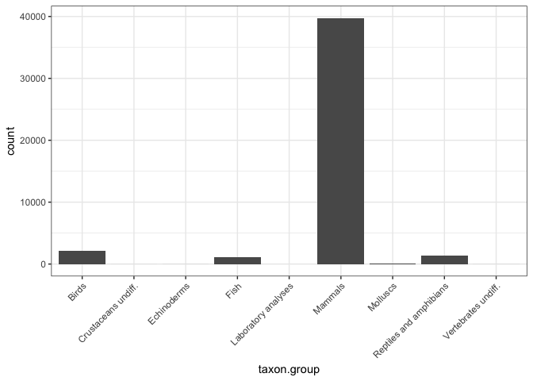
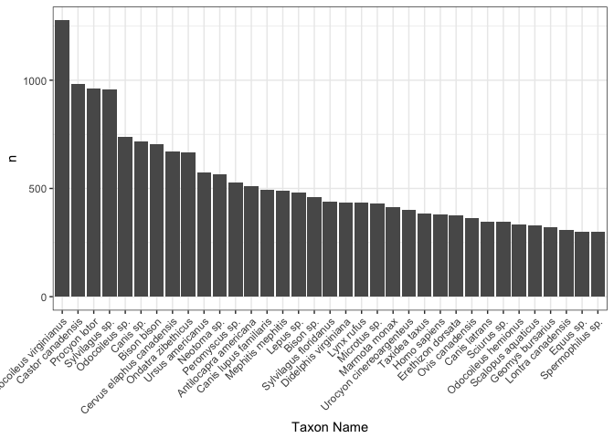

## About Neotoma

The first database I wanted to explore was Neotoma. Neotoma is a Paleoecological database that stores many different types of data. It focuses on  data from 5.333 million years ago (Paleocene) to now.  The majority of the data is from collection sites, where scientists collected and carefully characterized what they found and their best guess on the geological age in which it was collected. The  ranges from diatoms to pollen to insects and bones.  Bones! So cool. 

Neotoma is implemented in a Microsoft SQL server, but sadly my SQL skills are less then optimal. So I just googled "Neotoma R Package" and was so thrilled to find an API wrapper package which is part of my favorite R community [Ropensci](https://ropensci.org/)! The package is called [Neotoma](https://github.com/ropensci/neotoma) and it magically opened up all the data to me. I would like to immediately thank everyone who put in time to make this this tool, especially Simon Goring, who appears to have spear headed this project.

**Note**: If you are an SQL wizard, you are in luck, this database is extensive and has excellent documentation. You can read about all the details in the [Neotoma Database Manual](https://neotoma-manual.readthedocs.io/en/latest/neotoma_introduction.html).

## Set up


```r
## Libraries I used
library(devtools)
library(neotoma)
library(tidyverse)
library(ggmap)

## To install Neotoma
## install_github("ropensci/neotoma")
```

## Exploring with a short example

The `neotoma::get_table()` function allows you to retrieve whole datasets. This is a superfast way to get to the data as a data frame. Go here for a [list of all 63 the tables](http://api.neotomadb.org/doc/resources/dbtables). These can be accessed using `get_table()` function and is a way to search through the database by specific parameters. 

For instance, if you are interested in a particular species, age, altitude, ect. you can use the `neotoma::get_dataset`. Let's try searching by `taxonname`.

```r
## Smilodon = sabertooth tiger. 
## * = wildcard which means anything character after 
smilodon <- get_dataset(taxonname = 'Smilodon*') 
```

```
The API call was successful, you have returned 31 records.
```

If you call the `smilodon` object, you get a nice summary table of all the data.set.ids. The actual object structure you get back is a "large data list" of objects which include yet more lists of objects. 

```r
## Checking the structure of data returned
str(smilodon) # structure of whole object
str(smilodon[2]) #structure of one object in the list.
```

In the end, the get `get_dataset` function is giving you information about which datasets (and their IDs) include "Smilodon*" samples. The most important information is the dataset ID, which can guide you to more information about all the samples in these datasets because at this point, all you have is the dataset site information. At this point, you can use the `get_site()` function to get a nice data frame to actually use. 

```r
get_site(smilodon)
```

```
                                     site.name       long      lat elev
 Blackwater Draw Loc. 1                        -103.31667 34.28333 1280
 Avery Island                                   -91.75000 29.86667   NA
 Clamp Cave                                     -98.75000 31.11667   NA
 Friesenhahn Cave                               -98.36667 29.61667   NA
 First American Bank [40DV40]                   -86.78333 36.18333  113
 Rancho La Brea                                -118.35600 34.06294   54
 Rancho La Brea                                -118.35600 34.06294   54
 Rancho La Brea                                -118.35600 34.06294   54
 Rancho La Brea                                -118.35600 34.06294   54
 Rancho La Brea                                -118.35600 34.06294   54
 Rancho La Brea                                -118.35600 34.06294   54
 Rancho La Brea                                -118.35600 34.06294   54
 Hawver Cave [UCMP 1069]                       -120.86667 38.86667  393
 Maricopa [Maricopa Brea] [LACM 6731]          -119.36667 35.00000  305
 McKittrick [UCMP 1370]                        -119.61667 35.31667  300
 San Pedro Lumber Company [UCMP V2047]         -118.25000 33.75000   NA
 Carpinteria [LACM 139]                        -119.50500 34.38583   18
 ...
A site object containing 31 sites and 8 parameters.
```

There are a bunch of great functions to call the specific data you might be interested.  To look at all the functions this package has to offer, check out the [documentation](https://cran.r-project.org/web/packages/neotoma/neotoma.pdf).

## Exploring with large example

I basically want to visualize **everything** that the database has to offer. Of course that would mean downloading the entire database, which I shouldn't do because it is too big. I limited my question to an aspect of the dataset I was interested in: _What is the distribution of animal samples through time?_  

My R work flow is always motivated by the question: How do I get to a data frame that I can play with in ggplot? Which translates into organizing all the data that interests me into a data frame in the [tidy format](https://vita.had.co.nz/papers/tidy-data.pdf), where each sample is a row.

The key to getting all the data I wanted was the `get_data()` function which allows me to download all the data for a given site. I wanted all the species information in the `vertebrate fauna` dataset, which is still a lot of data, but manageable. 

To start I explored what was in these site datasets by just looking at two.

```r
IDs <- c(4657, 4560) # just grabbed two random ones
test <- get_download(IDs)
```

```
API call was successful. Returned record for Murphy's Old House[36AR129]
API call was successful. Returned record for Lindenmeier [5LR13]
```

```r
str(IDs)  # To look at the data structure of what I downloaded.
```

It seems that all the data I really want is in the `taxon.list` data frame and the `chronologies` info. 

In the `taxon.list` section I get a nice description of the sample. Including what kind of fragment I found (bone, antler, ect) and the `taxon.name`.

```r
head(test$`4560`$taxon.list, 5)
```

```
             taxon.name variable.units variable.element variable.context
1 Antilocapra americana            MNI       bone/tooth             <NA>
2 Antilocapra americana           NISP       bone/tooth             <NA>
3          Camelops sp.            MNI       bone/tooth      redeposited
4          Camelops sp.           NISP       bone/tooth      redeposited
5         Canis latrans            MNI       bone/tooth             <NA>
  taxon.group ecological.group                                    alias
1     Mammals             ARTI     Antilocapra americana|bone/tooth|MNI
2     Mammals             ARTI    Antilocapra americana|bone/tooth|NISP
3     Mammals             ARTI  Camelops sp.|redeposited|bone/tooth|MNI
4     Mammals             ARTI Camelops sp.|redeposited|bone/tooth|NISP
5     Mammals             CARN             Canis latrans|bone/tooth|MNI
```

In the chronologies section, I get one line defining when in time the excavation site represents, `age.older` and `age.younger` and how that age was determined, `age.type`.

```r
test$`4560`$chronologies
```

```
$`FAUNMAP 1.1`
  age.older age age.younger chronology.name             age.type
1     11200  NA        8400     FAUNMAP 1.1 Radiocarbon years BP
  chronology.id dataset.id
1          2039       4560
```

Therefore, to get to all of the data I am interested in I 1. got all the dataset IDs from all the `vertebrate fauna` datasets 2. designed an empty data frame to collect information and 3. used the IDs to retrieve the `taxon.list` and `chronologies` info on each record. 

To retrieve ALL THE DATA:

```r
## 1. Get all IDs
all_fauna <- get_dataset(datasettype = "vertebrate fauna") #3915 records
```

```
The API call was successful, you have returned 3919 records.
```

```r
IDs <- names(all_fauna)
IDs <- as.numeric(IDs)

## 2. Make empty dataframe to populate ALL THE DATA
output_df <- data.frame(matrix(ncol = 13, nrow = 0))
col_names <- c(colnames(test[[1]]$taxon.list), colnames(test[[1]]$dataset$site[1:4]), "iteration", "age.older", "age.younger")

colnames(output_df) <- col_names
head(output_df)
```

```
 [1] taxon.name       variable.units   variable.element variable.context
 [5] taxon.group      ecological.group site.id          site.name       
 [9] long             lat              iteration        age.older       
[13] age.younger     
<0 rows> (or 0-length row.names)
```

Now that I have a nice home for my data, I created a loop to download all the data from the Neotoma database. This takes a lot of time to run, I didn't time it, but be prepared to wait if you want to run this. **The finished dataframe can be downloaded**:  <a href="{{ site.baseurl }}/assets/downloads/all_fauna_data.csv" target="_blank">all_fauna_data.csv</a>

**Note**: Some of the chronologies had multiple dates for `age.older` and `age.younger`, so I had to just grab the first age. Look at [Neotoma database manual](http://neotoma-manual.readthedocs.io/en/latest/db_design_concepts.html#chronology) for how chronology is determined for each site.


```r
## 3. gimmie all the data
for (i in 1:length(names(all_fauna))){
    
    # gather info from each data ID in dataframe format
     temp_data <- all_fauna[[i]]$taxon.list[1:5]
     temp_data$site.id <- all_fauna[[i]]$dataset$site$site.id
     temp_data$site.name <- all_fauna[[i]]$dataset$site$site.name
     temp_data$long <- all_fauna[[i]]$dataset$site$long
     temp_data$lat <- all_fauna[[i]]$dataset$site$lat
     temp_data$lat <- all_fauna[[i]]$dataset$site$lat
     temp_data$iteration <- i
     
     ## Need to specify only first number, since many have multiple, age.older and age.younger dates
     ## Also, need to specify when null condition
     temp_data$age.older <- ifelse(is.null(all_data[[i]]$chronologies$`FAUNMAP 1.1`$age.older[1]) == FALSE, all_fauna[[i]]$chronologies$`FAUNMAP 1.1`$age.older[1], "NA")
     temp_data$age.younger <- ifelse(is.null(all_fauna[[i]]$chronologies$`FAUNMAP 1.1`$age.younger[1]) == FALSE, all_fauna[[i]]$chronologies$`FAUNMAP 1.1`$age.younger[1], "NA")
     
     # rbind to the rest
     output_df <- rbind(output_df, temp_data)
}

## Print out dataframe so I never have to run that loop again
## write.csv(output_df, "all_fauna_data.csv", row.names = FALSE)
```

## Checking and summarizing 

Yes! I have all the data I need to start exploring. What I love about this dataset is that it allows me to daydream about what it was like on earth thousands and millions of years ago. Each site is a time capsule documenting a a specific time in earth's history and the bones are from an animal that was once alive roaming the earth living and struggling to survive.

The first few questions I always ask pertain to just understanding the data.
What is this data? How much of it do I have? What is the distribution of sample types? This is actually one of my favorite parts of data analysis.

**Note**: I just read a great blog post by David Ranzolin: [The Data Analyst as Wanderer: Pre-Exploratory Data Analysis with R](https://daranzolin.github.io/articles/2018-01/preeda). It outlines how he approaches exploring data he has never seen before. 

If you didn't run chunk above, you can download: <a href="{{ site.baseurl }}/assets/downloads/all_fauna_data.csv" target="_blank">all_fauna_data.csv</a>

```r
## Read in from checkpoint
output_df <- read.csv("data/all_fauna_data.csv")

## Check out all the pretty data
str(output_df)
```

```
'data.frame':	44468 obs. of  13 variables:
 $ X               : int  1 2 3 4 5 6 7 8 9 10 ...
 $ taxon.name      : Factor w/ 1768 levels "?Alces alces",..: 127 157 190 244 248 762 839 916 1027 1061 ...
 $ variable.units  : Factor w/ 8 levels "1-4 scale","grams",..: 7 7 7 7 7 7 7 7 7 7 ...
 $ variable.element: Factor w/ 312 levels "antler","antorbital",..: 16 13 16 16 16 16 16 16 16 16 ...
 $ variable.context: Factor w/ 5 levels "articulated",..: NA NA NA NA NA NA NA NA NA NA ...
 $ taxon.group     : Factor w/ 9 levels "Birds","Crustaceans undiff.",..: 6 1 6 6 6 6 6 6 6 6 ...
 $ site.id         : int  3531 3531 3531 3531 3531 3531 3531 3531 3531 3531 ...
 $ site.name       : Factor w/ 3372 levels "101 Ranch","10AA15",..: 768 768 768 768 768 768 768 768 768 768 ...
 $ long            : num  -106 -106 -106 -106 -106 ...
 $ lat             : num  40.9 40.9 40.9 40.9 40.9 ...
 $ iteration       : int  1 1 1 1 1 1 1 1 1 1 ...
 $ age.older       : num  11980 11980 11980 11980 11980 ...
 $ age.younger     : num  1450 1450 1450 1450 1450 1450 1450 1450 1450 1450 ...
```

What is the size of this dataset? Great! I have 44,468 samples.

```r
dim(output_df) 
```

```
[1] 44468    13
```

## Visualizing 

What type of `taxon.groups` do I have? 

```r
## Summarize the taxon.groups
ggplot(output_df, aes(taxon.group)) + 
  geom_histogram(stat = "count") +
  theme_bw() +
  theme(axis.text.x = element_text(angle = 45, hjust = 1)) 
```


<!-- -->

Looks like the Fauna dataset is mostly made up of mammals anyway, so I am just going to remove anything else to narrow my questions a bit.

```r
mammals <- output_df %>% 
  filter(taxon.group == "Mammals") 
```

Great, I still have 39,739 samples.

```r
dim(mammals) 
```

```
[1] 39739    13
```

Out of all the bone, teeth, antler, fragments, what taxa are the most sampled?

```r
mammals %>% 
  count(taxon.name) %>% 
  top_n(35) %>%
  ggplot(., aes(x = reorder(taxon.name, -n), y = n)) +
    geom_bar(stat = "identity") +
    theme_bw() +
    theme(axis.text.x = element_text(angle = 45, hjust = 1)) +
    labs(x = "Taxon Name")
```

<!-- -->

I don't know what most of these species are! With the exception of *Bison bison* (which is Bison or buffalo) and *Homo sapiens*. To just explore a few of the other species I just Googled some ones that interested me. *Odocoileus virginianus* is white tail deer, which makes perfect sense - these guys are everywhere. The cotton tail rabbit, *Sylvilagus*, is represented twice, one as a subgenus and once as a specific species. Good to note in the future, taxon names can mean a few different things. I saw *Neotoma* and was like "wait, that's the database" and thought it was some error in the data, but really it is the sub-genus of pack rats! What a brilliant name for the database.  Bravo Neotoma database namer whomever you are. I like you.

Googling the taxa is taking too much time and there are, let's see...

```r
length(unique(mammals$taxon.name)) 
```

```
## [1] 1338
```

...1338 unique species/sub species represented in this data. Googling is going to take forever! It would be awesome if I could characterize them easier. Because doing any sort of visualization on 1,338 unique grouping will be confusing, I would like to represent them in higher order groups. AND OMG I CAN with another Ropensci package: [taxize](https://github.com/ropensci/taxize). This package even allows to find the common names of species easier, no more Googling each species one at a time. 

## Next Time

I am going to delve into the data a bit more, visualizing the distribution of data in time and space, interact with the [taxize](https://github.com/ropensci/taxize) database, and start asking what questions the data has to offer. 

## Thanks

Data were obtained from the [Neotoma Paleoecology Database](http://www.neotomadb.org), and the work of the data contributors and the Neotoma community is gratefully acknowledged.

## Resources 

-  [Neotoma Database Website](https://www.neotomadb.org/)
-  [Ropensci](https://ropensci.org/)


