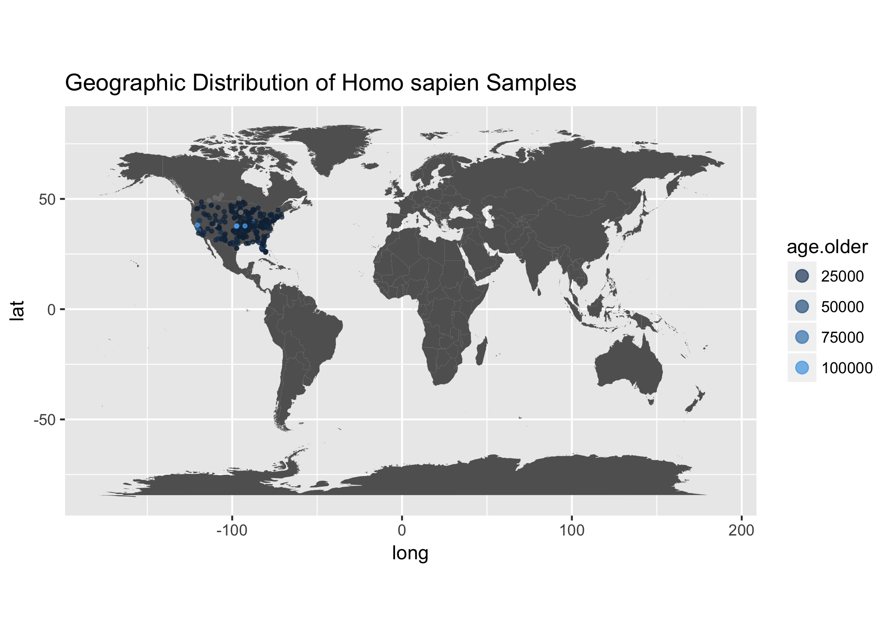
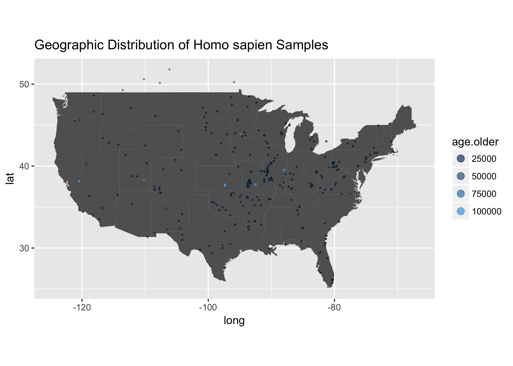
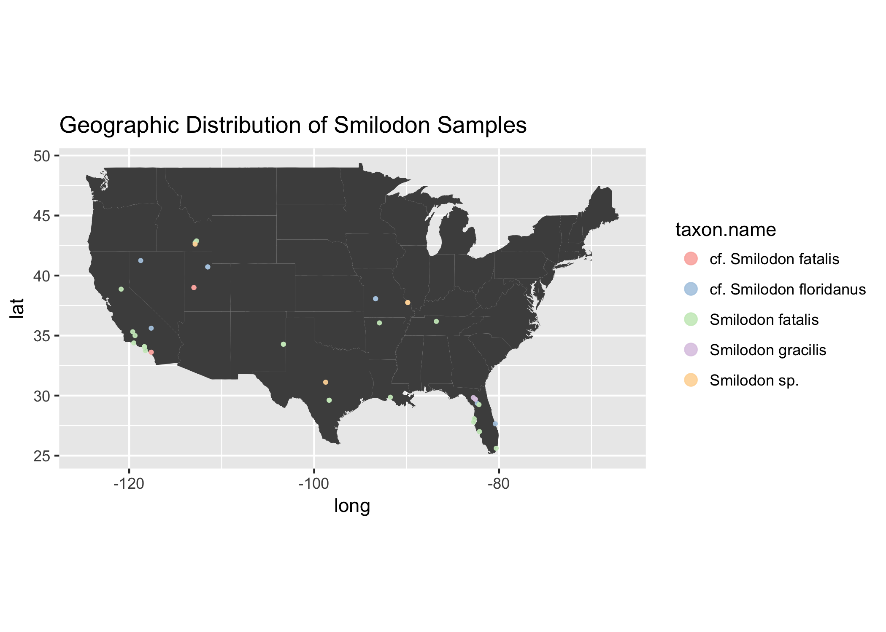
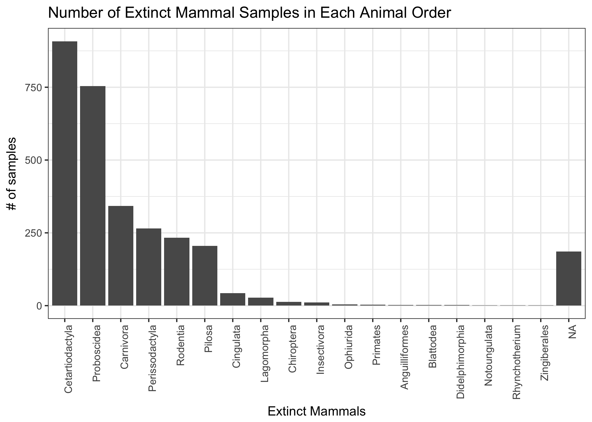
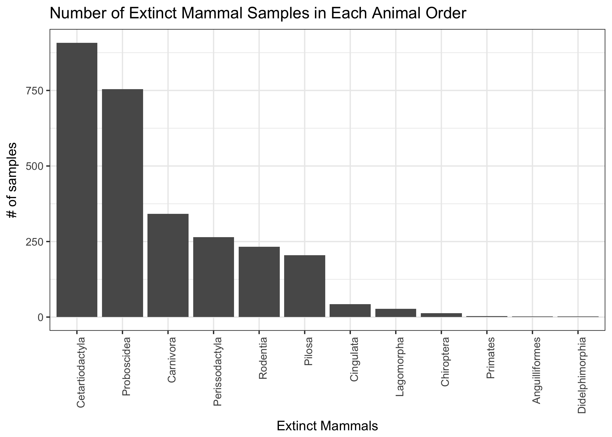
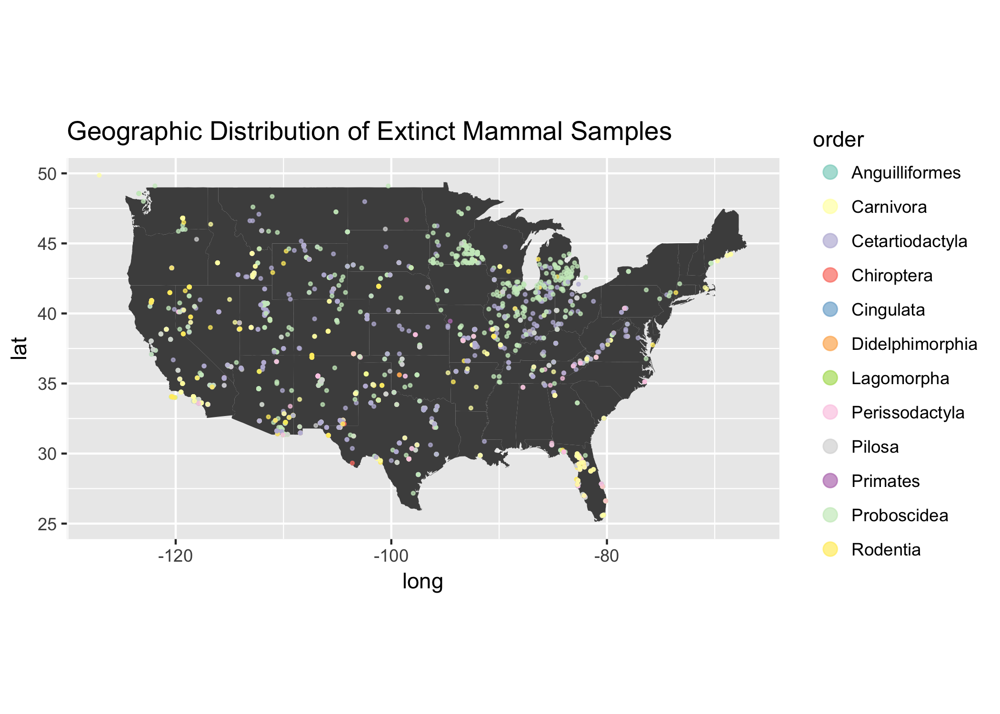
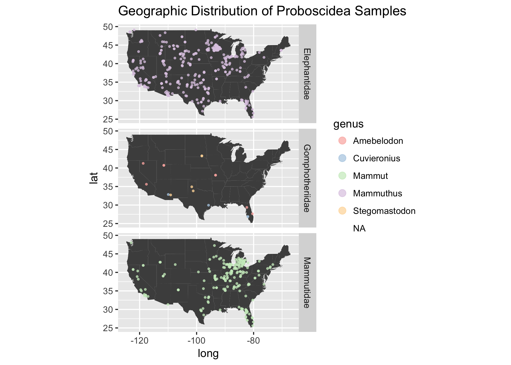
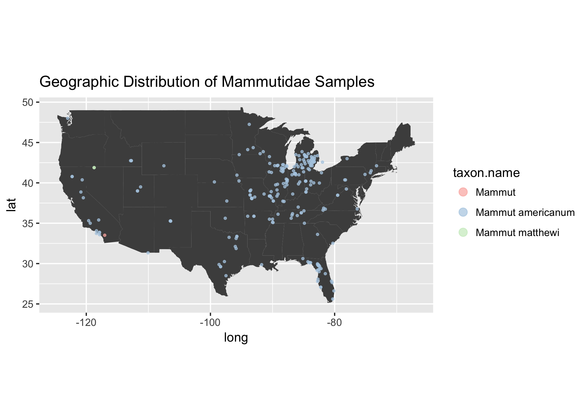

In the [previous post](https://cabinetofcuriosity.github.io/cabinetofcuriosity_site/retrieving-summary-neotoma/), we connected to the [Neotoma database](https://www.neotomadb.org/) which houses Paleoecological data from plants to animal. We isolated the fauna dataset which includes bone samples retreived from hundreds of dig sites. In this post we will explore the geographic distribution of exitinct mammal samples discovered across North America.  We will also learn how to interact with the `taxize` R package to retrieve comprehensive taxonomic information on each of our samples. 

You can download the data set that we created in the last post here: [all_fauna_data.csv](https://cabinetofcuriosity.github.io/cabinetofcuriosity_site/assets/downloads/all_fauna_data.csv). 

## Set Up

```r
library(ggplot2)
library(tidyverse)
library(skimr)
library(taxize)
```


```r
## Read in previous data.
all_fauna_data <- read.csv("../data/all_fauna_data.csv")

## subset only mammals
mammals <- all_fauna_data %>%
  filter(taxon.group == "Mammals")
```

First and foremost let's get re-familiar with our data. In the previous post, I used `str` and `head` to summarize our data, but now we want to know just a few more details about our data with a lot more style. So we are going to try out the fancy new [`skimr`](https://github.com/ropenscilabs/skimr) package....yet another Ropensci package.  I'm starting to think I will have to just re-name this blog to "Yet Another Ropensci Package".

Anyway, check out all the information you can get from `all_fauna_data` with `skimr`'s main function `skimr::skim`.


```r
skim(all_fauna_data) 
```

```
## Skim summary statistics
##  n obs: 44468 
##  n variables: 13 
## 
## Variable type: factor 
##          variable missing complete     n n_unique
##         site.name       0    44468 44468     3372
##       taxon.group       0    44468 44468        9
##        taxon.name       0    44468 44468     1768
##  variable.context   44260      208 44468        5
##  variable.element       0    44468 44468      312
##    variable.units       0    44468 44468        8
##                                    top_counts ordered
##        Dry: 292, Pec: 274, Zet: 245, Bry: 220   FALSE
##   Mam: 39739, Bir: 2115, Rep: 1364, Fis: 1126   FALSE
##      Odo: 1276, Ave: 1093, Cas: 981, Pro: 962   FALSE
##         NA: 44260, int: 121, art: 44, red: 32   FALSE
##    bon: 37079, bon: 3210, bon: 1244, bon: 932   FALSE
##  pre: 17936, NIS: 14271, MNI: 12155, MNE: 100   FALSE
## 
## Variable type: integer 
##   variable missing complete     n     mean       sd  p0      p25     p50
##  iteration       0    44468 44468  1621.6   1133.84   1   594.75  1511  
##    site.id       0    44468 44468  5641.98  2839.89 244  4064     4865  
##          X       0    44468 44468 22234.5  12836.95   1 11117.75 22234.5
##       p75  p100     hist
##   2539     3853 ▇▅▅▅▃▃▅▃
##   5760    16264 ▁▅▇▁▁▁▁▁
##  33351.25 44468 ▇▇▇▇▇▇▇▇
## 
## Variable type: numeric 
##     variable missing complete     n     mean       sd      p0     p25
##    age.older    5654    38814 44468 15553.07 50860.17   29    1000   
##  age.younger    5654    38814 44468  5314.49 21743.28    0     350   
##          lat       3    44465 44468    39.66     7.15  -18.68   35.62
##         long       3    44465 44468   -99.64    28.55 -176.62 -110.62
##      p50      p75       p100     hist
##  2200    11135    1500000    ▇▁▁▁▁▁▁▁
##   950     6700      4e+05    ▇▁▁▁▁▁▁▁
##    38.87    42.77      82.5  ▁▁▁▁▇▂▁▁
##   -99.12   -89        177.63 ▁▇▂▁▁▁▁▁
```

**Emoji Love interlude**: 😍😍😍 * 100.  This package is amazing!!! Please read about all the features on the [`skimr`](https://github.com/ropenscilabs/skimr) Github repo and [the blog post](https://ropensci.org/blog/2017/07/11/skimr/) describing the motivation and collaborative effort involved in making it. I just read it and I am bursting with love for the R community. Man. Now I just want to do a whole post on how 💣 bomb `skimr` is. 🔥🔥 AND yesterday, the [Rconsortium announced](https://www.r-consortium.org/announcement/2018/03/27/r-consortium-welcomes-r-ladies-as-a-top-level-project) that they are adding [RLadies](https://rladies.org/) as a top-level project! 🙆🏻 🤘⚡

## Mapping taxon onto a map

Right away I see that I have enough information to start visualizing species distributions in time. 


```r
# I have a love / hate relationship with this first species
humans <- mammals %>% 
  filter(taxon.name == "Homo sapiens" & long > -160) #ignoring samples out in the middle of the ocean

# Start with world
world <- map_data("world") 

ggplot() + 
  geom_polygon(data = world, 
               fill = "grey38", 
               aes(x = long, y = lat, group = group)) + 
  coord_fixed(1.3) +
  geom_point(data = humans, 
             aes(x = long, 
                 y = lat,
                 color = age.older),
             alpha = .7, size = .7) +
  scale_color_continuous(guide = guide_legend(title = "Age (years ago)"))  +
    guides(colour = guide_legend(override.aes = list(size = 3))) +
  ggtitle("Geographic Distribution of Homo sapien Samples")
```

<!-- -->

We notice that the sampling is skewed towards North America for sure! So let's zoom in on the United States.


```r
usa <- map_data("state") 

ggplot() + 
  geom_polygon(data = usa, 
               fill = "grey38", 
               aes(x = long, y = lat, group = group)) + 
  coord_fixed(1.3) +
  geom_point(data = humans, 
             aes(x = long, 
                 y = lat,
                 color = age.older),
             alpha = .7, size = .4) +
  guides(colour = guide_legend(override.aes = list(size = 3))) +
   ggtitle("Geographic Distribution of Homo sapien Samples") 
```

<!-- -->

Awesome! Looks like you can really see how the age of these samples are really skewed towards younger age samples. Which you can see clearly when you use `skimr`. 


```r
skim(mammals$age.older)
```

```
## Skim summary statistics
## 
## Variable type: numeric 
##           variable missing complete     n     mean       sd p0  p25  p50
##  mammals$age.older    3995    35744 39739 16256.64 52095.64 29 1000 2250
##    p75    p100     hist
##  11470 1500000 ▇▁▁▁▁▁▁▁
```

```r
skim(mammals$age.younger)
```

```
## Skim summary statistics
## 
## Variable type: numeric 
##             variable missing complete     n    mean       sd p0 p25  p50
##  mammals$age.younger    3995    35744 39739 5523.97 22507.27  0 350 1000
##   p75  p100     hist
##  7805 4e+05 ▇▁▁▁▁▁▁▁
```

Let's try another another genus, like a genus of Saber Tooth Tigers, *Smilodon*.


```r
smilodon <- mammals[grepl("Smilodon ", mammals$taxon.name),]

unique(smilodon$taxon.name) # looks like 5 unique categories.
```

```
## [1] Smilodon fatalis        cf. Smilodon fatalis    Smilodon sp.           
## [4] cf. Smilodon floridanus Smilodon gracilis      
## 1768 Levels: ?Alces alces ?Alces sp. ?Bison bison antiquus ... Zoarcoidei
```

```r
usa <- map_data("state") 

ggplot() + 
  geom_polygon(data = usa, fill = "grey30", 
               aes(x = long, y = lat, group = group)) + 
  coord_fixed(1.3) +
  geom_point(data = smilodon, 
             aes(x = long, y = lat, color = taxon.name),
             alpha = .9, size = .7) +
    scale_color_brewer(palette = "Pastel1") +
    theme(legend.key = element_rect(fill = "white")) +
    guides(colour = guide_legend(override.aes = list(size = 3))) +
    ggtitle("Geographic Distribution of Smilodon Samples")
```

<!-- -->

Ooooo Sabertooth Tigers seem to like warmer climates, that is, if North American climate during the times of these samples was anything like today's climate, which it wasn't really...

Now I can only go so far in exploring the data this way. The groupings of taxon is limited to species or genus, but what if I really want to see the distribution of higher order taxonomic groups. 
This is where taxize comes in.

## Adding taxonomic classifications with `taxize` 

[`taxize`](https://github.com/ropensci/taxize) is such a useful package. I cannot imagine doing work on biodiversiry data without this package. There have been a lot of people who have contributed to this package, but it looks like [Scott Chamberlain](https://twitter.com/sckottie) (R wizard, Ropensci co-founder, and fellow cat lover) is the main person behind these efforts. Thanks Scott and all you other [contributors](https://github.com/ropensci/taxize/graphs/contributors)! 

The `taxize` package provides a [nice tutorial](https://ropensci.org/tutorials/taxize_tutorial/) to get an overview of how to use the package. There are a lot of great functions to add meaning to any dataset with taxa/species names.  

For us to understand how to get the most out of `taxize` for this particular dataset, we should mess around with a smaller subset of species.  In this case, let's grab all the species we can find from the extinct genus [Mammuthus](https://en.wikipedia.org/wiki/Mammoth) (Mammoths). 

The main reason we want to use this package is to group the `taxon.name` information into something more digestible - for instance higher taxonomic groups (order, class, genus). 


```r
## Mammuthus is 
mammoth_test <- mammals[grepl("Mammuthus", mammals$taxon.name),]
unique(mammoth_test$taxon.name) # 16 unique Mammoth taxon names
```

```
##  [1] Mammuthus columbi            Mammuthus sp.               
##  [3] cf. Mammuthus columbi        cf. Mammuthus jeffersonii   
##  [5] Mammuthus primigenius        Mammuthus imperator         
##  [7] Mammuthus jeffersonii        Mammuthus cf. M. columbi    
##  [9] cf. Mammuthus sp.            Mammuthus exilis            
## [11] Mammuthus cf. M. primigenius Mammuthus cf. M. jeffersonii
## [13] Mammuthus cf. M. imperator   Mammuthus                   
## [15] ?Mammuthus sp.               cf. Mammuthus primigenius   
## 1768 Levels: ?Alces alces ?Alces sp. ?Bison bison antiquus ... Zoarcoidei
```

**Note 1**: The key to this package is that it is the glue that unites many databases and some of these databases require you to obtain an API key to access. See full list on the [Taxize Github site](https://github.com/ropensci/taxize).

**Note 2**: Omitted in this tutorial is where I basically played with many of the functions with different data sources. This package is so diverse because of the different databases it interacts with. Each database might have specific qualities for a data set.  I would play with different functions with different data sources quite a bit if you plan on using `taxize` for your own data set. We ended up using the [Open Tree of Life](https://tree.opentreeoflife.org/opentree/argus/opentree9.1@ott93302) (`tol`) database as a data source.

## Test of taxize with small example of Mammoth samples

The `taxize::classification` function works great using just the word "Mammuthus" and the Tree of Life Database.


```r
## Take a min to run
classification("Mammuthus", db = 'tol')
```

```
## $Mammuthus
##                    name       rank      id
## 1                  life    no rank  805080
## 2    cellular organisms    no rank   93302
## 3             Eukaryota     domain  304358
## 4          Opisthokonta    no rank  332573
## 5               Holozoa    no rank 5246131
## 6               Metazoa    kingdom  691846
## 7             Eumetazoa    no rank  641038
## 8             Bilateria    no rank  117569
## 9         Deuterostomia    no rank  147604
## 10             Chordata     phylum  125642
## 11             Craniata  subphylum  947318
## 12           Vertebrata  subphylum  801601
## 13        Gnathostomata superclass  278114
## 14           Teleostomi    no rank  114656
## 15         Euteleostomi    no rank  114654
## 16        Sarcopterygii      class  458402
## 17 Dipnotetrapodomorpha    no rank 4940726
## 18            Tetrapoda superclass  229562
## 19              Amniota    no rank  229560
## 20             Mammalia      class  244265
## 21               Theria   subclass  229558
## 22             Eutheria    no rank  683263
## 23           Afrotheria superorder  746703
## 24          Proboscidea      order  226176
## 25         Elephantidae     family  541924
## 26            Mammuthus      genus  106255
## 
## attr(,"class")
## [1] "classification"
## attr(,"db")
## [1] "tol"
```

But when we use the whole list, we run into taxa name problems. Some of the `taxon.name`s from Neotoma do not work well with `taxize` data sources. See below.


```r
## Does not like how my taxa.names are written
whole_mammoth_test <- classification(unique(mammoth_test$taxon.name), db = 'tol') 

## Show which species did not work
as.data.frame(is.na(whole_mammoth_test))
```

In order to get the most out of `taxize` we have to clean up the `taxon.names` so that Neotoma and Tree of Life work friendlier together. I grabbed a regex I saw from a Github gist Simon Goring  wrote [gist](https://gist.github.com/SimonGoring/24fb1228204f768f3f0020f37060db18) to help with the issue of cleaning up taxon name data.


```r
## From Simon 
## "This doesn't catch things like "sensu stricto" and others."

mammoth_test$taxon.name <- gsub("(\\?|\\-type|cf\\.\\s|aff\\.|\\sundiff\\.)", "", mammoth_test$taxon.name, perl = TRUE)

table(mammoth_test$taxon.name) # use table() to both view the new and improved Mammoth taxon.names, and to see how many samples fall under each name.
```

```
## 
##                Mammuthus        Mammuthus columbi         Mammuthus exilis 
##                        4                      102                        3 
##      Mammuthus imperator    Mammuthus jeffersonii     Mammuthus M. columbi 
##                        6                       18                       15 
##   Mammuthus M. imperator Mammuthus M. jeffersonii Mammuthus M. primigenius 
##                       20                       46                       17 
##    Mammuthus primigenius            Mammuthus sp. 
##                       33                      214
```

After cleaning `taxon.name` we get the taxonomic classifications for each species in the sample set. 


```r
clean_mammoth_test <- classification(unique(mammoth_test$taxon.name), db = 'tol') 

## Yay! Much better. No NAs.
as.data.frame(is.na(clean_mammoth_test))
```

```
##                          is.na(clean_mammoth_test)
## Mammuthus columbi                            FALSE
## Mammuthus sp.                                FALSE
## Mammuthus jeffersonii                        FALSE
## Mammuthus primigenius                        FALSE
## Mammuthus imperator                          FALSE
## Mammuthus M. columbi                         FALSE
## Mammuthus exilis                             FALSE
## Mammuthus M. primigenius                     FALSE
## Mammuthus M. jeffersonii                     FALSE
## Mammuthus M. imperator                       FALSE
## Mammuthus                                    FALSE
```

Now we want to extract  `order`, `family`, and `genus` in `clean_mammoth_test` and merge `mammoth_test`.


```r
get_phylogeny <- function(phylo_list) {
  #phylo list is the tree of life mammoth info data
  #taxon.name <- names(phylo_list) # the current taxa

  order <- phylo_list %>% 
              filter(rank == "order") %>% 
              {.$name}
  family <- phylo_list %>% 
              filter(rank == "family") %>%
              {.$name}
  genus <- phylo_list %>% 
              filter(rank == "genus") %>%
              {.$name}
  tmp_list <- list("order" = order,"family"=family,"genus"=genus)
  
  x <- phylo_list %>% 
    filter(rank %in% c("order", "family", "genus")) %>%
    select(-id) %>%
    spread(rank, name)
  
  if(dim(x)[2] != 3) { #probably need a better check here.
    missing <- setdiff(c("order", "family", "genus"), x$rank)
    add <- data.frame(name = rep(NA, length(missing)), rank=missing)
    x <- rbind(x, add)
   }
  tmp_list <- list("order"= x$order, "family"= x$family,"genus"= x$genus)
  return(tmp_list)
}

tol_classification_list <- sapply(clean_mammoth_test, get_phylogeny)
tol_classif <- as.data.frame(t(tol_classification_list))
tol_classif$taxon.name <- rownames(tol_classif)
rownames(tol_classif) <- NULL

merged <- merge(mammoth_test, tol_classif, by = "taxon.name")

## Lets take a peak of the dataset
merged %>%
  select(taxon.name, order, family, genus, lat, long, ) %>%
  head()
```

```
##          taxon.name       order       family     genus      lat       long
## 1         Mammuthus Proboscidea Elephantidae Mammuthus 43.62500  -99.29167
## 2         Mammuthus Proboscidea Elephantidae Mammuthus 33.51389 -117.02917
## 3         Mammuthus Proboscidea Elephantidae Mammuthus 45.90623 -112.02300
## 4         Mammuthus Proboscidea Elephantidae Mammuthus 29.61667  -98.36667
## 5 Mammuthus columbi Proboscidea Elephantidae Mammuthus 39.86667 -102.25000
## 6 Mammuthus columbi Proboscidea Elephantidae Mammuthus 39.50000 -105.06667
```

Looks good! 

**Note**: You can really do this with any subset of the Neotoma mammals dataset, but if you do it with the whole thing, it takes a long time and you need a tad more cleanup. Maybe we can go into this in another post.

## Apply to larger dataset - extinct species

While wondering around the Neotoma database I found out that if you use `neotoma::get_table` on the "taxa" dataset, you get a column that tells you if the animal is extinct or not. What is more interesting to extinct species? Nothing. Expecially in North America! There are Mammoths, huge armidillos, Saber Tooth Tigers, Giant Sloths and more!  

Let's try to get the taxonomic classifications of all the extinct animals.

First we subset by extinct taxa:

```r
neotoma_taxa <- neotoma::get_table("taxa")
extinct_taxa <- neotoma_taxa %>% 
  filter(Extinct == "TRUE")

## Find the intersect of extinct taxa and our mammal dataset
extinct_species_in_mammals <- intersect(extinct_taxa$TaxonName, mammals$taxon.name)

## Great! 383 of these extinct species are found in our
## mammal dataset.
skim(extinct_species_in_mammals)
```

```
## Skim summary statistics
## 
## Variable type: character 
##                    variable missing complete   n min max empty n_unique
##  extinct_species_in_mammals       0      383 383   6  39     0      383
```

Now let's subset our `mammals` dataset to include only extinct species.


```r
extinct_mammals <- mammals %>% 
                      filter(taxon.name %in% extinct_species_in_mammals)

## Check
## skim(extinct_mammals) 
nrow(extinct_mammals)
```

```
## [1] 3013
```

3,003 bone samples in our data set come from extinct animals. Now that we have a nice subset of our species, let's go ahead and use `taxize` to merge in genus, order, and family details for each sample.

### Clean

```r
extinct_mammals$taxon.name <- gsub("(\\?|\\-type|cf\\.\\s|aff\\.|\\sundiff\\.)", "", extinct_mammals$taxon.name, perl = TRUE)

# this species throws an error later
# during classification step, remove
extinct_mammals <- extinct_mammals %>% 
  filter(taxon.name != 'Ammospermophilus leucurus') 

## remove white space at the beginning taxon names, 
## if it exists, using the base function trimws()
extinct_mammals$taxon.name <- trimws(extinct_mammals$taxon.name)
```

### Prepare data frames

**Note**: You have to interact with the `taxize` package to manually pick the ambiguities in species. `taxize` will present all the possible species that it found and you can manually pick which one you intended. This is a really cool feature, but beware, if using R Markdown, this cell cannot be evaluated with knitr. 


```r
## Warning: This next line takes awhile to run. 
## and also requires manual interaction
## you can download data set below
## Manual selection key: 1, 0, 2, 0, 2, 1 
extinct_tol <- classification(unique(extinct_mammals$taxon.name), db = 'tol') 

## You end up with a list of dataframes. 
## One for each taxon.name input

length(names(extinct_tol[!is.na(extinct_tol)])) # 286 were classified
length(names((extinct_tol[is.na(extinct_tol)]))) #27 were not classified

## Keep only dataframes that are not NA
extinct_tol <- extinct_tol[!is.na(extinct_tol)]
```

### Make data frame to merge with 


```r
extinct_tol_list <- list()
for (i in 1:length(names(extinct_tol))) {
  taxon.name <- names(extinct_tol)[i]

  x <- extinct_tol[[i]] %>% 
    filter(rank %in% c("order", "family", "genus")) %>%
    select(-id)
  
  if(dim(x)[1] != 3) { #probably need a better check here.
    missing <- setdiff(c("order", "family", "genus"), x$rank)
    add <- data.frame(name = rep(NA, length(missing)), rank=missing)
    x <- rbind(x, add)
  }
  
  y <- c(taxon.name, as.character(x$name))
  names(y) <- c("taxon.name", "order", "family", "genus")
  extinct_tol_list[[i]] <- y

}


tol_classification <- as.data.frame(do.call(rbind, extinct_tol_list))
tol_classification[,5] <- NULL #whoops repeated column

extinct_merged <- merge(extinct_mammals, tol_classification, by = "taxon.name", all.x = TRUE)
dim(extinct_merged)

## Write out
## write.csv(extinct_merged, "../data/part2_extinct_merged_27March2018_caryn.csv", row.names = FALSE)
```

## Visualizing extinct animals

Now we have a nice data set of all the extinct mammals bone samples found in the Neotoma database. So exciting. Let's start visualizing to 1. make sure everything is correct 2. See if there are patterns in the data to start exploring further. 

You can download the data set here: <a href="{{ site.baseurl }}/assets/downloads/extinct_mammals.csv" target="_blank">extinct_mammals.csv</a>

```r
## Read in data frame
extinct_merged <- read.csv("../data/part2_extinct_merged_27March2018.csv")

extinct_merged %>%
  group_by(order) %>%
  count() %>%
    ggplot(., aes(reorder(x = order, -n), y = n)) + 
      geom_bar(stat = "identity") +
      theme_bw() +
      theme(axis.text.x = element_text(angle = 90, hjust = 1)) +
      xlab("Extinct Mammals") +
      ylab("# of samples") +
      ggtitle("Number of Extinct Mammal Samples in Each Animal Order")
```

<!-- -->

There are 18 different orders of species, with the most abundant being *Cetarticodactyla* or [even-toed undulates](https://en.wikipedia.org/wiki/Even-toed_ungulate). There are also orders that are clearly not supposed to be there. I may not know animal taxonomic information very well, but for sure I know plants. *Zingerberales* is not supposed to be here!

I tried using `taxize` to retrieve the common names, but in the end, I could not easily. I ended up just Googling each one and actually had wayyyyy too much fun doing it. I figured out which are animals and which are not and made a list for subsetting. It may not be programmatically reproducible, but that's okay because I learned so much. 


```r
orders_to_keep <- c("Rodentia", "Proboscidea", "Pilosa", "Perissodactyla", "Lagomorpha", "Didelphimorphia", "Cingulata", "Chiroptera", "Cetartiodactyla", "Carnivora", "Anguilliformes", "Primates")	

extinct_merged %>% 	
  filter(order %in% orders_to_keep) %>%	
  group_by(order) %>%	
  count %>%	
  ggplot(., aes(reorder(x = order, -n), y = n)) + 
    geom_bar(stat = "identity") +
    theme_bw() +	
    theme(axis.text.x = element_text(angle = 90, hjust = 1)) +
    xlab("Extinct Mammals") +
    ylab("# of samples") +
  ggtitle("Number of Extinct Mammal Samples in Each Animal Order")
```

<!-- -->

### Visualize on map

So cool!


```r
usa <- map_data("state") 

extinct_merged %>%
  filter(order %in% orders_to_keep) %>%
  filter(lat < 50) %>%
    ggplot(.) + 
      geom_polygon(data = usa, 
              fill = "grey30", 
              aes(x = long, y = lat, group = group)) +
      coord_fixed(1.3) +
      geom_point( aes(x = long, y = lat, color = order),  
             alpha = .7, size = .5) +
  scale_color_brewer(palette = "Set3") +
  theme(legend.key = element_rect(fill = "white")) +
  guides(colour = guide_legend(override.aes = list(size = 3))) +
  ggtitle("Geographic Distribution of Extinct Mammal Samples")
```

<!-- -->

What is going on with the Animal Order *Proboscidea*? 

We see some clustering in Michigan, let's break that down a little bit to see what is going on. 

**Note**: [*Proboscidea*](https://en.wikipedia.org/wiki/Proboscidea) is the animal order in which elephants belong. Interestingly, the only *Proboscidea* two species left on earth are in  [Elephantidae](https://en.wikipedia.org/wiki/Elephantidae) 😭🐘 


```r
extinct_merged %>%
  filter(order %in% orders_to_keep) %>%
  filter(order == "Proboscidea") %>%
  filter(lat < 50) %>%
    ggplot(.) + 
      geom_polygon(data = usa, 
              fill = "grey30", 
              aes(x = long, y = lat, group = group)) +
      coord_fixed(1.3) +
      geom_point( aes(x = long, y = lat, color = genus ),  
             alpha = .7, size = .6) +
    scale_color_brewer(palette = "Pastel1") +
    theme(legend.key = element_rect(fill = "white")) +
    guides(colour = guide_legend(override.aes = list(size = 3))) +
    facet_grid(family~.) +
    ggtitle("Geographic Distribution of Proboscidea Samples")
```

<!-- -->

Wow! This is awesome. I didn't really know anything about [Gomphothere](https://en.wikipedia.org/wiki/Gomphothere) before. This family is distinct from elephants and became extinct before Elephants and Mammoths / Mastodons, so it makes sense the scarcity of samples in the North America during these times. They were slowly replaced by modern elephants until their extinction around 10,000 years ago.


```r
extinct_merged %>%
  filter(order %in% orders_to_keep) %>%
  filter(order == "Proboscidea") %>%
  skim(age.older)
```

```
## Skim summary statistics
##  n obs: 754 
##  n variables: 17 
## 
## Variable type: numeric 
##   variable missing complete   n     mean       sd   p0   p25   p50    p75
##  age.older     162      592 754 57976.92 46002.23 1150 15000 35000 110000
##    p100     hist
##  160000 ▇▃▁▁▁▇▁▁
```

That Michigan cluster of samples seems to be prodomidently from the [Mammutidae](https://en.wikipedia.org/wiki/Mammutidae) Family. 


```r
extinct_merged %>%
  filter(order %in% orders_to_keep) %>%
  filter(family == "Mammutidae") %>%
  filter(lat < 50) %>%
    ggplot(.) + 
      geom_polygon(data = usa, 
              fill = "grey30", 
              aes(x = long, y = lat, group = group)) +
      coord_fixed(1.3) +
      geom_point( aes(x = long, y = lat, color = taxon.name ),  
             alpha = .7, size = .7) +
    scale_color_brewer(palette="Pastel1") +
    theme(legend.key = element_rect(fill = "white")) +
    guides(colour = guide_legend(override.aes = list(size = 3))) +
    ggtitle("Geographic Distribution of Mammutidae Samples")
```

<!-- -->

The majority of the taxa is made up of Mastodon samples [*Mammut americanum*](https://en.wikipedia.org/wiki/Mastodon), which apparently were the most successful North American *Proboscidea* species. 

## Incorporation of More Data

I wanted to see if I could make sense of the habitat of these species or climate during the Pliocene to map onto the plot, but unfortunatley I could not find mappable data. I wish I had [this papers](https://www.researchgate.net/publication/37456896_Modelling_Middle_Pliocene_warm_climates_of_the_USA) data. This is a question I had many times during these this analysis.  Does anyone know where we can get predicted ancient global temperature? 

As we explore more databases we hope to gain a better understanding of the data available and how they can be combined to provide insights into our natural world. 

Stay tuned for more exploration!

## Resources

- [Neotoma R Package on Github](https://github.com/ropensci/neotoma)
- [2017 Workshop Neotoma](https://github.com/NeotomaDB/Workshops/blob/master/IBS2017/R/Workshop_IBS2017_v0.3.pdf)
- [Simon's Neotoma Taxize Gist](https://gist.github.com/SimonGoring/24fb1228204f768f3f0020f37060db18)
- [Cleaning species names with Taxize tutorial](http://viktoriawagner.weebly.com/blog/cleaning-species-names-with-r-ii-taxize)


