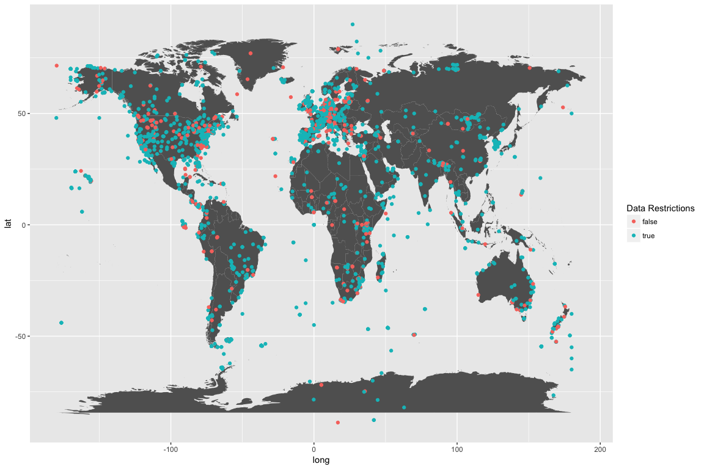
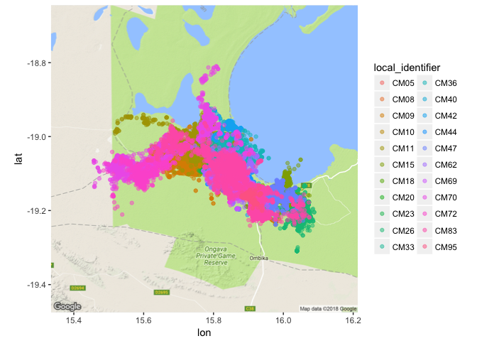

The next biological data source that we are going to investigate is [Movebank](https://www.movebank.org/). They say what they are best:

> We help animal tracking researchers to manage, share, protect, analyze, and archive their data. The animal tracking data in Movebank belongs to researchers all over the world who choose whether and how to share their data with the public.

Movebank is hosted by the [Max Planck Institude for Ornithology](http://www.orn.mpg.de/en), and, anecdotally, many of the data sets available are of birds species.
The general model of Movebank is that the researchers who do submit their data retain ownership and have a choice to make their data publicly available.
And, the owners of the data specify the terms of use.

This is a little different than some other databases I've seen, but also often the data involved can represent years of work in the field.
It also made accessing and interacting with the data on a bulk scale difficult and next to impossible, but we'll get to that.

The data in Movebank is **cool**. I was inspired by the book [Where Animals Go](http://wheretheanimalsgo.com/), which one my advisers in graduate school gave to me as a parting gift.
It's an incredible book and I was struck by how beautiful and informative the tracking data for animals was.
It's an intimate look at how animals behave, and presents some cool opportunities for data visualization, statistical analysis, and modeling.

The breakdown of accessing and analyzing Movebank data will take place in several parts.
Part I, this post, will discuss how to access and download data from Movebank, and show what type of data variables you can expect to find.
Later parts will discuss parsing date and time data, and increase the complexity of data analysis and modeling. 

## Become a Movebank user

In order to download data from Movebank directly, you must be a user. 
Become a user is free, and you can sign up [here](https://www.movebank.org/user/register).

To follow along with this series of posts, we will make the data available for the rest of the tutorial.

The data we're using falls under the general Movebank Terms of Use, which you can read [here](https://www.movebank.org/node/1934).
We are not using this data for any commercial use, and only intend it to show what Movebank has to offer, and to show some cool R libraries for data analysis and visualizations.

# Accessing Movebank Data

## Installing `move`

*Note*: If you just want to download the data and don't care about how we accessed Movebank, skip to the summarizing data section. We just use `move` to download data, and not for analysis.

To access data on movebank, you can interact with the [Movebank Tracking Data Map](https://www.movebank.org/panel_embedded_movebank_webapp), which is quite fun.


And there is also an R package that will interact with the website called, appropriately, [`move`](https://cran.r-project.org/web/packages/move/index.html). 

However, it has a dependency that was not straightforward for me to download. 
There is an R package called rgdal, which requires the software [GDAL](http://www.gdal.org/), Geospatial Data Abstraction Library.

To install this, I used [homebrew](https://brew.sh/), which is an incredible tool to install software if you are not familiar with it.

I used the brew recipe.  Type in your terminal (not in R):

```{}
brew install gdal
```

This worked well for me, and after this I was able to install `rgdal` and `move` without a problem:


```r
install.packages("rgdal")
install.packages("move")
```

Post any issues you have installing these libraries in the comments bellow and we'll try to help you out!

If everything has been installed correctly - load the move library:


```r
library(move)
```

# Getting to know `move`

As Ciera did with [neomata](link to post) and [taxize](link to post), I'm going to take a few moments to show what I learned while getting familiar with the library `move`.
This is a pretty big part of becoming good at certain functions and libraries - to read the manuals, do any provided or discovered tutorials, and to just *play* with the library.

`move` provides the ability to access Movebank, which is useful, and it also uses other libraries and the GDAL to analyze the GPS data, which is new to me.
Here's a [link to manual](https://cran.r-project.org/web/packages/move/vignettes/move.pdf).

Create an object to store your Movebank login information. 


```r
#fill in your username and passwords here
loginStored <- movebankLogin(username = <username>, password = <password>)
```

The organization of the data in Movebank is centralized around each study, and researchers can upload their data from various different types of sensors.
We are going to be focusing on GPS sensors, but there are also accelerometers, radio transmitters, Argos Doppler, barometers, bind ring (I don't know what that is but it sounds cool), solar geolocator, and good ol' natural mark recording with human eyeballs.

It's useful to know the scope of the database you are searching. 
I initially thought I could get clever and get all the animals found in Movebank by getting all the study ids (with a combination of the functions `getMovebankStudies()` and `getMovebankID()`), but you cannot get around their data sharing policy that way.
Any study you may want to download, you must go online and agree to the terms for using that data before completing the download here in R.

But we can get basic information on all of the studies that allow some kind of access to their data using the `getMovebank()` function:


```r
all_studies <- getMovebank(entity_type = "study", login=loginStored)
dim(all_studies)
```

```
## [1] 2413   28
```


```r
head(all_studies$name)
```

```
## [1] Army Ant colony movement Touchton    
## [2] Christmas Island Red Crabs           
## [3] Sooty Falcon Javed UAE               
## [4] bird                                 
## [5] Dalmatian Pelicans Ortaç Onmuş Turkey
## [6] Taita Hills birds project, Kenya     
## 2350 Levels: _dcd_test_dup_location_1sec_offset ...
```
Hmmm, looking at some of these study names, the authors of those studies don't seem to have practiced any type of repeating, standard naming procedure. That would make it difficult to parse out all animal names - and so could be a project for a later date.

Something we can do is map where these studies generally take place.


```r
library(ggplot2)
world <- map_data("world")

ggplot() +
  geom_polygon(data = world,
               fill = "grey38",
               aes(x = long, y = lat, group = group)) +
  geom_point(data = all_studies, 
             aes(x = main_location_long, y = main_location_lat, color = as.factor(there_are_data_which_i_cannot_see))) +
  scale_color_discrete(guide = guide_legend(title = "Data Restrictions"))
```

```
## Warning: Removed 3 rows containing missing values (geom_point).
```

<!-- -->

The color of these points indicates if there are any restrictions on the availability of the data. Anything labeled false has all the data available.
There are 435 studies that have all of their data available for download (after agreeing to the general Movebank privacy).

We can also examine the different types of sensors used in Movebank:


```r
getMovebank("tag_type", loginStored)
```

```
##    description            external_id       id is_location_sensor
## 1           NA              bird-ring      397               true
## 2           NA                    gps      653               true
## 3           NA      radio-transmitter      673               true
## 4           NA    argos-doppler-shift    82798               true
## 5           NA           natural-mark  2365682               true
## 6           NA           acceleration  2365683              false
## 7           NA       solar-geolocator  3886361               true
## 8           NA accessory-measurements  7842954              false
## 9           NA   solar-geolocator-raw  9301403              false
## 10          NA              barometer 77740391              false
## 11          NA           magnetometer 77740402              false
##                      name
## 1               Bird Ring
## 2                     GPS
## 3       Radio Transmitter
## 4     Argos Doppler Shift
## 5            Natural Mark
## 6            Acceleration
## 7        Solar Geolocator
## 8  Accessory Measurements
## 9    Solar Geolocator Raw
## 10              Barometer
## 11           Magnetometer
```

This returns a table with the different types of sensors, and a numeric tag assigned to each sensor. 
Unfortunately, at this time I don't see how to filter the studies by sensor type without first selecting a specific study. 
Which is a bummer, because I'm pretty curious about these bird-ring sensors, and would like to filter the studies based on that!

Besides filtering the downloaded database above, we can also use the `searchMovebankStudies()` function to search for terms in study names.


```r
searchMovebankStudies(x="coyote", login=loginStored)
```

```
## [1] "Site fidelity in cougars and coyotes, Utah/Idaho USA (data from Mahoney et al. 2016)"
```

```r
head(searchMovebankStudies(x="oose", loginStored))
```

```
## [1] "ABoVE: NPS Moose in the Upper Koyokuk Alaska"          
## [2] "ABoVE: Peters Hebblewhite Alberta-BC Moose"            
## [3] "Barnacle goose (Greenland)   Larry Griffin/David Cabot"
## [4] "Barnacle goose (Svalbard)    Larry Griffin"            
## [5] "Bean Goose Anser fabalis Finnmark."                    
## [6] "Bean Goose QIA KoEco China 2015 FAO"
```

```r
head(searchMovebankStudies(x="bird", login = loginStored))
```

```
## [1] "2018 Magnificent Frigatebird - Cayman Islands "                       
## [2] "African riparian birds Kenya"                                         
## [3] "AKseabird"                                                            
## [4] "All CTT birds deployed BOEM"                                          
## [5] "Antbirds, Panama"                                                     
## [6] "Arctic breeding shorebirds; Rausch; various Canadian arctic locations"
```

So many studies to chose from!

Get the study ID to see how many animals are in the study.


```r
ID <- getMovebankID(study = "Black-backed jackal, Etosha National Park, Namibia", login=loginStored)
head(getMovebankAnimals(study = ID, login = loginStored))
```

```
##   individual_id    tag_id sensor_type_id tag_local_identifier
## 1     346406120 304884475            653                AU200
## 2     346406121 304884486            653                AU205
## 3     346406122 304884490            653                AU206
## 4     346406123 304884493            653                AU215
## 5     346406124 304884496            653                AU210
## 6     346406125 304884499            653                AU211
##   deployment_id comments death_comments earliest_date_born
## 1     346406151       NA             NA                 NA
## 2     346406161       NA             NA                 NA
## 3     346406150       NA             NA                 NA
## 4     346406167       NA             NA                 NA
## 5     346406158       NA             NA                 NA
## 6     346406156       NA             NA                 NA
##   exact_date_of_birth latest_date_born local_identifier nick_name ring_id
## 1                  NA               NA             CM05        NA      NA
## 2                  NA               NA             CM08        NA      NA
## 3                  NA               NA             CM09        NA      NA
## 4                  NA               NA             CM10        NA      NA
## 5                  NA               NA             CM11        NA      NA
## 6                  NA               NA             CM15        NA      NA
##   sex taxon_canonical_name     animalName
## 1   m                   NA CM05_346406151
## 2   m                   NA CM08_346406161
## 3   m                   NA CM09_346406150
## 4   m                   NA CM10_346406167
## 5   m                   NA CM11_346406158
## 6   m                   NA CM15_346406156
```

I like this study because it has many individuals, and their genders are identified. 
Many studies on Movebank are of a small number, one or two, and the information about the animals is not always available. 
Also, I've always kind of liked jackals, in a romantic, scrappy under-dog way. I really like coyotes, and they kind of seem like coyotes to me. Good enough! Let's download.


```r
# be patient
jackals <- getMovebankData(study = "Black-backed jackal, Etosha National Park, Namibia", login = loginStored, removeDuplicatedTimestamps = TRUE)
```


If you're following along, this was a pretty slow step for me.
Also, there is a warning about the option `removeDuplicatedTimestamps = TRUE`, however the data download fails if this is set to false.

This step returned a `move` object which seems to have a lot of excess information. Right now, all I want is information about the individuals they retrieved data from, and the location data over time, and the information to connect them. 


```r
idData <- jackals@idData
jackal_movement <- jackals@data
jackal_id_movement <- jackals@trackId
jackal_movement$local_identifier <- jackal_id_movement
str(jackal_movement)
```

```
## 'data.frame':	130686 obs. of  10 variables:
##  $ sensor_type_id  : int  653 653 653 653 653 653 653 653 653 653 ...
##  $ location_lat    : num  -19.1 -19.1 -19.1 -19.1 -19 ...
##  $ location_long   : num  15.8 15.8 15.8 15.8 15.8 ...
##  $ timestamp       : POSIXct, format: "2009-02-07 00:01:20" "2009-02-07 01:00:38" ...
##  $ update_ts       : Factor w/ 1 level "2017-09-05 17:41:27.589": 1 1 1 1 1 1 1 1 1 1 ...
##  $ deployment_id   : int  346406151 346406151 346406151 346406151 346406151 346406151 346406151 346406151 346406151 346406151 ...
##  $ event_id        : num  3.65e+09 3.65e+09 3.65e+09 3.65e+09 3.65e+09 ...
##  $ tag_id          : int  304884475 304884475 304884475 304884475 304884475 304884475 304884475 304884475 304884475 304884475 ...
##  $ sensor_type     : Factor w/ 1 level "GPS": 1 1 1 1 1 1 1 1 1 1 ...
##  $ local_identifier: Factor w/ 22 levels "CM05","CM08",..: 1 1 1 1 1 1 1 1 1 1 ...
```

This has created a data frame what has 130,686 rows, where each row contains the GPS location of an individual at a point in time.

Overall, I found interacting with the `move` library to be kind of frustrating. 
I really want to search through what a database has available and download a data frame without any bells and whistles. If you know what data set you want, going to the website and downloading the data through their data browsers gives you a flat comma separated file that is much easier to work with.


# Summarizing and cleaning data

Download the dataset I just created as a comma separated file here: [black-backed-jackal-Namibia.csv](https://cabinetofcuriosity.github.io/cabinetofcuriosity_site/assets/downloads/black-backed-jackal-Namibia.csv)

Create the `jackal_movement` data frame by reading the dataset into R:

```r
jackal_movement <- read.table(file = "black-backed-jackal-Namibia.csv", header=T, sep=",")
```
Once you have acquired the data, the next step is to get a sense of what you can expect from the data, and if there are any missing values or weird-looking outlier data.

First, I usually like to get an idea of what types of values my data frame currently contains, and if I need to transform those values at all.


```r
str(jackal_movement)
```

```
## 'data.frame':	130686 obs. of  10 variables:
##  $ sensor_type_id  : int  653 653 653 653 653 653 653 653 653 653 ...
##  $ location_lat    : num  -19.1 -19.1 -19.1 -19.1 -19 ...
##  $ location_long   : num  15.8 15.8 15.8 15.8 15.8 ...
##  $ timestamp       : POSIXct, format: "2009-02-07 00:01:20" "2009-02-07 01:00:38" ...
##  $ update_ts       : Factor w/ 1 level "2017-09-05 17:41:27.589": 1 1 1 1 1 1 1 1 1 1 ...
##  $ deployment_id   : int  346406151 346406151 346406151 346406151 346406151 346406151 346406151 346406151 346406151 346406151 ...
##  $ event_id        : num  3.65e+09 3.65e+09 3.65e+09 3.65e+09 3.65e+09 ...
##  $ tag_id          : int  304884475 304884475 304884475 304884475 304884475 304884475 304884475 304884475 304884475 304884475 ...
##  $ sensor_type     : Factor w/ 1 level "GPS": 1 1 1 1 1 1 1 1 1 1 ...
##  $ local_identifier: Factor w/ 22 levels "CM05","CM08",..: 1 1 1 1 1 1 1 1 1 1 ...
```

My data frame is a mix of integers, numeric values, factors, and POSIXct values, which we will explain in more detail in a later post.

It's really important to check for missing values, and to get a sense of the range of values in your data set. As Ciera introduced in the previous posts, the `skimr` package is really wonderful for this.

```r
library(skimr)

skim(jackal_movement)
```

```
## Skim summary statistics
##  n obs: 130686 
##  n variables: 10 
## 
## Variable type: factor 
##          variable missing complete      n n_unique
##  local_identifier       0   130686 130686       22
##       sensor_type       0   130686 130686        1
##         update_ts       0   130686 130686        1
##                                      top_counts ordered
##  CM0: 11827, CM1: 11508, CM4: 11358, CM1: 11148   FALSE
##                              GPS: 130686, NA: 0   FALSE
##                              201: 130686, NA: 0   FALSE
## 
## Variable type: integer 
##        variable missing complete      n        mean    sd          p0
##   deployment_id       0   130686 130686     3.5e+08  5.42     3.5e+08
##  sensor_type_id       0   130686 130686   653        0      653      
##          tag_id       0   130686 130686 3e+08       23.66 3e+08      
##          p25      median         p75        p100     hist
##      3.5e+08     3.5e+08     3.5e+08     3.5e+08 ▅▂▃▇▆▆▇▂
##    653         653         653         653       ▁▁▁▇▁▁▁▁
##  3e+08       3e+08       3e+08       3e+08       ▃▇▃▇▃▆▁▅
## 
## Variable type: numeric 
##       variable missing complete      n      mean        sd        p0
##       event_id       0   130686 130686   3.7e+09 37726.81    3.7e+09
##   location_lat       0   130686 130686 -19.11        0.066 -19.31   
##  location_long       0   130686 130686  15.87        0.12   15.46   
##        p25    median       p75      p100     hist
##    3.7e+09   3.7e+09   3.7e+09   3.7e+09 ▇▇▇▇▇▇▇▇
##  -19.16    -19.12    -19.06    -18.81    ▁▂▇▆▅▁▁▁
##   15.78     15.89     15.96     16.09    ▁▁▁▃▂▇▂▃
## 
## Variable type: POSIXct 
##   variable missing complete      n        min        max     median
##  timestamp       0   130686 130686 2009-02-07 2011-01-16 2009-10-11
##  n_unique
##    112242
```

`skim()` automatically splits up my data by variable type and summarizes each type, and packs a ton of information into the summary.
What I can quickly see is that I have no missing values for any of my variables - this is good! But you're not done quite yet.
Reading in data can make quite a few assumptions about what is and what is not labeled a missing value. 
Here, a missing value is an `NA`, but what if someone spelled out `not available` and put that into the data set? Or `missing` or just left it blank. We'll quickly check for these situations in a quick and dirty way.


```r
table(jackal_movement$local_identifier)
```

```
## 
##  CM05  CM08  CM09  CM10  CM11  CM15  CM18  CM20  CM23  CM26  CM33  CM36 
##  1873  3374 11827  1235 11508 11148   884   712  1481 10795  5522  3128 
##  CM40  CM42  CM44  CM47  CM62  CM69  CM70  CM72  CM83  CM95 
##  7311  2662  9914 11358  9532 10025  3982  2875  8101  1439
```

I use table to visually see what factors I have for a variable, and it's helpful to see the distribution of data for each factor. Here, we know that all of the local identifiers have some even and predictable naming scheme, that there are no totally mis-labeled factors, and that the data is not evenly distributed between the individual jackals. 
Some jackals had their GPS trackers on for much longer than others.

I'm not going to check the other factors with `table()`, because I can see that they only have one value and that it is complete.

I can also use the `skim()` results to to check on the integer and numeric values, and to get a sense of their distributions. 
Later, we're mainly going to be using local identifier, event id, and the latitude and longitude information.
Deployment id and tag id seem to be associated with a specific GPS device, and provides redundant information as the local identifier.
The sensor type is a single value, which probably means GPS in this situation. (Many data sets on Movebank have different types of sensors, so that is something to pay attention to if you are downloading other data sets.)

The event id is a sequential number, where each row of my data set has a unique event id. This will be incredibly useful later. 

I can use `range()` to verify what `skim()` appears to be showing for latitude and longitude - that there do not appear (at this level of analysis) to be weird ouliers.


```r
range(jackal_movement$location_lat)
range(jackal_movement$location_long)
```

```
## [1] -19.30973 -18.80921
## [1] 15.45767 16.08849
```

It should be said that Movebank likely has researchers clean their data before uploading it, which made this part pretty easy.
It's never safe to assume that your data is clean! Always check it out.

# Wrap Up

To wrap up this post, I'm going to do some pretty simple visualizations - because knowing you have a clean data set is pretty satisfying but not that visually compelling.

```r
library(tidyverse)
library(ggmap)
```


```r
jackal_box <- make_bbox(lon = location_long, lat = location_lat, data=jackal_movement, f= 0.1)
jackal_map <- get_map(location = jackal_box, source = 'google', maptype = 'terrain')
```

```r
ggmap(jackal_map) + geom_point(data=jackal_movement, aes(x=location_long, y=location_lat))
```

<!-- -->


```r
ggmap(jackal_map) + geom_point(data=jackal_movement, aes(x=location_long, y=location_lat, color=local_identifier), alpha = 0.5)
```

<!-- -->

In the next post, I will parse out the timestamp data and the fun will start with some analysis!

**Session Info:**

```r
Sessioninfo()
```

```
## R version 3.4.0 (2017-04-21)
## Platform: x86_64-apple-darwin15.6.0 (64-bit)
## Running under: OS X El Capitan 10.11.6

## Matrix products: default
## BLAS: /System/Library/Frameworks/Accelerate.framework/Versions/A/Frameworks/vecLib.framework/Versions/A/libBLAS.dylib
## LAPACK: /System/Library/Frameworks/Accelerate.framework/Versions/A/Frameworks/vecLib.framework/Versions/A/libLAPACK.dylib

## locale:
## [1] en_US.UTF-8/en_US.UTF-8/en_US.UTF-8/C/en_US.UTF-8/en_US.UTF-8

## attached base packages:
## [1] stats     graphics  grDevices utils     datasets  methods   base     

## other attached packages:
## [1] maps_3.2.0      ggplot2_2.2.1   move_3.0.2      rgdal_1.2-18    raster_2.6-7    sp_1.2-7       
## [7] geosphere_1.5-7

## loaded via a namespace (and not attached):
##  [1] Rcpp_0.12.16     knitr_1.20       xml2_1.2.0       magrittr_1.5     munsell_0.4.3   
##  [6] colorspace_1.3-2 lattice_0.20-35  R6_2.2.2         rlang_0.2.0      plyr_1.8.4      
## [11] stringr_1.3.0    httr_1.3.1       tools_3.4.0      parallel_3.4.0   grid_3.4.0      
## [16] gtable_0.2.0     htmltools_0.3.6  lazyeval_0.2.1   yaml_2.1.18      digest_0.6.15   
## [21] rprojroot_1.3-2  tibble_1.4.2     curl_3.1         evaluate_0.10.1  rmarkdown_1.9   
## [26] labeling_0.3     stringi_1.1.7    pillar_1.2.1     compiler_3.4.0   scales_0.5.0    
## [31] backports_1.1.2 
```
