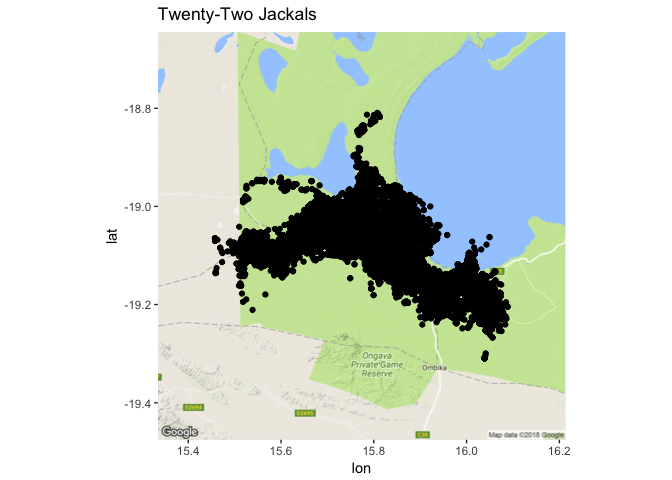

In my [previous post](https://cabinetofcuriosity.github.io/cabinetofcuriosity_site/movebank-part1/), I talked about the awesome data resource that is Movebank, and how I acquired data from that source. 
I gathered data on a pack of jackals, collected in Namibia from 2009 to 2011, and did a bit of general summarizing.

In this post we'll start getting down and dirty with parsing and categorizing the data in this data set. We will explore the [POSIXct data type](http://www.cyclismo.org/tutorial/R/time.html), which is a useful way of representing time in R. 
Since dealing with time series data across spatial ranges can be bit tricky, I  will also present some useful strategies I learned that can hopefully be useful to others who wish to track animal movement data.
I'm going to continue with the data set from Part 1 of this post, which you can find here: [black-backed-jackal-Namibia.csv](https://cabinetofcuriosity.github.io/cabinetofcuriosity_site/assets/downloads/black-backed-jackal-Namibia.csv)

# Set Up


```r
library(tidyverse)
library(ggmap)
```

I **really** love tidyverse since I started using it about a year ago. But I'm always learning more. 

I recently learned that the tidyverse function `read_csv()` behaves differently from the base R function `read.csv()`.
It probably does so in a few ways, but I now prefer the `read_csv()` from tidyverse for a few reasons: it does not make character strings into factors, 
and here it automatically formats the timestamp variable into a POSIXct data type.
If you're new to R, don't worry about this right now - just know that this may be saving you some hassle.


```r
jackals <- read_csv("../2018-04-03_movebank_part1/data/black-backed-jackal-Namibia.csv")
```

```
## Parsed with column specification:
## cols(
##   sensor_type_id = col_integer(),
##   location_lat = col_double(),
##   location_long = col_double(),
##   timestamp = col_datetime(format = ""),
##   update_ts = col_datetime(format = ""),
##   deployment_id = col_integer(),
##   event_id = col_double(),
##   tag_id = col_integer(),
##   sensor_type = col_character(),
##   local_identifier = col_character()
## )
```

A quick reminder of what is in this data set. 

This is a data.frame object with 130686 rows, where each row is an independent event record of a latitude and longitude reading from a GPS device attached to one of 22 individuals.
Each event has a timestamp, and event_id, a latitude, a longitude, and a code to identify which individual the data point is associated with.


```r
colnames(jackals)
```

```
##  [1] "sensor_type_id"   "location_lat"     "location_long"   
##  [4] "timestamp"        "update_ts"        "deployment_id"   
##  [7] "event_id"         "tag_id"           "sensor_type"     
## [10] "local_identifier"
```

```r
head(jackals)
```

```
## # A tibble: 6 x 10
##   sensor_type_id location_lat location_long timestamp          
##            <int>        <dbl>         <dbl> <dttm>             
## 1            653        -19.1          15.8 2009-02-07 00:01:20
## 2            653        -19.1          15.8 2009-02-07 01:00:38
## 3            653        -19.1          15.8 2009-02-07 02:00:38
## 4            653        -19.1          15.8 2009-02-07 03:00:45
## 5            653        -19.0          15.8 2009-02-07 04:00:50
## 6            653        -19.0          15.8 2009-02-07 05:00:38
## # ... with 6 more variables: update_ts <dttm>, deployment_id <int>,
## #   event_id <dbl>, tag_id <int>, sensor_type <chr>,
## #   local_identifier <chr>
```

### Mapping object

Here, for plotting and mapping purposes, I'm going to make a map object for the points I'll be plotting.
You can do this independently for any subset of the jackals data that you would like, but I have found that I like to plot the individuals on a map the same size as the whole data set so that I can understand the scope of the individual's data compared to the whole.


```r
## preparing the map for output later
jackals_bbox <- make_bbox(lon = location_long, lat = location_lat, data = jackals, f = 0.1)
jackals_map <- get_map(location = jackals_bbox, maptype = 'terrain', source = 'google')
```

```
## Source : https://maps.googleapis.com/maps/api/staticmap?center=-19.05947,15.77308&zoom=10&size=640x640&scale=2&maptype=terrain&language=en-EN
```

I'll be using this map to plot all points I've subsetted from the jackals data set bellow, unless otherwise stated.

# Re-introduction to the data

We can first just use the individual identifiers to do some analysis on the data set, before we get into discussing and parsing the timestamp variable.

Each individual jackal can have different number of GPS events recorded. I can show this in two ways, along with some other summarizing statistics about the GPS.


```r
individual_summary <- jackals %>%
  group_by(local_identifier) %>%
  summarise(number_of_events = n_distinct(event_id), 
            Longitude_min = min(location_long),
            Longitude_max = max(location_long),
            Latitude_min = min(location_lat),
            Latitude_max = max(location_long))
head(individual_summary)
```

```
## # A tibble: 6 x 6
##   local_identifier number_of_events Longitude_min Longitude_max
##   <chr>                       <int>         <dbl>         <dbl>
## 1 CM05                         1873          15.7          15.9
## 2 CM08                         3374          15.6          15.8
## 3 CM09                        11827          15.6          16.0
## 4 CM10                         1235          15.7          15.8
## 5 CM11                        11508          15.5          15.9
## 6 CM15                        11148          15.9          16.1
## # ... with 2 more variables: Latitude_min <dbl>, Latitude_max <dbl>
```

It's hard to interpret the latitude and longitude summarizing statistics, because I don't have a very intuitive sense of how those grid numbers convert to a distance metric I do have intuitive sense for. This is perhaps a good topic for a future post!

But, we did see from the map last week and this summary table that they are pretty tight knit - it is, after all, a pack of jackals.


```r
ggmap(jackals_map) + 
  geom_point(data=jackals, aes(x=location_long, y=location_lat)) +
  ggtitle("Twenty-Two Jackals")
```

<!-- -->

There is a great deal of overplotting there. There are 22 individuals over 3 years in there (2009 - 2011) and more 130,000 points, so we're not going to be able to see much here without teasing that black clump of dots apart a bit.

I'm also going to take a bit of time to play around the `geom_path` function of ggplot2, because I used to have trouble getting the arguments right.

To do this, I'm going to graph the points of one individual jackal, CM18, which has fewer data points (around 800, compared to say, 11,000), and they are spread out, which will make it easier to see what is going on.
CM18 only had data collected for three months in 2009.


```r
CM18 <- jackals %>%
  filter(local_identifier == "CM18")

ggmap(jackals_map) +
  geom_point(data = CM18, aes(x=location_long, y = location_lat, color = timestamp)) +
  ggtitle("Jackal CM18, Feruary - April 2009")
```

<!-- -->

Here, I'm using the `timestamp` variable to add information to the jackal's movement as a continuous variable.

The two obvious ggplot2 options are `geom_line()` and `geom_path()`. The important distinction is how each of these functions connects the data.

`geom_line()` connects the data in the order that is plotted along the x-axis.
This is not useful for us in the sense of mapping where the jackal moved over time, as you can see below:


```r
CM18 %>%
  ggplot(aes(x=location_long, y = location_lat)) + 
    geom_point(aes(color=timestamp)) + geom_line() + ggtitle("Incorrect connection of location points with geom_line()")
```

<!-- -->

This does not make any sense. It might make sense if a time were on the x-axis. 

Instead we want to use `geom_path()`. `geom_path()` connects the data of a group in the order that it appears in the data frame.


```r
CM18 %>%
  ggplot(aes(x=location_long, y = location_lat)) + geom_point(aes(color=timestamp))+ geom_path() + ggtitle("CM18: connection of jackal location data over time")
```

<!-- -->

There still seems to be some path connections that don't make intuitive sense, but this is getting close to what I want. We'll be able to tease apart the movement more when we parse the `timestamp` variable.

# Parsing out dates with `lubridate`


```r
library(lubridate)
```

Because I used the tidyverse function `read_csv()` to load in my data, the timestamp variable is already of a class POSIXct variable. 
If you used the base function `read.csv()` to load the data from, it will be a character vector, or a factor, depending on how your configured your arguments.
If your timestamp variable is character vector, run the below code to change it to a class POSIXct variable.
Variables of the class POSIXct are useful because R recognizes this class as either a date or a date-time variable.
To make this character vector a POSIXct vector, I would use lubridate's `ymd_hms()` function.


```r
#only run this is the timestamp variable is a character!
str(jackals$timestamp)
jackals <- jackals %>%
  transform(timestamp = ymd_hms(timestamp))
str(jackals$timestamp)
```

This is useful, but I also want to break out the timestamp variable in to pieces - year, month, hour, and day of the year (`yday`).


```r
jackals <- jackals %>%
  mutate(year = year(timestamp),
         month = month(timestamp),
         month_label = month(timestamp, label = TRUE),
         yday = yday(timestamp),
         hour = hour(timestamp))
jackals %>% head()
```

```
## # A tibble: 6 x 15
##   sensor_type_id location_lat location_long timestamp          
##            <int>        <dbl>         <dbl> <dttm>             
## 1            653        -19.1          15.8 2009-02-07 00:01:20
## 2            653        -19.1          15.8 2009-02-07 01:00:38
## 3            653        -19.1          15.8 2009-02-07 02:00:38
## 4            653        -19.1          15.8 2009-02-07 03:00:45
## 5            653        -19.0          15.8 2009-02-07 04:00:50
## 6            653        -19.0          15.8 2009-02-07 05:00:38
## # ... with 11 more variables: update_ts <dttm>, deployment_id <int>,
## #   event_id <dbl>, tag_id <int>, sensor_type <chr>,
## #   local_identifier <chr>, year <dbl>, month <dbl>, month_label <ord>,
## #   yday <dbl>, hour <int>
```

Now, I can do some nifty plotting with facets to compare across months and years. 
We'll take another look at one individual jackal, CM18.


```r
# because we mutated the jackal data.frame, we must recreate the CM18 data.frame
CM18 <- jackals %>%
  filter(local_identifier == "CM18") 

ggmap(jackals_map) + 
  geom_point(data = CM18, aes(x=location_long, y = location_lat, color = hour), alpha = 0.5, size = 1) +
  facet_wrap(~month_label*year) +
  scale_color_gradient2(low = "dark grey", mid = "red", high = "dark grey", midpoint = 12) +
  theme(strip.text.x = element_text(size = 16), axis.text = element_text(size = 12)) + ggtitle("CM18: Monthly Movement")
```

<!-- -->

Here, I've colored the points so that the darker the red, the more toward the middle of the day.

But it's really hard to see much, so if we use jackal CM44 (who has data points over a span of two years), we can show the month using color.
However, this does not get rid of the over-plotting issue - which we may not be able to get rid of with this data set. It turns out that these jackals don't move very far.


```r
CM44 <- jackals %>%
  filter(local_identifier == "CM44")

ggmap(jackals_map) + 
  geom_point(data = CM44, aes(x=location_long, y = location_lat, color = month_label), alpha = 0.5) + 
  facet_wrap(~ year) + ggtitle("CM44: Yearly Movement") +  theme(strip.text.x = element_text(size = 12))
```

<!-- -->

Or we can look at an individual and a specific month, and use `geom_path()` to track each day's movement.


```r
CM18_march <- jackals %>%
  filter(local_identifier == "CM18" & month == 3)

ggmap(jackals_map) +
    geom_point(data = CM18_march, aes(x=location_long, y = location_lat, group = yday,color=hour), alpha = 0.5, size = 2) +
    geom_path(data = CM18_march, aes(x=location_long, y = location_lat, group = yday)) + 
  facet_wrap(~yday, nrow = 4) +
  scale_color_gradient2(low = "dark grey", mid = "red", high = "dark grey", midpoint = 12) +
  theme(strip.text.x = element_text(size = 12), axis.text.y = element_text(size = 12))
```

<!-- -->

Let's zoom in on a specific day, to get some sense of how this jackal might be moving.


```r
CM18_march <- jackals %>%
  filter(local_identifier == "CM18" & yday == 71)

ggmap(jackals_map) +
    geom_point(data = CM18_march, aes(x=location_long, y = location_lat, group = yday,color=hour), alpha = 0.4, size = 3 ) +
    geom_path(data = CM18_march, aes(x=location_long, y = location_lat, group = yday))  + scale_color_gradient2(low = "dark grey", mid = "red", high = "dark grey", midpoint = 12)
```

<!-- -->

Here we can see that there are indeed some hours where the jackal moves quite rapidly, compared to others.
Between the hours of 6am and noon, the jackal made a quick trip out.
And other hours of the day the jackal spends in a single location, perhaps hunkering down to avoid the heat and to sleep.

# Jackals in April

Let's do some summarizing of the data. 

How many data points were collected for each year? For each individual? 


```r
jackals %>%
  group_by(year) %>%
  tally()
```

```
## # A tibble: 3 x 2
##    year     n
##   <dbl> <int>
## 1 2009. 78506
## 2 2010. 51872
## 3 2011.   308
```

```r
jackals %>%
  group_by(year, month_label) %>%
  summarise(n_individuals = n_distinct(local_identifier))
```

```
## # A tibble: 24 x 3
## # Groups:   year [?]
##     year month_label n_individuals
##    <dbl> <ord>               <int>
##  1 2009. Feb                     8
##  2 2009. Mar                    11
##  3 2009. Apr                    15
##  4 2009. May                    13
##  5 2009. Jun                    10
##  6 2009. Jul                    11
##  7 2009. Aug                     9
##  8 2009. Sep                     8
##  9 2009. Oct                     8
## 10 2009. Nov                     8
## # ... with 14 more rows
```

But, the year 2009 had the most data collected overall, and the month of April in 2009 had the most individuals with sensors. 
But if we plot that number of individuals with sensors over time...


```r
jackals %>%
  mutate(ym = parse_date_time(format(timestamp, "%Y-%m"), orders = "Ym")) %>% 
  group_by(ym) %>%
  summarise(n_individuals = n_distinct(local_identifier)) %>%
  ggplot(aes(x = ym, y = n_individuals)) + geom_line() + xlab("Time")
```

<!-- -->

Hm, it looks like there is a story of dwindling numbers here, or a end to the study and the deployment of new sensors.

Let's focus on the month of April 2009, and look at their movement.


```r
apr2009 <- jackals %>%
  filter(year == 2009, month == 4)

ggmap(jackals_map) + 
  geom_point(data = apr2009, aes(x = location_long, y = location_lat, color=local_identifier), alpha = 0.5) +
  ggtitle("Jackals in April 2009")
```

<!-- -->


```r
ggmap(jackals_map) + 
  geom_point(data = apr2009, aes(x = location_long, y = location_lat, color=local_identifier), alpha = 0.5) +
  facet_wrap(~yday) +
  theme(strip.text.x = element_text(size = 12), legend.text = element_text(size = 15)) +
  ggtitle("April 2009, by day")
```

<!-- -->

It's interesting that even in a relatively small space, the jackals actually keep fairly separate and don't seem to actually be in a pack. Or behaving in a pack behaviors as I understand them or think about them, like with coyotes or wolves. But I'm also a plant biologist by training, so... &shrug&

And let's just break down a single day


```r
aprl2009 <- jackals %>%
  filter(year == 2009 & yday == 118) %>%
  mutate(time_of_day = ifelse(hour <= 10 & hour >= 4, "morning", ifelse(hour > 10 & hour <= 16, "midday", ifelse(hour > 16 & hour < 20, "evening", "night"))))
```

Man, that is a confusing series of `ifelse()` statements. But what I am doing is conditionally filling in a new column, called `time_of_day` where I have made time more categorical rather than continuous. 
Between the hours of 4am and 10am, it is "morning", then between 10am and 4pm it is "midday"", and then between 4pm and 8pm it is "evening", and the time between 8pm and 4am it is "night".

Now that I have binned time into categories, I can also plot by these categories.


```r
ggmap(jackals_map) +
  geom_point(data = aprl2009, aes(x = location_long, y = location_lat, color = local_identifier), alpha = 0.5) +
  facet_wrap(~time_of_day) + ggtitle("A day in April 2009")
```

<!-- -->

Cool! When I bin the time like this I can see that the jackals are the most active at night, the least active during the midday, and middling-ly active in the morning and in the evening.

# Summary

We learned a lot in this blog post. A lot about the jackals, and a lot about how to parse and categorize data.

Here's a quick summary:

* I used `read_csv()` to format my data from the get-go. No factors, and the `timestamp` variable is a POSIXct variable already
* I took a look at various ways to plot the movement of one jackal - with `geom_path()` and using facets
* I parsed the `timestamp` variable into single variables such as month, year, day of the year, and hour with `lubridate`
* I looked at the whole pack at a time stamp, and found that the pack remained fairly separate
* I made a continuous variable discrete by binning it into categories
* I looked at movement over a short period of time, and observed that the jackals move the least during midday

This is fun exploratory work. In our next post, Ciera and I will use these general observations to do some analysis of this pack.


```r
sessionInfo()
```

```
## R version 3.3.0 (2016-05-03)
## Platform: x86_64-apple-darwin13.4.0 (64-bit)
## Running under: OS X 10.11.6 (El Capitan)
## 
## locale:
## [1] en_US.UTF-8/en_US.UTF-8/en_US.UTF-8/C/en_US.UTF-8/en_US.UTF-8
## 
## attached base packages:
## [1] stats     graphics  grDevices utils     datasets  methods   base     
## 
## other attached packages:
##  [1] lubridate_1.7.4 bindrcpp_0.2.2  ggmap_2.7.900   forcats_0.3.0  
##  [5] stringr_1.3.0   dplyr_0.7.4     purrr_0.2.4     readr_1.1.1    
##  [9] tidyr_0.8.0     tibble_1.4.2    ggplot2_2.2.1   tidyverse_1.2.1
## 
## loaded via a namespace (and not attached):
##  [1] reshape2_1.4.3    haven_1.1.1       lattice_0.20-35  
##  [4] colorspace_1.3-2  htmltools_0.3.6   yaml_2.1.18      
##  [7] utf8_1.1.3        rlang_0.2.0       pillar_1.2.1     
## [10] foreign_0.8-69    glue_1.2.0        modelr_0.1.1     
## [13] readxl_1.0.0      jpeg_0.1-8        bindr_0.1.1      
## [16] plyr_1.8.4        munsell_0.4.3     gtable_0.2.0     
## [19] cellranger_1.1.0  rvest_0.3.2       RgoogleMaps_1.4.1
## [22] psych_1.8.3.3     evaluate_0.10.1   labeling_0.3     
## [25] knitr_1.20        parallel_3.3.0    broom_0.4.4      
## [28] Rcpp_0.12.16      scales_0.5.0      backports_1.1.2  
## [31] jsonlite_1.5      mnormt_1.5-5      rjson_0.2.15     
## [34] hms_0.4.2         png_0.1-7         digest_0.6.15    
## [37] stringi_1.1.7     grid_3.3.0        rprojroot_1.3-2  
## [40] cli_1.0.0         tools_3.3.0       bitops_1.0-6     
## [43] magrittr_1.5      lazyeval_0.2.1    crayon_1.3.4     
## [46] pkgconfig_2.0.1   xml2_1.2.0        assertthat_0.2.0 
## [49] rmarkdown_1.9     httr_1.3.1        rstudioapi_0.7   
## [52] R6_2.2.2          nlme_3.1-131
```
