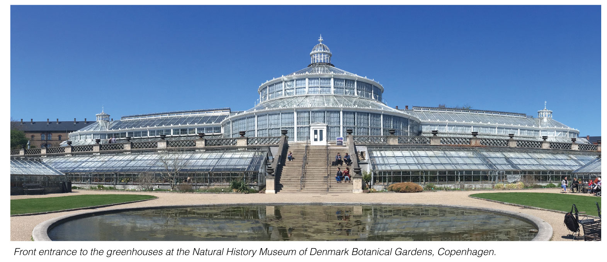
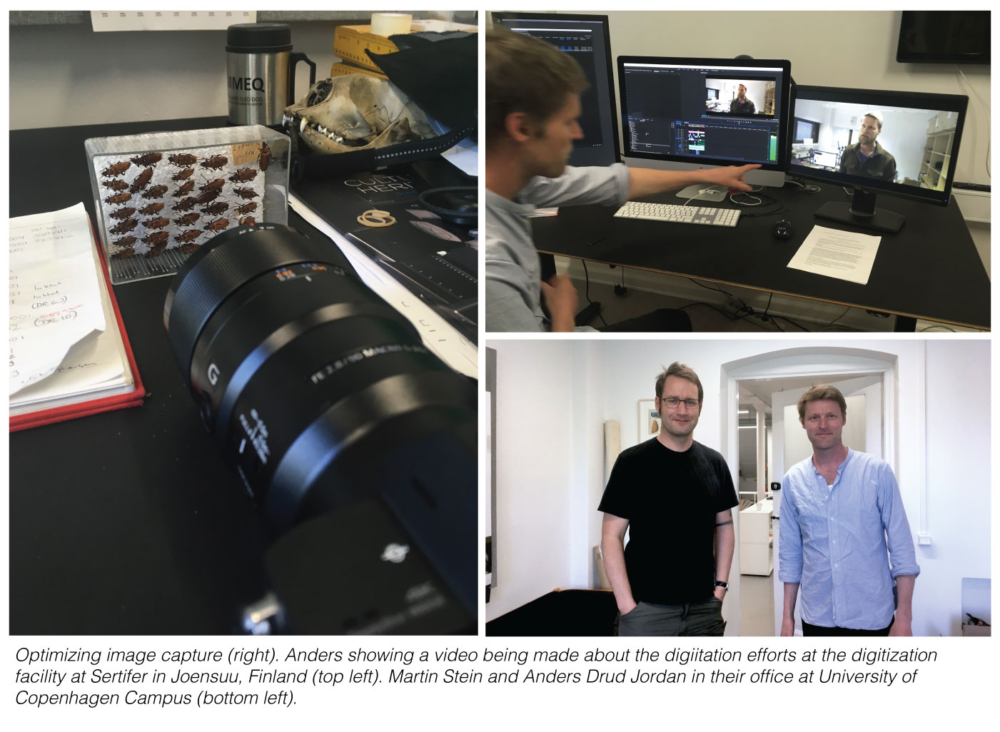
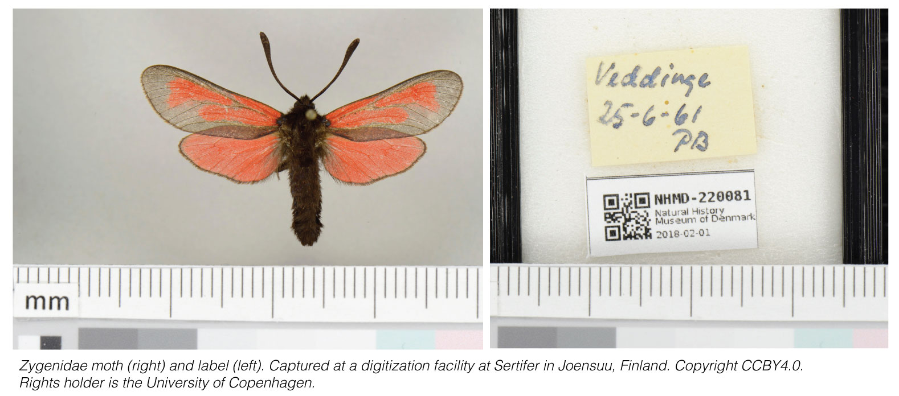
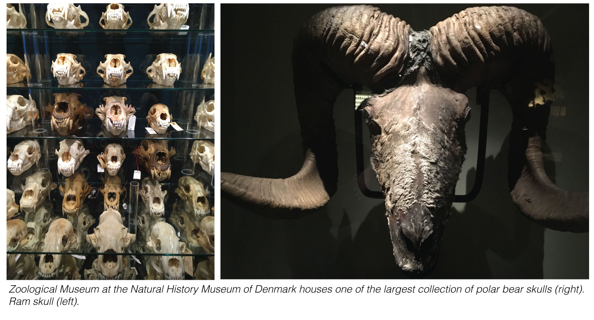
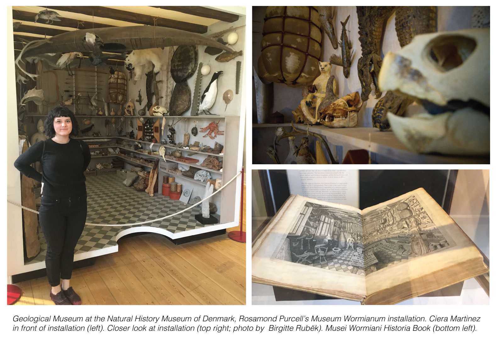

I was fortunate enough to visit Copenhagen a few weeks ago and couldn't resist tracking down the people involved with digitizing the National Museum of Denmark's Collections. I sat down with Dr. Anders Drud Jordan and Dr. Martin Stein to discuss how they are approaching digitizing their collections and their perspective on the motivations, challenges, and culture surrounding the global effort to make natural history data open. I met them at their offices located in Central Copenhagen, which fortunate for me, resides in a park that houses an absolutely stunning Botanical garden and the University of Copenhagen Geological Museum.

When I arrived their work space was bustling with activity and excitement for the addition of a new computer dedicated to the digitization efforts (which arrived during my visit). While one room was being housed with the new computer, another room was was full of film editing equipment for making videos. They were currently working on a video about the digitization efforts occurring at a [facility](http://digitarium.fi/en/content/digitisation-centre.html) at Sertifer in Joensuu, Finland. Finland works with many museums to help automate the digitization process and holds an impressive semi-automatic imaging work flow. 

As head of the digital media at the museum, Anders leads a team involved in a part of the digitization efforts at the museum.  Anders received his PhD in Biology from the University of Copenhagen, Denmark and from there he received a solid background in science communication working in TV and documentary production. Martin received his PhD from Uppsala University in Sweden where he studied Paleontology. His path mimicked myself, in that we were both domain specific scientists who then fell for all things data and now his work is predominantly computational in nature. When I asked Martin his title is, he chuckled because his position is so multifaceted, but if pressed, considers himself an IT - Architect. 

## Motivations 

The main motivation for this team is the same motivation I hear over and over again - museums have a unique vouchered resource and they therefore have a duty to open their collections to the public. The public is either researchers, government, or the general public.  Researchers are most interested in this data to study global biodiversity patterns so they can inform policy makers who need this data to make informed decisions on environmental sustainability. There was also an added incentive for digitization for educational purposes, which is why the University of Copenhagen enthusiastically supports their collection digitization efforts.  The data is in itself universally appealing, it can be used as material to teach biodiversity, anatomy, and even data science itself. 

## Work flow of project

Since the data in the museum collections are so diverse, they are starting with a pilot program working to digitize Zygenidae, a group of common moths in Denmark. This project, funded by the University of Denmark, aims to develop a work-flow for this specific collection to produce a high quality vouchered occurrence data set for the entire Zygenidae group across Denmark. As opposed to some digitization efforts, this project has a well-defined scope, allowing tight development of work flow. 

They worked with a team in Finland (mentioned above) for the initial photographing of the species. While the team in Finland automated the photographing, it still took manual effort to carefully place each moth separately and unobstructed with a color key and scale. The label which identifies each moth was photographed separately. While very time and work intensive, their strategy was brilliant in its simplicity and designed to alleviate many of the more downstream challenges of digitization efforts, such as data extraction. 

When asked about what they foresee as the main challenges of working with the data, the first response was data extraction. For example, on their current project with the Zygenidae moths, data extraction involves the extraction of the individual moth from the photograph and the extraction of the label information. This is a challenge faced by every museum trying to digitize their collections and currently there are not computational tools to universally solve these problems. There are amazing tools like the [Inselect](https://naturalhistorymuseum.github.io/inselect/) from the London Museum of Natural history, but tools like these, no matter how sophisticated, often falter with overlapping specimens or badges. As, for the badge information, they are setting up a citizen science pilot program to help identify the handwritten labels of these specimens. It must be extremely difficult deciding where to place energy when solving problems such as these. Sometimes building a programmatic tool for something humans are so good at (reading handwriting) could be misdirected energy. I am very interested in following the results of this program.

Another major challenge is balancing the workforce tackling the digitation efforts. There is a disconnect in the people hiring collection managers and an understanding of what a collection managers job entails in our current digital age. Will modern Collection managers need to have a background in data science / computational skills?  This is ironic, as what Martin brought up, often collections managers desire for this particular work was in part due to the fact they wanted to get away from computational work. Maybe computational expertise is not the job of collection managers, but the job of a career that has yet to be defined within museum culture.  This type of re-evaluation of careers is not unique to Museum culture, as every field is grappling with an onslaught of data. I hope to meet with other people who hold IT centric positions within museum digitization and database building efforts to gain a further understanding of this complex culture.

## Remaining questions on digitization efforts

I was left with more questions than answers, and there are some big questions that persist when thinking about the digitization efforts of museums and other database focused endeavors.

The first has to do with the people involved in the digitization efforts.  How are IT and computational careers in museums fostered and maintained?  The University of Copenhagen is fortunate to have someone like Martin on their team, but how are they navigating career paths like his at the institutional level? 

There are questions about the data itself. How should institutions be approaching digitizing their data? Do we need to connect ALL the data and establish strict standardization practices? Or is it more appropriate to approach each collection separately? The effort by Anders and Martin are opting for a specimen specific guided approach, which allows for greater flexibility and results in a highly curated clean dataset narrow in scope. While [GBIF](https://www.gbif.org/), also housed in Copenhagen, is tackling the global route and attempting to unite all data around the world. I will explore the GBIF database in another post, but appears to heavily focused on biodiversity data (species, location, time). Which brings me to my last set of questions. What is the value and motivation around digitization of the data?  What types of research can be performed on this data? While geotagged, time-stamped, species identified data is incredibly important for biodiversity research, will large scale digitization of museum data ever be employed for more morphological research? How will this skew the digitization efforts? My dream would be to use the museum data for evolutionary morphometric research. The anatomical digitization combined with DNA sequencing could usher in a whole new research thrust to museum data.  Is this an impossibility? Although more time intensive and expensive, could this be the future of museum collections?! 

## Visiting the Museum Collections

I also spent an extraordinary amount of time exploring the beautiful collections of the Denmark National Museums.  The National Museums are grouped into three institutions: 1. The Botanical Gardens 2. The Geological Museum and 3. The Zoological museum.  I visited all three and so should you if you are ever in Copenhagen.  The Zoological Museum houses an impressive collection of skeletal remains and bones. Including one of the largest polar bear skull collections in the world.

I was most excited to see an exhibit on a fore father of natural history collections - [Ole Worm](https://en.wikipedia.org/wiki/Ole_Worm)! The [first post of this blog](https://cabinetofcuriosity.github.io/cabinetofcuriosity_site/welcome/) features an image from the book "Musei Wormiani Historia". This is an illustration of one of the first Cabinets of Curiosities created by Danish scientist Ole Worm. I saw the real book in which the image came from AND a life size diorama of the illustration! A fitting end to an incredibly insightful visit. 

