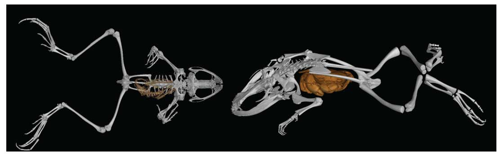
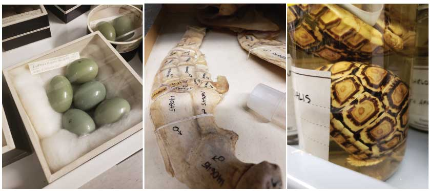

A naturalist is some who studies "the close observation of organisms - their origins, their evolution, their behavior, and their relationships with other species"[1](https://www.chronicle.com/article/The-Impending-Extinction-of/4002).  This definition came from an article from 2000 by Wilcove and Eisner with the sensational title: The Impending Extinction of Natural History. Last week I attended the [Second Annual Digital Data in Biodiversity Research Conference](https://www.idigbio.org/content/registration-now-open-emerging-innovations-biodiversity-data) and I am happy to report that not only are naturalists alive and well - they are thriving.  These modern naturalists are obsessed with data and arming themselves to use this data to fight for this planet.

On June 3 - 6 the Digital Data in Biodiversity Research Conference was held at UC Berkeley. This conference brought together a complex culture of individuals whose share a common mission of providing natural history data to the world. The attendees range from collection managers, curators, IT specialists, academic researchers, to funders. I made it my mission to talk to as many people I could in an attempt to understand the backgrounds, motivations, and challenges of this community.

If you are like me, very new to understanding the culture of the natural history data community, let me first try to explain the context and scope of this meeting.  Natural history data is broad in scope and can range from species occurrence data to environmental measurements to basically any data that describes how organisms interact with each other and their environment. Natural History Museums sit in a central position within this community because they have been collecting and carefully storing plant, animal, fungi, bacteria, insects ect. specimens in their collections for hundreds of years. These animals are vouchered, meaning, at a minimum, hopefully each specimen has a species ID, location of collection, and time collected. These vouchered organisms in my opinion are the heart of this community and often act as an anchor for other types of data.

## Current reach and trajectory of natural history data

The most exciting aspects of this data are the possibilities which emerge when you combine more detailed data to these vouchered organisms, and with new technologies, the richness describing these vouchered organisms (and their environment) is becoming increasingly exciting. For example Scott Edwards (Harvard) gave an [talk](https://www.idigbio.org/wiki/images/e/e6/Edwards_iDigBio_Berkeley_2018.pdf) about the future of combining genomic information to museum collections and embracing genomic technological advances, such as ATAC-seq, to gain never before glimpses of evolutionary selection at the epigenetic level through time. Or, as was detailed in a [talk](https://www.idigbio.org/wiki/images/9/9c/2018_iDigBio_Blackburn.pdf) by David Blackburn (Florida Museum of Natural History), connecting extremely details shape data employing non-destructive CT scanning technologies. Researchers are now capable of 3D morphometric analysis - we are in an age of housing full animal architectural information, including measurements of internal organs from specimens that were alive sometimes hundreds of years ago. This information is then fully available in community based databases on-line, as illustrated by Julie Winchester's [talk](https://www.idigbio.org/wiki/images/2/29/Winchester-iDigBio_MorphoSource_Talk_6-5-2018_final.pdf) on [MorphoSource](https://www.morphosource.org/) - an entire database dedicated to house 3D data! So. Cool.

<figure>
    
  <figcaption>Image from David Blackburns talk showing CT scans of two preserved frog specimens - Phrynobatrachus (left) and Barbourula (right). Link to <a href="https://www.idigbio.org/wiki/images/9/9c/2018_iDigBio_Blackburn.pdf">talk</a></figcaption>
</figure>

If you think along these lines, the biological and evolutionary questions are endless and you can understand why this community is so exciting to be around. What if we know the climate at the time of collection? What if we were measuring soil microbe communities? Light levels? Water quality? Population dynamics? Animal movement? When you combine all this information you define an incredibly rich snapshot of life at a particular moment in time. And when you unite this data we are capable of building predictive models that define life on this planet. These models will be instrumental in making decisions to best protect the future in the age of climate change. The ultimate reoccurring question at this conference was: How do we unite ALL THE DATA? 

## Aggregating all the data

Coming from a data scientist perspective this goal is highly ambitious. Data scientists, in any domain, struggle deeply with these questions. It takes extremely well designed and enforced data standards and a whole community of data architectural specialists to house the data and build systems to access and protect data integrity. Data aggregating communities made up a significant portion of the attendees at the conference. Communities ranged in scope, from [GloBI](https://www.globalbioticinteractions.org/), which specializes in a niche subset of data (species interaction) to [GBIF](https://www.gbif.org/) the Goliath data aggregation database which is attempting to unite everything and is thriving at aggregating species occurrence data (species, time collected, and location). The challenges are many. For example, a reoccurring problem I noticed is fitting data types that do not have a community defined standard, especially the [Darwin Core standard](http://rs.tdwg.org/dwc/). How do we define these standards? How are standards disseminated? With technological advancements, data standards will need fluidity to grow and evolve, how will these be implemented? These discussions were many and often involved heated debate. I am going to save my opinions on how these aggregation efforts should be prioritized for now, as I still feel I have a lot to learn. 

## What I wish I saw more of

There were several talks that addressed data quality efforts, including a great talk by Misha Leong (Cal Academy) on how [iNaturalist](https://www.inaturalist.org/) is using machine learning to verify the data accuracy in their databases. I wish I would have heard more talks like this on the strategies to test and fix the quality of these databases. In addition, I really enjoyed [Randy Singer's](https://www.idigbio.org/wiki/images/2/2f/06_RAS_Where_do_we_go_from_here_Digi_Conference_2018.pdf) (iDiGBio, Florida Museum of Natural History) introspective look about the current state of usage, assessing success, and defining audience scope.  Data is not perfect and is prone to decay and without formal community explored strategies to prevent these problems, the research and models spawned from these databases will be incorrect. I understand why the community is excited about new data and further aggregation, but I would have like to see more talks on infrastructure, documentation, and usability issues. 

I wish there was more talk about career development for the computational experts. Working at the Berkeley Institute of Data Science ([BIDs](https://bids.berkeley.edu/)) has allowed me to be cognizant of one of the most prominent conversations occurring in academic data science - how will data science thrive in academia with no career paths for theo  people building the infrastructure and tools. Many of the conversations with the younger generation of researchers at this meeting came down to literally choosing to protect and research the data they love or having a family. These researchers have the passionate, but talent will eventually be given no choice but to go where their skills are valued. This is not a problem that only exists in this community, but I do think that it something that needs to be addressed and discussed at least in some capacity, at every academic meeting that prides itself in utilization of "large" data. 

## Conclusions

I would just like to thank everyone that took the time to answer my never ending stream of questions. On the first day I approached this meeting feeling like a complete outsider, but by the end I had an overwhelming feeling that I "found my people". This is an amazing tight knit community that was extremely welcoming. This meeting, apart from all others I have attended, had the most concentrated group of people whom feel that they are inherently driven by a mission and duty to their work. They are a group of people who admire and acknowledge their place in history and are easily overtaken by the beauty of the natural world (as evidence to the constant stopping to observe every plant, insect, and long breaks with binoculars to observe the [peregrine falcons chicks on Berkeley's campus](http://news.berkeley.edu/2018/05/18/three-peregrine-chicks-banded/)). I left each conversation inspired by the endless possibilities that lie within this community. Thank you iDIGBio for arranging such an stimulating meeting. 

<figure>
  
  <figcaption>Images from a tour of the <a href="http://mvz.berkeley.edu/">Museum of Vertebrate Zoology at Berkeley</a></figcaption>
</figure>

## Highlights (with links)

- Meeting Constance Rinaldo and Martin Kalfatovic from the [Biodiversity Heritage Library](https://www.biodiversitylibrary.org/)! This is my favorite natural history database and basically fan girl-ed out when I met them.
- Hearing from David Thau (Google) on all the ways [Google Earth Engine](https://earthengine.google.com/) data is being utilized for some mesmerizing projects that are being implemented to solve real problems for environmental sustainability. 
- [Robert Full](http://polypedal.berkeley.edu/), of Berkeley presented his lab's work bio-inspired robotics and engineering. I was so excited by what he is doing, by the end of the talk I purchase a [robot built to mimic insect movement](https://kamigamirobots.com/) for my nephew's birthday. Can't wait to build it with him. 
-  Having lunch with Jorrit Poelen and Mariel Campbell (Museum of Southwestern Biology). I joined them for on their lunch and they allowed me to essentially easedrop on an illuminating discussion on strategies for uniting their data. I also got to learn about each of their motivations, from Mariel's passion for being a Naturalist for being a Naturalists sake and Jorrit's unconventional path from software engineer, to art, to building [Globi](https://www.globalbioticinteractions.org/). 
- Talking with Stan Bloom ([TDWG](http://www.tdwg.org/)) about his career path gave me incredible insight to the last twenty years in data aggregating efforts. 
- Behind the scenes tour of the Berkeley Zoological Museum with Michelle Koo and Cara Cicero. 
- The whole [agenda](https://www.idigbio.org/wiki/index.php/Digital_Data_in_Biodiversity_Research_Conference,_Berkeley#Agenda)! Check it out for links to all the talks.

