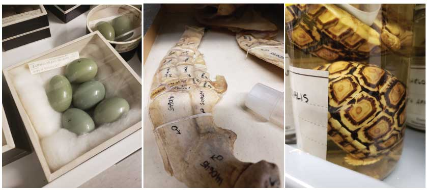

Although this site has been quiet these past few months, we have been a flurry of activity here at UC Berkeley and around the world.  

Last year Caryn and I started this site based on our sheer excitement for the immense amount of open data that describes our planet. This excitement has not ceased and I have spent that last few months learning as much as I can from the people delivering this data to us. I have talked with over 50 people who work with data in Museums, Botanical Gardens, and Universities in an attempt to understand the intricacies and motivations behind the effort it takes to build and maintain these databases.

After immersing myself in these communities one glaring observation has presented itself - this data must be valued as the precious resource it is and I believe the main way to see the value, is to **use this data**.  In light of this realization and upon becoming a Mozilla Fellow, I was able to focus more time and resources to exploring this data and the community behind it. Here at UC Berkeley I have been working with eight undergraduate Computer Science, Data Science and Statistics students analyzing this data. As we explore, we are carefully documenting our work so that it can be use as a tutorial for others and act as feedback for the maintainers. Our hope is that this will reinforce the quality and usability of these databases and bring more audiences to these databases. 

So what kind of analysis did we do? We all followed our interests and explored data on dinosaurs, ancient maps, CA wildfires, 3D fossil data, and more! In the next few months we will be posting these tutorials and also be posting about the people and museums behind the data. We are all doing this with open science, open source, and scientific reproducibility philosophies at the forefront of our efforts. You can join our team by contributing your own content. So follow along as we all explore the coolest data the world has to offer! 

@ofcuriositydata Twitter
@ofcuriositydata Instagram 
@curisotiydata.org Website

Summary of our overarching goals:

1. Empower and lead computer scientists to build tools and tutorials to help researchers use this data. 
2. Create tutorials, curriculum, and standards for incorporation of Natural History Data into both Natural and data Science classrooms. 
3. Reinforce and support the museum communities on the continuation and sustainability of their digizitation efforts.

<figure>
    
  <figcaption>Image from David Blackburns talk showing CT scans of two preserved frog specimens - Phrynobatrachus (left) and Barbourula (right). Link to <a href="https://www.idigbio.org/wiki/images/9/9c/2018_iDigBio_Blackburn.pdf">talk</a></figcaption>
</figure>

<figure>
  
  <figcaption>Images from a tour of the <a href="http://mvz.berkeley.edu/">Museum of Vertebrate Zoology at Berkeley</a></figcaption>
</figure>

