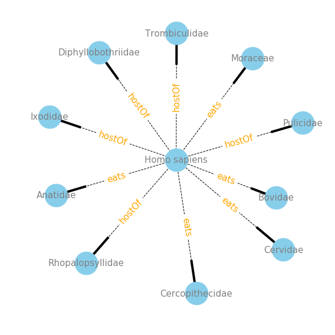

I am Yikang Li, an international student from Tianjin, China. I recently just graduated from UC Berkeley with BA degree in Statistics. I have long been interested in data science and therefore seized every possible means to be part of projects to improve my practical ability in data mining.  This interest lead me to exploring Biodiversity Data with the Cabinet of Curiosity Team. During this research experience, I, together with other interns, studied different natural history databases and revised each other’s work using Github. During our first week togerther we all explored what types of data was available to us and together created a brief list with summaries of the databases we could find. We each were given the option to explore one database of our choosing ([link](https://github.com/cabinetofcuriosity/homebase/blob/master/list-of-databases.md)).  I choose Global Biotic Interactions (GLoBI) [globalbioticinteractions.org](https://www.globalbioticinteractions.org/), a database of biodiversity, which as the name implies, collates species interactions data from around the world. 

GloBI does a fantastic job of explaining itself: 

>Global Biotic Interactions (GloBI) provides open access to species interaction data (e.g., predator-prey, pollinator-plant, pathogen-host, parasite-host) by combining existing open datasets using open source software. By providing an infrastructure to capture and share interaction data, individual biologists can focus on gathering new interaction data and analyzing existing datasets without having to spend resources on (re-) building a cyberinfrastructure to do so.

I was intitially interested in the GloBI database because it provides data in the format of interactions, which is different from other biodiversity databases. Instead of focusing on one species at a time, it connects different species by describing interactions between them. My work will be posted in two parts 1. Accessing and understanding the data 2. Exploring the data with network visualizations. Hope you enjoy!

## How to access GloBi

To start, we must get the access the data! I will discuss a few options that I tried. 

### 1. The R package `rglobi`

There is a package called [rglobi](https://cran.r-project.org/web/packages/rglobi/index.html) in R which allows us to access the database on Global Biotic Interactions (GloBI).  Here is a description from the documentation of the package:

> A programmatic interface to the web service methods provided by Global Biotic Interactions (GloBI). GloBI provides access to spatial-temporal species interaction records from sources all over the world. rglobi provides methods to search species interactions by location, interaction type, and taxonomic name. In addition, it supports Cypher, a graph query language, to allow for executing custom queries on the GloBI aggregate species interaction data set."  

To use its methods and functions, we need to install and load the package "rglobi" in R.

```r
install.packages("rglobi")
library(rglobi)
```

Users are able to search data on species interactions by location, interaction type, taxonomic names and so on. Please check out the [rglobi vignette](https://cran.r-project.org/web/packages/rglobi/vignettes/rglobi_vignette.html) to learn more about the use of this package. While the R package provides built in methods and functions, it has limitation on the maximum amount of data displayed.  Look into Pagination options to understand the limitations: [https://github.com/ropensci/rglobi/blob/master/vignettes/rglobi_vignette.Rmd#L410](https://github.com/ropensci/rglobi/blob/master/vignettes/rglobi_vignette.Rmd#L410)

By default, the amount of results are limited. If you'd like to retrieve all results, you can used pagination. For instance, to retrieve parasitic interactions using pagination, you can use:

```r
otherkeys = list("limit"=10, "skip"=0)
first_page_of_ten <- get_interactions_by_type(interactiontype = c("hasParasite"), otherkeys = otherkeys)
otherkeys = list("limit"=10, "skip"=10)
second_page_of_ten <- get_interactions_by_type(interactiontype = c("hasParasite"), otherkeys = otherkeys)
```

Basically you have to exhaust all available interactions, you can keep paging results until the size of the page is less than the limit (e.g., ```nrows(interactions) < limit```).


### 2. GloBI API

Another way to access the GloBI data is through the API: [https://github.com/jhpoelen/eol-globi-data/wiki/API](https://github.com/jhpoelen/eol-globi-data/wiki/API). The link above contains the API which provide access to interaction data for the purpose of integrating the data into wikis, custom webpages or other interaction exploration tools.

### 3. Download Everything

The third option is to download the whole dataset directly at [https://www.globalbioticinteractions.org/data](https://github.com/jhpoelen/eol-globi-data/wiki/API).  Datasets are available to download in different formats including tsv, csv and N-Quads/RDF. I chose the `.tsv` version. 

## Basic data exploration and characteristics

I ended up choosing Choice 3 and explored the dataset with Python in the Jupyter notebook enviroment. One of the reasons is that I don't want to be limited by the built-in functions in `rglobi` package. Importing the whole dataset allows me to explore in whatever ways I want to. Also, by Choice 3, I have the same dataset everytime so the results can be fully reproducible. 

If you would like to follow along to follow along in a Jupyter notebook, please checkout the notebook here: [Notebook](https://github.com/cabinetofcuriosity/globi_explore/blob/master/notebook/part1_globi_access.ipynb). You will first need to download the interactions.tsv file here: [interactions.tsv.gz](https://depot.globalbioticinteractions.org/snapshot/target/data/tsv/interactions.tsv.gz). 


```python
%matplotlib inline
import pandas as pd
```


```python
# Takes a few mintutes to load.
# If following along please download and unzip interactions.tsv.gz from 
# https://depot.globalbioticinteractions.org/snapshot/target/data/tsv/interactions.tsv.gz
# Unziping the file is ~6.5 GB
# Don't forget to change path to the file on your computer

data = pd.read_csv('~/Desktop/interactions.tsv', delimiter='\t', encoding='utf-8')
```

    /anaconda3/lib/python3.7/site-packages/IPython/core/interactiveshell.py:3020: DtypeWarning: Columns (21,22,23,24,25,26,27,28,29,30,41,42,43,44,45,46,47,48,49,50,55,58,59,60,61,62,63,64,65,68,69,72,73,78) have mixed types. Specify dtype option on import or set low_memory=False.
      interactivity=interactivity, compiler=compiler, result=result)


```python
# See the first few rows
data.head()
```


<div>
<style scoped>
    .dataframe tbody tr th:only-of-type {
        vertical-align: middle;
    }

    .dataframe tbody tr th {
        vertical-align: top;
    }

    .dataframe thead th {
        text-align: right;
    }
</style>
<table border="1" class="dataframe">
  <thead>
    <tr style="text-align: right;">
      <th></th>
      <th>sourceTaxonId</th>
      <th>sourceTaxonIds</th>
      <th>sourceTaxonName</th>
      <th>sourceTaxonRank</th>
      <th>sourceTaxonPathNames</th>
      <th>sourceTaxonPathIds</th>
      <th>sourceTaxonPathRankNames</th>
      <th>sourceTaxonSpeciesName</th>
      <th>sourceTaxonSpeciesId</th>
      <th>sourceTaxonGenusName</th>
      <th>...</th>
      <th>eventDateUnixEpoch</th>
      <th>argumentTypeId</th>
      <th>referenceCitation</th>
      <th>referenceDoi</th>
      <th>referenceUrl</th>
      <th>sourceCitation</th>
      <th>sourceNamespace</th>
      <th>sourceArchiveURI</th>
      <th>sourceDOI</th>
      <th>sourceLastSeenAtUnixEpoch</th>
    </tr>
  </thead>
  <tbody>
    <tr>
      <th>0</th>
      <td>EOL:4472733</td>
      <td>EOL:4472733 | EOL:4472733</td>
      <td>Deinosuchus</td>
      <td>genus</td>
      <td>Deinosuchus</td>
      <td>EOL:4472733</td>
      <td>genus</td>
      <td>NaN</td>
      <td>NaN</td>
      <td>Deinosuchus</td>
      <td>...</td>
      <td>NaN</td>
      <td>https://en.wiktionary.org/wiki/support</td>
      <td>Rivera-Sylva H.E., E. Frey and J.R. Guzmán-Gui...</td>
      <td>10.4267/2042/28152</td>
      <td>NaN</td>
      <td>Katja Schulz. 2015. Information about dinosaur...</td>
      <td>KatjaSchulz/dinosaur-biotic-interactions</td>
      <td>https://github.com/KatjaSchulz/dinosaur-biotic...</td>
      <td>NaN</td>
      <td>2018-12-14T23:59:22.189Z</td>
    </tr>
    <tr>
      <th>1</th>
      <td>EOL:4433651</td>
      <td>EOL:4433651 | EOL:4433651</td>
      <td>Daspletosaurus</td>
      <td>genus</td>
      <td>Daspletosaurus</td>
      <td>EOL:4433651</td>
      <td>genus</td>
      <td>NaN</td>
      <td>NaN</td>
      <td>Daspletosaurus</td>
      <td>...</td>
      <td>NaN</td>
      <td>https://en.wiktionary.org/wiki/support</td>
      <td>doi:10.1666/0022-3360(2001)075&lt;0401:GCFACT&gt;2.0...</td>
      <td>10.1666/0022-3360(2001)075&lt;0401:GCFACT&gt;2.0.CO;2</td>
      <td>NaN</td>
      <td>Katja Schulz. 2015. Information about dinosaur...</td>
      <td>KatjaSchulz/dinosaur-biotic-interactions</td>
      <td>https://github.com/KatjaSchulz/dinosaur-biotic...</td>
      <td>NaN</td>
      <td>2018-12-14T23:59:22.189Z</td>
    </tr>
    <tr>
      <th>2</th>
      <td>EOL_V2:24210058</td>
      <td>EOL_V2:24210058 | OTT:3617018 | GBIF:4975216 |...</td>
      <td>Repenomamus robustus</td>
      <td>species</td>
      <td>Eucarya | Opisthokonta | Metazoa | Eumetazoa |...</td>
      <td>EOL:5610326 | EOL:2910700 | EOL:42196910 | EOL...</td>
      <td>|  | subkingdom |  |  |  |  |  |  |  |  | supe...</td>
      <td>Repenomamus robustus</td>
      <td>EOL_V2:24210058</td>
      <td>Repenomamus</td>
      <td>...</td>
      <td>NaN</td>
      <td>https://en.wiktionary.org/wiki/support</td>
      <td>doi:10.1038/nature03102</td>
      <td>10.1038/nature03102</td>
      <td>NaN</td>
      <td>Katja Schulz. 2015. Information about dinosaur...</td>
      <td>KatjaSchulz/dinosaur-biotic-interactions</td>
      <td>https://github.com/KatjaSchulz/dinosaur-biotic...</td>
      <td>NaN</td>
      <td>2018-12-14T23:59:22.189Z</td>
    </tr>
    <tr>
      <th>3</th>
      <td>EOL:4433892</td>
      <td>EOL:4433892 | EOL:4433892</td>
      <td>Sinocalliopteryx gigas</td>
      <td>species</td>
      <td>Sinocalliopteryx gigas</td>
      <td>EOL:4433892</td>
      <td>species</td>
      <td>Sinocalliopteryx gigas</td>
      <td>EOL:4433892</td>
      <td>NaN</td>
      <td>...</td>
      <td>NaN</td>
      <td>https://en.wiktionary.org/wiki/support</td>
      <td>doi:10.1371/journal.pone.0044012</td>
      <td>10.1371/journal.pone.0044012</td>
      <td>NaN</td>
      <td>Katja Schulz. 2015. Information about dinosaur...</td>
      <td>KatjaSchulz/dinosaur-biotic-interactions</td>
      <td>https://github.com/KatjaSchulz/dinosaur-biotic...</td>
      <td>NaN</td>
      <td>2018-12-14T23:59:22.189Z</td>
    </tr>
    <tr>
      <th>4</th>
      <td>EOL:4433892</td>
      <td>EOL:4433892 | EOL:4433892</td>
      <td>Sinocalliopteryx gigas</td>
      <td>species</td>
      <td>Sinocalliopteryx gigas</td>
      <td>EOL:4433892</td>
      <td>species</td>
      <td>Sinocalliopteryx gigas</td>
      <td>EOL:4433892</td>
      <td>NaN</td>
      <td>...</td>
      <td>NaN</td>
      <td>https://en.wiktionary.org/wiki/support</td>
      <td>doi:10.1371/journal.pone.0044012</td>
      <td>10.1371/journal.pone.0044012</td>
      <td>NaN</td>
      <td>Katja Schulz. 2015. Information about dinosaur...</td>
      <td>KatjaSchulz/dinosaur-biotic-interactions</td>
      <td>https://github.com/KatjaSchulz/dinosaur-biotic...</td>
      <td>NaN</td>
      <td>2018-12-14T23:59:22.189Z</td>
    </tr>
  </tbody>
</table>
<p>5 rows × 80 columns</p>
</div>


```python
# Check the number of rows
len(data)
```


    3456395


```python
# How many columns?
len(data.columns)
```


    80


```python
# What are the 80 columns of this dataset?
data.columns
```


    Index(['sourceTaxonId', 'sourceTaxonIds', 'sourceTaxonName', 'sourceTaxonRank',
           'sourceTaxonPathNames', 'sourceTaxonPathIds',
           'sourceTaxonPathRankNames', 'sourceTaxonSpeciesName',
           'sourceTaxonSpeciesId', 'sourceTaxonGenusName', 'sourceTaxonGenusId',
           'sourceTaxonFamilyName', 'sourceTaxonFamilyId', 'sourceTaxonOrderName',
           'sourceTaxonOrderId', 'sourceTaxonClassName', 'sourceTaxonClassId',
           'sourceTaxonPhylumName', 'sourceTaxonPhylumId',
           'sourceTaxonKingdomName', 'sourceTaxonKingdomId', 'sourceId',
           'sourceOccurrenceId', 'sourceCatalogNumber', 'sourceBasisOfRecordId',
           'sourceBasisOfRecordName', 'sourceLifeStageId', 'sourceLifeStageName',
           'sourceBodyPartId', 'sourceBodyPartName', 'sourcePhysiologicalStateId',
           'sourcePhysiologicalStateName', 'interactionTypeName',
           'interactionTypeId', 'targetTaxonId', 'targetTaxonIds',
           'targetTaxonName', 'targetTaxonRank', 'targetTaxonPathNames',
           'targetTaxonPathIds', 'targetTaxonPathRankNames',
           'targetTaxonSpeciesName', 'targetTaxonSpeciesId',
           'targetTaxonGenusName', 'targetTaxonGenusId', 'targetTaxonFamilyName',
           'targetTaxonFamilyId', 'targetTaxonOrderName', 'targetTaxonOrderId',
           'targetTaxonClassName', 'targetTaxonClassId', 'targetTaxonPhylumName',
           'targetTaxonPhylumId', 'targetTaxonKingdomName', 'targetTaxonKingdomId',
           'targetId', 'targetOccurrenceId', 'targetCatalogNumber',
           'targetBasisOfRecordId', 'targetBasisOfRecordName', 'targetLifeStageId',
           'targetLifeStageName', 'targetBodyPartId', 'targetBodyPartName',
           'targetPhysiologicalStateId', 'targetPhysiologicalStateName',
           'decimalLatitude', 'decimalLongitude', 'localityId', 'localityName',
           'eventDateUnixEpoch', 'argumentTypeId', 'referenceCitation',
           'referenceDoi', 'referenceUrl', 'sourceCitation', 'sourceNamespace',
           'sourceArchiveURI', 'sourceDOI', 'sourceLastSeenAtUnixEpoch'],
          dtype='object')


#### How many different types of taxons as sources & target? 

You can see that many of the columns start with either "source", "target".  Columns in which start with "source" describe the organisms or group of organisms that act upon the "target" organism. These columns are different ways to describe those organisms. The TaxonIDs columns are columns that link the organisms to an established database of organisms such as the [Encyclopedia of Life](https://eol.org/). The great part of these columns is that they are unique IDs. 

Let's check out how many unique organims or organims groups there are in GloBi.


```python
# Source taxon
len(data['sourceTaxonId'].unique())
```


    147510


```python
#Target taxon
len(data['targetTaxonId'].unique())
```


    106613


### What interaction types are there?

The source and target organisms are connected by the action in which they interact and are described by the interaction columns which must fit into 37 interaction types. 


```python
data['interactionTypeName'].unique()
```


    array(['eats', 'preysOn', 'interactsWith', 'pollinates', 'parasiteOf',
           'pathogenOf', 'visitsFlowersOf', 'adjacentTo', 'dispersalVectorOf',
           'hasHost', 'endoparasitoidOf', 'symbiontOf', 'endoparasiteOf',
           'hasVector', 'ectoParasiteOf', 'vectorOf', 'livesOn', 'livesNear',
           'parasitoidOf', 'guestOf', 'livesInsideOf', 'farms',
           'ectoParasitoid', 'inhabits', 'kills', 'hasDispersalVector',
           'livesUnder', 'kleptoparasiteOf', 'hostOf', 'eatenBy',
           'flowersVisitedBy', 'preyedUponBy', 'hasParasite', 'pollinatedBy',
           'visits', 'commensalistOf', 'hasPathogen'], dtype=object)


```python
# number of different types of interaction
len(data['interactionTypeName'].unique())
```


    37


Each record in GloBI comes from a specific dataset. One of the great parts of GloBI is the transparency on *exactly* where that data is coming from.  GloBI has a system set up that continually gathers the information from its sources on a daily basis. Because of this, the database can fix a mistake on their end and without intervention GloBi will incorporate those changes into their data set.  You can tell the source of the data from a few columns, but what is especially interesting is the `sourceNamespace` column which displays the exact place on GitHub where the data is coming from.


```python
# Top 10 data sources ranked by amount of records contributed to GloBI
data['sourceNamespace'].value_counts().head(10)
```


    globalbioticinteractions/fishbase                                            504260
    globalbioticinteractions/arthropodEasyCaptureAMNH                            350213
    millerse/Wardeh-et-al.-2015                                                  271904
    globalbioticinteractions/natural-history-museum-london-interactions-bank     242429
    millerse/Dapstrom-integrated-database-and-portal-for-fish-stomach-records    225564
    globalbioticinteractions/ices                                                183935
    EOL/pseudonitzchia                                                           183773
    globalbioticinteractions/noaa-reem                                           122328
    millerse/US-National-Parasite-Collection                                      99713
    globalbioticinteractions/roopnarine                                           96647
    Name: sourceNamespace, dtype: int64


To look at where GloBI is getting this data from simply add the first column to `github.com/`. 

Example: The largest contributer appears to be Fishbase [github.com/globalbioticinteractions/fishbase](github.com/globalbioticinteractions/fishbase). You can also get the status of GloBi's interaction with the data sources here: [https://www.globalbioticinteractions.org/status.html](https://www.globalbioticinteractions.org/status.html).

Many of the columns are related to the type of organism being described and the most intersting

I'm interested in how many unique interaction type records are found in GloBi.  The most interesting columns and really the heart of the database is `sourceTaxonId`, `interactionTypeName`, and `targetTaxonId`. With these three columns you can see what an animal interacts with and how.


```python
data[['sourceTaxonId', 'interactionTypeName', 'targetTaxonId', 'sourceTaxonName']].head(10)
```


<div>
<style scoped>
    .dataframe tbody tr th:only-of-type {
        vertical-align: middle;
    }

    .dataframe tbody tr th {
        vertical-align: top;
    }

    .dataframe thead th {
        text-align: right;
    }
</style>
<table border="1" class="dataframe">
  <thead>
    <tr style="text-align: right;">
      <th></th>
      <th>sourceTaxonId</th>
      <th>interactionTypeName</th>
      <th>targetTaxonId</th>
      <th>sourceTaxonName</th>
    </tr>
  </thead>
  <tbody>
    <tr>
      <th>0</th>
      <td>EOL:4472733</td>
      <td>eats</td>
      <td>EOL_V2:42417811</td>
      <td>Deinosuchus</td>
    </tr>
    <tr>
      <th>1</th>
      <td>EOL:4433651</td>
      <td>eats</td>
      <td>EOL_V2:42417811</td>
      <td>Daspletosaurus</td>
    </tr>
    <tr>
      <th>2</th>
      <td>EOL_V2:24210058</td>
      <td>eats</td>
      <td>EOL:4532049</td>
      <td>Repenomamus robustus</td>
    </tr>
    <tr>
      <th>3</th>
      <td>EOL:4433892</td>
      <td>eats</td>
      <td>EOL_V2:4433896</td>
      <td>Sinocalliopteryx gigas</td>
    </tr>
    <tr>
      <th>4</th>
      <td>EOL:4433892</td>
      <td>eats</td>
      <td>EOL:4433563</td>
      <td>Sinocalliopteryx gigas</td>
    </tr>
    <tr>
      <th>5</th>
      <td>EOL:4433551</td>
      <td>eats</td>
      <td>EOL:42331729</td>
      <td>Microraptor gui</td>
    </tr>
    <tr>
      <th>6</th>
      <td>EOL:4531246</td>
      <td>eats</td>
      <td>EOL_V2:4530741</td>
      <td>Baryonyx walkeri</td>
    </tr>
    <tr>
      <th>7</th>
      <td>EOL:4531246</td>
      <td>eats</td>
      <td>EOL:4653801</td>
      <td>Baryonyx walkeri</td>
    </tr>
    <tr>
      <th>8</th>
      <td>EOL:4433582</td>
      <td>eats</td>
      <td>EOL_V2:4531936</td>
      <td>Deinonychus antirrhopus</td>
    </tr>
    <tr>
      <th>9</th>
      <td>EOL:4433881</td>
      <td>preysOn</td>
      <td>EOL:4518630</td>
      <td>Compsognathus longipes</td>
    </tr>
  </tbody>
</table>
</div>


## How to search by Organism - Sanity check with bats


There are many columns that describe the species or order, you can search by any of the columns. One of the main ways in which researchers would want to use this data is to find the data corresponding to the species or taxa they are interested in. If you want to search for a specific taxa, you can just search using a organism string. I explored this feature a bit to try and understand if the data is making sense i.e. sanity check. 

I choose to search a few types of bats and just browse the results to see if they made sense.  First off I choose to see what [Carollia](https://en.wikipedia.org/wiki/Carollia), a genus of short tail fruit bats, eats.


```python
# Subset by the term Carollia
corollia = data[data['sourceTaxonName'].str.contains('Carollia', na=False)]

#subset by only what Carollia eats
corollia = corollia.loc[corollia.interactionTypeName == 'eats']

# Show only relevant columns
corollia[['sourceTaxonName','sourceTaxonId', 'interactionTypeName', 'targetTaxonName','targetTaxonId']].head(10)
```


<div>
<style scoped>
    .dataframe tbody tr th:only-of-type {
        vertical-align: middle;
    }

    .dataframe tbody tr th {
        vertical-align: top;
    }

    .dataframe thead th {
        text-align: right;
    }
</style>
<table border="1" class="dataframe">
  <thead>
    <tr style="text-align: right;">
      <th></th>
      <th>sourceTaxonName</th>
      <th>sourceTaxonId</th>
      <th>interactionTypeName</th>
      <th>targetTaxonName</th>
      <th>targetTaxonId</th>
    </tr>
  </thead>
  <tbody>
    <tr>
      <th>785626</th>
      <td>Carollia perspicillata</td>
      <td>EOL:327438</td>
      <td>eats</td>
      <td>Terminalia catappa</td>
      <td>GBIF:3189394</td>
    </tr>
    <tr>
      <th>785631</th>
      <td>Carollia perspicillata</td>
      <td>EOL:327438</td>
      <td>eats</td>
      <td>Terminalia catappa</td>
      <td>GBIF:3189394</td>
    </tr>
    <tr>
      <th>785683</th>
      <td>Carollia perspicillata</td>
      <td>EOL:327438</td>
      <td>eats</td>
      <td>Syzygium malaccense</td>
      <td>EOL:2508662</td>
    </tr>
    <tr>
      <th>785688</th>
      <td>Carollia perspicillata</td>
      <td>EOL:327438</td>
      <td>eats</td>
      <td>Syzygium jambos</td>
      <td>EOL:2508661</td>
    </tr>
    <tr>
      <th>785693</th>
      <td>Carollia perspicillata</td>
      <td>EOL:327438</td>
      <td>eats</td>
      <td>Syzygium jambos</td>
      <td>EOL:2508661</td>
    </tr>
    <tr>
      <th>785727</th>
      <td>Carollia perspicillata</td>
      <td>EOL:327438</td>
      <td>eats</td>
      <td>Syzygium cumini</td>
      <td>EOL:2508660</td>
    </tr>
    <tr>
      <th>785900</th>
      <td>Carollia perspicillata</td>
      <td>EOL:327438</td>
      <td>eats</td>
      <td>Spondias</td>
      <td>EOL:61097</td>
    </tr>
    <tr>
      <th>785963</th>
      <td>Carollia perspicillata</td>
      <td>EOL:327438</td>
      <td>eats</td>
      <td>Solanum</td>
      <td>EOL:590245</td>
    </tr>
    <tr>
      <th>785968</th>
      <td>Carollia perspicillata</td>
      <td>EOL:327438</td>
      <td>eats</td>
      <td>Solanum</td>
      <td>EOL:590245</td>
    </tr>
    <tr>
      <th>785970</th>
      <td>Carollia perspicillata</td>
      <td>EOL:327438</td>
      <td>eats</td>
      <td>Solanum</td>
      <td>EOL:590245</td>
    </tr>
  </tbody>
</table>
</div>


From above you can see that [Carollia perspicillata](https://en.wikipedia.org/wiki/Seba%27s_short-tailed_bat) eats yummy things like [Terminalia catappa](https://en.wikipedia.org/wiki/Terminalia_catappa) which is some type of nut and [Syzygium malaccense](https://en.wikipedia.org/wiki/Syzygium_malaccense) some apple-like fruit. Seems right.


Now lets try another type of bat, [Desmodus](https://en.wikipedia.org/wiki/Desmodus) - the Vampire Bats! 


```python
# Subset by the term Desmodus
Desmodus = data[data['sourceTaxonName'].str.contains('Desmodus', na=False)]

#subset by only what Carollia eats or preysOn
Desmodus = Desmodus.loc[(Desmodus.interactionTypeName == 'eats') | (Desmodus.interactionTypeName == 'preysOn')]

# Show only relevant columns
Desmodus[['sourceTaxonName','sourceTaxonId', 'interactionTypeName', 'targetTaxonName','targetTaxonId']].head(10)
```


<div>
<style scoped>
    .dataframe tbody tr th:only-of-type {
        vertical-align: middle;
    }

    .dataframe tbody tr th {
        vertical-align: top;
    }

    .dataframe thead th {
        text-align: right;
    }
</style>
<table border="1" class="dataframe">
  <thead>
    <tr style="text-align: right;">
      <th></th>
      <th>sourceTaxonName</th>
      <th>sourceTaxonId</th>
      <th>interactionTypeName</th>
      <th>targetTaxonName</th>
      <th>targetTaxonId</th>
    </tr>
  </thead>
  <tbody>
    <tr>
      <th>1542376</th>
      <td>Desmodus rotundus</td>
      <td>GBIF:2433298</td>
      <td>eats</td>
      <td>Bos taurus</td>
      <td>GBIF:2441022</td>
    </tr>
  </tbody>
</table>
</div>


So if you look up [Bos taurus](https://en.wikipedia.org/wiki/Cattle), you see that this animal is "cattle". A mammal with blood. So creepy. So cool. I highly recommend just trying the above code with 

## Conclusions

Now that I have a handle on the data I see a few different ways in which to explore the data. If you are like me, and need to google every species or taxa that is in the dataset, you should read next weeks post on automation of hyperlinking species names directly into a Jupyter Notebook, which makes exploring this GLoBI data really intuitive. Also, in the next post I will be creating tools that wrap the interaction data into informative network visualizations. Below is a sneak peak into the type of visualizations I will be creating. 

<center><figure>
    
  <figcaption>Network visualization using GLoBI data to visualize what species humans interacts with.</figcaption>
</figure></center>


