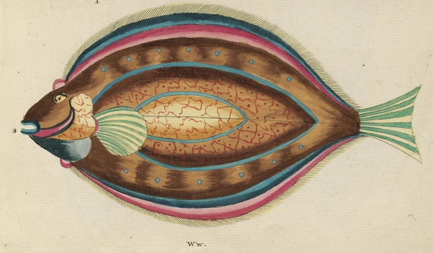
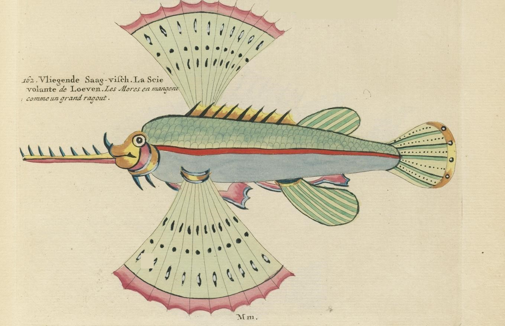
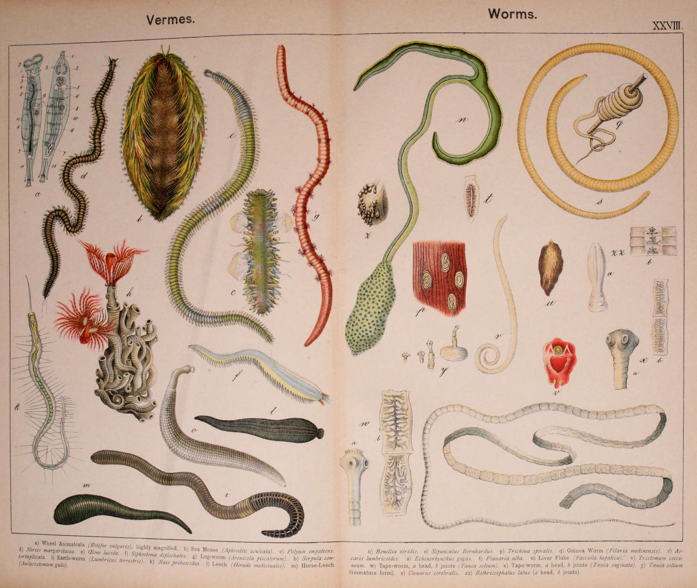
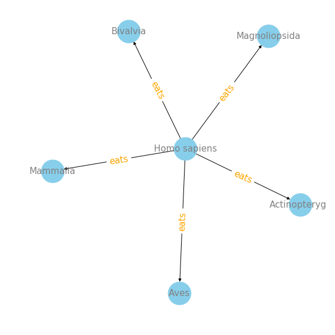
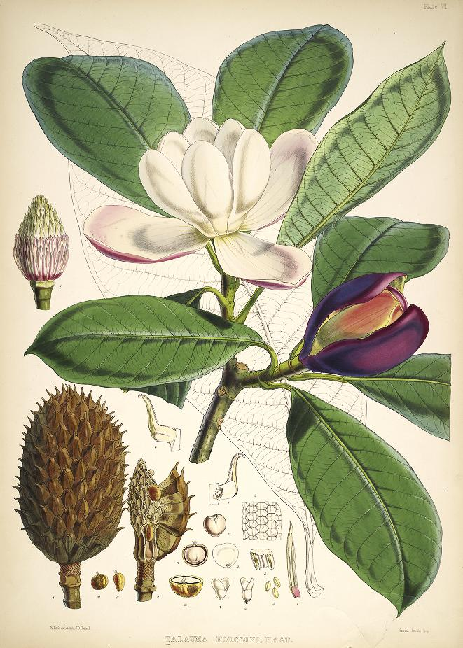
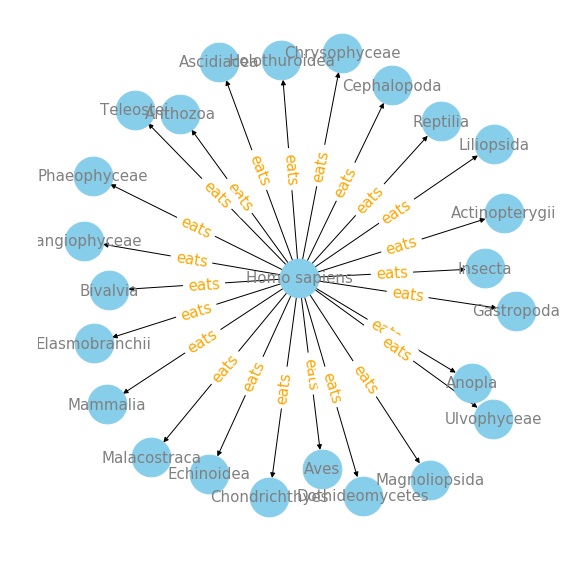
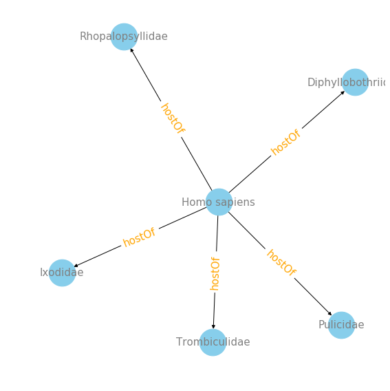
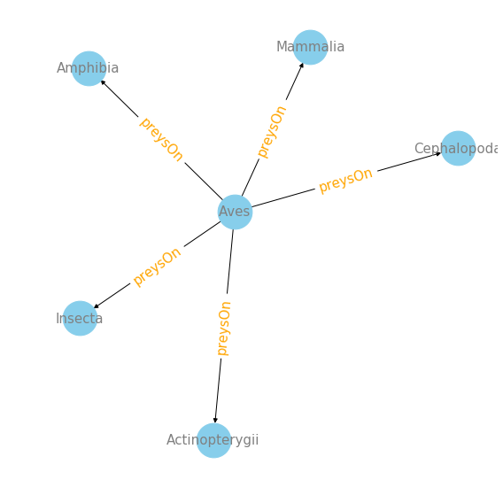
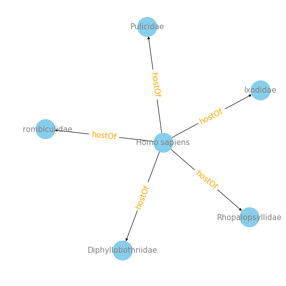
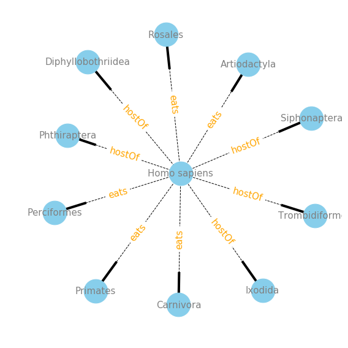

What do birds prey on? What are the main parasites that host on humans? You can answer all these questions and more with the [Global Biotic Interactions (GloBI) database](https://www.globalbioticinteractions.org/). 

To explore the GloBI database a bit further then [last time](http://curiositydata.org/part1_globi_access/), I decided to create some Python functions that make it easier for users to explore their favorite organism interactions.  This post will be very useful if you are interested in exploring GloBI data efficiently using a Python [Jupyter Notebook](https://jupyter.org/) enviroment.  I created a few functions that allow both visualizing how organisms interact with each other and by creating URL links to information on (species and groups of species) through Wikipedia directly in the Jupyter notebook.  

One of the most efficient ways to view information like this is to use [Network Graphs](https://en.wikipedia.org/wiki/Graph_theory). Network graphs use information from both the link and node data sets to generate a graphical depiction of the network ([1])(http://support.sas.com/documentation/cdl/en/grnvwug/62918/HTML/default/viewer.htm#p0q343kxjyj36jn1e2z6lulkda3j.htm). Directed Network graphs give even more information by helping show how your data links direct different nodes. For GloBI data, the link is the interactions type, like "eats", while the node is the species or organism you are interested in. This directed network graphs allow you to efficiently ask questions like "What are the top taxa that birds prey on?"


<object align="right">
<figure>
  
  <figcaption><a href="https://en.wikipedia.org/wiki/Graph_theory#/media/File:6n-graf.svg">Simple graph network.</a>
</figcaption>
</figure>
</object>


**In this post I will**:

1. <a href = "#section1">search for data by taxa name</a>,
2. <a href = "#section2">find the top target taxa for which candidate organisms interact with</a>,
3. <a href = "section3">make your data output come alive with automation of URL links to Wikipedia</a>
4. <a href = "section4">create directed network visualizations </a> 

*This tutorial assumes you know how to do basic to novice Python programming and know how to use Jupyter Notebook enviroments.*

## Import interaction data

We are going to skip ahead to loading the data, if you would like to know more about accessing GloBI's data and learning a bit more about what the data is, please see the [previous post](http://curiositydata.org/part1_globi_access/).

If you would like to follow along on a Jupyter notebook, please download the notebook here: [part2_globi_exploration.ipynb](https://github.com/cabinetofcuriosity/globi_explore/blob/master/notebook/part2_globi_exploration.ipynb). To fully reproduce this analysis you will need the data file, which is 6.54GB. Download the `interactions.tsv` file here: [interactions.tsv.gz](https://depot.globalbioticinteractions.org/snapshot/target/data/tsv/interactions.tsv.gz).

```python
## Required Python packages
import pandas as pd
import pytaxize
import re
import matplotlib.pyplot as plt
```

```python
# This takes a few minutes to load in.
data = pd.read_csv('../../interactions.tsv', delimiter='\t', encoding='utf-8')
len(data)
```

    3729065


```python
data.head()
```


<div>
<style scoped>
    .dataframe tbody tr th:only-of-type {
        vertical-align: middle;
    }

    .dataframe tbody tr th {
        vertical-align: top;
    }

    .dataframe thead th {
        text-align: right;
    }
</style>
<table border="1" class="dataframe">
  <thead>
    <tr style="text-align: right;">
      <th></th>
      <th>sourceTaxonId</th>
      <th>sourceTaxonIds</th>
      <th>sourceTaxonName</th>
      <th>sourceTaxonRank</th>
      <th>sourceTaxonPathNames</th>
      <th>sourceTaxonPathIds</th>
      <th>sourceTaxonPathRankNames</th>
      <th>sourceTaxonSpeciesName</th>
      <th>sourceTaxonSpeciesId</th>
      <th>sourceTaxonGenusName</th>
      <th>...</th>
      <th>eventDateUnixEpoch</th>
      <th>argumentTypeId</th>
      <th>referenceCitation</th>
      <th>referenceDoi</th>
      <th>referenceUrl</th>
      <th>sourceCitation</th>
      <th>sourceNamespace</th>
      <th>sourceArchiveURI</th>
      <th>sourceDOI</th>
      <th>sourceLastSeenAtUnixEpoch</th>
    </tr>
  </thead>
  <tbody>
    <tr>
      <th>0</th>
      <td>EOL_V2:1056176</td>
      <td>EOL_V2:1056176 | WORMS:137208 | WD:Q301089 | O...</td>
      <td>Lepidochelys kempii</td>
      <td>species</td>
      <td>Cheloniidae | Lepidochelys | Lepidochelys kempii</td>
      <td>EOL:8123 | EOL:59582 | EOL_V2:1056176</td>
      <td>family | genus | species</td>
      <td>Lepidochelys kempii</td>
      <td>EOL_V2:1056176</td>
      <td>Lepidochelys</td>
      <td>...</td>
      <td>7.574076e+11</td>
      <td>https://en.wiktionary.org/wiki/support</td>
      <td>Donna Shaver. 1998. Sea Turtle Strandings Alon...</td>
      <td>NaN</td>
      <td>NaN</td>
      <td>http://gomexsi.tamucc.edu</td>
      <td>GoMexSI/interaction-data</td>
      <td>https://github.com/GoMexSI/interaction-data/ar...</td>
      <td>NaN</td>
      <td>2019-02-12T23:05:38.038Z</td>
    </tr>
    <tr>
      <th>1</th>
      <td>EOL_V2:1056176</td>
      <td>EOL_V2:1056176 | WORMS:137208 | WD:Q301089 | O...</td>
      <td>Lepidochelys kempii</td>
      <td>species</td>
      <td>Cheloniidae | Lepidochelys | Lepidochelys kempii</td>
      <td>EOL:8123 | EOL:59582 | EOL_V2:1056176</td>
      <td>family | genus | species</td>
      <td>Lepidochelys kempii</td>
      <td>EOL_V2:1056176</td>
      <td>Lepidochelys</td>
      <td>...</td>
      <td>7.574076e+11</td>
      <td>https://en.wiktionary.org/wiki/support</td>
      <td>Donna Shaver. 1998. Sea Turtle Strandings Alon...</td>
      <td>NaN</td>
      <td>NaN</td>
      <td>http://gomexsi.tamucc.edu</td>
      <td>GoMexSI/interaction-data</td>
      <td>https://github.com/GoMexSI/interaction-data/ar...</td>
      <td>NaN</td>
      <td>2019-02-12T23:05:38.038Z</td>
    </tr>
    <tr>
      <th>2</th>
      <td>EOL_V2:1056176</td>
      <td>EOL_V2:1056176 | WORMS:137208 | WD:Q301089 | O...</td>
      <td>Lepidochelys kempii</td>
      <td>species</td>
      <td>Cheloniidae | Lepidochelys | Lepidochelys kempii</td>
      <td>EOL:8123 | EOL:59582 | EOL_V2:1056176</td>
      <td>family | genus | species</td>
      <td>Lepidochelys kempii</td>
      <td>EOL_V2:1056176</td>
      <td>Lepidochelys</td>
      <td>...</td>
      <td>7.574076e+11</td>
      <td>https://en.wiktionary.org/wiki/support</td>
      <td>Donna Shaver. 1998. Sea Turtle Strandings Alon...</td>
      <td>NaN</td>
      <td>NaN</td>
      <td>http://gomexsi.tamucc.edu</td>
      <td>GoMexSI/interaction-data</td>
      <td>https://github.com/GoMexSI/interaction-data/ar...</td>
      <td>NaN</td>
      <td>2019-02-12T23:05:38.038Z</td>
    </tr>
    <tr>
      <th>3</th>
      <td>EOL_V2:1056176</td>
      <td>EOL_V2:1056176 | WORMS:137208 | WD:Q301089 | O...</td>
      <td>Lepidochelys kempii</td>
      <td>species</td>
      <td>Cheloniidae | Lepidochelys | Lepidochelys kempii</td>
      <td>EOL:8123 | EOL:59582 | EOL_V2:1056176</td>
      <td>family | genus | species</td>
      <td>Lepidochelys kempii</td>
      <td>EOL_V2:1056176</td>
      <td>Lepidochelys</td>
      <td>...</td>
      <td>7.574076e+11</td>
      <td>https://en.wiktionary.org/wiki/support</td>
      <td>Donna Shaver. 1998. Sea Turtle Strandings Alon...</td>
      <td>NaN</td>
      <td>NaN</td>
      <td>http://gomexsi.tamucc.edu</td>
      <td>GoMexSI/interaction-data</td>
      <td>https://github.com/GoMexSI/interaction-data/ar...</td>
      <td>NaN</td>
      <td>2019-02-12T23:05:38.038Z</td>
    </tr>
    <tr>
      <th>4</th>
      <td>EOL_V2:1056176</td>
      <td>EOL_V2:1056176 | WORMS:137208 | WD:Q301089 | O...</td>
      <td>Lepidochelys kempii</td>
      <td>species</td>
      <td>Cheloniidae | Lepidochelys | Lepidochelys kempii</td>
      <td>EOL:8123 | EOL:59582 | EOL_V2:1056176</td>
      <td>family | genus | species</td>
      <td>Lepidochelys kempii</td>
      <td>EOL_V2:1056176</td>
      <td>Lepidochelys</td>
      <td>...</td>
      <td>7.574076e+11</td>
      <td>https://en.wiktionary.org/wiki/support</td>
      <td>Donna Shaver. 1998. Sea Turtle Strandings Alon...</td>
      <td>NaN</td>
      <td>NaN</td>
      <td>http://gomexsi.tamucc.edu</td>
      <td>GoMexSI/interaction-data</td>
      <td>https://github.com/GoMexSI/interaction-data/ar...</td>
      <td>NaN</td>
      <td>2019-02-12T23:05:38.038Z</td>
    </tr>
  </tbody>
</table>
<p>5 rows × 80 columns</p>
</div>


```python
# Checking out all the interaction types
data['interactionTypeName'].unique()
```


    array(['eats', 'interactsWith', 'pollinates', 'parasiteOf', 'preysOn',
           'pathogenOf', 'visitsFlowersOf', 'dispersalVectorOf', 'adjacentTo',
           'endoparasitoidOf', 'symbiontOf', 'endoparasiteOf', 'hasVector',
           'ectoParasiteOf', 'vectorOf', 'livesOn', 'livesNear',
           'parasitoidOf', 'guestOf', 'livesInsideOf', 'farms',
           'ectoParasitoid', 'inhabits', 'kills', 'hasDispersalVector',
           'livesUnder', 'kleptoparasiteOf', 'hasHost', 'eatenBy',
           'flowersVisitedBy', 'hasParasite', 'preyedUponBy', 'pollinatedBy',
           'hostOf', 'visits', 'commensalistOf', 'hasPathogen'], dtype=object)


### Drop duplicates

My goal is to look at the different types of interaction data in the dataset and build network visualizations from this information, therefore I am only really interested in unique cases of interaction. So in this next step let's drop the data that isn't unique in these three columns. 


```python
data.drop_duplicates(['sourceTaxonId', 'interactionTypeName', 'targetTaxonId'], inplace = True)
```


```python
## We dropped from 
len(data)
```


    967624


<a name="section1"></a> 
# Search for data by taxa name 


<figure>
    
  <center><figcaption>Homo sapiens, from <a href="biodiversitylibrary.org/page/33606717">biodiversitylibrary.org/page/33606717</a>
  </figcaption></center>
</figure>

For example, suppose we are interested in the interactions involving one of the weirder speices on this planet 'Homo sapiens'.


```python
# What are all the types of interactions involving Homo sapiens as sourceTaxon?
data[data['sourceTaxonName'] == 'Homo sapiens']['interactionTypeName'].unique()
```

    array(['interactsWith', 'eats', 'hostOf'], dtype=object)

```python
# Number of records of interactions involving Homo sapiens as sourceTaxon?
len(data[data['sourceTaxonName'] == 'Homo sapiens'])
```

    666

Now let's focus on a certain type of interaction involving the sourceTaxon "Homo sapiens", for example, "eats".


```python
hs_eats_data = data[(data['sourceTaxonName'] == 'Homo sapiens') & (data['interactionTypeName'] == 'eats')]
```


```python
hs_eats_data.head()
```


<div>
<style scoped>
    .dataframe tbody tr th:only-of-type {
        vertical-align: middle;
    }

    .dataframe tbody tr th {
        vertical-align: top;
    }

    .dataframe thead th {
        text-align: right;
    }
</style>
<table border="1" class="dataframe">
  <thead>
    <tr style="text-align: right;">
      <th></th>
      <th>sourceTaxonId</th>
      <th>sourceTaxonIds</th>
      <th>sourceTaxonName</th>
      <th>sourceTaxonRank</th>
      <th>sourceTaxonPathNames</th>
      <th>sourceTaxonPathIds</th>
      <th>sourceTaxonPathRankNames</th>
      <th>sourceTaxonSpeciesName</th>
      <th>sourceTaxonSpeciesId</th>
      <th>sourceTaxonGenusName</th>
      <th>...</th>
      <th>eventDateUnixEpoch</th>
      <th>argumentTypeId</th>
      <th>referenceCitation</th>
      <th>referenceDoi</th>
      <th>referenceUrl</th>
      <th>sourceCitation</th>
      <th>sourceNamespace</th>
      <th>sourceArchiveURI</th>
      <th>sourceDOI</th>
      <th>sourceLastSeenAtUnixEpoch</th>
    </tr>
  </thead>
  <tbody>
    <tr>
      <th>525804</th>
      <td>EOL:327955</td>
      <td>EOL:327955 | INAT_TAXON:43584 | NBN:NHMSYS0000...</td>
      <td>Homo sapiens</td>
      <td>species</td>
      <td>Animalia | Chordata | Mammalia | Primates | Ho...</td>
      <td>EOL:1 | EOL:694 | EOL:1642 | EOL:1645 | EOL:16...</td>
      <td>kingdom | phylum | class | order | family | ge...</td>
      <td>Homo sapiens</td>
      <td>EOL:327955</td>
      <td>Homo</td>
      <td>...</td>
      <td>NaN</td>
      <td>https://en.wiktionary.org/wiki/support</td>
      <td>Worthington, A. 1989. Adaptations for avian fr...</td>
      <td>10.1007/BF00379040.</td>
      <td>NaN</td>
      <td>F. Gabriel. Muñoz. 2017. Palm-Animal frugivore...</td>
      <td>fgabriel1891/Plant-Frugivore-Interactions-Sout...</td>
      <td>https://github.com/fgabriel1891/Plant-Frugivor...</td>
      <td>NaN</td>
      <td>2019-02-12T23:08:35.599Z</td>
    </tr>
    <tr>
      <th>527097</th>
      <td>EOL:327955</td>
      <td>EOL:327955 | INAT_TAXON:43584 | NBN:NHMSYS0000...</td>
      <td>Homo sapiens</td>
      <td>species</td>
      <td>Animalia | Chordata | Mammalia | Primates | Ho...</td>
      <td>EOL:1 | EOL:694 | EOL:1642 | EOL:1645 | EOL:16...</td>
      <td>kingdom | phylum | class | order | family | ge...</td>
      <td>Homo sapiens</td>
      <td>EOL:327955</td>
      <td>Homo</td>
      <td>...</td>
      <td>NaN</td>
      <td>https://en.wiktionary.org/wiki/support</td>
      <td>Hazarika, T.k. Lalramchuana. Nautiyal. B.P. 20...</td>
      <td>10.1007/s10722-012-9799-5</td>
      <td>NaN</td>
      <td>F. Gabriel. Muñoz. 2017. Palm-Animal frugivore...</td>
      <td>fgabriel1891/Plant-Frugivore-Interactions-Sout...</td>
      <td>https://github.com/fgabriel1891/Plant-Frugivor...</td>
      <td>NaN</td>
      <td>2019-02-12T23:08:35.599Z</td>
    </tr>
    <tr>
      <th>527098</th>
      <td>EOL:327955</td>
      <td>EOL:327955 | INAT_TAXON:43584 | NBN:NHMSYS0000...</td>
      <td>Homo sapiens</td>
      <td>species</td>
      <td>Animalia | Chordata | Mammalia | Primates | Ho...</td>
      <td>EOL:1 | EOL:694 | EOL:1642 | EOL:1645 | EOL:16...</td>
      <td>kingdom | phylum | class | order | family | ge...</td>
      <td>Homo sapiens</td>
      <td>EOL:327955</td>
      <td>Homo</td>
      <td>...</td>
      <td>NaN</td>
      <td>https://en.wiktionary.org/wiki/support</td>
      <td>Hazarika, T.k. Lalramchuana. Nautiyal. B.P. 20...</td>
      <td>10.1007/s10722-012-9799-5</td>
      <td>NaN</td>
      <td>F. Gabriel. Muñoz. 2017. Palm-Animal frugivore...</td>
      <td>fgabriel1891/Plant-Frugivore-Interactions-Sout...</td>
      <td>https://github.com/fgabriel1891/Plant-Frugivor...</td>
      <td>NaN</td>
      <td>2019-02-12T23:08:35.599Z</td>
    </tr>
    <tr>
      <th>527099</th>
      <td>EOL:327955</td>
      <td>EOL:327955 | INAT_TAXON:43584 | NBN:NHMSYS0000...</td>
      <td>Homo sapiens</td>
      <td>species</td>
      <td>Animalia | Chordata | Mammalia | Primates | Ho...</td>
      <td>EOL:1 | EOL:694 | EOL:1642 | EOL:1645 | EOL:16...</td>
      <td>kingdom | phylum | class | order | family | ge...</td>
      <td>Homo sapiens</td>
      <td>EOL:327955</td>
      <td>Homo</td>
      <td>...</td>
      <td>NaN</td>
      <td>https://en.wiktionary.org/wiki/support</td>
      <td>Hazarika, T.k. Lalramchuana. Nautiyal. B.P. 20...</td>
      <td>10.1007/s10722-012-9799-5</td>
      <td>NaN</td>
      <td>F. Gabriel. Muñoz. 2017. Palm-Animal frugivore...</td>
      <td>fgabriel1891/Plant-Frugivore-Interactions-Sout...</td>
      <td>https://github.com/fgabriel1891/Plant-Frugivor...</td>
      <td>NaN</td>
      <td>2019-02-12T23:08:35.599Z</td>
    </tr>
    <tr>
      <th>527100</th>
      <td>EOL:327955</td>
      <td>EOL:327955 | INAT_TAXON:43584 | NBN:NHMSYS0000...</td>
      <td>Homo sapiens</td>
      <td>species</td>
      <td>Animalia | Chordata | Mammalia | Primates | Ho...</td>
      <td>EOL:1 | EOL:694 | EOL:1642 | EOL:1645 | EOL:16...</td>
      <td>kingdom | phylum | class | order | family | ge...</td>
      <td>Homo sapiens</td>
      <td>EOL:327955</td>
      <td>Homo</td>
      <td>...</td>
      <td>NaN</td>
      <td>https://en.wiktionary.org/wiki/support</td>
      <td>Hazarika, T.k. Lalramchuana. Nautiyal. B.P. 20...</td>
      <td>10.1007/s10722-012-9799-5</td>
      <td>NaN</td>
      <td>F. Gabriel. Muñoz. 2017. Palm-Animal frugivore...</td>
      <td>fgabriel1891/Plant-Frugivore-Interactions-Sout...</td>
      <td>https://github.com/fgabriel1891/Plant-Frugivor...</td>
      <td>NaN</td>
      <td>2019-02-12T23:08:35.599Z</td>
    </tr>
  </tbody>
</table>
<p>5 rows × 80 columns</p>
</div>


```python
len(hs_eats_data)
```

    378


I'm going to clean up this table a bit.  The code below is first selecting which columns I want to keep and droping data with missing values from 'targetTaxonId','targetTaxonName','targetTaxonPathNames','targetTaxonPathIds'.


```python
target_hs_eats = hs_eats_data[['targetTaxonId',
       'targetTaxonName','targetTaxonPathNames',
       'targetTaxonPathIds', 'targetTaxonPathRankNames',
       'targetTaxonSpeciesName', 'targetTaxonSpeciesId',
       'targetTaxonGenusName', 'targetTaxonGenusId', 'targetTaxonFamilyName',
       'targetTaxonFamilyId', 'targetTaxonOrderName', 'targetTaxonOrderId',
       'targetTaxonClassName', 'targetTaxonClassId', 'targetTaxonPhylumName',
       'targetTaxonPhylumId', 'targetTaxonKingdomName', 'targetTaxonKingdomId']].dropna(subset=['targetTaxonId',
       'targetTaxonName','targetTaxonPathNames','targetTaxonPathIds'])
target_hs_eats.head()
```


<div>
<style scoped>
    .dataframe tbody tr th:only-of-type {
        vertical-align: middle;
    }

    .dataframe tbody tr th {
        vertical-align: top;
    }

    .dataframe thead th {
        text-align: right;
    }
</style>
<table border="1" class="dataframe">
  <thead>
    <tr style="text-align: right;">
      <th></th>
      <th>targetTaxonId</th>
      <th>targetTaxonName</th>
      <th>targetTaxonPathNames</th>
      <th>targetTaxonPathIds</th>
      <th>targetTaxonPathRankNames</th>
      <th>targetTaxonSpeciesName</th>
      <th>targetTaxonSpeciesId</th>
      <th>targetTaxonGenusName</th>
      <th>targetTaxonGenusId</th>
      <th>targetTaxonFamilyName</th>
      <th>targetTaxonFamilyId</th>
      <th>targetTaxonOrderName</th>
      <th>targetTaxonOrderId</th>
      <th>targetTaxonClassName</th>
      <th>targetTaxonClassId</th>
      <th>targetTaxonPhylumName</th>
      <th>targetTaxonPhylumId</th>
      <th>targetTaxonKingdomName</th>
      <th>targetTaxonKingdomId</th>
    </tr>
  </thead>
  <tbody>
    <tr>
      <th>525804</th>
      <td>EOL_V2:1142757</td>
      <td>Hyphaene petersiana</td>
      <td>Plantae | Tracheophyta | Liliopsida | Arecales...</td>
      <td>EOL_V2:281 | EOL:4077 | EOL_V2:4074 | EOL:8192...</td>
      <td>kingdom | phylum | class | order | family | ge...</td>
      <td>Hyphaene petersiana</td>
      <td>EOL_V2:1142757</td>
      <td>Hyphaene</td>
      <td>EOL:29186</td>
      <td>Arecaceae</td>
      <td>EOL:8193</td>
      <td>Arecales</td>
      <td>EOL:8192</td>
      <td>Liliopsida</td>
      <td>EOL_V2:4074</td>
      <td>Tracheophyta</td>
      <td>EOL:4077</td>
      <td>Plantae</td>
      <td>EOL_V2:281</td>
    </tr>
    <tr>
      <th>527098</th>
      <td>EOL:2508660</td>
      <td>Syzygium cumini</td>
      <td>Plantae | Tracheophyta | Magnoliopsida | Myrta...</td>
      <td>EOL_V2:281 | EOL:4077 | EOL:283 | EOL:4328 | E...</td>
      <td>kingdom | phylum | class | order | family | ge...</td>
      <td>Syzygium cumini</td>
      <td>EOL:2508660</td>
      <td>Syzygium</td>
      <td>EOL_V2:2508658</td>
      <td>Myrtaceae</td>
      <td>EOL:8095</td>
      <td>Myrtales</td>
      <td>EOL:4328</td>
      <td>Magnoliopsida</td>
      <td>EOL:283</td>
      <td>Tracheophyta</td>
      <td>EOL:4077</td>
      <td>Plantae</td>
      <td>EOL_V2:281</td>
    </tr>
    <tr>
      <th>527099</th>
      <td>EOL:4263</td>
      <td>Styracaceae</td>
      <td>Plantae | Tracheophyta | Magnoliopsida | Erica...</td>
      <td>EOL_V2:281 | EOL:4077 | EOL:283 | EOL:4186 | E...</td>
      <td>kingdom | phylum | class | order | family</td>
      <td>NaN</td>
      <td>NaN</td>
      <td>NaN</td>
      <td>NaN</td>
      <td>Styracaceae</td>
      <td>EOL:4263</td>
      <td>Ericales</td>
      <td>EOL:4186</td>
      <td>Magnoliopsida</td>
      <td>EOL:283</td>
      <td>Tracheophyta</td>
      <td>EOL:4077</td>
      <td>Plantae</td>
      <td>EOL_V2:281</td>
    </tr>
    <tr>
      <th>527100</th>
      <td>EOL_V2:2888768</td>
      <td>Spondias pinnata</td>
      <td>Plantae | Tracheophyta | Magnoliopsida | Sapin...</td>
      <td>EOL_V2:281 | EOL:4077 | EOL:283 | EOL:4311 | E...</td>
      <td>kingdom | phylum | class | order | family | ge...</td>
      <td>Spondias pinnata</td>
      <td>EOL_V2:2888768</td>
      <td>Spondias</td>
      <td>EOL:61097</td>
      <td>Anacardiaceae</td>
      <td>EOL:4410</td>
      <td>Sapindales</td>
      <td>EOL:4311</td>
      <td>Magnoliopsida</td>
      <td>EOL:283</td>
      <td>Tracheophyta</td>
      <td>EOL:4077</td>
      <td>Plantae</td>
      <td>EOL_V2:281</td>
    </tr>
    <tr>
      <th>527101</th>
      <td>EOL:1082661</td>
      <td>Smilax ovalifolia</td>
      <td>Plantae | Tracheophyta | Liliopsida | Liliales...</td>
      <td>EOL_V2:281 | EOL:4077 | EOL_V2:4074 | EOL:4173...</td>
      <td>kingdom | phylum | class | order | family | ge...</td>
      <td>Smilax ovalifolia</td>
      <td>EOL:1082661</td>
      <td>Smilax</td>
      <td>EOL_V2:107257</td>
      <td>Smilacaceae</td>
      <td>EOL:8171</td>
      <td>Liliales</td>
      <td>EOL:4173</td>
      <td>Liliopsida</td>
      <td>EOL_V2:4074</td>
      <td>Tracheophyta</td>
      <td>EOL:4077</td>
      <td>Plantae</td>
      <td>EOL_V2:281</td>
    </tr>
  </tbody>
</table>
</div>


```python
len(target_hs_eats)
```


    309


To get a brief overview of what type of data we have for Homo sapiens, we look at all the taxa that are associated with humans' eating habits.


```python
target_hs_eats.groupby(target_hs_eats['targetTaxonClassName']).size().sort_values(ascending = False)
```


    targetTaxonClassName
    Mammalia           102
    Actinopterygii      53
    Magnoliopsida       52
    Aves                25
    Bivalvia            19
    Liliopsida           8
    Malacostraca         7
    Gastropoda           5
    Elasmobranchii       4
    Reptilia             4
    Ascidiacea           3
    Insecta              3
    Anthozoa             2
    Holothuroidea        2
    Cephalopoda          2
    Anopla               1
    Bangiophyceae        1
    Ulvophyceae          1
    Chondrichthyes       1
    Chrysophyceae        1
    Dothideomycetes      1
    Teleostei            1
    Phaeophyceae         1
    Echinoidea           1
    dtype: int64


<a name="section2"></a>
# Find the top target taxa for which candidate organisms interact with

Above all, we have found a list of top target classes of 'Homo sapiens' for the "eats" interaction type. But what if I wanted to look for the top target, not only in "eats", but across any of the columns. For this I created a function, 'find_top_target', that could get a list of any rank for any source taxon and any interaction type. 


```python
def find_top_target(source, interaction_type, rank):
    """ Function that takes inputs of interests and finds corresponding top targets.
    Args:
        source: the source taxon that we are interested in, can be in any level.
        interaction_type: the interaction type that we are interested in, 
                          should be consistent with the names of interaction types from tsv.file.
        rank: the level of target taxon that we are interested in, 
              should be consistent with the column names of tsv.file, such as 'targetTaxonFamilyName', 'targetTaxonOrderName', 
              'targetTaxonClassName'...
    Returns:
        The top target taxons in certain rank for certain source taxon and certain interaction type, 
        in descending order of number of records.
    """
    d = data[data['sourceTaxonName'] == source]
    interacts_d = d[d['interactionTypeName'] == interaction_type]
    interacts_d_cleaned = interacts_d[['targetTaxonId',
       'targetTaxonName','targetTaxonPathNames',
       'targetTaxonPathIds', 'targetTaxonPathRankNames',
       'targetTaxonSpeciesName', 'targetTaxonSpeciesId',
       'targetTaxonGenusName', 'targetTaxonGenusId', 'targetTaxonFamilyName',
       'targetTaxonFamilyId', 'targetTaxonOrderName', 'targetTaxonOrderId',
       'targetTaxonClassName', 'targetTaxonClassId', 'targetTaxonPhylumName',
       'targetTaxonPhylumId', 'targetTaxonKingdomName', 'targetTaxonKingdomId']].dropna(subset=['targetTaxonId',
       'targetTaxonName','targetTaxonPathNames','targetTaxonPathIds'])
    return interacts_d_cleaned.groupby(interacts_d_cleaned[rank]).size().sort_values(ascending = False)
```

Here are a few examples of the function at work.


```python
# Find top target taxons in Class for homo sapiens with interaction type 'eats'
find_top_target('Homo sapiens', 'interactsWith', 'targetTaxonClassName')
```


    targetTaxonClassName
    Mammalia           109
    Actinopterygii      42
    Insecta             20
    Arachnida           12
    Aves                12
    Magnoliopsida        8
    Liliopsida           8
    Eurotiomycetes       7
    Reptilia             4
    Bivalvia             4
    Cestoda              4
    Elasmobranchii       3
    Malacostraca         3
    Tremellomycetes      2
    Dothideomycetes      2
    Cephalopoda          2
    Agaricomycetes       2
    Gastropoda           1
    Echinoidea           1
    Conoidasida          1
    Coccidia             1
    Chondrichthyes       1
    Incertae             1
    Polyplacophora       1
    Secernentea          1
    Zoomastigophora      1
    dtype: int64


```python
#Find top target taxons in Family for homo sapiens with interaction type 'hostOf'
find_top_target('Homo sapiens', 'hostOf', 'targetTaxonFamilyName')
```


    targetTaxonFamilyName
    Ixodidae              11
    Diphyllobothriidae     4
    Rhopalopsyllidae       3
    Pulicidae              3
    Trombiculidae          1
    Taeniidae              1
    Pediculidae            1
    Oxyuridae              1
    Echinorhynchidae       1
    dtype: int64


Instead of inputting a source species, what if we input a source in other levels like class or family?


```python
# Find top target taxons in Class for Actinopterygii with interaction type 'preysOn'
find_top_target('Actinopterygii', 'preysOn', 'targetTaxonClassName')
```


    targetTaxonClassName
    Actinopterygii    7
    Cephalopoda       1
    dtype: int64


Here, the source 'Actinopterygii' itself is in the class level. And we can see that the top target class of 'Actinopterygii' preys on is also 'Actinopterygii', which means the species under 'Actinopterygii' always preys on species under same the same class. But what is Actinopterygii? 

<a name="section3"></a>
# Make your data output come alive with automation of URL links to Wikipedia

<figure>
    
  <center><figcaption> Fish from Poissons, ecrevisses et crabes, de diverses couleurs et figures extraordinaires,1754. <a href="biodiversitylibrary.org/page/50095167">biodiversitylibrary.org/page/50095167</a>
  </figcaption></center>
</figure>


If you are like me you have been copying and pasting these species and taxon names and Googling them to find out what the hell they are.  I learned that Actinopterygii is fish, which makes sense, especially because the lead contributor to GloBI is Fishbase which might skew these results a bit. Also, if you are like me, you have gotten sick of all the copying and pasting, so I created a tool that did that for me. The function below allows us to link the results of my top targets with their associated Wikipedia pages.  

**Warning**: This function only works if you are using Jupyter Notebooks!


```python
def make_clickable_both(val): 
    name, url = val.split('#')
    return f'<a href="{url}">{name}</a>'
```


```python
def top_targets_with_wiki(source, interaction_type, rank):
    """ Function that takes inputs of interests and finds corresponding top targets linked to their Wikipedia pages.
    Args:
        source: the source taxon that we are interested in, can be in any level.
        interaction_type: the interaction type that we are interested in, 
                          should be consistent with the names of interaction types from tsv.file.
        rank: the level of target taxon that we are interested in, 
              should be consistent with the column names of tsv.file, such as 'targetTaxonFamilyName', 'targetTaxonOrderName', 
              'targetTaxonClassName'...
    Returns:
        The top target taxons in certain rank with clickable Wikipedia links for certain source taxon and certain interaction type, 
        in descending order of number of records.
    """
    top_targets = find_top_target(source, interaction_type, rank)
    target_df = pd.DataFrame(top_targets)
    target_df.columns = ['count']

    urls = dict(name= list(target_df.index), 
    url= ['https://en.wikipedia.org/wiki/' + str(i) for i in list(target_df.index)])
    target_df.index = [i + '#' + j for i,j in zip(urls['name'], urls['url'])]
    index_list = list(target_df.index)
    target_df.index =[make_clickable_both(i) for i in index_list]
    df = target_df.style.format({'wiki': make_clickable_both})
    
    return df
```

<figure>
    
  <center><figcaption> Fish from Poissons, ecrevisses et crabes, de diverses couleurs et figures extraordinaires,1754. <a href="biodiversitylibrary.org/page/50095149">biodiversitylibrary.org/page/50095149</a>
  </figcaption></center>
</figure>

## Examples Using the `top_targets_with_links` Function 

**Dont' Forget**: For this function to work correctly you **must** be using Jupyter notebooks.


### What do short tail bats eat?

This first example we are asking to give the results of all taxons that are eaten by 'Carollia perspicillata', [the short tailed bat](https://en.wikipedia.org/wiki/Seba%27s_short-tailed_bat).

```python
top_targets_with_wiki('Carollia perspicillata', 'eats', 'targetTaxonClassName')
```

<style  type="text/css" >
</style>  
<table id="T_938d4022_33a9_11e9_8d19_38f9d34b6042" > 
<thead>    <tr> 
        <th class="blank level0" ></th> 
        <th class="col_heading level0 col0" >count</th> 
    </tr></thead> 
<tbody>    <tr> 
        <th id="T_938d4022_33a9_11e9_8d19_38f9d34b6042level0_row0" class="row_heading level0 row0" ><a href="https://en.wikipedia.org/wiki/Magnoliopsida">Magnoliopsida</a></th> 
        <td id="T_938d4022_33a9_11e9_8d19_38f9d34b6042row0_col0" class="data row0 col0" >40</td> 
    </tr>    <tr> 
        <th id="T_938d4022_33a9_11e9_8d19_38f9d34b6042level0_row1" class="row_heading level0 row1" ><a href="https://en.wikipedia.org/wiki/Liliopsida">Liliopsida</a></th> 
        <td id="T_938d4022_33a9_11e9_8d19_38f9d34b6042row1_col0" class="data row1 col0" >3</td> 
    </tr></tbody> 
</table> 


<br>

### What are Humans the hosts of?

Use the `top_targets_with_wiki()` function and click the result links to really creep yourself out!

```python
top_targets_with_wiki('Homo sapiens', 'hostOf', 'targetTaxonFamilyName')
```


<style  type="text/css" >
</style>  
<table id="T_939f51e0_33a9_11e9_8d19_38f9d34b6042" > 
<thead>    <tr> 
        <th class="blank level0" ></th> 
        <th class="col_heading level0 col0" >count</th> 
    </tr></thead> 
<tbody>    <tr> 
        <th id="T_939f51e0_33a9_11e9_8d19_38f9d34b6042level0_row0" class="row_heading level0 row0" ><a href="https://en.wikipedia.org/wiki/Ixodidae">Ixodidae</a></th> 
        <td id="T_939f51e0_33a9_11e9_8d19_38f9d34b6042row0_col0" class="data row0 col0" >11</td> 
    </tr>    <tr> 
        <th id="T_939f51e0_33a9_11e9_8d19_38f9d34b6042level0_row1" class="row_heading level0 row1" ><a href="https://en.wikipedia.org/wiki/Diphyllobothriidae">Diphyllobothriidae</a></th> 
        <td id="T_939f51e0_33a9_11e9_8d19_38f9d34b6042row1_col0" class="data row1 col0" >4</td> 
    </tr>    <tr> 
        <th id="T_939f51e0_33a9_11e9_8d19_38f9d34b6042level0_row2" class="row_heading level0 row2" ><a href="https://en.wikipedia.org/wiki/Rhopalopsyllidae">Rhopalopsyllidae</a></th> 
        <td id="T_939f51e0_33a9_11e9_8d19_38f9d34b6042row2_col0" class="data row2 col0" >3</td> 
    </tr>    <tr> 
        <th id="T_939f51e0_33a9_11e9_8d19_38f9d34b6042level0_row3" class="row_heading level0 row3" ><a href="https://en.wikipedia.org/wiki/Pulicidae">Pulicidae</a></th> 
        <td id="T_939f51e0_33a9_11e9_8d19_38f9d34b6042row3_col0" class="data row3 col0" >3</td> 
    </tr>    <tr> 
        <th id="T_939f51e0_33a9_11e9_8d19_38f9d34b6042level0_row4" class="row_heading level0 row4" ><a href="https://en.wikipedia.org/wiki/Trombiculidae">Trombiculidae</a></th> 
        <td id="T_939f51e0_33a9_11e9_8d19_38f9d34b6042row4_col0" class="data row4 col0" >1</td> 
    </tr>    <tr> 
        <th id="T_939f51e0_33a9_11e9_8d19_38f9d34b6042level0_row5" class="row_heading level0 row5" ><a href="https://en.wikipedia.org/wiki/Taeniidae">Taeniidae</a></th> 
        <td id="T_939f51e0_33a9_11e9_8d19_38f9d34b6042row5_col0" class="data row5 col0" >1</td> 
    </tr>    <tr> 
        <th id="T_939f51e0_33a9_11e9_8d19_38f9d34b6042level0_row6" class="row_heading level0 row6" ><a href="https://en.wikipedia.org/wiki/Pediculidae">Pediculidae</a></th> 
        <td id="T_939f51e0_33a9_11e9_8d19_38f9d34b6042row6_col0" class="data row6 col0" >1</td> 
    </tr>    <tr> 
        <th id="T_939f51e0_33a9_11e9_8d19_38f9d34b6042level0_row7" class="row_heading level0 row7" ><a href="https://en.wikipedia.org/wiki/Oxyuridae">Oxyuridae</a></th> 
        <td id="T_939f51e0_33a9_11e9_8d19_38f9d34b6042row7_col0" class="data row7 col0" >1</td> 
    </tr>    <tr> 
        <th id="T_939f51e0_33a9_11e9_8d19_38f9d34b6042level0_row8" class="row_heading level0 row8" ><a href="https://en.wikipedia.org/wiki/Echinorhynchidae">Echinorhynchidae</a></th> 
        <td id="T_939f51e0_33a9_11e9_8d19_38f9d34b6042row8_col0" class="data row8 col0" >1</td> 
    </tr></tbody> 
</table> 


<figure>
    
  <center><figcaption> Can you find the tapeworm in the illustration? <a href="biodiversitylibrary.org/page/28687600">biodiversitylibrary.org/page/28687600</a>
  </figcaption></center>
</figure>

<br>

### What do fish prey on?

```python
top_targets_with_wiki('Actinopterygii', 'preysOn', 'targetTaxonClassName')
```


<style  type="text/css" >
</style>  
<table id="T_93af4690_33a9_11e9_8d19_38f9d34b6042" > 
<thead>    <tr> 
        <th class="blank level0" ></th> 
        <th class="col_heading level0 col0" >count</th> 
    </tr></thead> 
<tbody>    <tr> 
        <th id="T_93af4690_33a9_11e9_8d19_38f9d34b6042level0_row0" class="row_heading level0 row0" ><a href="https://en.wikipedia.org/wiki/Actinopterygii">Actinopterygii</a></th> 
        <td id="T_93af4690_33a9_11e9_8d19_38f9d34b6042row0_col0" class="data row0 col0" >7</td> 
    </tr>    <tr> 
        <th id="T_93af4690_33a9_11e9_8d19_38f9d34b6042level0_row1" class="row_heading level0 row1" ><a href="https://en.wikipedia.org/wiki/Cephalopoda">Cephalopoda</a></th> 
        <td id="T_93af4690_33a9_11e9_8d19_38f9d34b6042row1_col0" class="data row1 col0" >1</td> 
    </tr></tbody> 
</table> 


Using the `top_targets_with_wiki()` function makes exploring GloBi data really fun!  Try it on some species you are interested in!

# Visualize GloBI Data by Building Directed Graphs

The most obvious way to look at this type of data is through network visualizations. For this I used the [networkx](https://networkx.github.io/) Python package. Although there are many different ways in which you can visualize networks, I found this package the easiest to work with. 

First I created a function that plots the results from the `find_top_target` function I created earlier. This `plot_interaction` function inputs the same arguments with one additional argument to allow specifying how many you would like to include in the network.


```pythond
## you need the networx package
import networkx as nx
```


```python
def plot_interaction(source, interaction_type, rank, n = None):
    """ Function that plots directed graphs of results from 'find_top_target'.
    Args:
        source: the source taxon that we are interested in, can be in any level.
        interaction_type: one interaction type or a list of interaction types that we are interested in, 
                          should be consistent with the names of interaction types from tsv.file.
        rank: the level of target taxon that we are interested in, 
              should be consistent with the column names of tsv.file, such as 'targetTaxonFamilyName', 'targetTaxonOrderName', 
              'targetTaxonClassName'...
        n: select first n top targets to plot, default to plot all top targets.
    Returns:
        A directed graph containing information of the source and target taxons, interaction_type
    """
    G = nx.DiGraph()
    
    if not isinstance(interaction_type, list): 
        interaction_type = [interaction_type]
    
    for interaction in interaction_type:
        if n:
            top_targets = find_top_target(source, interaction, rank)[: n]
        else:
            top_targets = find_top_target(source, interaction, rank)

        for name in ([source]+ list(top_targets.index)):
            G.add_node(name)

        for target in top_targets.index:
            G.add_edge(source, target, label = interaction)

    
    plt.figure(figsize=(8,8))
    edge_labels = nx.get_edge_attributes(G,'label')

    pos = nx.spring_layout(G) 
    nx.draw_networkx_edge_labels(G,pos, edge_labels = edge_labels, font_size=15, font_color='orange')

    nx.draw_networkx(G, pos, with_labels=True, node_size=1500, node_color="skyblue", alpha= 1, arrows=True, 
                    linewidths=1, font_color="grey", font_size=15, style = 'dashed')

    plt.axis('off')
    plt.tight_layout()
    plt.show()
```


```python
#interaction plot of top 5 target classes that Homo sapiens eats:
plot_interaction('Homo sapiens', 'eats', 'targetTaxonClassName', 5)
```





We can see that Mammalia, Magnoliopsida, Actinopterygii, Aves and Bivalvia are top 5 target class that Homo sapiens eats. For me, it is surprising to see Magnoliopsida, which is a valid botanical name for a class of flowering plants.


<figure>
    
  <center><figcaption> Magnolia illustration. <a href="biodiversitylibrary.org/page/620690">biodiversitylibrary.org/page/620690</a>
  </figcaption></center>
</figure>


```python
#without indicating n, interaction plot of all target classes that Homo sapiens eats:
plot_interaction('Homo sapiens', 'eats', 'targetTaxonClassName')
```





```python
#interaction plot of top 5 families that Homo sapiens are host of :
plot_interaction('Homo sapiens', 'hostOf', 'targetTaxonFamilyName', 5)
```





```python
#interaction plot of top 5 classes that Aves (birds!) preys on :
plot_interaction('Aves', 'preysOn', 'targetTaxonClassName', 5)
```





It's really fun to see what birds prey on! They have a wide range of groups of species that they prey on! Insects, mammals, fish, amphibians, and cephlapods. Feel free to use this function to explore more species within this data. I hope this makes it easier for other to explore this amazing data.

Below are examples of ways to map more than one interaction type. The first example shows all the top five families in which Humans are a host of, then below is the top five families of species with both the 'host of' and 'eats' interation types


```python
#interaction plot of top 5 families that Homo sapiens eats and top 5 families that Homo sapiens are host of :
plot_interaction('Homo sapiens', ['hostOf'], 'targetTaxonFamilyName', 5)
```





```python
#interaction plot of top 5 orders that Homo sapiens eats and top 5 orders that Homo sapiens are host of :
plot_interaction('Homo sapiens', ['eats', 'hostOf'], 'targetTaxonOrderName', 5)
```





### Conclusion: What I learned while working with GloBi

I really enjoyed my time working with the data in GloBI. GloBI speciallization in species interactions makes it different from other databases I explored. It makes connections between different species rather than focusing on one species at a time, which allows exploring interesting characteristics such as species interaction networks.  If I have time in the future, I would like to explore the map of interactions between species by connecting GloBI to other databases which contains information like location. I expect interesting patterns to be found when connecting species interaction types to a geographic map. How does location affect interactions between species? I would love to see someone look into this!

Through the overall data exploration, I learned how to make something into clickable URLs, which was incredibly helpful to understanding what my data meant. I also gained experience on drawing directed graph using "networkx" with Python, which I already see the application of using Networks for other types of data beyond GloBI. In the past, I had little background knowledge in ecology, but after exploring GloBI, I have gained (although superficial) an understanding of how one could explore ecology on this planet. 

When working with the GloBI database, I got the oppurtunity to discuss the GloBI database architecture with one of the main contibutors of GloBi, Jorrit Poelen.  During the discussion with Jorrit, we talked about where the limitations come from, how to keep track of different versions and how to effectively connect data sources(museums), database and users.  What is more, I also learned about API queries, cloud storage, and version control behind the GloBI database. 

Overall, it has been an enjoyable research, through which I have obtained a lot of new knowledge on database management and Ecology. It also enriched my experiences performing statistical analysis of research questions, data exploration, and visualization.  Overall, I gained confidence in data analysis and am more comfortable with collaborative coding and creating reproducible analysis methods. 

This project was performed during my last semester at UC Berkeley and I am excited to do more data science work with any interesting data I can find!