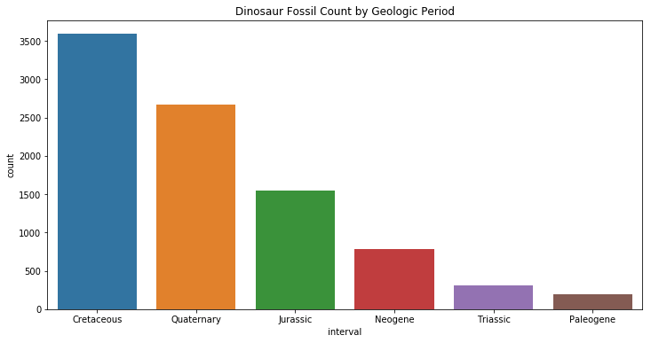
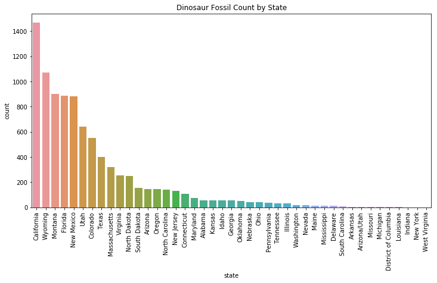
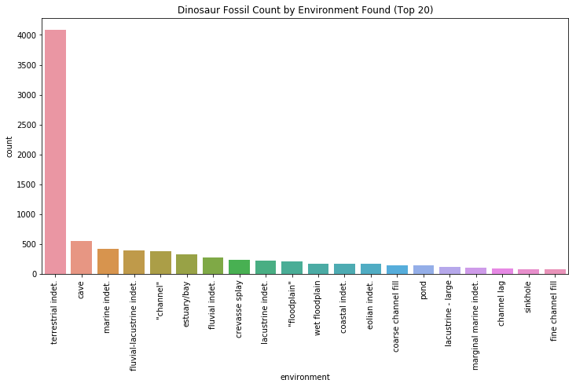
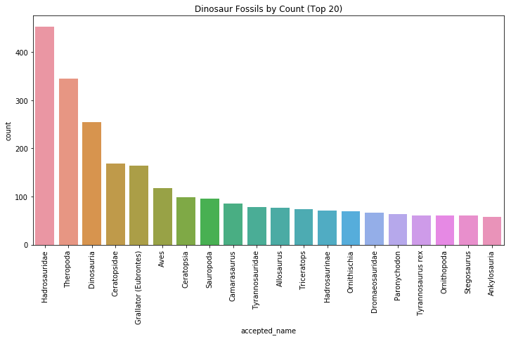
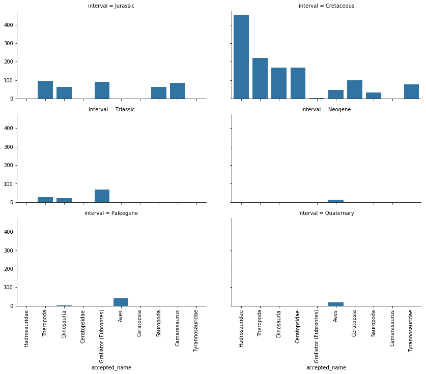
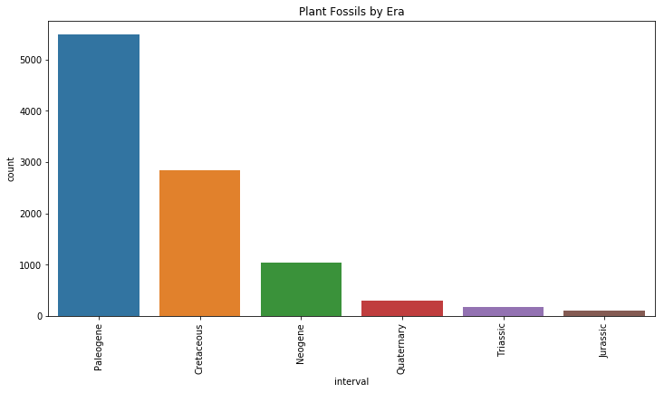
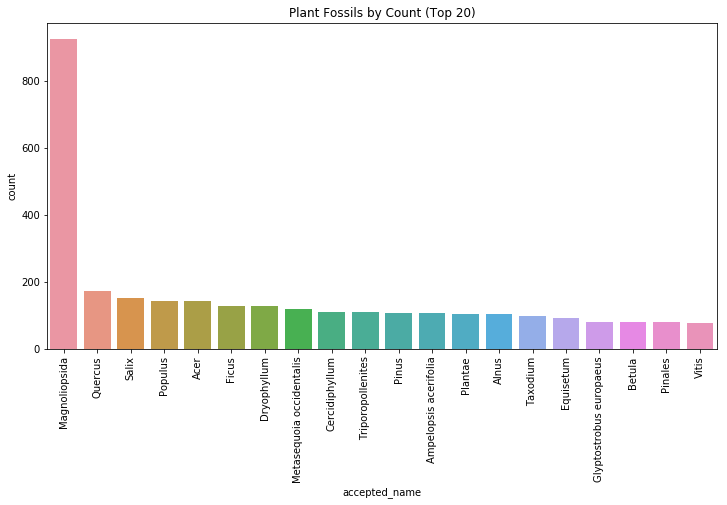
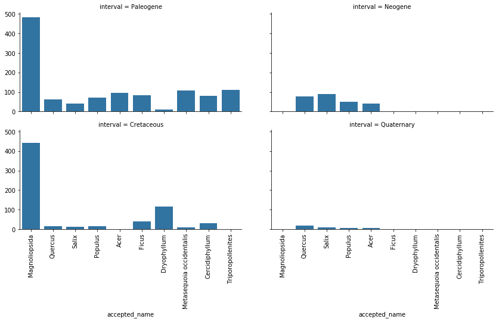

In this notebook, we will be examining data from the [Paleobiology Database (PBDB)](https://paleobiodb.org/navigator/). Specifically, we will be looking at dinosaur and plant fossils found in the United States of America and observing how the areas where different fossils are found and if their locations are correlated. This notebook also aims to be a guide to the process of Paleobiodogy Database exploratory analysis and data cleaning.

## What is the Paleobiology Database?

PBDB is a public database of paleontological data that anyone can use, maintained by an international non-governmental group of paleontologists. One of its main features is its navigator, which allows a user to sort data by geological time, taxa, authorizer, stratigraphy, and more. PBDB is run by the Department of Geoscience at the University of Wisconsin-Madison. The project team consists of Shanan Peters, Michael McClennan, and John Czaplewski. 

## How do you access the data?

PBDB is free to use and has no requirements for access. After sorting through the [PBDB navigator](https://paleobiodb.org/navigator/) and finding the dataset you want to download, click on the button to the left called "save map data". A window will appear, giving you two choices. You can either download the data as a CSV, JSON, TSV, or RIS file, or you can obtain a URL that can be used for external scripts such as R or Python. If you choose to download the data as a file, it can be used automatically for analysis. However, accessing the data by making HTTP requests is a little more intensive. This tutorial will teach you how to obtain the data desired by using the URL, and will require installation of Python and Jupyter. Download instructions can be found [here for Python](https://realpython.com/installing-python/) and [here for Jupyter](http://jupyter.org/install). In addition, documentation for the data service (including data recorded in the file and instructions on usage) can be found [here](https://paleobiodb.org/data1.2).

## Why PBDB?

The Paleobiology Database has an extensive dataset of different types of plant and animal fossils, and its navigator is visually stunning and well-designed. What drew me to PBDB was its large collection of dinosaur fossils, which is a topic I've always wanted to learn more about. I've heard it said that 3rd graders and scientists know the most about dinosaurs in the world. In this notebook, I will attempt to reach their level of dinsoaur mastery by analyzing the PBDB dinosaur dataset.

# Part I: Dinosaurs

First, let's gather the data we want to further examine. We will do this by making a HTTP request with the URL corresponding to the location of the data we want to look at. 
In order to obtain the URL:
1. Access the [PBDB navigator](https://paleobiodb.org/navigator/)
2. Choose the specimen you want to examine
3. Resize the map to get your desired coordinates 

By running the cell below, we will store the data obtained through the HTTP request, convert the data to a json file, and write the file to "dino_NA.json".


```python
import requests
import json
URL = "https://paleobiodb.org/data1.2/occs/list.json?lngmin=-142.2070&lngmax=-40.9570&latmin=23.8054&latmax=53.0676&base_id=52775&show=coords,attr,loc,prot,time,strat,stratext,lith,lithext,geo,rem,ent,entname,crmod&datainfo"

r = requests.get(url=URL) #store the data obtained through the HTTP request in r
data = r.json() #converts the data in r to a json file
with open("dino_NA.json", "w") as write_file:
    json.dump(data, write_file) #creates file dino_NA.json"
```

Now, we have to normalize the data by converting the structured json file into a flat table. We do this by importing the pandas library, which has a data structure called a DataFrame where we can store our data. 


```python
import pandas as pd
from pandas.io.json import json_normalize

df = pd.DataFrame.from_dict(json_normalize(data))
df
```


<div>
<style scoped>
    .dataframe tbody tr th:only-of-type {
        vertical-align: middle;
    }

    .dataframe tbody tr th {
        vertical-align: top;
    }

    .dataframe thead th {
        text-align: right;
    }
</style>
<table border="1" class="dataframe">
  <thead>
    <tr style="text-align: right;">
      <th></th>
      <th>access_time</th>
      <th>data_license</th>
      <th>data_provider</th>
      <th>data_source</th>
      <th>data_url</th>
      <th>documentation_url</th>
      <th>elapsed_time</th>
      <th>license_url</th>
      <th>parameters.base_id</th>
      <th>parameters.latmax</th>
      <th>parameters.latmin</th>
      <th>parameters.lngmax</th>
      <th>parameters.lngmin</th>
      <th>parameters.show</th>
      <th>parameters.taxon_status</th>
      <th>parameters.timerule</th>
      <th>records</th>
      <th>title</th>
    </tr>
  </thead>
  <tbody>
    <tr>
      <th>0</th>
      <td>Tue 2019-04-02 19:50:55 GMT</td>
      <td>Creative Commons CC-BY</td>
      <td>The Paleobiology Database</td>
      <td>The Paleobiology Database</td>
      <td>http://paleobiodb.org/data1.2/occs/list.json?l...</td>
      <td>http://paleobiodb.org/data1.2/occs/list_doc.html</td>
      <td>1.75</td>
      <td>http://creativecommons.org/licenses/by/4.0/</td>
      <td>52775</td>
      <td>53.0676</td>
      <td>23.8054</td>
      <td>-40.957</td>
      <td>-142.207</td>
      <td>coords,attr,loc,prot,time,strat,stratext,lith,...</td>
      <td>all</td>
      <td>major</td>
      <td>[{'oid': 'occ:139242', 'eid': 'rei:24752', 'ci...</td>
      <td>PBDB Data Service</td>
    </tr>
  </tbody>
</table>
</div>


Scrolling through this flattened table, we see that the column "records" has a nested list contained within it. Let's see what it shows:


```python
dino_df = pd.DataFrame.from_dict(json_normalize(data, ["records"]))
dino_df.head()
```


<div>
<style scoped>
    .dataframe tbody tr th:only-of-type {
        vertical-align: middle;
    }

    .dataframe tbody tr th {
        vertical-align: top;
    }

    .dataframe thead th {
        text-align: right;
    }
</style>
<table border="1" class="dataframe">
  <thead>
    <tr style="text-align: right;">
      <th></th>
      <th>ath</th>
      <th>ati</th>
      <th>cc2</th>
      <th>cid</th>
      <th>cny</th>
      <th>cxi</th>
      <th>dcr</th>
      <th>dmd</th>
      <th>eag</th>
      <th>eid</th>
      <th>...</th>
      <th>srb</th>
      <th>sro</th>
      <th>srs</th>
      <th>ssc</th>
      <th>stp</th>
      <th>szn</th>
      <th>tdf</th>
      <th>tec</th>
      <th>tid</th>
      <th>tna</th>
    </tr>
  </thead>
  <tbody>
    <tr>
      <th>0</th>
      <td>M. Carrano</td>
      <td>prs:14</td>
      <td>CA</td>
      <td>col:11890</td>
      <td>NaN</td>
      <td>39</td>
      <td>2011-05-13 07:45:44</td>
      <td>2011-05-12 16:46:47</td>
      <td>83.5</td>
      <td>rei:24752</td>
      <td>...</td>
      <td>4.135</td>
      <td>bottom to top</td>
      <td>Dinosaur Park</td>
      <td>bed</td>
      <td>Alberta</td>
      <td>NaN</td>
      <td>subjective synonym of</td>
      <td>NaN</td>
      <td>txn:53194</td>
      <td>Gorgosaurus libratus</td>
    </tr>
    <tr>
      <th>1</th>
      <td>M. Carrano</td>
      <td>prs:14</td>
      <td>CA</td>
      <td>col:11892</td>
      <td>NaN</td>
      <td>39</td>
      <td>2001-09-18 13:58:56</td>
      <td>2013-05-10 07:22:24</td>
      <td>83.5</td>
      <td>NaN</td>
      <td>...</td>
      <td>NaN</td>
      <td>NaN</td>
      <td>NaN</td>
      <td>bed</td>
      <td>Alberta</td>
      <td>NaN</td>
      <td>NaN</td>
      <td>NaN</td>
      <td>txn:38755</td>
      <td>Hadrosauridae</td>
    </tr>
    <tr>
      <th>2</th>
      <td>M. Carrano</td>
      <td>prs:14</td>
      <td>CA</td>
      <td>col:11893</td>
      <td>NaN</td>
      <td>39</td>
      <td>2010-07-27 08:36:19</td>
      <td>2010-07-27 10:37:07</td>
      <td>83.5</td>
      <td>rei:23301</td>
      <td>...</td>
      <td>NaN</td>
      <td>NaN</td>
      <td>NaN</td>
      <td>bed</td>
      <td>Alberta</td>
      <td>NaN</td>
      <td>NaN</td>
      <td>NaN</td>
      <td>txn:53194</td>
      <td>Gorgosaurus libratus</td>
    </tr>
    <tr>
      <th>3</th>
      <td>M. Carrano</td>
      <td>prs:14</td>
      <td>CA</td>
      <td>col:11894</td>
      <td>NaN</td>
      <td>39</td>
      <td>2001-09-18 14:04:56</td>
      <td>2006-04-21 12:43:50</td>
      <td>83.5</td>
      <td>NaN</td>
      <td>...</td>
      <td>4.03</td>
      <td>NaN</td>
      <td>Dinosaur Park</td>
      <td>bed</td>
      <td>Alberta</td>
      <td>NaN</td>
      <td>NaN</td>
      <td>NaN</td>
      <td>txn:63911</td>
      <td>Centrosaurus apertus</td>
    </tr>
    <tr>
      <th>4</th>
      <td>M. Carrano</td>
      <td>prs:14</td>
      <td>CA</td>
      <td>col:11895</td>
      <td>NaN</td>
      <td>39</td>
      <td>2010-07-27 08:39:37</td>
      <td>2010-07-27 10:39:58</td>
      <td>83.5</td>
      <td>rei:23302</td>
      <td>...</td>
      <td>NaN</td>
      <td>NaN</td>
      <td>NaN</td>
      <td>bed</td>
      <td>Alberta</td>
      <td>NaN</td>
      <td>NaN</td>
      <td>NaN</td>
      <td>txn:53194</td>
      <td>Gorgosaurus libratus</td>
    </tr>
  </tbody>
</table>
<p>5 rows × 61 columns</p>
</div>


```python
dino_df.shape
```


    (10976, 61)


We see that this table, which has the raw data we want concerning dinosaurs, has 10948 entries and 61 features in total. We can start cleaning our data now by renaming unintuitive column names, converting data values into something more workable (i.e. the time and date format of the "dcr" and "dmd" columns), and examining missing values. 


```python
def df_rename(df):
    df.rename({"ath": "authorizer",
               "ati": "authorizer_no",
               "cc2": "country",
               "cid": "collection_no",
               "cny": "county",
               "cxi": "cx_int_no",
               "dcr": "created",
                "dmd": "modified",
               "eag": "max_ma",
               "eid": "reid_no",
               "smb": "member",
               "ssc": "stratscale",
               "stp": "state",
               "tdf": "diference",
               "tid": "accepted_no",
                "slb": "local_bed",
                "slo": "local_order",
                "sls": "local_section",
                "env": "environment",
                "ent": "enterer",
                "ggc": "geog_comments",
                "gsc": "geog_scale",
                "gcm": "geology_comments",
                "ff1": "fossils_from_1",
                "ff2": "fossils_from_2",
                "idn": "identified_name",
                "la1": "lith_adj_1",
                "la2": "lith_adj_2",
                "lag": "min_ma",
                "iid": "identified_no",
                "ldc": "lith_descript",
                "lf1": "lithification_1",
                "lf2": "lithification_2",
                "lm1": "minor_lithology_1",
                "lm2": "minor_lithology_2",
                "mdf": "modifier",
                "lt1": "lithology_1",
                "lt2": "lithology_2",
                "ocm": "occurance_comments",
                "oei": "early_interval",
                "oli": "late_interval",
                "ptd": "protected",
                "scm": "strat_comments",
                "srs": "regional_section",
                "sfm": "formation",
                "sgr": "stratgroup",
               "tna": "accepted_name"}, inplace=True, axis="columns")
```

Here we have defined a rename function that will rename any dataframe with these specific column names. Because any set of data sourced from PBDB have these exact columns, this may be handy if we choose to look at more data from PBDB.


```python
df_rename(dino_df)
dino_df.head()
```


<div>
<style scoped>
    .dataframe tbody tr th:only-of-type {
        vertical-align: middle;
    }

    .dataframe tbody tr th {
        vertical-align: top;
    }

    .dataframe thead th {
        text-align: right;
    }
</style>
<table border="1" class="dataframe">
  <thead>
    <tr style="text-align: right;">
      <th></th>
      <th>authorizer</th>
      <th>authorizer_no</th>
      <th>country</th>
      <th>collection_no</th>
      <th>county</th>
      <th>cx_int_no</th>
      <th>created</th>
      <th>modified</th>
      <th>max_ma</th>
      <th>reid_no</th>
      <th>...</th>
      <th>srb</th>
      <th>sro</th>
      <th>regional_section</th>
      <th>stratscale</th>
      <th>state</th>
      <th>szn</th>
      <th>diference</th>
      <th>tec</th>
      <th>accepted_no</th>
      <th>accepted_name</th>
    </tr>
  </thead>
  <tbody>
    <tr>
      <th>0</th>
      <td>M. Carrano</td>
      <td>prs:14</td>
      <td>CA</td>
      <td>col:11890</td>
      <td>NaN</td>
      <td>39</td>
      <td>2011-05-13 07:45:44</td>
      <td>2011-05-12 16:46:47</td>
      <td>83.5</td>
      <td>rei:24752</td>
      <td>...</td>
      <td>4.135</td>
      <td>bottom to top</td>
      <td>Dinosaur Park</td>
      <td>bed</td>
      <td>Alberta</td>
      <td>NaN</td>
      <td>subjective synonym of</td>
      <td>NaN</td>
      <td>txn:53194</td>
      <td>Gorgosaurus libratus</td>
    </tr>
    <tr>
      <th>1</th>
      <td>M. Carrano</td>
      <td>prs:14</td>
      <td>CA</td>
      <td>col:11892</td>
      <td>NaN</td>
      <td>39</td>
      <td>2001-09-18 13:58:56</td>
      <td>2013-05-10 07:22:24</td>
      <td>83.5</td>
      <td>NaN</td>
      <td>...</td>
      <td>NaN</td>
      <td>NaN</td>
      <td>NaN</td>
      <td>bed</td>
      <td>Alberta</td>
      <td>NaN</td>
      <td>NaN</td>
      <td>NaN</td>
      <td>txn:38755</td>
      <td>Hadrosauridae</td>
    </tr>
    <tr>
      <th>2</th>
      <td>M. Carrano</td>
      <td>prs:14</td>
      <td>CA</td>
      <td>col:11893</td>
      <td>NaN</td>
      <td>39</td>
      <td>2010-07-27 08:36:19</td>
      <td>2010-07-27 10:37:07</td>
      <td>83.5</td>
      <td>rei:23301</td>
      <td>...</td>
      <td>NaN</td>
      <td>NaN</td>
      <td>NaN</td>
      <td>bed</td>
      <td>Alberta</td>
      <td>NaN</td>
      <td>NaN</td>
      <td>NaN</td>
      <td>txn:53194</td>
      <td>Gorgosaurus libratus</td>
    </tr>
    <tr>
      <th>3</th>
      <td>M. Carrano</td>
      <td>prs:14</td>
      <td>CA</td>
      <td>col:11894</td>
      <td>NaN</td>
      <td>39</td>
      <td>2001-09-18 14:04:56</td>
      <td>2006-04-21 12:43:50</td>
      <td>83.5</td>
      <td>NaN</td>
      <td>...</td>
      <td>4.03</td>
      <td>NaN</td>
      <td>Dinosaur Park</td>
      <td>bed</td>
      <td>Alberta</td>
      <td>NaN</td>
      <td>NaN</td>
      <td>NaN</td>
      <td>txn:63911</td>
      <td>Centrosaurus apertus</td>
    </tr>
    <tr>
      <th>4</th>
      <td>M. Carrano</td>
      <td>prs:14</td>
      <td>CA</td>
      <td>col:11895</td>
      <td>NaN</td>
      <td>39</td>
      <td>2010-07-27 08:39:37</td>
      <td>2010-07-27 10:39:58</td>
      <td>83.5</td>
      <td>rei:23302</td>
      <td>...</td>
      <td>NaN</td>
      <td>NaN</td>
      <td>NaN</td>
      <td>bed</td>
      <td>Alberta</td>
      <td>NaN</td>
      <td>NaN</td>
      <td>NaN</td>
      <td>txn:53194</td>
      <td>Gorgosaurus libratus</td>
    </tr>
  </tbody>
</table>
<p>5 rows × 61 columns</p>
</div>


```python
dino_df.columns
```


    Index(['authorizer', 'authorizer_no', 'country', 'collection_no', 'county',
           'cx_int_no', 'created', 'modified', 'max_ma', 'reid_no', 'eni',
           'enterer', 'environment', 'fossils_from_1', 'fossils_from_2', 'flg',
           'geology_comments', 'geog_comments', 'geog_scale', 'identified_name',
           'idr', 'identified_no', 'lith_adj_1', 'lith_adj_2', 'min_ma', 'lat',
           'lith_descript', 'lithification_1', 'lithification_2',
           'minor_lithology_1', 'minor_lithology_2', 'lng', 'lithology_1',
           'lithology_2', 'modifier', 'mdi', 'occurance_comments',
           'early_interval', 'oid', 'late_interval', 'prc', 'protected', 'rid',
           'rnk', 'strat_comments', 'formation', 'stratgroup', 'local_bed',
           'local_order', 'local_section', 'member', 'srb', 'sro',
           'regional_section', 'stratscale', 'state', 'szn', 'diference', 'tec',
           'accepted_no', 'accepted_name'],
          dtype='object')


I've tried my best to rename columns from the [PBDB API documentation](https://paleobiodb.org/data1.2/general/identifiers_doc.html) and from the csv file I downloaded. However, I couldn't find column names for every column, and some others were near indistinguishable from others. Columns such as "reid_no" and "authorizer_no" contain identifying information that aren't particularly anything of interest. That being said, let's take a look at some interesting data and see what we find. 


```python
interesting = dino_df[["accepted_name", "state", "lat", "lng", "environment", "created", "country", "early_interval", "late_interval"]]
interesting.head()
```


<div>
<style scoped>
    .dataframe tbody tr th:only-of-type {
        vertical-align: middle;
    }

    .dataframe tbody tr th {
        vertical-align: top;
    }

    .dataframe thead th {
        text-align: right;
    }
</style>
<table border="1" class="dataframe">
  <thead>
    <tr style="text-align: right;">
      <th></th>
      <th>accepted_name</th>
      <th>state</th>
      <th>lat</th>
      <th>lng</th>
      <th>environment</th>
      <th>created</th>
      <th>country</th>
      <th>early_interval</th>
      <th>late_interval</th>
    </tr>
  </thead>
  <tbody>
    <tr>
      <th>0</th>
      <td>Gorgosaurus libratus</td>
      <td>Alberta</td>
      <td>50.740726</td>
      <td>-111.528732</td>
      <td>"channel"</td>
      <td>2011-05-13 07:45:44</td>
      <td>CA</td>
      <td>Late Campanian</td>
      <td>NaN</td>
    </tr>
    <tr>
      <th>1</th>
      <td>Hadrosauridae</td>
      <td>Alberta</td>
      <td>50.753296</td>
      <td>-111.461914</td>
      <td>terrestrial indet.</td>
      <td>2001-09-18 13:58:56</td>
      <td>CA</td>
      <td>Late Campanian</td>
      <td>NaN</td>
    </tr>
    <tr>
      <th>2</th>
      <td>Gorgosaurus libratus</td>
      <td>Alberta</td>
      <td>50.737015</td>
      <td>-111.549347</td>
      <td>"channel"</td>
      <td>2010-07-27 08:36:19</td>
      <td>CA</td>
      <td>Late Campanian</td>
      <td>NaN</td>
    </tr>
    <tr>
      <th>3</th>
      <td>Centrosaurus apertus</td>
      <td>Alberta</td>
      <td>50.737297</td>
      <td>-111.528931</td>
      <td>terrestrial indet.</td>
      <td>2001-09-18 14:04:56</td>
      <td>CA</td>
      <td>Late Campanian</td>
      <td>NaN</td>
    </tr>
    <tr>
      <th>4</th>
      <td>Gorgosaurus libratus</td>
      <td>Alberta</td>
      <td>50.723866</td>
      <td>-111.564636</td>
      <td>channel lag</td>
      <td>2010-07-27 08:39:37</td>
      <td>CA</td>
      <td>Late Campanian</td>
      <td>NaN</td>
    </tr>
  </tbody>
</table>
</div>


Some things of note:  
1) There are two columns for name, accepted_name and identified_name. I chose accepted_name because it had fewer missing values.  
2) The late_interval column seems to be missing a lot of values. Unless otherwise specified, we will date the dinosaurs as belonging to the early_interval.  


```python
interesting["country"].unique()
```


    array(['CA', 'US', 'MX', 'UZ', 'BM', 'BS', 'MN'], dtype=object)


It looks like we have dinosaurs found in countries like Canada, Mexico, and Bermuda. Let's narrow our search to the US, which is what we're interested in.


```python
interesting = interesting[interesting["country"] == "US"]
print(interesting.shape)
interesting.head()
```

    (9094, 9)


<div>
<style scoped>
    .dataframe tbody tr th:only-of-type {
        vertical-align: middle;
    }

    .dataframe tbody tr th {
        vertical-align: top;
    }

    .dataframe thead th {
        text-align: right;
    }
</style>
<table border="1" class="dataframe">
  <thead>
    <tr style="text-align: right;">
      <th></th>
      <th>accepted_name</th>
      <th>state</th>
      <th>lat</th>
      <th>lng</th>
      <th>environment</th>
      <th>created</th>
      <th>country</th>
      <th>early_interval</th>
      <th>late_interval</th>
    </tr>
  </thead>
  <tbody>
    <tr>
      <th>19</th>
      <td>Theropoda</td>
      <td>Connecticut</td>
      <td>41.566666</td>
      <td>-72.633331</td>
      <td>terrestrial indet.</td>
      <td>2011-07-28 02:09:51</td>
      <td>US</td>
      <td>Hettangian</td>
      <td>Sinemurian</td>
    </tr>
    <tr>
      <th>20</th>
      <td>Camarasaurus grandis</td>
      <td>Colorado</td>
      <td>39.068802</td>
      <td>-108.699989</td>
      <td>fluvial-lacustrine indet.</td>
      <td>2017-11-02 14:56:21</td>
      <td>US</td>
      <td>Kimmeridgian</td>
      <td>Tithonian</td>
    </tr>
    <tr>
      <th>21</th>
      <td>Camarasaurus supremus</td>
      <td>Colorado</td>
      <td>39.111668</td>
      <td>-108.717499</td>
      <td>fluvial-lacustrine indet.</td>
      <td>2001-09-19 09:11:44</td>
      <td>US</td>
      <td>Kimmeridgian</td>
      <td>NaN</td>
    </tr>
    <tr>
      <th>22</th>
      <td>Ankylosaurus magniventris</td>
      <td>Montana</td>
      <td>47.637699</td>
      <td>-106.569901</td>
      <td>terrestrial indet.</td>
      <td>2001-09-19 10:03:19</td>
      <td>US</td>
      <td>Maastrichtian</td>
      <td>NaN</td>
    </tr>
    <tr>
      <th>23</th>
      <td>Titanosauriformes</td>
      <td>Oklahoma</td>
      <td>34.180000</td>
      <td>-96.278053</td>
      <td>coastal indet.</td>
      <td>2005-08-25 14:56:00</td>
      <td>US</td>
      <td>Late Aptian</td>
      <td>Early Albian</td>
    </tr>
  </tbody>
</table>
</div>


Now we only have 9070 entries.

### Going Back in Time

Now let's take a look at the time component of the data.


```python
interesting["early_interval"].unique()
```


    array(['Hettangian', 'Kimmeridgian', 'Maastrichtian', 'Late Aptian',
           'Late Campanian', 'Late Albian', 'Rhaetian', 'Sinemurian',
           'Campanian', 'Late Maastrichtian', 'Hemingfordian', 'Orellan',
           'Langhian', 'Tortonian', 'Early Coniacian', 'Early Eocene',
           'Late Eocene', 'Late Kimmeridgian', 'Bridgerian', 'Harrisonian',
           'Late Santonian', 'Piacenzian', 'Aptian', 'Early Tithonian',
           'Clarendonian', 'Norian', 'Middle Campanian', 'Lancian',
           'Judithian', 'Late Pleistocene', 'Middle Cenomanian',
           'Hemphillian', 'Early Campanian', 'Albian', 'Pliensbachian',
           'Irvingtonian', 'Wasatchian', 'Early Maastrichtian', 'Santonian',
           'Barremian', 'Early Aptian', 'Late Hemphillian', 'Blancan',
           'Late Uintan', 'Middle Pleistocene', 'Middle Coniacian',
           'Early Cenomanian', 'Late Oxfordian', 'Late Coniacian',
           'Late Clarendonian', 'early Early Hemphillian', 'Turonian',
           'Oligocene', 'Miocene', 'Late Callovian', 'Cenomanian',
           'Tithonian', 'Early Kimmeridgian', 'Late Cretaceous',
           'Middle Santonian', 'Valanginian', 'Zanclean', 'Early Jurassic',
           'Early Hettangian', 'Late Triassic', 'Middle Turonian',
           'Early Cretaceous', 'Early Santonian', 'Middle Tithonian',
           'Middle Albian', 'Early Albian', 'Serravallian', 'Lacian',
           'Duchesnean', 'Jurassic', 'Rancholabrean', 'Edmontonian',
           'Bartonian', 'Priabonian', 'Early Callovian', 'Carnian',
           'Middle Callovian', 'Bathonian', 'Late Bajocian', 'Rupelian',
           'Chattian', 'Oxfordian', 'Late Jurassic', 'Aquitanian', 'Holocene',
           'Late Cenomanian', 'Arikareean', 'Cretaceous', 'Early Uintan',
           'Eocene', 'Messinian', 'Late Miocene', 'Coniacian',
           'Late Barremian', 'Pleistocene', 'Lysitean', 'Uintan',
           'Early Barstovian', 'Barstovian', 'Chadronian', 'Whitneyan',
           'Puercan', 'Middle Eocene', 'Late Pliocene', 'Pliocene',
           'Late Turonian', 'Clarkforkian', 'Late Chadronian', 'Burdigalian',
           'Tiffanian', 'Early Barremian', 'Early Sinemurian',
           'Late Paleocene', 'Early Oligocene', 'Early Pliocene', 'Bajocian',
           'Early Miocene', 'Middle Miocene', 'Early Hemingfordian',
           'Thanetian', 'Late Oligocene', 'Calabrian', 'Early Pleistocene',
           'Early Clarendonian', 'Late Berriasian', 'Berriasian',
           'Torrejonian', 'Toarcian', 'Smithian', 'Geringian'], dtype=object)


That's a lot of intervals! Our data is provided at an extremely fine time scale, which is often a good thing. However, this may make it hard for us to visualize our data. Instead, let's make a separate column, "interval", that rounds everything from the early interval level up to the nearest era. Below, you see lists containing every sub-category of eras found in our data. We use that data to change the fine interval data to coarser, easier to work with era data.


```python
interesting["interval"] = interesting["early_interval"]
```


```python
def make_stages(stages, period):
    return [stage + " " + age for stage in stages for age in period]
```


```python
stages = ["Early", "Middle", "Late"]

Cretaceous = ["Maastrichtian", "Campanian", "Santonian", "Coniacian", "Turonian", "Cenomanian", "Albian", "Aptian", "Barremian",
"Hauterivian", "Valanginian", "Berriasian", "Cretaceous", "Lancian", "Judithian", "Edmontonian"]
Cretaceous += make_stages(stages, Cretaceous)

Jurassic = ["Hettangian", "Sinemurian", "Pliensbachian", "Toarcian", "Aalenian", "Bajocian", "Bathonian", "Callovian",
"Oxfordian", "Kimmeridgian", "Tithonian", "Jurassic"]
Jurassic += make_stages(stages, Jurassic)

Triassic = ["Olenekian", "Anisian", "Ladinian", "Carnian", "Norian", "Rhaetian", "Induan", "Triassic", "Smithian", "Alaunian"]
Triassic += make_stages(stages, Triassic)

Neogene = ["Aquitanian", "Burdigalian", "Langhian", "Serravallian", "Tortonian", "Messinian", "Zanclean", "Neogene", "Miocene",
          "Pliocene", "Hemingfordian", "Piacenzian", "Clarendonian", "Hemphillian", "Blancan", "Arikareean", "Barstovian"]
Neogene += make_stages(stages, Neogene)

Paleogene = ["Danian", "Selandian", "Thanetian", "Ypresian", "Lutetian", "Bartonian", "Priabonian", "Rupelian", "Chattian", 
             "Paleogene", "Oligocene", "Eocene", "Paleocene", "Orellan", "Bridgerian", "Harrisonian", "Wasatchian",
            "Uintan", "Duchesnean", "Chadronian", "Whitneyan", "Puercan", "Clarkforkian", "Tiffanian", "Torrejonian", 
             "Geringian", "Lysitean"]
Paleogene += make_stages(stages, Paleogene)

Quaternary = ["Holocene", "Pleistocene", "Quaternary", "Irvingtonian", "Rancholabrean", "Calabrian"]
Quaternary += make_stages(stages, Quaternary)
```


```python
#here I replace a mistaken entry
interesting["interval"] = interesting["interval"].replace("early Early Hemphillian", "Early Hemphillian")
```

This function changes the items in "start" with the word in "end" from the dataframe "df".


```python
def change_geog(start, end, df):
    df["interval"] = df['interval'].replace(start, end)
change_geog(Cretaceous, "Cretaceous", interesting)
change_geog(Jurassic, "Jurassic", interesting)
change_geog(Triassic, "Triassic", interesting)
change_geog(Neogene, "Neogene", interesting)
change_geog(Paleogene, "Paleogene", interesting)
change_geog(Quaternary, "Quaternary", interesting)
```


```python
#One of the early intervals was labeled "Lacian". However, my search for Lacian resulted in nothing, so I went with the 
#late interval of Alaunian instead.
interesting["interval"] = interesting["interval"].replace("Lacian", "Triassic")
```


```python
interesting.head()
```


<div>
<style scoped>
    .dataframe tbody tr th:only-of-type {
        vertical-align: middle;
    }

    .dataframe tbody tr th {
        vertical-align: top;
    }

    .dataframe thead th {
        text-align: right;
    }
</style>
<table border="1" class="dataframe">
  <thead>
    <tr style="text-align: right;">
      <th></th>
      <th>accepted_name</th>
      <th>state</th>
      <th>lat</th>
      <th>lng</th>
      <th>environment</th>
      <th>created</th>
      <th>country</th>
      <th>early_interval</th>
      <th>late_interval</th>
      <th>interval</th>
    </tr>
  </thead>
  <tbody>
    <tr>
      <th>19</th>
      <td>Theropoda</td>
      <td>Connecticut</td>
      <td>41.566666</td>
      <td>-72.633331</td>
      <td>terrestrial indet.</td>
      <td>2011-07-28 02:09:51</td>
      <td>US</td>
      <td>Hettangian</td>
      <td>Sinemurian</td>
      <td>Jurassic</td>
    </tr>
    <tr>
      <th>20</th>
      <td>Camarasaurus grandis</td>
      <td>Colorado</td>
      <td>39.068802</td>
      <td>-108.699989</td>
      <td>fluvial-lacustrine indet.</td>
      <td>2017-11-02 14:56:21</td>
      <td>US</td>
      <td>Kimmeridgian</td>
      <td>Tithonian</td>
      <td>Jurassic</td>
    </tr>
    <tr>
      <th>21</th>
      <td>Camarasaurus supremus</td>
      <td>Colorado</td>
      <td>39.111668</td>
      <td>-108.717499</td>
      <td>fluvial-lacustrine indet.</td>
      <td>2001-09-19 09:11:44</td>
      <td>US</td>
      <td>Kimmeridgian</td>
      <td>NaN</td>
      <td>Jurassic</td>
    </tr>
    <tr>
      <th>22</th>
      <td>Ankylosaurus magniventris</td>
      <td>Montana</td>
      <td>47.637699</td>
      <td>-106.569901</td>
      <td>terrestrial indet.</td>
      <td>2001-09-19 10:03:19</td>
      <td>US</td>
      <td>Maastrichtian</td>
      <td>NaN</td>
      <td>Cretaceous</td>
    </tr>
    <tr>
      <th>23</th>
      <td>Titanosauriformes</td>
      <td>Oklahoma</td>
      <td>34.180000</td>
      <td>-96.278053</td>
      <td>coastal indet.</td>
      <td>2005-08-25 14:56:00</td>
      <td>US</td>
      <td>Late Aptian</td>
      <td>Early Albian</td>
      <td>Cretaceous</td>
    </tr>
  </tbody>
</table>
</div>


```python
print(interesting["interval"].unique())
len(interesting["early_interval"].unique())
```

    ['Jurassic' 'Cretaceous' 'Triassic' 'Neogene' 'Paleogene' 'Quaternary']


    135


Now we have another column that makes our data a little more coarse but ultimately easier to work with. Originally, there were 135 different types of periods, epochs, and stages! Now, we've combined our data into 6 periods of geology that we can analyze more easily. Our data dates back to the Triassic period (251.9 million years ago) and contains at least one data point for every period since then, up to the Quaternary period (0.5 million years ago).


```python
interesting["interval"].value_counts()
```


    Cretaceous    3592
    Quaternary    2668
    Jurassic      1544
    Neogene        787
    Triassic       308
    Paleogene      195
    Name: interval, dtype: int64


Now let's visualize this data. To use the seaborn and matplotlib libraries, you first have to download it from the command line by running "pip install seaborn" and "pip install matplotlib". Then, it's just a quick import and its ready for use.


```python
import seaborn as sns
import matplotlib.pyplot as plt
plt.figure(figsize=(12,6)) #create a figure that is 12 x 6
ax = sns.countplot(x='interval', data=interesting, order=interesting['interval'].value_counts().index.tolist())
plt.title("Dinosaur Fossil Count by Geologic Period")
plt.show()
```





"Jurassic Park" should have been called "Cretaceous Park"! Dinosaurs lived during the Mesozoic era, which is composed of three periods: the Triassic, Jurrassic and the Cretaceous. It is likely that there are more fossils during the Cretaceous because it was closer in time to present-day. However, it is puzzling that there are so many fossils found during the Quaternary period, given that dinosaurs only lived millions of years before the Quaternary. Let's attempt to answer this question by looking at the location of dinosaur fossils.

### Location of Dinosaur Fossils

Now, let's look at the spread of dinosaur fossils across the 50 states.


```python
print(interesting["state"].unique())
print(len(interesting["state"].unique()))
interesting["state"].value_counts()
```

    ['Connecticut' 'Colorado' 'Montana' 'Oklahoma' 'New Mexico' 'Arizona'
     'Wyoming' 'Utah' 'Florida' 'California' 'Kansas' 'Nebraska' 'Texas'
     'South Dakota' 'New Jersey' 'North Dakota' 'Georgia' 'Mississippi'
     'Nevada' 'Indiana' 'Maryland' 'Massachusetts' 'Missouri' 'Tennessee'
     'Delaware' 'Alabama' 'Arkansas' 'Pennsylvania' 'District of Columbia'
     'Idaho' 'Louisiana' 'North Carolina' 'South Carolina' 'Virginia'
     'New York' 'Arizona/Utah' 'Michigan' 'Oregon' 'Washington' 'Maine'
     'West Virginia' 'Alberta' 'Illinois' 'Ohio']
    44


    California              1467
    Wyoming                 1072
    Montana                  903
    Florida                  885
    New Mexico               882
    Utah                     642
    Colorado                 550
    Texas                    401
    Massachusetts            322
    Virginia                 254
    North Dakota             250
    South Dakota             153
    Arizona                  145
    Oregon                   144
    North Carolina           141
    New Jersey               131
    Connecticut              107
    Maryland                  73
    Alabama                   57
    Kansas                    56
    Idaho                     55
    Georgia                   54
    Oklahoma                  53
    Nebraska                  42
    Ohio                      41
    Pennsylvania              38
    Tennessee                 34
    Illinois                  31
    Washington                19
    Nevada                    18
    Maine                     15
    Mississippi               12
    Delaware                  11
    South Carolina             9
    Arkansas                   5
    Arizona/Utah               4
    Michigan                   4
    Missouri                   4
    District of Columbia       3
    Louisiana                  3
    Indiana                    1
    New York                   1
    Alberta                    1
    West Virginia              1
    Name: state, dtype: int64


Here we have a mis-entry. Alberta is a province of Canada, so we'll drop this row.


```python
interesting[interesting["state"] == "Alberta"]
```


<div>
<style scoped>
    .dataframe tbody tr th:only-of-type {
        vertical-align: middle;
    }

    .dataframe tbody tr th {
        vertical-align: top;
    }

    .dataframe thead th {
        text-align: right;
    }
</style>
<table border="1" class="dataframe">
  <thead>
    <tr style="text-align: right;">
      <th></th>
      <th>accepted_name</th>
      <th>state</th>
      <th>lat</th>
      <th>lng</th>
      <th>environment</th>
      <th>created</th>
      <th>country</th>
      <th>early_interval</th>
      <th>late_interval</th>
      <th>interval</th>
    </tr>
  </thead>
  <tbody>
    <tr>
      <th>7013</th>
      <td>Albertadromeus syntarsus</td>
      <td>Alberta</td>
      <td>49.179443</td>
      <td>-110.682777</td>
      <td>terrestrial indet.</td>
      <td>2013-05-08 21:18:11</td>
      <td>US</td>
      <td>Campanian</td>
      <td>NaN</td>
      <td>Cretaceous</td>
    </tr>
  </tbody>
</table>
</div>


```python
interesting = interesting[interesting.state != "Alberta"]
interesting.shape #as expected, we have one less entry
```


    (9093, 10)


```python
plt.figure(figsize=(12,6))
ax = sns.countplot(x='state', data=interesting, order=interesting['state'].value_counts().index.tolist())
ax.set_xticklabels(ax.get_xticklabels(), rotation=90)
plt.title("Dinosaur Fossil Count by State")
plt.show()
```





According to this plot, California has the largest quantity of found dinosaur fossils. This finding is a bit puzzling. During the Mesozoic era, when most dinosaurs lived, California was still covered by the ocean. Let's look at some of the fossils found in California to see what we find.


```python
interesting[interesting["state"] == "California"].head()
```


<div>
<style scoped>
    .dataframe tbody tr th:only-of-type {
        vertical-align: middle;
    }

    .dataframe tbody tr th {
        vertical-align: top;
    }

    .dataframe thead th {
        text-align: right;
    }
</style>
<table border="1" class="dataframe">
  <thead>
    <tr style="text-align: right;">
      <th></th>
      <th>accepted_name</th>
      <th>state</th>
      <th>lat</th>
      <th>lng</th>
      <th>environment</th>
      <th>created</th>
      <th>country</th>
      <th>early_interval</th>
      <th>late_interval</th>
      <th>interval</th>
    </tr>
  </thead>
  <tbody>
    <tr>
      <th>45</th>
      <td>Hadrogyps aigialeus</td>
      <td>California</td>
      <td>35.299999</td>
      <td>-118.500000</td>
      <td>shoreface</td>
      <td>2002-02-18 12:54:21</td>
      <td>US</td>
      <td>Langhian</td>
      <td>NaN</td>
      <td>Neogene</td>
    </tr>
    <tr>
      <th>46</th>
      <td>Miomancalla wetmorei</td>
      <td>California</td>
      <td>33.561943</td>
      <td>-117.712219</td>
      <td>basinal (siliciclastic)</td>
      <td>2002-02-19 12:56:07</td>
      <td>US</td>
      <td>Tortonian</td>
      <td>NaN</td>
      <td>Neogene</td>
    </tr>
    <tr>
      <th>188</th>
      <td>Saurolophinae</td>
      <td>California</td>
      <td>37.466667</td>
      <td>-121.216667</td>
      <td>marine indet.</td>
      <td>2005-10-12 10:57:20</td>
      <td>US</td>
      <td>Maastrichtian</td>
      <td>NaN</td>
      <td>Cretaceous</td>
    </tr>
    <tr>
      <th>218</th>
      <td>Falconiformes</td>
      <td>California</td>
      <td>33.228889</td>
      <td>-116.260277</td>
      <td>fluvial indet.</td>
      <td>2002-10-16 16:21:34</td>
      <td>US</td>
      <td>Irvingtonian</td>
      <td>NaN</td>
      <td>Quaternary</td>
    </tr>
    <tr>
      <th>264</th>
      <td>Anatidae</td>
      <td>California</td>
      <td>37.056667</td>
      <td>-120.195831</td>
      <td>lacustrine indet.</td>
      <td>2002-11-20 12:50:20</td>
      <td>US</td>
      <td>Irvingtonian</td>
      <td>NaN</td>
      <td>Quaternary</td>
    </tr>
  </tbody>
</table>
</div>


Interestingly, 4/5 of our first five entries are fossils found in the Neogene and Quaternary periods, millions of years after dinosaurs roamed the earth. *Miomancalla wetmorei*, shown in row 2, is a species of flightless auk, or penguin-esque birds (picture shown below). According to this page of [fossilworks.org](http://fossilworks.org/bridge.pl?a=taxonInfo&taxon_no=105697), which is a site that describes entries in PBDB, this specimen is a fossilized limb of an auk that lived roughly 7 million - 11 million years ago. 

 

**It turns out that our data not only contains dinosaur fossils, but also the fossils of their descendants!** Because I took all the results from the *Dinosauria* clade in the PBDB navigator, *Aves*, or birds, were also included due to their line of descent from theropoda dinosaurs (dinosaurs classified by their three toes and hollow limbs).

Now let's look at the environments that the fossils were found in. It looks like a vast majority were found in an indeterminate terrestrial environment.


```python
print(interesting["environment"].unique())
print("")
print("Total unique environment types: ", len(interesting["environment"].unique()))
```

    ['terrestrial indet.' 'fluvial-lacustrine indet.' 'coastal indet.'
     '"channel"' 'fluvial indet.' 'coarse channel fill' 'wet floodplain'
     '"floodplain"' 'shoreface' 'basinal (siliciclastic)' 'marine indet.'
     'pond' 'crevasse splay' 'lacustrine indet.' 'lacustrine - small'
     'fine channel fill' 'lagoonal' 'levee' 'estuary/bay'
     'marginal marine indet.' 'deltaic indet.' 'dune'
     'shallow subtidal indet.' 'mire/swamp' 'alluvial fan'
     'lagoonal/restricted shallow subtidal' 'paralic indet.' 'channel lag'
     'transition zone/lower shoreface' 'offshore' 'fissure fill' 'interdune'
     'eolian indet.' 'karst indet.' 'dry floodplain' 'delta plain'
     'interdistributary bay' 'spring' 'fluvial-deltaic indet.'
     'lacustrine - large' 'peritidal' 'carbonate indet.' 'offshore shelf'
     'cave' 'sinkhole' 'glacial' 'lacustrine delta plain' 'foreshore'
     'basinal (siliceous)' 'tar' 'deep subtidal shelf' 'offshore indet.'
     'deep-water indet.' nan 'open shallow subtidal' 'lacustrine delta front'
     'lacustrine deltaic indet.']
    
    Total unique environment types:  57


```python
plt.figure(figsize=(12,6))
ax = sns.countplot(x='environment', data=interesting, order = interesting['environment'].value_counts().index.tolist()[:20])
ax.set_xticklabels(ax.get_xticklabels(), rotation=90)
plt.title("Dinosaur Fossil Count by Environment Found (Top 20)")
plt.show()
```





The overwhelming majority of environment types is terrestrial indeterminate, which accounts for all land-based discoveries that don't have any defining features. The second most common type of environemnt is caves, which preserve fossils beautifully by trapping sediment that are washed or blown in by waves or wind.


```python
print(interesting["accepted_name"].unique())
print("")
print("Total unique fossil types: ", len(interesting["accepted_name"].unique()))
```

    ['Theropoda' 'Camarasaurus grandis' 'Camarasaurus supremus' ... 'Corvidae'
     'Rhinorex condrupus' 'Macroelongatoolithus']
    
    Total unique fossil types:  1532


What is our most common dinosaur fossil?


```python
plt.figure(figsize=(12,6))
ax = sns.countplot(x='accepted_name', data=interesting, order = interesting['accepted_name'].value_counts().index.tolist()[:20])
ax.set_xticklabels(ax.get_xticklabels(), rotation=90)
plt.title("Dinosaur Fossils by Count (Top 20)")
plt.show()
```





Our top fossil in terms of count is the [Hadrosauridae](https://en.wikipedia.org/wiki/Hadrosaurid), commonly characterized by their duck-billed beaks. They are descendants of the Upper Jurassic/Lower Cretaceous iguanodontian dinosaurs and were most commonly found in the late Cretaceous era. Although Hadrosauridae can grow very large (28 feet long), they are herbivores, with their duck bills are evolved for grinding plants.


Now let's look at the distributions of the most common dinosaurs across the geological periods using a [facetgrid](https://seaborn.pydata.org/generated/seaborn.FacetGrid.html). To keep our visualization clutter-free, we'll limit our dinosaurs to the top 10 most common.


```python
top10 = interesting['accepted_name'].value_counts().index.tolist()[:10]
top_dinos = interesting[interesting["accepted_name"].isin(top10)]
top_dinos
```


<div>
<style scoped>
    .dataframe tbody tr th:only-of-type {
        vertical-align: middle;
    }

    .dataframe tbody tr th {
        vertical-align: top;
    }

    .dataframe thead th {
        text-align: right;
    }
</style>
<table border="1" class="dataframe">
  <thead>
    <tr style="text-align: right;">
      <th></th>
      <th>accepted_name</th>
      <th>state</th>
      <th>lat</th>
      <th>lng</th>
      <th>environment</th>
      <th>created</th>
      <th>country</th>
      <th>early_interval</th>
      <th>late_interval</th>
      <th>interval</th>
    </tr>
  </thead>
  <tbody>
    <tr>
      <th>19</th>
      <td>Theropoda</td>
      <td>Connecticut</td>
      <td>41.566666</td>
      <td>-72.633331</td>
      <td>terrestrial indet.</td>
      <td>2011-07-28 02:09:51</td>
      <td>US</td>
      <td>Hettangian</td>
      <td>Sinemurian</td>
      <td>Jurassic</td>
    </tr>
    <tr>
      <th>26</th>
      <td>Hadrosauridae</td>
      <td>Montana</td>
      <td>47.695831</td>
      <td>-106.227776</td>
      <td>"channel"</td>
      <td>2002-01-15 15:16:43</td>
      <td>US</td>
      <td>Maastrichtian</td>
      <td>NaN</td>
      <td>Cretaceous</td>
    </tr>
    <tr>
      <th>36</th>
      <td>Theropoda</td>
      <td>Colorado</td>
      <td>38.278610</td>
      <td>-108.930832</td>
      <td>terrestrial indet.</td>
      <td>2002-02-05 14:36:05</td>
      <td>US</td>
      <td>Rhaetian</td>
      <td>Hettangian</td>
      <td>Triassic</td>
    </tr>
    <tr>
      <th>41</th>
      <td>Dinosauria</td>
      <td>Utah</td>
      <td>39.267223</td>
      <td>-111.254166</td>
      <td>fluvial-lacustrine indet.</td>
      <td>2002-02-16 15:34:49</td>
      <td>US</td>
      <td>Late Maastrichtian</td>
      <td>Tertiary</td>
      <td>Cretaceous</td>
    </tr>
    <tr>
      <th>58</th>
      <td>Dinosauria</td>
      <td>Wyoming</td>
      <td>42.152302</td>
      <td>-105.916199</td>
      <td>pond</td>
      <td>2002-03-01 16:16:35</td>
      <td>US</td>
      <td>Kimmeridgian</td>
      <td>Tithonian</td>
      <td>Jurassic</td>
    </tr>
    <tr>
      <th>59</th>
      <td>Camarasaurus</td>
      <td>Wyoming</td>
      <td>42.152302</td>
      <td>-105.916199</td>
      <td>pond</td>
      <td>2002-03-01 16:16:35</td>
      <td>US</td>
      <td>Kimmeridgian</td>
      <td>Tithonian</td>
      <td>Jurassic</td>
    </tr>
    <tr>
      <th>62</th>
      <td>Ceratopsidae</td>
      <td>Wyoming</td>
      <td>43.349400</td>
      <td>-104.482002</td>
      <td>"channel"</td>
      <td>2002-07-10 20:49:32</td>
      <td>US</td>
      <td>Maastrichtian</td>
      <td>NaN</td>
      <td>Cretaceous</td>
    </tr>
    <tr>
      <th>63</th>
      <td>Hadrosauridae</td>
      <td>Wyoming</td>
      <td>43.349400</td>
      <td>-104.482002</td>
      <td>"channel"</td>
      <td>2002-07-10 20:49:32</td>
      <td>US</td>
      <td>Maastrichtian</td>
      <td>NaN</td>
      <td>Cretaceous</td>
    </tr>
    <tr>
      <th>68</th>
      <td>Camarasaurus</td>
      <td>Wyoming</td>
      <td>42.017776</td>
      <td>-106.048615</td>
      <td>coarse channel fill</td>
      <td>2005-04-06 14:02:26</td>
      <td>US</td>
      <td>Kimmeridgian</td>
      <td>Tithonian</td>
      <td>Jurassic</td>
    </tr>
    <tr>
      <th>79</th>
      <td>Theropoda</td>
      <td>Montana</td>
      <td>48.633301</td>
      <td>-113.750000</td>
      <td>"floodplain"</td>
      <td>2002-07-10 20:49:32</td>
      <td>US</td>
      <td>Campanian</td>
      <td>NaN</td>
      <td>Cretaceous</td>
    </tr>
    <tr>
      <th>100</th>
      <td>Camarasaurus</td>
      <td>Wyoming</td>
      <td>43.630001</td>
      <td>-108.199997</td>
      <td>crevasse splay</td>
      <td>2014-02-24 13:38:15</td>
      <td>US</td>
      <td>Late Kimmeridgian</td>
      <td>Tithonian</td>
      <td>Jurassic</td>
    </tr>
    <tr>
      <th>110</th>
      <td>Theropoda</td>
      <td>Montana</td>
      <td>48.479202</td>
      <td>-112.701118</td>
      <td>fluvial indet.</td>
      <td>2002-07-10 20:49:32</td>
      <td>US</td>
      <td>Campanian</td>
      <td>NaN</td>
      <td>Cretaceous</td>
    </tr>
    <tr>
      <th>112</th>
      <td>Theropoda</td>
      <td>Montana</td>
      <td>48.910831</td>
      <td>-112.640831</td>
      <td>"floodplain"</td>
      <td>2002-07-10 20:49:32</td>
      <td>US</td>
      <td>Late Campanian</td>
      <td>NaN</td>
      <td>Cretaceous</td>
    </tr>
    <tr>
      <th>114</th>
      <td>Theropoda</td>
      <td>Montana</td>
      <td>48.966599</td>
      <td>-112.650002</td>
      <td>lacustrine - small</td>
      <td>2002-07-10 20:49:32</td>
      <td>US</td>
      <td>Campanian</td>
      <td>NaN</td>
      <td>Cretaceous</td>
    </tr>
    <tr>
      <th>117</th>
      <td>Theropoda</td>
      <td>Texas</td>
      <td>29.138056</td>
      <td>-103.196945</td>
      <td>fine channel fill</td>
      <td>2002-07-10 20:49:32</td>
      <td>US</td>
      <td>Late Campanian</td>
      <td>NaN</td>
      <td>Cretaceous</td>
    </tr>
    <tr>
      <th>118</th>
      <td>Hadrosauridae</td>
      <td>Texas</td>
      <td>29.138056</td>
      <td>-103.196945</td>
      <td>fine channel fill</td>
      <td>2002-07-10 20:49:32</td>
      <td>US</td>
      <td>Late Campanian</td>
      <td>NaN</td>
      <td>Cretaceous</td>
    </tr>
    <tr>
      <th>147</th>
      <td>Hadrosauridae</td>
      <td>Montana</td>
      <td>48.966599</td>
      <td>-112.650002</td>
      <td>lacustrine - small</td>
      <td>2002-07-10 20:49:32</td>
      <td>US</td>
      <td>Campanian</td>
      <td>NaN</td>
      <td>Cretaceous</td>
    </tr>
    <tr>
      <th>158</th>
      <td>Theropoda</td>
      <td>Montana</td>
      <td>46.465099</td>
      <td>-109.297203</td>
      <td>levee</td>
      <td>2002-08-02 11:17:12</td>
      <td>US</td>
      <td>Middle Campanian</td>
      <td>Late Campanian</td>
      <td>Cretaceous</td>
    </tr>
    <tr>
      <th>163</th>
      <td>Theropoda</td>
      <td>Montana</td>
      <td>46.200001</td>
      <td>-109.900002</td>
      <td>"channel"</td>
      <td>2002-08-02 11:19:03</td>
      <td>US</td>
      <td>Middle Campanian</td>
      <td>Late Campanian</td>
      <td>Cretaceous</td>
    </tr>
    <tr>
      <th>177</th>
      <td>Tyrannosauridae</td>
      <td>Montana</td>
      <td>47.633331</td>
      <td>-107.383331</td>
      <td>coarse channel fill</td>
      <td>2002-08-03 16:09:51</td>
      <td>US</td>
      <td>Lancian</td>
      <td>NaN</td>
      <td>Cretaceous</td>
    </tr>
    <tr>
      <th>180</th>
      <td>Ceratopsidae</td>
      <td>Montana</td>
      <td>47.633331</td>
      <td>-107.383331</td>
      <td>coarse channel fill</td>
      <td>2002-08-03 16:09:51</td>
      <td>US</td>
      <td>Lancian</td>
      <td>NaN</td>
      <td>Cretaceous</td>
    </tr>
    <tr>
      <th>184</th>
      <td>Theropoda</td>
      <td>New Jersey</td>
      <td>40.299999</td>
      <td>-74.300003</td>
      <td>estuary/bay</td>
      <td>2002-08-20 14:43:52</td>
      <td>US</td>
      <td>Judithian</td>
      <td>NaN</td>
      <td>Cretaceous</td>
    </tr>
    <tr>
      <th>186</th>
      <td>Hadrosauridae</td>
      <td>New Jersey</td>
      <td>40.299999</td>
      <td>-74.300003</td>
      <td>estuary/bay</td>
      <td>2002-08-20 14:43:52</td>
      <td>US</td>
      <td>Judithian</td>
      <td>NaN</td>
      <td>Cretaceous</td>
    </tr>
    <tr>
      <th>198</th>
      <td>Tyrannosauridae</td>
      <td>Arizona</td>
      <td>31.666668</td>
      <td>-110.766670</td>
      <td>fluvial indet.</td>
      <td>2017-01-10 14:02:08</td>
      <td>US</td>
      <td>Late Campanian</td>
      <td>NaN</td>
      <td>Cretaceous</td>
    </tr>
    <tr>
      <th>199</th>
      <td>Hadrosauridae</td>
      <td>Arizona</td>
      <td>31.666668</td>
      <td>-110.766670</td>
      <td>fluvial indet.</td>
      <td>2013-01-07 01:40:40</td>
      <td>US</td>
      <td>Late Campanian</td>
      <td>NaN</td>
      <td>Cretaceous</td>
    </tr>
    <tr>
      <th>200</th>
      <td>Hadrosauridae</td>
      <td>Arizona</td>
      <td>31.666668</td>
      <td>-110.766670</td>
      <td>fluvial indet.</td>
      <td>2002-08-22 13:34:09</td>
      <td>US</td>
      <td>Late Campanian</td>
      <td>NaN</td>
      <td>Cretaceous</td>
    </tr>
    <tr>
      <th>204</th>
      <td>Hadrosauridae</td>
      <td>Texas</td>
      <td>29.200001</td>
      <td>-103.550003</td>
      <td>crevasse splay</td>
      <td>2002-08-27 14:16:03</td>
      <td>US</td>
      <td>Late Campanian</td>
      <td>NaN</td>
      <td>Cretaceous</td>
    </tr>
    <tr>
      <th>214</th>
      <td>Theropoda</td>
      <td>Montana</td>
      <td>48.650002</td>
      <td>-112.966667</td>
      <td>"floodplain"</td>
      <td>2002-09-19 16:48:38</td>
      <td>US</td>
      <td>Middle Campanian</td>
      <td>NaN</td>
      <td>Cretaceous</td>
    </tr>
    <tr>
      <th>215</th>
      <td>Tyrannosauridae</td>
      <td>Montana</td>
      <td>48.650002</td>
      <td>-112.966667</td>
      <td>"floodplain"</td>
      <td>2002-09-19 16:48:38</td>
      <td>US</td>
      <td>Middle Campanian</td>
      <td>NaN</td>
      <td>Cretaceous</td>
    </tr>
    <tr>
      <th>216</th>
      <td>Hadrosauridae</td>
      <td>Montana</td>
      <td>48.650002</td>
      <td>-112.966667</td>
      <td>"floodplain"</td>
      <td>2002-09-19 16:48:38</td>
      <td>US</td>
      <td>Middle Campanian</td>
      <td>NaN</td>
      <td>Cretaceous</td>
    </tr>
    <tr>
      <th>...</th>
      <td>...</td>
      <td>...</td>
      <td>...</td>
      <td>...</td>
      <td>...</td>
      <td>...</td>
      <td>...</td>
      <td>...</td>
      <td>...</td>
      <td>...</td>
    </tr>
    <tr>
      <th>10710</th>
      <td>Tyrannosauridae</td>
      <td>New Mexico</td>
      <td>36.343887</td>
      <td>-108.101944</td>
      <td>terrestrial indet.</td>
      <td>2018-07-09 16:19:27</td>
      <td>US</td>
      <td>Maastrichtian</td>
      <td>NaN</td>
      <td>Cretaceous</td>
    </tr>
    <tr>
      <th>10713</th>
      <td>Theropoda</td>
      <td>New Mexico</td>
      <td>36.343887</td>
      <td>-108.101944</td>
      <td>terrestrial indet.</td>
      <td>2018-07-09 16:19:27</td>
      <td>US</td>
      <td>Maastrichtian</td>
      <td>NaN</td>
      <td>Cretaceous</td>
    </tr>
    <tr>
      <th>10844</th>
      <td>Theropoda</td>
      <td>New Mexico</td>
      <td>31.795000</td>
      <td>-106.544167</td>
      <td>marginal marine indet.</td>
      <td>2018-07-23 13:45:00</td>
      <td>US</td>
      <td>Late Albian</td>
      <td>NaN</td>
      <td>Cretaceous</td>
    </tr>
    <tr>
      <th>10845</th>
      <td>Dinosauria</td>
      <td>New Mexico</td>
      <td>31.795000</td>
      <td>-106.543053</td>
      <td>marginal marine indet.</td>
      <td>2018-07-23 13:52:03</td>
      <td>US</td>
      <td>Late Albian</td>
      <td>NaN</td>
      <td>Cretaceous</td>
    </tr>
    <tr>
      <th>10847</th>
      <td>Dinosauria</td>
      <td>New Mexico</td>
      <td>31.783890</td>
      <td>-106.533333</td>
      <td>terrestrial indet.</td>
      <td>2018-07-23 14:00:21</td>
      <td>US</td>
      <td>Late Albian</td>
      <td>NaN</td>
      <td>Cretaceous</td>
    </tr>
    <tr>
      <th>10857</th>
      <td>Grallator (Eubrontes)</td>
      <td>Utah</td>
      <td>38.576462</td>
      <td>-109.518654</td>
      <td>terrestrial indet.</td>
      <td>2018-07-23 14:53:46</td>
      <td>US</td>
      <td>Pliensbachian</td>
      <td>Toarcian</td>
      <td>Jurassic</td>
    </tr>
    <tr>
      <th>10858</th>
      <td>Grallator (Eubrontes)</td>
      <td>Utah</td>
      <td>40.442963</td>
      <td>-109.286041</td>
      <td>eolian indet.</td>
      <td>2018-07-24 16:29:30</td>
      <td>US</td>
      <td>Pliensbachian</td>
      <td>Toarcian</td>
      <td>Jurassic</td>
    </tr>
    <tr>
      <th>10859</th>
      <td>Grallator (Eubrontes)</td>
      <td>Utah</td>
      <td>40.442963</td>
      <td>-109.286041</td>
      <td>eolian indet.</td>
      <td>2018-07-24 16:30:04</td>
      <td>US</td>
      <td>Pliensbachian</td>
      <td>Toarcian</td>
      <td>Jurassic</td>
    </tr>
    <tr>
      <th>10860</th>
      <td>Grallator (Eubrontes)</td>
      <td>Utah</td>
      <td>40.442963</td>
      <td>-109.286041</td>
      <td>eolian indet.</td>
      <td>2018-07-24 16:30:43</td>
      <td>US</td>
      <td>Pliensbachian</td>
      <td>Toarcian</td>
      <td>Jurassic</td>
    </tr>
    <tr>
      <th>10862</th>
      <td>Grallator (Eubrontes)</td>
      <td>Utah</td>
      <td>40.442963</td>
      <td>-109.286041</td>
      <td>eolian indet.</td>
      <td>2018-07-24 16:32:44</td>
      <td>US</td>
      <td>Pliensbachian</td>
      <td>Toarcian</td>
      <td>Jurassic</td>
    </tr>
    <tr>
      <th>10865</th>
      <td>Grallator (Eubrontes)</td>
      <td>Utah</td>
      <td>40.442963</td>
      <td>-109.286041</td>
      <td>eolian indet.</td>
      <td>2018-07-24 16:33:59</td>
      <td>US</td>
      <td>Pliensbachian</td>
      <td>Toarcian</td>
      <td>Jurassic</td>
    </tr>
    <tr>
      <th>10869</th>
      <td>Grallator (Eubrontes)</td>
      <td>Utah</td>
      <td>39.094193</td>
      <td>-109.124847</td>
      <td>terrestrial indet.</td>
      <td>2018-07-24 17:12:33</td>
      <td>US</td>
      <td>Rhaetian</td>
      <td>NaN</td>
      <td>Triassic</td>
    </tr>
    <tr>
      <th>10870</th>
      <td>Grallator (Eubrontes)</td>
      <td>Idaho</td>
      <td>42.094444</td>
      <td>-111.262222</td>
      <td>eolian indet.</td>
      <td>2018-07-25 13:47:07</td>
      <td>US</td>
      <td>Pliensbachian</td>
      <td>Toarcian</td>
      <td>Jurassic</td>
    </tr>
    <tr>
      <th>10872</th>
      <td>Theropoda</td>
      <td>Utah</td>
      <td>37.217190</td>
      <td>-111.531242</td>
      <td>fluvial indet.</td>
      <td>2018-07-25 14:07:58</td>
      <td>US</td>
      <td>Middle Campanian</td>
      <td>NaN</td>
      <td>Cretaceous</td>
    </tr>
    <tr>
      <th>10884</th>
      <td>Theropoda</td>
      <td>Maryland</td>
      <td>39.070869</td>
      <td>-76.868477</td>
      <td>pond</td>
      <td>2018-08-29 06:19:10</td>
      <td>US</td>
      <td>Late Aptian</td>
      <td>NaN</td>
      <td>Cretaceous</td>
    </tr>
    <tr>
      <th>10896</th>
      <td>Theropoda</td>
      <td>Texas</td>
      <td>33.107777</td>
      <td>-101.449997</td>
      <td>"channel"</td>
      <td>2018-09-20 07:58:42</td>
      <td>US</td>
      <td>Norian</td>
      <td>NaN</td>
      <td>Triassic</td>
    </tr>
    <tr>
      <th>10897</th>
      <td>Ceratopsidae</td>
      <td>New Mexico</td>
      <td>36.186100</td>
      <td>-107.889198</td>
      <td>terrestrial indet.</td>
      <td>2018-09-20 13:28:13</td>
      <td>US</td>
      <td>Late Campanian</td>
      <td>NaN</td>
      <td>Cretaceous</td>
    </tr>
    <tr>
      <th>10898</th>
      <td>Dinosauria</td>
      <td>New Mexico</td>
      <td>36.186100</td>
      <td>-107.889198</td>
      <td>terrestrial indet.</td>
      <td>2018-09-20 13:28:13</td>
      <td>US</td>
      <td>Late Campanian</td>
      <td>NaN</td>
      <td>Cretaceous</td>
    </tr>
    <tr>
      <th>10899</th>
      <td>Theropoda</td>
      <td>New Mexico</td>
      <td>36.314800</td>
      <td>-108.084198</td>
      <td>terrestrial indet.</td>
      <td>2018-09-20 13:32:14</td>
      <td>US</td>
      <td>Late Campanian</td>
      <td>NaN</td>
      <td>Cretaceous</td>
    </tr>
    <tr>
      <th>10900</th>
      <td>Dinosauria</td>
      <td>New Mexico</td>
      <td>36.314800</td>
      <td>-108.084198</td>
      <td>terrestrial indet.</td>
      <td>2018-09-20 13:32:14</td>
      <td>US</td>
      <td>Late Campanian</td>
      <td>NaN</td>
      <td>Cretaceous</td>
    </tr>
    <tr>
      <th>10901</th>
      <td>Ceratopsidae</td>
      <td>New Mexico</td>
      <td>36.314800</td>
      <td>-108.084198</td>
      <td>terrestrial indet.</td>
      <td>2018-09-20 13:32:14</td>
      <td>US</td>
      <td>Late Campanian</td>
      <td>NaN</td>
      <td>Cretaceous</td>
    </tr>
    <tr>
      <th>10902</th>
      <td>Hadrosauridae</td>
      <td>New Mexico</td>
      <td>36.314800</td>
      <td>-108.084198</td>
      <td>terrestrial indet.</td>
      <td>2018-09-20 13:32:14</td>
      <td>US</td>
      <td>Late Campanian</td>
      <td>NaN</td>
      <td>Cretaceous</td>
    </tr>
    <tr>
      <th>10903</th>
      <td>Dinosauria</td>
      <td>New Mexico</td>
      <td>36.314800</td>
      <td>-108.030701</td>
      <td>terrestrial indet.</td>
      <td>2018-09-20 13:49:23</td>
      <td>US</td>
      <td>Late Campanian</td>
      <td>NaN</td>
      <td>Cretaceous</td>
    </tr>
    <tr>
      <th>10905</th>
      <td>Ceratopsidae</td>
      <td>New Mexico</td>
      <td>36.086109</td>
      <td>-108.008331</td>
      <td>terrestrial indet.</td>
      <td>2018-09-20 13:54:50</td>
      <td>US</td>
      <td>Late Campanian</td>
      <td>NaN</td>
      <td>Cretaceous</td>
    </tr>
    <tr>
      <th>10906</th>
      <td>Dinosauria</td>
      <td>New Mexico</td>
      <td>36.086109</td>
      <td>-108.008331</td>
      <td>terrestrial indet.</td>
      <td>2018-09-20 13:55:45</td>
      <td>US</td>
      <td>Late Campanian</td>
      <td>NaN</td>
      <td>Cretaceous</td>
    </tr>
    <tr>
      <th>10907</th>
      <td>Ceratopsidae</td>
      <td>New Mexico</td>
      <td>36.186100</td>
      <td>-107.889198</td>
      <td>terrestrial indet.</td>
      <td>2018-09-20 14:10:57</td>
      <td>US</td>
      <td>Late Campanian</td>
      <td>NaN</td>
      <td>Cretaceous</td>
    </tr>
    <tr>
      <th>10908</th>
      <td>Hadrosauridae</td>
      <td>New Mexico</td>
      <td>36.186100</td>
      <td>-107.889198</td>
      <td>terrestrial indet.</td>
      <td>2018-09-20 14:10:57</td>
      <td>US</td>
      <td>Late Campanian</td>
      <td>NaN</td>
      <td>Cretaceous</td>
    </tr>
    <tr>
      <th>10909</th>
      <td>Hadrosauridae</td>
      <td>New Mexico</td>
      <td>36.183899</td>
      <td>-107.887901</td>
      <td>terrestrial indet.</td>
      <td>2018-09-20 14:13:11</td>
      <td>US</td>
      <td>Late Campanian</td>
      <td>NaN</td>
      <td>Cretaceous</td>
    </tr>
    <tr>
      <th>10969</th>
      <td>Aves</td>
      <td>Utah</td>
      <td>38.151001</td>
      <td>-109.598000</td>
      <td>fluvial-lacustrine indet.</td>
      <td>2019-03-15 18:33:33</td>
      <td>US</td>
      <td>Cenomanian</td>
      <td>Turonian</td>
      <td>Cretaceous</td>
    </tr>
    <tr>
      <th>10975</th>
      <td>Tyrannosauridae</td>
      <td>Texas</td>
      <td>29.344444</td>
      <td>-103.591667</td>
      <td>terrestrial indet.</td>
      <td>2019-04-01 20:38:00</td>
      <td>US</td>
      <td>Early Campanian</td>
      <td>NaN</td>
      <td>Cretaceous</td>
    </tr>
  </tbody>
</table>
<p>1859 rows × 10 columns</p>
</div>


```python
g = sns.FacetGrid(top_dinos, col="interval", col_wrap=2, aspect=2)
g = g.map(sns.countplot, "accepted_name", order=interesting['accepted_name'].value_counts().index.tolist()[:10])
g.set_xticklabels(ax.get_xticklabels(), rotation=90)
plt.show()
```





It appears that the Neogene, Paleogene, and Quaternary periods only contain Aves, or bird, fossils. This makes sense, as we would expect no dinosaur fossils to exist past the Triassic period. So, as this data shows, the reason behind why *Aves* fossils are among our top 10 most common "dinosaur" fossils are due to their prevalence amongst the Neogene, Paleogene, and Quaternary periods.


This concludes our exploratory analysis and data cleaning of our dinosaur data.

# Part II: Plant Fossils 

Now, let's perform the same data cleaning and exploratory analysis on the PLANT fossils of the United States! First, obtain and perform a URL request.


```python
plant_URL = "https://paleobiodb.org/data1.2/occs/list.json?lngmin=-146.9531&lngmax=-45.7031&latmin=22.6748&latmax=50.4575&base_id=54311&show=coords,attr,loc,prot,time,strat,stratext,lith,lithext,geo,rem,ent,entname,crmod&datainfo"

plant_r = requests.get(url=plant_URL) #store the data obtained through the HTTP request in r
plant_data = plant_r.json() #converts the data in r to a json file
with open("plant_NA.json", "w") as write_file:
    json.dump(plant_data, write_file) #creates file dino_NA.json""
```


```python
plant_df = pd.DataFrame.from_dict(json_normalize(plant_data))
plant_df
```


<div>
<style scoped>
    .dataframe tbody tr th:only-of-type {
        vertical-align: middle;
    }

    .dataframe tbody tr th {
        vertical-align: top;
    }

    .dataframe thead th {
        text-align: right;
    }
</style>
<table border="1" class="dataframe">
  <thead>
    <tr style="text-align: right;">
      <th></th>
      <th>access_time</th>
      <th>data_license</th>
      <th>data_provider</th>
      <th>data_source</th>
      <th>data_url</th>
      <th>documentation_url</th>
      <th>elapsed_time</th>
      <th>license_url</th>
      <th>parameters.base_id</th>
      <th>parameters.latmax</th>
      <th>parameters.latmin</th>
      <th>parameters.lngmax</th>
      <th>parameters.lngmin</th>
      <th>parameters.show</th>
      <th>parameters.taxon_status</th>
      <th>parameters.timerule</th>
      <th>records</th>
      <th>title</th>
    </tr>
  </thead>
  <tbody>
    <tr>
      <th>0</th>
      <td>Tue 2019-04-02 17:57:22 GMT</td>
      <td>Creative Commons CC-BY</td>
      <td>The Paleobiology Database</td>
      <td>The Paleobiology Database</td>
      <td>http://paleobiodb.org/data1.2/occs/list.json?l...</td>
      <td>http://paleobiodb.org/data1.2/occs/list_doc.html</td>
      <td>2.64</td>
      <td>http://creativecommons.org/licenses/by/4.0/</td>
      <td>54311</td>
      <td>50.4575</td>
      <td>22.6748</td>
      <td>-45.7031</td>
      <td>-146.9531</td>
      <td>coords,attr,loc,prot,time,strat,stratext,lith,...</td>
      <td>all</td>
      <td>major</td>
      <td>[{'oid': 'occ:3285', 'cid': 'col:324', 'idn': ...</td>
      <td>PBDB Data Service</td>
    </tr>
  </tbody>
</table>
</div>


```python
plant_df = pd.DataFrame.from_dict(json_normalize(plant_data, ["records"]))
plant_df.head()
```


<div>
<style scoped>
    .dataframe tbody tr th:only-of-type {
        vertical-align: middle;
    }

    .dataframe tbody tr th {
        vertical-align: top;
    }

    .dataframe thead th {
        text-align: right;
    }
</style>
<table border="1" class="dataframe">
  <thead>
    <tr style="text-align: right;">
      <th></th>
      <th>ath</th>
      <th>ati</th>
      <th>cc2</th>
      <th>cid</th>
      <th>cny</th>
      <th>cxi</th>
      <th>dcr</th>
      <th>dmd</th>
      <th>eag</th>
      <th>eid</th>
      <th>...</th>
      <th>srb</th>
      <th>sro</th>
      <th>srs</th>
      <th>ssc</th>
      <th>stp</th>
      <th>szn</th>
      <th>tdf</th>
      <th>tec</th>
      <th>tid</th>
      <th>tna</th>
    </tr>
  </thead>
  <tbody>
    <tr>
      <th>0</th>
      <td>J. Sepkoski</td>
      <td>prs:48</td>
      <td>US</td>
      <td>col:324</td>
      <td>NaN</td>
      <td>21</td>
      <td>1998-11-20 07:59:51</td>
      <td>2017-01-07 23:13:35</td>
      <td>460.9</td>
      <td>NaN</td>
      <td>...</td>
      <td>NaN</td>
      <td>NaN</td>
      <td>NaN</td>
      <td>NaN</td>
      <td>New York</td>
      <td>NaN</td>
      <td>species not entered</td>
      <td>passive margin</td>
      <td>txn:5083</td>
      <td>Tetradium</td>
    </tr>
    <tr>
      <th>1</th>
      <td>J. Sepkoski</td>
      <td>prs:48</td>
      <td>US</td>
      <td>col:335</td>
      <td>NaN</td>
      <td>30</td>
      <td>1998-11-20 07:59:51</td>
      <td>2017-01-07 21:38:25</td>
      <td>470.0</td>
      <td>NaN</td>
      <td>...</td>
      <td>NaN</td>
      <td>NaN</td>
      <td>NaN</td>
      <td>NaN</td>
      <td>New York</td>
      <td>NaN</td>
      <td>NaN</td>
      <td>passive margin</td>
      <td>txn:5083</td>
      <td>Tetradium</td>
    </tr>
    <tr>
      <th>2</th>
      <td>J. Sepkoski</td>
      <td>prs:48</td>
      <td>US</td>
      <td>col:368</td>
      <td>NaN</td>
      <td>29</td>
      <td>1998-11-20 07:59:51</td>
      <td>2017-01-07 16:00:10</td>
      <td>449.5</td>
      <td>NaN</td>
      <td>...</td>
      <td>NaN</td>
      <td>NaN</td>
      <td>NaN</td>
      <td>NaN</td>
      <td>Ohio</td>
      <td>NaN</td>
      <td>NaN</td>
      <td>NaN</td>
      <td>txn:5083</td>
      <td>Tetradium</td>
    </tr>
    <tr>
      <th>3</th>
      <td>P. Wagner</td>
      <td>prs:7</td>
      <td>US</td>
      <td>col:374</td>
      <td>Franklin</td>
      <td>29</td>
      <td>2005-05-03 16:55:33</td>
      <td>2005-05-03 18:55:33</td>
      <td>449.5</td>
      <td>rei:12727</td>
      <td>...</td>
      <td>NaN</td>
      <td>NaN</td>
      <td>NaN</td>
      <td>bed</td>
      <td>Indiana</td>
      <td>NaN</td>
      <td>subjective synonym of</td>
      <td>NaN</td>
      <td>txn:327177</td>
      <td>Tetradium huronense</td>
    </tr>
    <tr>
      <th>4</th>
      <td>J. Sepkoski</td>
      <td>prs:48</td>
      <td>US</td>
      <td>col:392</td>
      <td>NaN</td>
      <td>29</td>
      <td>1998-11-20 07:59:51</td>
      <td>2017-01-02 04:05:42</td>
      <td>449.5</td>
      <td>NaN</td>
      <td>...</td>
      <td>NaN</td>
      <td>NaN</td>
      <td>NaN</td>
      <td>formation</td>
      <td>Ohio</td>
      <td>NaN</td>
      <td>NaN</td>
      <td>foreland basin</td>
      <td>txn:5083</td>
      <td>Tetradium</td>
    </tr>
  </tbody>
</table>
<p>5 rows × 61 columns</p>
</div>


Using the function we defined above, we now rename the columns of our plant dataframe.


```python
df_rename(plant_df)
print(plant_df.shape)
plant_df.head()
```

    (18081, 61)


<div>
<style scoped>
    .dataframe tbody tr th:only-of-type {
        vertical-align: middle;
    }

    .dataframe tbody tr th {
        vertical-align: top;
    }

    .dataframe thead th {
        text-align: right;
    }
</style>
<table border="1" class="dataframe">
  <thead>
    <tr style="text-align: right;">
      <th></th>
      <th>authorizer</th>
      <th>authorizer_no</th>
      <th>country</th>
      <th>collection_no</th>
      <th>county</th>
      <th>cx_int_no</th>
      <th>created</th>
      <th>modified</th>
      <th>max_ma</th>
      <th>reid_no</th>
      <th>...</th>
      <th>srb</th>
      <th>sro</th>
      <th>regional_section</th>
      <th>stratscale</th>
      <th>state</th>
      <th>szn</th>
      <th>diference</th>
      <th>tec</th>
      <th>accepted_no</th>
      <th>accepted_name</th>
    </tr>
  </thead>
  <tbody>
    <tr>
      <th>0</th>
      <td>J. Sepkoski</td>
      <td>prs:48</td>
      <td>US</td>
      <td>col:324</td>
      <td>NaN</td>
      <td>21</td>
      <td>1998-11-20 07:59:51</td>
      <td>2017-01-07 23:13:35</td>
      <td>460.9</td>
      <td>NaN</td>
      <td>...</td>
      <td>NaN</td>
      <td>NaN</td>
      <td>NaN</td>
      <td>NaN</td>
      <td>New York</td>
      <td>NaN</td>
      <td>species not entered</td>
      <td>passive margin</td>
      <td>txn:5083</td>
      <td>Tetradium</td>
    </tr>
    <tr>
      <th>1</th>
      <td>J. Sepkoski</td>
      <td>prs:48</td>
      <td>US</td>
      <td>col:335</td>
      <td>NaN</td>
      <td>30</td>
      <td>1998-11-20 07:59:51</td>
      <td>2017-01-07 21:38:25</td>
      <td>470.0</td>
      <td>NaN</td>
      <td>...</td>
      <td>NaN</td>
      <td>NaN</td>
      <td>NaN</td>
      <td>NaN</td>
      <td>New York</td>
      <td>NaN</td>
      <td>NaN</td>
      <td>passive margin</td>
      <td>txn:5083</td>
      <td>Tetradium</td>
    </tr>
    <tr>
      <th>2</th>
      <td>J. Sepkoski</td>
      <td>prs:48</td>
      <td>US</td>
      <td>col:368</td>
      <td>NaN</td>
      <td>29</td>
      <td>1998-11-20 07:59:51</td>
      <td>2017-01-07 16:00:10</td>
      <td>449.5</td>
      <td>NaN</td>
      <td>...</td>
      <td>NaN</td>
      <td>NaN</td>
      <td>NaN</td>
      <td>NaN</td>
      <td>Ohio</td>
      <td>NaN</td>
      <td>NaN</td>
      <td>NaN</td>
      <td>txn:5083</td>
      <td>Tetradium</td>
    </tr>
    <tr>
      <th>3</th>
      <td>P. Wagner</td>
      <td>prs:7</td>
      <td>US</td>
      <td>col:374</td>
      <td>Franklin</td>
      <td>29</td>
      <td>2005-05-03 16:55:33</td>
      <td>2005-05-03 18:55:33</td>
      <td>449.5</td>
      <td>rei:12727</td>
      <td>...</td>
      <td>NaN</td>
      <td>NaN</td>
      <td>NaN</td>
      <td>bed</td>
      <td>Indiana</td>
      <td>NaN</td>
      <td>subjective synonym of</td>
      <td>NaN</td>
      <td>txn:327177</td>
      <td>Tetradium huronense</td>
    </tr>
    <tr>
      <th>4</th>
      <td>J. Sepkoski</td>
      <td>prs:48</td>
      <td>US</td>
      <td>col:392</td>
      <td>NaN</td>
      <td>29</td>
      <td>1998-11-20 07:59:51</td>
      <td>2017-01-02 04:05:42</td>
      <td>449.5</td>
      <td>NaN</td>
      <td>...</td>
      <td>NaN</td>
      <td>NaN</td>
      <td>NaN</td>
      <td>formation</td>
      <td>Ohio</td>
      <td>NaN</td>
      <td>NaN</td>
      <td>foreland basin</td>
      <td>txn:5083</td>
      <td>Tetradium</td>
    </tr>
  </tbody>
</table>
<p>5 rows × 61 columns</p>
</div>


```python
plant_df.columns
```


    Index(['authorizer', 'authorizer_no', 'country', 'collection_no', 'county',
           'cx_int_no', 'created', 'modified', 'max_ma', 'reid_no', 'eni',
           'enterer', 'environment', 'fossils_from_1', 'fossils_from_2', 'flg',
           'geology_comments', 'geog_comments', 'geog_scale', 'identified_name',
           'idr', 'identified_no', 'lith_adj_1', 'lith_adj_2', 'min_ma', 'lat',
           'lith_descript', 'lithification_1', 'lithification_2',
           'minor_lithology_1', 'minor_lithology_2', 'lng', 'lithology_1',
           'lithology_2', 'modifier', 'mdi', 'occurance_comments',
           'early_interval', 'oid', 'late_interval', 'prc', 'protected', 'rid',
           'rnk', 'strat_comments', 'formation', 'stratgroup', 'local_bed',
           'local_order', 'local_section', 'member', 'srb', 'sro',
           'regional_section', 'stratscale', 'state', 'szn', 'diference', 'tec',
           'accepted_no', 'accepted_name'],
          dtype='object')


```python
plants = plant_df[["accepted_name", "state", "lat", "lng", "environment", "created", "country", "early_interval", "late_interval"]]
plants.head()
```


<div>
<style scoped>
    .dataframe tbody tr th:only-of-type {
        vertical-align: middle;
    }

    .dataframe tbody tr th {
        vertical-align: top;
    }

    .dataframe thead th {
        text-align: right;
    }
</style>
<table border="1" class="dataframe">
  <thead>
    <tr style="text-align: right;">
      <th></th>
      <th>accepted_name</th>
      <th>state</th>
      <th>lat</th>
      <th>lng</th>
      <th>environment</th>
      <th>created</th>
      <th>country</th>
      <th>early_interval</th>
      <th>late_interval</th>
    </tr>
  </thead>
  <tbody>
    <tr>
      <th>0</th>
      <td>Tetradium</td>
      <td>New York</td>
      <td>43.212776</td>
      <td>-75.456108</td>
      <td>shallow subtidal indet.</td>
      <td>1998-11-20 07:59:51</td>
      <td>US</td>
      <td>Blackriveran</td>
      <td>NaN</td>
    </tr>
    <tr>
      <th>1</th>
      <td>Tetradium</td>
      <td>New York</td>
      <td>43.212776</td>
      <td>-75.456108</td>
      <td>deep subtidal shelf</td>
      <td>1998-11-20 07:59:51</td>
      <td>US</td>
      <td>Middle Ordovician</td>
      <td>NaN</td>
    </tr>
    <tr>
      <th>2</th>
      <td>Tetradium</td>
      <td>Ohio</td>
      <td>39.445278</td>
      <td>-83.828613</td>
      <td>offshore</td>
      <td>1998-11-20 07:59:51</td>
      <td>US</td>
      <td>Richmondian</td>
      <td>NaN</td>
    </tr>
    <tr>
      <th>3</th>
      <td>Tetradium huronense</td>
      <td>Indiana</td>
      <td>39.423058</td>
      <td>-85.012779</td>
      <td>shallow subtidal indet.</td>
      <td>2005-05-03 16:55:33</td>
      <td>US</td>
      <td>Richmondian</td>
      <td>NaN</td>
    </tr>
    <tr>
      <th>4</th>
      <td>Tetradium</td>
      <td>Ohio</td>
      <td>39.000000</td>
      <td>-84.000000</td>
      <td>offshore ramp</td>
      <td>1998-11-20 07:59:51</td>
      <td>US</td>
      <td>Richmond</td>
      <td>Ashgill</td>
    </tr>
  </tbody>
</table>
</div>


```python
plants["country"].unique()
```


    array(['US', 'MX', 'CA', 'BS'], dtype=object)


As above, we get ride of all the data not contained in the US. We see that there are 16,122 entries.


```python
plants = plants[plants["country"] == "US"]
print(plants.shape)
plants.head()
```

    (16242, 9)


<div>
<style scoped>
    .dataframe tbody tr th:only-of-type {
        vertical-align: middle;
    }

    .dataframe tbody tr th {
        vertical-align: top;
    }

    .dataframe thead th {
        text-align: right;
    }
</style>
<table border="1" class="dataframe">
  <thead>
    <tr style="text-align: right;">
      <th></th>
      <th>accepted_name</th>
      <th>state</th>
      <th>lat</th>
      <th>lng</th>
      <th>environment</th>
      <th>created</th>
      <th>country</th>
      <th>early_interval</th>
      <th>late_interval</th>
    </tr>
  </thead>
  <tbody>
    <tr>
      <th>0</th>
      <td>Tetradium</td>
      <td>New York</td>
      <td>43.212776</td>
      <td>-75.456108</td>
      <td>shallow subtidal indet.</td>
      <td>1998-11-20 07:59:51</td>
      <td>US</td>
      <td>Blackriveran</td>
      <td>NaN</td>
    </tr>
    <tr>
      <th>1</th>
      <td>Tetradium</td>
      <td>New York</td>
      <td>43.212776</td>
      <td>-75.456108</td>
      <td>deep subtidal shelf</td>
      <td>1998-11-20 07:59:51</td>
      <td>US</td>
      <td>Middle Ordovician</td>
      <td>NaN</td>
    </tr>
    <tr>
      <th>2</th>
      <td>Tetradium</td>
      <td>Ohio</td>
      <td>39.445278</td>
      <td>-83.828613</td>
      <td>offshore</td>
      <td>1998-11-20 07:59:51</td>
      <td>US</td>
      <td>Richmondian</td>
      <td>NaN</td>
    </tr>
    <tr>
      <th>3</th>
      <td>Tetradium huronense</td>
      <td>Indiana</td>
      <td>39.423058</td>
      <td>-85.012779</td>
      <td>shallow subtidal indet.</td>
      <td>2005-05-03 16:55:33</td>
      <td>US</td>
      <td>Richmondian</td>
      <td>NaN</td>
    </tr>
    <tr>
      <th>4</th>
      <td>Tetradium</td>
      <td>Ohio</td>
      <td>39.000000</td>
      <td>-84.000000</td>
      <td>offshore ramp</td>
      <td>1998-11-20 07:59:51</td>
      <td>US</td>
      <td>Richmond</td>
      <td>Ashgill</td>
    </tr>
  </tbody>
</table>
</div>


```python
plants["interval"] = plants["early_interval"]
plants
```


<div>
<style scoped>
    .dataframe tbody tr th:only-of-type {
        vertical-align: middle;
    }

    .dataframe tbody tr th {
        vertical-align: top;
    }

    .dataframe thead th {
        text-align: right;
    }
</style>
<table border="1" class="dataframe">
  <thead>
    <tr style="text-align: right;">
      <th></th>
      <th>accepted_name</th>
      <th>state</th>
      <th>lat</th>
      <th>lng</th>
      <th>environment</th>
      <th>created</th>
      <th>country</th>
      <th>early_interval</th>
      <th>late_interval</th>
      <th>interval</th>
    </tr>
  </thead>
  <tbody>
    <tr>
      <th>0</th>
      <td>Tetradium</td>
      <td>New York</td>
      <td>43.212776</td>
      <td>-75.456108</td>
      <td>shallow subtidal indet.</td>
      <td>1998-11-20 07:59:51</td>
      <td>US</td>
      <td>Blackriveran</td>
      <td>NaN</td>
      <td>Blackriveran</td>
    </tr>
    <tr>
      <th>1</th>
      <td>Tetradium</td>
      <td>New York</td>
      <td>43.212776</td>
      <td>-75.456108</td>
      <td>deep subtidal shelf</td>
      <td>1998-11-20 07:59:51</td>
      <td>US</td>
      <td>Middle Ordovician</td>
      <td>NaN</td>
      <td>Middle Ordovician</td>
    </tr>
    <tr>
      <th>2</th>
      <td>Tetradium</td>
      <td>Ohio</td>
      <td>39.445278</td>
      <td>-83.828613</td>
      <td>offshore</td>
      <td>1998-11-20 07:59:51</td>
      <td>US</td>
      <td>Richmondian</td>
      <td>NaN</td>
      <td>Richmondian</td>
    </tr>
    <tr>
      <th>3</th>
      <td>Tetradium huronense</td>
      <td>Indiana</td>
      <td>39.423058</td>
      <td>-85.012779</td>
      <td>shallow subtidal indet.</td>
      <td>2005-05-03 16:55:33</td>
      <td>US</td>
      <td>Richmondian</td>
      <td>NaN</td>
      <td>Richmondian</td>
    </tr>
    <tr>
      <th>4</th>
      <td>Tetradium</td>
      <td>Ohio</td>
      <td>39.000000</td>
      <td>-84.000000</td>
      <td>offshore ramp</td>
      <td>1998-11-20 07:59:51</td>
      <td>US</td>
      <td>Richmond</td>
      <td>Ashgill</td>
      <td>Richmond</td>
    </tr>
    <tr>
      <th>5</th>
      <td>Tetradium</td>
      <td>Ohio</td>
      <td>39.000000</td>
      <td>-84.000000</td>
      <td>deep subtidal ramp</td>
      <td>1998-11-20 07:59:51</td>
      <td>US</td>
      <td>Richmondian</td>
      <td>Ashgill</td>
      <td>Richmondian</td>
    </tr>
    <tr>
      <th>6</th>
      <td>Tetradium</td>
      <td>Ohio</td>
      <td>39.000000</td>
      <td>-84.000000</td>
      <td>shallow subtidal indet.</td>
      <td>1998-11-20 07:59:51</td>
      <td>US</td>
      <td>Richmondian</td>
      <td>Ashgill</td>
      <td>Richmondian</td>
    </tr>
    <tr>
      <th>7</th>
      <td>Tetradium</td>
      <td>Ohio</td>
      <td>39.000000</td>
      <td>-84.000000</td>
      <td>deep subtidal ramp</td>
      <td>1998-11-20 07:59:51</td>
      <td>US</td>
      <td>Richmondian</td>
      <td>NaN</td>
      <td>Richmondian</td>
    </tr>
    <tr>
      <th>8</th>
      <td>Stacheia</td>
      <td>Indiana</td>
      <td>39.500000</td>
      <td>-86.500000</td>
      <td>delta plain</td>
      <td>1999-01-14 15:00:00</td>
      <td>US</td>
      <td>Chadian</td>
      <td>Arundian</td>
      <td>Chadian</td>
    </tr>
    <tr>
      <th>9</th>
      <td>Stacheia</td>
      <td>Indiana</td>
      <td>39.750000</td>
      <td>-86.666664</td>
      <td>interdistributary bay</td>
      <td>1999-01-14 15:00:00</td>
      <td>US</td>
      <td>Chadian</td>
      <td>Arundian</td>
      <td>Chadian</td>
    </tr>
    <tr>
      <th>10</th>
      <td>Fourstonella</td>
      <td>Iowa</td>
      <td>41.333332</td>
      <td>-92.166664</td>
      <td>offshore shelf</td>
      <td>1999-07-29 06:10:37</td>
      <td>US</td>
      <td>Brigantian</td>
      <td>NaN</td>
      <td>Brigantian</td>
    </tr>
    <tr>
      <th>11</th>
      <td>Tetradium</td>
      <td>Tennessee</td>
      <td>35.500000</td>
      <td>-86.500000</td>
      <td>NaN</td>
      <td>1999-09-23 10:03:46</td>
      <td>US</td>
      <td>Blackriveran</td>
      <td>NaN</td>
      <td>Blackriveran</td>
    </tr>
    <tr>
      <th>12</th>
      <td>Tetradium</td>
      <td>Tennessee</td>
      <td>35.500000</td>
      <td>-86.500000</td>
      <td>shallow subtidal indet.</td>
      <td>1999-09-24 09:00:01</td>
      <td>US</td>
      <td>Blackriveran</td>
      <td>NaN</td>
      <td>Blackriveran</td>
    </tr>
    <tr>
      <th>13</th>
      <td>Solenopora</td>
      <td>Tennessee</td>
      <td>35.500000</td>
      <td>-86.500000</td>
      <td>carbonate indet.</td>
      <td>1999-09-24 09:40:52</td>
      <td>US</td>
      <td>Blackriveran</td>
      <td>NaN</td>
      <td>Blackriveran</td>
    </tr>
    <tr>
      <th>14</th>
      <td>Tetradium</td>
      <td>Tennessee</td>
      <td>35.500000</td>
      <td>-86.500000</td>
      <td>carbonate indet.</td>
      <td>1999-09-24 09:40:52</td>
      <td>US</td>
      <td>Blackriveran</td>
      <td>NaN</td>
      <td>Blackriveran</td>
    </tr>
    <tr>
      <th>15</th>
      <td>Solenopora</td>
      <td>Tennessee</td>
      <td>35.500000</td>
      <td>-86.500000</td>
      <td>shallow subtidal indet.</td>
      <td>1999-09-24 09:48:44</td>
      <td>US</td>
      <td>Rocklandian</td>
      <td>NaN</td>
      <td>Rocklandian</td>
    </tr>
    <tr>
      <th>16</th>
      <td>Tetradium</td>
      <td>Tennessee</td>
      <td>35.500000</td>
      <td>-86.500000</td>
      <td>shallow subtidal indet.</td>
      <td>1999-09-24 09:48:44</td>
      <td>US</td>
      <td>Rocklandian</td>
      <td>NaN</td>
      <td>Rocklandian</td>
    </tr>
    <tr>
      <th>17</th>
      <td>Tetradium</td>
      <td>Tennessee</td>
      <td>35.500000</td>
      <td>-86.500000</td>
      <td>shallow subtidal indet.</td>
      <td>1999-09-24 09:48:44</td>
      <td>US</td>
      <td>Rocklandian</td>
      <td>NaN</td>
      <td>Rocklandian</td>
    </tr>
    <tr>
      <th>18</th>
      <td>Tetradium</td>
      <td>Tennessee</td>
      <td>35.500000</td>
      <td>-86.500000</td>
      <td>shallow subtidal indet.</td>
      <td>1999-09-27 07:45:51</td>
      <td>US</td>
      <td>Rocklandian</td>
      <td>NaN</td>
      <td>Rocklandian</td>
    </tr>
    <tr>
      <th>19</th>
      <td>Solenopora</td>
      <td>Tennessee</td>
      <td>35.500000</td>
      <td>-86.500000</td>
      <td>shallow subtidal indet.</td>
      <td>1999-09-27 08:27:28</td>
      <td>US</td>
      <td>Shermanian</td>
      <td>NaN</td>
      <td>Shermanian</td>
    </tr>
    <tr>
      <th>20</th>
      <td>Tetradium</td>
      <td>Tennessee</td>
      <td>35.500000</td>
      <td>-86.500000</td>
      <td>shallow subtidal indet.</td>
      <td>1999-09-27 08:27:28</td>
      <td>US</td>
      <td>Shermanian</td>
      <td>NaN</td>
      <td>Shermanian</td>
    </tr>
    <tr>
      <th>21</th>
      <td>Solenopora</td>
      <td>Tennessee</td>
      <td>35.500000</td>
      <td>-86.500000</td>
      <td>sand shoal</td>
      <td>1999-09-27 08:37:42</td>
      <td>US</td>
      <td>Shermanian</td>
      <td>NaN</td>
      <td>Shermanian</td>
    </tr>
    <tr>
      <th>22</th>
      <td>Tetradium</td>
      <td>Tennessee</td>
      <td>35.500000</td>
      <td>-86.500000</td>
      <td>peritidal</td>
      <td>1999-09-27 09:35:02</td>
      <td>US</td>
      <td>Shermanian</td>
      <td>NaN</td>
      <td>Shermanian</td>
    </tr>
    <tr>
      <th>23</th>
      <td>Tetradium</td>
      <td>Tennessee</td>
      <td>35.500000</td>
      <td>-86.500000</td>
      <td>peritidal</td>
      <td>1999-09-27 09:35:02</td>
      <td>US</td>
      <td>Shermanian</td>
      <td>NaN</td>
      <td>Shermanian</td>
    </tr>
    <tr>
      <th>24</th>
      <td>Tetradium</td>
      <td>Tennessee</td>
      <td>35.500000</td>
      <td>-86.500000</td>
      <td>peritidal</td>
      <td>1999-09-27 09:40:41</td>
      <td>US</td>
      <td>Shermanian</td>
      <td>NaN</td>
      <td>Shermanian</td>
    </tr>
    <tr>
      <th>25</th>
      <td>Solenopora</td>
      <td>Tennessee</td>
      <td>35.500000</td>
      <td>-86.500000</td>
      <td>shallow subtidal indet.</td>
      <td>1999-09-27 09:57:06</td>
      <td>US</td>
      <td>Shermanian</td>
      <td>NaN</td>
      <td>Shermanian</td>
    </tr>
    <tr>
      <th>26</th>
      <td>Tetradium</td>
      <td>Tennessee</td>
      <td>35.500000</td>
      <td>-86.500000</td>
      <td>shallow subtidal indet.</td>
      <td>1999-09-27 09:57:06</td>
      <td>US</td>
      <td>Shermanian</td>
      <td>NaN</td>
      <td>Shermanian</td>
    </tr>
    <tr>
      <th>27</th>
      <td>Solenopora</td>
      <td>Tennessee</td>
      <td>35.500000</td>
      <td>-86.500000</td>
      <td>NaN</td>
      <td>1999-09-28 08:53:38</td>
      <td>US</td>
      <td>Shermanian</td>
      <td>NaN</td>
      <td>Shermanian</td>
    </tr>
    <tr>
      <th>28</th>
      <td>Tetradium</td>
      <td>Tennessee</td>
      <td>35.500000</td>
      <td>-86.500000</td>
      <td>shallow subtidal indet.</td>
      <td>1999-09-28 09:25:33</td>
      <td>US</td>
      <td>Franklinian</td>
      <td>Edenian</td>
      <td>Franklinian</td>
    </tr>
    <tr>
      <th>29</th>
      <td>Solenopora</td>
      <td>Tennessee</td>
      <td>35.500000</td>
      <td>-86.500000</td>
      <td>shallow subtidal indet.</td>
      <td>1999-09-28 10:01:31</td>
      <td>US</td>
      <td>Maysvillian</td>
      <td>NaN</td>
      <td>Maysvillian</td>
    </tr>
    <tr>
      <th>...</th>
      <td>...</td>
      <td>...</td>
      <td>...</td>
      <td>...</td>
      <td>...</td>
      <td>...</td>
      <td>...</td>
      <td>...</td>
      <td>...</td>
      <td>...</td>
    </tr>
    <tr>
      <th>18032</th>
      <td>Ceanothus precuneatus</td>
      <td>California</td>
      <td>35.299999</td>
      <td>-118.500000</td>
      <td>terrestrial indet.</td>
      <td>2018-04-27 17:46:15</td>
      <td>US</td>
      <td>Hemingfordian</td>
      <td>Barstovian</td>
      <td>Hemingfordian</td>
    </tr>
    <tr>
      <th>18033</th>
      <td>Colubrina lanceolata</td>
      <td>California</td>
      <td>35.299999</td>
      <td>-118.500000</td>
      <td>terrestrial indet.</td>
      <td>2018-04-27 17:46:15</td>
      <td>US</td>
      <td>Hemingfordian</td>
      <td>Barstovian</td>
      <td>Hemingfordian</td>
    </tr>
    <tr>
      <th>18034</th>
      <td>Condalia mohavensis</td>
      <td>California</td>
      <td>35.299999</td>
      <td>-118.500000</td>
      <td>terrestrial indet.</td>
      <td>2018-04-27 17:46:15</td>
      <td>US</td>
      <td>Hemingfordian</td>
      <td>Barstovian</td>
      <td>Hemingfordian</td>
    </tr>
    <tr>
      <th>18035</th>
      <td>Karwinskia californica</td>
      <td>California</td>
      <td>35.299999</td>
      <td>-118.500000</td>
      <td>terrestrial indet.</td>
      <td>2018-04-27 17:46:15</td>
      <td>US</td>
      <td>Hemingfordian</td>
      <td>Barstovian</td>
      <td>Hemingfordian</td>
    </tr>
    <tr>
      <th>18036</th>
      <td>Rhamnus precalifornica</td>
      <td>California</td>
      <td>35.299999</td>
      <td>-118.500000</td>
      <td>terrestrial indet.</td>
      <td>2018-04-27 17:47:01</td>
      <td>US</td>
      <td>Hemingfordian</td>
      <td>Barstovian</td>
      <td>Hemingfordian</td>
    </tr>
    <tr>
      <th>18037</th>
      <td>Fremontia lobata</td>
      <td>California</td>
      <td>35.299999</td>
      <td>-118.500000</td>
      <td>terrestrial indet.</td>
      <td>2018-04-27 17:47:01</td>
      <td>US</td>
      <td>Hemingfordian</td>
      <td>Barstovian</td>
      <td>Hemingfordian</td>
    </tr>
    <tr>
      <th>18038</th>
      <td>Arbutus mohavensis</td>
      <td>California</td>
      <td>35.299999</td>
      <td>-118.500000</td>
      <td>terrestrial indet.</td>
      <td>2018-04-27 17:47:01</td>
      <td>US</td>
      <td>Hemingfordian</td>
      <td>Barstovian</td>
      <td>Hemingfordian</td>
    </tr>
    <tr>
      <th>18039</th>
      <td>Arbutus prexalapensis</td>
      <td>California</td>
      <td>35.299999</td>
      <td>-118.500000</td>
      <td>terrestrial indet.</td>
      <td>2018-04-27 17:47:01</td>
      <td>US</td>
      <td>Hemingfordian</td>
      <td>Barstovian</td>
      <td>Hemingfordian</td>
    </tr>
    <tr>
      <th>18040</th>
      <td>Arctostaphylos mohavensis</td>
      <td>California</td>
      <td>35.299999</td>
      <td>-118.500000</td>
      <td>terrestrial indet.</td>
      <td>2018-04-27 17:47:01</td>
      <td>US</td>
      <td>Hemingfordian</td>
      <td>Barstovian</td>
      <td>Hemingfordian</td>
    </tr>
    <tr>
      <th>18041</th>
      <td>Bumelia florissanti</td>
      <td>California</td>
      <td>35.299999</td>
      <td>-118.500000</td>
      <td>terrestrial indet.</td>
      <td>2018-04-27 17:47:01</td>
      <td>US</td>
      <td>Hemingfordian</td>
      <td>Barstovian</td>
      <td>Hemingfordian</td>
    </tr>
    <tr>
      <th>18042</th>
      <td>Forestiera</td>
      <td>California</td>
      <td>35.299999</td>
      <td>-118.500000</td>
      <td>terrestrial indet.</td>
      <td>2018-04-27 17:47:01</td>
      <td>US</td>
      <td>Hemingfordian</td>
      <td>Barstovian</td>
      <td>Hemingfordian</td>
    </tr>
    <tr>
      <th>18043</th>
      <td>Fraxinus</td>
      <td>California</td>
      <td>35.299999</td>
      <td>-118.500000</td>
      <td>terrestrial indet.</td>
      <td>2018-04-27 17:47:01</td>
      <td>US</td>
      <td>Hemingfordian</td>
      <td>Barstovian</td>
      <td>Hemingfordian</td>
    </tr>
    <tr>
      <th>18044</th>
      <td>Viburnum</td>
      <td>California</td>
      <td>35.299999</td>
      <td>-118.500000</td>
      <td>terrestrial indet.</td>
      <td>2018-04-27 17:47:01</td>
      <td>US</td>
      <td>Hemingfordian</td>
      <td>Barstovian</td>
      <td>Hemingfordian</td>
    </tr>
    <tr>
      <th>18045</th>
      <td>Phyllites</td>
      <td>California</td>
      <td>35.299999</td>
      <td>-118.500000</td>
      <td>terrestrial indet.</td>
      <td>2018-04-27 17:47:01</td>
      <td>US</td>
      <td>Hemingfordian</td>
      <td>Barstovian</td>
      <td>Hemingfordian</td>
    </tr>
    <tr>
      <th>18046</th>
      <td>Phyllites</td>
      <td>California</td>
      <td>35.299999</td>
      <td>-118.500000</td>
      <td>terrestrial indet.</td>
      <td>2018-04-27 17:47:24</td>
      <td>US</td>
      <td>Hemingfordian</td>
      <td>Barstovian</td>
      <td>Hemingfordian</td>
    </tr>
    <tr>
      <th>18047</th>
      <td>Phyllites</td>
      <td>California</td>
      <td>35.299999</td>
      <td>-118.500000</td>
      <td>terrestrial indet.</td>
      <td>2018-04-27 17:47:24</td>
      <td>US</td>
      <td>Hemingfordian</td>
      <td>Barstovian</td>
      <td>Hemingfordian</td>
    </tr>
    <tr>
      <th>18048</th>
      <td>Phyllites</td>
      <td>California</td>
      <td>35.299999</td>
      <td>-118.500000</td>
      <td>terrestrial indet.</td>
      <td>2018-04-27 17:47:24</td>
      <td>US</td>
      <td>Hemingfordian</td>
      <td>Barstovian</td>
      <td>Hemingfordian</td>
    </tr>
    <tr>
      <th>18049</th>
      <td>Acer</td>
      <td>Oregon</td>
      <td>44.301109</td>
      <td>-120.832222</td>
      <td>lacustrine indet.</td>
      <td>2018-06-04 01:16:17</td>
      <td>US</td>
      <td>Early Oligocene</td>
      <td>NaN</td>
      <td>Early Oligocene</td>
    </tr>
    <tr>
      <th>18050</th>
      <td>Quercus</td>
      <td>Oregon</td>
      <td>44.301109</td>
      <td>-120.832222</td>
      <td>lacustrine indet.</td>
      <td>2018-06-04 01:16:17</td>
      <td>US</td>
      <td>Early Oligocene</td>
      <td>NaN</td>
      <td>Early Oligocene</td>
    </tr>
    <tr>
      <th>18051</th>
      <td>Fagus</td>
      <td>Oregon</td>
      <td>44.301109</td>
      <td>-120.832222</td>
      <td>lacustrine indet.</td>
      <td>2018-06-04 01:16:17</td>
      <td>US</td>
      <td>Early Oligocene</td>
      <td>NaN</td>
      <td>Early Oligocene</td>
    </tr>
    <tr>
      <th>18052</th>
      <td>Alnus</td>
      <td>Oregon</td>
      <td>44.301109</td>
      <td>-120.832222</td>
      <td>lacustrine indet.</td>
      <td>2018-06-04 01:16:17</td>
      <td>US</td>
      <td>Early Oligocene</td>
      <td>NaN</td>
      <td>Early Oligocene</td>
    </tr>
    <tr>
      <th>18053</th>
      <td>Embryophyta</td>
      <td>California</td>
      <td>34.889999</td>
      <td>-119.160004</td>
      <td>marine indet.</td>
      <td>2018-06-22 20:20:49</td>
      <td>US</td>
      <td>Eocene</td>
      <td>NaN</td>
      <td>Eocene</td>
    </tr>
    <tr>
      <th>18054</th>
      <td>Tracheophyta</td>
      <td>Utah</td>
      <td>37.294247</td>
      <td>-111.896385</td>
      <td>fluvial indet.</td>
      <td>2018-07-25 14:16:17</td>
      <td>US</td>
      <td>Middle Campanian</td>
      <td>NaN</td>
      <td>Middle Campanian</td>
    </tr>
    <tr>
      <th>18058</th>
      <td>Solenopora</td>
      <td>Nevada</td>
      <td>39.611668</td>
      <td>-117.491943</td>
      <td>shallow subtidal indet.</td>
      <td>2018-08-27 07:03:13</td>
      <td>US</td>
      <td>Ladinian</td>
      <td>NaN</td>
      <td>Ladinian</td>
    </tr>
    <tr>
      <th>18059</th>
      <td>Rhodophyceae</td>
      <td>Nevada</td>
      <td>39.615555</td>
      <td>-117.504166</td>
      <td>offshore indet.</td>
      <td>2018-08-27 07:03:33</td>
      <td>US</td>
      <td>Julian</td>
      <td>NaN</td>
      <td>Julian</td>
    </tr>
    <tr>
      <th>18060</th>
      <td>Lithophyllum</td>
      <td>California</td>
      <td>33.555607</td>
      <td>-117.737595</td>
      <td>shallow subtidal indet.</td>
      <td>2018-09-05 12:56:39</td>
      <td>US</td>
      <td>Early Miocene</td>
      <td>NaN</td>
      <td>Early Miocene</td>
    </tr>
    <tr>
      <th>18061</th>
      <td>Plantae</td>
      <td>California</td>
      <td>36.926311</td>
      <td>-118.088516</td>
      <td>marine indet.</td>
      <td>2018-09-06 13:21:13</td>
      <td>US</td>
      <td>Mississippian</td>
      <td>NaN</td>
      <td>Mississippian</td>
    </tr>
    <tr>
      <th>18062</th>
      <td>Paraphyllanthoxylon</td>
      <td>Utah</td>
      <td>38.033333</td>
      <td>-110.133331</td>
      <td>terrestrial indet.</td>
      <td>2018-09-26 21:49:43</td>
      <td>US</td>
      <td>Turonian</td>
      <td>NaN</td>
      <td>Turonian</td>
    </tr>
    <tr>
      <th>18079</th>
      <td>Ficus</td>
      <td>California</td>
      <td>33.588631</td>
      <td>-117.705620</td>
      <td>shallow subtidal indet.</td>
      <td>2019-02-15 19:35:27</td>
      <td>US</td>
      <td>Early Miocene</td>
      <td>NaN</td>
      <td>Early Miocene</td>
    </tr>
    <tr>
      <th>18080</th>
      <td>Angiospermae</td>
      <td>Texas</td>
      <td>29.286388</td>
      <td>-103.550278</td>
      <td>terrestrial indet.</td>
      <td>2019-03-15 14:11:50</td>
      <td>US</td>
      <td>Maastrichtian</td>
      <td>NaN</td>
      <td>Maastrichtian</td>
    </tr>
  </tbody>
</table>
<p>16242 rows × 10 columns</p>
</div>


```python
plants["interval"].unique()
```


    array(['Blackriveran', 'Middle Ordovician', 'Richmondian', 'Richmond',
           'Chadian', 'Brigantian', 'Rocklandian', 'Shermanian',
           'Franklinian', 'Maysvillian', 'Chesterian', 'Meramecian',
           'Kinderhookian', 'Osagean', 'Frasnian', 'Mississippian',
           'Givetian', 'Emsian', 'Late Emsian', 'Early Devonian',
           'Late Triassic', 'Westphalian D', 'Desmoinesian', 'Carboniferous',
           'Pennsylvanian', 'Oligocene', 'Miocene', 'Wasatchian', 'Tertiary',
           'Clarkforkian', 'Missourian', 'Permian', 'Sakmarian', 'Artinskian',
           'Asselian', 'Rotliegendes', 'Late Pennsylvanian', 'Bashkirian',
           'Podolskian', 'Westphalian', 'Atokan', 'Morrowan',
           'Early Pennsylvanian', 'Virgilian', 'Lostcabinian', 'Tiffanian',
           'Torrejonian', 'Puercan', 'Graybullian', 'Early Eocene',
           'Lutetian', 'Kimmeridgian', 'Tournaisian', 'Late Albian',
           'Late Devonian', 'Middle Devonian', 'Famennian', 'Late Frasnian',
           'Early Famennian', 'Late Givetian', 'Early Frasnian',
           'Early Cenomanian', 'Early Albian', 'Serpukhovian', 'Visean',
           'Late Aptian', 'Middle Famennian', 'Middle Eocene', 'Stephanian',
           'Early Miocene', 'Ypresian', 'Eocene', 'Priabonian',
           'Late Oligocene', 'Moscovian', 'Late Miocene', 'Late Famennian',
           'Wordian', 'Carnian', 'Ashgillian', 'Late Cretaceous', 'Leonard',
           'Wolfcamp', 'Capitanian', 'Chadronian', 'Uintan', 'Late Jurassic',
           'Middle Jurassic', 'Lancian', 'Orellan', 'Late Maastrichtian',
           'Late Campanian', 'Rhuddanian', 'Ludlow', 'Lochkovian',
           'Early Campanian', 'Bridgerian', 'Late Hemphillian', 'Roadian',
           'Judithian', 'Burdigalian', 'Serravallian', 'Late Santonian',
           'Late Turonian', 'Cretaceous', 'Eifelian', 'Late Paleocene',
           'Campanian', 'Paleocene', 'Middle Albian', 'Albian',
           'Early Cretaceous', 'Cenomanian', 'Late Cenomanian', 'Edmontonian',
           'Barremian', 'Santonian', 'Maastrichtian', 'Middle Campanian',
           'Caradoc', 'Coniacian', 'Caradocian', 'Ashbyan', 'Kasimovian',
           'Turonian', 'Early Paleocene', 'Late Pleistocene', 'Chatfieldian',
           'Thanetian', 'Gzhelian', 'Llanvirn', 'Aegean', 'Late Eocene',
           'Barstovian', 'Middle Miocene', 'Early Oligocene', 'Pliocene',
           'Aptian', 'Early Clarendonian', 'Rupelian', 'Late Clarendonian',
           'Norian', 'Kashirian', 'Late Pliensbachian', 'Late Uintan',
           'Pliensbachian', 'Changhsingian', 'Early Jurassic',
           'Middle Turonian', 'Irvingtonian', 'Hettangian', 'Bartonian',
           'Early Pleistocene', 'Zanclean', 'Chazy', 'Holocene', 'Namurian',
           'Westphalian B', 'Kungurian', 'Rancholabrean', 'Early Aptian',
           'Hemphillian', 'Asbian', 'Delamaran', 'Wenlock', 'Rhaetian',
           'Mohawkian', 'Late Mississippian', 'Spathian', 'Marjumian',
           'Ladinian', 'Early Santonian', 'Middle Cenomanian',
           'Late Oxfordian', 'Middle Pennsylvanian', 'Piacenzian',
           'Early Maastrichtian', 'Clarendonian', 'Chazyan', 'Sinemurian',
           'Langhian', 'Tortonian', 'Messinian', 'Calabrian', 'Whiterockian',
           'Early Hettangian', 'Hemingfordian', 'Julian'], dtype=object)


We can use the function we defined in the Dinosaur section to perform a coarse data transformation. This is one example of how functions can be useful!


```python
change_geog(Cretaceous, "Cretaceous", plants)
change_geog(Jurassic, "Jurassic", plants)
change_geog(Triassic, "Triassic", plants)
change_geog(Neogene, "Neogene", plants)
change_geog(Paleogene, "Paleogene", plants)
change_geog(Quaternary, "Quaternary", plants)
```

Again, we round every interval to the nearest era. However, we find that a lot of these plant data are dated back to Paleozoid era, earlier than any of our dinosaur data. Thus, we will only keep the data found in the Mesozoic and Cenozoic, shown below.


```python
dino_plants = plants[plants["interval"].isin(["Cretaceous", "Jurassic", "Triassic", "Neogene", "Paleogene", "Quaternary"])]
dino_plants
```


<div>
<style scoped>
    .dataframe tbody tr th:only-of-type {
        vertical-align: middle;
    }

    .dataframe tbody tr th {
        vertical-align: top;
    }

    .dataframe thead th {
        text-align: right;
    }
</style>
<table border="1" class="dataframe">
  <thead>
    <tr style="text-align: right;">
      <th></th>
      <th>accepted_name</th>
      <th>state</th>
      <th>lat</th>
      <th>lng</th>
      <th>environment</th>
      <th>created</th>
      <th>country</th>
      <th>early_interval</th>
      <th>late_interval</th>
      <th>interval</th>
    </tr>
  </thead>
  <tbody>
    <tr>
      <th>96</th>
      <td>Neocalamites</td>
      <td>New Mexico</td>
      <td>35.200001</td>
      <td>-105.783333</td>
      <td>fluvial indet.</td>
      <td>2001-06-08 06:53:35</td>
      <td>US</td>
      <td>Late Triassic</td>
      <td>NaN</td>
      <td>Triassic</td>
    </tr>
    <tr>
      <th>97</th>
      <td>Brachyphyllum</td>
      <td>New Mexico</td>
      <td>35.200001</td>
      <td>-105.783333</td>
      <td>fluvial indet.</td>
      <td>2001-06-08 06:53:35</td>
      <td>US</td>
      <td>Late Triassic</td>
      <td>NaN</td>
      <td>Triassic</td>
    </tr>
    <tr>
      <th>98</th>
      <td>Masculostrobus</td>
      <td>New Mexico</td>
      <td>35.200001</td>
      <td>-105.783333</td>
      <td>fluvial indet.</td>
      <td>2001-06-08 06:53:35</td>
      <td>US</td>
      <td>Late Triassic</td>
      <td>NaN</td>
      <td>Triassic</td>
    </tr>
    <tr>
      <th>99</th>
      <td>Samaropsis</td>
      <td>New Mexico</td>
      <td>35.200001</td>
      <td>-105.783333</td>
      <td>fluvial indet.</td>
      <td>2001-06-08 06:46:34</td>
      <td>US</td>
      <td>Late Triassic</td>
      <td>NaN</td>
      <td>Triassic</td>
    </tr>
    <tr>
      <th>100</th>
      <td>Samaropsis</td>
      <td>New Mexico</td>
      <td>35.200001</td>
      <td>-105.783333</td>
      <td>fluvial indet.</td>
      <td>2001-06-08 06:46:34</td>
      <td>US</td>
      <td>Late Triassic</td>
      <td>NaN</td>
      <td>Triassic</td>
    </tr>
    <tr>
      <th>101</th>
      <td>Samaropsis</td>
      <td>New Mexico</td>
      <td>35.200001</td>
      <td>-105.783333</td>
      <td>fluvial indet.</td>
      <td>2001-06-08 06:46:34</td>
      <td>US</td>
      <td>Late Triassic</td>
      <td>NaN</td>
      <td>Triassic</td>
    </tr>
    <tr>
      <th>102</th>
      <td>Samaropsis</td>
      <td>New Mexico</td>
      <td>35.200001</td>
      <td>-105.783333</td>
      <td>fluvial indet.</td>
      <td>2001-06-08 06:46:34</td>
      <td>US</td>
      <td>Late Triassic</td>
      <td>NaN</td>
      <td>Triassic</td>
    </tr>
    <tr>
      <th>103</th>
      <td>Samaropsis</td>
      <td>New Mexico</td>
      <td>35.200001</td>
      <td>-105.783333</td>
      <td>fluvial indet.</td>
      <td>2001-06-08 06:46:34</td>
      <td>US</td>
      <td>Late Triassic</td>
      <td>NaN</td>
      <td>Triassic</td>
    </tr>
    <tr>
      <th>468</th>
      <td>Abies</td>
      <td>Montana</td>
      <td>45.150002</td>
      <td>-113.116669</td>
      <td>"floodplain"</td>
      <td>2001-06-24 15:34:18</td>
      <td>US</td>
      <td>Oligocene</td>
      <td>Miocene</td>
      <td>Paleogene</td>
    </tr>
    <tr>
      <th>469</th>
      <td>Sequoia</td>
      <td>Montana</td>
      <td>45.150002</td>
      <td>-113.116669</td>
      <td>"floodplain"</td>
      <td>2001-06-24 15:34:18</td>
      <td>US</td>
      <td>Oligocene</td>
      <td>Miocene</td>
      <td>Paleogene</td>
    </tr>
    <tr>
      <th>470</th>
      <td>Acer</td>
      <td>Montana</td>
      <td>45.150002</td>
      <td>-113.116669</td>
      <td>"floodplain"</td>
      <td>2001-06-24 15:34:18</td>
      <td>US</td>
      <td>Oligocene</td>
      <td>Miocene</td>
      <td>Paleogene</td>
    </tr>
    <tr>
      <th>471</th>
      <td>Acer</td>
      <td>Montana</td>
      <td>45.150002</td>
      <td>-113.116669</td>
      <td>"floodplain"</td>
      <td>2001-06-24 15:34:18</td>
      <td>US</td>
      <td>Oligocene</td>
      <td>Miocene</td>
      <td>Paleogene</td>
    </tr>
    <tr>
      <th>472</th>
      <td>Cercidiphyllum</td>
      <td>Montana</td>
      <td>45.150002</td>
      <td>-113.116669</td>
      <td>"floodplain"</td>
      <td>2001-06-24 15:34:18</td>
      <td>US</td>
      <td>Oligocene</td>
      <td>Miocene</td>
      <td>Paleogene</td>
    </tr>
    <tr>
      <th>473</th>
      <td>Cercis</td>
      <td>Montana</td>
      <td>45.150002</td>
      <td>-113.116669</td>
      <td>"floodplain"</td>
      <td>2001-06-24 15:34:18</td>
      <td>US</td>
      <td>Oligocene</td>
      <td>Miocene</td>
      <td>Paleogene</td>
    </tr>
    <tr>
      <th>474</th>
      <td>Corylus insignis</td>
      <td>Montana</td>
      <td>45.150002</td>
      <td>-113.116669</td>
      <td>"floodplain"</td>
      <td>2001-06-24 15:34:18</td>
      <td>US</td>
      <td>Oligocene</td>
      <td>Miocene</td>
      <td>Paleogene</td>
    </tr>
    <tr>
      <th>475</th>
      <td>Koelreuteria</td>
      <td>Montana</td>
      <td>45.150002</td>
      <td>-113.116669</td>
      <td>"floodplain"</td>
      <td>2001-06-24 15:34:18</td>
      <td>US</td>
      <td>Oligocene</td>
      <td>Miocene</td>
      <td>Paleogene</td>
    </tr>
    <tr>
      <th>476</th>
      <td>Juniperus</td>
      <td>Montana</td>
      <td>45.000000</td>
      <td>-113.216667</td>
      <td>lacustrine - large</td>
      <td>2001-06-24 15:34:18</td>
      <td>US</td>
      <td>Miocene</td>
      <td>NaN</td>
      <td>Neogene</td>
    </tr>
    <tr>
      <th>477</th>
      <td>Mimosites</td>
      <td>Montana</td>
      <td>45.000000</td>
      <td>-113.216667</td>
      <td>lacustrine - large</td>
      <td>2001-06-24 15:34:18</td>
      <td>US</td>
      <td>Miocene</td>
      <td>NaN</td>
      <td>Neogene</td>
    </tr>
    <tr>
      <th>478</th>
      <td>Cercocarpus</td>
      <td>Montana</td>
      <td>45.000000</td>
      <td>-113.216667</td>
      <td>lacustrine - large</td>
      <td>2001-06-24 15:34:18</td>
      <td>US</td>
      <td>Miocene</td>
      <td>NaN</td>
      <td>Neogene</td>
    </tr>
    <tr>
      <th>479</th>
      <td>Crataegus</td>
      <td>Montana</td>
      <td>45.000000</td>
      <td>-113.216667</td>
      <td>lacustrine - large</td>
      <td>2001-06-24 15:34:18</td>
      <td>US</td>
      <td>Miocene</td>
      <td>NaN</td>
      <td>Neogene</td>
    </tr>
    <tr>
      <th>480</th>
      <td>Dalbergia</td>
      <td>Montana</td>
      <td>45.000000</td>
      <td>-113.216667</td>
      <td>lacustrine - large</td>
      <td>2001-06-24 15:34:18</td>
      <td>US</td>
      <td>Miocene</td>
      <td>NaN</td>
      <td>Neogene</td>
    </tr>
    <tr>
      <th>481</th>
      <td>Ulmus</td>
      <td>Montana</td>
      <td>45.000000</td>
      <td>-113.216667</td>
      <td>lacustrine - large</td>
      <td>2001-06-24 15:34:18</td>
      <td>US</td>
      <td>Miocene</td>
      <td>NaN</td>
      <td>Neogene</td>
    </tr>
    <tr>
      <th>482</th>
      <td>Metasequoia occidentalis</td>
      <td>Montana</td>
      <td>45.000000</td>
      <td>-113.216667</td>
      <td>lacustrine - large</td>
      <td>2001-06-24 15:34:18</td>
      <td>US</td>
      <td>Miocene</td>
      <td>NaN</td>
      <td>Neogene</td>
    </tr>
    <tr>
      <th>495</th>
      <td>Acrovena laevis</td>
      <td>North Dakota</td>
      <td>45.500000</td>
      <td>-103.250000</td>
      <td>"channel"</td>
      <td>2001-06-25 08:48:30</td>
      <td>US</td>
      <td>Wasatchian</td>
      <td>NaN</td>
      <td>Paleogene</td>
    </tr>
    <tr>
      <th>496</th>
      <td>Betula hesterna</td>
      <td>North Dakota</td>
      <td>45.500000</td>
      <td>-103.250000</td>
      <td>"channel"</td>
      <td>2001-06-25 08:48:30</td>
      <td>US</td>
      <td>Wasatchian</td>
      <td>NaN</td>
      <td>Paleogene</td>
    </tr>
    <tr>
      <th>497</th>
      <td>Carpolithes bryangosus</td>
      <td>North Dakota</td>
      <td>45.500000</td>
      <td>-103.250000</td>
      <td>"channel"</td>
      <td>2001-06-25 08:48:30</td>
      <td>US</td>
      <td>Wasatchian</td>
      <td>NaN</td>
      <td>Paleogene</td>
    </tr>
    <tr>
      <th>498</th>
      <td>Cyperacites</td>
      <td>North Dakota</td>
      <td>45.500000</td>
      <td>-103.250000</td>
      <td>"channel"</td>
      <td>2001-06-25 08:48:30</td>
      <td>US</td>
      <td>Wasatchian</td>
      <td>NaN</td>
      <td>Paleogene</td>
    </tr>
    <tr>
      <th>499</th>
      <td>Equisetum magnum</td>
      <td>North Dakota</td>
      <td>45.500000</td>
      <td>-103.250000</td>
      <td>"channel"</td>
      <td>2001-06-25 08:48:30</td>
      <td>US</td>
      <td>Wasatchian</td>
      <td>NaN</td>
      <td>Paleogene</td>
    </tr>
    <tr>
      <th>500</th>
      <td>Glyptostrobus europaeus</td>
      <td>North Dakota</td>
      <td>45.500000</td>
      <td>-103.250000</td>
      <td>"channel"</td>
      <td>2001-06-25 08:48:30</td>
      <td>US</td>
      <td>Wasatchian</td>
      <td>NaN</td>
      <td>Paleogene</td>
    </tr>
    <tr>
      <th>501</th>
      <td>Platycarya americana</td>
      <td>North Dakota</td>
      <td>45.500000</td>
      <td>-103.250000</td>
      <td>"channel"</td>
      <td>2006-12-15 09:45:24</td>
      <td>US</td>
      <td>Wasatchian</td>
      <td>NaN</td>
      <td>Paleogene</td>
    </tr>
    <tr>
      <th>...</th>
      <td>...</td>
      <td>...</td>
      <td>...</td>
      <td>...</td>
      <td>...</td>
      <td>...</td>
      <td>...</td>
      <td>...</td>
      <td>...</td>
      <td>...</td>
    </tr>
    <tr>
      <th>18030</th>
      <td>Dodonaea californica</td>
      <td>California</td>
      <td>35.299999</td>
      <td>-118.500000</td>
      <td>terrestrial indet.</td>
      <td>2018-04-27 17:46:15</td>
      <td>US</td>
      <td>Hemingfordian</td>
      <td>Barstovian</td>
      <td>Neogene</td>
    </tr>
    <tr>
      <th>18031</th>
      <td>Ceanothus precrassifolius</td>
      <td>California</td>
      <td>35.299999</td>
      <td>-118.500000</td>
      <td>terrestrial indet.</td>
      <td>2018-04-27 17:46:15</td>
      <td>US</td>
      <td>Hemingfordian</td>
      <td>Barstovian</td>
      <td>Neogene</td>
    </tr>
    <tr>
      <th>18032</th>
      <td>Ceanothus precuneatus</td>
      <td>California</td>
      <td>35.299999</td>
      <td>-118.500000</td>
      <td>terrestrial indet.</td>
      <td>2018-04-27 17:46:15</td>
      <td>US</td>
      <td>Hemingfordian</td>
      <td>Barstovian</td>
      <td>Neogene</td>
    </tr>
    <tr>
      <th>18033</th>
      <td>Colubrina lanceolata</td>
      <td>California</td>
      <td>35.299999</td>
      <td>-118.500000</td>
      <td>terrestrial indet.</td>
      <td>2018-04-27 17:46:15</td>
      <td>US</td>
      <td>Hemingfordian</td>
      <td>Barstovian</td>
      <td>Neogene</td>
    </tr>
    <tr>
      <th>18034</th>
      <td>Condalia mohavensis</td>
      <td>California</td>
      <td>35.299999</td>
      <td>-118.500000</td>
      <td>terrestrial indet.</td>
      <td>2018-04-27 17:46:15</td>
      <td>US</td>
      <td>Hemingfordian</td>
      <td>Barstovian</td>
      <td>Neogene</td>
    </tr>
    <tr>
      <th>18035</th>
      <td>Karwinskia californica</td>
      <td>California</td>
      <td>35.299999</td>
      <td>-118.500000</td>
      <td>terrestrial indet.</td>
      <td>2018-04-27 17:46:15</td>
      <td>US</td>
      <td>Hemingfordian</td>
      <td>Barstovian</td>
      <td>Neogene</td>
    </tr>
    <tr>
      <th>18036</th>
      <td>Rhamnus precalifornica</td>
      <td>California</td>
      <td>35.299999</td>
      <td>-118.500000</td>
      <td>terrestrial indet.</td>
      <td>2018-04-27 17:47:01</td>
      <td>US</td>
      <td>Hemingfordian</td>
      <td>Barstovian</td>
      <td>Neogene</td>
    </tr>
    <tr>
      <th>18037</th>
      <td>Fremontia lobata</td>
      <td>California</td>
      <td>35.299999</td>
      <td>-118.500000</td>
      <td>terrestrial indet.</td>
      <td>2018-04-27 17:47:01</td>
      <td>US</td>
      <td>Hemingfordian</td>
      <td>Barstovian</td>
      <td>Neogene</td>
    </tr>
    <tr>
      <th>18038</th>
      <td>Arbutus mohavensis</td>
      <td>California</td>
      <td>35.299999</td>
      <td>-118.500000</td>
      <td>terrestrial indet.</td>
      <td>2018-04-27 17:47:01</td>
      <td>US</td>
      <td>Hemingfordian</td>
      <td>Barstovian</td>
      <td>Neogene</td>
    </tr>
    <tr>
      <th>18039</th>
      <td>Arbutus prexalapensis</td>
      <td>California</td>
      <td>35.299999</td>
      <td>-118.500000</td>
      <td>terrestrial indet.</td>
      <td>2018-04-27 17:47:01</td>
      <td>US</td>
      <td>Hemingfordian</td>
      <td>Barstovian</td>
      <td>Neogene</td>
    </tr>
    <tr>
      <th>18040</th>
      <td>Arctostaphylos mohavensis</td>
      <td>California</td>
      <td>35.299999</td>
      <td>-118.500000</td>
      <td>terrestrial indet.</td>
      <td>2018-04-27 17:47:01</td>
      <td>US</td>
      <td>Hemingfordian</td>
      <td>Barstovian</td>
      <td>Neogene</td>
    </tr>
    <tr>
      <th>18041</th>
      <td>Bumelia florissanti</td>
      <td>California</td>
      <td>35.299999</td>
      <td>-118.500000</td>
      <td>terrestrial indet.</td>
      <td>2018-04-27 17:47:01</td>
      <td>US</td>
      <td>Hemingfordian</td>
      <td>Barstovian</td>
      <td>Neogene</td>
    </tr>
    <tr>
      <th>18042</th>
      <td>Forestiera</td>
      <td>California</td>
      <td>35.299999</td>
      <td>-118.500000</td>
      <td>terrestrial indet.</td>
      <td>2018-04-27 17:47:01</td>
      <td>US</td>
      <td>Hemingfordian</td>
      <td>Barstovian</td>
      <td>Neogene</td>
    </tr>
    <tr>
      <th>18043</th>
      <td>Fraxinus</td>
      <td>California</td>
      <td>35.299999</td>
      <td>-118.500000</td>
      <td>terrestrial indet.</td>
      <td>2018-04-27 17:47:01</td>
      <td>US</td>
      <td>Hemingfordian</td>
      <td>Barstovian</td>
      <td>Neogene</td>
    </tr>
    <tr>
      <th>18044</th>
      <td>Viburnum</td>
      <td>California</td>
      <td>35.299999</td>
      <td>-118.500000</td>
      <td>terrestrial indet.</td>
      <td>2018-04-27 17:47:01</td>
      <td>US</td>
      <td>Hemingfordian</td>
      <td>Barstovian</td>
      <td>Neogene</td>
    </tr>
    <tr>
      <th>18045</th>
      <td>Phyllites</td>
      <td>California</td>
      <td>35.299999</td>
      <td>-118.500000</td>
      <td>terrestrial indet.</td>
      <td>2018-04-27 17:47:01</td>
      <td>US</td>
      <td>Hemingfordian</td>
      <td>Barstovian</td>
      <td>Neogene</td>
    </tr>
    <tr>
      <th>18046</th>
      <td>Phyllites</td>
      <td>California</td>
      <td>35.299999</td>
      <td>-118.500000</td>
      <td>terrestrial indet.</td>
      <td>2018-04-27 17:47:24</td>
      <td>US</td>
      <td>Hemingfordian</td>
      <td>Barstovian</td>
      <td>Neogene</td>
    </tr>
    <tr>
      <th>18047</th>
      <td>Phyllites</td>
      <td>California</td>
      <td>35.299999</td>
      <td>-118.500000</td>
      <td>terrestrial indet.</td>
      <td>2018-04-27 17:47:24</td>
      <td>US</td>
      <td>Hemingfordian</td>
      <td>Barstovian</td>
      <td>Neogene</td>
    </tr>
    <tr>
      <th>18048</th>
      <td>Phyllites</td>
      <td>California</td>
      <td>35.299999</td>
      <td>-118.500000</td>
      <td>terrestrial indet.</td>
      <td>2018-04-27 17:47:24</td>
      <td>US</td>
      <td>Hemingfordian</td>
      <td>Barstovian</td>
      <td>Neogene</td>
    </tr>
    <tr>
      <th>18049</th>
      <td>Acer</td>
      <td>Oregon</td>
      <td>44.301109</td>
      <td>-120.832222</td>
      <td>lacustrine indet.</td>
      <td>2018-06-04 01:16:17</td>
      <td>US</td>
      <td>Early Oligocene</td>
      <td>NaN</td>
      <td>Paleogene</td>
    </tr>
    <tr>
      <th>18050</th>
      <td>Quercus</td>
      <td>Oregon</td>
      <td>44.301109</td>
      <td>-120.832222</td>
      <td>lacustrine indet.</td>
      <td>2018-06-04 01:16:17</td>
      <td>US</td>
      <td>Early Oligocene</td>
      <td>NaN</td>
      <td>Paleogene</td>
    </tr>
    <tr>
      <th>18051</th>
      <td>Fagus</td>
      <td>Oregon</td>
      <td>44.301109</td>
      <td>-120.832222</td>
      <td>lacustrine indet.</td>
      <td>2018-06-04 01:16:17</td>
      <td>US</td>
      <td>Early Oligocene</td>
      <td>NaN</td>
      <td>Paleogene</td>
    </tr>
    <tr>
      <th>18052</th>
      <td>Alnus</td>
      <td>Oregon</td>
      <td>44.301109</td>
      <td>-120.832222</td>
      <td>lacustrine indet.</td>
      <td>2018-06-04 01:16:17</td>
      <td>US</td>
      <td>Early Oligocene</td>
      <td>NaN</td>
      <td>Paleogene</td>
    </tr>
    <tr>
      <th>18053</th>
      <td>Embryophyta</td>
      <td>California</td>
      <td>34.889999</td>
      <td>-119.160004</td>
      <td>marine indet.</td>
      <td>2018-06-22 20:20:49</td>
      <td>US</td>
      <td>Eocene</td>
      <td>NaN</td>
      <td>Paleogene</td>
    </tr>
    <tr>
      <th>18054</th>
      <td>Tracheophyta</td>
      <td>Utah</td>
      <td>37.294247</td>
      <td>-111.896385</td>
      <td>fluvial indet.</td>
      <td>2018-07-25 14:16:17</td>
      <td>US</td>
      <td>Middle Campanian</td>
      <td>NaN</td>
      <td>Cretaceous</td>
    </tr>
    <tr>
      <th>18058</th>
      <td>Solenopora</td>
      <td>Nevada</td>
      <td>39.611668</td>
      <td>-117.491943</td>
      <td>shallow subtidal indet.</td>
      <td>2018-08-27 07:03:13</td>
      <td>US</td>
      <td>Ladinian</td>
      <td>NaN</td>
      <td>Triassic</td>
    </tr>
    <tr>
      <th>18060</th>
      <td>Lithophyllum</td>
      <td>California</td>
      <td>33.555607</td>
      <td>-117.737595</td>
      <td>shallow subtidal indet.</td>
      <td>2018-09-05 12:56:39</td>
      <td>US</td>
      <td>Early Miocene</td>
      <td>NaN</td>
      <td>Neogene</td>
    </tr>
    <tr>
      <th>18062</th>
      <td>Paraphyllanthoxylon</td>
      <td>Utah</td>
      <td>38.033333</td>
      <td>-110.133331</td>
      <td>terrestrial indet.</td>
      <td>2018-09-26 21:49:43</td>
      <td>US</td>
      <td>Turonian</td>
      <td>NaN</td>
      <td>Cretaceous</td>
    </tr>
    <tr>
      <th>18079</th>
      <td>Ficus</td>
      <td>California</td>
      <td>33.588631</td>
      <td>-117.705620</td>
      <td>shallow subtidal indet.</td>
      <td>2019-02-15 19:35:27</td>
      <td>US</td>
      <td>Early Miocene</td>
      <td>NaN</td>
      <td>Neogene</td>
    </tr>
    <tr>
      <th>18080</th>
      <td>Angiospermae</td>
      <td>Texas</td>
      <td>29.286388</td>
      <td>-103.550278</td>
      <td>terrestrial indet.</td>
      <td>2019-03-15 14:11:50</td>
      <td>US</td>
      <td>Maastrichtian</td>
      <td>NaN</td>
      <td>Cretaceous</td>
    </tr>
  </tbody>
</table>
<p>9943 rows × 10 columns</p>
</div>


```python
dino_plants.shape
```


    (9943, 10)


It looks like a majority of our US plant data concurr with the eras of our dinosaur data. Above, we found that the total number of entries in our US data was 16122. After filtering out everything in the Paleozoic era, we are left with 9959 entries.


```python
plt.figure(figsize=(12,6))
ax = sns.countplot(x='interval', data=dino_plants, order=dino_plants['interval'].value_counts().index.tolist())
ax.set_xticklabels(ax.get_xticklabels(), rotation=90)
plt.title("Plant Fossils by Era")
plt.show()
```





Contrary to our data for dinosaur fossils by era, it looks like most of our plants are from the Paleogene (our dinosaurs were the fewest in the Paleogene). It looks like in general, the further back we go, the less likely there is for plant fossils to exist. This makes sense, since we would expect dinosaurs to fossilize better than plants.


```python
plt.figure(figsize=(12,6))
ax = sns.countplot(x='accepted_name', data=dino_plants, order=dino_plants['accepted_name'].value_counts().index.tolist()[:20])
ax.set_xticklabels(ax.get_xticklabels(), rotation=90)
plt.title("Plant Fossils by Count (Top 20)")
plt.show()
```





We see that Magnoliopsida is the most common plant fossil found in our data. After a quick google search, we find that [Magnoliopsida](https://en.wikipedia.org/wiki/Magnoliopsida) is a class of flowering plant that includes the common magnolia. Today, it is considered a living fossil due to its age and lack of change through the centuries.


Now, let's look at the distribution of plants across the eras.


```python
top10_plants = dino_plants['accepted_name'].value_counts().index.tolist()[:10]
top_plants = dino_plants[dino_plants["accepted_name"].isin(top10_plants)]
top_plants
```


<div>
<style scoped>
    .dataframe tbody tr th:only-of-type {
        vertical-align: middle;
    }

    .dataframe tbody tr th {
        vertical-align: top;
    }

    .dataframe thead th {
        text-align: right;
    }
</style>
<table border="1" class="dataframe">
  <thead>
    <tr style="text-align: right;">
      <th></th>
      <th>accepted_name</th>
      <th>state</th>
      <th>lat</th>
      <th>lng</th>
      <th>environment</th>
      <th>created</th>
      <th>country</th>
      <th>early_interval</th>
      <th>late_interval</th>
      <th>interval</th>
    </tr>
  </thead>
  <tbody>
    <tr>
      <th>470</th>
      <td>Acer</td>
      <td>Montana</td>
      <td>45.150002</td>
      <td>-113.116669</td>
      <td>"floodplain"</td>
      <td>2001-06-24 15:34:18</td>
      <td>US</td>
      <td>Oligocene</td>
      <td>Miocene</td>
      <td>Paleogene</td>
    </tr>
    <tr>
      <th>471</th>
      <td>Acer</td>
      <td>Montana</td>
      <td>45.150002</td>
      <td>-113.116669</td>
      <td>"floodplain"</td>
      <td>2001-06-24 15:34:18</td>
      <td>US</td>
      <td>Oligocene</td>
      <td>Miocene</td>
      <td>Paleogene</td>
    </tr>
    <tr>
      <th>472</th>
      <td>Cercidiphyllum</td>
      <td>Montana</td>
      <td>45.150002</td>
      <td>-113.116669</td>
      <td>"floodplain"</td>
      <td>2001-06-24 15:34:18</td>
      <td>US</td>
      <td>Oligocene</td>
      <td>Miocene</td>
      <td>Paleogene</td>
    </tr>
    <tr>
      <th>482</th>
      <td>Metasequoia occidentalis</td>
      <td>Montana</td>
      <td>45.000000</td>
      <td>-113.216667</td>
      <td>lacustrine - large</td>
      <td>2001-06-24 15:34:18</td>
      <td>US</td>
      <td>Miocene</td>
      <td>NaN</td>
      <td>Neogene</td>
    </tr>
    <tr>
      <th>513</th>
      <td>Acer</td>
      <td>North Dakota</td>
      <td>46.883331</td>
      <td>-102.783333</td>
      <td>"channel"</td>
      <td>2001-06-25 09:42:07</td>
      <td>US</td>
      <td>Clarkforkian</td>
      <td>NaN</td>
      <td>Paleogene</td>
    </tr>
    <tr>
      <th>535</th>
      <td>Metasequoia occidentalis</td>
      <td>North Dakota</td>
      <td>46.983334</td>
      <td>-102.050003</td>
      <td>"channel"</td>
      <td>2001-06-25 10:56:12</td>
      <td>US</td>
      <td>Clarkforkian</td>
      <td>NaN</td>
      <td>Paleogene</td>
    </tr>
    <tr>
      <th>553</th>
      <td>Metasequoia occidentalis</td>
      <td>North Dakota</td>
      <td>47.306389</td>
      <td>-102.112503</td>
      <td>"channel"</td>
      <td>2001-06-25 11:36:56</td>
      <td>US</td>
      <td>Clarkforkian</td>
      <td>NaN</td>
      <td>Paleogene</td>
    </tr>
    <tr>
      <th>565</th>
      <td>Metasequoia occidentalis</td>
      <td>North Dakota</td>
      <td>47.000000</td>
      <td>-101.550003</td>
      <td>"channel"</td>
      <td>2001-06-25 12:10:52</td>
      <td>US</td>
      <td>Clarkforkian</td>
      <td>NaN</td>
      <td>Paleogene</td>
    </tr>
    <tr>
      <th>832</th>
      <td>Metasequoia occidentalis</td>
      <td>North Dakota</td>
      <td>47.000000</td>
      <td>-101.550003</td>
      <td>"channel"</td>
      <td>2001-07-08 17:54:30</td>
      <td>US</td>
      <td>Wasatchian</td>
      <td>NaN</td>
      <td>Paleogene</td>
    </tr>
    <tr>
      <th>836</th>
      <td>Metasequoia occidentalis</td>
      <td>North Dakota</td>
      <td>46.750000</td>
      <td>-102.750000</td>
      <td>"channel"</td>
      <td>2001-07-08 18:04:24</td>
      <td>US</td>
      <td>Wasatchian</td>
      <td>NaN</td>
      <td>Paleogene</td>
    </tr>
    <tr>
      <th>841</th>
      <td>Metasequoia occidentalis</td>
      <td>North Dakota</td>
      <td>47.133331</td>
      <td>-101.816666</td>
      <td>"channel"</td>
      <td>2001-07-08 18:11:26</td>
      <td>US</td>
      <td>Clarkforkian</td>
      <td>NaN</td>
      <td>Paleogene</td>
    </tr>
    <tr>
      <th>846</th>
      <td>Metasequoia occidentalis</td>
      <td>North Dakota</td>
      <td>46.971668</td>
      <td>-102.084442</td>
      <td>"channel"</td>
      <td>2001-07-08 18:20:46</td>
      <td>US</td>
      <td>Clarkforkian</td>
      <td>NaN</td>
      <td>Paleogene</td>
    </tr>
    <tr>
      <th>850</th>
      <td>Acer</td>
      <td>North Dakota</td>
      <td>46.916668</td>
      <td>-102.583336</td>
      <td>"channel"</td>
      <td>2001-07-08 21:24:05</td>
      <td>US</td>
      <td>Clarkforkian</td>
      <td>NaN</td>
      <td>Paleogene</td>
    </tr>
    <tr>
      <th>855</th>
      <td>Metasequoia occidentalis</td>
      <td>North Dakota</td>
      <td>46.916668</td>
      <td>-102.583336</td>
      <td>"channel"</td>
      <td>2001-07-08 21:24:05</td>
      <td>US</td>
      <td>Clarkforkian</td>
      <td>NaN</td>
      <td>Paleogene</td>
    </tr>
    <tr>
      <th>863</th>
      <td>Metasequoia occidentalis</td>
      <td>North Dakota</td>
      <td>47.000000</td>
      <td>-102.666664</td>
      <td>"channel"</td>
      <td>2001-07-08 21:29:27</td>
      <td>US</td>
      <td>Clarkforkian</td>
      <td>NaN</td>
      <td>Paleogene</td>
    </tr>
    <tr>
      <th>882</th>
      <td>Acer</td>
      <td>North Dakota</td>
      <td>46.966667</td>
      <td>-102.666664</td>
      <td>"channel"</td>
      <td>2001-07-08 21:56:59</td>
      <td>US</td>
      <td>Clarkforkian</td>
      <td>NaN</td>
      <td>Paleogene</td>
    </tr>
    <tr>
      <th>886</th>
      <td>Metasequoia occidentalis</td>
      <td>North Dakota</td>
      <td>46.966667</td>
      <td>-102.666664</td>
      <td>"channel"</td>
      <td>2001-07-08 21:56:59</td>
      <td>US</td>
      <td>Clarkforkian</td>
      <td>NaN</td>
      <td>Paleogene</td>
    </tr>
    <tr>
      <th>891</th>
      <td>Metasequoia occidentalis</td>
      <td>North Dakota</td>
      <td>48.479721</td>
      <td>-102.722221</td>
      <td>"channel"</td>
      <td>2001-07-08 22:05:41</td>
      <td>US</td>
      <td>Clarkforkian</td>
      <td>NaN</td>
      <td>Paleogene</td>
    </tr>
    <tr>
      <th>905</th>
      <td>Metasequoia occidentalis</td>
      <td>North Dakota</td>
      <td>47.816666</td>
      <td>-102.766670</td>
      <td>"channel"</td>
      <td>2001-07-08 22:35:02</td>
      <td>US</td>
      <td>Clarkforkian</td>
      <td>NaN</td>
      <td>Paleogene</td>
    </tr>
    <tr>
      <th>914</th>
      <td>Metasequoia occidentalis</td>
      <td>North Dakota</td>
      <td>47.366669</td>
      <td>-103.016670</td>
      <td>"channel"</td>
      <td>2001-07-08 22:45:12</td>
      <td>US</td>
      <td>Clarkforkian</td>
      <td>NaN</td>
      <td>Paleogene</td>
    </tr>
    <tr>
      <th>917</th>
      <td>Metasequoia occidentalis</td>
      <td>North Dakota</td>
      <td>47.377499</td>
      <td>-103.257500</td>
      <td>"channel"</td>
      <td>2001-07-08 22:54:21</td>
      <td>US</td>
      <td>Clarkforkian</td>
      <td>NaN</td>
      <td>Paleogene</td>
    </tr>
    <tr>
      <th>1075</th>
      <td>Quercus</td>
      <td>Montana</td>
      <td>45.150002</td>
      <td>-113.116669</td>
      <td>"floodplain"</td>
      <td>2001-07-23 11:12:44</td>
      <td>US</td>
      <td>Oligocene</td>
      <td>Miocene</td>
      <td>Paleogene</td>
    </tr>
    <tr>
      <th>1076</th>
      <td>Quercus</td>
      <td>Montana</td>
      <td>45.150002</td>
      <td>-113.116669</td>
      <td>"floodplain"</td>
      <td>2001-07-23 11:12:44</td>
      <td>US</td>
      <td>Oligocene</td>
      <td>Miocene</td>
      <td>Paleogene</td>
    </tr>
    <tr>
      <th>1077</th>
      <td>Quercus</td>
      <td>Montana</td>
      <td>45.150002</td>
      <td>-113.116669</td>
      <td>"floodplain"</td>
      <td>2001-07-23 11:12:44</td>
      <td>US</td>
      <td>Oligocene</td>
      <td>Miocene</td>
      <td>Paleogene</td>
    </tr>
    <tr>
      <th>1079</th>
      <td>Salix</td>
      <td>Montana</td>
      <td>45.150002</td>
      <td>-113.116669</td>
      <td>"floodplain"</td>
      <td>2001-07-23 11:12:44</td>
      <td>US</td>
      <td>Oligocene</td>
      <td>Miocene</td>
      <td>Paleogene</td>
    </tr>
    <tr>
      <th>1754</th>
      <td>Metasequoia occidentalis</td>
      <td>Wyoming</td>
      <td>45.000000</td>
      <td>-109.000000</td>
      <td>NaN</td>
      <td>2001-08-14 07:28:06</td>
      <td>US</td>
      <td>Tiffanian</td>
      <td>NaN</td>
      <td>Paleogene</td>
    </tr>
    <tr>
      <th>1758</th>
      <td>Ficus</td>
      <td>Wyoming</td>
      <td>45.000000</td>
      <td>-109.000000</td>
      <td>NaN</td>
      <td>2001-08-14 07:33:56</td>
      <td>US</td>
      <td>Puercan</td>
      <td>NaN</td>
      <td>Paleogene</td>
    </tr>
    <tr>
      <th>1759</th>
      <td>Metasequoia occidentalis</td>
      <td>Wyoming</td>
      <td>45.000000</td>
      <td>-109.000000</td>
      <td>NaN</td>
      <td>2001-08-14 07:33:56</td>
      <td>US</td>
      <td>Puercan</td>
      <td>NaN</td>
      <td>Paleogene</td>
    </tr>
    <tr>
      <th>1762</th>
      <td>Ficus</td>
      <td>Wyoming</td>
      <td>45.000000</td>
      <td>-109.000000</td>
      <td>NaN</td>
      <td>2001-08-14 07:36:25</td>
      <td>US</td>
      <td>Puercan</td>
      <td>NaN</td>
      <td>Paleogene</td>
    </tr>
    <tr>
      <th>1763</th>
      <td>Metasequoia occidentalis</td>
      <td>Wyoming</td>
      <td>45.000000</td>
      <td>-109.000000</td>
      <td>NaN</td>
      <td>2001-08-14 07:36:25</td>
      <td>US</td>
      <td>Puercan</td>
      <td>NaN</td>
      <td>Paleogene</td>
    </tr>
    <tr>
      <th>...</th>
      <td>...</td>
      <td>...</td>
      <td>...</td>
      <td>...</td>
      <td>...</td>
      <td>...</td>
      <td>...</td>
      <td>...</td>
      <td>...</td>
      <td>...</td>
    </tr>
    <tr>
      <th>17340</th>
      <td>Magnoliopsida</td>
      <td>North Dakota</td>
      <td>46.418560</td>
      <td>-103.976707</td>
      <td>fluvial indet.</td>
      <td>2012-06-22 03:05:17</td>
      <td>US</td>
      <td>Early Paleocene</td>
      <td>NaN</td>
      <td>Paleogene</td>
    </tr>
    <tr>
      <th>17343</th>
      <td>Magnoliopsida</td>
      <td>North Dakota</td>
      <td>46.418560</td>
      <td>-103.976707</td>
      <td>fluvial indet.</td>
      <td>2012-06-22 03:05:17</td>
      <td>US</td>
      <td>Early Paleocene</td>
      <td>NaN</td>
      <td>Paleogene</td>
    </tr>
    <tr>
      <th>17346</th>
      <td>Magnoliopsida</td>
      <td>North Dakota</td>
      <td>46.418560</td>
      <td>-103.976707</td>
      <td>fluvial indet.</td>
      <td>2012-06-22 03:05:17</td>
      <td>US</td>
      <td>Early Paleocene</td>
      <td>NaN</td>
      <td>Paleogene</td>
    </tr>
    <tr>
      <th>17347</th>
      <td>Magnoliopsida</td>
      <td>North Dakota</td>
      <td>46.418560</td>
      <td>-103.976707</td>
      <td>fluvial indet.</td>
      <td>2012-06-22 03:05:17</td>
      <td>US</td>
      <td>Early Paleocene</td>
      <td>NaN</td>
      <td>Paleogene</td>
    </tr>
    <tr>
      <th>17348</th>
      <td>Magnoliopsida</td>
      <td>North Dakota</td>
      <td>46.418560</td>
      <td>-103.976707</td>
      <td>fluvial indet.</td>
      <td>2012-06-22 03:05:17</td>
      <td>US</td>
      <td>Early Paleocene</td>
      <td>NaN</td>
      <td>Paleogene</td>
    </tr>
    <tr>
      <th>17349</th>
      <td>Magnoliopsida</td>
      <td>North Dakota</td>
      <td>46.418560</td>
      <td>-103.976707</td>
      <td>fluvial indet.</td>
      <td>2012-06-22 03:06:36</td>
      <td>US</td>
      <td>Early Paleocene</td>
      <td>NaN</td>
      <td>Paleogene</td>
    </tr>
    <tr>
      <th>17351</th>
      <td>Magnoliopsida</td>
      <td>North Dakota</td>
      <td>46.418560</td>
      <td>-103.976707</td>
      <td>fluvial indet.</td>
      <td>2012-06-22 03:06:36</td>
      <td>US</td>
      <td>Early Paleocene</td>
      <td>NaN</td>
      <td>Paleogene</td>
    </tr>
    <tr>
      <th>17743</th>
      <td>Quercus</td>
      <td>South Carolina</td>
      <td>33.214443</td>
      <td>-80.448059</td>
      <td>fluvial indet.</td>
      <td>2013-10-05 11:34:55</td>
      <td>US</td>
      <td>Irvingtonian</td>
      <td>NaN</td>
      <td>Quaternary</td>
    </tr>
    <tr>
      <th>17759</th>
      <td>Quercus</td>
      <td>Florida</td>
      <td>27.336000</td>
      <td>-82.514702</td>
      <td>lagoonal</td>
      <td>2014-03-17 19:08:09</td>
      <td>US</td>
      <td>Piacenzian</td>
      <td>NaN</td>
      <td>Neogene</td>
    </tr>
    <tr>
      <th>17792</th>
      <td>Dryophyllum</td>
      <td>Montana</td>
      <td>45.888802</td>
      <td>-104.552696</td>
      <td>fine channel fill</td>
      <td>2015-08-31 14:14:45</td>
      <td>US</td>
      <td>Late Maastrichtian</td>
      <td>NaN</td>
      <td>Cretaceous</td>
    </tr>
    <tr>
      <th>17837</th>
      <td>Acer</td>
      <td>Virginia</td>
      <td>38.163334</td>
      <td>-76.831390</td>
      <td>marine indet.</td>
      <td>2017-07-20 15:47:00</td>
      <td>US</td>
      <td>Langhian</td>
      <td>NaN</td>
      <td>Neogene</td>
    </tr>
    <tr>
      <th>17845</th>
      <td>Quercus</td>
      <td>Virginia</td>
      <td>38.163334</td>
      <td>-76.831390</td>
      <td>marine indet.</td>
      <td>2017-07-20 15:47:00</td>
      <td>US</td>
      <td>Langhian</td>
      <td>NaN</td>
      <td>Neogene</td>
    </tr>
    <tr>
      <th>17856</th>
      <td>Salix</td>
      <td>Virginia</td>
      <td>38.163334</td>
      <td>-76.831390</td>
      <td>marine indet.</td>
      <td>2017-07-20 15:47:00</td>
      <td>US</td>
      <td>Langhian</td>
      <td>NaN</td>
      <td>Neogene</td>
    </tr>
    <tr>
      <th>17860</th>
      <td>Acer</td>
      <td>Virginia</td>
      <td>38.163334</td>
      <td>-76.831390</td>
      <td>marine indet.</td>
      <td>2017-07-20 15:52:45</td>
      <td>US</td>
      <td>Langhian</td>
      <td>NaN</td>
      <td>Neogene</td>
    </tr>
    <tr>
      <th>17870</th>
      <td>Quercus</td>
      <td>Virginia</td>
      <td>38.163334</td>
      <td>-76.831390</td>
      <td>marine indet.</td>
      <td>2017-07-20 15:52:46</td>
      <td>US</td>
      <td>Langhian</td>
      <td>NaN</td>
      <td>Neogene</td>
    </tr>
    <tr>
      <th>17882</th>
      <td>Salix</td>
      <td>Virginia</td>
      <td>38.163334</td>
      <td>-76.831390</td>
      <td>marine indet.</td>
      <td>2017-07-20 15:52:46</td>
      <td>US</td>
      <td>Langhian</td>
      <td>NaN</td>
      <td>Neogene</td>
    </tr>
    <tr>
      <th>17886</th>
      <td>Acer</td>
      <td>Virginia</td>
      <td>38.163334</td>
      <td>-76.831390</td>
      <td>marine indet.</td>
      <td>2017-07-20 15:58:39</td>
      <td>US</td>
      <td>Serravallian</td>
      <td>NaN</td>
      <td>Neogene</td>
    </tr>
    <tr>
      <th>17898</th>
      <td>Quercus</td>
      <td>Virginia</td>
      <td>38.163334</td>
      <td>-76.831390</td>
      <td>marine indet.</td>
      <td>2017-07-20 15:58:39</td>
      <td>US</td>
      <td>Serravallian</td>
      <td>NaN</td>
      <td>Neogene</td>
    </tr>
    <tr>
      <th>17906</th>
      <td>Salix</td>
      <td>Virginia</td>
      <td>38.163334</td>
      <td>-76.831390</td>
      <td>marine indet.</td>
      <td>2017-07-20 15:58:39</td>
      <td>US</td>
      <td>Serravallian</td>
      <td>NaN</td>
      <td>Neogene</td>
    </tr>
    <tr>
      <th>17920</th>
      <td>Quercus</td>
      <td>Virginia</td>
      <td>38.163334</td>
      <td>-76.831390</td>
      <td>marine indet.</td>
      <td>2017-07-20 16:02:25</td>
      <td>US</td>
      <td>Tortonian</td>
      <td>NaN</td>
      <td>Neogene</td>
    </tr>
    <tr>
      <th>17927</th>
      <td>Salix</td>
      <td>Virginia</td>
      <td>38.163334</td>
      <td>-76.831390</td>
      <td>marine indet.</td>
      <td>2017-07-20 16:02:25</td>
      <td>US</td>
      <td>Tortonian</td>
      <td>NaN</td>
      <td>Neogene</td>
    </tr>
    <tr>
      <th>17930</th>
      <td>Acer</td>
      <td>Virginia</td>
      <td>38.163334</td>
      <td>-76.831390</td>
      <td>marine indet.</td>
      <td>2017-07-20 16:04:50</td>
      <td>US</td>
      <td>Messinian</td>
      <td>NaN</td>
      <td>Neogene</td>
    </tr>
    <tr>
      <th>17935</th>
      <td>Quercus</td>
      <td>Virginia</td>
      <td>38.163334</td>
      <td>-76.831390</td>
      <td>marine indet.</td>
      <td>2017-07-20 16:04:50</td>
      <td>US</td>
      <td>Messinian</td>
      <td>NaN</td>
      <td>Neogene</td>
    </tr>
    <tr>
      <th>17946</th>
      <td>Quercus</td>
      <td>Virginia</td>
      <td>38.163334</td>
      <td>-76.831390</td>
      <td>fluvial indet.</td>
      <td>2017-07-20 16:07:43</td>
      <td>US</td>
      <td>Calabrian</td>
      <td>NaN</td>
      <td>Quaternary</td>
    </tr>
    <tr>
      <th>17954</th>
      <td>Salix</td>
      <td>Virginia</td>
      <td>38.163334</td>
      <td>-76.831390</td>
      <td>fluvial indet.</td>
      <td>2017-07-20 16:07:43</td>
      <td>US</td>
      <td>Calabrian</td>
      <td>NaN</td>
      <td>Quaternary</td>
    </tr>
    <tr>
      <th>17959</th>
      <td>Dryophyllum</td>
      <td>Montana</td>
      <td>45.889168</td>
      <td>-104.549721</td>
      <td>channel lag</td>
      <td>2017-09-26 05:10:55</td>
      <td>US</td>
      <td>Late Maastrichtian</td>
      <td>NaN</td>
      <td>Cretaceous</td>
    </tr>
    <tr>
      <th>18001</th>
      <td>Ficus</td>
      <td>California</td>
      <td>35.299999</td>
      <td>-118.500000</td>
      <td>terrestrial indet.</td>
      <td>2018-04-27 17:43:32</td>
      <td>US</td>
      <td>Hemingfordian</td>
      <td>Barstovian</td>
      <td>Neogene</td>
    </tr>
    <tr>
      <th>18049</th>
      <td>Acer</td>
      <td>Oregon</td>
      <td>44.301109</td>
      <td>-120.832222</td>
      <td>lacustrine indet.</td>
      <td>2018-06-04 01:16:17</td>
      <td>US</td>
      <td>Early Oligocene</td>
      <td>NaN</td>
      <td>Paleogene</td>
    </tr>
    <tr>
      <th>18050</th>
      <td>Quercus</td>
      <td>Oregon</td>
      <td>44.301109</td>
      <td>-120.832222</td>
      <td>lacustrine indet.</td>
      <td>2018-06-04 01:16:17</td>
      <td>US</td>
      <td>Early Oligocene</td>
      <td>NaN</td>
      <td>Paleogene</td>
    </tr>
    <tr>
      <th>18079</th>
      <td>Ficus</td>
      <td>California</td>
      <td>33.588631</td>
      <td>-117.705620</td>
      <td>shallow subtidal indet.</td>
      <td>2019-02-15 19:35:27</td>
      <td>US</td>
      <td>Early Miocene</td>
      <td>NaN</td>
      <td>Neogene</td>
    </tr>
  </tbody>
</table>
<p>2140 rows × 10 columns</p>
</div>


```python
g = sns.FacetGrid(top_plants, col="interval", col_wrap=2, aspect=2)
g = g.map(sns.countplot, "accepted_name", order=dino_plants['accepted_name'].value_counts().index.tolist()[:10])
g.set_xticklabels(ax.get_xticklabels(), rotation=90)
plt.show()
```





# In Conclusion

In parts I and II, we imported data from the PBDB navigator and loaded it into Jupyter notebook. We cleaned the data by renaming columns, selecting the data columns of interest, and making the time scale of our entries coarser and easier to work with in the future. While we cleaned our data, we also performed some elementary exploratory analysis such as looking at the most common type of fossil specimen, the state with the most fossil counts, and the dinosaur count by era. We discovered that the data we're using not only contains dinosaur fossils, but fossils of their descendents, including some that are still living to this day!

**Here are some key take-aways from this part of our exploration:**
1. Defining functions are key in making data cleaning easier. By defining our function change_geog(), we were able to easily rename our time scales in both our dinosaur data and our plant data.
2. Exploratory analysis is crucial to understanding what kind of data you're working with. After I initially selected to work with the *Dinosauria* on the PBDB navigator, I assumed I would be receiving traditional dinosaur fossils from the Mezosoic era. Exploratory analysis helped me discover that there were data points that occurred later in the geologic time scale.

Now that we've cleaned our data and understand what we're working with, we're ready to perform further analysis and visualization! Let's export our important data in the form of an hdf file for further use.
