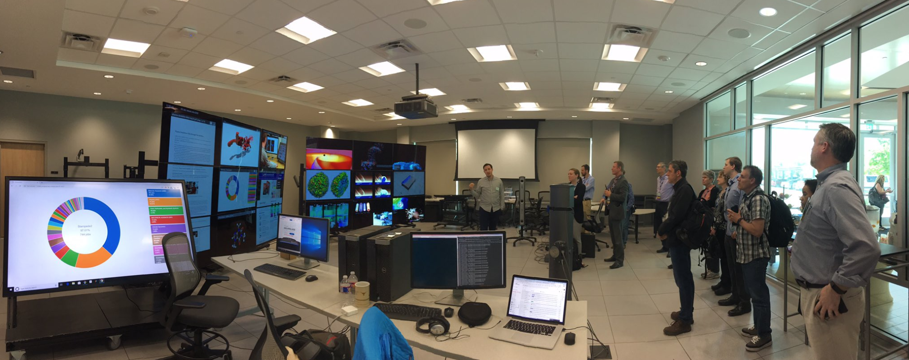
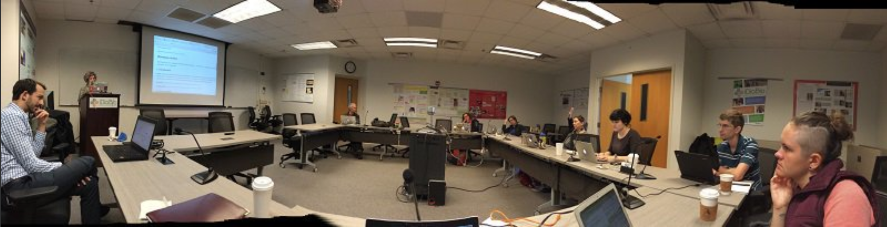

This year I have had the honor of talking with many curators, tool builders, and data scientists within the Biodiversity and Natural History Data Community. During these conversations, Deb Paul has come up again and again in many different contexts. She is an obvious vital component of many different overlapping communities. Deb is has a unique ability to synthesize connections between people, the technology we use, and how we learn.  I recently talked with her about her work in her current position as Technological and Digitization Specialist at iDIGbio. We discussed her background in science, empathy in training, the future of digital data, and our eerily similar career path that both started in ceramics.  

**Ciera (CM)**: So, can you first articulate what your job is exactly? 

**Deb Paul (DP)**: 	My job at [iDigBio](https://www.idigbio.org/) at the moment involves community building to foster digitization of scientific collections and research use of the data. So, one component of that is workforce training or enabling others to provide training and expertise. The community members range from collectors, to collection and data managers in the museum to those downloading the data from iDigBio, or GBIF or anywhere to use it for research, policy, conservation, outreach, or other purposes.

**CM**:	You also do all sorts of training?

**DP**:	Yes. Let’s say you want your digitization project in your museum go faster, well, you could possibly write a faster or better computer program. You could buy more cyberinfrastructure, or increase bandwidth, all these things. But it is people doing the work, and to speed up processes they will need skills and knowledge (and empowerment). Without this literacy it is also difficult to get the data quality desired. People are our greatest resource in getting collections data mobilized and they both need and deserve investment.

**CM**:	Yeah. I think that’s kind of a theme that’s been going on with programming training, empowering people because everyone can’t be personally trained. Empowering people to learn and take the initiative to train others.

**DP**: Exactly. When we started to do those early digitization workshops 8 years ago, there were several of us who realized it was not enough to teach someone how to enter data in the database or select a camera. For best results (quality data, happy people), they need, for example, a basic understanding of a relational database (among other skills). They don’t need to be a programmer, but conversant. Then, when they’re reading a grant proposal, (or writing future grants) they can also better understand some of the contents, (e.g. what’s an API?).

It was at a collaborative meeting (of several #NSFFunded projects) where the idea for [Data Carpentry](https://datacarpentry.org/) came together. We discovered that many of the skills and literacy needs of our stakeholders are the same across these projects.

Through work at iDigBio, I’m actively involved several different organizations including “SPNHC” [pronounced “spinach”] —[Society for the Preservation of Natural History Collections](http://www.spnhc.org/)— and [The Biodiversity Information Standards (TDWG)](https://www.tdwg.org/) organization, where I’m just beginning a new role as Deputy Chair.

**CM**:	Whoa! Congratulations! I think that’s awesome. You’ll be a great leader in that community.

**DP**: Well, thanks! I am learning a lot and look forward to empowering the TDWG community and continuing to strengthen ties with other organizations such as SPNHC and [RDA](https://rd-alliance.org/). 

At iDigBio, our current efforts focus on international collaboration for collections digitization and information use. As part of this initiative, it’s very exiciting to be part of contributing to projects like [DiSSCo – The Distributed System of Scientific Collections](https://dissco.eu/) – a European effort to build a digization culture across 115 institutions in 21 different countries. Worldwide, we are all trying to learn from one another and work together where we can.  So, of course, I spend lots of time using tools like Google Drive, and wikis, and I spend a lot of time on the phone, and of course, in online meetings. And then, there’s the going to, but also putting together symposia, conferences, webinars, working groups, and mentoring however I can.

I just went to this meeting I told you about of entomologists—and there was a lot of “Can you meet with me to talk about how I can get digitization started in my collection?”. We had a symposium and panel discussion on The Digital Future of Entomology. This one researcher gave a talk sharing her early and recent experiences with AI to do species recognition. The statistics are mind-boggling. With the amount of images she could process then vs now, it’s – I don’t know, it’s more than 100-fold increase in the speed at which she can actually get it all to work. It’s amazing. 

<figure>
    
  
<figcaption> From <a href="https://twitter.com/idbdeb/status/1113847349460258817">Deb's tweet</a> from #NSFFunded Large Facilities Workshop
  </figcaption>

</figure>

**CM**:	Oh, cool!

**DP**:	Anyway, so, the digital future is imminent, and on many different levels trying to mentor these people from the beginning of their careers, to “Where can I go to study this?” to “How do I get access to the data to – or how do I get a grant for my collection?” But again, like I said, I’m becoming more involved in: how do we envision something, and then, how do we get to implementation? So, my job is – focusing on the future of collections digitization, and the use of that data, how can I be part of fostering that? 

**CM**:	Can you tell me a bit about your background and how it prepared you for your job now?

**DP**: My path is anything but linear. I was not one of those people who did something when I was 12, and I knew what I wanted to be for the rest of my life. Instead, I knew that I liked science, but I was terrified of math, for sure. To be fair, while I did well in math; it didn’t come easy to me. Reading and language arts were simple and took no – or little work, right? 

So, I started out in education—I have a master’s degree—and I’ve taught from pre-school to high school, and adults in formal and informal settings. Including things like ceramics, so not just traditional academic topics. 

**CM**:	I was focusing on ceramics too!

**DP**:	Oh, you did? Yes, I got all the way to teaching it. I taught introduction, intermediate-level, and wheel-throwing. Where did you do it?

**CM**:	Ceramics was my major until I switched to biology, up until junior year of undergrad.

**DP**:	 So, when teaching ceramics, I was always teaching the math and science of ceramics, which is funny, right? I’m was always teaching the students the molecular stuff, like why glazes are the colors they are and how they know what oxidation – reduction reactions are (and they are astonished to discover these topics are relatable to their everyday lives).

My never-ending desire to know more about the why and how of things: why does this work this way; why does it look this way; how does this work – how is this possible? This is what truly led me to science, so, I went back to study chemistry and biology later. And then, I wasn’t afraid of math anymore, I just didn’t care. I was going to fail or pass, but I wasn’t going die without trying, right? 

So, my hobbies—including genealogy, knitting, languages, ceramics, baking—they’ve all contributed I think to what you’re asking here: my abilities to relate to many people on common ground with them. And I very much enjoy empowering people and helping them get to the, “Yes, I can do this,” or figuring out what they want to do, and figuring out which communit(ies) to connect them to.

**CM**: 	That’s so funny! We have very similar path – like ceramics, and I did the same thing where I’m like, “Well, I’m doing this. If I can’t do it, I don’t care; I have to just go all-in.”

**DP**:	Yeah, yeah!

**CM**:	And I was like, “Oh, I did it!” But so funny we both did ceramics, thats how I fell in love with labs from making glazes in ceramics. I was like, “This is lab?”.  I loved the environment. 

**DP**: Oh, I loved lab work too! And, I’m also a first generation college student. 

**CM**:	Me, too!

**DP**: So, that whole-recognize-it-and-you-can-do-stuff, you didn’t have your parents –

**CM**:	Right!

**DP**:	– sorta saying, “Of course you can!” because they haven’t got a clue either! Yeah, my dad was like, “Just fill out the paperwork, and I’ll sign on the dotted line,” So, I’m very excited to be in this role where I can do the thing that I think I’m pretty good at. More like – almost like a dating service.

**CM**:	Right, connecting the dots –

**DP**:	Connecting.

**CM**:	– and getting the people together.

**DP**:	Connecting, yes, that’s it, community building.

**CM**:	I have been thinking a lot about what Data literacy in Natural History Museum and Biodiversity Communities means.  This was sparked when talking with the [BLUE (Biodiversity Literacy Undergraduate Education)](https://www.biodiversityliteracy.com/).  Do you have any opinions on what a base level of data skills are needed to work with biodiversity data? Should everyone have to learn R or Python?  

**DP**:	Yes, and it will be exciting to see what BLUE develops. While they are focusing on undergrad, they recognize that it starts (at least) in high school. I think – I understood – were you at that meeting in New Zealand? Did you go to their group meeting?

**CM**:	Yes, I did.

**DP**:	I think nice things happened in that group discussion – the conversations jelled somewhat. We were able to talk about basic data and computational literacy skills and higher-level research skills, e.g. the idea that undergraduates should know how to evaluate what graph would be the best for their data.

But I’m thinking much more about things like data standards, and better spreadsheet skills, and citation attribution, and personal information management. We were never taught how to do any of this. The Web came along, it evolved. We don’t know how to manage a “mazillion” emails and documents for a lifetime of the career in a research lab, right? We get tasked with taking up somebody else’s messy data piles. And so, I think that’s really a critical basic skill that everyone needs, regardless of what field they’re going into.

I think all the skills of the [Reproducible Research Curriculum](https://github.com/Reproducible-Science-Curriculum) that [Francois](https://twitter.com/fmic_) did with [Hilmar](https://twitter.com/hlapp), and you –

**CM**:	That’s how we met!

**DP**:	– right. Those are super-important. I think we’re learning a lot about what scientists and data managers tell us they struggle with. We wrote [a paper](https://www.idigbio.org/wiki/index.php/Georeferencing_for_Research_Use) that basically asked “So, now that you’re going to use our data for your spatial research, what kind of challenges do you run into, what do you do with the data before you use it? What do you look for?” And in the paper we have a [supplement](https://riojournal.com/article/download/suppl/3937436/) listing these issues. So perusing that, you can get a good idea of what they go through and what skills and tools they need. 

So, I am hoping people in the biodiversity community will know things like: if they’re data-creators, is the data as good as they can get it so others can use it later? And having that be a standard of practice. That you think beyond your own use of the data. And understanding what you need to do in order to make that data have a longer life, as best you can. And the thought that you should review your practices, whether it’s your software in our lab, software on your desktop, but periodically – you (probably) shouldn’t be doing the same thing you did 20 years ago.

**CM**:	Just to know that data skills modulating skills that people need to keep up-to-date with.

**DP**: Yeah, or at least – so, my example would be: not everybody needs to know how to build an API, or even how to use an API. But they need to know an example of an API that they can understand so that when someone in the room gives a talk and starts talking about APIs, they aren’t just immediately lost and start tuning you out.

So, they become more like you were saying, data-literate, so that the language they use allows them to have easier collaboration skills, and also fruitful evaluation skills. I think that’s really important. And no, they do not need to learn R or Python or versioning, …

Other skills that come to my mind because I work with the collections community, directly relevant to them are their need to understand: relational databases; managing their expectation for how those databases behave. They should also, knowing the relevant data standards so that when they’re developing policies, that they’re sharing those with people who are bringing in new data. That the data comes in already mapped to relevant standards. Knowing this type of information and having this literacy also fosters the communications between IT staff and non-IT staff.

Ciera: 	In your opinion, what are some of the biggest challenges that face the biodiversity data community at this time?

**DP**:	So the biggest challenge I think is human shortage of folks with the needed skills and literacy. And the ones we do have keep getting asked to the table over and these people are over-asked because there just aren’t any more, and they are overwhelmed. This is in Europe as well too; this is not just here.

There is no dependable people pipeline. We have a bunch of people like myself, Katja Seltmann, Francois Michonneau Edward Gilbert, Paul Morris, Heather Prestridge, Gary Motz, you! who all started out in our relative disciplines from paleo, to botany, to marine invertebrates, to entomology, to ceramics, and then evolved skills that we have in our jobs. There are some programs—but there are not a lot of them— University of Indiana, University of Arizona, a couple others I can think of, that have some sort of museum studies-type courses. But otherwise, it’s still just parallel evolution. 

Lack of a long-term cyberinfrastructure that we can count on in perpetuity is a huge problem. It’s hard to teach people how to use stuff if it’s going be gone in eight or 10 years. 

We need to share resources (cyber and human and planetary) better. We need virtual research environments (VREs), we have them, but we need more of them. Shared authority files, I can’t tell you the number of times people are recreating taxonomic name authority files, people name authority files. Georeferencing the same localities over and over again. Taxonomists and systematists need credit and attribution – without them -- we wouldn’t have collections. Take a look at [Bloodhound-tracker.net](https://bloodhound-tracker.net/Q61857482) to get an idea of what is needed for this.

**CM**:	Yes! That is such a cool tool.

We definitely need a more flexible curriculum I think at universities, more like content on GitHub, that allows community contributions. 

When collaborating across projects/nations, another challenging issue is that the focus is often on low-hanging fruit – for practical reasons. By collaborating on goals/tools we are already working on, we don’t get out of scope and overwhelmed. But, as long we do that, the pile of -- hard but important -- things that we need to address just keeps growing.” Some of those would be, for example, authority files (e.g. people names and identifiers, place names, taxon names). Ideally, we would have a list of taxon names in the sky with all the taxonomic literature associated, then in your database you could just pull the specimen identifier for the taxon concept out of that big database in the cloud. and that’s what you put in your record and then you don’t have three or four taxonomic database related tables that your always trying to keep up to date and its hopeless. The community is making progress on this, but we have a long way to go. (See [Catalog of Life+](https://github.com/Sp2000/colplus)).

<figure>
    
  
<figcaption> From <a href="https://twitter.com/idbdeb/status/675066746924048385">Deb's tweet</a> at an Reproducible Research Workshop
  </figcaption>

</figure>

**CM**:	We are talking about some of that in the recent [Ropensci community call](https://ropensci.org/commcalls/2019-03-27/). [Kari Norman](https://twitter.com/norman_kari)from [Carl Boetteigger](https://twitter.com/cboettig)’s lab has been working on a tool, [taxadb](https://github.com/cboettig/taxadb) similar to what you are explaining - to help with the taxonomic challenges. 

**DP**:	Oh yeah? Great! When Carl’s group has made progress, please ask him to share that with us at iDigBio – perhaps a blog post or webinar with a demo?
			
There’s a meeting in Bulgaria right now focusing on attribution, specifically authority files – management of people names. They’re working on that for [DiSSCo](https://dissco.eu/), but it should benefit all of us. You can imagine a resource in the future where everyone has a unique identifier (e.g. ORCID), every programmer, database manager, collection manager, curator, etc. Where you as a person has some sort of identifier ORCID (living persons), or wiki-data ID for those not corporeal anymore, that can then facilitate linking all your contributions to the biodiversity data community. 

We are talking about these issues and more at the upcoming [Biodiversity Next](https://biodiversitynext.org/) meeting in Leiden, in October 2019. It’s a joint meeting of TDWG, with GBIF, DiSSCo, [CETAF](https://cetaf.org/), and a couple of other organizations. This meeting is hopefully one that is setting a trend in support of worldwide alignment around mobilization, sharing, and enhanced use of biodiversity data.

And, strictly focusing on biodiversity data use,  check out the upcoming [Digital Data III meeting](https://www.idigbio.org/wiki/index.php/Yale_Digital_Data_Lodging_information) at Yale in June 2019. 

Ciera: 	I think one of the ways in which you are really appreciated within the Museum community is your empathetic nature to for teaching / learning data science skills.  What are some of the ways in which you cultivate this attitude?

**DP**:	Hm, that’s an interesting question. And thanks for sharing that observation. Maybe it’s in part from empathy, resulting from my own experiences. So, I don’t know if we consider that a method of cultivation, but you could ask people to draw on times or situations in which they found something very difficult. And for me, like I said, that would be mathematics. In fifth grade I can remember asking for help for the nth time, they’d be like “don’t worry you won’t need it, you’ll, you’ll be married, and you’ll have a man for that.”

**CM**:	Geez!

**DP**:	So, I really can relate to people who are struggling, and who might be feeling intimidated, confused, or just overwhelmed with where to start. Even today—I was better at calculus than algebra, I kid you not—and every time I see an algebra problem when it comes across my path, I’m like, “Holy crap, where do I start?” I have to give myself permission to feel a little anxious about it, and then –, just get on with it. 
	
It also came to going back to school a second time, and giving myself that permission you were talking about, about “So what if I can’t get it?” So, there was an attitude of, “I’m gonna get this no matter what”.

**CM**:	o, how do you cultivate the opposite to like the programmers and math people being empathetic to people new to these skills?

Deb: 	Oh! Yes, that’s key! I think for them—I’m married to one, first of all, and when we were first dating, and he would explain to me something, I’d be like, “Nope, don’t get it yet. You’re explaining way up here [my hand pointing way up in the sky], and I’m down here,” and he’d try again (and again). He learned and I learned that we both needed to check to make sure we were understood, and try again if at first there is no joy.

**DP**:	But I think him going through trying to explain things to me, both made him a better programmer and a better communicator, but also gave me an appreciation and understanding for their specialized vocabulary and the way that they think. In other words, the programmers and math people need to practice this skill.

And I always try very carefully when choosing any IT people I’m going to collaborate with. I’m listening when they speak (e.g. answering other folk’s questions) to see if I can understand their answers, to see what kind of attitude they bring to the conversation, to see how they react if their answers aren’t understood. Fomer iDigBio colleague Matt Collins is an example. I would say to Matt, using an SQL example, “Matt, for this field in our database, I would like distinct values and a count,” and he’s like [teasing me], “Deb, no, you don’t.” I’m like, “yes yes, I do.” And he says, “No, you want that for every field in the database.” And I went, “Oh! Yes, that would be amazing!–”
	
So, -- that thinking from a specific instance to thinking globally, or abstractly above the problem, is something that systems analysts do really well. And in this example, Matt and I are collaborating around an idea. If he were condesending or otherwise discouraging, then that also stifles our ability to have this sort of collaboration because I wouldn’t go back for to him for insights (if I had a choice). But, because he was welcoming and insightful, and interpreted and reframed my idea, we both benefitted. I trust him to treat my ideas with thought and care, and he learns more about the community’s needs (as well as insights into what I do or do not understand about relational and document store databases – that make our future conversations more fruitful). This is a process for all involved.

I think with IT people, number one, I’m not afraid to ask a question. But, as I said, I am careful who I ask. So I hope I’m helping to create  culture where folks aren’t afraid to ask, and those being asked offer answers kindly – knowing that they may have to explain again, or a different way. I am trying to both empower people to do that and to help them understand what it is to know, love, and trust. This process needs nurturing on all sides.

**CM**: 	What advice do you have for a person who is really excited about using biodiversity data, but has no programming skills?
	
**DP**:	First, partner with someone who does know how to program, but don't let this stop you if you don't have such a partner. See tools like [GLOBI](https://www.globalbioticinteractions.org/) where you can make discoveries w/o being a programmer. You can expect more tools (like GLOBI, Open Refine, [GUODA](http://guoda.bio/)) that in the future will change how scientific investigation happens. Also,  take a Carpentries workshop! Just try it.Visit the booths at professional meetings like the upcoming Data Help Desk at the Ecological Society of America -- we're there to help you and help you find mentors. And find a GBIF Science Ambassador, for example, and then become one :-)

**CM**:	Awesome advice! I have heard from so many people about how much they appreciate your advice, training and overall what you are bringing to the biodiversity community. Thank you so much for taking the time to talk with me today!
