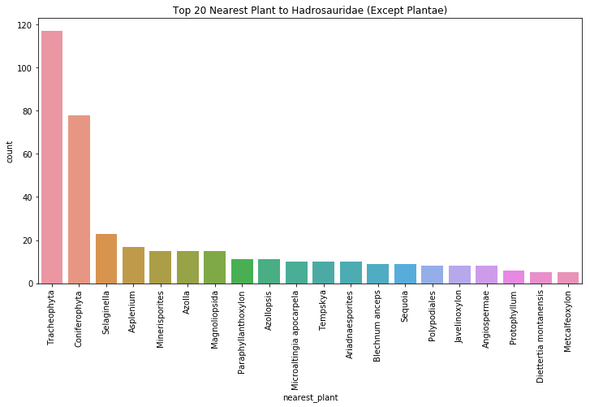
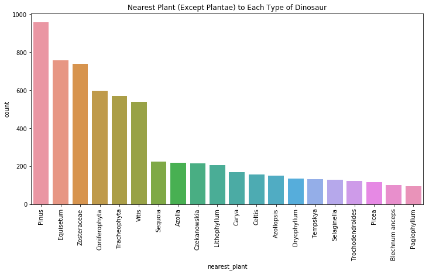
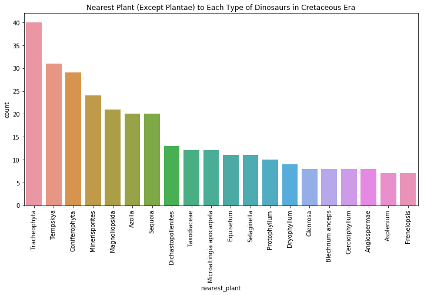
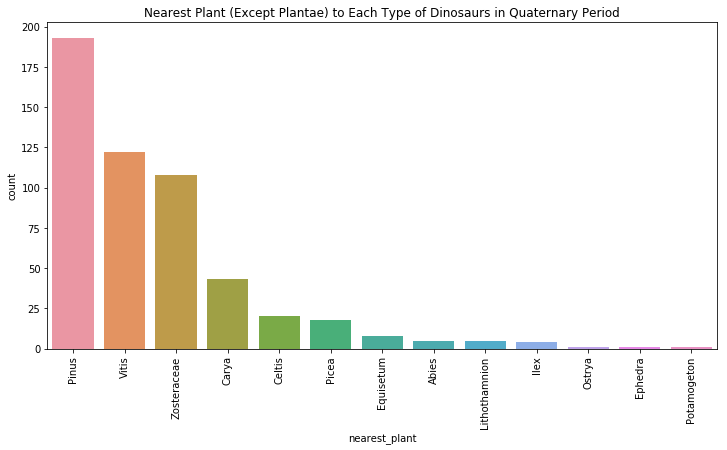

This post is a continuation of my first tutorial I wrote, where I just looked at the Dinosaur data, but I also became interested in the other fossils in our dataset - plants! In this analysis we explore what types of plants were around and their proximity to dinosaurs. We introduce a strategy to find which dinosaur fossils are closest to plant fossil points to understand the plant landscape that dinosaurs species lived in (and possibly even ate!). 


```python
import pandas as pd
from pathlib import Path
import seaborn as sns
import matplotlib.pyplot as plt

pd.options.mode.chained_assignment = None #ignore Setting with copy warnings
```


```python
data_file = Path("data/part1", "dino_data.hdf")
interesting = pd.read_hdf(data_file, "interesting")
dino_plants = pd.read_hdf(data_file, "dino_plants")
dino_df = pd.read_hdf(data_file, "dino_df")
```

Now, let's take the dinosaur and plant data we gathered above and combine them to see what we can find!


```python
interesting.head() #our cleaned dinosaur data
```


<div>
<style scoped>
    .dataframe tbody tr th:only-of-type {
        vertical-align: middle;
    }

    .dataframe tbody tr th {
        vertical-align: top;
    }

    .dataframe thead th {
        text-align: right;
    }
</style>
<table border="1" class="dataframe">
  <thead>
    <tr style="text-align: right;">
      <th></th>
      <th>accepted_name</th>
      <th>state</th>
      <th>lat</th>
      <th>lng</th>
      <th>environment</th>
      <th>created</th>
      <th>country</th>
      <th>early_interval</th>
      <th>late_interval</th>
      <th>interval</th>
    </tr>
  </thead>
  <tbody>
    <tr>
      <th>19</th>
      <td>Theropoda</td>
      <td>Connecticut</td>
      <td>41.566666</td>
      <td>-72.633331</td>
      <td>terrestrial indet.</td>
      <td>2011-07-28 02:09:51</td>
      <td>US</td>
      <td>Hettangian</td>
      <td>Sinemurian</td>
      <td>Jurassic</td>
    </tr>
    <tr>
      <th>20</th>
      <td>Camarasaurus grandis</td>
      <td>Colorado</td>
      <td>39.068802</td>
      <td>-108.699989</td>
      <td>fluvial-lacustrine indet.</td>
      <td>2017-11-02 14:56:21</td>
      <td>US</td>
      <td>Kimmeridgian</td>
      <td>Tithonian</td>
      <td>Jurassic</td>
    </tr>
    <tr>
      <th>21</th>
      <td>Camarasaurus supremus</td>
      <td>Colorado</td>
      <td>39.111668</td>
      <td>-108.717499</td>
      <td>fluvial-lacustrine indet.</td>
      <td>2001-09-19 09:11:44</td>
      <td>US</td>
      <td>Kimmeridgian</td>
      <td>NaN</td>
      <td>Jurassic</td>
    </tr>
    <tr>
      <th>22</th>
      <td>Ankylosaurus magniventris</td>
      <td>Montana</td>
      <td>47.637699</td>
      <td>-106.569901</td>
      <td>terrestrial indet.</td>
      <td>2001-09-19 10:03:19</td>
      <td>US</td>
      <td>Maastrichtian</td>
      <td>NaN</td>
      <td>Cretaceous</td>
    </tr>
    <tr>
      <th>23</th>
      <td>Titanosauriformes</td>
      <td>Oklahoma</td>
      <td>34.180000</td>
      <td>-96.278053</td>
      <td>coastal indet.</td>
      <td>2005-08-25 14:56:00</td>
      <td>US</td>
      <td>Late Aptian</td>
      <td>Early Albian</td>
      <td>Cretaceous</td>
    </tr>
  </tbody>
</table>
</div>


```python
dino_plants.head() #our cleaned plant data
```


<div>
<style scoped>
    .dataframe tbody tr th:only-of-type {
        vertical-align: middle;
    }

    .dataframe tbody tr th {
        vertical-align: top;
    }

    .dataframe thead th {
        text-align: right;
    }
</style>
<table border="1" class="dataframe">
  <thead>
    <tr style="text-align: right;">
      <th></th>
      <th>accepted_name</th>
      <th>state</th>
      <th>lat</th>
      <th>lng</th>
      <th>environment</th>
      <th>created</th>
      <th>country</th>
      <th>early_interval</th>
      <th>late_interval</th>
      <th>interval</th>
    </tr>
  </thead>
  <tbody>
    <tr>
      <th>96</th>
      <td>Neocalamites</td>
      <td>New Mexico</td>
      <td>35.200001</td>
      <td>-105.783333</td>
      <td>fluvial indet.</td>
      <td>2001-06-08 06:53:35</td>
      <td>US</td>
      <td>Late Triassic</td>
      <td>NaN</td>
      <td>Triassic</td>
    </tr>
    <tr>
      <th>97</th>
      <td>Brachyphyllum</td>
      <td>New Mexico</td>
      <td>35.200001</td>
      <td>-105.783333</td>
      <td>fluvial indet.</td>
      <td>2001-06-08 06:53:35</td>
      <td>US</td>
      <td>Late Triassic</td>
      <td>NaN</td>
      <td>Triassic</td>
    </tr>
    <tr>
      <th>98</th>
      <td>Masculostrobus</td>
      <td>New Mexico</td>
      <td>35.200001</td>
      <td>-105.783333</td>
      <td>fluvial indet.</td>
      <td>2001-06-08 06:53:35</td>
      <td>US</td>
      <td>Late Triassic</td>
      <td>NaN</td>
      <td>Triassic</td>
    </tr>
    <tr>
      <th>99</th>
      <td>Samaropsis</td>
      <td>New Mexico</td>
      <td>35.200001</td>
      <td>-105.783333</td>
      <td>fluvial indet.</td>
      <td>2001-06-08 06:46:34</td>
      <td>US</td>
      <td>Late Triassic</td>
      <td>NaN</td>
      <td>Triassic</td>
    </tr>
    <tr>
      <th>100</th>
      <td>Samaropsis</td>
      <td>New Mexico</td>
      <td>35.200001</td>
      <td>-105.783333</td>
      <td>fluvial indet.</td>
      <td>2001-06-08 06:46:34</td>
      <td>US</td>
      <td>Late Triassic</td>
      <td>NaN</td>
      <td>Triassic</td>
    </tr>
  </tbody>
</table>
</div>


```python
dino_df.head() #our original dinosaur data
```


<div>
<style scoped>
    .dataframe tbody tr th:only-of-type {
        vertical-align: middle;
    }

    .dataframe tbody tr th {
        vertical-align: top;
    }

    .dataframe thead th {
        text-align: right;
    }
</style>
<table border="1" class="dataframe">
  <thead>
    <tr style="text-align: right;">
      <th></th>
      <th>authorizer</th>
      <th>authorizer_no</th>
      <th>country</th>
      <th>collection_no</th>
      <th>county</th>
      <th>cx_int_no</th>
      <th>created</th>
      <th>modified</th>
      <th>max_ma</th>
      <th>reid_no</th>
      <th>...</th>
      <th>srb</th>
      <th>sro</th>
      <th>regional_section</th>
      <th>stratscale</th>
      <th>state</th>
      <th>szn</th>
      <th>diference</th>
      <th>tec</th>
      <th>accepted_no</th>
      <th>accepted_name</th>
    </tr>
  </thead>
  <tbody>
    <tr>
      <th>0</th>
      <td>M. Carrano</td>
      <td>prs:14</td>
      <td>CA</td>
      <td>col:11890</td>
      <td>NaN</td>
      <td>39</td>
      <td>2011-05-13 07:45:44</td>
      <td>2011-05-12 16:46:47</td>
      <td>83.5</td>
      <td>rei:24752</td>
      <td>...</td>
      <td>4.135</td>
      <td>bottom to top</td>
      <td>Dinosaur Park</td>
      <td>bed</td>
      <td>Alberta</td>
      <td>NaN</td>
      <td>subjective synonym of</td>
      <td>NaN</td>
      <td>txn:53194</td>
      <td>Gorgosaurus libratus</td>
    </tr>
    <tr>
      <th>1</th>
      <td>M. Carrano</td>
      <td>prs:14</td>
      <td>CA</td>
      <td>col:11892</td>
      <td>NaN</td>
      <td>39</td>
      <td>2001-09-18 13:58:56</td>
      <td>2013-05-10 07:22:24</td>
      <td>83.5</td>
      <td>NaN</td>
      <td>...</td>
      <td>NaN</td>
      <td>NaN</td>
      <td>NaN</td>
      <td>bed</td>
      <td>Alberta</td>
      <td>NaN</td>
      <td>NaN</td>
      <td>NaN</td>
      <td>txn:38755</td>
      <td>Hadrosauridae</td>
    </tr>
    <tr>
      <th>2</th>
      <td>M. Carrano</td>
      <td>prs:14</td>
      <td>CA</td>
      <td>col:11893</td>
      <td>NaN</td>
      <td>39</td>
      <td>2010-07-27 08:36:19</td>
      <td>2010-07-27 10:37:07</td>
      <td>83.5</td>
      <td>rei:23301</td>
      <td>...</td>
      <td>NaN</td>
      <td>NaN</td>
      <td>NaN</td>
      <td>bed</td>
      <td>Alberta</td>
      <td>NaN</td>
      <td>NaN</td>
      <td>NaN</td>
      <td>txn:53194</td>
      <td>Gorgosaurus libratus</td>
    </tr>
    <tr>
      <th>3</th>
      <td>M. Carrano</td>
      <td>prs:14</td>
      <td>CA</td>
      <td>col:11894</td>
      <td>NaN</td>
      <td>39</td>
      <td>2001-09-18 14:04:56</td>
      <td>2006-04-21 12:43:50</td>
      <td>83.5</td>
      <td>NaN</td>
      <td>...</td>
      <td>4.03</td>
      <td>NaN</td>
      <td>Dinosaur Park</td>
      <td>bed</td>
      <td>Alberta</td>
      <td>NaN</td>
      <td>NaN</td>
      <td>NaN</td>
      <td>txn:63911</td>
      <td>Centrosaurus apertus</td>
    </tr>
    <tr>
      <th>4</th>
      <td>M. Carrano</td>
      <td>prs:14</td>
      <td>CA</td>
      <td>col:11895</td>
      <td>NaN</td>
      <td>39</td>
      <td>2010-07-27 08:39:37</td>
      <td>2010-07-27 10:39:58</td>
      <td>83.5</td>
      <td>rei:23302</td>
      <td>...</td>
      <td>NaN</td>
      <td>NaN</td>
      <td>NaN</td>
      <td>bed</td>
      <td>Alberta</td>
      <td>NaN</td>
      <td>NaN</td>
      <td>NaN</td>
      <td>txn:53194</td>
      <td>Gorgosaurus libratus</td>
    </tr>
  </tbody>
</table>
<p>5 rows × 61 columns</p>
</div>


First, we would like to visualize our cleaned and accumulated data. We will use [plotly](https://plot.ly/) to plot the data points onto a map of the United States.


```python
import plotly
import plotly.plotly as py
import pandas as pd  
import plotly.graph_objs as go
from plotly.offline import iplot, init_notebook_mode
from ipywidgets import interactive, HBox, VBox, widgets, interact

plotly.offline.init_notebook_mode()

interesting["text"] = "name: " + interesting["accepted_name"].astype(str)
dinos = {'lat': interesting["lat"],
  'lon': interesting["lng"],
  'marker': {'color': 'rgb(116,0,217)',
   'line': {'color': 'rgb(40,40,40)', 'width': 0.5},
   'size': 2.700000000000003,
   'sizemode': 'diameter'},
  'text': interesting["text"],
  'type': 'scattergeo',
        "name": "Dinosaurs"}

dino_plants["text"] = "name: " + dino_plants["accepted_name"].astype(str)
plants = {'lat': dino_plants["lat"],
  'lon': dino_plants["lng"],
  'marker': {'color': 'rgb(0, 217, 108)',
   'line': {'color': 'rgb(40,40,40)', 'width': 0.5},
   'size': 2.700000000000003,
   'sizemode': 'diameter'},
  'text': dino_plants["text"],
  'type': 'scattergeo',
         "name": "Plants"}

era_range = ["Triassic", "Jurassic", "Cretaceous", "Paleogene", "Neogene", "Quaternary"]

for era in era_range:
    slider_step = {'args': [
            [era]
         ],
         'label': era,
         }

layout = go.Layout(
    title = "Dinosaurs and Plant Fossils of America (Triassic - Quaternary)",
    showlegend = True,
    geo = dict(
            scope='usa',
            projection=dict( type='albers usa'),
            showland = True,
            landcolor = 'rgb(217, 217, 217)',
            subunitwidth=1,
            countrywidth=1,
            subunitcolor="rgb(255, 255, 255)",
            countrycolor="rgb(255, 255, 255)"
        ))
comp_data = [dinos, plants]

fig = go.Figure(layout=layout, data=comp_data)
iplot(fig, validate=False)
```

<script src="https://cdn.plot.ly/plotly-latest.min.js"></script> 

<div><div id="764b5ebe-75de-4eae-941a-b033a6f03d98" style="height: 100%; width: 100%;" class="plotly-graph-div"></div><script type="text/javascript">window.PLOTLYENV=window.PLOTLYENV || {};window.PLOTLYENV.BASE_URL="https://plot.ly";Plotly.newPlot("764b5ebe-75de-4eae-941a-b033a6f03d98", [{"lat": [41.566666, 39.068802, 39.111668, 47.637699, 34.18, 36.06028, 47.695831, 47.695831, 31.81139, 47.799999, 41.893101, 42.035831, 42.035831, 42.035831, 42.035831, 42.035831, 42.035831, 38.27861, 35.679169, 35.736668, 47.8125, 47.8125, 39.267223, 29.700001, 29.700001, 40.900002, 35.299999, 33.561943, 39.0, 39.0, 43.025002, 43.025002, 39.653423, 42.152302, 42.152302, 42.152302, 42.152302, 42.152302, 36.145279, 36.099998, 43.3494, 43.3494, 43.3494, 43.3494, 42.017776, 42.017776, 42.017776, 42.017776, 42.017776, 43.380001, 43.380001, 43.380001, 48.630001, 48.630001, 48.633301, 48.633301, 48.633301, 41.200001, 41.200001, 41.200001, 42.200001, 43.630001, 43.630001, 43.630001, 43.630001, 43.630001, 43.630001, 48.633301, 48.633301, 48.633301, 48.633301, 48.633301, 48.479202, 48.479202, 48.910831, 48.910831, 48.966599, 29.138056, 29.138056, 29.138056, 40.423611, 40.423611, 40.423611, 40.423611, 40.423611, 27.336, 27.336, 27.336, 27.336, 27.336, 27.336, 27.336, 31.9722, 31.9722, 35.197208, 35.197208, 35.197208, 40.441387, 40.441387, 40.441387, 40.441387, 42.299999, 48.633301, 48.910831, 48.966599, 48.966599, 48.966599, 32.1721, 29.138056, 27.336, 43.116329, 34.400002, 46.465099, 46.465099, 46.465099, 46.465099, 46.465099, 46.200001, 46.200001, 46.200001, 46.200001, 46.200001, 46.200001, 47.633331, 47.633331, 47.633331, 47.633331, 47.633331, 47.633331, 45.135834, 40.299999, 40.299999, 40.299999, 40.299999, 40.299999, 37.466667, 46.466389, 31.983334, 32.0, 32.0, 32.0, 33.014442, 29.1, 31.666668, 31.666668, 31.666668, 35.700001, 35.700001, 29.200001, 29.200001, 45.438999, 45.441387, 34.166668, 34.18, 34.18, 36.780556, 48.650002, 48.650002, 48.650002, 48.650002, 48.650002, 48.650002, 42.488899, 33.228889, 44.240276, 46.900002, 43.049999, 43.049999, 43.049999, 43.049999, 43.049999, 43.049999, 43.049999, 46.2575, 45.823334, 45.823334, 45.823334, 47.768101, 48.950001, 47.8125, 39.783333, 39.783333, 39.783333, 39.783333, 39.783333, 39.783333, 39.783333, 33.53278, 38.826099, 38.826099, 38.826099, 38.826099, 38.826099, 38.718056, 38.718056, 38.718056, 38.718056, 38.718056, 38.718056, 44.301109, 38.782101, 41.98, 38.936169, 39.139671, 39.139671, 39.212223, 39.212223, 39.155956, 39.155956, 37.056667, 39.0, 44.299999, 44.299999, 42.400002, 42.400002, 42.400002, 42.400002, 42.400002, 42.400002, 42.400002, 42.400002, 40.454445, 43.299999, 43.299999, 43.299999, 43.299999, 43.299999, 29.316668, 29.316668, 29.316668, 29.316668, 29.316668, 29.316668, 29.316668, 29.316668, 39.0821, 39.0821, 37.133331, 37.133331, 37.200001, 37.200001, 37.099998, 38.914715, 38.914715, 38.887878, 38.957024, 32.270557, 32.270557, 32.270557, 33.283333, 33.283333, 33.283333, 33.283333, 33.500179, 33.500179, 33.500179, 27.533333, 27.783333, 27.783333, 27.783333, 27.783333, 27.783333, 27.783333, 34.771111, 37.366669, 37.366669, 35.759724, 35.966667, 35.966667, 40.386391, 40.386391, 40.386391, 40.386391, 42.832222, 35.903889, 35.903889, 33.00111, 33.00111, 33.00111, 34.383331, 34.383331, 38.122501, 38.539501, 38.893333, 39.675598, 39.06189, 39.06189, 39.06189, 39.06189, 39.06189, 42.893055, 29.700001, 29.549999, 29.65, 29.683332, 40.450001, 39.0821, 31.839199, 31.839199, 31.692223, 31.692223, 27.638332, 27.638332, 27.638332, 27.638332, 27.638332, 27.638332, 27.638332, 27.638332, 27.638332, 27.638332, 27.638332, 27.638332, 42.255554, 38.788891, 39.198002, 45.438999, 44.949902, 33.598999, 30.267, 33.469002, 36.285702, 36.285702, 36.271099, 36.3148, 39.704445, 35.694168, 35.694168, 35.679169, 32.164165, 38.806, 38.806, 32.866669, 32.733334, 44.983334, 44.983334, 44.983334, 47.721554, 36.269444, 36.269444, 36.269444, 35.286945, 43.430557, 43.430557, 36.269444, 36.269444, 36.269444, 36.269444, 41.916111, 41.916111, 41.916111, 36.101391, 36.101391, 36.101391, 36.101391, 36.101391, 36.101391, 36.486111, 36.486111, 36.486111, 36.486111, 36.486111, 36.486111, 36.486111, 39.128502, 47.8125, 47.8125, 47.8125, 45.5, 31.0, 48.633301, 48.633301, 48.633301, 48.633301, 48.633301, 48.633301, 48.633301, 48.633301, 48.633301, 48.633301, 34.200001, 34.200001, 34.200001, 34.200001, 34.200001, 47.536201, 47.536201, 45.25, 36.214001, 35.320278, 35.563332, 35.599899, 36.464458, 38.450001, 38.450001, 41.980556, 35.931667, 35.931667, 35.931667, 35.931667, 35.931667, 36.730278, 36.730278, 35.863056, 35.863056, 40.299999, 34.43742, 36.1548, 36.1861, 41.9077, 41.9077, 41.9077, 41.9077, 41.9077, 41.9077, 41.9077, 41.9077, 41.9077, 41.9077, 41.9077, 41.9077, 41.9077, 41.9077, 41.9077, 41.9077, 41.9077, 41.9077, 41.9077, 41.9077, 38.539501, 38.539501, 38.539501, 38.539501, 38.539501, 38.539501, 38.539501, 38.539501, 38.539501, 38.539501, 38.539501, 38.539501, 41.893101, 41.893101, 41.893101, 41.893101, 41.893101, 41.9077, 41.9077, 41.9077, 41.9077, 41.878601, 41.878601, 41.878601, 41.893101, 41.893101, 41.878601, 41.893101, 41.893101, 41.893101, 41.9077, 41.9077, 41.9077, 41.9077, 41.9077, 41.878601, 41.878601, 41.878601, 41.893101, 41.893101, 41.893101, 41.893101, 41.893101, 41.893055, 41.893055, 41.893055, 41.893055, 41.893055, 41.893055, 41.893055, 41.893055, 41.893055, 41.893101, 41.893101, 41.893101, 41.8825, 41.8825, 41.8825, 41.8825, 41.8825, 41.8825, 41.893101, 41.9077, 41.9077, 41.9077, 39.675598, 39.653423, 39.653423, 39.653423, 39.675598, 39.675598, 39.675598, 38.539501, 38.539501, 44.0, 39.2383, 39.2383, 39.2383, 39.2383, 39.2383, 39.2383, 39.2383, 39.2383, 41.893055, 41.893055, 41.893055, 41.893055, 41.893055, 36.670277, 45.948799, 45.948799, 45.948799, 45.948799, 45.948799, 45.948799, 45.948799, 45.948799, 45.948799, 45.948799, 45.948799, 45.948799, 45.948799, 45.948799, 45.948799, 45.948799, 45.948799, 45.948799, 45.948799, 45.948799, 46.099998, 46.099998, 46.099998, 46.099998, 46.099998, 46.099998, 46.099998, 46.099998, 46.099998, 46.099998, 46.099998, 45.977699, 45.977699, 45.977699, 45.977699, 45.977699, 45.977699, 45.977699, 45.977699, 46.006599, 46.026402, 46.026402, 46.026402, 46.026402, 46.026402, 46.026402, 46.026402, 46.026402, 46.026402, 46.026402, 46.026402, 46.026402, 46.026402, 46.026402, 46.026402, 46.026402, 46.026402, 46.026402, 46.026402, 46.026402, 46.026402, 46.026402, 46.026402, 46.026402, 46.026402, 46.026402, 46.026402, 46.026402, 46.026402, 46.026402, 46.026402, 46.026402, 46.026402, 46.026402, 46.026402, 46.026402, 46.026402, 46.026402, 46.026402, 46.026402, 46.026402, 46.026402, 46.026402, 46.026402, 46.149399, 46.180302, 46.180302, 46.180302, 46.180302, 46.180302, 46.305, 46.136902, 46.136902, 46.136902, 46.136902, 46.406399, 46.406399, 46.406399, 46.406399, 46.406399, 46.406399, 46.406399, 46.420898, 46.381901, 46.381901, 46.381901, 46.026402, 46.209202, 46.209202, 46.209202, 46.209202, 46.209202, 46.209202, 46.381901, 46.381901, 46.381901, 46.381901, 46.381901, 46.381901, 46.449799, 46.449799, 46.449799, 46.449799, 46.449799, 46.449799, 46.464298, 46.464298, 46.464298, 46.464298, 46.334, 46.334, 46.334, 46.334, 46.334, 46.334, 46.334, 46.334, 46.334, 46.334, 46.334, 46.334, 46.334, 46.334, 46.334, 46.334, 46.334, 46.334, 44.369122, 46.464298, 46.464298, 46.464298, 46.464298, 46.464298, 46.464298, 46.464298, 46.464298, 46.464298, 46.464298, 46.464298, 46.464298, 46.464298, 46.464298, 46.464298, 46.464298, 46.464298, 46.464298, 46.3629, 46.3629, 46.3629, 46.3629, 46.3629, 46.3629, 46.3629, 46.3629, 46.3629, 46.3629, 46.3629, 46.3629, 46.3629, 46.3629, 46.3629, 46.3629, 46.3629, 45.93903, 45.93903, 45.93903, 45.93903, 45.93903, 45.93903, 45.93903, 45.93903, 45.93903, 45.93903, 45.93903, 45.93903, 45.93903, 45.93903, 45.93903, 44.604671, 44.589001, 27.533333, 38.539501, 37.31778, 48.9646, 48.935501, 48.9646, 39.1991, 39.2281, 39.2136, 39.170101, 39.183102, 39.2136, 39.2281, 43.116329, 47.799999, 47.799999, 47.799999, 47.799999, 47.799999, 47.799999, 47.799999, 41.568298, 41.568298, 41.568298, 41.568298, 41.568298, 41.568298, 41.568298, 41.568298, 41.568298, 41.568298, 41.642502, 40.386391, 43.128948, 43.128948, 43.0, 47.5667, 47.516701, 47.516701, 47.516701, 47.516701, 43.16526, 43.116329, 43.116329, 43.116329, 43.116329, 41.867298, 41.642502, 41.716702, 41.687, 41.7108, 41.778, 41.598, 41.687, 41.627701, 39.937401, 39.937401, 38.945099, 40.324722, 40.266388, 40.315556, 39.303799, 43.441799, 43.441799, 45.550201, 38.583099, 38.583099, 38.583099, 38.583099, 38.583099, 38.583099, 38.583099, 41.553501, 42.195904, 42.584442, 47.740276, 47.740276, 47.772221, 47.898609, 47.735832, 42.584442, 42.584442, 42.584442, 43.121864, 43.120808, 43.166111, 43.144444, 43.237862, 43.15778, 43.191978, 43.227592, 43.230537, 43.237728, 43.181259, 43.178665, 39.730797, 47.740276, 40.446388, 34.2575, 43.269501, 40.908401, 38.861, 35.689445, 47.633331, 47.633331, 47.633331, 44.535557, 44.535557, 44.535557, 44.535557, 44.650002, 44.650002, 44.650002, 44.650002, 44.650002, 44.650002, 44.650002, 44.650002, 44.535557, 44.535557, 44.535557, 44.535557, 44.535557, 43.025555, 42.789444, 47.599998, 34.400002, 34.400002, 34.400002, 35.573334, 36.894199, 36.894199, 39.541668, 39.541668, 40.111942, 40.557499, 40.568611, 40.568611, 40.568611, 47.808201, 47.808201, 47.808201, 47.808201, 47.808201, 47.808201, 47.808201, 47.808201, 44.645458, 44.626873, 44.62299, 44.583027, 44.515488, 44.650509, 44.630196, 44.418289, 44.524662, 44.632446, 44.677429, 44.596813, 44.673935, 44.652012, 44.671162, 44.680443, 44.6591, 44.662388, 44.662567, 36.256599, 36.256599, 36.271099, 36.271099, 36.3148, 36.3148, 36.183899, 36.343899, 36.3148, 36.343899, 36.343899, 36.1548, 36.1548, 36.1693, 36.285702, 36.343899, 36.271099, 36.271099, 36.300201, 36.3148, 36.6828, 36.3148, 36.3148, 36.3148, 35.965698, 45.530899, 45.530899, 45.530899, 41.967098, 41.967098, 41.967098, 40.441387, 48.472202, 48.633301, 48.966599, 48.966599, 48.966599, 48.966599, 48.966599, 36.343613, 36.566666, 36.103901, 36.343887, 38.731667, 38.731667, 38.731667, 38.731667, 41.809765, 41.809765, 41.809765, 41.809765, 41.397221, 42.103611, 41.900002, 36.5, 43.441601, 43.508888, 43.508888, 46.337502, 39.169537, 31.795279, 38.539501, 47.876701, 45.755199, 45.668301, 40.441387, 40.441387, 41.893055, 29.200001, 29.200001, 29.200001, 29.200001, 29.200001, 29.200001, 36.271099, 36.332088, 36.343887, 36.343887, 36.343887, 47.8214, 47.8214, 47.8214, 47.8214, 48.916698, 38.853611, 38.583099, 38.539501, 38.539501, 38.547501, 38.547501, 38.547501, 38.547501, 38.547501, 38.547501, 38.547501, 38.547501, 38.547501, 38.547501, 38.547501, 38.547501, 38.547501, 38.547501, 38.547501, 38.547501, 38.547501, 38.547501, 38.5527, 38.533501, 38.533501, 38.533501, 38.533501, 38.5168, 38.541, 38.541, 38.541, 38.541, 38.541, 38.541, 38.541, 38.541, 38.541, 38.541, 38.544998, 38.544998, 38.544998, 38.544998, 38.544998, 38.546501, 38.546501, 38.546501, 38.547501, 38.5168, 38.5168, 38.5168, 38.5168, 38.5168, 38.845818, 44.094166, 47.549999, 47.549999, 47.549999, 47.549999, 47.549999, 47.549999, 47.549999, 47.549999, 47.549999, 47.616699, 47.616699, 47.616699, 47.616699, 47.616699, 47.616699, 47.616699, 47.616699, 43.183334, 43.183334, 43.183334, 43.183334, 43.183334, 43.183334, 43.183334, 43.183334, 43.183334, 43.183334, 48.9333, 48.9333, 48.9333, 48.9333, 48.9333, 48.9333, 48.9333, 48.9333, 48.9333, 48.9333, 48.9333, 34.43742, 36.331699, 35.841667, 33.449165, 33.449165, 35.087502, 34.943333, 34.943333, 39.727779, 37.579166, 45.928101, 42.552223, 42.0532, 44.291801, 47.403057, 43.649166, 39.732777, 37.579166, 37.579166, 47.775654, 47.565201, 43.272221, 47.93972, 32.15472, 39.909443, 47.8195, 48.063099, 42.155437, 36.183899, 36.3713, 39.2136, 46.348499, 47.666698, 47.533298, 45.849998, 47.96389, 47.96389, 47.96389, 29.134722, 39.675598, 47.765869, 48.286839, 47.839645, 39.546001, 38.647221, 39.570831, 39.006111, 38.748001, 38.604168, 38.986111, 39.546001, 38.68, 42.017776, 42.017776, 43.150002, 43.150002, 43.150002, 43.150002, 43.150002, 43.150002, 43.150002, 47.516701, 47.516701, 47.516701, 47.516701, 47.5667, 47.5667, 47.5667, 47.5667, 47.549999, 47.549999, 47.549999, 47.549999, 47.549999, 47.549999, 47.549999, 47.549999, 47.549999, 47.549999, 47.549999, 47.549999, 47.549999, 47.5667, 47.5667, 47.5667, 47.5667, 47.5667, 47.5667, 47.5667, 47.5667, 47.5667, 47.5667, 47.5667, 47.5667, 47.5667, 47.5667, 47.516701, 47.516701, 47.516701, 47.516701, 47.516701, 47.516701, 47.516701, 47.516701, 47.516701, 47.516701, 47.516701, 47.516701, 47.516701, 47.516701, 47.516701, 47.516701, 47.516701, 47.516701, 48.9333, 48.9333, 48.9333, 48.9333, 47.650002, 47.650002, 47.650002, 47.599998, 47.599998, 47.533298, 47.583302, 47.583302, 47.583302, 47.583302, 47.583302, 47.549999, 47.549999, 47.549999, 47.549999, 47.549999, 47.599998, 43.128948, 43.128948, 43.128948, 43.128948, 43.128948, 43.128948, 43.128948, 47.516701, 47.516701, 47.516701, 47.516701, 47.516701, 47.516701, 43.25, 47.533298, 47.533298, 47.533298, 47.533298, 47.533298, 43.233299, 43.233299, 47.0667, 47.0667, 47.0667, 47.0667, 47.0667, 47.0667, 47.0667, 47.0667, 47.0667, 47.0667, 47.0667, 47.0667, 47.0667, 47.0667, 47.0667, 47.0667, 43.116329, 43.116329, 43.116329, 43.116329, 43.116329, 43.116329, 43.116329, 43.116329, 43.116329, 43.116329, 47.599998, 47.599998, 47.599998, 47.599998, 47.599998, 47.599998, 47.599998, 47.599998, 47.599998, 47.599998, 47.599998, 47.599998, 47.599998, 47.599998, 47.599998, 47.599998, 43.200001, 47.516701, 47.516701, 47.516701, 47.516701, 47.516701, 47.516701, 47.516701, 47.516701, 47.516701, 47.516701, 47.533298, 47.533298, 47.533298, 47.533298, 47.533298, 47.533298, 43.233299, 43.233299, 47.599998, 47.599998, 47.599998, 47.516701, 47.516701, 47.516701, 47.516701, 47.516701, 47.733299, 43.150002, 47.799999, 47.799999, 47.799999, 47.799999, 47.650002, 47.650002, 47.650002, 47.799999, 47.799999, 47.799999, 47.633301, 47.866699, 47.866699, 47.866699, 47.866699, 47.866699, 47.866699, 47.866699, 47.866699, 47.866699, 47.633301, 47.633301, 47.799999, 47.799999, 47.799999, 47.799999, 47.799999, 47.799999, 47.633301, 47.633301, 47.633301, 47.633301, 47.633301, 47.633301, 47.633301, 47.633301, 47.633301, 47.633301, 47.616699, 47.616699, 47.616699, 47.616699, 47.616699, 47.616699, 47.616699, 47.616699, 47.616699, 47.616699, 47.616699, 29.200001, 43.341301, 36.897499, 44.474701, 35.365276, 35.365276, 35.033298, 38.583099, 38.583099, 38.583099, 38.583099, 38.583099, 38.583099, 38.583099, 38.583099, 38.583099, 38.583099, 38.583099, 38.583099, 38.583099, 38.583099, 39.751331, 40.285278, 40.285278, 40.285278, 39.751331, 39.751331, 39.751331, 39.920555, 39.985279, 39.810833, 39.810833, 39.810833, 39.793888, 39.793888, 39.793888, 39.793888, 40.66996, 40.908401, 39.857224, 39.857224, 38.858891, 39.791389, 39.791389, 39.8675, 39.8675, 39.844723, 39.844723, 39.745705, 39.745705, 39.745705, 39.613335, 39.836666, 39.836666, 39.836666, 39.836666, 39.836666, 39.836666, 39.836666, 39.894169, 39.305279, 39.705276, 39.648888, 39.955555, 39.955555, 39.8675, 39.8675, 39.8675, 39.8675, 39.739166, 39.601112, 39.601112, 39.934299, 39.934299, 39.909302, 39.940899, 39.700298, 39.615002, 39.858398, 39.894798, 40.586899, 40.586899, 40.586899, 40.586899, 40.586899, 40.586899, 40.586899, 40.586899, 40.586899, 40.586899, 40.586899, 40.586899, 40.586899, 40.586899, 40.5345, 36.897499, 36.897499, 36.897499, 36.897499, 36.897499, 36.897499, 36.903057, 36.903057, 36.903057, 36.903057, 36.903057, 36.903057, 36.903057, 36.903057, 36.903057, 36.903057, 36.903057, 36.903057, 36.903057, 39.128502, 41.967098, 41.967098, 41.967098, 41.967098, 41.967098, 41.967098, 41.967098, 41.967098, 41.967098, 41.980556, 42.017776, 42.017776, 39.172699, 39.051498, 39.051498, 39.051498, 39.051498, 39.051498, 39.051498, 39.051498, 39.051498, 39.051498, 38.81395, 38.759998, 32.826099, 32.826099, 39.136398, 37.700001, 37.5, 37.5, 37.5, 37.700001, 37.700001, 37.591667, 37.591667, 37.591667, 37.591667, 37.592609, 37.592609, 37.592609, 38.524166, 38.853611, 38.583099, 38.583099, 38.583099, 38.638058, 45.544167, 45.544167, 44.474445, 39.014301, 39.014301, 39.014301, 41.893055, 41.893055, 41.893055, 41.893055, 41.893055, 41.893055, 41.893055, 41.893055, 41.893055, 41.893055, 41.893055, 44.535557, 41.9077, 44.528, 44.528, 44.528, 44.184399, 44.184399, 43.409801, 44.458099, 44.458099, 44.458099, 44.458099, 44.458099, 44.458099, 44.247398, 44.458099, 44.458099, 44.458099, 39.146667, 39.32399, 39.32399, 39.32399, 38.909088, 33.200001, 33.200001, 33.200001, 33.200001, 33.200001, 33.200001, 33.200001, 33.200001, 33.200001, 45.750278, 45.750278, 48.9646, 45.197701, 43.272221, 42.648609, 43.27409, 47.637699, 36.254166, 43.964169, 43.84, 45.441387, 45.485699, 45.485699, 44.4944, 44.5089, 44.5089, 44.542801, 44.964001, 44.978199, 44.978199, 44.978199, 45.438999, 45.438999, 45.4244, 45.4244, 45.409698, 45.4244, 45.4244, 45.3951, 45.380501, 45.380501, 45.380501, 46.337502, 46.337502, 45.124199, 45.124199, 45.153, 45.197399, 45.197399, 45.3559, 43.219398, 43.190498, 45.3559, 45.3559, 45.3559, 45.341202, 45.341202, 45.341202, 45.240501, 44.6875, 44.978199, 44.978199, 44.978199, 44.978199, 44.978199, 44.978199, 44.978199, 44.978199, 44.978199, 44.978199, 44.978199, 44.978199, 44.978199, 44.978199, 44.978199, 44.978199, 44.978199, 44.978199, 44.978199, 44.978199, 44.978199, 45.453602, 45.453602, 45.438999, 45.438999, 45.380501, 45.380501, 45.380501, 45.380501, 45.380501, 45.409698, 45.409698, 45.409698, 45.409698, 44.978199, 44.978199, 45.351299, 45.351299, 45.351299, 45.351299, 45.351299, 45.283699, 45.283699, 45.283699, 46.2714, 45.438999, 45.438999, 45.438999, 45.438999, 45.438999, 45.438999, 45.365898, 45.453602, 46.337502, 45.438999, 45.438999, 45.453602, 45.453602, 45.453602, 45.438999, 45.438999, 45.438999, 45.438999, 45.438999, 45.438999, 45.2262, 45.2262, 45.2262, 45.2262, 45.2262, 45.2262, 45.2262, 45.2262, 45.2262, 45.468201, 45.468201, 45.453602, 45.468201, 46.323002, 46.323002, 46.323002, 46.323002, 46.323002, 45.468201, 45.468201, 48.966702, 48.966702, 48.966702, 48.9333, 48.9333, 48.950001, 48.983299, 46.465099, 46.465099, 46.200001, 46.200001, 46.200001, 46.200001, 46.200001, 46.200001, 46.200001, 46.200001, 46.200001, 46.200001, 46.200001, 46.200001, 46.200001, 46.099998, 46.099998, 46.099998, 46.099998, 46.200001, 46.200001, 46.200001, 46.400002, 46.400002, 46.400002, 46.400002, 46.400002, 46.400002, 46.400002, 46.099998, 43.28355, 43.139351, 41.340557, 41.340557, 41.340557, 41.340557, 41.340557, 41.340557, 41.340557, 41.340557, 41.340557, 41.340557, 41.340557, 41.340557, 41.340557, 41.340557, 41.340557, 41.340557, 41.340557, 41.340557, 31.851667, 45.639721, 35.952778, 46.099998, 46.099998, 46.099998, 46.099998, 46.099998, 46.099998, 46.099998, 46.099998, 46.099998, 46.435555, 46.230499, 32.747501, 35.75, 35.716702, 35.716702, 35.666698, 36.099998, 35.733299, 35.733299, 33.5, 31.886999, 36.256599, 38.8293, 38.8293, 38.8293, 36.867802, 35.320316, 35.320316, 35.398357, 35.398357, 35.320316, 35.320316, 35.320316, 35.320316, 35.320316, 35.317261, 35.317261, 35.580383, 35.066666, 40.58654, 36.212101, 36.212101, 35.066666, 35.066666, 35.197899, 35.197899, 35.197899, 32.791519, 31.182638, 32.748184, 34.033344, 32.220695, 31.40905, 33.582794, 33.533165, 33.533165, 30.09798, 35.0658, 36.271099, 36.271099, 36.271099, 32.418877, 32.421085, 32.419689, 30.432777, 36.213001, 37.6777, 45.438999, 35.6884, 35.6884, 43.667999, 35.931389, 29.396389, 42.155556, 42.090302, 29.396389, 29.396389, 29.396389, 43.151543, 41.907799, 40.4436, 32.725277, 31.062778, 29.440556, 30.633888, 30.633888, 30.67111, 30.452778, 30.507778, 30.5, 29.103333, 29.59639, 29.59639, 29.625, 29.625, 29.625, 29.490278, 37.018902, 37.018902, 37.018902, 36.574799, 36.574799, 36.828201, 34.976601, 35.429199, 35.429199, 35.429199, 34.065834, 36.996387, 37.011108, 37.011108, 37.011108, 37.011108, 37.011108, 37.011108, 33.597778, 33.597778, 33.597778, 33.597778, 33.597778, 33.200001, 33.209721, 33.200001, 35.166698, 40.4436, 40.4436, 40.4436, 29.720833, 30.071112, 30.0, 30.0, 30.298611, 30.298611, 29.837761, 38.539501, 30.101944, 30.301666, 30.204721, 30.3475, 30.496944, 30.645279, 30.645279, 30.645279, 30.696667, 30.91, 31.194166, 38.826199, 32.933334, 39.0, 39.0, 39.0, 35.066666, 35.066666, 35.066666, 35.066666, 35.066666, 34.309898, 48.970821, 45.341301, 45.341301, 37.864201, 31.450277, 31.585278, 31.633612, 31.633612, 31.692778, 31.692778, 31.692778, 31.9375, 31.9375, 31.955833, 31.881111, 32.344723, 32.225834, 29.174419, 29.251589, 29.225201, 31.456388, 40.158424, 40.158424, 35.365276, 35.087524, 35.159779, 36.205296, 36.316666, 34.43742, 35.087524, 34.866699, 36.205296, 36.205296, 39.739281, 32.253334, 32.25111, 32.255001, 32.255001, 32.255001, 32.255001, 32.255001, 32.255001, 32.237305, 32.255001, 32.255001, 32.255001, 32.238602, 32.237, 32.237, 32.246387, 32.246387, 32.373611, 32.9725, 33.125832, 32.227299, 36.574799, 39.06189, 38.916943, 39.069805, 36.574799, 36.574799, 39.078999, 39.053753, 43.298447, 43.255741, 43.200047, 43.219185, 43.219185, 43.213612, 43.213612, 43.15778, 43.132011, 43.164665, 43.157288, 43.209248, 43.193295, 43.188305, 43.15831, 43.311951, 43.183613, 42.152802, 42.152802, 42.152802, 36.897499, 39.32399, 35.197899, 33.200001, 39.693802, 32.328609, 39.693802, 39.693802, 39.693802, 39.693802, 39.693802, 43.128304, 43.139767, 40.092209, 42.152802, 43.128304, 47.787487, 36.341667, 36.408333, 37.799999, 36.897499, 32.755554, 32.755554, 47.666698, 47.666698, 39.3675, 37.5322, 37.5322, 37.5322, 37.5322, 37.5322, 37.5322, 37.5322, 37.5322, 36.966667, 37.77639, 37.123611, 39.288891, 39.288891, 39.288891, 39.288891, 39.288891, 36.897499, 42.587585, 39.288891, 39.288891, 39.184601, 39.184601, 40.919369, 42.606197, 42.606197, 42.606197, 42.606197, 42.606197, 42.606197, 42.606197, 42.606197, 42.606197, 42.606197, 42.606197, 42.606773, 42.606773, 42.606773, 42.606773, 42.606773, 42.606773, 42.606773, 42.606773, 42.606773, 42.606773, 42.606773, 42.606773, 42.606773, 42.606773, 42.606773, 42.606773, 42.606773, 42.606773, 42.606773, 42.606773, 42.609165, 42.609165, 42.609165, 42.609165, 42.609165, 42.609165, 42.609165, 42.609165, 42.609165, 42.609165, 42.609165, 42.609165, 42.609165, 42.591038, 42.517487, 42.517487, 42.517487, 42.28056, 42.28056, 42.28056, 42.28056, 42.28056, 42.28056, 42.28056, 42.28056, 42.28056, 42.273609, 42.273609, 42.273609, 42.611198, 42.611198, 42.611198, 42.611198, 42.611198, 42.611198, 42.611198, 42.611198, 42.611198, 42.611198, 42.611198, 42.611198, 42.611198, 42.611198, 42.611198, 42.611198, 42.611198, 42.611198, 42.611198, 42.611198, 42.611198, 42.611198, 42.611198, 42.612213, 42.612213, 42.612213, 42.612213, 42.612213, 42.612213, 42.612213, 42.612213, 42.612213, 42.612213, 42.612213, 42.612213, 42.612213, 42.282085, 42.282085, 42.282085, 41.725101, 41.725101, 41.725101, 41.725101, 41.725101, 38.806, 38.806, 41.693111, 41.693111, 41.693111, 41.693111, 41.693111, 41.693111, 41.693111, 41.693111, 41.693111, 41.693111, 41.693111, 41.693111, 41.693111, 41.693111, 41.693111, 41.693111, 41.693111, 41.693111, 41.693111, 41.693111, 41.693111, 41.693111, 42.263927, 42.263927, 42.263927, 42.263927, 42.263927, 42.256668, 42.256668, 42.256668, 42.261906, 42.166759, 42.158909, 42.158909, 42.158909, 42.158909, 42.158909, 42.158909, 42.158909, 42.230606, 42.294674, 42.256668, 41.548431, 41.548431, 40.47361, 39.149235, 38.316418, 38.316418, 39.148319, 38.316418, 38.316418, 48.91082, 48.91082, 48.91082, 48.91082, 48.91082, 48.91082, 48.630001, 48.483032, 42.152802, 39.766502, 47.812222, 47.812222, 47.812222, 47.812222, 29.549999, 29.549999, 29.549999, 29.549999, 29.549999, 29.549999, 29.549999, 29.549999, 29.549999, 29.549999, 29.549999, 29.549999, 29.549999, 29.549999, 29.549999, 29.549999, 29.549999, 39.747501, 45.461102, 46.454269, 32.4254, 36.51083, 47.521, 34.400002, 34.400002, 34.400002, 34.400002, 34.400002, 34.400002, 47.8125, 47.8125, 47.8214, 46.900002, 46.900002, 46.900002, 46.900002, 46.900002, 46.900002, 46.900002, 46.900002, 46.900002, 42.387402, 42.9748, 42.9748, 42.9748, 42.9748, 42.9748, 42.9748, 42.9748, 42.9748, 43.1432, 42.096668, 37.901085, 44.299999, 36.485283, 36.269444, 45.7845, 36.2925, 44.060001, 36.655262, 36.277779, 36.5, 36.3148, 36.3148, 36.3148, 40.441387, 40.441387, 40.441387, 36.183899, 36.35973, 36.285702, 48.463612, 48.463612, 48.463612, 45.500801, 36.313, 36.313, 36.313, 36.313, 36.313, 36.313, 36.313, 36.313, 47.812222, 47.682777, 30.267429, 30.267429, 36.1693, 36.1693, 36.1693, 36.1693, 36.343899, 32.177898, 32.177898, 32.125801, 32.125801, 32.164165, 32.164165, 36.047501, 36.4884, 40.224167, 40.224167, 40.224167, 36.205296, 36.339298, 43.488888, 43.488888, 43.488888, 43.301666, 42.273609, 42.273609, 42.273609, 42.273609, 42.273609, 42.273609, 42.273609, 42.273609, 42.517487, 42.517487, 42.517487, 37.727501, 39.701283, 39.93222, 40.014721, 39.851665, 39.652222, 39.47361, 38.528332, 36.995277, 36.945, 38.66861, 34.5, 43.632778, 31.700001, 39.799999, 39.799999, 39.799999, 39.799999, 39.799999, 39.799999, 37.200001, 39.799999, 39.799999, 27.799999, 27.799999, 27.799999, 27.799999, 27.799999, 27.799999, 27.799999, 27.799999, 45.433334, 39.32399, 45.259998, 45.259998, 45.259998, 45.259998, 45.259998, 45.259998, 48.976002, 48.976002, 48.900002, 32.234165, 31.820278, 38.718056, 38.718056, 38.646606, 38.646606, 38.646606, 38.646606, 42.236668, 42.236668, 42.236668, 48.858055, 48.699165, 42.256668, 36.574799, 36.574799, 33.154167, 33.242222, 33.154167, 33.154167, 33.154167, 33.154167, 33.154167, 33.154167, 36.3148, 36.140202, 47.634678, 37.676506, 45.041, 45.041, 45.041, 39.167778, 39.167778, 39.167778, 44.650002, 41.799999, 37.31778, 42.197227, 42.197227, 42.197227, 42.197227, 44.49139, 44.49139, 39.179001, 39.179001, 39.179001, 39.179001, 44.348057, 40.440536, 47.5667, 47.599998, 47.6833, 47.565201, 36.586498, 36.586498, 32.505001, 33.714851, 47.537498, 48.935501, 45.668301, 45.668301, 40.548599, 40.539444, 40.826389, 40.1525, 40.001499, 40.1525, 40.752777, 40.752777, 39.32399, 42.017776, 39.32399, 41.967098, 41.967098, 41.916302, 41.980556, 41.980556, 41.951698, 41.951698, 41.951698, 41.98, 41.893055, 41.893055, 39.32399, 40.826389, 40.826389, 40.826389, 40.568611, 36.540901, 35.56028, 40.815277, 40.815277, 40.815277, 40.815277, 33.96722, 41.651112, 41.651112, 41.651112, 39.32399, 29.8193, 36.271099, 36.256599, 36.1693, 36.1693, 29.8193, 36.388332, 36.388332, 36.388332, 36.388332, 36.388332, 36.388332, 36.388332, 36.388332, 36.388332, 36.388332, 36.388332, 36.388332, 36.388332, 36.388332, 36.285702, 36.285702, 36.285702, 36.285702, 36.285702, 36.285702, 36.285702, 36.285702, 36.285702, 36.285702, 36.343899, 36.343899, 36.343899, 36.343899, 36.343899, 36.343899, 36.343899, 36.294445, 36.294445, 36.294445, 36.294445, 36.294445, 44.990276, 44.996666, 36.270279, 36.270279, 36.270279, 36.271099, 36.270279, 36.270279, 36.270279, 36.270279, 36.270279, 36.271099, 36.271099, 36.270279, 36.270279, 36.270279, 36.270279, 36.270279, 36.270279, 36.270279, 36.270279, 36.270279, 36.270279, 36.270279, 36.269444, 36.269444, 36.269444, 36.269444, 36.269444, 36.269444, 36.300201, 36.300201, 36.300201, 36.300201, 36.300201, 36.300201, 36.300201, 36.300201, 36.300201, 36.300201, 36.191502, 36.191502, 36.191502, 36.191502, 36.227501, 36.227501, 36.220402, 36.220402, 36.220402, 36.213001, 36.220402, 36.213001, 36.220402, 37.101555, 37.101555, 40.914444, 44.527779, 44.184399, 44.458099, 44.458099, 44.458099, 44.458099, 44.458099, 44.458099, 44.458099, 36.060555, 36.060555, 36.060555, 36.060555, 36.060555, 36.060555, 36.060555, 36.060555, 36.060555, 36.060555, 36.343899, 36.343899, 36.343899, 36.343899, 36.343899, 36.294445, 36.294445, 36.3293, 36.3293, 36.3293, 36.284443, 36.269444, 36.300201, 36.300201, 36.300201, 36.256599, 36.256599, 36.270279, 36.270279, 36.270279, 36.270279, 36.270279, 36.270279, 36.270279, 36.270279, 36.270279, 36.270279, 36.270279, 36.270279, 36.270279, 36.270279, 36.3148, 36.3148, 36.3148, 36.3148, 36.270279, 36.270279, 36.270279, 36.270279, 36.270279, 36.270279, 36.270279, 36.270279, 36.270279, 36.277779, 36.277779, 36.277779, 36.277779, 36.277779, 36.277779, 36.277779, 36.020832, 36.020832, 36.020832, 37.021942, 37.021942, 36.1548, 38.533501, 35.9063, 35.965698, 40.47361, 40.47361, 36.1693, 36.1693, 42.155437, 42.155437, 42.155437, 42.155437, 38.533501, 38.544998, 38.544998, 38.541, 36.1693, 36.060555, 36.060555, 36.060555, 36.227501, 36.227501, 36.227501, 36.227501, 36.227501, 36.227501, 36.227501, 36.024445, 36.024445, 36.024445, 36.024445, 36.024445, 36.024445, 36.024445, 36.024445, 36.024445, 36.024445, 35.896942, 36.242001, 36.242001, 36.242001, 36.242001, 36.242001, 36.242001, 36.242001, 36.242001, 35.273888, 39.675598, 36.142776, 36.060555, 36.270279, 38.638058, 36.024445, 45.453602, 45.544167, 35.197208, 35.580383, 36.903057, 36.903057, 44.184399, 40.441387, 40.441387, 40.441387, 36.270279, 36.270279, 36.270279, 36.270279, 36.270279, 36.270279, 36.270279, 36.3293, 36.343899, 36.3148, 36.3148, 36.3148, 36.277779, 36.277779, 36.277779, 36.183613, 36.242001, 36.060555, 36.024445, 36.0966, 36.0966, 36.285702, 36.285702, 36.285702, 36.183899, 36.3293, 36.300201, 36.300201, 36.300201, 36.285702, 36.285702, 36.300201, 36.300201, 36.300201, 36.294445, 36.294445, 35.4576, 35.9221, 35.9221, 35.965698, 36.1548, 36.1548, 36.1548, 36.1548, 36.1548, 36.1548, 36.1548, 36.1548, 36.1693, 37.72422, 35.991943, 35.991943, 35.991943, 35.991943, 35.991943, 35.991943, 35.991943, 35.991943, 35.991943, 35.991943, 39.200081, 35.991943, 35.991943, 35.991943, 39.200081, 35.991943, 35.991943, 35.991943, 35.991943, 39.200081, 35.991943, 35.991943, 39.200081, 35.991943, 39.200081, 35.991943, 39.200081, 39.200081, 35.991943, 35.991943, 35.991943, 35.991943, 35.991943, 36.0, 38.373055, 38.373055, 38.373055, 38.373055, 38.373055, 39.841366, 36.285702, 36.285702, 39.148594, 36.271099, 36.271099, 36.271099, 36.271099, 36.271099, 36.271099, 36.271099, 35.574501, 36.256599, 36.256599, 36.271099, 36.271099, 36.271099, 36.271099, 38.87888, 39.143036, 36.213001, 36.836388, 36.987598, 36.987598, 36.972301, 39.068802, 39.076099, 39.076099, 39.076099, 41.893055, 41.893055, 41.893055, 41.951698, 42.152802, 44.535557, 44.535557, 41.893101, 41.878601, 41.878601, 41.878601, 41.878601, 41.878601, 40.578056, 40.578056, 40.578056, 40.578056, 40.578056, 37.996666, 37.996666, 37.996666, 37.996666, 37.205002, 37.857777, 43.116329, 43.116329, 43.116329, 43.116329, 43.116329, 37.06139, 37.06139, 37.06139, 37.06139, 43.25, 43.0, 43.0, 37.689899, 43.233299, 43.233299, 37.047779, 43.166698, 43.166698, 43.166698, 32.96722, 43.0, 43.0, 43.233299, 43.0667, 43.0667, 43.116699, 43.116699, 43.266701, 43.266701, 43.266701, 43.266701, 43.266701, 43.266701, 43.283298, 43.283298, 43.150002, 43.266701, 39.951668, 29.4888, 31.612499, 31.585278, 31.692778, 31.692778, 31.692778, 31.585278, 32.9725, 33.125832, 32.248798, 32.248798, 32.248798, 32.226532, 32.226532, 32.192089, 32.192089, 32.212368, 32.212368, 32.246532, 32.246532, 32.22681, 32.22681, 32.252644, 32.252644, 32.24292, 32.24292, 34.830555, 35.110901, 35.110901, 35.125, 35.125, 37.927223, 42.966667, 47.574532, 42.035831, 42.035831, 42.035831, 42.035831, 42.035831, 42.035831, 42.152302, 42.152302, 42.146099, 42.146099, 42.149494, 42.149494, 42.152802, 42.149494, 41.9077, 41.9077, 41.9077, 41.9077, 44.184399, 44.23307, 44.23307, 44.23307, 34.898651, 40.504601, 40.504601, 40.504601, 40.504601, 40.504601, 40.504601, 40.504601, 40.504601, 47.599998, 40.313057, 40.313057, 40.259998, 41.140568, 34.571682, 34.571682, 34.571682, 46.086899, 46.086899, 46.086899, 27.830278, 27.830278, 27.830278, 27.830278, 39.732777, 36.331699, 36.791668, 36.791668, 36.791668, 36.791668, 36.791668, 36.791668, 36.791668, 47.772209, 44.021111, 44.839115, 43.649166, 43.649166, 43.649166, 43.649166, 43.649166, 44.0933, 44.0933, 44.0933, 44.0933, 44.0933, 44.0933, 44.0933, 44.0933, 44.677483, 42.181629, 42.181629, 38.25222, 40.456348, 38.710346, 38.710346, 38.710346, 38.710346, 38.924442, 38.970001, 37.647072, 38.8396, 38.8396, 39.826599, 39.245239, 38.819691, 38.718399, 36.937401, 38.547501, 33.521389, 48.430698, 39.150146, 39.150146, 41.98, 41.98, 41.98, 41.98, 35.492779, 40.441387, 36.236942, 36.236942, 36.236942, 36.236942, 36.236942, 36.236942, 36.236942, 36.236942, 36.236942, 42.256668, 38.718056, 48.935501, 47.099602, 45.873333, 45.65139, 38.534996, 44.080555, 44.080555, 43.815823, 43.815823, 43.815823, 43.441799, 43.441799, 42.606773, 34.513889, 34.513889, 34.513889, 35.424168, 35.424168, 33.449165, 47.5667, 45.888802, 43.36861, 43.36861, 43.36861, 43.36861, 43.36861, 43.36861, 43.36861, 43.36861, 40.423611, 36.999443, 36.999443, 36.999443, 38.720001, 38.720001, 37.459999, 38.720001, 38.720001, 38.720001, 38.720001, 38.720001, 39.7575, 38.515339, 38.515339, 38.515339, 47.536201, 47.536201, 41.651112, 33.130001, 39.179001, 39.179001, 39.675598, 39.675598, 39.7575, 46.242222, 46.242222, 46.242222, 46.242222, 47.8125, 47.8125, 48.630001, 48.630001, 48.630001, 48.630001, 48.630001, 48.633301, 48.633301, 48.633301, 48.633301, 48.633301, 48.479202, 48.479202, 48.966599, 48.966599, 48.650002, 48.91082, 48.91082, 48.91082, 48.91082, 48.630001, 48.935501, 48.935501, 48.935501, 48.935501, 48.935501, 48.935501, 48.935501, 48.935501, 48.935501, 48.935501, 48.935501, 48.935501, 48.935501, 48.935501, 48.935501, 44.535557, 32.328609, 32.328609, 48.638332, 38.676479, 47.990002, 42.854401, 42.854401, 42.854401, 42.854401, 42.854401, 42.854401, 42.854401, 42.854401, 42.854401, 43.200001, 43.200001, 43.200001, 43.200001, 44.117401, 37.634724, 37.634724, 37.634724, 38.435555, 29.455278, 41.624443, 41.769444, 42.648609, 32.270557, 34.942501, 37.720001, 34.942501, 34.942501, 36.331669, 36.331669, 36.331669, 36.331669, 34.976601, 36.343887, 36.485283, 36.086109, 31.886999, 31.90659, 36.142776, 36.103889, 36.142776, 36.633057, 36.517223, 36.522499, 36.406113, 36.281113, 36.352779, 36.704723, 36.335835, 36.32111, 36.343887, 36.324722, 36.302776, 36.486111, 36.623611, 36.304169, 36.701111, 36.314167, 36.324722, 36.324722, 36.323055, 36.333889, 36.267502, 36.304169, 36.335835, 36.333889, 36.333889, 36.323055, 36.281113, 48.736942, 48.466946, 48.910999, 36.314167, 36.314167, 36.3148, 36.3148, 36.314167, 36.169167, 36.1693, 44.632221, 44.632221, 44.632221, 44.632221, 44.632221, 44.648609, 44.648609, 44.648609, 46.285629, 40.286667, 40.286667, 36.419724, 40.681946, 40.752777, 40.61972, 40.61972, 40.61972, 42.235325, 42.235325, 42.235325, 40.273548, 29.683332, 29.683332, 29.683332, 35.359722, 35.359722, 35.359722, 35.359722, 35.359722, 35.359722, 35.359722, 35.359722, 35.359722, 35.359722, 35.359722, 35.359722, 35.359722, 35.359722, 35.359722, 35.359722, 35.359722, 35.359722, 35.359722, 35.359722, 35.359722, 35.359722, 35.359722, 35.359722, 35.359722, 35.359722, 35.400002, 35.400002, 35.400002, 35.400002, 35.359722, 35.359722, 35.359722, 35.359722, 35.359722, 35.359722, 35.359722, 35.359722, 35.359722, 35.359722, 35.359722, 35.359722, 35.359722, 35.359722, 35.359722, 35.359722, 35.359722, 35.359722, 35.359722, 35.359722, 35.359722, 35.359722, 35.359722, 35.359722, 35.359722, 35.359722, 35.359722, 35.359722, 35.359722, 35.359722, 35.359722, 35.359722, 35.359722, 35.359722, 35.359722, 35.359722, 35.359722, 35.359722, 35.359722, 35.359722, 35.359722, 35.359722, 35.359722, 35.359722, 35.359722, 35.359722, 35.359722, 35.359722, 35.359722, 35.359722, 35.359722, 35.359722, 35.359722, 35.359722, 35.359722, 35.359722, 35.359722, 35.359722, 35.359722, 35.359722, 35.359722, 35.359722, 35.359722, 35.359722, 35.359722, 35.359722, 35.400002, 35.400002, 35.400002, 35.400002, 35.400002, 35.400002, 35.400002, 35.400002, 35.400002, 35.400002, 35.400002, 35.400002, 35.400002, 42.808887, 42.808887, 43.234722, 36.183334, 31.799999, 36.343899, 36.3148, 36.256599, 36.343899, 36.343899, 35.907501, 35.907501, 36.1548, 38.863888, 44.184399, 36.1861, 36.3148, 47.053612, 46.258057, 39.033054, 40.676666, 39.937401, 41.364857, 45.668301, 47.772221, 43.441799, 43.15778, 34.376389, 34.0, 33.512501, 34.0, 34.0, 34.0, 48.301945, 48.301945, 48.301945, 48.56778, 47.773335, 39.148319, 38.441113, 38.441113, 38.413891, 38.413891, 38.445831, 39.681946, 39.681946, 39.681946, 39.681946, 37.938889, 37.68111, 37.64389, 38.035, 39.6525, 38.8325, 38.8325, 39.675598, 39.675598, 39.675598, 39.701283, 39.701283, 39.701283, 39.701283, 39.701283, 36.945, 39.47361, 36.995277, 39.66647, 39.681946, 39.681946, 47.750557, 47.750557, 38.716106, 38.762215, 37.75, 37.529999, 43.622528, 43.622528, 43.622528, 43.622528, 43.622528, 43.622528, 43.622528, 43.622528, 43.622528, 45.096218, 33.012535, 33.521389, 42.0, 37.0825, 29.104792, 29.104792, 29.104792, 29.104792, 29.104792, 29.104792, 29.104792, 29.104792, 29.104792, 29.104792, 29.104792, 29.104792, 29.104792, 29.104792, 29.104792, 29.104792, 29.104792, 29.104792, 29.104792, 29.104792, 29.104792, 29.104792, 29.104792, 29.104792, 29.104792, 29.104792, 29.30055, 29.30055, 29.30055, 29.30055, 29.30055, 29.30055, 29.228554, 29.228554, 29.228554, 29.433372, 29.433372, 29.433372, 29.433372, 29.433372, 29.433372, 29.433372, 29.433372, 29.433372, 29.228554, 29.228554, 29.228554, 29.228554, 29.228554, 29.228554, 29.228554, 29.228554, 36.343899, 35.679169, 47.806286, 47.806286, 39.2383, 39.2383, 39.167778, 38.502777, 38.539501, 42.017776, 44.535557, 35.515598, 32.226391, 31.441681, 31.696114, 31.696114, 40.247086, 40.247086, 40.198696, 40.198696, 42.017776, 38.439735, 38.439735, 38.439735, 38.439735, 38.439735, 38.439735, 48.945168, 29.438757, 29.438757, 47.718712, 47.718712, 47.718712, 45.67255, 39.376961, 39.001003, 38.262501, 48.562222, 47.398056, 45.487, 32.233334, 42.203949, 42.203949, 37.629166, 45.530899, 44.094166, 44.094166, 45.22361, 45.22361, 48.496719, 44.021111, 44.021111, 44.021111, 44.021111, 44.021111, 44.021111, 47.718712, 36.100834, 38.870712, 38.503334, 39.952778, 38.452778, 38.452778, 40.487499, 37.305832, 38.853611, 38.853611, 38.853611, 38.853611, 45.22361, 35.515598, 48.937965, 36.0, 32.900002, 41.283333, 37.631302, 36.314999, 41.939877, 41.939877, 41.939877, 41.939877, 41.939877, 41.939877, 41.939877, 41.799999, 41.799999, 41.799999, 41.799999, 41.799999, 41.799999, 41.799999, 41.799999, 41.799999, 42.28056, 42.611198, 41.725101, 41.725101, 35.044167, 34.571682, 34.571682, 38.922173, 39.698708, 39.727779, 39.688091, 39.146, 39.146, 39.146, 39.146, 39.146, 39.146, 39.146, 39.146, 32.900002, 32.783333, 34.483566, 32.299999, 32.299999, 32.299999, 32.299999, 32.299999, 32.299999, 32.299999, 32.299999, 32.299999, 32.299999, 32.299999, 32.299999, 32.299999, 32.299999, 32.299999, 32.299999, 32.299999, 32.299999, 32.299999, 32.299999, 32.299999, 32.299999, 32.299999, 32.299999, 32.299999, 32.299999, 32.299999, 32.299999, 32.299999, 32.299999, 32.299999, 32.299999, 32.299999, 32.299999, 32.299999, 32.299999, 32.299999, 34.43742, 37.691387, 38.166389, 37.676506, 47.656944, 43.384399, 37.765835, 37.6675, 37.767223, 37.765835, 37.766388, 37.655556, 37.765835, 37.655556, 44.537224, 37.648743, 37.648743, 40.758579, 40.961246, 36.789165, 36.789165, 36.789165, 36.789165, 36.789165, 36.789165, 38.690239, 38.690239, 38.690239, 38.690239, 38.690239, 38.690239, 38.690239, 38.690239, 38.690239, 38.690239, 38.690239, 33.599998, 33.599998, 33.599998, 33.599998, 33.599998, 33.599998, 33.599998, 33.599998, 33.599998, 33.599998, 33.599998, 33.599998, 33.599998, 33.599998, 33.599998, 33.599998, 33.599998, 33.599998, 33.599998, 33.599998, 33.749443, 33.895279, 33.895279, 33.895279, 38.895531, 38.895531, 41.893055, 48.596294, 39.985279, 45.459568, 45.590557, 41.901386, 41.901386, 41.901386, 47.599998, 39.299999, 38.875683, 45.062778, 45.062778, 45.062778, 45.062778, 45.062778, 45.062778, 36.323849, 36.323849, 35.759724, 42.825001, 30.133333, 28.716667, 28.716667, 28.716667, 28.716667, 28.716667, 28.716667, 28.716667, 28.716667, 28.716667, 28.716667, 28.716667, 28.716667, 28.716667, 28.716667, 28.716667, 28.716667, 28.716667, 28.716667, 28.716667, 28.716667, 28.716667, 28.716667, 28.716667, 28.716667, 28.716667, 28.716667, 28.716667, 28.716667, 28.716667, 28.716667, 28.716667, 28.716667, 28.716667, 28.716667, 28.716667, 28.716667, 43.316666, 39.349998, 42.066666, 42.066666, 44.450001, 40.766666, 40.766666, 40.766666, 42.400002, 42.416668, 42.416668, 42.416668, 42.416668, 42.400002, 40.166668, 44.299999, 45.0, 42.683334, 45.5, 45.5, 45.5, 44.416668, 43.133331, 43.133331, 40.900002, 35.016666, 35.463333, 35.463333, 35.463333, 35.463333, 35.463333, 35.463333, 41.200001, 42.400002, 42.400002, 44.5, 43.833332, 40.799999, 43.783333, 47.799999, 47.799999, 47.799999, 47.799999, 47.799999, 47.799999, 47.799999, 47.799999, 42.520729, 42.629375, 42.629375, 35.066666, 32.96722, 38.483334, 38.483334, 38.483334, 38.483334, 41.947628, 41.799999, 41.799999, 41.799999, 41.799999, 41.799999, 41.799999, 41.799999, 41.939877, 41.939877, 41.939877, 41.939877, 41.939877, 41.939877, 41.939877, 41.934753, 41.934753, 41.934753, 41.934753, 41.94062, 41.94062, 41.94062, 41.94062, 41.94062, 41.94062, 41.938744, 41.799999, 41.935242, 41.935242, 41.935242, 41.935242, 41.935242, 41.935242, 41.935242, 41.935242, 41.935242, 41.935242, 41.935242, 41.938137, 41.938137, 41.938137, 41.938137, 41.938137, 41.938137, 41.938137, 41.938137, 41.938137, 41.938137, 41.938744, 41.938744, 41.938744, 41.956097, 41.956097, 41.956097, 41.956097, 41.956097, 41.935326, 41.935326, 41.935326, 41.935326, 41.935326, 41.935326, 41.935326, 41.935326, 41.935326, 41.953903, 41.953903, 41.953903, 41.953903, 41.956051, 41.939877, 41.939877, 41.939877, 41.939877, 41.939877, 41.939877, 41.939877, 41.939877, 41.939877, 41.939877, 41.939877, 41.939877, 41.939877, 41.939877, 41.939758, 41.939758, 41.939758, 41.939758, 41.939758, 41.939758, 41.939758, 41.939758, 41.939758, 41.935326, 41.935326, 41.935326, 41.935326, 41.935326, 41.935326, 41.935326, 41.935326, 41.935326, 41.935326, 41.935326, 41.935326, 42.196388, 42.196388, 42.196388, 42.196388, 42.196388, 42.196388, 37.637222, 46.200001, 39.201122, 39.054951, 39.20055, 39.275211, 31.795279, 31.795, 31.795, 31.800278, 38.909088, 37.799999, 45.760555, 46.021667, 40.900002, 40.900002, 39.068333, 39.068333, 39.068333, 39.068333, 29.416668, 42.683334, 42.400002, 42.1856, 42.400002, 42.016666, 32.366669, 32.366669, 32.366669, 32.366669, 32.366669, 32.366669, 32.366669, 32.366669, 32.366669, 32.366669, 32.366669, 32.366669, 32.366669, 32.366669, 32.366669, 32.366669, 32.366669, 32.366669, 32.366669, 32.366669, 31.566668, 31.566668, 31.566668, 31.566668, 31.566668, 31.566668, 31.566668, 31.566668, 31.566668, 31.566668, 31.566668, 31.566668, 42.799999, 42.799999, 42.799999, 42.799999, 42.799999, 42.799999, 42.799999, 36.3148, 36.343613, 36.343613, 29.200001, 29.200001, 29.200001, 29.200001, 29.200001, 29.200001, 29.200001, 29.200001, 43.75, 36.294224, 40.031628, 36.5, 36.5, 36.269444, 36.1548, 36.343613, 36.343613, 36.343613, 36.343613, 35.066666, 36.645172, 36.790016, 36.790016, 39.93222, 39.93222, 39.500187, 39.500187, 39.500187, 37.727501, 35.5, 29.700001, 29.700001, 42.416668, 48.006943, 33.671112, 34.064167, 36.343887, 36.343887, 38.889568, 39.93222, 37.071667, 37.071667, 37.487499, 37.487499, 34.400002, 34.400002, 34.400002, 34.400002, 34.400002, 34.400002, 34.400002, 34.400002, 34.400002, 34.400002, 34.400002, 34.400002, 34.400002, 34.400002, 34.400002, 37.183334, 37.28611, 37.909042, 37.901085, 37.901085, 29.633333, 41.893055, 41.893055, 41.893055, 33.449165, 32.913055, 47.583611, 47.653889, 41.768333, 41.825001, 41.52861, 41.041389, 41.045834, 41.392776, 42.066387, 32.75639, 43.589169, 38.647499, 38.357777, 38.357777, 38.357777, 38.357777, 38.357777, 38.357777, 38.357777, 38.357777, 38.357777, 38.357777, 38.357777, 38.357777, 38.357777, 38.357777, 38.357777, 38.357777, 38.357777, 38.357777, 38.357777, 38.357777, 38.357777, 38.357777, 38.357777, 38.357777, 38.357777, 38.357777, 38.357777, 38.357777, 38.357777, 38.357777, 38.357777, 38.357777, 38.357777, 34.145729, 34.145729, 34.145729, 35.463333, 32.923332, 32.923332, 35.616669, 35.616669, 35.616669, 35.616669, 35.616669, 35.616669, 35.616669, 35.616669, 35.616669, 35.616669, 35.616669, 35.616669, 35.616669, 35.616669, 35.616669, 35.616669, 35.616669, 35.616669, 35.616669, 35.616669, 35.616669, 35.616669, 35.616669, 35.616669, 35.616669, 35.616669, 35.616669, 35.616669, 39.839931, 36.999443, 46.375832, 31.81139, 35.453732, 37.857777, 38.008888, 38.19186, 34.976601, 34.976601, 34.979168, 34.979168, 30.299999, 30.299999, 35.159779, 34.976601, 34.942501, 34.942501, 34.951668, 34.951668, 35.816666, 35.650002, 36.937901, 36.937901, 36.937901, 36.937901, 40.305832, 40.263302, 40.263302, 40.3022, 40.31139, 40.31205, 40.312778, 40.273548, 40.244633, 40.244633, 40.317619, 37.008244, 34.811111, 34.729443, 34.729443, 34.729443, 34.729443, 34.729443, 34.729443, 34.729443, 34.729443, 34.729443, 34.729443, 34.729443, 34.729443, 34.729443, 34.729443, 34.729443, 34.729443, 34.729443, 34.729443, 34.729443, 34.729443, 34.729443, 34.729443, 34.729443, 34.729443, 34.729443, 34.729443, 34.729443, 34.729443, 34.729443, 34.729443, 34.729443, 34.729443, 34.729443, 34.729443, 34.729443, 34.729443, 34.729443, 34.884724, 37.178055, 37.191113, 35.428398, 35.197208, 35.197208, 46.286884, 43.900002, 43.0, 43.299999, 43.5, 43.299999, 34.412777, 34.41111, 35.877499, 42.400002, 44.783333, 44.766666, 38.933334, 39.053753, 41.400002, 37.200001, 29.438757, 29.438757, 29.438757, 41.849998, 41.783333, 34.166668, 33.466667, 41.7784, 43.066666, 39.349998, 39.566666, 39.566666, 38.75, 44.483032, 38.916668, 47.733334, 38.916668, 38.783333, 33.783333, 34.0, 33.749443, 33.749443, 33.749443, 33.749443, 33.749443, 33.749443, 33.749443, 33.749443, 33.749443, 33.749443, 33.749443, 33.749443, 33.749443, 33.749443, 33.749443, 33.749443, 33.749443, 33.749443, 33.749443, 33.749443, 33.749443, 33.749443, 33.749443, 33.749443, 33.749443, 33.749443, 33.749443, 33.749443, 33.749443, 33.749443, 33.749443, 33.749443, 33.749443, 33.749443, 33.749443, 33.749443, 33.749443, 34.0, 34.0, 34.0, 34.0, 34.0, 44.5, 44.299999, 44.316666, 44.316666, 44.316666, 44.316666, 44.316666, 44.316666, 39.652222, 47.613911, 47.613911, 47.613911, 47.613911, 47.613911, 47.613911, 47.613911, 47.613911, 47.613911, 47.613911, 47.613911, 47.613911, 47.613911, 47.613911, 47.613911, 47.613911, 47.613911, 47.613911, 34.883331, 36.995834, 36.995834, 36.995834, 36.995834, 47.799999, 43.16526, 43.150002, 43.150002, 43.150002, 43.150002, 43.150002, 43.150002, 43.150002, 43.150002, 43.0, 43.150002, 47.799999, 43.116329, 43.150002, 43.116329, 43.116329, 43.116329, 43.116329, 43.116329, 43.150002, 39.727779, 39.698708, 39.726898, 39.844723, 39.750885, 39.750885, 33.994446, 33.994446, 33.994446, 33.994446, 33.994446, 33.994446, 33.994446, 33.994446, 33.994446, 33.994446, 27.683332, 27.9, 27.9, 29.549999, 29.549999, 29.65, 28.799999, 28.799999, 42.611198, 42.606773, 39.783333, 39.783333, 39.972858, 40.133327, 40.133327, 40.102577, 40.134052, 40.116669, 40.116669, 40.116669, 40.116669, 33.521389, 33.521389, 40.103462, 35.359722, 33.200001, 33.200001, 33.209721, 33.200001, 33.200001, 33.200001, 33.200001, 33.200001, 33.200001, 33.200001, 33.200001, 38.541199, 35.907501, 45.765656, 45.787891, 45.730145, 45.730145, 39.179001, 36.398609, 37.31778, 38.547779, 38.502777, 37.965557, 38.170555, 38.166389, 38.429169, 38.471668, 37.766388, 38.422222, 38.170555, 38.168056, 38.32, 29.301561, 29.301561, 47.599998, 47.599998, 47.599998, 47.599998, 47.599998, 47.599998, 47.599998, 47.599998, 47.799999, 39.070869, 39.070869, 39.070869, 39.070869, 39.070869, 39.070869, 39.070869, 37.116669, 45.103661, 45.103661, 36.983334, 42.609165, 42.256668, 42.256668, 42.256668, 42.256668, 42.256668, 42.294674, 42.606197, 42.606197, 42.606197, 42.606197, 42.606197, 42.606773, 42.606773, 42.606773, 42.606773, 42.606773, 42.606773, 42.606773, 42.606773, 42.609165, 42.609165, 42.609165, 42.609165, 42.612213, 42.612213, 42.612213, 42.612213, 42.612213, 42.612213, 42.612213, 42.517487, 42.611198, 42.611198, 42.158909, 42.158909, 42.158909, 41.725101, 41.725101, 41.725101, 41.693111, 41.693111, 41.693111, 41.693111, 41.521614, 41.574936, 41.574936, 41.574936, 41.574936, 41.574936, 41.574936, 41.574936, 41.985901, 42.575813, 42.57724, 42.517487, 42.609165, 42.609165, 42.609165, 42.609165, 42.609165, 42.28056, 41.521614, 41.521614, 41.574936, 42.517487, 42.263927, 42.263927, 42.263927, 42.256668, 42.158909, 42.158909, 42.158909, 42.158909, 42.158909, 42.612213, 42.612213, 42.612213, 42.612213, 42.612213, 42.612213, 42.612213, 42.612213, 42.612213, 42.612213, 42.612213, 42.611198, 42.611198, 42.611198, 42.611198, 42.606197, 42.606197, 42.606197, 42.606197, 41.725101, 41.725101, 41.725101, 41.725101, 41.725101, 41.693111, 41.693111, 42.609165, 42.609165, 42.609165, 42.609165, 42.609165, 42.606773, 42.606773, 42.606773, 42.606773, 42.606773, 42.606773, 42.606773, 42.606773, 42.606773, 42.606773, 42.606773, 42.606773, 42.606773, 42.606773, 42.606773, 42.606773, 42.606773, 42.606773, 42.127979, 42.127979, 42.127979, 42.614471, 42.614471, 42.610966, 42.610966, 42.610966, 42.610104, 42.610104, 42.610104, 42.610104, 42.610104, 42.610104, 42.610104, 42.610104, 42.610104, 42.273609, 42.294674, 42.294674, 42.294674, 42.235325, 42.235325, 42.235325, 42.235325, 42.235325, 42.235325, 42.235325, 42.235325, 41.548431, 42.606773, 42.517487, 42.57724, 42.591038, 42.591038, 42.517487, 42.294674, 41.693111, 41.725101, 42.606197, 42.606197, 42.606197, 42.606197, 42.256668, 42.611198, 42.606773, 41.725101, 41.725101, 41.725101, 41.725101, 41.725101, 41.725101, 41.725101, 40.964542, 40.964542, 40.964542, 40.964542, 40.964542, 40.964542, 40.964542, 40.964542, 40.568611, 40.568611, 40.568611, 40.568611, 40.902599, 40.902599, 40.1525, 40.1525, 42.606773, 42.273609, 42.273609, 42.610104, 42.606773, 39.32399, 46.298439, 38.583099, 39.149235, 39.148617, 42.606197, 42.606197, 42.606197, 42.517487, 34.68111, 34.68111, 34.68111, 36.323849, 36.323849, 36.323849, 48.633301, 32.714722, 32.714722, 32.714722, 32.714722, 44.541901, 44.541901, 44.541901, 44.633331, 44.633331, 44.633331, 34.885834, 31.883333, 30.716667, 42.783333, 42.783333, 42.783333, 42.783333, 42.783333, 42.783333, 42.783333, 42.783333, 42.783333, 42.783333, 32.349998, 32.349998, 32.349998, 32.349998, 32.349998, 32.349998, 32.349998, 32.349998, 32.349998, 32.349998, 32.349998, 32.349998, 32.349998, 32.349998, 32.349998, 32.349998, 32.349998, 32.549999, 32.549999, 32.549999, 32.549999, 32.549999, 32.549999, 32.549999, 32.549999, 32.549999, 32.549999, 32.549999, 32.549999, 37.666668, 33.066666, 36.583332, 34.900002, 47.990002, 47.990002, 39.299999, 36.331669, 32.966667, 47.714668, 47.714668, 47.714668, 44.515701, 44.515701, 29.138056, 29.25, 40.440887, 29.25, 39.616669, 39.616669, 39.049999, 39.049999, 36.900002, 36.916668, 36.916668, 36.916668, 36.916668, 36.916668, 36.916668, 37.533333, 37.533333, 38.853611, 37.366669, 40.473888, 39.179001, 38.909088, 38.909088, 33.659168, 33.659168, 33.659168, 33.659168, 33.659168, 33.659168, 48.937965, 39.7575, 39.7575, 39.7575, 39.7575, 39.7575, 30.460556, 30.460556, 30.457222, 30.457222, 29.199167, 48.429298, 36.2925, 36.2925, 38.638058, 40.405556, 43.011112, 43.011112, 43.011112, 43.16, 43.16, 43.16, 43.16, 37.500336, 43.283901, 48.53841, 47.8214, 36.343899, 36.343899, 48.945168, 45.713463, 37.559254, 37.559254, 37.529842, 37.529842, 37.491314, 37.491314, 37.469124, 37.469124, 37.469124, 37.469124, 37.420006, 38.61972, 39.179001, 39.179001, 38.831944, 38.690239, 38.731945, 38.731945, 38.731945, 38.731945, 38.731945, 38.731945, 38.731945, 38.817375, 38.817375, 38.90987, 38.90987, 38.90987, 38.910923, 38.910923, 38.910923, 38.69389, 38.939995, 37.315891, 41.237099, 41.237099, 38.718056, 38.718056, 38.718056, 29.693167, 40.001499, 40.001499, 40.001499, 35.75, 47.799999, 33.130001, 33.130001, 45.383331, 45.383331, 42.783333, 43.299999, 40.816666, 40.816666, 40.816666, 40.816666, 42.400002, 43.299999, 43.299999, 44.606804, 44.558006, 47.516701, 43.116329, 47.516701, 47.799999, 43.183334, 43.128948, 47.650002, 47.616699, 43.116329, 47.549999, 43.150002, 47.816666, 47.546665, 47.772209, 41.200001, 41.200001, 41.041389, 41.041389, 41.041389, 47.714668, 47.714668, 47.714668, 47.714668, 47.714668, 47.714668, 47.714668, 47.714668, 47.714668, 47.714668, 47.714668, 32.844303, 32.844303, 32.844303, 32.934879, 44.6586, 44.6586, 44.6586, 38.50185, 37.383057, 37.162224, 38.086109, 38.086109, 38.086109, 38.086109, 38.086109, 38.086109, 38.086109, 38.086109, 38.086109, 38.086109, 38.086109, 38.086109, 38.086109, 38.086109, 38.086109, 38.086109, 38.086109, 38.086109, 38.086109, 38.086109, 38.086109, 38.086109, 38.086109, 38.086109, 38.086109, 38.086109, 38.086109, 38.086109, 38.086109, 38.086109, 38.086109, 38.086109, 38.086109, 38.086109, 38.086109, 38.086109, 38.086109, 38.086109, 38.086109, 38.086109, 38.086109, 38.086109, 38.086109, 38.086109, 38.086109, 38.086109, 38.086109, 38.086109, 38.086109, 38.086109, 38.086109, 38.086109, 38.086109, 38.086109, 38.086109, 38.086109, 38.086109, 38.086109, 38.086109, 38.086109, 38.086109, 38.086109, 38.086109, 38.086109, 38.086109, 38.086109, 38.086109, 38.086109, 38.086109, 38.086109, 38.086109, 38.086109, 38.086109, 38.086109, 38.086109, 38.923473, 38.38448, 38.180279, 37.06139, 38.332222, 38.332222, 38.332222, 38.332222, 38.332222, 38.332222, 37.987221, 37.987221, 37.987221, 37.987221, 37.987221, 37.952778, 37.952778, 37.952778, 37.952778, 37.952778, 37.952778, 37.952778, 37.952778, 37.952778, 37.952778, 37.952778, 37.952778, 37.952778, 37.952778, 37.952778, 37.952778, 37.952778, 37.224998, 36.654446, 36.88361, 36.728333, 36.728333, 36.728333, 37.294724, 37.064445, 36.780556, 38.628056, 38.628056, 38.628056, 38.628056, 37.346111, 38.332222, 38.332222, 38.332222, 38.332222, 38.332222, 38.332222, 38.332222, 38.332222, 38.332222, 38.332222, 38.332222, 38.332222, 36.787498, 38.46389, 38.734848, 38.734848, 38.734848, 38.734848, 38.734848, 39.027, 38.820557, 39.065277, 39.065277, 36.796398, 34.811111, 37.168331, 37.162479, 37.204117, 37.265644, 38.750832, 38.750832, 38.750832, 38.8293, 38.8293, 38.8293, 38.8293, 38.831944, 38.831944, 33.561943, 33.561943, 33.561943, 33.561943, 33.561943, 33.561943, 33.561943, 33.561943, 33.561943, 33.561943, 33.561943, 33.561943, 33.561943, 41.283333, 32.654999, 38.299999, 38.299999, 38.299999, 38.299999, 38.299999, 38.299999, 38.299999, 38.299999, 43.2425, 46.216667, 38.357777, 38.357777, 38.357777, 38.357777, 38.357777, 38.357777, 38.357777, 36.331699, 38.450832, 38.892223, 38.892223, 38.334999, 29.228554, 29.228554, 29.228554, 29.228554, 29.228554, 29.228554, 29.228554, 29.200001, 29.200001, 29.228554, 29.228554, 29.228554, 29.104792, 29.104792, 47.62389, 47.799999, 47.555279, 32.019444, 37.301998, 39.2383, 39.2383, 38.900002, 38.900002, 43.0075, 39.0, 44.966667, 47.033333, 36.3148, 37.287998, 35.359722, 35.359722, 35.359722, 35.563457, 35.563457, 35.56245, 35.580048, 35.571941, 35.58176, 35.578377, 35.58176, 45.2262, 47.720959, 37.451607, 48.154167, 48.154167, 48.323891, 48.328888, 48.131111, 45.760555, 44.650002, 47.25, 32.801945, 33.472778, 32.900002, 32.900002, 33.440556, 33.195831, 34.052887, 32.739166, 32.749443, 32.749443, 33.2575, 34.035831, 34.044445, 34.050835, 34.066666, 34.043888, 34.046112, 32.710556, 32.710556, 33.602501, 33.602501, 33.602501, 33.602501, 33.602501, 32.739166, 33.602501, 33.602501, 33.602501, 33.602501, 33.602501, 33.602501, 33.602501, 33.602501, 33.602501, 33.602501, 33.602501, 33.602501, 33.602501, 37.092499, 37.092499, 37.092499, 37.092499, 37.092499, 37.101727, 37.101635, 37.100914, 36.343899, 36.343899, 36.343899, 29.285833, 36.789165, 28.8575, 29.701111, 29.701111, 29.701111, 29.701111, 29.701111, 27.738056, 27.738056, 27.738056, 27.738056, 27.738056, 27.738056, 27.738056, 27.738056, 27.738056, 27.738056, 27.738056, 27.738056, 27.738056, 27.738056, 27.738056, 27.738056, 27.745001, 27.745001, 27.745001, 27.745001, 27.745001, 41.758057, 41.349998, 44.185001, 42.820328, 42.679169, 42.8125, 44.491112, 44.484444, 44.487778, 44.473057, 44.474445, 44.394722, 44.463333, 44.330555, 32.905556, 43.837223, 43.751667, 46.331112, 40.528889, 40.528889, 40.528889, 40.528889, 47.634678, 47.634678, 47.634678, 40.420609, 39.063725, 43.583332, 36.3148, 38.983334, 39.952499, 38.476665, 36.319443, 36.319443, 36.080833, 32.877499, 33.099998, 32.813332, 34.946697, 34.946697, 34.946697, 35.465393, 39.200001, 39.200001, 39.200001, 39.200001, 39.200001, 39.0, 39.0, 39.439445, 45.833332, 45.833332, 39.938969, 40.166668, 38.619999, 38.065556, 34.044445, 34.047779, 34.047779, 34.047779, 34.047779, 34.047779, 34.047779, 34.047779, 34.047779, 34.047779, 34.047779, 34.047779, 34.047779, 34.047779, 34.047779, 34.049442, 34.049442, 34.049442, 34.049442, 34.049442, 34.049442, 34.050835, 34.050835, 34.050835, 34.050835, 34.050835, 34.050835, 34.050835, 34.058887, 34.058887, 34.058887, 34.058887, 34.058887, 34.058887, 34.058887, 34.058887, 34.058887, 34.058887, 34.058887, 34.058887, 34.058887, 34.058887, 34.058887, 34.058887, 34.058887, 34.058887, 34.058887, 34.058887, 34.058887, 34.058887, 34.058887, 34.058887, 34.058887, 34.058887, 34.058887, 34.058887, 34.066666, 34.066666, 34.066666, 34.066666, 34.066666, 34.043888, 34.043888, 34.043888, 34.043888, 34.043888, 34.043888, 34.043888, 34.043888, 34.043888, 34.043888, 34.043888, 34.043888, 34.043888, 34.043888, 34.043888, 34.043888, 34.043888, 34.043888, 34.046112, 34.046112, 34.046112, 34.046112, 34.046112, 34.046112, 34.0425, 32.739166, 36.195, 32.900002, 32.900002, 32.749443, 32.900002, 32.900002, 32.900002, 32.900002, 35.465393, 35.465393, 35.465393, 35.465393, 35.465393, 35.465393, 35.465393, 35.465393, 32.743889, 32.749443, 32.748611, 32.741669, 32.749443, 32.743889, 32.749443, 33.650555, 33.650555, 39.599998, 39.599998, 39.599998, 39.599998, 39.599998, 39.599998, 39.599998, 38.530834, 38.700001, 34.142776, 33.776943, 34.078335, 34.605556, 34.605556, 34.605556, 34.605556, 34.605556, 34.605556, 35.465393, 35.465393, 35.465393, 44.051388, 44.051388, 44.051388, 44.051388, 44.051388, 44.051388, 44.051388, 44.051388, 44.051388, 44.051388, 44.051388, 36.104897, 36.104897, 36.077953, 36.753002, 35.863056, 35.863056, 36.077953, 36.099998, 39.599998, 38.530834, 38.614166, 38.614166, 38.614166, 38.541199, 34.033611, 34.033611, 34.039165, 45.396942, 38.731945, 38.90987, 44.978199, 44.978199, 44.542801, 46.298439, 37.624817, 37.624817, 37.647072, 44.474445, 44.474445, 44.474445, 44.474445, 40.313416, 38.916668, 38.748001, 37.666668, 38.900002, 45.799999, 44.299999, 44.299999, 44.299999, 41.7784, 41.041389, 40.568611, 40.568611, 40.568611, 36.2925, 36.2925, 36.2925, 36.2925, 29.1, 29.1, 29.1, 29.1, 29.1, 29.1, 29.1, 29.1, 29.1, 29.1, 29.1, 29.1, 29.1, 29.1, 29.1, 29.1, 29.1, 29.1, 29.1, 29.1, 29.1, 29.1, 29.1, 29.1, 29.1, 29.1, 29.1, 29.1, 29.1, 29.1, 29.1, 29.1, 29.1, 29.1, 29.1, 29.1, 29.1, 29.1, 29.1, 29.1, 29.1, 29.1, 29.1, 29.1, 29.1, 29.1, 29.1, 29.1, 29.1, 29.1, 29.1, 40.455929, 40.455929, 40.455929, 36.683334, 36.683334, 35.875832, 36.066666, 35.549507, 32.770077, 33.15361, 33.15361, 44.036945, 44.036945, 44.034721, 44.651112, 44.651112, 44.651112, 44.651112, 44.651112, 44.651112, 44.651112, 44.511665, 44.511665, 44.511665, 44.511665, 44.511665, 44.511665, 44.511665, 44.513332, 44.513332, 44.513332, 44.513332, 44.513332, 44.513332, 44.513332, 44.513332, 44.513332, 44.513332, 44.513332, 44.513332, 44.513332, 44.508911, 44.499119, 44.499119, 44.499119, 44.499119, 44.499119, 44.499119, 44.499119, 44.499119, 44.499119, 44.499119, 44.499119, 44.537224, 44.537224, 44.537224, 44.537224, 44.537224, 44.967129, 44.476665, 44.476665, 44.444721, 44.4375, 44.4375, 44.4375, 44.828888, 45.193333, 45.193333, 45.193333, 45.19278, 45.19278, 45.19389, 45.193611, 45.192501, 45.192501, 45.192501, 45.192501, 45.329445, 45.331669, 45.239166, 45.239166, 46.420898, 46.420898, 46.413055, 46.413055, 46.413055, 46.413055, 46.413055, 46.413055, 46.413055, 46.413055, 46.413055, 46.413055, 46.413055, 46.413055, 46.413055, 46.413055, 46.413055, 46.413055, 46.413055, 46.413055, 46.413055, 46.413055, 46.413055, 46.413055, 46.413055, 46.413055, 46.413055, 46.413055, 46.466389, 46.466389, 46.466389, 46.466389, 46.466389, 46.413055, 46.413055, 46.413055, 46.413055, 46.413055, 46.413055, 46.413055, 46.413055, 46.413055, 46.413055, 37.451607, 44.458099, 44.458099, 31.666668, 38.091389, 39.170101, 39.183102, 39.170101, 39.183102, 39.183102, 39.183102, 39.170101, 39.0, 39.183102, 39.183102, 39.183102, 39.0, 39.183102, 39.183102, 39.183102, 39.183102, 39.170101, 39.170101, 48.496666, 38.25222, 38.25222, 38.25222, 38.25222, 38.25222, 38.25222, 36.287422, 36.287422, 36.287422, 36.343899, 36.287422, 35.2374, 35.2374, 48.646389, 37.629166, 48.65572, 34.43742, 39.136398, 43.422287, 45.482071, 45.482071, 45.482071, 48.614563, 34.605556, 45.799999, 44.037498, 42.017776, 42.017776, 42.1469, 42.152302, 42.149494, 34.605556, 40.441387, 44.037498, 40.455929, 45.482071, 48.614563, 40.441387, 40.441387, 45.82, 43.311611, 45.482071, 45.326633, 47.656944, 47.546665, 34.571682, 34.571682, 32.362415, 32.447033, 43.341301, 46.503895, 46.503895, 46.240669, 46.240669, 46.240669, 46.240669, 46.240669, 46.240669, 47.943115, 48.3466, 48.491943, 48.935501, 48.462479, 48.614563, 45.482071, 45.482071, 43.422287, 45.482071, 42.155437, 40.441387, 47.546665, 45.325787, 46.2575, 46.282471, 46.285629, 45.523388, 46.282471, 35.679169, 45.349419, 45.349419, 45.349419, 46.282471, 47.297791, 47.93972, 48.950001, 29.316668, 29.316668, 27.5, 29.104792, 29.104792, 29.104792, 29.104792, 29.104792, 29.104792, 29.104792, 29.104792, 29.104792, 29.104792, 29.104792, 29.104792, 36.294224, 36.280834, 36.120834, 36.100277, 48.491943, 42.606773, 42.606773, 43.150002, 43.150002, 29.401476, 38.375832, 38.375832, 42.825001, 29.286388, 29.286388, 29.286388, 36.156559, 36.494072, 36.333889, 39.09713, 45.429478, 45.516338, 45.603252, 45.407902, 45.393398, 45.335499, 45.393398, 45.393398, 45.407902, 45.516338, 45.708302, 45.928101, 47.823071, 47.839645, 42.090302, 45.903561, 43.737339, 44.613358, 43.15778, 43.16526, 43.188183, 43.0, 43.441799, 43.341301, 43.183613, 47.637699, 47.340557, 47.654202, 48.48468, 44.571667, 29.225201, 35.359722, 44.935799, 29.228554, 29.316668, 29.316668, 29.316668, 29.138056, 34.554169, 34.554169, 34.554169, 34.063999, 42.335556, 43.116329, 47.516701, 43.213612, 47.516701, 47.516701, 47.5667, 47.053055, 38.900002, 34.200001, 46.885277, 30.818056, 30.818056, 39.549999, 39.549999, 39.549999, 39.549999, 39.549999, 39.549999, 39.549999, 39.549999, 39.549999, 39.549999, 39.549999, 39.549999, 39.549999, 39.549999, 39.549999, 39.549999, 39.549999, 39.549999, 39.549999, 39.549999, 39.549999, 39.549999, 39.549999, 39.549999, 39.549999, 39.549999, 39.549999, 39.549999, 39.549999, 39.549999, 39.549999, 39.549999, 39.549999, 39.549999, 39.549999, 39.549999, 39.549999, 39.549999, 39.549999, 39.549999, 39.549999, 39.549999, 39.549999, 39.549999, 39.549999, 39.549999, 37.647072, 42.035831, 42.035831, 42.035831, 44.051388, 44.051388, 44.051388, 38.073818, 38.07291, 38.07291, 38.07291, 38.075649, 38.073792, 38.075806, 38.075806, 38.075806, 38.075806, 38.062458, 38.05283, 38.805447, 38.734848, 38.854828, 38.831944, 38.859444, 38.777451, 38.777451, 43.380001, 29.549999, 29.700001, 29.0, 29.0, 29.0, 29.0, 29.0, 29.0, 29.0, 29.0, 29.0, 29.0, 29.0, 29.0, 29.0, 29.0, 29.0, 29.0, 29.0, 29.0, 29.0, 29.0, 29.0, 29.0, 29.0, 29.0, 29.0, 29.0, 29.0, 29.0, 29.0, 29.0, 29.0, 29.0, 29.0, 29.0, 29.0, 29.0, 29.0, 29.0, 29.0, 29.0, 29.0, 29.0, 29.0, 29.0, 29.0, 29.0, 29.0, 29.0, 29.0, 29.0, 29.0, 29.0, 29.0, 29.0, 29.0, 29.0, 29.0, 29.0, 29.0, 29.0, 29.0, 29.0, 29.0, 29.0, 29.690001, 29.690001, 29.690001, 29.690001, 29.690001, 29.690001, 29.690001, 29.690001, 29.690001, 29.690001, 29.690001, 29.690001, 29.690001, 29.690001, 29.683332, 29.683332, 29.683332, 29.683332, 29.683332, 29.683332, 29.683332, 29.683332, 29.683332, 29.683332, 29.683332, 29.683332, 29.683332, 29.683332, 29.683332, 29.683332, 29.683332, 29.683332, 29.683332, 29.683332, 29.683332, 29.683332, 29.683332, 29.683332, 29.683332, 29.683332, 29.683332, 29.011944, 29.011944, 29.011944, 29.011944, 29.011944, 29.011944, 29.011944, 29.011944, 29.011944, 29.011944, 29.011944, 29.011944, 29.011944, 29.011944, 29.011944, 29.011944, 29.011944, 29.011944, 29.011944, 29.011944, 29.011944, 29.011944, 29.011944, 29.011944, 29.011944, 29.4, 29.4, 29.4, 29.4, 29.4, 29.4, 29.4, 29.4, 28.799999, 28.799999, 28.799999, 28.799999, 28.799999, 28.799999, 28.799999, 28.799999, 28.799999, 28.799999, 28.799999, 28.799999, 28.799999, 28.799999, 28.799999, 28.799999, 28.799999, 28.799999, 28.799999, 28.799999, 28.799999, 28.799999, 28.799999, 28.799999, 27.0, 27.0, 27.0, 27.0, 27.0, 26.9, 26.9, 26.9, 26.9, 26.9, 26.9, 26.9, 27.041668, 27.041668, 27.041668, 27.041668, 27.041668, 25.700001, 25.700001, 25.700001, 25.700001, 25.700001, 25.700001, 25.700001, 25.700001, 25.700001, 25.700001, 25.700001, 25.700001, 25.700001, 25.700001, 25.700001, 25.700001, 25.700001, 25.700001, 25.700001, 25.700001, 25.700001, 25.700001, 25.700001, 25.700001, 25.700001, 25.700001, 25.700001, 25.700001, 25.700001, 25.700001, 27.799999, 27.799999, 27.799999, 27.799999, 27.799999, 27.799999, 27.799999, 27.799999, 27.799999, 27.799999, 27.799999, 27.799999, 27.799999, 27.799999, 27.799999, 27.799999, 27.799999, 27.799999, 27.799999, 27.799999, 27.799999, 27.799999, 27.799999, 27.799999, 27.799999, 27.799999, 27.799999, 27.799999, 27.799999, 27.799999, 27.799999, 27.799999, 27.799999, 27.799999, 27.799999, 27.799999, 27.799999, 27.799999, 27.799999, 27.799999, 27.799999, 27.799999, 27.799999, 27.799999, 27.799999, 27.799999, 27.799999, 27.799999, 28.799999, 28.799999, 28.799999, 28.799999, 28.799999, 28.799999, 28.799999, 28.799999, 28.799999, 28.799999, 27.5, 27.5, 27.5, 27.5, 27.5, 27.5, 27.5, 27.5, 27.638332, 27.638332, 27.638332, 28.083332, 28.083332, 28.083332, 28.083332, 28.083332, 28.083332, 28.083332, 28.083332, 28.083332, 28.083332, 28.083332, 28.083332, 28.083332, 28.083332, 28.083332, 28.083332, 28.083332, 28.083332, 42.799999, 29.950001, 29.950001, 29.950001, 29.950001, 29.950001, 29.950001, 29.950001, 29.950001, 29.950001, 29.950001, 29.950001, 29.950001, 29.950001, 29.950001, 29.950001, 29.950001, 29.950001, 29.950001, 29.950001, 29.950001, 29.950001, 29.950001, 29.950001, 29.950001, 29.950001, 29.950001, 29.950001, 29.950001, 29.950001, 29.950001, 29.950001, 29.950001, 29.950001, 29.950001, 29.950001, 29.950001, 29.950001, 29.950001, 29.950001, 29.950001, 29.950001, 29.950001, 29.950001, 29.950001, 29.950001, 29.950001, 29.950001, 29.950001, 29.950001, 29.950001, 29.950001, 29.950001, 29.65, 29.799999, 29.799999, 29.799999, 29.799999, 29.799999, 29.799999, 42.799999, 29.690001, 29.011944, 32.700001, 29.0, 32.694, 25.700001, 25.700001, 25.700001, 25.700001, 25.700001, 25.700001, 25.700001, 25.700001, 25.700001, 25.700001, 25.700001, 25.700001, 25.700001, 25.700001, 25.700001, 25.700001, 25.700001, 25.700001, 25.700001, 25.700001, 25.700001, 25.700001, 25.700001, 27.17, 27.17, 27.17, 27.17, 27.700001, 27.700001, 27.700001, 27.700001, 27.700001, 27.700001, 27.700001, 27.700001, 27.700001, 27.700001, 27.700001, 27.700001, 27.700001, 27.700001, 27.700001, 27.700001, 27.700001, 27.700001, 27.700001, 27.700001, 27.700001, 27.700001, 27.700001, 27.700001, 27.700001, 27.700001, 27.700001, 27.700001, 27.700001, 27.700001, 27.700001, 27.700001, 27.700001, 27.700001, 27.366667, 27.366667, 27.366667, 27.366667, 27.366667, 27.366667, 27.366667, 27.366667, 27.366667, 27.366667, 27.366667, 27.366667, 27.366667, 27.366667, 27.366667, 27.366667, 27.366667, 27.366667, 27.366667, 27.366667, 27.366667, 27.366667, 27.366667, 27.366667, 27.366667, 27.366667, 27.366667, 27.366667, 27.366667, 27.366667, 27.366667, 27.366667, 27.366667, 27.366667, 27.366667, 27.366667, 27.366667, 27.366667, 27.366667, 27.366667, 27.366667, 27.366667, 27.366667, 27.366667, 27.366667, 27.366667, 27.366667, 42.783333, 42.783333, 42.783333, 42.783333, 42.783333, 42.783333, 42.783333, 42.783333, 42.783333, 42.783333, 42.783333, 42.783333, 42.783333, 42.783333, 42.783333, 42.783333, 42.783333, 42.783333, 42.783333, 42.783333, 42.783333, 42.783333, 42.783333, 42.783333, 42.783333, 42.783333, 42.783333, 42.783333, 42.783333, 42.783333, 42.783333, 42.783333, 42.783333, 42.783333, 42.783333, 42.783333, 42.783333, 42.783333, 42.783333, 42.783333, 42.783333, 42.783333, 42.783333, 42.783333, 42.783333, 42.783333, 42.783333, 42.783333, 42.783333, 42.783333, 42.783333, 42.783333, 42.783333, 42.783333, 42.783333, 42.783333, 42.783333, 42.783333, 42.783333, 42.783333, 42.783333, 42.783333, 42.783333, 42.783333, 42.783333, 39.483334, 39.483334, 39.483334, 39.483334, 39.483334, 39.483334, 39.483334, 39.483334, 39.483334, 39.483334, 39.483334, 39.483334, 39.483334, 39.483334, 39.483334, 39.483334, 39.483334, 39.483334, 39.483334, 39.483334, 39.483334, 39.483334, 39.483334, 39.483334, 39.483334, 39.483334, 27.336, 27.336, 27.336, 27.336, 27.336, 27.336, 29.700001, 29.700001, 34.205002, 34.205002, 34.205002, 34.205002, 34.205002, 34.205002, 34.205002, 34.205002, 34.205002, 34.205002, 34.205002, 34.205002, 34.205002, 34.205002, 34.205002, 34.205002, 34.205002, 34.205002, 34.205002, 34.205002, 34.205002, 34.205002, 34.205002, 34.205002, 34.205002, 34.205002, 34.205002, 34.205002, 34.205002, 34.205002, 34.205002, 34.205002, 34.205002, 34.205002, 34.205002, 34.205002, 34.205002, 34.205002, 26.700001, 26.700001, 26.700001, 26.700001, 26.700001, 26.700001, 26.700001, 26.700001, 27.5, 27.5, 27.5, 27.5, 27.5, 29.549999, 29.700001, 45.873333, 29.690001, 29.690001, 29.690001, 29.690001, 29.690001, 29.690001, 29.690001, 29.690001, 38.450001, 38.450001, 38.450001, 38.450001, 38.450001, 38.450001, 38.450001, 38.450001, 38.450001, 38.450001, 46.328201, 46.328201, 29.049999, 29.049999, 29.049999, 29.049999, 29.049999, 29.799999, 29.799999, 29.799999, 29.799999, 29.799999, 29.799999, 29.799999, 29.799999, 29.799999, 29.799999, 29.799999, 29.799999, 29.799999, 29.799999, 29.799999, 29.6, 29.6, 29.6, 29.6, 29.6, 29.6, 29.6, 29.6, 29.6, 29.6, 29.6, 29.6, 29.6, 29.6, 29.6, 29.6, 29.6, 29.6, 29.6, 29.6, 29.6, 29.6, 29.6, 29.6, 29.6, 29.6, 29.6, 29.6, 29.6, 29.6, 29.6, 29.6, 29.6, 43.133331, 43.133331, 43.133331, 43.133331, 43.133331, 43.133331, 43.133331, 43.133331, 43.599998, 43.599998, 43.599998, 43.599998, 43.599998, 43.599998, 43.599998, 43.599998, 43.75, 43.75, 35.066666, 35.066666, 35.066666, 39.0821, 29.799999, 29.65, 29.65, 30.299999, 30.299999, 29.799999, 29.645, 42.799999, 42.799999, 42.799999, 42.799999, 42.799999, 43.200001, 33.75, 37.200001, 29.1, 29.799999, 29.799999, 29.799999, 29.799999, 29.799999, 29.799999, 29.799999, 29.799999, 29.799999, 29.799999, 29.799999, 29.799999, 29.799999, 29.799999, 29.799999, 29.799999, 29.799999, 29.799999, 29.799999, 29.799999, 29.799999, 29.799999, 29.799999, 29.799999, 29.799999, 29.799999, 29.799999, 29.799999, 29.799999, 29.799999, 29.799999, 29.799999, 29.799999, 29.799999, 29.799999, 29.799999, 29.799999, 29.799999, 29.799999, 29.799999, 29.799999, 29.799999, 29.799999, 29.799999, 29.799999, 29.799999, 29.799999, 29.799999, 29.799999, 29.799999, 29.799999, 29.799999, 29.799999, 29.799999, 29.799999, 29.799999, 29.799999, 29.799999, 29.799999, 29.799999, 29.799999, 29.799999, 29.799999, 29.799999, 29.799999, 29.799999, 29.799999, 29.799999, 29.799999, 29.799999, 29.799999, 40.784, 40.784, 40.784, 40.784, 40.784, 40.784, 40.784, 40.784, 40.784, 40.784, 40.784, 40.784, 40.784, 40.784, 40.784, 40.916668, 40.916668, 40.916668, 40.916668, 40.916668, 40.916668, 40.916668, 40.916668, 40.916668, 40.916668, 40.916668, 40.916668, 40.916668, 40.916668, 38.908333, 38.908333, 38.908333, 38.908333, 38.908333, 38.908333, 38.908333, 38.908333, 38.908333, 38.908333, 35.700001, 35.700001, 36.103889, 36.236942, 36.236942, 36.5, 36.5, 36.5, 36.290001, 36.290001, 36.290001, 36.290001, 36.290001, 36.1693, 36.120834, 36.290001, 37.191113, 37.493057, 39.206024, 39.247589, 39.206963, 39.206963, 29.438757, 38.56802, 38.619423, 38.619423, 39.895519, 39.895519, 44.458099, 36.299999, 36.299999, 36.299999, 36.299999, 47.676102, 47.718712, 38.916668, 38.916668, 36.544167, 36.544167, 36.544167, 36.544167, 35.429199, 37.1493, 37.101727, 37.122406, 37.122406, 37.122406, 37.122406, 40.074001, 47.732971, 45.053665, 45.053665, 45.053665, 45.053665, 45.053665, 35.465393, 35.465393, 35.465393, 35.465393, 32.898331, 39.32399, 39.32399, 45.769901, 41.919174, 30.4, 42.152802, 42.152802, 42.152802, 42.152802, 47.599998, 47.599998, 39.32399, 39.32399, 39.32399, 39.32399, 39.32399, 39.32399, 41.660789, 41.660789, 41.660789, 41.660789, 41.660789, 41.660789, 42.272488, 33.483334, 38.861, 40.633713, 43.908333, 41.200001, 41.200001, 41.200001, 41.200001, 41.200001, 39.754974, 43.3125, 35.5, 33.516941, 33.516941, 45.0, 29.337259, 29.337259, 29.438757, 39.200001, 41.8825, 41.8825, 41.8825, 41.8825, 41.8825, 37.200001, 40.197353, 41.907799, 41.907799, 41.907799, 41.907799, 41.7346, 41.7346, 29.066668, 29.396389, 29.396389, 34.554169, 41.748199, 41.748199, 41.834999, 41.834999, 41.834999, 43.814079, 43.814079, 43.814079, 44.020828, 44.128414, 45.799999, 37.003899, 37.003899, 37.047001, 37.259499, 40.472599, 40.472599, 38.067699, 38.067699, 38.067699, 38.067699, 38.067699, 45.637222, 45.637222, 38.054001, 38.054001, 38.054001, 46.241901, 45.661598, 45.950954, 45.950954, 46.0, 46.0961, 46.0961, 45.983334, 38.083885, 38.064121, 38.064121, 38.073719, 38.073719, 38.070385, 38.070385, 38.083969, 38.083969, 38.070229, 38.071301, 38.051598, 38.072739, 38.002789, 37.970657, 38.006912, 38.006912, 38.006912, 38.077923, 38.077923, 38.077923, 38.089947, 38.051498, 38.051498, 38.051498, 38.067669, 38.067669, 39.732777, 39.732777, 39.732777, 39.739281, 40.146942, 39.783333, 39.541668, 45.799999, 40.337353, 40.299999, 39.969509, 47.656944, 39.969509, 48.614563, 48.614563, 48.875, 48.840832, 48.870556, 40.28233, 40.296898, 40.319534, 40.351528, 40.414684, 39.966194, 42.285336, 40.299999, 40.299999, 40.259998, 40.259998, 40.400002, 39.747501, 39.747501, 39.761665, 40.282635, 40.282635, 39.791668, 39.535278, 40.287609, 40.287609, 47.8214, 39.7575, 46.760025, 46.760025, 46.760025, 46.760025, 46.760025, 46.760025, 46.760025, 46.760025, 46.760025, 46.760025, 46.760025, 46.760025, 46.760025, 48.572338, 37.560001, 37.560001, 37.599998, 38.710346, 40.441387, 41.901386, 40.441387, 40.441387, 38.539501, 38.539501, 36.897499, 48.633301, 48.633301, 48.633301, 36.343899, 34.299999, 32.900002, 36.269444, 36.142776, 36.343613, 36.343887, 36.343887, 36.343899, 36.343887, 36.343613, 36.343613, 36.343613, 36.343613, 36.343613, 36.343899, 36.159817, 36.287422, 36.287422, 36.120834, 36.100277, 36.200001, 36.200001, 36.299999, 36.299999, 36.299999, 36.279999, 36.150002, 36.279999, 36.299999, 36.279999, 36.279999, 36.343887, 36.279999, 36.103901, 36.299999, 36.299999, 36.299999, 36.299999, 36.299999, 36.343613, 36.343613, 36.343613, 36.200001, 36.200001, 36.103901, 36.5, 36.120834, 36.290001, 36.290001, 48.746666, 32.790813, 32.790813, 38.923473, 38.923473, 38.923473, 38.923473, 38.646606, 37.5322, 47.768101, 36.287422, 36.2925, 36.269444, 36.290001, 36.290001, 33.500179, 33.500179, 33.283333, 37.666668, 32.470978, 32.470978, 41.532688, 47.6087, 47.536201, 36.86356, 45.233196, 43.4939, 38.867931, 42.214832, 42.57724, 42.57724, 42.882778, 42.882778, 42.882778, 35.359722, 35.359722, 35.359722, 35.359722, 35.359722, 35.359722, 35.359722, 35.359722, 35.359722, 41.041389, 41.200001, 41.041389, 44.831543, 44.831543, 44.831543, 44.831543, 40.908028, 41.700001, 39.737778, 37.53278, 40.106224, 27.713701, 27.9, 34.047779, 34.047779, 34.047779, 34.047779, 34.047779, 34.049442, 34.050835, 34.050835, 34.050835, 34.050835, 34.050835, 34.050835, 34.050835, 34.050835, 34.050835, 34.050835, 34.050835, 34.050835, 34.050835, 34.050835, 34.050835, 34.050835, 34.050835, 34.050835, 34.050835, 34.050835, 34.050835, 34.050835, 34.050835, 34.058887, 34.058887, 34.058887, 34.058887, 34.058887, 34.058887, 34.058887, 34.058887, 34.058887, 34.058887, 34.058887, 34.058887, 34.058887, 34.066666, 34.066666, 34.057499, 34.057499, 34.043888, 34.043888, 34.043888, 34.043888, 34.043888, 34.043888, 34.043888, 34.043888, 34.043888, 34.046112, 34.046112, 34.046112, 34.046112, 34.046112, 34.0425, 34.0425, 34.0425, 34.0425, 34.0425, 34.0425, 34.0425, 34.0425, 34.0425, 34.0425, 34.0425, 34.0425, 34.040279, 34.048611, 34.048611, 34.048611, 34.048611, 34.048611, 34.048611, 34.048611, 34.048611, 34.047779, 34.047779, 34.047779, 34.047779, 34.047779, 34.047779, 34.047779, 34.047779, 34.047779, 34.047779, 34.047779, 34.047779, 34.047779, 34.047779, 34.047779, 34.047779, 34.047779, 34.047779, 34.047779, 34.047779, 34.047779, 34.047779, 34.047779, 34.047779, 34.047779, 34.047779, 34.047779, 34.047779, 34.047779, 34.047779, 34.047779, 34.047779, 34.047779, 34.047779, 34.047779, 34.047779, 34.047779, 34.048058, 34.048058, 34.048058, 34.048058, 34.048058, 34.048058, 34.049721, 34.049721, 34.049721, 34.049721, 34.049721, 34.049721, 34.049721, 34.049721, 34.049721, 34.049721, 34.049721, 34.049721, 34.049721, 34.049721, 34.049721, 34.050278, 34.050278, 34.050278, 34.050278, 34.050278, 34.050278, 34.038334, 34.038334, 34.038334, 34.038334, 34.038334, 34.038334, 34.038055, 34.038055, 34.038055, 34.038055, 34.038055, 34.038055, 43.127918, 43.127918, 43.127918, 43.127918, 43.127918, 43.127918, 43.127918, 43.127918, 43.127918, 43.127918, 43.127918, 43.127918, 43.127918, 43.127918, 43.127918, 43.127918, 43.127918, 43.127918, 43.127918, 43.127918, 43.127918, 43.127918, 43.127918, 43.127918, 43.127918, 43.127918, 43.127918, 43.127918, 43.127918, 43.127918, 43.127918, 43.127918, 43.127918, 43.127918, 43.127918, 43.127918, 43.127918, 43.127918, 43.127918, 43.127918, 43.127918, 43.127918, 43.127918, 43.127918, 43.127918, 43.127918, 43.127918, 43.127918, 43.127918, 43.333332, 43.333332, 43.333332, 43.333332, 43.333332, 43.333332, 43.333332, 43.333332, 43.333332, 43.333332, 43.333332, 43.333332, 43.333332, 43.333332, 43.333332, 43.333332, 43.333332, 43.333332, 43.333332, 43.333332, 43.333332, 43.333332, 43.333332, 43.333332, 43.333332, 43.333332, 43.333332, 43.333332, 43.333332, 43.333332, 43.333332, 43.333332, 43.333332, 43.333332, 43.333332, 43.333332, 43.333332, 43.333332, 43.333332, 43.333332, 43.333332, 43.333332, 43.333332, 43.333332, 43.333332, 43.333332, 43.333332, 43.333332, 43.333332, 43.333332, 43.333332, 43.333332, 43.333332, 43.333332, 43.333332, 43.333332, 43.333332, 43.333332, 43.333332, 43.333332, 43.333332, 43.333332, 43.333332, 43.333332, 43.333332, 43.333332, 43.333332, 43.333332, 43.333332, 33.215, 33.215, 33.215, 33.215, 33.215, 33.215, 33.215, 33.215, 33.215, 33.215, 33.215, 33.215, 33.215, 33.215, 33.215, 33.215, 33.215, 33.215, 33.215, 33.215, 33.215, 27.810175, 27.810175, 27.810175, 27.810175, 27.810175, 42.78957, 42.78957, 42.78957, 42.78957, 42.809975, 42.809975, 42.809975, 42.78957, 42.78957, 42.78957, 42.78957, 42.78957, 42.78957, 42.78957, 42.78957, 42.78957, 42.78957, 42.78957, 42.78957, 41.700001, 41.700111, 44.330555, 44.330555, 43.806885, 43.806885, 43.806885, 42.820328, 44.801182, 32.900002, 32.900002, 32.900002, 32.900002, 40.405556, 40.405556, 45.22361, 38.853611, 41.98, 41.98, 41.98, 41.98, 44.0933, 44.0933, 44.0933, 44.0933, 44.0933, 44.0933, 44.0933, 44.0933, 44.0933, 44.0933, 38.544998, 38.544998, 38.941235, 38.941235, 42.629375, 41.893055, 41.878601, 41.878601, 45.487, 37.5322, 37.5322, 37.5322, 40.455929, 40.455929, 44.094166, 44.535557, 32.710411, 32.740124, 32.740124, 32.740124, 32.743248, 32.741566, 32.741566, 32.741566, 32.741566, 32.741566, 32.741566, 32.741566, 32.741566, 32.741566, 32.741566, 32.74604, 32.684891, 32.684891, 32.684891, 32.684891, 32.684891, 32.684891, 32.684891, 32.684891, 32.684891, 32.709141, 32.736748, 32.736748, 32.566853, 32.566853, 32.687943, 32.687943, 32.687862, 32.687862, 32.687862, 32.772472, 32.638363, 32.638363, 32.735397, 32.640224, 32.639004, 32.639004, 32.639004, 32.639004, 32.763065, 32.763065, 32.763065, 32.763065, 32.763065, 32.763065, 32.63586, 32.63586, 32.63586, 32.63586, 32.63586, 32.63586, 32.63586, 32.63586, 32.63586, 32.63586, 32.745991, 32.745991, 32.745991, 32.745991, 32.745991, 32.639248, 32.736683, 32.736683, 32.736683, 32.738422, 32.738422, 32.738422, 32.738422, 32.738422, 32.711407, 32.735947, 32.741566, 32.729237, 32.629704, 32.629704, 32.629704, 32.630531, 32.630531, 32.630531, 32.630531, 32.630531, 32.630531, 32.630802, 32.630802, 32.630802, 32.630802, 32.630802, 32.630802, 32.741566, 32.741566, 32.741566, 32.741566, 32.741566, 32.741566, 32.741566, 32.741566, 32.741566, 32.741566, 32.741566, 32.741566, 32.741566, 32.741566, 32.741566, 32.741566, 32.741566, 32.741566, 32.741566, 32.741566, 32.741566, 32.761906, 32.761906, 32.744884, 32.744884, 32.744884, 32.741882, 32.738976, 32.738976, 32.68705, 32.68705, 32.803566, 32.76236, 32.53196, 38.293118, 39.555, 33.154167, 33.154167, 33.154167, 33.154167, 37.525368, 47.527, 40.762222, 43.420555, 33.606396, 33.606396, 33.606396, 35.139053, 35.139053, 38.841938, 38.841938, 38.830479, 33.15361, 33.15361, 32.191631, 33.15361, 33.500179, 30.426767, 34.307762, 35.700001, 35.700001, 36.972301, 36.709743, 36.256599, 36.343899, 36.3568, 42.324001, 43.497002, 44.112686, 44.112686, 40.450798, 31.985815, 31.81139, 46.200001, 35.603199, 37.599998, 37.599998, 37.599998, 45.482071, 45.482071, 45.393398, 45.461102, 45.461102, 43.255959, 47.790001, 47.790001, 31.81139, 32.40715, 47.053055, 43.027657, 32.612499, 36.417606, 36.417606, 36.417606, 36.417606, 36.417606, 36.417606, 36.417606, 39.326138, 39.326138, 38.766663, 38.766663, 38.766663, 38.766663, 40.311031, 40.450798, 38.646606, 38.913891, 38.5, 40.759754, 41.018871, 32.237305, 38.619423, 38.262501, 38.262501, 38.262501, 38.262501, 38.262501, 38.251472, 38.251472, 38.251472, 38.251472, 38.251472, 45.66, 45.66, 45.66, 45.66, 45.66, 45.66, 45.66, 45.66, 45.678333, 45.678333, 31.923889, 37.056667, 37.056667, 37.056667, 37.056667, 37.056667, 37.056667, 38.374149, 38.699104, 38.699104, 38.62421, 38.733147, 38.580181, 38.669289, 38.96389, 38.96389, 40.259998, 40.463001, 38.853611, 38.853611, 38.853611, 38.853611, 38.853611, 36.339298, 33.659168, 40.453594, 40.453594, 40.453594, 40.434498, 39.14613, 39.15889, 39.2383, 37.624817, 37.771667, 36.894199, 36.894199, 36.894199, 40.434498, 36.897655, 40.434498, 38.520817, 38.623497, 38.374149, 38.175591, 38.175591, 38.175591, 37.033134, 37.033134, 37.118034, 37.118034, 37.118034, 37.309635, 37.599998, 37.293327, 37.079536, 37.018784, 47.634678, 37.310001, 37.927223, 37.927223, 37.927223, 37.927223, 37.927223, 42.017776, 44.650002, 44.650002, 44.650002, 44.650002, 44.650002, 44.650002, 41.640278, 36.897499, 39.675598, 36.0, 41.7784, 41.7784, 42.240917, 42.240917, 42.240917, 42.240917, 29.334566, 29.334566, 29.401476, 29.306726, 29.031111, 34.437237, 40.557499, 40.815277, 40.867947, 39.0, 39.0, 38.163334, 38.163334, 38.163334, 38.163334, 38.163334, 38.163334, 47.536201, 38.163334, 38.163334, 43.636112, 43.636112, 43.636112, 46.284679, 46.278988, 38.323032, 38.323032, 38.323032, 40.383923, 40.313057, 34.9911, 34.9911, 34.967701, 33.773609, 33.773609, 33.773609, 35.255573, 35.554722, 41.730278, 39.802277, 42.299999, 42.299999, 42.299999, 42.299999, 42.299999, 42.299999, 42.299999, 45.889168, 45.889168, 45.889168, 45.889168, 45.889168, 42.797222, 42.797222, 42.797222, 42.797222, 40.762222, 39.206024, 37.77639, 36.883331, 36.883331, 38.020557, 45.168919, 38.720001, 38.720001, 38.720001, 38.792896, 43.34, 38.731945, 47.767094, 34.799999, 34.799999, 34.799999, 34.799999, 34.799999, 34.799999, 34.799999, 34.799999, 34.799999, 34.799999, 34.799999, 34.799999, 34.799999, 34.799999, 34.799999, 34.799999, 34.799999, 34.799999, 34.799999, 34.799999, 34.799999, 34.799999, 34.799999, 34.799999, 40.001499, 40.162384, 38.806, 38.806, 39.857418, 32.894444, 29.134722, 29.134722, 29.138056, 29.138056, 29.138056, 29.138056, 29.568052, 29.447058, 29.094692, 29.139168, 29.1, 29.1, 29.1, 29.409445, 29.450001, 29.25, 29.161236, 29.133333, 29.133333, 29.208332, 29.208332, 29.208332, 29.300833, 29.297222, 29.408611, 29.141111, 29.200001, 29.200001, 29.133333, 29.221666, 29.316668, 29.156557, 29.17326, 38.826714, 48.574501, 35.457954, 27.868589, 26.976171, 33.657223, 33.657223, 33.657223, 33.657223, 44.637482, 35.900002, 29.450001, 29.25, 29.25, 29.156557, 29.156557, 43.327, 45.919724, 36.102501, 38.671944, 39.680523, 46.566898, 35.952778, 36.324722, 36.324722, 38.995651, 38.995651, 38.995651, 38.995651, 38.992222, 38.75351, 35.780045, 36.636986, 46.900002, 33.900002, 32.654999, 32.654999, 32.654999, 32.654999, 33.465862, 32.894218, 32.873425, 32.910332, 32.894218, 32.894218, 43.333332, 40.812222, 40.917221, 35.465393, 37.204269, 37.559715, 37.559715, 37.421185, 37.465836, 43.380001, 43.380001, 39.150227, 39.150227, 39.150227, 39.150227, 39.150227, 39.150227, 39.150227, 39.150696, 39.150696, 39.150696, 42.700001, 39.149235, 39.149235, 39.149235, 39.149235, 39.149235, 38.166389, 38.502777, 35.200672, 34.963902, 34.9674, 34.966702, 34.967999, 34.962002, 34.9622, 34.9622, 34.963001, 34.964298, 34.964298, 34.964298, 34.957001, 34.957001, 34.959202, 34.958099, 34.964802, 34.965, 34.965, 34.965, 34.965, 34.965, 34.063999, 34.063999, 34.063999, 34.063999, 34.063999, 34.063999, 34.063999, 34.063999, 34.063999, 34.063999, 34.063999, 34.063999, 34.063999, 27.799999, 29.950001, 34.063999, 34.063999, 34.063999, 34.063999, 34.063999, 34.063999, 34.063999, 34.063999, 34.063999, 34.063999, 34.063999, 34.064049, 34.063999, 43.619564, 43.619564, 43.619564, 43.619564, 43.619564, 43.619564, 43.619564, 43.619564, 36.897892, 38.532871, 38.53862, 45.22361, 45.22361, 39.063725, 38.676479, 38.738609, 38.738609, 44.0933, 42.525002, 42.525002, 42.525002, 38.895481, 39.100815, 39.100815, 39.160892, 40.605701, 38.33749, 37.770733, 40.487499, 41.893055, 42.196388, 42.196388, 42.149494, 42.149494, 42.149494, 44.458099, 39.197086, 37.008244, 37.997799, 36.854729, 39.063725, 39.069019, 39.07114, 38.300301, 38.300301, 39.038719, 39.057278, 39.139622, 39.322289, 39.322895, 39.322895, 38.920124, 38.092911, 38.092911, 38.455051, 41.506943, 41.506943, 41.506943, 34.069721, 34.069721, 34.069721, 34.069721, 34.069721, 34.069721, 34.069721, 34.069721, 34.069721, 38.514999, 38.514999, 38.514999, 38.514999, 38.695099, 38.695099, 35.907921, 35.907921, 40.457928, 40.457928, 39.027, 39.056419, 39.056419, 39.056419, 39.056419, 45.544167, 45.544167, 45.544167, 45.544167, 45.544167, 38.610184, 38.649055, 38.620537, 40.456928, 40.466614, 40.477825, 40.447193, 40.328472, 40.562374, 40.583553, 40.444221, 40.542068, 40.438133, 38.175591, 37.122406, 37.356888, 37.356888, 37.356888, 37.356888, 37.716473, 37.291283, 37.863621, 37.601147, 37.274326, 38.180504, 38.536484, 38.528786, 38.420444, 38.420444, 37.012779, 48.164722, 48.323891, 48.323891, 48.323891, 48.345985, 48.323891, 33.848888, 34.012501, 40.88028, 40.88028, 40.88028, 40.88028, 40.88028, 37.150173, 37.230072, 37.230072, 37.230072, 37.230072, 37.230072, 37.230072, 37.230072, 39.784885, 37.149479, 37.145447, 37.156803, 37.156803, 37.156803, 37.101727, 37.101727, 37.101635, 48.998055, 45.5, 45.5, 45.5, 45.5, 45.5, 45.5, 45.5, 45.5, 45.5, 45.5, 45.5, 45.5, 45.644169, 45.644169, 45.644169, 45.644169, 45.644169, 45.644169, 45.644169, 45.644169, 45.644169, 45.644169, 37.168331, 37.168331, 37.162479, 37.383057, 36.299999, 36.120834, 36.269444, 36.343887, 36.343887, 36.343887, 36.287422, 36.287422, 36.287422, 36.287422, 36.287422, 36.287422, 36.287422, 36.287422, 36.287422, 36.287422, 36.287422, 36.287422, 36.287422, 36.287422, 36.343899, 36.343899, 36.343899, 36.343899, 36.343899, 36.200001, 36.982601, 36.982601, 36.982601, 36.982601, 36.982601, 36.982601, 36.982601, 36.982601, 36.982601, 36.982601, 36.982601, 36.982601, 36.982601, 36.982601, 36.982601, 36.982601, 36.982601, 36.982601, 36.982601, 36.982601, 36.982601, 37.124001, 42.834999, 33.799999, 33.249443, 37.834999, 37.834999, 37.834999, 37.834999, 37.834999, 37.834999, 37.834999, 37.834999, 37.834999, 37.834999, 37.834999, 37.834999, 37.834999, 37.834999, 37.834999, 37.834999, 37.834999, 37.834999, 37.834999, 37.834999, 37.834999, 37.834999, 37.834999, 37.834999, 37.834999, 37.834999, 37.834999, 37.834999, 37.834999, 37.834999, 37.834999, 37.834999, 37.834999, 37.834999, 37.834999, 37.834999, 37.834999, 37.834999, 37.834999, 37.834999, 37.834999, 37.834999, 37.834999, 37.834999, 37.834999, 37.834999, 37.834999, 37.834999, 37.834999, 37.834999, 37.834999, 37.834999, 37.834999, 37.834999, 37.834999, 37.834999, 37.834999, 37.834999, 37.834999, 37.834999, 37.834999, 37.834999, 37.834999, 37.834999, 37.834999, 37.834999, 37.834999, 37.834999, 37.834999, 37.834999, 37.834999, 37.834999, 37.834999, 37.834999, 37.834999, 37.834999, 37.834999, 37.834999, 37.834999, 37.834999, 37.834999, 37.834999, 37.834999, 37.834999, 37.834999, 37.834999, 37.834999, 37.834999, 37.834999, 37.834999, 37.834999, 37.834999, 37.834999, 37.834999, 37.834999, 37.834999, 37.834999, 37.834999, 37.834999, 37.834999, 37.834999, 37.834999, 37.834999, 37.834999, 37.834999, 37.834999, 37.834999, 37.834999, 37.834999, 37.834999, 37.834999, 37.834999, 37.834999, 37.834999, 37.834999, 37.834999, 37.834999, 37.834999, 37.834999, 37.834999, 37.834999, 37.834999, 37.834999, 37.834999, 37.834999, 37.834999, 37.834999, 37.834999, 37.834999, 37.834999, 37.834999, 37.834999, 37.834999, 37.834999, 37.834999, 37.834999, 37.834999, 37.834999, 37.834999, 37.834999, 37.834999, 37.834999, 37.834999, 37.834999, 37.834999, 37.834999, 37.834999, 37.834999, 37.834999, 37.834999, 37.834999, 37.834999, 37.834999, 37.834999, 37.834999, 37.834999, 37.834999, 37.834999, 37.834999, 37.834999, 37.834999, 37.834999, 37.834999, 37.834999, 37.834999, 37.834999, 37.834999, 37.834999, 37.834999, 37.834999, 37.834999, 37.834999, 37.834999, 37.834999, 37.834999, 37.834999, 37.834999, 37.834999, 37.834999, 37.834999, 37.834999, 37.834999, 37.834999, 37.834999, 37.834999, 37.834999, 37.834999, 37.834999, 37.834999, 37.834999, 37.834999, 37.834999, 37.834999, 37.834999, 37.834999, 37.834999, 37.834999, 37.834999, 37.834999, 37.834999, 37.834999, 37.834999, 37.834999, 37.834999, 37.834999, 37.834999, 37.834999, 37.834999, 37.834999, 37.834999, 37.834999, 37.834999, 37.834999, 37.834999, 37.834999, 37.834999, 37.834999, 37.834999, 37.834999, 37.834999, 37.834999, 37.834999, 37.834999, 37.834999, 37.834999, 37.834999, 37.834999, 37.834999, 37.834999, 37.834999, 37.834999, 37.834999, 37.834999, 37.834999, 37.834999, 37.834999, 37.834999, 37.834999, 37.834999, 37.834999, 37.834999, 37.834999, 37.834999, 37.834999, 37.834999, 37.834999, 37.834999, 37.834999, 37.834999, 37.834999, 37.834999, 37.834999, 37.834999, 37.834999, 37.834999, 37.834999, 37.834999, 37.834999, 37.834999, 37.834999, 37.834999, 37.834999, 37.834999, 37.834999, 37.834999, 37.834999, 37.834999, 37.834999, 37.834999, 37.834999, 37.834999, 37.834999, 37.834999, 37.834999, 37.834999, 37.834999, 37.834999, 37.834999, 37.834999, 37.834999, 37.834999, 37.834999, 37.834999, 37.834999, 37.834999, 37.834999, 37.834999, 37.834999, 37.834999, 37.834999, 37.834999, 37.834999, 37.834999, 37.834999, 37.834999, 37.834999, 37.834999, 37.834999, 37.834999, 37.834999, 37.834999, 37.834999, 37.834999, 37.834999, 37.834999, 37.834999, 37.834999, 37.834999, 37.834999, 37.834999, 37.834999, 37.834999, 37.834999, 37.834999, 37.834999, 37.834999, 37.834999, 37.834999, 37.834999, 37.834999, 37.834999, 37.834999, 37.834999, 37.834999, 37.834999, 37.834999, 37.834999, 37.834999, 37.834999, 37.834999, 37.834999, 37.834999, 37.834999, 37.834999, 37.834999, 37.834999, 37.834999, 37.834999, 37.834999, 37.834999, 37.834999, 37.834999, 37.834999, 37.834999, 37.834999, 37.834999, 37.834999, 37.834999, 37.834999, 37.834999, 37.834999, 37.834999, 37.834999, 37.834999, 37.834999, 37.834999, 37.834999, 37.834999, 37.834999, 37.834999, 37.834999, 37.834999, 37.834999, 37.834999, 37.834999, 37.834999, 37.834999, 37.834999, 37.834999, 37.834999, 37.834999, 37.834999, 37.834999, 37.834999, 37.834999, 37.834999, 37.834999, 37.834999, 37.834999, 37.834999, 37.834999, 37.834999, 37.834999, 37.834999, 37.834999, 37.834999, 37.834999, 37.834999, 37.834999, 37.834999, 37.834999, 37.834999, 37.834999, 37.834999, 37.834999, 37.834999, 37.834999, 37.834999, 37.834999, 37.834999, 37.834999, 37.834999, 37.834999, 37.834999, 37.834999, 37.834999, 37.834999, 37.834999, 37.834999, 37.834999, 37.834999, 37.834999, 37.834999, 37.834999, 37.834999, 37.834999, 37.834999, 37.834999, 37.834999, 37.834999, 37.834999, 37.834999, 37.834999, 37.834999, 37.834999, 37.834999, 37.834999, 37.834999, 37.834999, 37.834999, 37.834999, 37.834999, 37.834999, 37.834999, 37.834999, 37.834999, 37.834999, 37.834999, 37.834999, 37.834999, 37.834999, 37.834999, 37.834999, 37.834999, 37.834999, 37.834999, 37.834999, 37.834999, 37.834999, 37.834999, 37.834999, 37.834999, 37.834999, 37.834999, 37.834999, 37.834999, 37.834999, 37.834999, 37.834999, 37.834999, 37.834999, 37.834999, 37.834999, 37.834999, 37.834999, 37.834999, 37.834999, 37.834999, 37.834999, 37.834999, 37.834999, 37.834999, 37.834999, 37.834999, 37.834999, 37.834999, 37.834999, 37.834999, 37.834999, 37.834999, 37.834999, 37.834999, 37.834999, 37.834999, 37.834999, 37.834999, 37.834999, 37.834999, 37.834999, 37.834999, 37.834999, 37.834999, 37.834999, 37.834999, 37.834999, 37.834999, 37.834999, 37.834999, 37.834999, 37.834999, 37.834999, 37.834999, 37.834999, 37.834999, 37.834999, 37.834999, 37.834999, 37.834999, 37.834999, 37.834999, 37.834999, 37.834999, 37.834999, 37.834999, 37.834999, 37.834999, 37.834999, 37.834999, 37.834999, 37.834999, 37.834999, 37.834999, 37.834999, 37.834999, 37.834999, 37.834999, 37.834999, 37.834999, 37.834999, 37.834999, 37.834999, 37.834999, 37.834999, 37.834999, 37.834999, 37.834999, 37.834999, 37.834999, 37.834999, 37.834999, 37.834999, 37.834999, 37.834999, 37.834999, 37.834999, 37.834999, 37.834999, 37.834999, 37.834999, 37.834999, 37.834999, 37.834999, 37.834999, 37.834999, 37.834999, 37.834999, 37.834999, 37.834999, 37.834999, 37.834999, 37.834999, 37.834999, 37.834999, 37.834999, 37.834999, 37.834999, 37.834999, 37.834999, 37.834999, 37.834999, 37.834999, 37.834999, 37.834999, 36.3148, 36.3148, 36.3148, 36.269444, 36.343887, 36.343887, 36.343887, 36.343887, 36.343887, 36.343887, 36.343887, 36.343887, 36.343887, 36.343887, 36.343887, 36.343887, 36.343887, 36.343887, 36.343887, 27.870001, 27.870001, 27.870001, 27.870001, 27.870001, 27.870001, 27.870001, 27.870001, 27.870001, 36.3148, 27.525557, 27.525557, 27.525557, 27.525557, 27.525557, 27.525557, 27.525557, 27.525557, 27.525557, 27.525557, 27.525557, 27.525557, 27.525557, 27.525557, 27.525557, 27.525557, 27.525557, 27.525557, 27.525557, 27.525557, 27.525557, 27.525557, 27.525557, 27.525557, 27.525557, 27.525557, 27.525557, 27.525557, 27.525557, 27.525557, 27.525557, 27.525557, 27.525557, 27.525557, 27.525557, 27.525557, 27.525557, 27.525557, 29.110001, 29.110001, 29.110001, 29.110001, 29.110001, 29.110001, 29.110001, 29.110001, 29.110001, 39.080002, 38.654999, 38.062778, 39.080002, 38.654999, 38.654999, 38.654999, 41.384998, 38.062778, 38.062778, 38.062778, 38.654999, 38.654999, 38.654999, 38.654999, 41.0, 38.654999, 38.705002, 40.560001, 38.062778, 41.384998, 38.705002, 38.654999, 37.681389, 37.794998, 41.654999, 41.32, 38.654999, 38.654999, 38.654999, 41.384998, 39.125, 39.125, 39.125, 39.125, 39.125, 39.125, 39.125, 39.125, 39.125, 39.125, 39.125, 39.125, 39.125, 39.125, 39.125, 39.125, 39.125, 39.125, 39.125, 38.805, 38.805, 38.805, 38.805, 38.805, 38.805, 39.860001, 39.396999, 39.396999, 39.396999, 39.68, 39.68, 39.68, 39.68, 39.68, 39.68, 39.68, 39.060001, 39.060001, 39.125, 41.310001, 41.310001, 46.331112, 31.795, 31.795, 31.795, 31.78389, 31.825556, 31.825556, 31.793016, 31.800278, 38.576462, 40.442963, 40.442963, 40.442963, 40.442963, 40.442963, 40.442963, 40.442963, 40.442963, 39.132206, 39.131302, 39.094193, 39.094193, 42.094444, 42.094444, 37.21719, 37.294247, 35.459999, 40.299999, 40.299999, 40.299999, 40.299999, 39.070869, 39.070869, 39.070869, 39.070869, 39.070869, 39.070869, 33.452499, 33.452499, 48.933521, 41.967098, 36.099998, 33.107777, 36.1861, 36.1861, 36.3148, 36.3148, 36.3148, 36.3148, 36.3148, 36.3148, 36.086109, 36.086109, 36.1861, 36.1861, 36.183899, 37.6875, 32.180401, 48.345985, 40.043331, 43.643951, 43.299999, 43.299999, 35.299999, 35.299999, 35.299999, 35.299999, 35.299999, 35.299999, 35.465393, 35.465393, 35.465393, 35.465393, 35.465393, 35.465393, 35.465393, 35.465393, 35.465393, 35.465393, 35.465393, 35.549999, 35.549999, 33.659168, 33.659168, 33.659168, 33.659168, 33.659168, 33.659168, 31.696114, 37.579723, 41.666668, 39.299999, 39.299999, 39.299999, 39.043888, 34.400002, 33.192001, 36.393902, 38.151001, 38.151001, 38.151001, 38.151001, 38.151001, 38.151001, 38.151001, 38.151001, 38.151001, 33.68755, 29.344444, 29.344444, 29.344444, 29.239721, 29.239721, 29.239721, 29.239721, 29.239721, 29.2875, 29.2875, 29.2875, 29.278889, 29.278889, 29.278889, 29.278889, 29.278889, 29.278889, 29.278889, 29.693888, 29.693888, 29.339949, 29.412415, 29.160847, 29.405506, 29.226009, 29.27195, 29.429296, 41.766666, 42.853958, 42.853958, 41.915318, 29.385555, 29.385555, 28.6, 28.6, 32.103901, 34.239445, 34.239445, 34.239445, 34.239445, 34.239445, 34.239445, 33.88028, 33.6675, 33.6675, 33.881973, 34.064167, 34.064167, 37.002499, 37.002499, 38.722645, 38.722645], "lon": [-72.633331, -108.699989, -108.717499, -106.569901, -96.278053, -107.966393, -106.227776, -106.227776, -110.418053, -106.099998, -106.041, -106.389999, -106.389999, -106.389999, -106.389999, -106.389999, -106.389999, -108.930832, -111.027779, -111.073608, -112.182777, -112.182777, -111.254166, -82.599998, -82.599998, -104.866669, -118.5, -117.712219, -101.0, -101.0, -108.37944, -108.37944, -105.187332, -105.916199, -105.916199, -105.916199, -105.916199, -105.916199, -110.32, -110.300003, -104.482002, -104.482002, -104.482002, -104.482002, -106.048615, -106.048615, -106.048615, -106.048615, -106.048615, -108.120003, -108.120003, -108.120003, -113.75, -113.75, -113.75, -113.75, -113.75, -110.5, -110.5, -110.5, -103.099998, -108.199997, -108.199997, -108.199997, -108.199997, -108.199997, -108.199997, -113.75, -113.75, -113.75, -113.75, -113.75, -112.701118, -112.701118, -112.640831, -112.640831, -112.650002, -103.196945, -103.196945, -103.196945, -109.205833, -109.205833, -109.205833, -109.205833, -109.205833, -82.514702, -82.514702, -82.514702, -82.514702, -82.514702, -82.514702, -82.514702, -98.476303, -98.476303, -107.13279, -107.13279, -107.13279, -109.300552, -109.300552, -109.300552, -109.300552, -98.0, -113.75, -112.640831, -112.650002, -112.650002, -112.650002, -101.247002, -103.196945, -82.514702, -104.637001, -96.099998, -109.297203, -109.297203, -109.297203, -109.297203, -109.297203, -109.900002, -109.900002, -109.900002, -109.900002, -109.900002, -109.900002, -107.383331, -107.383331, -107.383331, -107.383331, -107.383331, -107.383331, -102.497498, -74.300003, -74.300003, -74.300003, -74.300003, -74.300003, -121.216667, -104.021111, -81.066666, -81.099998, -81.099998, -81.099998, -97.096664, -82.300003, -110.76667, -110.76667, -110.76667, -107.199997, -107.199997, -103.550003, -103.550003, -108.141403, -108.161667, -94.76667, -95.806389, -95.792221, -110.525002, -112.966667, -112.966667, -112.966667, -112.966667, -112.966667, -112.966667, -102.960701, -116.260277, -109.019722, -102.800003, -104.48333, -104.48333, -104.48333, -104.48333, -104.48333, -104.48333, -104.48333, -109.601669, -109.129166, -109.129166, -109.129166, -112.287567, -110.616669, -112.182777, -75.166664, -75.166664, -75.166664, -75.166664, -75.166664, -75.166664, -75.166664, -88.456665, -109.567902, -109.567902, -109.567902, -109.567902, -109.567902, -109.691666, -109.691666, -109.691666, -109.691666, -109.691666, -109.691666, -103.388611, -109.713402, -96.249443, -111.066017, -110.899948, -110.899948, -111.01889, -111.01889, -110.857689, -110.857689, -120.195831, -114.099998, -109.0, -109.0, -103.800003, -103.800003, -103.800003, -103.800003, -103.800003, -103.800003, -103.800003, -103.800003, -85.791946, -104.366669, -104.366669, -104.366669, -104.366669, -104.366669, -103.51667, -103.51667, -103.51667, -103.51667, -103.51667, -103.51667, -103.51667, -103.51667, -99.751297, -99.751297, -100.48333, -100.48333, -100.300003, -100.300003, -100.900002, -76.85965, -76.85965, -76.848473, -76.704651, -97.907219, -97.907219, -97.907219, -97.616669, -97.616669, -97.616669, -97.616669, -97.582741, -97.582741, -97.582741, -99.433334, -82.683334, -82.683334, -82.683334, -82.683334, -82.683334, -82.683334, -111.853058, -105.75, -105.75, -111.080833, -111.25, -111.25, -104.491669, -104.491669, -104.491669, -104.491669, -108.023613, -109.870834, -109.870834, -97.132774, -97.132774, -97.132774, -116.183334, -116.183334, -109.319168, -105.224701, -101.102776, -105.192596, -76.88401, -76.88401, -76.88401, -76.88401, -76.88401, -105.924446, -82.599998, -82.51667, -82.599998, -82.566666, -74.216667, -99.769798, -110.680801, -110.492104, -110.805275, -110.805275, -80.397499, -80.397499, -80.397499, -80.397499, -80.397499, -80.397499, -80.397499, -80.397499, -80.397499, -80.397499, -80.397499, -80.397499, -72.574997, -100.169441, -97.454498, -108.162003, -108.873199, -96.365997, -97.742996, -96.087997, -108.226997, -108.226997, -108.209099, -108.084198, -77.327225, -111.014168, -111.014168, -111.027779, -85.026665, -108.388, -108.388, -97.300003, -97.316666, -108.866669, -108.866669, -108.866669, -106.231445, -108.166946, -108.166946, -108.166946, -107.999168, -103.687775, -103.687775, -108.166946, -108.166946, -108.166946, -108.166946, -106.063614, -106.063614, -106.063614, -111.243332, -111.243332, -111.243332, -111.243332, -111.243332, -111.243332, -108.486115, -108.486115, -108.486115, -108.513611, -108.513611, -108.513611, -108.486115, -108.728699, -112.182777, -112.182777, -112.182777, -112.5, -93.400002, -113.75, -113.75, -113.75, -113.75, -113.75, -113.75, -113.75, -113.75, -113.75, -113.75, -84.800003, -84.800003, -84.800003, -84.800003, -84.800003, -107.083, -107.083, -108.75, -103.634003, -106.940559, -106.769997, -103.742104, -103.714203, -107.400002, -107.400002, -106.138054, -111.164169, -111.164169, -111.164169, -111.164169, -111.164169, -109.884171, -109.884171, -111.112221, -111.112221, -74.300003, -109.462486, -107.977203, -107.889198, -105.963402, -105.963402, -105.963402, -105.963402, -105.963402, -105.963402, -105.963402, -105.963402, -105.963402, -105.963402, -105.963402, -105.963402, -105.963402, -105.963402, -105.963402, -105.963402, -105.963402, -105.963402, -105.963402, -105.963402, -105.224701, -105.224701, -105.224701, -105.224701, -105.224701, -105.224701, -105.224701, -105.224701, -105.224701, -105.224701, -105.224701, -105.224701, -106.041, -106.041, -106.041, -106.041, -106.041, -105.963402, -105.963402, -105.963402, -105.963402, -106.079803, -106.079803, -106.079803, -106.079803, -106.079803, -106.060402, -106.021599, -106.021599, -106.021599, -105.982803, -105.982803, -105.982803, -105.982803, -105.982803, -106.078903, -106.078903, -106.099098, -106.021599, -106.021599, -106.021599, -106.021599, -106.021599, -106.00222, -106.00222, -106.00222, -106.00222, -106.00222, -106.00222, -106.00222, -106.00222, -106.00222, -106.002197, -106.002197, -106.002197, -106.1073, -106.1073, -106.1073, -106.1073, -106.1073, -106.1073, -106.002197, -105.963402, -105.963402, -105.963402, -105.192596, -105.187332, -105.187332, -105.187332, -105.192596, -105.192596, -105.192596, -105.224701, -105.224701, -103.25, -108.995796, -108.995796, -108.995796, -108.995796, -108.995796, -108.995796, -108.995796, -108.995796, -106.00222, -106.00222, -106.0, -106.0, -106.0, -110.772499, -103.9617, -103.9617, -103.9617, -103.9617, -103.9617, -103.9617, -103.9617, -103.9617, -103.9617, -103.9617, -103.9617, -103.9617, -103.9617, -103.9617, -103.9617, -103.9617, -103.9617, -103.9617, -103.9617, -103.9617, -103.300003, -103.300003, -103.300003, -103.300003, -103.300003, -103.300003, -103.300003, -103.300003, -103.300003, -103.300003, -103.300003, -103.753899, -103.753899, -103.753899, -103.753899, -103.753899, -103.753899, -103.753899, -103.753899, -103.753899, -103.766899, -103.766899, -103.766899, -103.766899, -103.766899, -103.766899, -103.766899, -103.766899, -103.766899, -103.766899, -103.766899, -103.766899, -103.766899, -103.766899, -103.766899, -103.766899, -103.766899, -103.766899, -103.766899, -103.766899, -103.766899, -103.766899, -103.766899, -103.766899, -103.766899, -103.766899, -103.766899, -103.766899, -103.766899, -103.766899, -103.766899, -103.766899, -103.766899, -103.766899, -103.766899, -103.766899, -103.766899, -103.766899, -103.766899, -103.766899, -103.766899, -103.766899, -103.766899, -103.766899, -103.8097, -103.836998, -103.836998, -103.836998, -103.836998, -103.836998, -103.981499, -103.795403, -103.795403, -103.795403, -103.795403, -103.939697, -103.939697, -103.939697, -103.939697, -103.939697, -103.939697, -103.939697, -103.939697, -103.964401, -103.964401, -103.964401, -103.766899, -103.774597, -103.774597, -103.774597, -103.774597, -103.774597, -103.774597, -103.964401, -103.964401, -103.964401, -103.964401, -103.964401, -103.964401, -104.0233, -104.0233, -104.0233, -103.0233, -103.0233, -104.002403, -104.0233, -104.0233, -104.0233, -104.0233, -103.897903, -103.897903, -103.897903, -103.897903, -103.897903, -103.897903, -103.897903, -103.897903, -103.897903, -103.897903, -103.897903, -103.897903, -103.897903, -103.897903, -103.897903, -103.897903, -103.897903, -103.897903, -108.668121, -104.002403, -104.002403, -104.002403, -104.002403, -104.002403, -104.002403, -104.002403, -104.002403, -104.002403, -104.002403, -104.002403, -104.002403, -104.002403, -104.002403, -104.002403, -104.002403, -104.002403, -104.002403, -103.897903, -103.897903, -103.897903, -103.897903, -103.897903, -103.897903, -103.897903, -103.897903, -103.897903, -103.897903, -103.897903, -103.897903, -103.897903, -103.897903, -103.897903, -103.897903, -103.897903, -103.946098, -103.946098, -103.946098, -103.946098, -103.946098, -103.946098, -103.946098, -103.946098, -103.946098, -103.946098, -103.946098, -103.946098, -103.946098, -103.946098, -103.946098, -108.324791, -108.406761, -99.433334, -105.224701, -90.027779, -112.664398, -112.642403, -112.708397, -111.235497, -111.254303, -111.254303, -111.273102, -111.308701, -111.197998, -111.254303, -104.637001, -106.099998, -106.099998, -106.099998, -106.099998, -106.099998, -106.099998, -106.099998, -108.667801, -108.667801, -108.667801, -108.667801, -108.667801, -108.667801, -108.667801, -108.667801, -108.667801, -108.648598, -107.648598, -104.491669, -104.494713, -104.494713, -104.5, -107.099998, -106.400002, -106.400002, -106.400002, -106.400002, -104.569, -104.637001, -104.637001, -104.637001, -104.637001, -109.138702, -109.224602, -109.205399, -108.763802, -108.8022, -109.196701, -109.243797, -109.205399, -109.090202, -107.957298, -107.957298, -107.925835, -106.959999, -106.982498, -106.959442, -108.728333, -104.411598, -104.411598, -105.114723, -108.397202, -108.397202, -108.397202, -108.397202, -108.397202, -108.397202, -108.397202, -108.686996, -104.457275, -105.394447, -109.619164, -109.619164, -108.946945, -109.0, -109.617775, -105.394447, -105.394447, -105.394447, -104.647118, -104.645187, -104.91111, -104.91111, -104.608406, -104.553055, -104.644264, -104.572258, -104.649361, -104.628464, -104.551041, -104.605408, -105.042152, -109.619164, -74.178612, -88.686668, -104.591301, -104.762398, -104.654999, -111.289444, -107.383331, -107.383331, -107.383331, -107.779167, -107.779167, -107.779167, -107.779167, -107.816666, -107.816666, -107.816666, -107.816666, -107.816666, -107.816666, -107.816666, -107.816666, -107.779167, -107.779167, -107.779167, -107.779167, -107.779167, -108.808891, -108.730003, -107.0, -96.099998, -96.099998, -96.099998, -89.461388, -103.350899, -103.350899, -75.726387, -75.726387, -74.783333, -74.285004, -75.095001, -75.095001, -75.095001, -109.589699, -109.589699, -109.589699, -109.589699, -109.589699, -109.589699, -109.589699, -109.589699, -108.537277, -108.409485, -108.397057, -108.40136, -108.584908, -108.902779, -108.924316, -108.740273, -108.702187, -108.89978, -108.733376, -108.786278, -108.729729, -108.772957, -108.771721, -108.749161, -108.767265, -108.7742, -108.797401, -108.173401, -108.262703, -108.244797, -108.226997, -108.0485, -108.0485, -108.209099, -108.084198, -108.030701, -108.084198, -108.102097, -107.923599, -107.941498, -107.959297, -108.102097, -108.102097, -108.226997, -108.244797, -108.191299, -108.173401, -108.2658, -108.030701, -108.030701, -108.012802, -107.477501, -101.626297, -101.626297, -101.626297, -106.291, -106.291, -106.291, -109.300552, -112.358383, -113.75, -112.650002, -112.650002, -112.650002, -112.650002, -112.650002, -108.084167, -110.599998, -108.088402, -108.084167, -111.270554, -111.270554, -111.270554, -111.270554, -72.550735, -72.550735, -72.550735, -72.550735, -72.76667, -72.588058, -72.573334, -108.083336, -103.390999, -103.336945, -103.336945, -109.685501, -76.78791, -106.54528, -105.224701, -106.198402, -104.952904, -101.480698, -109.300552, -109.300552, -106.00222, -103.199997, -103.199997, -103.199997, -103.199997, -103.199997, -103.199997, -108.217056, -108.067459, -108.084167, -108.101944, -108.084167, -112.664299, -112.664299, -112.664299, -112.664299, -110.583298, -108.476669, -108.397202, -105.224701, -105.224701, -105.231598, -105.231598, -105.231598, -105.231598, -105.231598, -105.231598, -105.231598, -105.231598, -105.231598, -105.231598, -105.231598, -105.231598, -105.231598, -105.231598, -105.231598, -105.231598, -105.231598, -105.231598, -105.2397, -105.2202, -105.2202, -105.2202, -105.2202, -105.210602, -105.212502, -105.212502, -105.212502, -105.212502, -105.212502, -105.212502, -105.212502, -105.212502, -105.212502, -105.212502, -105.193703, -105.193703, -105.193703, -105.193703, -105.193703, -105.231598, -105.231598, -105.231598, -105.231598, -105.210602, -105.210602, -105.210602, -105.210602, -105.210602, -109.555984, -109.177498, -107.116699, -107.116699, -107.133301, -107.133301, -107.133301, -107.133301, -107.133301, -107.133301, -107.133301, -107.316704, -107.316704, -107.316704, -107.316704, -107.316704, -107.316704, -107.316704, -107.316704, -104.533333, -104.533333, -104.533333, -104.533333, -104.533333, -104.533333, -104.533333, -104.533333, -104.533333, -104.533333, -110.583298, -110.583298, -110.583298, -110.583298, -110.583298, -110.583298, -110.583298, -110.583298, -110.583298, -110.583298, -110.583298, -109.462486, -106.473099, -111.247223, -101.168892, -101.168892, -109.794441, -109.765282, -109.765282, -110.866669, -111.830559, -103.923798, -106.687599, -106.836197, -108.843597, -108.268059, -106.780556, -75.160278, -111.830559, -111.830559, -109.378006, -106.3134, -104.570831, -106.188797, -86.016388, -75.028053, -108.661301, -105.3992, -105.90976, -107.887901, -108.261299, -111.254303, -103.897903, -106.366699, -106.916702, -104.833298, -106.455559, -106.455559, -106.455559, -103.203613, -105.098801, -108.94854, -105.839996, -106.161316, -97.324203, -98.069725, -97.662224, -101.391113, -100.214104, -97.974998, -98.76667, -99.390198, -100.2799, -106.048615, -106.048615, -104.566704, -104.566704, -104.566704, -104.566704, -104.566704, -104.566704, -104.566704, -106.983299, -106.983299, -106.983299, -106.983299, -107.099998, -107.099998, -107.099998, -107.099998, -107.099998, -107.099998, -107.099998, -107.099998, -107.099998, -107.099998, -107.099998, -107.099998, -107.099998, -107.099998, -107.099998, -107.099998, -107.099998, -107.099998, -107.099998, -107.099998, -107.099998, -107.099998, -107.099998, -107.099998, -107.099998, -107.099998, -107.099998, -107.099998, -107.099998, -107.099998, -107.099998, -106.400002, -106.400002, -106.400002, -106.400002, -106.400002, -106.400002, -106.400002, -106.400002, -106.400002, -106.400002, -106.416702, -106.416702, -106.400002, -106.400002, -106.400002, -106.400002, -106.400002, -106.400002, -110.583298, -110.583298, -110.583298, -110.583298, -106.650002, -106.650002, -106.650002, -106.383301, -106.383301, -107.083298, -106.300003, -106.300003, -106.300003, -106.300003, -106.300003, -107.25, -107.25, -107.25, -107.25, -107.25, -106.433296, -104.494713, -104.494713, -104.494713, -104.494713, -104.494713, -104.494713, -104.494713, -107.183327, -107.183327, -107.183327, -107.183327, -107.183327, -107.183327, -104.516701, -106.916702, -106.916702, -106.916702, -106.916702, -106.916702, -104.583298, -104.583298, -106.916702, -106.916702, -106.916702, -106.916702, -106.916702, -106.916702, -106.916702, -106.916702, -106.916702, -106.916702, -106.916702, -106.916702, -106.916702, -106.916702, -106.916702, -106.916702, -104.637001, -104.637001, -104.637001, -104.637001, -104.637001, -104.637001, -104.637001, -104.637001, -104.637001, -104.637001, -106.266701, -106.266701, -106.266701, -106.266701, -106.266701, -106.266701, -106.266701, -106.266701, -106.266701, -106.283302, -106.283302, -106.283302, -106.283302, -106.283302, -106.283302, -106.283302, -104.466698, -107.050003, -107.050003, -107.050003, -107.050003, -107.050003, -107.050003, -107.050003, -107.050003, -107.050003, -107.050003, -106.883301, -106.883301, -106.883301, -106.883301, -106.883301, -106.883301, -104.533302, -104.533302, -107.23333, -107.23333, -107.23333, -107.0, -107.0, -107.0, -107.0, -107.0, -106.5, -104.566704, -106.099998, -106.099998, -106.099998, -106.099998, -106.199997, -106.199997, -106.199997, -106.099998, -106.099998, -106.099998, -106.199997, -106.183296, -106.183296, -106.183296, -106.183296, -106.183296, -106.183296, -106.183296, -106.183296, -106.183296, -106.199997, -106.199997, -106.099998, -106.099998, -106.099998, -106.099998, -106.099998, -106.099998, -106.199997, -106.199997, -106.199997, -106.199997, -106.199997, -106.199997, -106.199997, -106.199997, -106.199997, -106.199997, -106.183296, -106.183296, -106.183296, -106.183296, -106.183296, -106.183296, -106.183296, -106.183296, -106.183296, -106.183296, -106.183296, -103.199997, -104.531403, -102.824997, -103.621002, -103.379997, -103.379997, -109.833298, -108.397202, -108.397202, -108.397202, -108.397202, -108.397202, -108.397202, -108.397202, -108.397202, -108.397202, -108.397202, -108.397202, -108.397202, -108.397202, -108.397202, -105.203766, -106.860558, -106.860558, -106.860558, -105.203766, -105.203766, -105.203766, -104.86528, -104.82, -105.011108, -105.011108, -105.011108, -105.019165, -105.019165, -105.019165, -105.019165, -104.333191, -104.762398, -104.118889, -104.118889, -104.383331, -105.200279, -105.200279, -105.110275, -105.110275, -105.183609, -105.183609, -105.223587, -105.223587, -105.223587, -105.016113, -105.036667, -105.036667, -105.036667, -105.036667, -105.036667, -105.036667, -105.036667, -104.995277, -105.299721, -105.086388, -105.135277, -105.229164, -105.229164, -105.110275, -105.110275, -105.110275, -105.110275, -104.984169, -105.03167, -105.03167, -105.044098, -105.044098, -105.147797, -105.135101, -105.141403, -104.043892, -104.9627, -104.891602, -109.432198, -109.432198, -109.432198, -109.432198, -109.432198, -109.432198, -109.432198, -109.432198, -109.432198, -109.432198, -109.432198, -109.432198, -109.432198, -109.432198, -109.391602, -102.824997, -102.824997, -102.824997, -102.824997, -102.824997, -102.824997, -102.962776, -102.962776, -102.962776, -102.962776, -102.962776, -102.962776, -102.962776, -102.962776, -102.962776, -102.962776, -102.962776, -102.962776, -102.962776, -108.728699, -106.291, -106.291, -106.291, -106.291, -106.291, -106.291, -106.291, -106.291, -106.291, -106.138054, -106.048615, -106.048615, -109.252899, -111.038002, -111.038002, -111.038002, -111.038002, -111.038002, -111.038002, -111.038002, -111.038002, -111.038002, -109.755844, -109.736702, -109.567902, -109.567902, -109.440399, -113.0, -113.5, -113.5, -113.5, -113.0, -113.0, -112.899109, -112.899109, -112.899109, -112.899109, -112.884064, -112.884064, -112.884064, -106.809166, -108.476669, -108.397202, -108.397202, -108.397202, -108.194443, -110.616386, -110.616386, -103.306946, -110.367203, -110.367203, -110.367203, -106.00222, -106.00222, -106.00222, -106.00222, -106.00222, -106.00222, -106.00222, -106.00222, -106.00222, -106.00222, -106.00222, -107.779167, -105.963402, -103.828003, -103.828003, -103.828003, -103.344597, -103.344597, -103.409698, -104.734703, -104.734703, -104.734703, -104.734703, -104.734703, -104.734703, -104.409302, -104.734703, -104.734703, -104.734703, -108.769012, -110.687622, -110.687622, -110.687622, -110.100243, -117.366669, -117.366669, -117.366669, -117.366669, -117.366669, -117.366669, -117.366669, -117.366669, -117.366669, -101.199997, -101.199997, -112.664398, -103.492897, -104.570831, -105.238609, -104.603691, -106.698196, -108.063614, -110.410835, -110.410835, -108.161667, -108.516899, -108.516899, -107.855003, -107.895401, -107.895401, -108.014999, -108.302002, -108.322403, -108.322403, -108.322403, -108.079597, -108.079597, -108.079597, -108.079597, -108.203201, -108.182602, -108.182602, -108.223801, -108.203201, -108.2444, -108.2444, -109.685501, -109.685501, -108.709999, -108.709999, -108.7304, -108.811302, -108.811302, -108.750099, -107.572601, -107.693703, -108.811798, -108.811798, -108.811798, -108.811302, -108.811302, -108.811302, -108.811302, -108.237701, -108.322403, -108.322403, -108.322403, -108.322403, -108.322403, -108.322403, -108.322403, -108.322403, -108.322403, -108.322403, -108.322403, -108.322403, -108.322403, -108.322403, -108.322403, -108.322403, -108.322403, -108.322403, -108.322403, -108.322403, -108.342796, -108.100197, -108.100197, -108.162003, -108.141403, -108.2649, -108.2649, -108.2855, -108.2855, -108.2855, -108.038498, -108.038498, -108.038498, -108.038498, -108.322403, -108.322403, -108.100197, -108.100197, -108.100197, -108.100197, -108.100197, -108.811302, -108.811302, -108.811302, -109.894699, -108.141403, -108.141403, -108.141403, -108.141403, -108.141403, -108.162003, -108.2649, -108.100197, -109.706398, -108.162003, -108.162003, -108.141403, -108.141403, -108.141403, -108.162003, -108.141403, -108.141403, -108.141403, -108.141403, -108.141403, -108.811302, -108.811302, -108.811302, -108.811302, -108.811302, -108.811302, -108.811302, -108.811302, -108.811302, -108.120796, -108.120796, -108.100197, -108.120796, -109.706398, -109.706398, -109.706398, -109.706398, -109.706398, -108.120796, -108.120796, -110.550003, -110.550003, -110.933296, -110.583298, -110.583298, -110.616699, -110.449997, -109.297203, -109.297203, -109.900002, -109.900002, -109.900002, -109.900002, -109.900002, -109.900002, -109.900002, -109.900002, -109.900002, -109.900002, -109.900002, -109.900002, -109.900002, -109.099998, -109.099998, -109.099998, -109.099998, -109.900002, -109.900002, -109.900002, -109.66333, -109.66333, -109.66333, -109.66333, -109.66333, -109.66333, -109.66333, -109.110001, -104.668343, -104.707176, -72.765831, -72.765831, -72.765831, -72.765831, -72.765831, -72.765831, -72.765831, -72.765831, -72.765831, -72.765831, -72.765831, -72.765831, -72.765831, -72.765831, -72.765831, -72.765831, -72.765831, -72.765831, -98.616669, -109.267776, -108.0, -109.099998, -109.099998, -109.099998, -109.099998, -109.099998, -109.099998, -109.099998, -109.099998, -109.099998, -109.833611, -108.981201, -97.784447, -111.083298, -111.033302, -111.033302, -111.167, -111.316704, -111.066704, -111.066704, -101.133301, -108.4813, -108.137703, -109.470901, -109.470901, -109.470901, -112.745499, -106.941147, -106.941147, -108.667023, -108.667023, -106.941147, -106.941147, -106.941147, -106.941147, -106.941147, -106.313911, -106.313911, -106.943939, -108.849998, -122.391678, -105.635101, -105.635101, -108.849998, -108.849998, -107.054604, -107.054604, -107.054604, -97.950874, -98.539215, -97.933876, -93.689903, -98.202263, -100.625374, -97.834297, -97.556694, -97.556694, -98.42141, -107.125, -108.262703, -108.262703, -108.262703, -87.18486, -87.200874, -87.193848, -104.736664, -108.084198, -111.777496, -108.141403, -103.827499, -103.827499, -102.898003, -111.302223, -103.203888, -106.908333, -106.883698, -103.203888, -103.203888, -103.203888, -104.622322, -104.1978, -109.317497, -97.320831, -102.388336, -100.121391, -100.06694, -100.06694, -100.103333, -99.754997, -99.681946, -99.396111, -99.443054, -99.115829, -99.115829, -99.263336, -99.263336, -99.263336, -99.388885, -113.356201, -113.356201, -113.356201, -103.297897, -103.297897, -100.622101, -103.639397, -115.529999, -115.529999, -115.529999, -93.845276, -122.004997, -122.010696, -122.010696, -122.010696, -122.010696, -122.010696, -122.010696, -117.702499, -117.702499, -117.702499, -117.702499, -117.702499, -117.366669, -117.377777, -117.366669, -120.733299, -109.317497, -109.317497, -109.317497, -99.000557, -99.331108, -99.109444, -99.109444, -99.053612, -99.053612, -98.22187, -105.224701, -98.500275, -98.299721, -97.97583, -97.791115, -97.91333, -97.671387, -97.671387, -97.671387, -98.094444, -98.034447, -98.128334, -109.567902, -97.333336, -111.0, -111.0, -111.0, -108.849998, -108.849998, -108.849998, -108.849998, -108.849998, -107.419403, -112.642014, -108.811302, -108.811302, -110.097099, -98.250275, -98.125275, -98.212776, -98.212776, -98.375557, -98.375557, -98.375557, -98.756111, -98.756111, -98.691666, -97.625557, -98.298332, -97.761948, -103.201477, -103.550743, -103.637131, -98.25, -76.803864, -76.803864, -103.379997, -109.79512, -103.488297, -106.339478, -106.466667, -109.462486, -109.79512, -109.800003, -106.339478, -106.339478, -75.224075, -97.875557, -97.81028, -97.814163, -97.814163, -97.814163, -97.814163, -97.814163, -97.814163, -97.830544, -97.814163, -97.814163, -97.814163, -97.822098, -97.824997, -97.824997, -97.71917, -97.71917, -97.687775, -97.056389, -97.625, -97.805099, -103.297897, -76.88401, -77.029724, -76.867195, -103.297897, -103.297897, -76.865532, -76.877754, -104.662415, -104.624504, -104.657974, -104.547592, -104.547592, -104.553886, -104.553886, -104.553055, -104.563087, -104.476509, -104.479118, -104.466469, -104.463478, -104.473907, -104.544395, -104.419998, -104.514442, -105.908501, -105.908501, -105.908501, -102.824997, -110.687622, -107.054604, -97.666946, -110.919899, -97.797501, -110.919899, -110.919899, -110.919899, -110.919899, -110.919899, -104.072433, -104.577103, -105.940292, -105.908501, -104.072433, -108.935997, -108.075554, -108.353058, -111.5, -102.824997, -97.89389, -97.89389, -106.266701, -106.300003, -108.9384, -103.676201, -103.676201, -103.676201, -103.676201, -103.676201, -103.676201, -103.676201, -103.676201, -102.966667, -103.459167, -103.583611, -111.106392, -111.106392, -111.106392, -111.106392, -111.106392, -102.824997, -72.599533, -111.106392, -111.106392, -110.935402, -110.935402, -111.319351, -72.514664, -72.514664, -72.514664, -72.514664, -72.514664, -72.514664, -72.514664, -72.514664, -72.514664, -72.514664, -72.514664, -72.530952, -72.530952, -72.530952, -72.530952, -72.530952, -72.530952, -72.530952, -72.530952, -72.530952, -72.530952, -72.530952, -72.530952, -72.530952, -72.530952, -72.530952, -72.530952, -72.530952, -72.530952, -72.530952, -72.530952, -72.535553, -72.535553, -72.535553, -72.535553, -72.535553, -72.535553, -72.535553, -72.535553, -72.535553, -72.535553, -72.535553, -72.535553, -72.535553, -72.566292, -72.550308, -72.550308, -72.550308, -72.559174, -72.559174, -72.559174, -72.559174, -72.559174, -72.559174, -72.559174, -72.559174, -72.559174, -72.566666, -72.566666, -72.566666, -72.552864, -72.552864, -72.552864, -72.552864, -72.552864, -72.552864, -72.552864, -72.552864, -72.552864, -72.552864, -72.552864, -72.552864, -72.552864, -72.552864, -72.552864, -72.552864, -72.552864, -72.552864, -72.552864, -72.552864, -72.552864, -72.552864, -72.552864, -72.549606, -72.549606, -72.549606, -72.549606, -72.549606, -72.549606, -72.549606, -72.549606, -72.549606, -72.549606, -72.549606, -72.549606, -72.549606, -72.5644, -72.5644, -72.5644, -72.657867, -72.657867, -72.657867, -72.657867, -72.657867, -108.322304, -108.322304, -72.639221, -72.639221, -72.639221, -72.639221, -72.639221, -72.639221, -72.639221, -72.639221, -72.639221, -72.639221, -72.639221, -72.639221, -72.639221, -72.639221, -72.639221, -72.639221, -72.639221, -72.639221, -72.639221, -72.639221, -72.639221, -72.639221, -72.606216, -72.606216, -72.606216, -72.606216, -72.606216, -72.61528, -72.61528, -72.61528, -72.602875, -72.66787, -72.577133, -72.577133, -72.577133, -72.577133, -72.577133, -72.577133, -72.577133, -72.65892, -72.598877, -72.61528, -72.69136, -72.69136, -109.18222, -108.769501, -108.827545, -108.827545, -108.767525, -108.827545, -108.827545, -112.642014, -112.642014, -112.642014, -112.642014, -112.642014, -112.642014, -113.75, -112.583389, -105.908501, -75.144341, -112.183609, -112.183609, -112.183609, -112.183609, -82.51667, -82.51667, -82.51667, -82.51667, -82.51667, -82.51667, -82.51667, -82.51667, -82.51667, -82.51667, -82.51667, -82.51667, -82.51667, -82.51667, -82.51667, -82.51667, -82.51667, -75.31028, -103.8424, -109.469398, -87.199501, -104.915283, -106.966797, -96.099998, -96.099998, -96.099998, -96.099998, -96.099998, -96.099998, -112.182777, -112.182777, -112.664299, -101.5, -101.5, -101.5, -101.5, -101.5, -101.5, -101.5, -101.5, -101.5, -110.944298, -111.270103, -111.270103, -111.270103, -111.270103, -111.270103, -111.270103, -111.270103, -111.270103, -111.273201, -110.93972, -112.959396, -109.0, -108.568695, -108.166946, -104.952904, -108.549721, -110.376114, -111.442009, -108.256111, -108.083336, -108.030701, -108.030701, -108.030701, -109.300552, -109.300552, -109.300552, -107.887901, -108.566193, -108.226997, -112.470001, -112.470001, -112.470001, -104.159698, -106.446297, -106.446297, -106.446297, -106.446297, -106.446297, -106.446297, -106.446297, -106.446297, -106.277779, -105.977776, -97.770004, -97.770004, -107.798698, -107.798698, -107.798698, -107.798698, -108.209099, -85.139397, -85.139397, -85.3172, -85.3172, -85.026665, -85.026665, -104.376945, -104.053299, -75.43, -75.43, -75.43, -106.339478, -106.874496, -104.610558, -104.610558, -104.610558, -104.366386, -72.566666, -72.566666, -72.566666, -72.566666, -72.566666, -72.566666, -72.566666, -72.566666, -72.550308, -72.550308, -72.550308, -104.175003, -105.201752, -105.276665, -105.270279, -105.257225, -105.141113, -105.084999, -104.830276, -102.983192, -102.78083, -104.841942, -112.5, -110.526108, -110.800003, -98.099998, -98.099998, -98.099998, -98.099998, -98.099998, -98.099998, -100.300003, -77.199997, -77.199997, -82.800003, -82.800003, -82.800003, -82.800003, -82.800003, -82.800003, -82.800003, -82.800003, -99.866669, -110.687622, -108.409721, -108.409721, -108.409721, -108.409721, -108.409721, -108.409721, -113.344002, -113.344002, -112.800003, -92.147224, -92.32917, -109.691666, -109.691666, -108.914368, -108.914368, -108.914368, -108.914368, -72.661942, -72.661942, -72.661942, -112.735832, -112.43222, -72.61528, -103.297897, -103.297897, -107.192223, -107.149719, -107.192223, -107.192223, -107.192223, -107.192223, -107.192223, -107.192223, -108.0485, -107.798698, -112.582832, -111.499832, -108.801003, -108.801003, -108.801003, -108.774719, -108.774719, -108.774719, -107.816666, -106.589996, -90.027779, -72.644188, -72.644188, -72.644188, -72.644188, -107.875557, -107.875557, -110.106003, -110.106003, -110.106003, -110.106003, -106.698891, -109.278313, -107.083298, -106.216698, -106.216698, -106.3134, -120.692398, -120.692398, -117.162697, -117.527275, -107.168404, -112.642403, -101.480698, -101.480698, -75.033501, -75.064163, -74.106667, -76.75, -77.057899, -75.45639, -74.190002, -74.190002, -110.687622, -106.048615, -110.687622, -106.291, -106.291, -106.356903, -106.138054, -106.138054, -106.310997, -106.310997, -106.310997, -106.145699, -105.979721, -105.979721, -110.687622, -74.106667, -74.106667, -74.106667, -75.095001, -79.668999, -79.281944, -74.325836, -74.325836, -74.325836, -74.325836, -94.168335, -72.656944, -72.656944, -72.656944, -110.687622, -98.7677, -108.209099, -108.191299, -107.798698, -107.798698, -98.7677, -108.073891, -108.073891, -108.073891, -108.073891, -108.073891, -108.073891, -108.073891, -108.073891, -108.073891, -108.073891, -108.073891, -108.073891, -108.073891, -108.073891, -108.102097, -108.102097, -108.102097, -108.102097, -108.102097, -108.102097, -108.102097, -108.102097, -108.102097, -108.102097, -108.084198, -108.084198, -108.084198, -108.084198, -108.084198, -108.084198, -108.084198, -108.102501, -108.102501, -108.102501, -108.102501, -108.102501, -110.766945, -110.717499, -108.144447, -108.144447, -108.144447, -108.226997, -108.144447, -108.144447, -108.144447, -108.144447, -108.144447, -108.209099, -108.209099, -108.144447, -108.144447, -108.144447, -108.144447, -108.144447, -108.144447, -108.144447, -108.144447, -108.144447, -108.144447, -108.144447, -108.167503, -108.167503, -108.167503, -108.167503, -108.167503, -108.167503, -108.191299, -108.191299, -108.191299, -108.191299, -108.191299, -108.191299, -108.191299, -108.191299, -108.191299, -108.191299, -108.091499, -108.091499, -108.091499, -108.091499, -108.084198, -108.066399, -108.074501, -108.074501, -108.074501, -108.066399, -108.074501, -108.084198, -108.074501, -113.534943, -113.534943, -109.421387, -107.833054, -103.344597, -104.734001, -104.734001, -104.734703, -104.734703, -104.734703, -104.734703, -104.734703, -107.96167, -107.96167, -107.96167, -107.96167, -107.96167, -107.96167, -107.96167, -107.96167, -107.96167, -107.96167, -108.066399, -108.066399, -108.066399, -108.066399, -108.066399, -108.102501, -108.102501, -108.0485, -108.0485, -108.0485, -108.102501, -108.166946, -108.084198, -108.084198, -108.084198, -108.173401, -108.173401, -108.144447, -108.144447, -108.144447, -108.144447, -108.144447, -108.144447, -108.144447, -108.144447, -108.144447, -108.144447, -108.144447, -108.144447, -108.144447, -108.144447, -108.173401, -108.173401, -108.173401, -108.173401, -108.144447, -108.144447, -108.144447, -108.144447, -108.144447, -108.144447, -108.144447, -108.144447, -108.144447, -108.256111, -108.256111, -108.256111, -108.256111, -108.256111, -108.256111, -108.256111, -107.636391, -107.636391, -107.636391, -109.557777, -109.557777, -107.834396, -105.2202, -106.538803, -107.495399, -109.18222, -109.18222, -107.959297, -107.959297, -105.90976, -105.90976, -105.90976, -105.90976, -105.2202, -105.193703, -105.193703, -105.212502, -107.941498, -107.96167, -107.96167, -107.96167, -107.941498, -107.941498, -107.941498, -107.941498, -107.941498, -107.941498, -107.941498, -107.798058, -107.798058, -107.798058, -107.798058, -107.798058, -107.798058, -107.798058, -107.798058, -107.798058, -107.798058, -107.455276, -108.191299, -108.191299, -108.191299, -108.191299, -108.191299, -108.191299, -108.191299, -108.191299, -108.754723, -105.192596, -108.109444, -107.96167, -108.144447, -108.194443, -107.797775, -108.100197, -110.616386, -107.13279, -106.943939, -102.962776, -102.962776, -103.344597, -109.300552, -109.300552, -109.300552, -108.144447, -108.144447, -108.144447, -108.144447, -108.144447, -108.144447, -108.144447, -108.137703, -108.137703, -108.173401, -108.173401, -108.173401, -108.256111, -108.256111, -108.256111, -107.841393, -107.834396, -107.96167, -107.798058, -107.852203, -107.852203, -108.119904, -108.119904, -108.119904, -108.119904, -108.0485, -108.0485, -108.0485, -108.066399, -108.102097, -108.102097, -108.066399, -108.102097, -108.102097, -108.102501, -108.102501, -108.661697, -107.388298, -107.370499, -107.477501, -107.816597, -107.816597, -107.816597, -107.816597, -107.816597, -107.816597, -107.816597, -107.816597, -107.816597, -89.861221, -107.582497, -107.582497, -107.582497, -107.582497, -107.582497, -107.582497, -107.582497, -107.582497, -107.582497, -107.582497, -109.036133, -107.582497, -107.582497, -107.582497, -109.036133, -107.582497, -107.582497, -107.582497, -107.582497, -109.036133, -107.582497, -107.582497, -109.036133, -107.582497, -109.036133, -107.582497, -109.036133, -109.036133, -107.582497, -107.582497, -107.582497, -107.582497, -107.582497, -107.0, -105.200546, -105.200546, -105.200546, -105.200546, -105.200546, -108.703987, -108.244797, -108.244797, -108.320915, -108.244797, -108.244797, -108.209099, -108.209099, -108.209099, -108.209099, -108.209099, -108.060898, -108.209099, -108.209099, -108.226997, -108.226997, -108.209099, -108.209099, -107.455887, -108.318695, -108.084198, -107.768059, -108.174599, -108.174599, -108.174599, -108.650299, -108.647003, -108.647003, -108.647003, -105.979721, -105.979721, -105.979721, -106.310997, -105.908501, -107.779167, -107.779167, -106.021599, -106.078903, -106.078903, -106.078903, -106.079803, -106.079803, -109.417221, -109.417221, -109.417221, -109.417221, -109.417221, -111.129166, -111.129166, -111.129166, -111.129166, -112.12278, -111.309723, -104.637001, -104.637001, -104.637001, -104.637001, -104.637001, -112.279167, -112.279167, -112.279167, -112.279167, -104.650002, -104.5, -104.5, -111.496498, -104.533302, -104.533302, -111.93222, -104.533302, -104.533302, -104.533302, -80.151665, -104.5, -104.5, -104.5, -104.599998, -104.566704, -104.583298, -104.583298, -104.616699, -104.650002, -104.650002, -104.650002, -104.650002, -104.650002, -104.533302, -104.533302, -104.583298, -104.599998, -75.038055, -99.213997, -98.234718, -98.125275, -98.375557, -98.375557, -98.375557, -98.125275, -97.056389, -97.625, -97.818604, -97.818604, -97.818604, -97.803642, -97.803642, -97.81781, -97.81781, -97.693916, -97.693916, -97.832253, -97.832253, -97.799477, -97.799477, -97.845863, -97.845863, -97.739754, -97.739754, -109.82222, -109.834099, -109.834099, -109.807503, -109.807503, -77.514442, -105.53389, -106.757843, -106.390556, -106.390556, -106.390556, -106.390556, -106.390556, -106.390556, -105.916199, -105.916199, -105.886398, -105.886398, -105.908424, -105.908424, -105.908501, -105.908424, -105.963402, -105.963402, -105.963402, -105.963402, -103.344597, -103.377998, -103.377998, -103.377998, -107.58699, -109.1651, -109.1651, -109.1651, -109.1651, -109.1651, -109.1651, -109.1651, -109.1651, -107.0, -74.222504, -74.222504, -74.27417, -73.909164, -78.497307, -78.497307, -78.497307, -100.630096, -100.630096, -100.630096, -80.811386, -80.811386, -80.811386, -80.811386, -75.160278, -106.473099, -76.17028, -76.17028, -76.17028, -76.17028, -76.17028, -76.17028, -76.17028, -108.947662, -104.240555, -109.207924, -106.780556, -106.780556, -106.780556, -106.780556, -106.780556, -106.866402, -106.866402, -106.866402, -106.866402, -106.866402, -106.866402, -106.866402, -106.866402, -104.613014, -106.3153, -106.3153, -110.813889, -109.524025, -109.741203, -109.741203, -109.741203, -109.741203, -109.935837, -109.320557, -111.862358, -111.1502, -111.1502, -111.944603, -110.814598, -111.000717, -110.587898, -111.484299, -105.231598, -101.315002, -112.825699, -108.767967, -108.767967, -106.145699, -106.145699, -106.145699, -106.145699, -118.848335, -109.300552, -108.892502, -108.892502, -108.892502, -108.892502, -108.892502, -108.892502, -108.892502, -108.892502, -108.892502, -72.61528, -109.691666, -112.642403, -104.655197, -103.787224, -103.624443, -105.221657, -103.23111, -103.23111, -103.250748, -103.250748, -103.250748, -104.411598, -104.411598, -72.530952, -109.358612, -109.358612, -109.358612, -108.487221, -108.487221, -101.168892, -107.083298, -104.552696, -104.697777, -104.697777, -104.697777, -104.697777, -104.697777, -104.697777, -104.697777, -104.697777, -109.205833, -112.00972, -112.00972, -112.00972, -109.610275, -109.610275, -110.506943, -109.610275, -109.610275, -109.610275, -109.610275, -109.610275, -105.223053, -109.65786, -109.65786, -109.65786, -107.083, -107.083, -72.656944, -117.29528, -110.106003, -110.106003, -105.192596, -105.192596, -105.223053, -109.591667, -109.591667, -109.591667, -109.591667, -112.182777, -112.182777, -113.75, -113.75, -113.75, -113.75, -113.75, -113.75, -113.75, -113.75, -113.75, -113.75, -112.701118, -112.701118, -112.650002, -112.650002, -112.966667, -112.642014, -112.642014, -112.642014, -112.642014, -113.75, -112.642403, -112.642403, -112.642403, -112.642403, -112.642403, -112.642403, -112.642403, -112.642403, -112.642403, -112.642403, -112.642403, -112.642403, -112.642403, -112.642403, -112.642403, -107.779167, -97.797501, -97.797501, -112.977776, -109.840408, -112.276108, -107.278099, -107.278099, -107.278099, -107.278099, -107.278099, -107.278099, -107.278099, -107.278099, -107.278099, -107.099998, -107.099998, -107.099998, -107.099998, -107.756699, -112.118614, -112.118614, -112.118614, -109.928329, -103.136665, -108.743332, -108.97583, -105.239166, -97.907219, -109.763611, -110.708611, -109.764168, -109.764168, -106.473053, -106.473053, -106.473053, -106.473053, -103.639397, -108.084167, -108.568695, -108.008331, -108.4813, -108.496094, -108.109444, -108.088333, -108.109444, -108.482224, -108.41111, -108.410553, -108.290833, -108.183609, -108.12056, -108.42028, -108.059723, -108.040558, -108.090836, -108.029724, -108.041115, -108.321945, -108.46389, -108.026665, -108.29583, -108.0, -108.016945, -108.016945, -108.031113, -108.082779, -108.25, -108.026665, -108.059723, -108.082779, -108.082779, -108.031113, -108.183609, -112.731941, -112.451942, -112.641998, -108.0, -108.0, -108.030701, -108.030701, -108.0, -107.887779, -107.9058, -107.814163, -107.814163, -107.814163, -107.814163, -107.814163, -107.882225, -107.882225, -107.882225, -109.317833, -75.803612, -75.803612, -82.476669, -74.377777, -74.190002, -75.155281, -75.155281, -75.155281, -72.626053, -72.626053, -72.626053, -75.862228, -82.566666, -82.566666, -82.566666, -76.817497, -76.817497, -76.817497, -76.817497, -76.817497, -76.817497, -76.817497, -76.817497, -76.817497, -76.817497, -76.817497, -76.817497, -76.817497, -76.817497, -76.817497, -76.817497, -76.817497, -76.817497, -76.817497, -76.817497, -76.817497, -76.817497, -76.817497, -76.817497, -76.817497, -76.817497, -76.800003, -76.800003, -76.800003, -76.800003, -76.817497, -76.817497, -76.817497, -76.817497, -76.817497, -76.817497, -76.817497, -76.817497, -76.817497, -76.817497, -76.817497, -76.817497, -76.817497, -76.817497, -76.817497, -76.817497, -76.817497, -76.817497, -76.817497, -76.817497, -76.817497, -76.817497, -76.817497, -76.817497, -76.817497, -76.817497, -76.817497, -76.817497, -76.817497, -76.817497, -76.817497, -76.817497, -76.817497, -76.817497, -76.817497, -76.817497, -76.817497, -76.817497, -76.817497, -76.817497, -76.817497, -76.817497, -76.817497, -76.817497, -76.817497, -76.817497, -76.817497, -76.817497, -76.817497, -76.817497, -76.817497, -76.817497, -76.817497, -76.817497, -76.817497, -76.817497, -76.817497, -76.817497, -76.817497, -76.817497, -76.817497, -76.817497, -76.817497, -76.817497, -76.817497, -76.817497, -76.800003, -76.800003, -76.800003, -76.800003, -76.800003, -76.800003, -76.800003, -76.800003, -76.800003, -76.800003, -76.800003, -76.800003, -76.800003, -83.364441, -83.364441, -85.790558, -86.783333, -110.349998, -108.119904, -108.102097, -108.137703, -108.262703, -108.262703, -107.2099, -107.245598, -107.977203, -110.898888, -103.344597, -107.889198, -108.084198, -104.736389, -105.118057, -109.703056, -108.249725, -107.957298, -109.210999, -101.480698, -108.946945, -104.411598, -104.553329, -88.681664, -88.489998, -88.4925, -88.489998, -88.489998, -88.489998, -112.335281, -112.335281, -112.335281, -109.986664, -112.597504, -108.767525, -105.251945, -105.251945, -105.270836, -105.270836, -105.248055, -105.192497, -105.192497, -105.192497, -105.192497, -102.68306, -102.975555, -103.24028, -103.045555, -105.185837, -107.036942, -107.036942, -105.192596, -105.192596, -105.192596, -105.201752, -105.201752, -105.201752, -105.201752, -105.201752, -102.78083, -105.084999, -102.983192, -105.191826, -105.192497, -105.192497, -106.203613, -106.203613, -100.175964, -109.682053, -122.133331, -121.959999, -108.184586, -108.184586, -108.184586, -108.184586, -108.184586, -108.184586, -108.184586, -108.184586, -108.184586, -102.090607, -101.352081, -101.315002, -109.23333, -111.663612, -103.169876, -103.169876, -103.169876, -103.169876, -103.169876, -103.169876, -103.169876, -103.169876, -103.169876, -103.169876, -103.169876, -103.169876, -103.169876, -103.169876, -103.169876, -103.169876, -103.169876, -103.169876, -103.169876, -103.169876, -103.169876, -103.169876, -103.169876, -103.169876, -103.169876, -103.169876, -103.516487, -103.516487, -103.516487, -103.516487, -103.516487, -103.516487, -103.56562, -103.56562, -103.56562, -103.142296, -103.142296, -103.142296, -103.142296, -103.142296, -103.142296, -103.142296, -103.142296, -103.142296, -103.56562, -103.56562, -103.56562, -103.56562, -103.56562, -103.56562, -103.56562, -103.56562, -108.084198, -111.027779, -112.222694, -112.222694, -108.995796, -108.995796, -108.774719, -108.99778, -105.224701, -106.048615, -107.779167, -106.823196, -111.103889, -109.862503, -110.848335, -110.848335, -75.460152, -75.460152, -75.26889, -75.26889, -106.048615, -77.915054, -77.915054, -77.915054, -77.915054, -77.915054, -77.915054, -110.562073, -103.159576, -103.159576, -109.636551, -109.636551, -109.636551, -101.389954, -76.428566, -76.912125, -77.421112, -107.778336, -109.651108, -108.729599, -98.23333, -72.646828, -72.646828, -111.860275, -101.626297, -109.177498, -109.177498, -108.826668, -108.826668, -112.524338, -104.240555, -104.240555, -104.240555, -104.240555, -104.240555, -104.240555, -109.636551, -110.22583, -104.874298, -105.208885, -106.558609, -107.334442, -107.334442, -105.210831, -103.520279, -108.477219, -108.477219, -108.477219, -108.477219, -108.826668, -106.823196, -112.650658, -116.25, -117.099998, -110.216667, -111.856903, -108.030701, -106.876312, -106.876312, -106.876312, -106.876312, -106.876312, -106.876312, -106.876312, -107.0, -107.0, -107.0, -107.0, -107.0, -107.0, -107.0, -107.0, -107.0, -72.559174, -72.552864, -72.657867, -72.657867, -78.222778, -78.497307, -78.497307, -77.012352, -110.928955, -110.866669, -111.050957, -108.769997, -108.769997, -108.769997, -108.769997, -108.769997, -108.769997, -108.769997, -108.769997, -117.099998, -117.116669, -118.414024, -104.349998, -104.349998, -104.349998, -104.349998, -104.349998, -104.349998, -104.349998, -104.349998, -104.349998, -104.349998, -104.349998, -104.349998, -104.349998, -104.349998, -104.349998, -104.349998, -104.349998, -104.349998, -104.349998, -104.349998, -104.349998, -104.349998, -104.349998, -104.349998, -104.349998, -104.349998, -104.349998, -104.349998, -104.349998, -104.349998, -104.349998, -104.349998, -104.349998, -104.349998, -104.349998, -104.349998, -104.349998, -109.462486, -76.970833, -76.847778, -111.499832, -107.33667, -104.471497, -77.265831, -77.160004, -77.28389, -77.265831, -77.37056, -77.108612, -77.265831, -77.108612, -112.59861, -112.972466, -112.972466, -111.395119, -111.407333, -76.172775, -76.172775, -76.172775, -76.172775, -76.172775, -76.172775, -111.261536, -111.261536, -111.261536, -111.261536, -111.261536, -111.261536, -111.261536, -111.261536, -111.261536, -111.261536, -111.261536, -117.800003, -117.800003, -117.800003, -117.800003, -117.800003, -117.800003, -117.800003, -117.800003, -117.800003, -117.800003, -117.800003, -117.800003, -117.800003, -117.800003, -117.800003, -117.800003, -117.800003, -117.800003, -117.800003, -117.800003, -118.278893, -117.987503, -117.987503, -117.987503, -109.545151, -109.545151, -106.00222, -107.895042, -104.82, -104.157272, -104.909866, -106.07917, -106.07917, -106.07917, -107.0, -101.699997, -100.125504, -103.451668, -103.451668, -103.451668, -103.451668, -103.451668, -103.451668, -106.47506, -106.47506, -111.080833, -124.545555, -83.966667, -81.449997, -81.449997, -81.449997, -81.449997, -81.449997, -81.449997, -81.449997, -81.449997, -81.449997, -81.449997, -81.449997, -81.449997, -81.449997, -81.449997, -81.449997, -81.449997, -81.449997, -81.449997, -81.449997, -81.449997, -81.449997, -81.449997, -81.449997, -81.449997, -81.449997, -81.449997, -81.449997, -81.449997, -81.449997, -81.449997, -81.449997, -81.449997, -81.449997, -81.449997, -81.449997, -81.449997, -107.699997, -111.566666, -109.099998, -108.900002, -108.433334, -122.300003, -122.300003, -122.300003, -103.800003, -103.866669, -103.866669, -103.866669, -103.866669, -103.800003, -109.933334, -108.066666, -109.050003, -102.849998, -118.800003, -118.800003, -118.800003, -108.150002, -101.866669, -101.866669, -103.48333, -101.76667, -118.918228, -118.918228, -118.918228, -118.918228, -118.918228, -118.918228, -110.5, -103.800003, -103.800003, -108.050003, -102.083336, -103.099998, -102.550003, -106.099998, -106.099998, -106.099998, -106.099998, -106.099998, -106.099998, -106.099998, -106.099998, -106.740685, -105.439041, -105.439041, -117.083336, -80.151665, -107.150002, -107.150002, -107.150002, -107.150002, -106.872795, -107.0, -107.0, -107.0, -107.0, -107.0, -107.0, -107.0, -106.876312, -106.876312, -106.876312, -106.876312, -106.876312, -106.876312, -106.876312, -106.890236, -106.890236, -106.890236, -106.890236, -106.891731, -106.891731, -106.891731, -106.891731, -106.891731, -106.891731, -106.880623, -107.0, -106.881096, -106.881096, -106.881096, -106.881096, -106.881096, -106.881096, -106.881096, -106.881096, -106.881096, -106.881096, -106.881096, -106.853416, -106.853416, -106.853416, -106.853416, -106.853416, -106.853416, -106.853416, -106.853416, -106.853416, -106.853416, -106.880623, -106.880623, -106.880623, -106.890732, -106.890732, -106.890732, -106.890732, -106.890732, -106.88224, -106.88224, -106.88224, -106.88224, -106.88224, -106.88224, -106.88224, -106.88224, -106.88224, -106.88501, -106.88501, -106.88501, -106.88501, -106.886246, -106.876312, -106.876312, -106.876312, -106.876312, -106.876312, -106.876312, -106.876312, -106.876312, -106.876312, -106.876312, -106.876312, -106.876312, -106.876312, -106.876312, -106.89241, -106.89241, -106.89241, -106.89241, -106.89241, -106.89241, -106.89241, -106.89241, -106.89241, -106.88224, -106.88224, -106.88224, -106.88224, -106.88224, -106.88224, -106.88224, -106.88224, -106.88224, -106.88224, -106.88224, -106.88224, -105.85611, -105.85611, -105.85611, -105.85611, -105.85611, -105.85611, -111.859169, -109.900002, -76.700012, -76.737526, -76.711044, -76.606903, -106.54528, -106.544167, -106.544167, -106.540276, -110.100243, -111.5, -123.202225, -123.263054, -103.283333, -103.283333, -110.991669, -110.991669, -110.991669, -110.991669, -82.216667, -102.849998, -103.800003, -103.732651, -103.800003, -116.966667, -104.449997, -104.449997, -104.449997, -104.449997, -104.449997, -104.449997, -104.449997, -104.449997, -104.449997, -104.449997, -104.449997, -104.449997, -104.449997, -104.449997, -104.449997, -104.449997, -104.449997, -104.449997, -104.449997, -104.449997, -108.400002, -108.400002, -108.400002, -108.400002, -108.400002, -108.400002, -108.400002, -108.400002, -108.400002, -108.400002, -108.400002, -108.400002, -112.900002, -112.900002, -112.900002, -112.900002, -112.900002, -112.900002, -112.900002, -108.084198, -108.084167, -108.084167, -103.550003, -103.550003, -103.550003, -103.550003, -103.550003, -103.550003, -103.550003, -103.550003, -101.466667, -108.227005, -108.846741, -120.690277, -120.690277, -108.166946, -107.816597, -108.084167, -108.084167, -108.084167, -108.084167, -108.849998, -103.233551, -103.15181, -103.15181, -105.276665, -105.276665, -105.098717, -105.098717, -105.098717, -104.175003, -107.654602, -82.599998, -82.599998, -103.866669, -108.909721, -79.828613, -79.529167, -108.084167, -108.084167, -76.94429, -105.276665, -102.860001, -102.860001, -102.277779, -102.277779, -119.51667, -119.51667, -119.51667, -119.51667, -119.51667, -119.51667, -119.51667, -119.51667, -119.51667, -119.51667, -119.51667, -119.51667, -119.51667, -119.51667, -119.51667, -100.283333, -113.763336, -112.749435, -112.959396, -112.959396, -82.366669, -106.00222, -106.00222, -106.00222, -101.168892, -88.191391, -106.924721, -106.276939, -110.66333, -110.823891, -109.58667, -110.231667, -110.307777, -110.071945, -109.424446, -88.023056, -86.235275, -76.524445, -79.083054, -79.083054, -79.083054, -79.083054, -79.083054, -79.083054, -79.083054, -79.083054, -79.083054, -79.083054, -79.083054, -79.083054, -79.083054, -79.083054, -79.083054, -79.083054, -79.083054, -79.083054, -79.083054, -79.083054, -79.083054, -79.083054, -79.083054, -79.083054, -79.083054, -79.083054, -79.083054, -79.083054, -79.083054, -79.083054, -79.083054, -79.083054, -79.083054, -118.469521, -118.469521, -118.469521, -118.918228, -88.084724, -88.084724, -86.849998, -86.849998, -86.849998, -86.849998, -86.849998, -86.849998, -86.849998, -86.849998, -86.849998, -86.849998, -86.849998, -86.849998, -86.849998, -86.849998, -86.849998, -86.849998, -86.849998, -86.849998, -86.849998, -86.849998, -86.849998, -86.849998, -86.849998, -86.849998, -86.849998, -86.849998, -86.849998, -86.849998, -75.145844, -112.00972, -106.803055, -110.418053, -108.541382, -111.309723, -109.539169, -110.443901, -103.639397, -103.639397, -104.150558, -104.150558, -84.199997, -84.199997, -103.488297, -103.639397, -103.47139, -103.47139, -103.442497, -103.442497, -111.247223, -111.116669, -103.152702, -103.152702, -103.152702, -103.152702, -75.839996, -75.727936, -75.727936, -75.826721, -75.786743, -75.832649, -75.839905, -75.862228, -75.588272, -75.588272, -75.833961, -102.96167, -109.875557, -87.792221, -87.792221, -87.792221, -87.792221, -87.792221, -87.792221, -87.792221, -87.792221, -87.792221, -87.792221, -87.792221, -87.792221, -87.792221, -87.792221, -87.792221, -87.792221, -87.792221, -87.792221, -87.792221, -87.792221, -87.792221, -87.792221, -87.792221, -87.792221, -87.792221, -87.792221, -87.792221, -87.792221, -87.792221, -87.792221, -87.792221, -87.792221, -87.792221, -87.792221, -87.792221, -87.792221, -87.792221, -109.80806, -111.349167, -111.646667, -107.831299, -107.13279, -107.13279, -103.946365, -102.400002, -104.5, -102.5, -101.900002, -102.5, -119.717499, -119.741669, -106.909698, -103.800003, -108.966667, -109.083336, -105.300003, -76.877754, -102.400002, -100.300003, -103.159576, -103.159576, -103.159576, -110.75, -110.699997, -118.699997, -117.683334, -110.734001, -103.533333, -99.883331, -99.300003, -99.300003, -101.050003, -107.783768, -101.76667, -109.616669, -101.183334, -100.933334, -118.325279, -118.199997, -118.278893, -118.278893, -118.278893, -118.278893, -118.278893, -118.278893, -118.278893, -118.278893, -118.278893, -118.278893, -118.278893, -118.278893, -118.278893, -118.278893, -118.278893, -118.278893, -118.278893, -118.278893, -118.278893, -118.278893, -118.278893, -118.278893, -118.278893, -118.278893, -118.278893, -118.278893, -118.278893, -118.278893, -118.278893, -118.278893, -118.278893, -118.278893, -118.278893, -118.278893, -118.278893, -118.278893, -118.278893, -118.199997, -118.199997, -118.199997, -118.199997, -118.199997, -108.0, -108.066666, -108.01667, -108.01667, -108.01667, -108.01667, -108.01667, -108.01667, -105.141113, -106.896561, -106.896561, -106.896561, -106.896561, -106.896561, -106.896561, -106.896561, -106.896561, -106.896561, -106.896561, -106.896561, -106.896561, -106.896561, -106.896561, -106.896561, -106.896561, -106.896561, -106.896561, -101.633331, -112.006111, -112.006111, -112.006111, -112.006111, -106.099998, -104.569, -104.566704, -104.566704, -104.566704, -104.566704, -104.566704, -104.566704, -104.566704, -104.566704, -104.5, -104.566704, -106.099998, -104.637001, -104.566704, -104.637001, -104.637001, -104.637001, -104.637001, -104.637001, -104.566704, -110.866669, -110.928955, -110.863731, -105.183609, -105.228386, -105.228386, -118.453613, -118.453613, -118.453613, -118.453613, -118.453613, -118.453613, -118.453613, -118.453613, -118.453613, -118.453613, -81.949997, -81.800003, -81.800003, -82.51667, -82.51667, -82.599998, -82.316666, -82.316666, -72.552864, -72.530952, -75.166664, -75.166664, -74.67701, -74.514938, -74.514938, -74.566284, -74.559669, -74.550003, -74.550003, -74.550003, -74.550003, -101.315002, -101.315002, -74.506744, -76.817497, -117.366669, -117.366669, -117.377777, -117.366669, -117.366669, -117.366669, -117.366669, -117.366669, -117.366669, -117.366669, -117.366669, -76.730797, -77.553055, -104.831749, -104.773071, -104.891388, -104.891388, -110.106003, -106.495003, -90.027779, -76.51667, -76.505836, -76.788612, -76.870834, -76.847778, -76.432503, -76.482498, -77.37056, -76.622498, -76.870834, -76.443336, -76.421944, -103.504128, -103.504128, -107.0, -107.0, -107.0, -107.0, -107.0, -107.0, -107.0, -107.0, -106.099998, -76.868477, -76.868477, -76.868477, -76.868477, -76.868477, -76.868477, -76.868477, -107.633331, -104.917351, -104.917351, -100.333336, -72.535553, -72.61528, -72.61528, -72.61528, -72.61528, -72.61528, -72.598877, -72.514664, -72.514664, -72.514664, -72.514664, -72.514664, -72.530952, -72.530952, -72.530952, -72.530952, -72.530952, -72.530952, -72.530952, -72.530952, -72.535553, -72.535553, -72.535553, -72.535553, -72.549606, -72.549606, -72.549606, -72.549606, -72.549606, -72.549606, -72.549606, -72.550308, -72.552864, -72.552864, -72.577133, -72.577133, -72.577133, -72.657867, -72.657867, -72.657867, -72.639221, -72.639221, -72.639221, -72.639221, -72.70372, -72.643692, -72.643692, -72.643692, -72.643692, -72.643692, -72.643692, -72.643692, -72.607658, -72.496346, -72.580963, -72.550308, -72.535553, -72.535553, -72.535553, -72.535553, -72.535553, -72.559174, -72.70372, -72.70372, -72.643692, -72.550308, -72.606216, -72.606216, -72.606216, -72.61528, -72.577133, -72.577133, -72.577133, -72.577133, -72.577133, -72.549606, -72.549606, -72.549606, -72.549606, -72.549606, -72.549606, -72.549606, -72.549606, -72.549606, -72.549606, -72.549606, -72.552864, -72.552864, -72.552864, -72.552864, -72.514664, -72.514664, -72.514664, -72.514664, -72.657867, -72.657867, -72.657867, -72.657867, -72.657867, -72.639221, -72.639221, -72.535553, -72.535553, -72.535553, -72.535553, -72.535553, -72.530952, -72.530952, -72.530952, -72.530952, -72.530952, -72.530952, -72.530952, -72.530952, -72.530952, -72.530952, -72.530952, -72.530952, -72.530952, -72.530952, -72.530952, -72.530952, -72.530952, -72.530952, -72.610413, -72.610413, -72.610413, -72.552719, -72.552719, -72.554237, -72.554237, -72.554237, -72.542458, -72.542458, -72.542458, -72.542458, -72.542458, -72.542458, -72.542458, -72.542458, -72.542458, -72.566666, -72.598877, -72.598877, -72.598877, -72.626053, -72.626053, -72.626053, -72.626053, -72.626053, -72.626053, -72.626053, -72.626053, -72.69136, -72.530952, -72.550308, -72.580963, -72.566292, -72.566292, -72.550308, -72.598877, -72.639221, -72.657867, -72.514664, -72.514664, -72.514664, -72.514664, -72.61528, -72.552864, -72.530952, -72.657867, -72.657867, -72.657867, -72.657867, -72.657867, -72.657867, -72.657867, -74.739334, -74.739334, -74.739334, -74.739334, -74.739334, -74.739334, -74.739334, -74.739334, -75.095001, -75.095001, -75.095001, -75.095001, -74.407097, -74.407097, -76.75, -76.75, -72.530952, -72.566666, -72.566666, -72.542458, -72.530952, -110.687622, -109.712097, -108.397202, -108.769501, -108.770508, -72.514664, -72.514664, -72.514664, -72.550308, -109.579445, -109.579445, -109.579445, -106.47506, -106.47506, -106.47506, -113.75, -96.707497, -96.707497, -96.707497, -96.707497, -107.846802, -107.846802, -107.846802, -112.583336, -112.583336, -112.583336, -109.805557, -104.883331, -97.050003, -105.683334, -105.683334, -105.683334, -105.683334, -105.683334, -105.683334, -105.683334, -105.683334, -105.683334, -105.683334, -104.783333, -104.783333, -104.783333, -104.783333, -104.783333, -104.783333, -104.783333, -104.783333, -104.783333, -104.783333, -104.783333, -104.783333, -104.783333, -104.783333, -104.783333, -104.783333, -104.783333, -110.650002, -110.650002, -110.650002, -110.650002, -110.650002, -110.650002, -110.650002, -110.650002, -110.650002, -110.650002, -110.650002, -110.650002, -122.5, -96.966667, -106.833336, -107.73333, -112.276108, -112.276108, -111.150002, -106.473053, -97.050003, -112.223351, -112.223351, -112.223351, -107.738998, -107.738998, -103.196945, -103.25, -109.305244, -103.25, -121.533333, -121.533333, -110.916664, -110.916664, -102.98333, -109.083336, -109.083336, -109.083336, -109.083336, -109.083336, -109.083336, -109.599998, -109.599998, -108.477219, -109.633331, -109.373886, -110.106003, -110.100243, -110.100243, -117.629173, -117.629173, -117.629173, -117.629173, -117.629173, -117.629173, -112.650658, -105.223053, -105.223053, -105.223053, -105.223053, -105.223053, -104.711113, -104.711113, -104.703613, -104.703613, -103.043335, -112.831398, -108.549721, -108.549721, -108.194443, -109.223335, -111.303886, -111.303886, -111.303886, -111.323334, -111.323334, -111.323334, -111.323334, -109.45401, -104.671204, -109.814911, -112.664299, -108.066399, -108.066399, -110.562073, -103.560928, -111.744789, -111.744789, -111.762489, -111.762489, -111.721321, -111.721321, -111.697464, -111.697464, -111.697464, -111.697464, -111.734421, -110.672218, -110.106003, -110.106003, -109.273613, -111.261536, -109.592781, -109.592781, -109.592781, -109.592781, -109.592781, -109.592781, -109.592781, -109.751495, -109.751495, -110.110764, -110.110764, -110.110764, -110.113594, -110.113594, -110.113594, -111.184441, -111.110519, -99.812492, -109.703903, -109.703903, -109.691666, -109.691666, -109.691666, -99.356773, -77.057899, -77.057899, -77.057899, -111.083298, -106.099998, -117.29528, -117.29528, -105.300003, -105.300003, -103.566666, -102.5, -103.73333, -103.73333, -103.73333, -103.73333, -103.800003, -102.5, -102.5, -107.792366, -108.023453, -106.400002, -104.637001, -106.400002, -106.099998, -104.533333, -104.494713, -106.199997, -106.183296, -104.637001, -107.133301, -104.566704, -112.183334, -107.115555, -108.947662, -110.5, -110.5, -110.231667, -110.231667, -110.231667, -112.223351, -112.223351, -112.223351, -112.223351, -112.223351, -112.223351, -112.223351, -112.223351, -112.223351, -112.223351, -112.223351, -97.065201, -97.065201, -97.065201, -97.132797, -107.893501, -107.893501, -107.893501, -111.245316, -113.028336, -113.0, -79.656944, -79.656944, -79.656944, -79.656944, -79.656944, -79.656944, -79.656944, -79.656944, -79.656944, -79.656944, -79.656944, -79.656944, -79.656944, -79.656944, -79.656944, -79.656944, -79.656944, -79.656944, -79.656944, -79.656944, -79.656944, -79.656944, -79.656944, -79.656944, -79.656944, -79.656944, -79.656944, -79.656944, -79.656944, -79.656944, -79.656944, -79.656944, -79.656944, -79.656944, -79.656944, -79.656944, -79.656944, -79.656944, -79.656944, -79.656944, -79.656944, -79.656944, -79.656944, -79.656944, -79.656944, -79.656944, -79.656944, -79.656944, -79.656944, -79.656944, -79.656944, -79.656944, -79.656944, -79.656944, -79.656944, -79.656944, -79.656944, -79.656944, -79.656944, -79.656944, -79.656944, -79.656944, -79.656944, -79.656944, -79.656944, -79.656944, -79.656944, -79.656944, -79.656944, -79.656944, -79.656944, -79.656944, -79.656944, -79.656944, -79.656944, -77.411385, -109.337975, -76.966942, -112.279167, -79.570274, -79.570274, -79.570274, -79.570274, -79.570274, -79.570274, -79.830833, -79.830833, -79.830833, -79.830833, -79.830833, -79.76722, -79.76722, -79.76722, -79.76722, -79.76722, -79.76722, -79.76722, -79.76722, -79.76722, -79.76722, -79.76722, -79.76722, -79.76722, -79.76722, -79.76722, -79.76722, -79.76722, -80.678886, -82.491669, -80.916389, -76.583611, -76.583611, -76.583611, -80.593613, -81.690559, -81.92083, -78.414719, -78.414719, -78.414719, -78.414719, -80.75972, -79.570274, -79.570274, -79.570274, -79.570274, -79.570274, -79.570274, -79.570274, -79.570274, -79.570274, -79.570274, -79.570274, -79.570274, -78.933334, -76.471107, -109.50222, -109.50222, -109.50222, -109.50222, -109.50222, -108.636002, -77.53083, -108.799721, -108.799721, -110.6007, -109.875557, -113.070557, -113.009109, -112.986954, -113.072845, -77.475555, -77.475555, -77.475555, -109.470901, -109.470901, -109.470901, -109.470901, -109.273613, -109.273613, -117.712219, -117.712219, -117.712219, -117.712219, -117.712219, -117.712219, -117.712219, -117.712219, -117.712219, -117.712219, -117.712219, -117.712219, -117.712219, -110.033333, -117.0, -77.400002, -77.400002, -77.400002, -77.400002, -77.400002, -77.400002, -77.400002, -77.400002, -104.28611, -109.683334, -79.083054, -79.083054, -79.083054, -79.083054, -79.083054, -79.083054, -79.083054, -106.473099, -77.251663, -76.846947, -76.846947, -77.271385, -103.56562, -103.56562, -103.56562, -103.56562, -103.56562, -103.56562, -103.56562, -103.550003, -103.550003, -103.56562, -103.56562, -103.56562, -103.169876, -103.169876, -106.186111, -106.099998, -106.194725, -92.008888, -122.405998, -108.995796, -108.995796, -105.300003, -105.300003, -103.2966, -98.916664, -110.666664, -103.650002, -108.030701, -122.407997, -76.817497, -76.817497, -76.817497, -106.920998, -106.920998, -106.920135, -106.92939, -106.943817, -106.940399, -106.940369, -106.940399, -108.811302, -112.329094, -111.53196, -123.861946, -123.861946, -124.468887, -124.531387, -123.755836, -123.202225, -107.816666, -123.48333, -117.259445, -117.669441, -117.099998, -117.099998, -117.622223, -117.378609, -118.251099, -117.168892, -117.173058, -117.173058, -119.565559, -120.434166, -120.421387, -120.37944, -120.367775, -120.345276, -120.337502, -117.084999, -117.084999, -117.705559, -117.705559, -117.705559, -117.705559, -117.705559, -117.168892, -117.705559, -117.705559, -117.705559, -117.705559, -117.705559, -117.705559, -117.705559, -117.705559, -117.705559, -117.705559, -117.705559, -117.705559, -117.705559, -113.556946, -113.556946, -113.556946, -113.556946, -113.556946, -113.53566, -113.538826, -113.536224, -108.066399, -108.066399, -108.066399, -81.055832, -76.172775, -80.777222, -81.229721, -81.229721, -81.229721, -81.229721, -81.229721, -81.926392, -81.926392, -81.926392, -81.926392, -81.926392, -81.926392, -81.926392, -81.926392, -81.926392, -81.926392, -81.926392, -81.926392, -81.926392, -81.926392, -81.926392, -81.926392, -81.935555, -81.935555, -81.935555, -81.935555, -81.935555, -70.673615, -70.833336, -68.951668, -70.820328, -70.84111, -70.813332, -68.319168, -68.166115, -68.121109, -68.17778, -68.04361, -68.083054, -68.155556, -68.31778, -83.359169, -69.990829, -69.891113, -104.010277, -109.089165, -109.089165, -109.089165, -109.089165, -112.582832, -112.582832, -112.582832, -109.236717, -108.737755, -103.202782, -108.012802, -76.983055, -74.9925, -78.892776, -83.805, -83.805, -84.227776, -80.106941, -80.400002, -79.907219, -120.135696, -120.135696, -120.135696, -118.912178, -75.599998, -75.599998, -75.599998, -75.599998, -75.599998, -98.916664, -98.916664, -77.164719, -103.900002, -103.900002, -74.752045, -74.150002, -76.510002, -76.364723, -120.421387, -120.419167, -120.419167, -120.419167, -120.419167, -120.419167, -120.419167, -120.419167, -120.419167, -120.419167, -120.419167, -120.419167, -120.419167, -120.419167, -120.419167, -120.416946, -120.416946, -120.416946, -120.416946, -120.416946, -120.416946, -120.37944, -120.37944, -120.37944, -120.37944, -120.37944, -120.37944, -120.37944, -120.375275, -120.375275, -120.375275, -120.375275, -120.375275, -120.375275, -120.375275, -120.375275, -120.375275, -120.375275, -120.375275, -120.375275, -120.375275, -120.375275, -120.375275, -120.375275, -120.375275, -120.375275, -120.375275, -120.375275, -120.375275, -120.375275, -120.375275, -120.375275, -120.375275, -120.375275, -120.375275, -120.375275, -120.367775, -120.367775, -120.367775, -120.367775, -120.367775, -120.345276, -120.345276, -120.345276, -120.345276, -120.345276, -120.345276, -120.345276, -120.345276, -120.345276, -120.345276, -120.345276, -120.345276, -120.345276, -120.345276, -120.345276, -120.345276, -120.345276, -120.345276, -120.337502, -120.337502, -120.337502, -120.337502, -120.337502, -120.337502, -120.331947, -117.168892, -121.082779, -117.099998, -117.099998, -117.173058, -117.099998, -117.099998, -117.099998, -117.099998, -118.912178, -118.912178, -118.912178, -118.912178, -118.912178, -118.912178, -118.912178, -118.912178, -117.167221, -117.173058, -117.165833, -117.182503, -117.173058, -117.167221, -117.173058, -117.862503, -117.862503, -78.699997, -78.699997, -78.699997, -78.699997, -78.699997, -78.699997, -78.699997, -76.516388, -79.300003, -118.405281, -118.339722, -118.171944, -120.440559, -120.440559, -120.440559, -120.440559, -120.440559, -120.440559, -118.912178, -118.912178, -118.912178, -107.458336, -107.458336, -107.458336, -107.458336, -107.458336, -107.458336, -107.458336, -107.458336, -107.458336, -107.458336, -107.458336, -111.208336, -111.208336, -111.344406, -110.644653, -111.112221, -111.112221, -111.344406, -111.316704, -78.699997, -76.516388, -76.515282, -76.515282, -76.515282, -76.730797, -118.53167, -118.53167, -120.322777, -103.65139, -109.592781, -110.110764, -108.322403, -108.322403, -108.014999, -109.712097, -111.856476, -111.856476, -111.862358, -103.306946, -103.306946, -103.306946, -103.306946, -75.781937, -101.183334, -100.214104, -111.73333, -110.099998, -110.5, -109.0, -109.0, -109.0, -110.734001, -110.231667, -75.095001, -75.095001, -75.095001, -108.549721, -108.549721, -108.549721, -108.549721, -82.300003, -82.300003, -82.300003, -82.300003, -82.300003, -82.300003, -82.300003, -82.300003, -82.300003, -82.300003, -82.300003, -82.300003, -82.300003, -82.300003, -82.300003, -82.300003, -82.300003, -82.300003, -82.300003, -82.300003, -82.300003, -82.300003, -82.300003, -82.300003, -82.300003, -82.300003, -82.300003, -82.300003, -82.300003, -82.300003, -82.300003, -82.300003, -82.300003, -82.300003, -82.300003, -82.300003, -82.300003, -82.300003, -82.300003, -82.300003, -82.300003, -82.300003, -82.300003, -82.300003, -82.300003, -82.300003, -82.300003, -82.300003, -82.300003, -82.300003, -82.300003, -108.391647, -108.391647, -108.391647, -110.791664, -110.791664, -111.412224, -111.26667, -105.226311, -108.280327, -97.571388, -97.571388, -107.512222, -107.512222, -107.505836, -107.879997, -107.879997, -107.879997, -107.879997, -107.879997, -107.879997, -107.879997, -107.898888, -107.898888, -107.898888, -107.898888, -107.898888, -107.898888, -107.898888, -107.902222, -107.902222, -107.902222, -107.902222, -107.902222, -107.902222, -107.902222, -107.902222, -107.902222, -107.902222, -107.902222, -107.902222, -107.902222, -107.892387, -107.822037, -107.822037, -107.822037, -107.822037, -107.822037, -107.822037, -107.822037, -107.822037, -107.822037, -107.822037, -107.822037, -112.59861, -112.59861, -112.59861, -112.59861, -112.59861, -108.306679, -109.049721, -109.049721, -109.063332, -109.058891, -109.058891, -109.058891, -108.311668, -108.803886, -108.803886, -108.803886, -108.805275, -108.805275, -108.803329, -108.803055, -108.802223, -108.802223, -108.802223, -108.802223, -108.811943, -108.812225, -108.797501, -108.797501, -103.960602, -103.960602, -103.50222, -103.50222, -103.50222, -103.50222, -103.50222, -103.50222, -103.50222, -103.50222, -103.50222, -103.50222, -103.50222, -103.50222, -103.50222, -103.50222, -103.50222, -103.50222, -103.50222, -103.50222, -103.50222, -103.50222, -103.50222, -103.50222, -103.50222, -103.50222, -103.50222, -103.50222, -104.021111, -104.021111, -104.021111, -104.021111, -104.021111, -103.50222, -103.50222, -103.50222, -103.50222, -103.50222, -103.50222, -103.50222, -103.50222, -103.50222, -103.50222, -111.53196, -104.734001, -104.734001, -110.76667, -111.033333, -111.273102, -111.308701, -111.273102, -111.308701, -111.308701, -111.308701, -111.273102, -111.0, -111.308701, -111.308701, -111.308701, -111.0, -111.308701, -111.308701, -111.308701, -111.308701, -111.273102, -111.273102, -112.678612, -110.813889, -110.813889, -110.813889, -110.813889, -110.813889, -110.813889, -108.09536, -108.09536, -108.09536, -108.209099, -108.09536, -105.793999, -105.793999, -112.353615, -111.860275, -110.105194, -109.462486, -109.440399, -104.494812, -104.192398, -104.192398, -104.192398, -109.675484, -120.440559, -109.800003, -106.421387, -106.048615, -106.048615, -105.889999, -105.916199, -105.908424, -120.440559, -109.300552, -106.421387, -108.391647, -104.192398, -109.675484, -109.300552, -109.300552, -111.629997, -104.57415, -104.192398, -103.977013, -107.33667, -107.115555, -78.497307, -78.497307, -86.787842, -86.862839, -104.531403, -103.874268, -103.874268, -107.380592, -107.380592, -107.380592, -107.380592, -107.380592, -107.380592, -109.665062, -112.653313, -112.469185, -112.642403, -112.066208, -109.675484, -104.192398, -104.192398, -104.494812, -104.192398, -105.90976, -109.300552, -107.115555, -104.034393, -109.601669, -109.510086, -109.317833, -104.473747, -109.510086, -111.027779, -105.240425, -105.240425, -105.240425, -109.510086, -111.417458, -106.188797, -110.616669, -103.51667, -103.51667, -82.5, -103.169876, -103.169876, -103.169876, -103.169876, -103.169876, -103.169876, -103.169876, -103.169876, -103.169876, -103.169876, -103.169876, -103.169876, -108.227005, -108.46389, -107.78083, -107.785553, -112.469185, -72.530952, -72.530952, -104.566704, -104.566704, -103.315735, -77.450279, -77.450279, -124.545555, -103.550278, -103.550278, -103.550278, -108.061432, -108.7621, -108.082779, -110.16835, -103.381218, -103.504295, -103.627457, -103.7201, -103.6996, -103.7211, -103.6996, -103.6996, -103.7201, -103.504295, -102.054604, -103.923798, -112.503365, -106.161316, -106.883698, -107.649719, -106.770256, -107.976517, -104.553055, -104.569, -104.458893, -104.5, -104.411598, -104.531403, -104.514442, -106.569901, -108.22361, -106.882103, -112.430023, -124.069725, -103.637131, -76.817497, -108.853798, -103.56562, -103.51667, -103.51667, -103.51667, -103.196945, -78.45417, -78.45417, -78.45417, -118.357002, -98.242775, -104.637001, -106.400002, -104.553886, -106.400002, -106.416702, -107.099998, -107.350281, -111.690002, -84.800003, -110.602501, -82.39167, -82.39167, -105.781944, -105.781944, -105.781944, -105.781944, -105.781944, -105.781944, -105.781944, -105.781944, -105.781944, -105.781944, -105.781944, -105.781944, -105.781944, -105.781944, -105.781944, -105.781944, -105.781944, -105.781944, -105.781944, -105.781944, -105.781944, -105.781944, -105.781944, -105.781944, -105.781944, -105.781944, -105.781944, -105.781944, -105.781944, -105.781944, -105.781944, -105.781944, -105.781944, -105.781944, -105.781944, -105.781944, -105.781944, -105.781944, -105.781944, -105.781944, -105.781944, -105.781944, -105.781944, -105.781944, -105.781944, -105.781944, -111.862358, -106.390556, -106.390556, -106.390556, -107.458336, -107.458336, -107.458336, -102.976456, -102.96666, -102.96666, -102.96666, -102.958725, -102.97702, -102.986389, -102.986389, -102.986389, -102.986389, -103.027451, -103.02887, -77.435478, -109.50222, -109.564896, -109.273613, -109.671387, -109.716454, -109.716454, -108.120003, -82.51667, -82.599998, -82.68, -82.68, -82.68, -82.68, -82.68, -82.68, -82.68, -82.68, -82.68, -82.68, -82.68, -82.68, -82.68, -82.68, -82.68, -82.68, -82.68, -82.68, -82.68, -82.68, -82.68, -82.68, -82.68, -82.68, -82.68, -82.68, -82.68, -82.68, -82.68, -82.68, -82.68, -82.68, -82.68, -82.68, -82.68, -82.68, -82.68, -82.68, -82.68, -82.68, -82.68, -82.68, -82.68, -82.68, -82.68, -82.68, -82.68, -82.68, -82.68, -82.68, -82.68, -82.68, -82.68, -82.68, -82.68, -82.68, -82.68, -82.68, -82.68, -82.68, -82.68, -82.68, -82.68, -82.68, -82.559998, -82.559998, -82.559998, -82.559998, -82.559998, -82.559998, -82.559998, -82.559998, -82.559998, -82.559998, -82.559998, -82.559998, -82.559998, -82.559998, -82.566666, -82.566666, -82.566666, -82.566666, -82.566666, -82.566666, -82.566666, -82.566666, -82.566666, -82.566666, -82.566666, -82.566666, -82.566666, -82.566666, -82.566666, -82.566666, -82.566666, -82.566666, -82.566666, -82.566666, -82.566666, -82.566666, -82.566666, -82.566666, -82.566666, -82.566666, -82.566666, -82.668053, -82.668053, -82.668053, -82.668053, -82.668053, -82.668053, -82.668053, -82.668053, -82.668053, -82.668053, -82.668053, -82.668053, -82.668053, -82.668053, -82.668053, -82.668053, -82.668053, -82.668053, -82.668053, -82.668053, -82.668053, -82.668053, -82.668053, -82.668053, -82.668053, -82.599998, -82.599998, -82.599998, -82.599998, -82.599998, -82.599998, -82.599998, -82.599998, -82.199997, -82.199997, -82.199997, -82.199997, -82.199997, -82.199997, -82.199997, -82.199997, -82.199997, -82.199997, -82.199997, -82.199997, -82.199997, -82.199997, -82.199997, -82.199997, -82.199997, -82.199997, -82.199997, -82.199997, -82.199997, -82.199997, -82.199997, -82.199997, -82.0, -82.0, -82.0, -82.0, -82.0, -82.0, -82.0, -82.0, -82.0, -82.0, -82.0, -82.0, -81.821114, -81.821114, -81.821114, -81.821114, -81.821114, -80.400002, -80.400002, -80.400002, -80.400002, -80.400002, -80.400002, -80.400002, -80.400002, -80.400002, -80.400002, -80.400002, -80.400002, -80.400002, -80.400002, -80.400002, -80.400002, -80.400002, -80.400002, -80.400002, -80.400002, -80.400002, -80.400002, -80.400002, -80.400002, -80.400002, -80.400002, -80.400002, -80.400002, -80.400002, -80.400002, -82.699997, -82.699997, -82.699997, -82.699997, -82.699997, -82.699997, -82.699997, -82.699997, -82.699997, -82.699997, -82.699997, -82.699997, -82.699997, -82.699997, -82.699997, -82.699997, -82.699997, -82.699997, -82.699997, -82.699997, -82.699997, -82.699997, -82.699997, -82.699997, -82.699997, -82.699997, -82.699997, -82.699997, -82.699997, -82.699997, -82.699997, -82.699997, -82.699997, -82.699997, -82.699997, -82.699997, -82.699997, -82.699997, -82.699997, -82.699997, -82.699997, -82.699997, -82.699997, -82.699997, -82.699997, -82.699997, -82.699997, -82.699997, -82.199997, -82.199997, -82.199997, -82.199997, -82.199997, -82.199997, -82.199997, -82.199997, -82.199997, -82.199997, -82.5, -82.5, -82.5, -82.5, -82.5, -82.5, -82.5, -82.5, -80.397499, -80.397499, -80.397499, -80.599998, -80.599998, -80.599998, -80.599998, -80.599998, -80.599998, -80.599998, -80.599998, -80.599998, -80.599998, -80.599998, -80.599998, -80.599998, -80.599998, -80.599998, -80.599998, -80.599998, -80.599998, -100.800003, -82.788002, -82.788002, -82.788002, -82.788002, -82.788002, -82.788002, -82.788002, -82.788002, -82.788002, -82.788002, -82.788002, -82.788002, -82.788002, -82.788002, -82.788002, -82.788002, -82.788002, -82.788002, -82.788002, -82.788002, -82.788002, -82.788002, -82.788002, -82.788002, -82.788002, -82.788002, -82.788002, -82.788002, -82.788002, -82.788002, -82.788002, -82.788002, -82.788002, -82.788002, -82.788002, -82.788002, -82.788002, -82.788002, -82.788002, -82.788002, -82.788002, -82.788002, -82.788002, -82.788002, -82.788002, -82.788002, -82.788002, -82.788002, -82.788002, -82.788002, -82.788002, -82.788002, -82.599998, -82.099998, -82.099998, -82.099998, -82.099998, -82.099998, -82.099998, -114.900002, -82.559998, -82.668053, -109.099998, -82.68, -109.449997, -80.400002, -80.400002, -80.400002, -80.400002, -80.400002, -80.400002, -80.400002, -80.400002, -80.400002, -80.400002, -80.400002, -80.400002, -80.400002, -80.400002, -80.400002, -80.400002, -80.400002, -80.400002, -80.400002, -80.400002, -80.400002, -80.400002, -80.400002, -81.900002, -81.900002, -81.900002, -81.900002, -82.5, -82.5, -82.5, -82.5, -82.5, -82.5, -82.5, -82.5, -82.5, -82.5, -82.5, -82.5, -82.5, -82.5, -82.5, -82.5, -82.5, -82.5, -82.5, -82.5, -82.5, -82.5, -82.5, -82.5, -82.5, -82.5, -82.5, -82.5, -82.5, -82.5, -82.5, -82.5, -82.5, -82.5, -82.449997, -82.449997, -82.449997, -82.449997, -82.449997, -82.449997, -82.449997, -82.449997, -82.449997, -82.449997, -82.449997, -82.449997, -82.449997, -82.449997, -82.449997, -82.449997, -82.449997, -82.449997, -82.449997, -82.449997, -82.449997, -82.449997, -82.449997, -82.449997, -82.449997, -82.449997, -82.449997, -82.449997, -82.449997, -82.449997, -82.449997, -82.449997, -82.449997, -82.449997, -82.449997, -82.449997, -82.449997, -82.449997, -82.449997, -82.449997, -82.449997, -82.449997, -82.449997, -82.449997, -82.449997, -82.449997, -82.449997, -105.683334, -105.683334, -105.683334, -105.683334, -105.683334, -105.683334, -105.683334, -105.683334, -105.683334, -105.683334, -105.683334, -105.683334, -105.683334, -105.683334, -105.683334, -105.683334, -105.683334, -105.683334, -105.683334, -105.683334, -105.683334, -105.683334, -105.683334, -105.683334, -105.683334, -105.683334, -105.683334, -105.683334, -105.683334, -105.683334, -105.683334, -105.683334, -105.683334, -105.683334, -105.683334, -105.683334, -105.683334, -105.683334, -105.683334, -105.683334, -105.683334, -105.683334, -105.683334, -105.683334, -105.683334, -105.683334, -105.683334, -105.683334, -105.683334, -105.683334, -105.683334, -105.683334, -105.683334, -105.683334, -105.683334, -105.683334, -105.683334, -105.683334, -105.683334, -105.683334, -105.683334, -105.683334, -105.683334, -105.683334, -105.683334, -114.033333, -114.033333, -114.033333, -114.033333, -114.033333, -114.033333, -114.033333, -114.033333, -114.033333, -114.033333, -114.033333, -114.033333, -114.033333, -114.033333, -114.033333, -114.033333, -114.033333, -114.033333, -114.033333, -114.033333, -114.033333, -114.033333, -114.033333, -114.033333, -114.033333, -114.033333, -82.514702, -82.514702, -82.514702, -82.514702, -82.514702, -82.514702, -82.599998, -82.599998, -84.915276, -84.915276, -84.915276, -84.915276, -84.915276, -84.915276, -84.915276, -84.915276, -84.915276, -84.915276, -84.915276, -84.915276, -84.915276, -84.915276, -84.915276, -84.915276, -84.915276, -84.915276, -84.915276, -84.915276, -84.915276, -84.915276, -84.915276, -84.915276, -84.915276, -84.915276, -84.915276, -84.915276, -84.915276, -84.915276, -84.915276, -84.915276, -84.915276, -84.915276, -84.915276, -84.915276, -84.915276, -84.915276, -80.166664, -80.166664, -80.166664, -80.166664, -80.166664, -80.166664, -80.166664, -80.166664, -82.5, -82.5, -82.5, -82.5, -82.5, -82.51667, -82.599998, -103.787224, -82.57, -82.57, -82.57, -82.57, -82.57, -82.57, -82.57, -82.57, -107.400002, -107.400002, -107.400002, -107.400002, -107.400002, -107.400002, -107.400002, -107.400002, -107.400002, -107.400002, -103.978516, -103.978516, -82.089996, -82.089996, -82.089996, -82.089996, -82.089996, -82.099998, -82.099998, -82.099998, -82.099998, -82.099998, -82.099998, -82.099998, -82.099998, -82.099998, -82.099998, -82.099998, -82.099998, -82.099998, -82.099998, -82.099998, -82.416664, -82.416664, -82.416664, -82.416664, -82.416664, -82.416664, -82.416664, -82.416664, -82.416664, -82.416664, -82.416664, -82.416664, -82.416664, -82.416664, -82.416664, -82.416664, -82.416664, -82.416664, -82.416664, -82.416664, -82.416664, -82.416664, -82.416664, -82.416664, -82.416664, -82.416664, -82.416664, -82.416664, -82.416664, -82.416664, -82.416664, -82.416664, -82.416664, -101.866669, -101.866669, -101.866669, -101.866669, -101.866669, -101.866669, -101.866669, -101.866669, -117.5, -117.5, -117.5, -117.5, -117.5, -117.5, -117.5, -117.5, -118.099998, -118.099998, -117.083336, -117.083336, -117.083336, -99.751297, -82.099998, -82.599998, -82.599998, -84.199997, -84.199997, -82.099998, -82.357002, -112.900002, -112.900002, -112.900002, -112.900002, -112.900002, -101.800003, -99.5, -100.300003, -82.300003, -82.099998, -82.099998, -82.099998, -82.099998, -82.099998, -82.099998, -82.099998, -82.099998, -82.099998, -82.099998, -82.099998, -82.099998, -82.099998, -82.099998, -82.099998, -82.099998, -82.099998, -82.099998, -82.099998, -82.099998, -82.099998, -82.099998, -82.099998, -82.099998, -82.099998, -82.099998, -82.099998, -82.099998, -82.099998, -82.099998, -82.099998, -82.099998, -82.099998, -82.099998, -82.099998, -82.099998, -82.099998, -82.099998, -82.099998, -82.099998, -82.099998, -82.099998, -82.099998, -82.099998, -82.099998, -82.099998, -82.099998, -82.099998, -82.099998, -82.099998, -82.099998, -82.099998, -82.099998, -82.099998, -82.099998, -82.099998, -82.099998, -82.099998, -82.099998, -82.099998, -82.099998, -82.099998, -82.099998, -82.099998, -82.099998, -82.099998, -82.099998, -82.099998, -82.099998, -82.099998, -82.099998, -122.281998, -122.281998, -122.281998, -122.281998, -122.281998, -122.281998, -122.281998, -122.281998, -122.281998, -122.281998, -122.281998, -122.281998, -122.281998, -122.281998, -122.281998, -122.23333, -122.23333, -122.23333, -122.23333, -122.23333, -122.23333, -122.23333, -122.23333, -122.23333, -122.23333, -122.23333, -122.23333, -122.23333, -122.23333, -121.013885, -121.013885, -121.013885, -121.013885, -121.013885, -121.013885, -121.013885, -121.013885, -121.013885, -121.013885, -107.199997, -107.199997, -108.088333, -108.892502, -108.892502, -108.083336, -108.083336, -108.083336, -108.540001, -108.540001, -108.540001, -108.540001, -108.540001, -107.798698, -107.78083, -108.540001, -111.646667, -111.735558, -108.26255, -108.25531, -108.251236, -108.251236, -103.159576, -109.447945, -109.654701, -109.654701, -106.608459, -106.608459, -104.734703, -108.199997, -108.199997, -108.199997, -108.199997, -112.914497, -109.636551, -101.183334, -101.183334, -120.553055, -120.553055, -120.553055, -120.553055, -115.529999, -113.466904, -113.53566, -112.537674, -112.537674, -112.537674, -112.537674, -97.048286, -106.255913, -101.96788, -101.96788, -101.96788, -101.96788, -101.96788, -118.912178, -118.912178, -118.912178, -118.912178, -80.040558, -110.687622, -110.687622, -104.932098, -72.70298, -83.0, -105.908501, -105.908501, -105.908501, -105.908501, -107.0, -107.0, -110.687622, -110.687622, -110.687622, -110.687622, -110.687622, -110.687622, -72.670998, -72.670998, -72.670998, -72.670998, -72.670998, -72.670998, -72.606491, -88.416664, -104.654999, -74.407372, -102.179443, -110.5, -110.5, -110.5, -110.5, -110.5, -105.222, -103.606667, -117.76667, -88.401672, -88.401672, -109.0, -103.442749, -103.442749, -103.159576, -106.933334, -106.1073, -106.1073, -106.1073, -106.1073, -106.1073, -108.449997, -76.86158, -104.1978, -104.1978, -104.1978, -104.1978, -104.371201, -104.371201, -103.23333, -103.203888, -103.203888, -78.45417, -110.626099, -110.626099, -106.62278, -106.62278, -106.62278, -110.226212, -110.226212, -110.226212, -110.517242, -110.397865, -110.5, -108.085098, -108.085098, -108.067001, -107.462601, -116.186897, -116.186897, -110.930191, -110.930191, -110.930191, -110.930191, -110.930191, -110.701111, -110.701111, -110.937149, -110.937149, -110.937149, -109.685898, -110.745102, -110.829063, -110.829063, -110.833336, -110.797798, -110.797798, -110.916664, -111.004692, -110.96582, -110.96582, -110.920456, -110.920456, -110.92511, -110.92511, -111.002594, -111.002594, -110.929413, -110.989822, -110.933411, -110.981354, -110.970757, -110.93354, -110.970406, -110.970406, -110.970406, -110.928307, -110.928307, -110.928307, -110.96183, -110.933502, -110.933502, -110.933502, -110.912903, -110.912903, -75.160278, -75.160278, -75.160278, -75.224075, -74.721947, -75.166664, -75.726387, -109.800003, -74.249763, -74.300003, -74.901718, -107.33667, -74.901718, -109.675484, -109.675484, -122.110275, -122.127502, -121.995003, -74.346565, -74.34288, -74.223083, -74.272995, -74.230057, -74.812546, -72.54567, -74.300003, -74.300003, -74.27417, -74.27417, -74.033333, -75.31028, -75.31028, -75.160004, -74.384605, -74.384605, -75.633057, -75.726387, -74.172363, -74.172363, -112.664299, -105.223053, -108.001099, -108.001099, -108.001099, -108.001099, -108.001099, -108.001099, -108.001099, -108.001099, -108.001099, -108.001099, -108.001099, -108.001099, -108.001099, -107.738235, -111.709999, -111.709999, -111.900002, -109.741203, -109.300552, -106.07917, -109.300552, -109.300552, -105.224701, -105.224701, -102.824997, -113.75, -113.75, -113.75, -108.209099, -119.0, -117.099998, -108.166946, -108.109444, -108.084167, -108.084167, -108.084167, -108.209099, -108.084167, -108.084167, -108.084167, -108.084167, -108.084167, -108.084167, -108.066399, -107.929214, -108.09536, -108.09536, -107.78083, -107.785553, -108.099998, -108.099998, -108.099998, -108.099998, -108.099998, -108.099998, -107.919998, -108.099998, -108.099998, -108.099998, -108.099998, -108.101944, -108.099998, -108.088402, -108.099998, -108.099998, -108.099998, -108.099998, -108.099998, -108.084167, -108.084167, -108.084167, -108.099998, -108.099998, -108.088402, -108.083336, -107.78083, -108.540001, -108.540001, -122.896385, -97.133827, -97.133827, -77.411385, -77.411385, -77.411385, -77.411385, -108.914368, -103.676201, -112.287567, -108.09536, -108.549721, -108.166946, -108.540001, -108.540001, -97.582741, -97.582741, -97.616669, -111.73333, -85.000763, -85.000763, -72.751472, -106.954697, -107.018898, -111.607628, -103.20755, -99.267799, -100.822723, -72.598763, -72.580963, -72.580963, -105.854446, -105.854446, -105.854446, -76.817497, -76.817497, -76.817497, -76.817497, -76.817497, -76.817497, -76.817497, -76.817497, -76.817497, -110.231667, -110.5, -110.231667, -119.019142, -119.019142, -119.019142, -119.019142, -103.645355, -103.099998, -75.223053, -121.919441, -74.514046, -81.973419, -81.800003, -120.419167, -120.419167, -120.419167, -120.419167, -120.419167, -120.416946, -120.37944, -120.37944, -120.37944, -120.37944, -120.37944, -120.37944, -120.37944, -120.37944, -120.37944, -120.37944, -120.37944, -120.37944, -120.37944, -120.37944, -120.37944, -120.37944, -120.37944, -120.37944, -120.37944, -120.37944, -120.37944, -120.37944, -120.37944, -120.375275, -120.375275, -120.375275, -120.375275, -120.375275, -120.375275, -120.375275, -120.375275, -120.375275, -120.375275, -120.375275, -120.375275, -120.375275, -120.367775, -120.367775, -120.361389, -120.361389, -120.345276, -120.345276, -120.345276, -120.345276, -120.345276, -120.345276, -120.345276, -120.345276, -120.345276, -120.337502, -120.337502, -120.337502, -120.337502, -120.337502, -120.331947, -120.331947, -120.331947, -120.331947, -120.331947, -120.331947, -120.331947, -120.331947, -120.331947, -120.331947, -120.331947, -120.331947, -120.334167, -120.360832, -120.360832, -120.360832, -120.360832, -120.360832, -120.360832, -120.360832, -120.360832, -120.397224, -120.397224, -120.397224, -120.397224, -120.397224, -120.397224, -120.397224, -120.397224, -120.397224, -120.397224, -120.397224, -120.397224, -120.397224, -120.397224, -120.397224, -120.397224, -120.397224, -120.397224, -120.397224, -120.397224, -120.397224, -120.397224, -120.397224, -120.397224, -120.397224, -120.397224, -120.397224, -120.397224, -120.397224, -120.397224, -120.397224, -120.397224, -120.397224, -120.397224, -120.397224, -120.397224, -120.397224, -120.423332, -120.423332, -120.423332, -120.423332, -120.423332, -120.423332, -120.419441, -120.419441, -120.419441, -120.419441, -120.419441, -120.419441, -120.419441, -120.419441, -120.419441, -120.419441, -120.419441, -120.419441, -120.419441, -120.419441, -120.419441, -120.416946, -120.416946, -120.416946, -120.416946, -120.416946, -120.416946, -120.394165, -120.394165, -120.394165, -120.394165, -120.394165, -120.394165, -120.319725, -120.319725, -120.319725, -120.319725, -120.319725, -120.319725, -121.046104, -121.046104, -121.046104, -121.046104, -121.046104, -121.046104, -121.046104, -121.046104, -121.046104, -121.046104, -121.046104, -121.046104, -121.046104, -121.046104, -121.046104, -121.046104, -121.046104, -121.046104, -121.046104, -121.046104, -121.046104, -121.046104, -121.046104, -121.046104, -121.046104, -121.046104, -121.046104, -121.046104, -121.046104, -121.046104, -121.046104, -121.046104, -121.046104, -121.046104, -121.046104, -121.046104, -121.046104, -121.046104, -121.046104, -121.046104, -121.046104, -121.046104, -121.046104, -121.046104, -121.046104, -121.046104, -121.046104, -121.046104, -121.046104, -120.5, -120.5, -120.5, -120.5, -120.5, -120.5, -120.5, -120.5, -120.5, -120.5, -120.5, -120.5, -120.5, -120.5, -120.5, -120.5, -120.5, -120.5, -120.5, -120.5, -120.5, -120.5, -120.5, -120.5, -120.5, -120.5, -120.5, -120.5, -120.5, -120.5, -120.5, -120.5, -120.5, -120.5, -120.5, -120.5, -120.5, -120.5, -120.5, -120.5, -120.5, -120.5, -120.5, -120.5, -120.5, -120.5, -120.5, -120.5, -120.5, -120.5, -120.5, -120.5, -120.5, -120.5, -120.5, -120.5, -120.5, -120.5, -120.5, -120.5, -120.5, -120.5, -120.5, -120.5, -120.5, -120.5, -120.5, -120.5, -120.5, -117.305, -117.305, -117.305, -117.305, -117.305, -117.305, -117.305, -117.305, -117.305, -117.305, -117.305, -117.305, -117.305, -117.305, -117.305, -117.305, -117.305, -117.305, -117.305, -117.305, -117.305, -82.657227, -82.657227, -82.657227, -82.657227, -82.657227, -114.945724, -114.945724, -114.945724, -114.945724, -114.950012, -114.950012, -114.950012, -114.945724, -114.945724, -114.945724, -114.945724, -114.945724, -114.945724, -114.945724, -114.945724, -114.945724, -114.945724, -114.945724, -114.945724, -109.0, -70.299461, -68.31778, -68.31778, -70.033089, -70.033089, -70.033089, -70.820328, -68.777817, -117.099998, -117.099998, -117.099998, -117.099998, -109.223335, -109.223335, -108.826668, -108.477219, -106.145699, -106.145699, -106.145699, -106.145699, -106.866402, -106.866402, -106.866402, -106.866402, -106.866402, -106.866402, -106.866402, -106.866402, -106.866402, -106.866402, -105.193703, -105.193703, -110.404869, -110.404869, -105.439041, -106.00222, -105.885803, -105.885803, -108.729599, -103.676201, -103.676201, -103.676201, -108.391647, -108.391647, -109.177498, -107.779167, -117.118362, -117.167999, -117.167999, -117.167999, -117.178703, -117.168541, -117.168541, -117.168541, -117.168541, -117.168541, -117.168541, -117.168541, -117.168541, -117.168541, -117.168541, -117.173706, -117.069092, -117.069092, -117.069092, -117.069092, -117.069092, -117.069092, -117.069092, -117.069092, -117.069092, -117.080482, -117.175629, -117.175629, -117.028122, -117.028122, -117.063942, -117.063942, -117.064072, -117.064072, -117.064072, -117.197449, -117.045792, -117.045792, -117.144417, -117.042885, -117.048935, -117.048935, -117.048935, -117.048935, -117.126534, -117.126534, -117.126534, -117.126534, -117.126534, -117.126534, -117.025276, -117.025276, -117.025276, -117.025276, -117.025276, -117.025276, -117.025276, -117.025276, -117.025276, -117.025276, -117.069168, -117.069168, -117.069168, -117.069168, -117.069168, -117.046432, -117.164772, -117.164772, -117.164772, -117.047073, -117.047073, -117.047073, -117.047073, -117.047073, -117.116516, -117.153099, -117.168541, -117.14386, -117.015694, -117.015694, -117.015694, -117.023613, -117.023613, -117.023613, -117.023613, -117.023613, -117.023613, -117.022331, -117.022331, -117.022331, -117.022331, -117.022331, -117.022331, -117.168541, -117.168541, -117.168541, -117.168541, -117.168541, -117.168541, -117.168541, -117.168541, -117.168541, -117.168541, -117.168541, -117.168541, -117.168541, -117.168541, -117.168541, -117.168541, -117.168541, -117.168541, -117.168541, -117.168541, -117.168541, -117.13858, -117.13858, -117.176262, -117.176338, -117.176338, -117.166672, -117.168396, -117.168396, -117.065331, -117.065331, -117.261314, -117.138481, -117.048058, -108.907349, -75.650558, -107.192223, -107.192223, -107.192223, -107.192223, -111.628792, -109.497803, -108.886665, -106.934723, -101.138519, -101.138519, -101.138519, -78.21833, -78.21833, -104.882233, -104.882233, -104.889488, -97.571388, -97.571388, -97.862907, -97.571388, -97.582741, -103.186089, -106.735809, -107.0, -107.0, -108.085297, -108.223167, -108.191299, -108.084198, -108.135902, -124.432884, -108.784203, -108.797943, -108.797943, -109.295753, -86.580437, -110.418053, -109.900002, -106.858597, -111.900002, -111.900002, -111.900002, -104.192398, -104.192398, -103.966599, -103.8424, -103.8424, -104.607849, -104.559998, -104.559998, -110.418053, -86.195168, -107.350281, -104.643982, -87.669441, -114.551567, -114.551567, -114.551567, -114.551567, -114.551567, -114.551567, -114.551567, -116.093857, -116.093857, -115.821541, -115.821541, -115.821541, -115.821541, -116.334801, -109.295753, -108.914368, -101.273613, -117.699997, -104.158203, -74.256363, -97.830544, -109.654701, -77.421112, -77.421112, -77.421112, -77.421112, -77.421112, -77.403755, -77.403755, -77.403755, -77.403755, -77.403755, -105.080002, -105.080002, -105.080002, -105.080002, -105.080002, -105.080002, -105.080002, -105.080002, -105.078613, -105.078613, -88.471947, -120.195831, -120.195831, -120.195831, -120.195831, -120.195831, -120.195831, -109.525948, -109.641754, -109.641754, -109.221786, -109.441658, -109.529449, -110.056137, -76.708336, -76.708336, -74.27417, -74.344002, -108.476669, -108.477219, -108.477219, -108.477219, -108.477219, -106.874496, -117.629173, -109.237953, -109.237953, -109.237953, -109.256828, -108.767174, -108.728333, -108.995796, -111.856476, -110.475281, -103.350899, -103.350899, -103.350899, -109.256828, -102.981071, -109.256828, -110.010956, -109.671722, -109.525948, -109.258575, -109.258575, -109.258575, -111.201294, -111.201294, -104.516968, -104.516968, -104.516968, -110.900314, -110.605835, -110.795219, -110.964409, -111.459435, -112.582832, -122.404999, -77.514442, -77.514442, -77.514442, -77.514442, -77.514442, -106.048615, -107.816666, -107.816666, -107.816666, -107.816666, -107.816666, -107.816666, -108.533058, -102.824997, -105.192596, -107.166664, -110.734001, -110.734001, -72.623383, -72.623383, -72.623383, -72.623383, -103.434303, -103.434303, -103.315735, -103.136703, -103.246666, -109.462166, -74.285004, -74.325836, -74.201317, -111.0, -111.0, -76.83139, -76.83139, -76.83139, -76.83139, -76.83139, -76.83139, -107.083, -76.83139, -76.83139, -109.353058, -109.353058, -109.353058, -123.801132, -123.780022, -122.849792, -122.849792, -122.849792, -74.211121, -74.222504, -104.169296, -104.169296, -104.169296, -107.401108, -107.401108, -107.401108, -103.935944, -103.67028, -106.27417, -110.609848, -98.0, -98.0, -98.0, -98.0, -98.0, -98.0, -98.0, -104.549721, -104.549721, -104.549721, -104.549721, -104.549721, -114.946945, -114.946945, -114.946945, -114.946945, -108.886665, -108.26255, -103.459167, -102.98333, -102.98333, -110.546669, -109.109413, -109.610275, -109.610275, -109.610275, -109.616562, -104.529999, -109.592781, -106.294937, -117.0, -117.0, -117.0, -117.0, -117.0, -117.0, -117.0, -117.0, -117.0, -117.0, -117.0, -117.0, -117.0, -117.0, -117.0, -117.0, -117.0, -117.0, -117.0, -117.0, -117.0, -117.0, -117.0, -117.0, -77.057899, -76.784668, -108.322304, -108.322304, -108.681282, -79.843613, -103.203613, -103.203613, -103.196945, -103.196945, -103.196945, -103.196945, -102.94706, -103.198921, -103.128372, -103.198059, -103.116669, -103.116669, -103.116669, -103.086945, -103.349998, -103.25, -103.027336, -103.199997, -103.199997, -103.033333, -103.037498, -103.037498, -103.496109, -103.507774, -103.303055, -103.198059, -103.633331, -103.633331, -103.199997, -103.639168, -103.51667, -103.15564, -103.345634, -109.6036, -109.733299, -77.67849, -97.583153, -82.090645, -117.902222, -117.902222, -117.902222, -117.902222, -108.124908, -120.0, -103.349998, -103.25, -103.25, -103.15564, -103.15564, -104.3517, -101.525833, -108.133331, -104.698334, -105.00251, -103.700798, -108.0, -108.016945, -108.016945, -76.841858, -76.841858, -76.841858, -76.841858, -109.269165, -110.514175, -111.238853, -111.450195, -101.5, -117.0, -117.0, -117.0, -117.0, -117.0, -116.098892, -116.178345, -116.143929, -116.206123, -116.178345, -116.178345, -120.5, -74.264999, -74.330833, -118.912178, -113.001343, -109.197891, -109.197891, -110.321724, -109.467621, -108.120003, -108.120003, -108.771576, -108.771576, -108.771576, -108.771576, -108.771576, -108.771576, -108.771576, -108.766785, -108.766785, -108.766785, -102.5, -108.769501, -108.769501, -108.769501, -108.769501, -108.769501, -76.847778, -76.505836, -103.821754, -116.5532, -116.553001, -116.552803, -116.552498, -116.550697, -116.551201, -116.551201, -116.5513, -116.551201, -116.551201, -116.551201, -116.550301, -116.550301, -116.550003, -116.553001, -116.550797, -116.551003, -116.551003, -116.551003, -116.551003, -116.551003, -118.357002, -118.357002, -118.357002, -118.357002, -118.357002, -118.357002, -118.357002, -118.357002, -118.357002, -118.357002, -118.357002, -118.357002, -118.357002, -82.699997, -82.788002, -118.357002, -118.357002, -118.357002, -118.357002, -118.357002, -118.357002, -118.357002, -118.357002, -118.357002, -118.357002, -118.357002, -118.357658, -118.357002, -108.179619, -108.179619, -108.179619, -108.179619, -108.179619, -108.179619, -108.179619, -108.179619, -109.288567, -105.219147, -105.219147, -108.826668, -108.826668, -108.737755, -109.840408, -109.676109, -109.676109, -106.866402, -106.764442, -106.764442, -106.764442, -108.54039, -108.700653, -108.700653, -108.807274, -105.205917, -109.096497, -110.686836, -105.210831, -105.979721, -105.85611, -105.85611, -105.908424, -105.908424, -105.908424, -104.734703, -109.077446, -102.96167, -102.973404, -102.520897, -108.737755, -108.73864, -108.735748, -108.747902, -108.747902, -108.618881, -108.707024, -109.022263, -110.689636, -110.689323, -110.689323, -110.361214, -109.23838, -109.23838, -109.466644, -73.244164, -73.244164, -73.244164, -118.348892, -118.348892, -118.348892, -118.348892, -118.348892, -118.348892, -118.348892, -118.348892, -118.348892, -109.607201, -109.607201, -109.607201, -109.607201, -109.694702, -109.694702, -111.272911, -111.272911, -109.310753, -109.310753, -108.636002, -108.667137, -108.667137, -108.667137, -108.667137, -110.616386, -110.616386, -110.616386, -110.616386, -110.616386, -108.91465, -108.988457, -108.940765, -109.309349, -109.325195, -109.331062, -109.285728, -109.241982, -109.602928, -109.532074, -109.261047, -109.63517, -109.292778, -109.258575, -112.537674, -110.72316, -110.72316, -110.72316, -110.72316, -110.453018, -110.869682, -110.40451, -110.590515, -109.678574, -109.312859, -109.598267, -109.519127, -109.695709, -109.695709, -102.989723, -123.952499, -124.468887, -124.468887, -124.468887, -124.518433, -124.468887, -93.72139, -93.327225, -74.194168, -74.194168, -74.194168, -74.194168, -74.194168, -113.6894, -113.3442, -113.3442, -113.3442, -113.3442, -113.3442, -113.3442, -113.3442, -77.244652, -113.489365, -113.485374, -113.501213, -113.501213, -113.501213, -113.53566, -113.53566, -113.538826, -110.540558, -103.099998, -103.099998, -103.099998, -103.099998, -103.099998, -103.099998, -103.099998, -103.099998, -103.099998, -103.099998, -103.099998, -103.099998, -103.488052, -103.488052, -103.488052, -103.488052, -103.488052, -103.488052, -103.488052, -103.488052, -103.488052, -103.488052, -113.070557, -113.070557, -113.009109, -113.028336, -108.099998, -107.78083, -108.166946, -108.101944, -108.101944, -108.101944, -108.09536, -108.09536, -108.09536, -108.09536, -108.09536, -108.09536, -108.09536, -108.09536, -108.09536, -108.09536, -108.09536, -108.09536, -108.09536, -108.09536, -108.066399, -108.066399, -108.066399, -108.066399, -108.066399, -108.099998, -122.153397, -122.153397, -122.153397, -122.153397, -122.153397, -122.153397, -122.153397, -122.153397, -122.153397, -122.153397, -122.153397, -122.153397, -122.153397, -122.153397, -122.153397, -122.153397, -122.153397, -122.153397, -122.153397, -122.153397, -122.153397, -122.334999, -124.559998, -118.400002, -119.499443, -122.292801, -122.292801, -122.292801, -122.292801, -122.292801, -122.292801, -122.292801, -122.292801, -122.292801, -122.292801, -122.292801, -122.292801, -122.292801, -122.292801, -122.292801, -122.292801, -122.292801, -122.292801, -122.292801, -122.292801, -122.292801, -122.292801, -122.292801, -122.292801, -122.292801, -122.292801, -122.292801, -122.292801, -122.292801, -122.292801, -122.292801, -122.292801, -122.292801, -122.292801, -122.292801, -122.292801, -122.292801, -122.292801, -122.292801, -122.292801, -122.292801, -122.292801, -122.292801, -122.292801, -122.292801, -122.292801, -122.292801, -122.292801, -122.292801, -122.292801, -122.292801, -122.292801, -122.292801, -122.292801, -122.292801, -122.292801, -122.292801, -122.292801, -122.292801, -122.292801, -122.292801, -122.292801, -122.292801, -122.292801, -122.292801, -122.292801, -122.292801, -122.292801, -122.292801, -122.292801, -122.292801, -122.292801, -122.292801, -122.292801, -122.292801, -122.292801, -122.292801, -122.292801, -122.292801, -122.292801, -122.292801, -122.292801, -122.292801, -122.292801, -122.292801, -122.292801, -122.292801, -122.292801, -122.292801, -122.292801, -122.292801, -122.292801, -122.292801, -122.292801, -122.292801, -122.292801, -122.292801, -122.292801, -122.292801, -122.292801, -122.292801, -122.292801, -122.292801, -122.292801, -122.292801, -122.292801, -122.292801, -122.292801, -122.292801, -122.292801, -122.292801, -122.292801, -122.292801, -122.292801, -122.292801, -122.292801, -122.292801, -122.292801, -122.292801, -122.292801, -122.292801, -122.292801, -122.292801, -122.292801, -122.292801, -122.292801, -122.292801, -122.292801, -122.292801, -122.292801, -122.292801, -122.292801, -122.292801, -122.292801, -122.292801, -122.292801, -122.292801, -122.292801, -122.292801, -122.292801, -122.292801, -122.292801, -122.292801, -122.292801, -122.292801, -122.292801, -122.292801, -122.292801, -122.292801, -122.292801, -122.292801, -122.292801, -122.292801, -122.292801, -122.292801, -122.292801, -122.292801, -122.292801, -122.292801, -122.292801, -122.292801, -122.292801, -122.292801, -122.292801, -122.292801, -122.292801, -122.292801, -122.292801, -122.292801, -122.292801, -122.292801, -122.292801, -122.292801, -122.292801, -122.292801, -122.292801, -122.292801, -122.292801, -122.292801, -122.292801, -122.292801, -122.292801, -122.292801, -122.292801, -122.292801, -122.292801, -122.292801, -122.292801, -122.292801, -122.292801, -122.292801, -122.292801, -122.292801, -122.292801, -122.292801, -122.292801, -122.292801, -122.292801, -122.292801, -122.292801, -122.292801, -122.292801, -122.292801, -122.292801, -122.292801, -122.292801, -122.292801, -122.292801, -122.292801, -122.292801, -122.292801, -122.292801, -122.292801, -122.292801, -122.292801, -122.292801, -122.292801, -122.292801, -122.292801, -122.292801, -122.292801, -122.292801, -122.292801, -122.292801, -122.292801, -122.292801, -122.292801, -122.292801, -122.292801, -122.292801, -122.292801, -122.292801, -122.292801, -122.292801, -122.292801, -122.292801, -122.292801, -122.292801, -122.292801, -122.292801, -122.292801, -122.292801, -122.292801, -122.292801, -122.292801, -122.292801, -122.292801, -122.292801, -122.292801, -122.292801, -122.292801, -122.292801, -122.292801, -122.292801, -122.292801, -122.292801, -122.292801, -122.292801, -122.292801, -122.292801, -122.292801, -122.292801, -122.292801, -122.292801, -122.292801, -122.292801, -122.292801, -122.292801, -122.292801, -122.292801, -122.292801, -122.292801, -122.292801, -122.292801, -122.292801, -122.292801, -122.292801, -122.292801, -122.292801, -122.292801, -122.292801, -122.292801, -122.292801, -122.292801, -122.292801, -122.292801, -122.292801, -122.292801, -122.292801, -122.292801, -122.292801, -122.292801, -122.292801, -122.292801, -122.292801, -122.292801, -122.292801, -122.292801, -122.292801, -122.292801, -122.292801, -122.292801, -122.292801, -122.292801, -122.292801, -122.292801, -122.292801, -122.292801, -122.292801, -122.292801, -122.292801, -122.292801, -122.292801, -122.292801, -122.292801, -122.292801, -122.292801, -122.292801, -122.292801, -122.292801, -122.292801, -122.292801, -122.292801, -122.292801, -122.292801, -122.292801, -122.292801, -122.292801, -122.292801, -122.292801, -122.292801, -122.292801, -122.292801, -122.292801, -122.292801, -122.292801, -122.292801, -122.292801, -122.292801, -122.292801, -122.292801, -122.292801, -122.292801, -122.292801, -122.292801, -122.292801, -122.292801, -122.292801, -122.292801, -122.292801, -122.292801, -122.292801, -122.292801, -122.292801, -122.292801, -122.292801, -122.292801, -122.292801, -122.292801, -122.292801, -122.292801, -122.292801, -122.292801, -122.292801, -122.292801, -122.292801, -122.292198, -122.292198, -122.292198, -122.292198, -122.292198, -122.292198, -122.292198, -122.292198, -122.292198, -122.292198, -122.292198, -122.292198, -122.292198, -122.292198, -122.292198, -122.292198, -122.292198, -122.292198, -122.292198, -122.292198, -122.292198, -122.292198, -122.292198, -122.292198, -122.292198, -122.292198, -122.292198, -122.292198, -122.292198, -122.292198, -122.292198, -122.292198, -122.292198, -122.292198, -122.292198, -122.292198, -122.292198, -122.292198, -122.292198, -122.292198, -122.292198, -122.292198, -122.292198, -122.292198, -122.292198, -122.292198, -122.292198, -122.292198, -122.292198, -122.292198, -122.292198, -122.292198, -122.292198, -122.292198, -122.292198, -122.292198, -122.292198, -122.292198, -122.292198, -122.292198, -122.292397, -122.292397, -122.292397, -122.292397, -122.292397, -122.292397, -122.292397, -122.292397, -122.292397, -122.292397, -122.292397, -122.292397, -122.292397, -122.292397, -122.292397, -122.292397, -122.292397, -122.292397, -122.292397, -122.292397, -122.292397, -122.292397, -122.292397, -122.292397, -122.292397, -122.292397, -122.292397, -122.292397, -122.292397, -122.292397, -122.292397, -122.292397, -122.292397, -122.292397, -122.292397, -122.292397, -122.292397, -122.292397, -122.292397, -122.292397, -122.292397, -122.292397, -122.292397, -122.292397, -122.292397, -122.292397, -122.292397, -122.292397, -122.292397, -122.292397, -122.292397, -122.292397, -122.292397, -122.292397, -122.292397, -122.292397, -122.292397, -122.292397, -122.292397, -122.292397, -122.292397, -122.292397, -122.292397, -122.292397, -122.292397, -122.292397, -122.292397, -122.292397, -122.292397, -122.292397, -122.292397, -122.292397, -122.292397, -122.292397, -122.292397, -122.292397, -122.292397, -122.292397, -122.292397, -122.292397, -122.292397, -122.292397, -122.292397, -122.292397, -122.292397, -122.292397, -122.292397, -122.292397, -122.292397, -122.292397, -122.292397, -122.292397, -122.292397, -122.292397, -122.292397, -122.292397, -122.292397, -122.292397, -122.292397, -122.292397, -122.292397, -122.292397, -122.292397, -122.292397, -122.292397, -122.292397, -122.292397, -122.292397, -122.292397, -122.292397, -122.292397, -122.292397, -122.292397, -122.292397, -122.292397, -122.292397, -122.292397, -122.292397, -122.292397, -122.292397, -122.292397, -122.292397, -122.292397, -122.292397, -122.292397, -122.292397, -122.292397, -122.292397, -122.292397, -122.292397, -122.292397, -122.292397, -122.292397, -122.292397, -122.292397, -122.292397, -122.292397, -122.292397, -122.292397, -122.292397, -122.292397, -122.292397, -122.292397, -122.292397, -122.292397, -122.292397, -122.292397, -108.084198, -108.084198, -108.084198, -108.166946, -108.084167, -108.084167, -108.084167, -108.084167, -108.084167, -108.101944, -108.101944, -108.101944, -108.101944, -108.101944, -108.101944, -108.101944, -108.101944, -108.101944, -108.101944, -97.196503, -97.196503, -97.196503, -97.196503, -97.196503, -97.196503, -97.196503, -97.196503, -97.196503, -108.0485, -80.470001, -80.470001, -80.470001, -80.470001, -80.470001, -80.470001, -80.470001, -80.470001, -80.470001, -80.470001, -80.470001, -80.470001, -80.470001, -80.470001, -80.470001, -80.470001, -80.470001, -80.470001, -80.470001, -80.470001, -80.470001, -80.470001, -80.470001, -80.470001, -80.470001, -80.470001, -80.470001, -80.470001, -80.470001, -80.470001, -80.470001, -80.470001, -80.470001, -80.470001, -80.470001, -80.470001, -80.470001, -80.470001, -80.974998, -80.974998, -80.974998, -80.974998, -80.974998, -80.974998, -80.974998, -80.974998, -80.974998, -90.665001, -90.059998, -90.063614, -90.665001, -90.059998, -90.059998, -90.059998, -88.214996, -90.063614, -90.063614, -90.063614, -90.059998, -90.059998, -90.059998, -90.059998, -89.449997, -90.059998, -90.014999, -89.754997, -90.063614, -88.214996, -90.014999, -90.059998, -89.507225, -89.43, -87.68, -89.0, -90.059998, -90.059998, -90.059998, -88.214996, -82.678001, -82.678001, -82.678001, -82.678001, -82.678001, -82.678001, -82.678001, -82.678001, -82.678001, -82.678001, -82.678001, -82.678001, -82.678001, -82.678001, -82.678001, -82.678001, -82.678001, -82.678001, -82.678001, -82.987999, -82.987999, -82.987999, -82.987999, -82.987999, -82.987999, -81.910004, -82.545998, -82.545998, -82.545998, -82.599998, -82.599998, -82.599998, -82.599998, -82.599998, -82.599998, -82.599998, -82.650002, -82.650002, -82.678001, -81.440002, -81.440002, -104.010277, -106.544167, -106.543053, -106.549721, -106.533333, -106.503609, -106.503609, -106.489426, -106.540276, -109.518654, -109.286041, -109.286041, -109.286041, -109.286041, -109.286041, -109.286041, -109.286041, -109.286041, -109.020386, -109.07019, -109.124847, -109.124847, -111.262222, -111.262222, -111.531242, -111.896385, -108.519997, -74.300003, -74.300003, -74.300003, -74.300003, -76.868477, -76.868477, -76.868477, -76.868477, -76.868477, -76.868477, -101.440277, -101.440277, -112.643303, -106.291, -108.083336, -101.449997, -107.889198, -107.889198, -108.084198, -108.084198, -108.084198, -108.084198, -108.030701, -108.030701, -108.008331, -108.008331, -107.889198, -107.889198, -107.887901, -111.446114, -101.321587, -124.518433, -109.662224, -102.724518, -102.5, -102.5, -118.5, -118.5, -118.5, -118.5, -118.5, -118.5, -118.912178, -118.912178, -118.912178, -118.912178, -118.912178, -118.912178, -118.912178, -118.912178, -118.912178, -118.912178, -118.912178, -118.949997, -118.949997, -117.629173, -117.629173, -117.629173, -117.629173, -117.629173, -117.629173, -110.848335, -111.936386, -110.666664, -101.699997, -101.699997, -101.699997, -109.724442, -96.099998, -97.434196, -108.107803, -109.598, -109.598, -109.598, -109.598, -109.598, -109.598, -109.598, -109.598, -109.598, -117.066727, -103.591667, -103.591667, -103.591667, -103.614166, -103.614166, -103.614166, -103.614166, -103.614166, -103.609169, -103.609169, -103.609169, -103.561111, -103.561111, -103.561111, -103.561111, -103.561111, -103.561111, -103.561111, -103.680969, -103.680969, -103.207153, -103.088135, -103.025719, -103.321815, -103.478867, -103.469475, -103.1017, -110.75, -83.714905, -83.714905, -84.049622, -82.444443, -82.444443, -97.699997, -97.699997, -85.048203, -79.841667, -79.841667, -79.841667, -79.841667, -79.841667, -79.841667, -80.052223, -79.830833, -79.830833, -78.601929, -79.529167, -79.529167, -112.813721, -112.813721, -109.734406, -109.734406], "marker": {"color": "rgb(116,0,217)", "line": {"color": "rgb(40,40,40)", "width": 0.5}, "size": 2.700000000000003, "sizemode": "diameter"}, "name": "Dinosaurs", "text": ["name: Theropoda", "name: Camarasaurus grandis", "name: Camarasaurus supremus", "name: Ankylosaurus magniventris", "name: Titanosauriformes", "name: Bistahieversor sealeyi", "name: Pachycephalosaurus wyomingensis", "name: Hadrosauridae", "name: Sonorasaurus thompsoni", "name: Coeluridae", "name: Allosaurus fragilis", "name: Allosaurus fragilis", "name: Allosaurus fragilis", "name: Diplodocus", "name: Stegosaurus", "name: Camarasaurus grandis", "name: Allosaurus fragilis", "name: Theropoda", "name: Scutellosaurus lawleri", "name: Scutellosaurus lawleri", "name: Orodromeus makelai", "name: Maiasaura peeblesorum", "name: Dinosauria", "name: Anhinga subvolans", "name: Promilio floridanus", "name: Buteo fluviaticus", "name: Hadrogyps aigialeus", "name: Miomancalla wetmorei", "name: Ichthyornis dispar", "name: Hesperornis", "name: Paracathartes howardae", "name: Neocathartes grallator", "name: Apatosaurus louisae", "name: Diplodocus carnegii", "name: Brontosaurus excelsus", "name: Stegosaurus", "name: Dinosauria", "name: Camarasaurus", "name: Dilophosaurus wetherilli", "name: Dilophosaurus wetherilli", "name: Ceratopsidae", "name: Hadrosauridae", "name: Saurischia", "name: Pachycephalosauridae", "name: Diplodocus longus", "name: Camarasaurus", "name: Stegosaurus stenops", "name: Brontosaurus excelsus", "name: Allosaurus fragilis", "name: Diplodocidae", "name: Apatosaurinae", "name: Camarasaurus lentus", "name: Prosaurolophus blackfeetensis", "name: Saurischia", "name: Maiasaura peeblesorum", "name: Orodromeus makelai", "name: Theropoda", "name: Coraciiformes", "name: Presbyornis", "name: Strigiformes", "name: Anatidae", "name: Diplodocus", "name: Camarasaurus", "name: Stegosaurus", "name: Allosaurus", "name: Camptosaurus", "name: Barosaurus", "name: Prosaurolophus blackfeetensis", "name: Hypacrosaurus stebingeri", "name: Gryposaurus", "name: Troodon formosus", "name: Daspletosaurus horneri", "name: Theropoda", "name: Maiasaura peeblesorum", "name: Theropoda", "name: Ankylosauridae", "name: Theropoda", "name: Theropoda", "name: Hadrosauridae", "name: Carnosauria", "name: Allosaurus", "name: Diplodocus", "name: Stegosaurus", "name: Dryosaurus", "name: Camptosaurus", "name: Larus", "name: Stercorarius", "name: Egretta", "name: Anabernicula", "name: Recurvirostra", "name: Calidris", "name: Calidris canutus", "name: Convolosaurus marri", "name: Dromaeosauridae", "name: Saurischia", "name: Allosauridae", "name: Diplodocidae", "name: Diplodocus longus", "name: Apatosaurus", "name: Camarasaurus lentus", "name: Stegosaurus", "name: Balearica", "name: Hypacrosaurus stebingeri", "name: Prosaurolophus blackfeetensis", "name: Einiosaurus procurvicornis", "name: Hadrosauridae", "name: Einiosaurus procurvicornis", "name: Chindesaurus bryansmalli", "name: Agujaceratops mariscalensis", "name: Phalacrocorax", "name: Potamornis skutchi", "name: Sauroposeidon proteles", "name: Dromaeosaurus albertensis", "name: Saurornitholestes langstoni", "name: Troodon formosus", "name: Richardoestesia gilmorei", "name: Theropoda", "name: Dromaeosaurus albertensis", "name: Saurornitholestes langstoni", "name: Troodon formosus", "name: Richardoestesia gilmorei", "name: Theropoda", "name: Avaceratops lammersi", "name: Mononykini", "name: Tyrannosauridae", "name: Coelurosauria", "name: Edmontosaurus annectens", "name: Ceratopsidae", "name: Ankylosauridae", "name: Anatotitan copei", "name: Dryptosaurus", "name: Theropoda", "name: Hadrosaurus", "name: Hadrosauridae", "name: Ornithopoda", "name: Saurolophinae", "name: Triceratops prorsus", "name: Anas", "name: Meleagris gallopavo", "name: Cygnus columbianus", "name: Mareca americana", "name: Protohadros byrdi", "name: Anatidae", "name: Tyrannosauridae", "name: Hadrosauridae", "name: Hadrosauridae", "name: Centrosaurinae", "name: Saurornitholestes", "name: Agujaceratops mariscalensis", "name: Hadrosauridae", "name: Tenontosaurus tilletti", "name: Tenontosaurus tilletti", "name: Acrocanthosaurus atokensis", "name: Acrocanthosaurus atokensis", "name: Acrocanthosaurus atokensis", "name: Segisaurus halli", "name: Saurornitholestes", "name: Troodon formosus", "name: Orodromeus makelai", "name: Theropoda", "name: Tyrannosauridae", "name: Hadrosauridae", "name: Aves", "name: Falconiformes", "name: Theropoda", "name: Aves", "name: Edmontosaurus annectens", "name: Troodon formosus", "name: Tyrannosaurus rex", "name: Nanotyrannus", "name: Saurornitholestes", "name: Richardoestesia", "name: Dromaeosaurus", "name: Gryposaurus notabilis", "name: Gryposaurus", "name: Lambeosaurinae", "name: Panoplosaurus", "name: Maiasaura peeblesorum", "name: Brachylophosaurus canadensis", "name: Troodon formosus", "name: Hadrosauridae", "name: Lambeosaurinae", "name: Telmatornis priscus", "name: Palaeotringa littoralis", "name: Graculavus velox", "name: Tytthostonyx glauconiticus", "name: Aves", "name: Hadrosauridae", "name: Utahraptor ostrommaysi", "name: Gastonia burgei", "name: Iguanodontia", "name: Hypsilophodontidae", "name: Maniraptora", "name: Utahraptor ostrommaysi", "name: Ornithomimosauria", "name: Moabosaurus utahensis", "name: Moabosaurus utahensis", "name: Iguanodontia", "name: Gastonia burgei", "name: Ornithopoda", "name: Hadrosauridae", "name: Hadrosauridae", "name: Hadrosauridae", "name: Titanosauriformes", "name: Theropoda", "name: Ornithopoda", "name: Ankylosauria", "name: Eolambia caroljonesa", "name: Animantarx ramaljonesi", "name: Anatidae", "name: Aves", "name: Aves", "name: Aves", "name: Urubitinga enecta", "name: Neophrontops vetustus", "name: Aramornis longurio", "name: Conuropsis fratercula", "name: Anserinae", "name: Boreortalis", "name: Antigone canadensis pratensis", "name: Buteo", "name: Passeriformes", "name: Albertosaurus", "name: Paronychodon", "name: Thescelosaurus", "name: Edmontosaurus", "name: Triceratops", "name: Ankylosauridae", "name: Hadrosauridae", "name: Ceratopsidae", "name: Tyrannosauridae", "name: Pachycephalosauridae", "name: Saurornitholestes langstoni", "name: Theropoda", "name: Richardoestesia gilmorei", "name: Ortalis", "name: Pliopicus", "name: Botaurus", "name: Egretta", "name: Egretta", "name: Egretta", "name: Plegadis", "name: Ornithomimosauria", "name: Hadrosauridae", "name: Ornithomimosauria", "name: Ornithomimosauria", "name: Dromaeosauridae", "name: Theropoda", "name: Sauropoda", "name: Theropoda", "name: Sauropoda", "name: Tenontosaurus", "name: Hypsilophodontidae", "name: Theropoda", "name: Macronaria", "name: Tenontosaurus", "name: Aves", "name: Podilymbus", "name: Eudocimus", "name: Anas", "name: Rallus", "name: Porphyrio", "name: Fulica", "name: Passeriformes", "name: Fulica americana", "name: Aythya affinis", "name: Dinosauria", "name: Dinosauria", "name: Dinosauria", "name: Dromaeosauridae", "name: Tyrannosaurus rex", "name: Thescelosaurus", "name: Triceratops", "name: Stegopelta landerensis", "name: Theropoda", "name: Ornithopoda", "name: Magnoavipes lowei", "name: Fuscinapedis woodbinensis", "name: Caririchnium", "name: Uria", "name: Rallus", "name: Dystrophaeus viaemalae", "name: Diplodocus longus", "name: Claosaurus agilis", "name: Stegosaurus", "name: Sauropoda", "name: Sauropoda", "name: Ankylosauria", "name: Ornithomimosauria", "name: Coelurus", "name: Nodosaurus textilis", "name: Titanis walleri", "name: Anhinga grandis", "name: Anhinga grandis", "name: Anhinga grandis", "name: Aves", "name: Nettion ogallalae", "name: Tenontosaurus", "name: Tenontosaurus", "name: Carnosauria", "name: Carnosauria", "name: Meleagris gallopavo", "name: Larus", "name: Tyto alba pratincola", "name: Ardea herodias", "name: Mycteria americana", "name: Aves", "name: Ardeidae", "name: Ardea", "name: Cathartes aura", "name: Querquedula floridiana", "name: Nyctanassa violacea", "name: Ardea alba egretta", "name: Podokesaurus holyokensis", "name: Ankylosauria", "name: Silvisaurus condrayi", "name: Deinonychus antirrhopus", "name: Leptoceratops gracilis", "name: Ichthyornis dispar", "name: Ichthyornis dispar", "name: Ichthyornis dispar", "name: Pentaceratops sternbergii", "name: Albertosaurus", "name: Pentaceratops sternbergii", "name: Pentaceratops sternbergii", "name: Dinosauria", "name: Coelophysis kayentakatae", "name: Coelophysis kayentakatae", "name: Coelophysis kayentakatae", "name: Albertosaurus", "name: Camarasaurus lewisi", "name: Sauropoda", "name: Pawpawsaurus campbelli", "name: Nodosauridae", "name: Theropoda", "name: Hadrosauridae", "name: Ceratopsidae", "name: Ceratopsidae", "name: Kritosaurus navajovius", "name: Theropoda", "name: Monoclonius", "name: Allosaurus", "name: Allosaurus", "name: Camptosaurus", "name: Naashoibitosaurus ostromi", "name: Ankylosauridae", "name: Albertosaurus", "name: Saurornitholestes", "name: Theropoda", "name: Anomoepus", "name: Sauropoda", "name: Theropoda", "name: Grallator (Eubrontes)", "name: Dilophosauripus", "name: Kayentapus", "name: Grallator (Eubrontes)", "name: Grallator (Eubrontes)", "name: Coeluridae", "name: Dromaeosauridae", "name: Tyrannosauroidea", "name: Paronychodon", "name: Pachycephalosauridae", "name: Kritosaurus navajovius", "name: Paronychodon", "name: Brontosaurus excelsus", "name: Saurornitholestes", "name: Daspletosaurus", "name: Hadrosauridae", "name: Aves", "name: Aves", "name: Hadrosaurinae", "name: Gettyia gloriae", "name: Richardoestesia", "name: Saurornitholestes", "name: Dromaeosauridae", "name: Ornithomimidae", "name: Theropoda", "name: Ceratopsia", "name: Ankylosauria", "name: Hadrosauridae", "name: Anas rubripes", "name: Falcipennis canadensis", "name: Meleagris gallopavo", "name: Ectopistes migratorius", "name: Passeriformes", "name: Tyrannosaurus rex", "name: Triceratops", "name: Suuwassea emilieae", "name: Apatosaurus", "name: Allosaurus", "name: Diplodocus carnegii", "name: Dinosauria", "name: Megalosauripus", "name: Apatosaurus", "name: Allosaurus", "name: Allosaurus", "name: Kayentapus", "name: Grallator (Eubrontes)", "name: Grallator (Eubrontes)", "name: Dilophosauripus", "name: Grallator (Eubrontes)", "name: Theropoda", "name: Prosauropoda", "name: Eubrontes cursorius", "name: Eubrontes cursorius", "name: Ornithomimosauria", "name: Dinosauria", "name: Pentaceratops sternbergii", "name: Pentaceratops sternbergii", "name: Stegosaurus ungulatus", "name: Stegosauria", "name: Stegosaurus", "name: Camptosaurus dispar", "name: Camptosaurus dispar", "name: Camptosaurus dispar", "name: Camptosaurus dispar", "name: Stegosaurus stenops", "name: Osmakasaurus depressus", "name: Dryosaurus altus", "name: Coelurus fragilis", "name: Camarasaurus lentus", "name: Camarasaurus", "name: Allosaurus", "name: Camptosaurus", "name: Camptosaurus", "name: Camarasaurus", "name: Stegosaurus", "name: Brachiosaurus", "name: Stegosaurus", "name: Ceratosaurus nasicornis", "name: Stegosaurus stenops", "name: Stegosaurus", "name: Morosaurus agilis", "name: Haplocanthosaurus priscus", "name: Haplocanthosaurus priscus", "name: Allosaurus fragilis", "name: Brontosaurus", "name: Coelurus agilis", "name: Nanosaurus", "name: Camptosaurus dispar", "name: Brachiosaurus", "name: Diplodocus", "name: Camarasaurus grandis", "name: Camarasaurus grandis", "name: Camarasaurus grandis", "name: Camarasaurus grandis", "name: Coelurus agilis", "name: Diplodocus", "name: Ornithopoda", "name: Stegosaurus", "name: Camarasaurus", "name: Allosaurus", "name: Allosaurus", "name: Sauropoda", "name: Allosaurus fragilis", "name: Apatosaurus", "name: Allosaurus fragilis", "name: Camarasaurus grandis", "name: Dryosaurus", "name: Apatosaurus", "name: Camarasaurus", "name: Barosaurus", "name: Allosaurus fragilis", "name: Stegosaurus", "name: Diplodocus", "name: Dryosaurus altus", "name: Othnielosaurus consors", "name: Diplodocus", "name: Camarasaurus", "name: Allosaurus", "name: Coelurus fragilis", "name: Stegosaurus", "name: Camarasaurus", "name: Coelurus fragilis", "name: Allosaurus fragilis", "name: Othnielosaurus consors", "name: Ornithopoda", "name: Nanosaurus", "name: Ornithopoda", "name: Camptosaurus", "name: Stegosauridae", "name: Brontosaurus excelsus", "name: Brontosaurus excelsus", "name: Stegosaurus", "name: Camarasaurus", "name: Allosaurus", "name: Coelurus", "name: Diplodocus", "name: Stegosaurus ungulatus", "name: Ornithopoda", "name: Allosaurus fragilis", "name: Stegosaurus", "name: Allosaurus", "name: Allosaurus", "name: Flagellicaudata", "name: Apatosaurus ajax", "name: Apatosaurinae", "name: Allosaurus", "name: Sauropoda", "name: Allosaurus", "name: Apatosaurus ajax", "name: Diplodocus longus", "name: Allosaurus", "name: Hesperornis", "name: Mymoorapelta maysi", "name: Apatosaurus louisae", "name: Camarasaurus", "name: Allosaurus fragilis", "name: Diplodocinae", "name: Diplodocinae", "name: Ceratosaurus", "name: Theropoda", "name: Carnosauria", "name: Theropoda", "name: Carnosauria", "name: Stegosauridae", "name: Fabrosauridae", "name: Sauropodomorpha", "name: Hadrosaurinae", "name: Thescelosaurus neglectus", "name: Tyrannosaurus rex", "name: Saurornitholestes", "name: Paronychodon", "name: Richardoestesia isosceles", "name: Ceratopsidae", "name: Hadrosaurinae", "name: Thescelosaurus neglectus", "name: Caenagnathidae", "name: Ornithomimidae", "name: Troodon", "name: Tyrannosaurus rex", "name: Saurornitholestes", "name: Paronychodon", "name: Richardoestesia isosceles", "name: Hesperornithiformes", "name: Aves", "name: Ceratopsidae", "name: Ceratopsidae", "name: Ceratopsidae", "name: Hadrosaurinae", "name: Thescelosaurus neglectus", "name: Avisaurus archibaldi", "name: Ornithomimidae", "name: Troodon", "name: Tyrannosaurus rex", "name: Saurornitholestes", "name: Paronychodon", "name: Richardoestesia isosceles", "name: Aves", "name: Ceratopsidae", "name: Hadrosaurinae", "name: Thescelosaurus neglectus", "name: Caenagnathidae", "name: Tyrannosaurus rex", "name: Saurornitholestes", "name: Paronychodon", "name: Richardoestesia isosceles", "name: Torosaurus latus", "name: Ceratopsidae", "name: Ceratopsidae", "name: Ceratopsidae", "name: Ceratopsidae", "name: Hadrosaurinae", "name: Aves", "name: Ceratopsidae", "name: Hadrosaurinae", "name: Tyrannosaurus rex", "name: Paronychodon", "name: Richardoestesia isosceles", "name: Aves", "name: Ceratopsidae", "name: Hadrosaurinae", "name: Richardoestesia isosceles", "name: Aves", "name: Ceratopsidae", "name: Hadrosaurinae", "name: Tyrannosaurus rex", "name: Saurornitholestes", "name: Paronychodon", "name: Richardoestesia isosceles", "name: Ceratopsidae", "name: Hadrosaurinae", "name: Caenagnathidae", "name: Tyrannosaurus rex", "name: Richardoestesia isosceles", "name: Ceratopsidae", "name: Richardoestesia isosceles", "name: Ceratopsidae", "name: Tyrannosaurus rex", "name: Richardoestesia isosceles", "name: Ceratopsidae", "name: Ceratopsidae", "name: Ceratopsidae", "name: Ceratopsidae", "name: Hadrosaurinae", "name: Caenagnathidae", "name: Tyrannosaurus rex", "name: Saurornitholestes", "name: Paronychodon", "name: Richardoestesia isosceles", "name: Ceratopsidae", "name: Richardoestesia isosceles", "name: Ceratopsidae", "name: Aves", "name: Ceratopsidae", "name: Hadrosaurinae", "name: Richardoestesia isosceles", "name: Coeluridae", "name: Triceratops horridus", "name: Ceratopsidae", "name: Ceratopsidae", "name: Tyrannosaurus rex", "name: Ceratopsidae", "name: Aves", "name: Ceratopsidae", "name: Hadrosaurinae", "name: Thescelosaurus neglectus", "name: Tyrannosaurus rex", "name: Saurornitholestes", "name: Paronychodon", "name: Ceratopsidae", "name: Ceratopsidae", "name: Hadrosaurinae", "name: Richardoestesia isosceles", "name: Hesperornithiformes", "name: Ceratopsidae", "name: Ceratopsidae", "name: Ceratopsidae", "name: Ceratopsidae", "name: Hadrosaurinae", "name: Ceratopsidae", "name: Ceratopsidae", "name: Hadrosaurinae", "name: Richardoestesia isosceles", "name: Ornithomimidae", "name: Tyrannosaurus rex", "name: Thescelosaurus neglectus", "name: Ceratopsidae", "name: Hadrosaurinae", "name: Paronychodon", "name: Tyrannosaurus rex", "name: Ceratopsidae", "name: Ceratopsidae", "name: Tyrannosaurus rex", "name: Ceratopsidae", "name: Ceratopsidae", "name: Hadrosaurinae", "name: Ceratopsidae", "name: Hadrosaurinae", "name: Richardoestesia isosceles", "name: Tyrannosaurus rex", "name: Paronychodon", "name: Thescelosaurus neglectus", "name: Aves", "name: Hesperornithiformes", "name: Ceratopsidae", "name: Hadrosaurinae", "name: Caenagnathidae", "name: Tyrannosaurus rex", "name: Paronychodon", "name: Saurornitholestes", "name: Hadrosaurinae", "name: Tyrannosaurus rex", "name: Ceratopsidae", "name: Hadrosaurinae", "name: Aves", "name: Ceratopsidae", "name: Hadrosaurinae", "name: Ceratopsidae", "name: Richardoestesia isosceles", "name: Hadrosaurinae", "name: Tyrannosaurus rex", "name: Paronychodon", "name: Aves", "name: Ceratopsidae", "name: Ceratopsidae", "name: Hadrosaurinae", "name: Ceratopsidae", "name: Ceratopsidae", "name: Tyrannosaurus rex", "name: Ceratopsidae", "name: Hadrosaurinae", "name: Hesperornithiformes", "name: Ceratopsidae", "name: Hadrosaurinae", "name: Hadrosaurinae", "name: Hadrosaurinae", "name: Ceratopsidae", "name: Ceratopsidae", "name: Caenagnathidae", "name: Coeluridae", "name: Ornithomimidae", "name: Tyrannosaurus rex", "name: Aves", "name: Ceratopsidae", "name: Ornithomimidae", "name: Ceratopsidae", "name: Ceratopsidae", "name: Ceratopsidae", "name: Hadrosaurinae", "name: Hadrosaurinae", "name: Caenagnathidae", "name: Ornithomimidae", "name: Tyrannosaurus rex", "name: Caenagnathidae", "name: Tyrannosaurus rex", "name: Ceratopsidae", "name: Richardoestesia isosceles", "name: Hadrosaurinae", "name: Caenagnathidae", "name: Ornithomimidae", "name: Tyrannosaurus rex", "name: Paronychodon", "name: Thescelosaurus neglectus", "name: Richardoestesia isosceles", "name: Hadrosaurinae", "name: Eogruidae", "name: Aves", "name: Gruiformes", "name: Morosaurus agilis", "name: Hadrosauridae", "name: Edmontonia rugosidens", "name: Oohkotokia horneri", "name: Rubeosaurus ovatus", "name: Alamosaurus sanjuanensis", "name: Triceratops utahensis", "name: Hadrosauridae", "name: Alamosaurus sanjuanensis", "name: Alamosaurus sanjuanensis", "name: Ceratopsia", "name: Ceratopsia", "name: Thescelosaurus", "name: Paronychodon", "name: Theropoda", "name: Dromaeosauridae", "name: Orodromeus makelai", "name: Pachycephalosauridae", "name: Edmontosaurus", "name: Triceratops", "name: Dromaeosauridae", "name: Dromaeosaurus", "name: Paronychodon", "name: Theropoda", "name: Coelurosauria", "name: Nodosauridae", "name: Ankylosaurus magniventris", "name: Ankylosauria", "name: Hadrosauridae", "name: Ceratopsidae", "name: Tyrannosauridae", "name: Ornithischia", "name: Pectinodon bakkeri", "name: Thescelosaurus", "name: Tyrannosauroidea", "name: Ankylosaurus magniventris", "name: Dromaeosauridae", "name: Paronychodon", "name: Theropoda", "name: Tyrannosauroidea", "name: Dromaeosauridae", "name: Zapsalis", "name: Pectinodon bakkeri", "name: Theropoda", "name: Tyrannosauroidea", "name: Saurolophus", "name: Chasmosaurinae", "name: Chasmosaurinae", "name: Hadrosauridae", "name: Ceratopsia", "name: Hadrosauridae", "name: Dinosauria", "name: Ceratopsia", "name: Theropoda", "name: Lambeosaurinae", "name: Dinosauria", "name: Ceratopsia", "name: Ceratopsia", "name: Dinosauria", "name: Hadrosauridae", "name: Hadrosauridae", "name: Tyrannosaurus rex", "name: Ankylosaurus magniventris", "name: Ankylosaurus magniventris", "name: Maniraptora", "name: Diplodocus", "name: Supersaurus vivianae", "name: Supersaurus vivianae", "name: Supersaurus vivianae", "name: Carnosauria", "name: Torvosaurus tanneri", "name: Ceratopsidae", "name: Triceratops horridus", "name: Edmontosaurus annectens", "name: Monoclonius", "name: Hadrosauridae", "name: Monoclonius", "name: Chasmosaurinae", "name: Lambeosaurinae", "name: Hadrosauridae", "name: Ceratopsidae", "name: Hadrosauridae", "name: Triceratops horridus", "name: Triceratops prorsus", "name: Edmontosaurus annectens", "name: Triceratops prorsus", "name: Triceratops horridus", "name: Triceratops horridus", "name: Triceratops horridus", "name: Triceratops horridus", "name: Torosaurus latus", "name: Torosaurus latus", "name: Triceratops horridus", "name: Triceratops", "name: Ceratopsidae", "name: Monoclonius crassus", "name: Hadrosaurus foulkii", "name: Hadrosauridae", "name: Edmontosaurus annectens", "name: Edmontosaurus", "name: Hadrosauridae", "name: Sarahsaurus aurifontanalis", "name: Triceratops", "name: Richardoestesia isosceles", "name: Pachycephalosaurus", "name: Barosaurus", "name: Camarasaurus", "name: Camptosaurus", "name: Allosaurus", "name: Diplodocus", "name: Brachiosaurus", "name: Allosaurus", "name: Stegosaurus", "name: Dryosaurus", "name: Othnielosaurus", "name: Apatosaurus", "name: Camarasaurus", "name: Kaatedocus siberi", "name: Theropoda", "name: Allosaurus", "name: Allosaurus fragilis", "name: Diplodocus", "name: Agialopous wyomingensis", "name: Dakotasaurus browni", "name: Avisaurus archibaldi", "name: Deinonychus antirrhopus", "name: Tenontosaurus", "name: Acrocanthosaurus", "name: Hadrosauridae", "name: Anomoepus", "name: Grallator (Anchisauripus) hitchcocki", "name: Ornithomimosauria", "name: Hadrosauridae", "name: Carnosauria", "name: Carnosauria", "name: Grallator sulcatus", "name: Anchisauripus milfordensis", "name: Dinosauria", "name: Troodon formosus", "name: Paronychodon", "name: Hadrosauridae", "name: Stegoceras validum", "name: Hadrosauridae", "name: Orodromeus makelai", "name: Ceratopsidae", "name: Edmontonia longiceps", "name: Aves", "name: Aves", "name: Aves", "name: Diatryma", "name: Aves", "name: Diatryma", "name: Aves", "name: Aves", "name: Aves", "name: Aves", "name: Aves", "name: Aves", "name: Aves", "name: Aves", "name: Diatryma", "name: Aves", "name: Aves", "name: Diatryma", "name: Aves", "name: Kritosaurus navajovius", "name: Ornithomimidae", "name: Ornithomimidae", "name: Ornithomimidae", "name: Ornithomimidae", "name: Alamosaurus sanjuanensis", "name: Ornithomimidae", "name: Pentaceratops", "name: Alamosaurus sanjuanensis", "name: Hadrosaurinae", "name: Hadrosauridae", "name: Struthiomimus altus", "name: Ornithomimidae", "name: Ankylosauridae", "name: Struthiomimus altus", "name: Alamosaurus sanjuanensis", "name: Ornithomimidae", "name: Ornithomimus edmontonicus", "name: Struthiomimus altus", "name: Ornithomimidae", "name: Hadrosauridae", "name: Dinosauria", "name: Nodosauridae", "name: Dinosauria", "name: Dinosauria", "name: Edmontosaurus", "name: Aves", "name: Tyrannosauridae", "name: Camarasaurus grandis", "name: Diplodocus", "name: Dryosaurus", "name: Apatosaurus louisae", "name: Gryposaurus latidens", "name: Orodromeus makelai", "name: Euoplocephalus", "name: Ceratopsia", "name: Ankylosauridae", "name: Ornithomimidae", "name: Nodosauridae", "name: Saurornitholestes sullivani", "name: Plateosauria", "name: Parasaurolophus", "name: Ornithomimosauria", "name: Othnielosaurus consors", "name: Camarasaurus", "name: Allosaurus", "name: Camptosaurus", "name: Anchisaurus polyzelus", "name: Anchisaurus polyzelus", "name: Anchisaurus polyzelus", "name: Prosauropoda", "name: Coelophysis", "name: Anchisaurus polyzelus", "name: Prosauropoda", "name: Parasaurolophus tubicen", "name: Osmakasaurus depressus", "name: Osmakasaurus depressus", "name: Hoplitosaurus marshi", "name: Tenontosaurus tilletti", "name: Tenontosaurus", "name: Magnoavipes", "name: Ceratosauria", "name: Pachycephalosaurus wyomingensis", "name: Pachycephalosaurus wyomingensis", "name: Pachycephalosaurus wyomingensis", "name: Dryosaurus altus", "name: Dryosaurus altus", "name: Drinker nisti", "name: Hadrosauridae", "name: Ceratopsidae", "name: Tyrannosauridae", "name: Saurornitholestes langstoni", "name: Richardoestesia gilmorei", "name: Richardoestesia isosceles", "name: Alamosaurus sanjuanensis", "name: Alamosaurus sanjuanensis", "name: Alamosaurus sanjuanensis", "name: Alamosaurus sanjuanensis", "name: Prenocephale", "name: Orodromeus makelai", "name: Troodon formosus", "name: Dinosauria", "name: Dromaeosauridae", "name: Hadrosauridae", "name: Mymoorapelta maysi", "name: Ankylosauria", "name: Allosaurus fragilis", "name: Ornithopoda", "name: Camarasaurus supremus", "name: Allosaurus fragilis", "name: Camarasaurus", "name: Camarasaurus supremus", "name: Maraapunisaurus fragillimus", "name: Camarasaurus supremus", "name: Allosaurus fragilis", "name: Stegosaurus", "name: Camptosaurus dispar", "name: Camarasaurus", "name: Camarasaurus", "name: Camarasaurus", "name: Amphicoelias altus", "name: Camarasaurus supremus", "name: Sauropoda", "name: Sauropoda", "name: Sauropoda", "name: Camarasaurus supremus", "name: Amphicoelias altus", "name: Haplocanthosaurus delfsi", "name: Dryosaurus", "name: Preprismatoolithus coloradensis", "name: Preprismatoolithus coloradensis", "name: Camarasaurus supremus", "name: Allosaurus", "name: Ornithopoda", "name: Stegosaurus stenops", "name: Brontosaurus excelsus", "name: Ceratosauria", "name: Theropoda", "name: Ornithopoda", "name: Dryosaurus", "name: Stegosaurus stenops", "name: Ankylosauria", "name: Camarasaurus grandis", "name: Allosaurus fragilis", "name: Ornithopoda", "name: Diplodocus longus", "name: Stegosaurus", "name: Diplodocus", "name: Carnosauria", "name: Nanosaurus", "name: Nanosaurus agilis", "name: Diplodocus", "name: Stegosaurus stenops", "name: Torvosaurus tanneri", "name: Sauropoda", "name: Allosaurus", "name: Cedarosaurus weiskopfae", "name: Lambeosaurinae", "name: Chirostenotes", "name: Richardoestesia gilmorei", "name: Theropoda", "name: Hadrosauridae", "name: Ceratopsidae", "name: Theropoda", "name: Coeluridae", "name: Ceratopsia", "name: Richardoestesia", "name: Theropoda", "name: Hypsilophodontidae", "name: Coeluridae", "name: Saurornitholestinae", "name: Ornithomimidae", "name: Ceratopsidae", "name: Theropoda", "name: Paronychodon", "name: Tyrannosauroidea", "name: Richardoestesia", "name: Triceratops", "name: Pectinodon bakkeri", "name: Edmontosaurus", "name: Coelurosauria", "name: Ceratopsia", "name: Theropoda", "name: Saurischia", "name: Dromaeosauridae", "name: Saurornitholestes", "name: Ankylosauridae", "name: Aves", "name: Hadrosauridae", "name: Dromaeosauridae", "name: Theropoda", "name: Stegoceras validum", "name: Hadrosauridae", "name: Albertosaurus", "name: Euoplocephalus", "name: Theropoda", "name: Herrerasauridae", "name: Coelophysis bauri", "name: Theropoda", "name: Ornithischia", "name: Theropoda", "name: Chindesaurus bryansmalli", "name: Theropoda", "name: Ornithischia", "name: Hadrosauridae", "name: Hadrosauridae", "name: Hadrosauridae", "name: Alcovasaurus longispinus", "name: Dinosauria", "name: Dinosauria", "name: Dinosauria", "name: Galeamopus hayi", "name: Dryptosaurus aquilunguis", "name: Hadrosauridae", "name: Triceratops", "name: Stegoceras", "name: Thescelosaurus garbanii", "name: Thescelosaurus neglectus", "name: Thescelosaurus neglectus", "name: Appalachiosaurus montgomeriensis", "name: Hadrosaurus foulkii", "name: Hadrosauridae", "name: Edmontosaurus annectens", "name: Allosaurus fragilis", "name: Saurolophus", "name: Parasaurolophus", "name: Ceratopsidae", "name: Pachycephalosaurus wyomingensis", "name: Pachycephalosaurus wyomingensis", "name: Pachycephalosaurus wyomingensis", "name: Pachycephalosaurus wyomingensis", "name: Tyrannosaurus rex", "name: Pachycephalosaurus wyomingensis", "name: Tyrannosaurus rex", "name: Agujaceratops mariscalensis", "name: Ornithomimus velox", "name: Ornithomimus tenuis", "name: Tyrannosaurus rex", "name: Triceratops horridus", "name: Dinosauria", "name: Magnoavipes", "name: Ankylosauridae", "name: Dinosauria", "name: Niobrarasaurus coleii", "name: Magnoavipes", "name: Silvisaurus", "name: Nodosauridae", "name: Niobrarasaurus coleii", "name: Allosaurus fragilis", "name: Ornitholestes hermanni", "name: Paronychodon", "name: Theropoda", "name: Neornithes", "name: Ceratopsidae", "name: Thescelosaurus", "name: Hadrosauridae", "name: Tyrannosauroidea", "name: Theropoda", "name: Hadrosauridae", "name: Theropoda", "name: Richardoestesia isosceles", "name: Chirostenotes", "name: Paronychodon", "name: Coeluridae", "name: Theropoda", "name: Ankylosauria", "name: Chirostenotes", "name: Dromaeosauridae", "name: Thescelosaurus", "name: Coeluridae", "name: Coelurosauria", "name: Theropoda", "name: Theropoda", "name: Theropoda", "name: Hypsilophodontidae", "name: Hadrosaurinae", "name: Aves", "name: Richardoestesia isosceles", "name: Chirostenotes", "name: Coelurosauria", "name: Hadrosaurinae", "name: Ceratopsidae", "name: Chirostenotes", "name: Paronychodon", "name: Dromaeosauridae", "name: Coeluridae", "name: Coelurosauria", "name: Theropoda", "name: Hadrosauridae", "name: Ceratopsidae", "name: Dinosauria", "name: Aves", "name: Richardoestesia isosceles", "name: Edmontosaurus", "name: Ceratopsidae", "name: Hypsilophodontidae", "name: Theropoda", "name: Theropoda", "name: Theropoda", "name: Saurornitholestinae", "name: Coeluridae", "name: Carnosauria", "name: Chirostenotes", "name: Richardoestesia gilmorei", "name: Edmontosaurus", "name: Paronychodon", "name: Richardoestesia", "name: Richardoestesia isosceles", "name: Pectinodon", "name: Thescelosaurus", "name: Aves", "name: Stegoceras validum", "name: Euoplocephalus", "name: Edmontonia", "name: Troodon", "name: Richardoestesia", "name: Saurornitholestinae", "name: Pachycephalosaurus wyomingensis", "name: Triceratops", "name: Ornithischia", "name: Dromaeosauridae", "name: Coeluridae", "name: Theropoda", "name: Hadrosauridae", "name: Ceratopsidae", "name: Richardoestesia gilmorei", "name: Hadrosauridae", "name: Chirostenotes", "name: Theropoda", "name: Ceratopsidae", "name: Hadrosauridae", "name: Troodon", "name: Richardoestesia", "name: Paronychodon", "name: Dryptosaurus", "name: Aves", "name: Saurornitholestinae", "name: Troodontidae", "name: Aves", "name: Dromaeosauridae", "name: Richardoestesia", "name: Troodon", "name: Paronychodon", "name: Ceratopsidae", "name: Theropoda", "name: Chirostenotes", "name: Thescelosaurus", "name: Richardoestesia gilmorei", "name: Theropoda", "name: Ceratopsidae", "name: Richardoestesia", "name: Saurornitholestinae", "name: Saurornitholestinae", "name: Troodon", "name: Chirostenotes", "name: Paronychodon", "name: Edmontonia", "name: Thescelosaurus", "name: Dromaeosauridae", "name: Coeluridae", "name: Theropoda", "name: Tyrannosauridae", "name: Theropoda", "name: Hadrosauridae", "name: Ceratopsidae", "name: Richardoestesia gilmorei", "name: Aves", "name: Troodontidae", "name: Paronychodon", "name: Triceratops", "name: Saurornithoides", "name: Pachycephalosaurus wyomingensis", "name: Edmontosaurus", "name: Ankylosaurus magniventris", "name: Richardoestesia isosceles", "name: Ornithomimus", "name: Theropoda", "name: Tyrannosaurus rex", "name: Paronychodon", "name: Thescelosaurus", "name: Ornithischia", "name: Hadrosauridae", "name: Ceratopsidae", "name: Hypsilophodontidae", "name: Theropoda", "name: Coeluridae", "name: Tyrannosauridae", "name: Ceratopsidae", "name: Theropoda", "name: Hadrosauridae", "name: Aves", "name: Dinosauria", "name: Saurornitholestinae", "name: Richardoestesia", "name: Saurornitholestinae", "name: Chirostenotes", "name: Coeluridae", "name: Theropoda", "name: Thescelosaurus", "name: Hadrosauridae", "name: Ceratopsidae", "name: Dinosauria", "name: Aves", "name: Richardoestesia", "name: Saurornitholestinae", "name: Saurornitholestinae", "name: Dromaeosauridae", "name: Theropoda", "name: Theropoda", "name: Ceratopsidae", "name: Triceratops", "name: Dromaeosauridae", "name: Ornithomimus", "name: Saurornitholestinae", "name: Aves", "name: Ceratopsidae", "name: Ceratopsidae", "name: Hadrosauridae", "name: Ceratopsia", "name: Ornithomimidae", "name: Theropoda", "name: Richardoestesia", "name: Richardoestesia", "name: Theropoda", "name: Ceratopsia", "name: Richardoestesia", "name: Ornithischia", "name: Ceratopsia", "name: Richardoestesia", "name: Dromaeosauridae", "name: Ceratopsia", "name: Theropoda", "name: Ornithischia", "name: Saurornitholestinae", "name: Chirostenotes", "name: Dromaeosauridae", "name: Theropoda", "name: Theropoda", "name: Dromaeosauridae", "name: Hypsilophodontidae", "name: Hadrosaurinae", "name: Hadrosauridae", "name: Ceratopsidae", "name: Saurornitholestinae", "name: Saurornitholestinae", "name: Hadrosauridae", "name: Ceratopsidae", "name: Triceratops", "name: Paronychodon", "name: Troodon", "name: Theropoda", "name: Richardoestesia", "name: Richardoestesia", "name: Dromaeosauridae", "name: Troodontidae", "name: Ceratopsidae", "name: Richardoestesia isosceles", "name: Saurornitholestinae", "name: Troodontidae", "name: Tyrannosauridae", "name: Zapsalis", "name: Dinosauria", "name: Ornithischia", "name: Theropoda", "name: Richardoestesia", "name: Triceratops", "name: Richardoestesia", "name: Paronychodon", "name: Troodon", "name: Saurornitholestinae", "name: Troodontidae", "name: Paronychodon", "name: Pachycephalosauridae", "name: Edmontosaurus annectens", "name: Allosaurus fragilis", "name: Dakotadon lakotaensis", "name: Gojirasaurus quayi", "name: Theropoda", "name: Coelophysis", "name: Ornitholestes", "name: Coelurus", "name: Ceratosaurus", "name: Stokesosaurus", "name: Marshosaurus", "name: Dromaeosauridae", "name: Apatosaurus", "name: Barosaurus", "name: Camarasaurus", "name: Dryosaurus altus", "name: Ornithopoda", "name: Camptosaurus", "name: Stegosaurus", "name: Allosaurus fragilis", "name: Tyrannosaurus rex", "name: Hadrosauridae", "name: Ceratopsidae", "name: Edmontosaurus regalis", "name: Ankylosauria", "name: Ceratopsia", "name: Tyrannosaurus", "name: Ceratopsidae", "name: Ceratopsidae", "name: Triceratops", "name: Dromaeosauridae", "name: Tyrannosauridae", "name: Edmontonia", "name: Dromaeosauridae", "name: Ornithomimus velox", "name: Ceratopsidae", "name: Triceratops horridus", "name: Ceratopsidae", "name: Hadrosauridae", "name: Ceratopsidae", "name: Ceratopsidae", "name: Ceratopsidae", "name: Dromaeosauridae", "name: Ceratopsidae", "name: Tyrannosaurus rex", "name: Torosaurus latus", "name: Theropoda", "name: Ceratopsidae", "name: Theropoda", "name: Hadrosauridae", "name: Tyrannosaurus rex", "name: Dromaeosauridae", "name: Tyrannosaurus rex", "name: Hadrosauridae", "name: Pachycephalosaurus", "name: Ceratopsidae", "name: Edmontonia", "name: Ankylosauria", "name: Ceratopsidae", "name: Ceratopsidae", "name: Ceratopsidae", "name: Ceratopsidae", "name: Dinosauria", "name: Hadrosauridae", "name: Dromaeosauridae", "name: Tyrannosaurus rex", "name: Hadrosauridae", "name: Ceratopsidae", "name: Dinosauria", "name: Theropoda", "name: Hadrosauridae", "name: Ornithomimus velox", "name: Ceratopsidae", "name: Ceratopsidae", "name: Ceratopsidae", "name: Ceratopsidae", "name: Ornithomimus velox", "name: Ceratopsidae", "name: Ceratopsidae", "name: Grallator (Eubrontes)", "name: Grallator (Eubrontes)", "name: Grallator (Eubrontes)", "name: Grallator (Eubrontes)", "name: Grallator (Eubrontes)", "name: Grallator (Eubrontes)", "name: Grallator (Eubrontes)", "name: Grallator (Eubrontes)", "name: Grallator (Eubrontes)", "name: Grallator (Eubrontes)", "name: Grallator (Eubrontes)", "name: Grallator (Eubrontes)", "name: Grallator (Eubrontes)", "name: Grallator (Eubrontes)", "name: Allosaurus", "name: Diplodocus", "name: Apatosaurus", "name: Sauropoda", "name: Barosaurus", "name: Stegosaurus", "name: Camptosaurus", "name: Allosaurus", "name: Camarasaurus", "name: Apatosaurus", "name: Diplodocus", "name: Stegosaurus", "name: Camptosaurus", "name: Allosaurus", "name: Camarasaurus", "name: Diplodocus", "name: Apatosaurus", "name: Camptosaurus", "name: Coelurosauria", "name: Camptosaurus", "name: Diplodocus", "name: Allosaurus fragilis", "name: Barosaurus", "name: Camarasaurus grandis", "name: Diplodocus", "name: Apatosaurus", "name: Stegosaurus stenops", "name: Gargoyleosaurus parkpinorum", "name: Dryosaurus", "name: Camptosaurus", "name: Stegosaurus", "name: Dryosaurus altus", "name: Macronaria", "name: Allosaurus fragilis", "name: Paronychodon", "name: Theropoda", "name: Dromaeosaurinae", "name: Velociraptorinae", "name: Theropoda", "name: Ornithopoda", "name: Spheroolithidae", "name: Elongatoolithidae", "name: Tyrannosauridae", "name: Nodosauridae", "name: Sauropelta", "name: Iguanodontidae", "name: Theropoda", "name: Hadrosauridae", "name: Dromaeosauridae", "name: Theropoda", "name: Troodontidae", "name: Ankylosauria", "name: Neoceratopsia", "name: Dinosauria", "name: Hadrosauridae", "name: Tyrannosauridae", "name: Tyrannosauroidea", "name: Dromaeosauridae", "name: Ankylosauridae", "name: Hadrosauridae", "name: Dromaeosauridae", "name: Apatosaurus", "name: Allosaurus", "name: Allosaurus", "name: Barosaurus", "name: Camptosaurus", "name: Brachiosaurus altithorax", "name: Allosaurus", "name: Diplodocus", "name: Apatosaurus", "name: Allosaurus", "name: Camarasaurus", "name: Stegosaurus", "name: Torvosaurus tanneri", "name: Torvosaurus tanneri", "name: Allosaurus", "name: Camarasaurus", "name: Apatosaurus", "name: Stegosaurus", "name: Allosaurus", "name: Camarasaurus", "name: Diplodocus", "name: Apatosaurus", "name: Stegosaurus", "name: Diplodocinae", "name: Drinker nisti", "name: Camarasaurus", "name: Apatosaurus", "name: Allosaurus", "name: Barosaurus lentus", "name: Allosaurus", "name: Camarasaurus", "name: Barosaurus", "name: Camarasaurus", "name: Apatosaurus", "name: Diplodocus", "name: Ornithopoda", "name: Allosaurus", "name: Barosaurus lentus", "name: Dryosaurus", "name: Ornithischia", "name: Stegosaurus", "name: Ceratosaurus nasicornis", "name: Allosaurus fragilis", "name: Marshosaurus bicentesimus", "name: Stokesosaurus clevelandi", "name: Falcarius utahensis", "name: Mancalla", "name: Accipitridae", "name: Gavia", "name: Diomedea", "name: Uria", "name: Cepphus", "name: Aethia barnesi", "name: Mancallinae", "name: Falconidae", "name: Hadrosauridae", "name: Triceratops", "name: Brachyceratops", "name: Thescelosaurus neglectus", "name: Thescelosaurus neglectus", "name: Triceratops", "name: Triceratops horridus", "name: Edmontosaurus", "name: Hadrosauridae", "name: Saurexallopus lovei", "name: Saurexallopus lovei", "name: Tenontosaurus tilletti", "name: Tenontosaurus tilletti", "name: Sauropelta edwardsorum", "name: Tenontosaurus", "name: Deinonychus antirrhopus", "name: Theropoda", "name: Sauropelta edwardsorum", "name: Tenontosaurus tilletti", "name: Titanosauridae", "name: Deinonychus antirrhopus", "name: Tenontosaurus tilletti", "name: Tenontosaurus", "name: Sauropelta edwardsorum", "name: Sauropelta edwardsorum", "name: Tenontosaurus", "name: Tenontosaurus tilletti", "name: Deinonychus antirrhopus", "name: Sauropelta edwardsorum", "name: Tenontosaurus tilletti", "name: Tenontosaurus tilletti", "name: Sauropoda", "name: Tenontosaurus", "name: Microvenator celer", "name: Deinonychus antirrhopus", "name: Tenontosaurus tilletti", "name: Sauropelta edwardsorum", "name: Tenontosaurus tilletti", "name: Deinonychus antirrhopus", "name: Tenontosaurus tilletti", "name: Deinonychus antirrhopus", "name: Deinonychus", "name: Tenontosaurus", "name: Deinonychus", "name: Tenontosaurus tilletti", "name: Sauropelta edwardsorum", "name: Tenontosaurus tilletti", "name: Deinonychus antirrhopus", "name: Tenontosaurus tilletti", "name: Tenontosaurus tilletti", "name: Sauropelta", "name: Deinonychus antirrhopus", "name: Ornithomimidae", "name: Sauroposeidon proteles", "name: Sauropoda", "name: Theropoda", "name: Sauropelta edwardsorum", "name: Sauropelta", "name: Sauropelta edwardsorum", "name: Deinonychus antirrhopus", "name: Theropoda", "name: Microvenator celer", "name: Sauroposeidon proteles", "name: Tenontosaurus tilletti", "name: Sauropelta edwardsorum", "name: Sauropelta", "name: Ornithomimidae", "name: Theropoda", "name: Sauropoda", "name: Sauropelta edwardsorum", "name: Sauropelta", "name: Tenontosaurus tilletti", "name: Tenontosaurus", "name: Sauropelta edwardsorum", "name: Sauropelta edwardsorum", "name: Tenontosaurus tilletti", "name: Tenontosaurus tilletti", "name: Deinonychus antirrhopus", "name: Tenontosaurus tilletti", "name: Tenontosaurus tilletti", "name: Sauropelta edwardsorum", "name: Tenontosaurus tilletti", "name: Sauropelta edwardsorum", "name: Deinonychus antirrhopus", "name: Tenontosaurus tilletti", "name: Sauropelta edwardsorum", "name: Sauropelta", "name: Sauropelta", "name: Tenontosaurus", "name: Tenontosaurus tilletti", "name: Deinonychus antirrhopus", "name: Tenontosaurus tilletti", "name: Deinonychus antirrhopus", "name: Tenontosaurus tilletti", "name: Tenontosaurus tilletti", "name: Tenontosaurus tilletti", "name: Tenontosaurus tilletti", "name: Tenontosaurus tilletti", "name: Deinonychus antirrhopus", "name: Tenontosaurus tilletti", "name: Tenontosaurus tilletti", "name: Deinonychus antirrhopus", "name: Sauropelta", "name: Tenontosaurus tilletti", "name: Tenontosaurus tilletti", "name: Tenontosaurus", "name: Sauropelta edwardsorum", "name: Theropoda", "name: Ornithomimidae", "name: Sauropoda", "name: Tenontosaurus", "name: Tenontosaurus tilletti", "name: Deinonychus antirrhopus", "name: Sauropoda", "name: Tenontosaurus", "name: Tenontosaurus", "name: Deinonychus", "name: Tenontosaurus tilletti", "name: Tenontosaurus tilletti", "name: Deinonychus", "name: Tenontosaurus tilletti", "name: Deinonychus antirrhopus", "name: Tenontosaurus tilletti", "name: Tetanurae", "name: Tenontosaurus tilletti", "name: Sauropelta edwardsorum", "name: Tenontosaurus tilletti", "name: Diplodocus", "name: Sauropelta edwardsorum", "name: Sauropoda", "name: Tenontosaurus tilletti", "name: Tenontosaurus tilletti", "name: Tenontosaurus tilletti", "name: Sauropelta", "name: Ornithomimidae", "name: Ornithomimidae", "name: Stegoceras validum", "name: Hesperornis", "name: Stegoceras validum", "name: Stegoceras validum", "name: Stegoceras", "name: Stegoceras validum", "name: Stegoceras", "name: Ornithomimidae", "name: Hadrosaurinae", "name: Ornithomimidae", "name: Chirostenotes", "name: Chirostenotes", "name: Tyrannosauridae", "name: Lambeosaurinae", "name: Lambeosaurinae", "name: Gryposaurus", "name: Hadrosauridae", "name: Hadrosauridae", "name: Stegoceras", "name: Euoplocephalus", "name: Ankylosauridae", "name: Centrosaurus", "name: Saurornitholestes langstoni", "name: Troodon formosus", "name: Hadrosauridae", "name: Ankylosauridae", "name: Hadrosauridae", "name: Ceratopsidae", "name: Stegoceras", "name: Troodon formosus", "name: Theropoda", "name: Tyrannosauridae", "name: Hadrosaurinae", "name: Hadrosauridae", "name: Stegoceras", "name: Chasmosaurus", "name: Centrosaurus", "name: Ceratopsidae", "name: Triceratops horridus", "name: Grallator formosus", "name: Eubrontes (Brontozoum) approximatus", "name: Anchisauripus exsertus", "name: Eubrontes giganteus", "name: Anchisauripus exsertus", "name: Eubrontes sillimani", "name: Grallator (Anchisauripus) hitchcocki", "name: Anchisauripus exsertus", "name: Gigandipus caudatus", "name: Eubrontes (Brontozoum) approximatus", "name: Anchisauripus exsertus", "name: Eubrontes cursorius", "name: Anchisauripus tuberosus", "name: Eubrontes cursorius", "name: Anchisauripus tuberosus", "name: Eubrontes giganteus", "name: Anchisauripus tuberosus", "name: Eubrontes (Brontozoum) approximatus", "name: Eubrontes glenrosensis", "name: Ceratopsia", "name: Parasaurolophus cyrtocristatus", "name: Saurornitholestes langstoni", "name: Troodon formosus", "name: Richardoestesia gilmorei", "name: Theropoda", "name: Theropoda", "name: Dromaeosaurus albertensis", "name: Saurornitholestes langstoni", "name: Richardoestesia gilmorei", "name: Theropoda", "name: Dromaeosaurus albertensis", "name: Theropoda", "name: Acrocanthosaurus atokensis", "name: Scutellosaurus lawleri", "name: Thyreophora", "name: Dinosauria", "name: Dilophosaurus", "name: Dilophosauripus williamsi", "name: Ornithischia", "name: Kayentavenator elysiae", "name: Coelophysis", "name: Hadrosauridae", "name: Ceratopsia", "name: Venenosaurus dicrocei", "name: Theropoda", "name: Planicoxa venenica", "name: Grallator (Eubrontes)", "name: Ankylosauridae", "name: Hadrosauridae", "name: Hadrosauridae", "name: Tyrannosauridae", "name: Dinosauria", "name: Hadrosauridae", "name: Hadrosauridae", "name: Dinosauria", "name: Tyrannosauridae", "name: Camarasaurus", "name: Camarasaurus", "name: Diplodocus hallorum", "name: Nothronychus mckinleyi", "name: Ornithopoda", "name: Hadrosauridae", "name: Titanosauridae", "name: Zuniceratops christopheri", "name: Hadrosauridae", "name: Dromaeosauridae", "name: Tyrannosauroidea", "name: Hadrosauridae", "name: Dinosauria", "name: Dinosauria", "name: Dinosauria", "name: Dinosauria", "name: Dinosauria", "name: Dryptosaurus", "name: Carnosauria", "name: Carnosauria", "name: Sauropoda", "name: Titanosauriformes", "name: Hadrosauridae", "name: Hadrosauridae", "name: Dromaeosauridae", "name: Thescelosaurus", "name: Lophorhothon atopus", "name: Nodosauridae", "name: Deinodontidae", "name: Chasmosaurinae", "name: Titanoceratops ouranos", "name: Parasaurolophus cyrtocristatus", "name: Sauropelta edwardsorum", "name: Hadrosauropodus leonardii", "name: Amblydactylus", "name: Claosaurus", "name: Syntarsus", "name: Alamosaurus sanjuanensis", "name: Triceratops", "name: Triceratops", "name: Alamosaurus sanjuanensis", "name: Alamosaurus sanjuanensis", "name: Ceratopsidae", "name: Pachycephalosaurus wyomingensis", "name: Triceratops horridus", "name: Camptosaurus", "name: Nodosauridae", "name: Theropoda", "name: Iguanodontidae", "name: Theropoda", "name: Theropoda", "name: Theropoda", "name: Theropoda", "name: Iguanodontidae", "name: Dinosauria", "name: Theropoda", "name: Brontopodus birdi", "name: Eubrontes glenrosensis", "name: Theropoda", "name: Brontopodus birdi", "name: Theropoda", "name: Theropoda", "name: Grallator (Eubrontes)", "name: Grallator (Eubrontes)", "name: Kayentapus", "name: Grallator (Eubrontes)", "name: Caririchnium", "name: Caririchnium", "name: Grallator (Eubrontes)", "name: Grallator (Eubrontes)", "name: Grallator (Eubrontes)", "name: Dinosauria", "name: Brontopodus birdi", "name: Morus lompocanus", "name: Sula willetti", "name: Morus lompocanus", "name: Mancallinae", "name: Puffinus calhouni", "name: Vultur", "name: Aves", "name: Puffinus calhouni", "name: Osteodontornis orri", "name: Morus lompocanus", "name: Mancallinae", "name: Aves", "name: Aves", "name: Aves", "name: Procellariiformes", "name: Gavia concinna", "name: Theropoda", "name: Diplodocidae", "name: Ornithopoda", "name: Brontopodus birdi", "name: Theropoda", "name: Ornithopoda", "name: Brontopodus birdi", "name: Theropoda", "name: Theropoda", "name: Theropoda", "name: Brontosaurus yahnahpin", "name: Brontopodus birdi", "name: Brontopodus birdi", "name: Theropoda", "name: Theropoda", "name: Theropoda", "name: Theropoda", "name: Grallatoridae", "name: Brontopodus birdi", "name: Theropoda", "name: Theropoda", "name: Theropoda", "name: Nedcolbertia justinhoffmanni", "name: Texasetes pleurohalio", "name: Eolambia caroljonesa", "name: Neoceratopsia", "name: Neoceratopsia", "name: Zuniceratops christopheri", "name: Zuniceratops christopheri", "name: Tetanurae", "name: Hadrosauridae", "name: Jeyawati rugoculus", "name: Caririchnium", "name: Achelousaurus horneri", "name: Tenontosaurus tilletti", "name: Deinonychus", "name: Hadrosauridae", "name: Theropoda", "name: Theropoda", "name: Theropoda", "name: Theropoda", "name: Theropoda", "name: Theropoda", "name: Theropoda", "name: Grallatoridae", "name: Brontopodus birdi", "name: Iguanodontidae", "name: Theropoda", "name: Theropoda", "name: Theropoda", "name: Agujaceratops mariscalensis", "name: Agujaceratops mariscalensis", "name: Agujaceratops mariscalensis", "name: Theropoda", "name: Grallator tenuis", "name: Eubrontes sillimani", "name: Chindesaurus bryansmalli", "name: Chindesaurus bryansmalli", "name: Chindesaurus bryansmalli", "name: Coelophysis bauri", "name: Theropoda", "name: Saurischia", "name: Theropoda", "name: Dinosauria", "name: Coelophysis bauri", "name: Coelophysis bauri", "name: Tyrannosauroidea", "name: Theropoda", "name: Eubrontes glenrosensis", "name: Eubrontes glenrosensis", "name: Brontopodus birdi", "name: Eubrontes glenrosensis", "name: Sauropoda", "name: Eubrontes glenrosensis", "name: Sauropoda", "name: Eubrontes glenrosensis", "name: Theropoda", "name: Theropoda", "name: Megalosauropus titanopelobatidus", "name: Theropoda", "name: Theropoda", "name: Theropoda", "name: Theropoda", "name: Theropoda", "name: Theropoda", "name: Ornithopoda", "name: Irenesauripus", "name: Dinosauria", "name: Amblydactylus", "name: Tetanurae", "name: Tetanurae", "name: Sauropoda", "name: Irenichnites gracilis", "name: Magnoavipes", "name: Ornithomimosauria", "name: Ankylosauria", "name: Triceratops horridus", "name: Triceratops horridus", "name: Triceratops horridus", "name: Triceratops horridus", "name: Triceratops horridus", "name: Triceratops horridus", "name: Triceratops horridus", "name: Triceratops horridus", "name: Triceratops horridus", "name: Triceratops horridus", "name: Triceratops", "name: Triceratops prorsus", "name: Triceratops horridus", "name: Triceratops horridus", "name: Triceratops horridus", "name: Triceratops prorsus", "name: Triceratops horridus", "name: Camarasaurus", "name: Camarasaurus", "name: Brontosaurus parvus", "name: Camptosaurus dispar", "name: Preprismatoolithus coloradensis", "name: Dinosauria", "name: Cedarosaurus weiskopfae", "name: Dinosauropodes bransfordii", "name: Sauroposeidon proteles", "name: Dinosauropodes magrawii", "name: Dinosauropodes osborni", "name: Hadrosauridae", "name: Theropoda", "name: Ankylosauria", "name: Ornithomimus", "name: Ornithomimus", "name: Allosaurus fragilis", "name: Apatosaurus", "name: Tyrannosaurus rex", "name: Tyrannosauridae", "name: Tyrannosauridae", "name: Tyrannosauroidea", "name: Neornithes", "name: Ceratosaurus", "name: Tenontosaurus dossi", "name: Dromaeosauridae", "name: Stegoceras", "name: Pachycephalosaurus wyomingensis", "name: Hadrosaurinae", "name: Theropoda", "name: Sauropoda", "name: Theropoda", "name: Parabrontopodus mcintoshi", "name: Theropoda", "name: Sauropoda", "name: Theropoda", "name: Sauropoda", "name: Megalosauripus", "name: Dinosauria", "name: Dinosauria", "name: Ornithischia", "name: Sauropoda", "name: Ornithischia", "name: Hadrosauridae", "name: Ceratopsidae", "name: Brachiosaurus", "name: Dinosauria", "name: Ornithischia", "name: Hadrosauridae", "name: Dinosauria", "name: Macroelongatoolithus carlylei", "name: Dinosauria", "name: Grallator cuneatus", "name: Eubrontes sillimani", "name: Grallator (Anchisauripus) hitchcocki", "name: Anchisauripus tuberosus", "name: Eubrontes cursorius", "name: Otozoum minus", "name: Eubrontes giganteus", "name: Eubrontes (Brontozoum) approximatus", "name: Grallator (Eubrontes) divaricatus", "name: Anomoepus scambus", "name: Grallator (Anchisauripus) minusculus", "name: Grallator cuneatus", "name: Grallator formosus", "name: Stenonyx lateralis", "name: Anchisauripus tuberosus", "name: Eubrontes sillimani", "name: Grallator (Anchisauripus) hitchcocki", "name: Anchisauripus tuberosus", "name: Eubrontes cursorius", "name: Eubrontes giganteus", "name: Grallator (Eubrontes) divaricatus", "name: Eubrontes tuberatus", "name: Eubrontes (Brontozoum) approximatus", "name: Gigandipus caudatus", "name: Eubrontes fieldi", "name: Anomoepus scambus", "name: Anomoepus scambus", "name: Kayentapus minor", "name: Sauropus barrattii", "name: Eubrontes lyellii", "name: Anomoepus scambus", "name: Eubrontes cursorius", "name: Grallator gracilis", "name: Grallator formosus", "name: Eubrontes sillimani", "name: Eubrontes tuberatus", "name: Anchisauripus exsertus", "name: Eubrontes cursorius", "name: Anomoepus scambus", "name: Anomoepus scambus", "name: Anomoepus scambus", "name: Anomoepus scambus", "name: Anomoepus scambus", "name: Sauropus barrattii", "name: Steropoides ingens", "name: Anomoepus scambus", "name: Steropoides divaricatus", "name: Anticheiropus pilulatus", "name: Eubrontes cursorius", "name: Otozoum moodii", "name: Eubrontes sillimani", "name: Grallator formosus", "name: Eubrontes cursorius", "name: Grallator (Anchisauripus) minusculus", "name: Anomoepus scambus", "name: Kayentapus minor", "name: Anchisauripus tuberosus", "name: Anomoepus scambus", "name: Eubrontes sillimani", "name: Grallator (Eubrontes)", "name: Eubrontes cursorius", "name: Grallator tenuis", "name: Grallator gracilis", "name: Eubrontes sillimani", "name: Eubrontes giganteus", "name: Grallator (Anchisauripus) hitchcocki", "name: Anchisauripus tuberosus", "name: Eubrontes cursorius", "name: Grallator (Anchisauripus) minusculus", "name: Anomoepus scambus", "name: Grallator (Eubrontes)", "name: Lagunculapes latus", "name: Sillimanius tetradactylus", "name: Sillimanius gracilior", "name: Platypterna deanii", "name: Platypterna concamerata", "name: Platypterna digitigrada", "name: Steropoides diversus", "name: Steropoides infelix", "name: Steropoides uncus", "name: Corvipes lacertoideus", "name: Harpedactylus tenuissimus", "name: Xiphopeza triplex", "name: Grallator tenuis", "name: Grallator gracilis", "name: Grallator cuneatus", "name: Eubrontes sillimani", "name: Eubrontes (Brontozoum) approximatus", "name: Anomoepus scambus", "name: Anomoepus scambus", "name: Anomoepus scambus", "name: Anomoepus scambus", "name: Kayentapus minor", "name: Anomoepus scambus", "name: Platypterna concamerata", "name: Selenichnus breviusculus", "name: Grallator tenuis", "name: Grallator formosus", "name: Eubrontes sillimani", "name: Anomoepus scambus", "name: Grallator cuneatus", "name: Sillimanius tetradactylus", "name: Eubrontes giganteus", "name: Grallator (Anchisauripus) minusculus", "name: Preprismatoolithus coloradensis", "name: Aves", "name: Eubrontes giganteus", "name: Grallator formosus", "name: Tarsoplectrus elegans", "name: Argoides minimus", "name: Argoides macrodactylus", "name: Platypterna tenuis", "name: Grallator tenuis", "name: Platypterna deanii", "name: Eubrontes cursorius", "name: Eubrontes sillimani", "name: Anchisauripus tuberosus", "name: Anchisauripus exsertus", "name: Grallator (Eubrontes) divaricatus", "name: Anomoepus scambus", "name: Grallator cuneatus", "name: Sillimanius tetradactylus", "name: Plesiornis", "name: Steropoides diversus", "name: Steropoides infelix", "name: Steropoides divaricatus", "name: Corvipes lacertoideus", "name: Harpedactylus tenuissimus", "name: Eubrontes sillimani", "name: Anchisauripus tuberosus", "name: Eubrontes giganteus", "name: Grallator (Anchisauripus) minusculus", "name: Grallator formosus", "name: Anchisauripus exsertus", "name: Anchisauripus tuberosus", "name: Eubrontes tuberatus", "name: Anchisauripus tuberosus", "name: Grallator (Eubrontes)", "name: Grallator cuneatus", "name: Grallator formosus", "name: Eubrontes sillimani", "name: Anchisauripus exsertus", "name: Anomoepus scambus", "name: Argoides redfieldii", "name: Polemarchus gigas", "name: Eubrontes giganteus", "name: Anchisauripus exsertus", "name: Steropoides ingens", "name: Eubrontes sillimani", "name: Grallator (Anchisauripus) hitchcocki", "name: Dinosauria", "name: Preprismatoolithus coloradensis", "name: Preprismatoolithus coloradensis", "name: Dryosaurus altus", "name: Dryosaurus", "name: Sauropoda", "name: Theropoda", "name: Hypacrosaurus stebingeri", "name: Hypacrosaurus stebingeri", "name: Hypacrosaurus stebingeri", "name: Hypacrosaurus stebingeri", "name: Hypacrosaurus stebingeri", "name: Hypacrosaurus stebingeri", "name: Hypacrosaurus stebingeri", "name: Hypacrosaurus stebingeri", "name: Brontosaurus parvus", "name: Hadrosauridae", "name: Troodon", "name: Troodon", "name: Maiasaura", "name: Orodromeus", "name: Podicipedidae", "name: Phalacrocoracidae", "name: Phoenicopteridae", "name: Threskiornithinae", "name: Ardea", "name: Ciconiidae", "name: Anserinae", "name: Anatinae", "name: Cathartidae", "name: Pandionidae", "name: Accipitridae", "name: Rallinae", "name: Fulicinae", "name: Gruidae", "name: Aramidae", "name: Charadrii", "name: Passeriformes", "name: Hadrosauridae", "name: Torosaurus latus", "name: Brachylophosaurus canadensis", "name: Ornithischia", "name: Tyrannosauripus pillmorei", "name: Ceratopsidae", "name: Macronaria", "name: Theropoda", "name: Deinonychus", "name: Aves", "name: Deinonychus antirrhopus", "name: Tenontosaurus", "name: Spheroolithus albertensis", "name: Prismatoolithus levis", "name: Prismatoolithus levis", "name: Tyrannosauridae", "name: Dromaeosauridae", "name: Ceratopsidae", "name: Tyrannosauridae", "name: Dromaeosauridae", "name: Edmontosaurus annectens", "name: Hadrosauridae", "name: Ankylosauria", "name: Ceratopsidae", "name: Dinosauria", "name: Ankylosauria", "name: Dinosauria", "name: Dinosauria", "name: Tenontosaurus", "name: Dinosauria", "name: Ornithopoda", "name: Dinosauria", "name: Dinosauria", "name: Dinosauria", "name: Dinosauria", "name: Hadrosauridae", "name: Aves", "name: Stegoceras novomexicanum", "name: Sphaerotholus goodwini", "name: Sphaerotholus buchholtzae", "name: Pachycephalosauridae", "name: Leptoceratops", "name: Navahopus falcipollex", "name: Parasaurolophus", "name: Parasaurolophus", "name: Theropoda", "name: Ceratopsia", "name: Ankylosauria", "name: Allosaurus fragilis", "name: Camarasaurus lentus", "name: Uteodon aphanoecetes", "name: Kritosaurus navajovius", "name: Ceratopsidae", "name: Pentaceratops", "name: Hypacrosaurus stebingeri", "name: Cerasinops hodgskissi", "name: Cerasinops hodgskissi", "name: Nanotyrannus lancensis", "name: Coelophysis", "name: Coelophysis", "name: Coelophysis", "name: Coelophysis", "name: Coelophysis", "name: Coelophysis", "name: Coelophysis", "name: Coelophysis", "name: Thescelosaurus neglectus", "name: Thescelosaurus neglectus", "name: Sauropoda", "name: Theropoda", "name: Hadrosauridae", "name: Hadrosauridae", "name: Tyrannosauridae", "name: Alamosaurus sanjuanensis", "name: Nodocephalosaurus kirtlandensis", "name: Hadrosaurinae", "name: Hadrosaurinae", "name: Albertosaurus", "name: Hadrosaurinae", "name: Hadrosaurinae", "name: Ornithomimidae", "name: Hadrosauropodus leonardii", "name: Hadrosauropodus leonardii", "name: Anchisauripus milfordensis", "name: Grallator (Eubrontes)", "name: Grallator (Eubrontes)", "name: Coelophysis bauri", "name: Coelophysis bauri", "name: Edmontosaurus annectens", "name: Triceratops", "name: Edmontosaurus annectens", "name: Triceratops", "name: Anomoepus scambus", "name: Grallator (Anchisauripus) minusculus", "name: Eubrontes sillimani", "name: Anchisauripus tuberosus", "name: Grallator (Eubrontes) divaricatus", "name: Otozoum moodii", "name: Eubrontes cursorius", "name: Grallator tenuis", "name: Argoides minimus", "name: Steropoides elegans", "name: Sauropus barrattii", "name: Hadrosauropodus leonardii", "name: Dinosauria", "name: Hadrosauropodus leonardii", "name: Hadrosauropodus leonardii", "name: Hadrosauropodus leonardii", "name: Hadrosauropodus leonardii", "name: Hadrosauropodus leonardii", "name: Caririchnium", "name: Caririchnium", "name: Caririchnium", "name: Caririchnium", "name: Meleagris", "name: Dinosauria", "name: Meleagris", "name: Anserinae", "name: Anas crecca", "name: Anas", "name: Tympanuchus", "name: Scolopacidae", "name: Turdidae", "name: Aves", "name: Meleagris gallopavo", "name: Colinus virginianus", "name: Podilymbus podiceps", "name: Anhinga anhinga", "name: Anas", "name: Aythya collaris", "name: Rallus elegans", "name: Rallus limicola", "name: Rallus longirostris", "name: Passeriformes", "name: Aves", "name: Stokesosaurus clevelandi", "name: Deinonychus", "name: Microvenator", "name: Sauropoda", "name: Sauropelta", "name: Hypsilophodontidae", "name: Dinosauria", "name: Ornithomimidae", "name: Maniraptora", "name: Hadrosauridae", "name: Procellariiformes", "name: Procellariiformes", "name: Nedcolbertia justinhoffmanni", "name: Iguanodontidae", "name: Grallator (Eubrontes)", "name: Anomoepodidae", "name: Pseudotetrasauropus", "name: Prosauropoda", "name: Grallator (Eubrontes)", "name: Grallator (Eubrontes)", "name: Grallator (Eubrontes)", "name: Montanoceratops cerorhynchus", "name: Montanoceratops cerorhynchus", "name: Eubrontes giganteus", "name: Theropoda", "name: Ornithopoda", "name: Triceratops", "name: Tyrannosaurus rex", "name: Theropoda", "name: Alamosaurus", "name: Sauropoda", "name: Ceratopsidae", "name: Ceratopsidae", "name: Ankylosauria", "name: Parasaurolophus tubicen", "name: Hadrosaurinae", "name: Lambeosaurinae", "name: Megalosauripus", "name: Theropoda", "name: Hadrosaurinae", "name: Ceratopsia", "name: Camarasaurus", "name: Stegosaurus", "name: Theropoda", "name: Barosaurus", "name: Allosaurus", "name: Hadrosauridae", "name: Grallator (Eubrontes)", "name: Grallator (Eubrontes)", "name: Grallator (Eubrontes)", "name: Anomoepus", "name: Ornithopoda", "name: Theropoda", "name: Peloroplites cedrimontanus", "name: Brachiosauridae", "name: Iguanodontidae", "name: Brachiosauridae", "name: Hesperosaurus mjosi", "name: Marshosaurus bicentesimus", "name: Triceratops", "name: Triceratops", "name: Triceratops", "name: Thescelosaurus", "name: Augustynolophus morrisi", "name: Augustynolophus morrisi", "name: Hadrosauridae", "name: Hadrosauridae", "name: Edmontosaurus annectens", "name: Lambeosaurinae", "name: Edmontonia longiceps", "name: Hadrosauridae", "name: Anchisauripus milfordensis", "name: Anchisauripus milfordensis", "name: Anchisauripus milfordensis", "name: Anchisauripus milfordensis", "name: Anchisauripus milfordensis", "name: Anchisauripus milfordensis", "name: Eubrontes sillimani", "name: Anchisauripus tuberosus", "name: Coelurus fragilis", "name: Tanycolagreus topwilsoni", "name: Tanycolagreus topwilsoni", "name: Tanycolagreus topwilsoni", "name: Ceratosaurus", "name: Stegosaurus", "name: Dryosauridae", "name: Ankylosauria", "name: Stegosaurus", "name: Diplodocus", "name: Camarasaurus", "name: Camptosaurus", "name: Apatosaurus", "name: Brontosaurus yahnahpin", "name: Stegosaurus stenops", "name: Grallator (Eubrontes)", "name: Grallator (Eubrontes)", "name: Coelurosaurichnus", "name: Anchisauripus milfordensis", "name: Anchisauripus milfordensis", "name: Dinosauria", "name: Anomoepus scambus", "name: Grallator (Eubrontes)", "name: Theropoda", "name: Grallator (Eubrontes)", "name: Arkansaurus fridayi", "name: Eubrontes giganteus", "name: Eubrontes sillimani", "name: Grallator cuneatus", "name: Dinosauria", "name: Ornithopoda", "name: Kritosaurus", "name: Hadrosauridae", "name: Dinosauria", "name: Hadrosauridae", "name: Theropoda", "name: Hadrosauridae", "name: Ceratopsia", "name: Hadrosauridae", "name: Ceratopsia", "name: Dinosauria", "name: Hadrosauridae", "name: Ornithischia", "name: Ceratopsia", "name: Carnosauria", "name: Carnosauria", "name: Titanosauridae", "name: Dinosauria", "name: Ornithischia", "name: Hadrosauridae", "name: Dinosauria", "name: Hadrosauridae", "name: Ornithomimidae", "name: Hadrosauridae", "name: Hadrosauridae", "name: Ceratopsia", "name: Hadrosauridae", "name: Ornithischia", "name: Hadrosauridae", "name: Ceratopsia", "name: Ceratopsia", "name: Carnosauria", "name: Ceratopsia", "name: Hadrosauridae", "name: Hadrosauridae", "name: Carnosauria", "name: Carnosauria", "name: Dinosauria", "name: Hadrosauridae", "name: Nodosauridae", "name: Sauropoda", "name: Hadrosauridae", "name: Dinosauria", "name: Dinosauria", "name: Hadrosauridae", "name: Hadrosauridae", "name: Ankylosauria", "name: Ankylosauria", "name: Ceratopsia", "name: Dinosauria", "name: Ornithomimidae", "name: Ornithischia", "name: Hadrosauridae", "name: Ceratopsia", "name: Carnosauria", "name: Hadrosauridae", "name: Ceratopsia", "name: Hadrosauridae", "name: Hadrosauridae", "name: Coelurosauria", "name: Hadrosauridae", "name: Hadrosauridae", "name: Coelurosauria", "name: Hadrosauridae", "name: Hadrosauridae", "name: Hadrosauridae", "name: Ceratopsia", "name: Hadrosauridae", "name: Carnosauria", "name: Hadrosauridae", "name: Carnosauria", "name: Hadrosauridae", "name: Ceratopsia", "name: Carnosauria", "name: Ceratopsia", "name: Ceratopsia", "name: Carnosauria", "name: Hadrosauridae", "name: Hadrosauridae", "name: Hadrosauridae", "name: Coelurosauria", "name: Carnosauria", "name: Dinosauria", "name: Ceratopsia", "name: Carnosauria", "name: Coelurosauria", "name: Ceratopsia", "name: Ceratopsia", "name: Ceratopsia", "name: Ceratopsia", "name: Hadrosauridae", "name: Ceratopsia", "name: Hadrosauridae", "name: Hadrosauridae", "name: Carnosauria", "name: Eubrontes giganteus", "name: Eubrontes cursorius", "name: Sauropoda", "name: Theropoda", "name: Camarasaurus", "name: Theropoda", "name: Othnielosaurus", "name: Theropoda", "name: Nanosaurus", "name: Dryosaurus altus", "name: Ornithopoda", "name: Camarasaurus", "name: Ceratopsia", "name: Hadrosauridae", "name: Coelurosauria", "name: Ceratopsia", "name: Hadrosauridae", "name: Coelurosauria", "name: Coelurosauria", "name: Dinosauria", "name: Hadrosauridae", "name: Coelurosauria", "name: Nodosauridae", "name: Ornithischia", "name: Ceratopsia", "name: Hadrosauridae", "name: Carnosauria", "name: Kritosaurus", "name: Hadrosauridae", "name: Hadrosauridae", "name: Ceratopsia", "name: Carnosauria", "name: Hadrosauridae", "name: Ceratopsia", "name: Ceratopsia", "name: Hadrosauridae", "name: Hadrosauridae", "name: Ornithischia", "name: Hadrosauridae", "name: Kritosaurus", "name: Ornithopoda", "name: Ornithischia", "name: Ceratopsia", "name: Hadrosauridae", "name: Hadrosauridae", "name: Ceratopsia", "name: Carnosauria", "name: Hadrosauridae", "name: Hadrosauridae", "name: Hadrosauridae", "name: Hadrosauridae", "name: Ceratopsia", "name: Hadrosauridae", "name: Ceratopsia", "name: Hadrosauridae", "name: Coelurosauria", "name: Carnosauria", "name: Hadrosauridae", "name: Hadrosauridae", "name: Ceratopsia", "name: Hadrosauridae", "name: Coelurosauria", "name: Ceratopsia", "name: Ceratopsia", "name: Ceratopsia", "name: Hadrosauridae", "name: Ceratopsia", "name: Ceratopsia", "name: Hadrosauridae", "name: Coelurosauria", "name: Carnosauria", "name: Hadrosauridae", "name: Nodosauridae", "name: Hadrosauridae", "name: Hadrosauridae", "name: Tyrannosauridae", "name: Sauropoda", "name: Dinehichnus socialis", "name: Hadrosauridae", "name: Dinosauria", "name: Hadrosauridae", "name: Ceratopsia", "name: Ornithischia", "name: Theropoda", "name: Ceratopsia", "name: Hadrosauridae", "name: Camarasaurus", "name: Apatosaurus", "name: Haplocanthosaurus", "name: Stegosaurus", "name: Theropoda", "name: Theropoda", "name: Diplodocus", "name: Camarasaurus grandis", "name: Theropoda", "name: Ceratopsia", "name: Ceratopsia", "name: Hadrosauridae", "name: Hadrosauridae", "name: Carnosauria", "name: Ceratopsia", "name: Hadrosauridae", "name: Carnosauria", "name: Coelurosauria", "name: Carnosauria", "name: Ceratopsia", "name: Ceratopsia", "name: Carnosauria", "name: Hadrosauridae", "name: Ankylosauria", "name: Hadrosauridae", "name: Hadrosauridae", "name: Ornithischia", "name: Hadrosauridae", "name: Hadrosauridae", "name: Hadrosauridae", "name: Hadrosauridae", "name: Ceratopsia", "name: Dinosauria", "name: Ceratopsia", "name: Parasaurolophus", "name: Hadrosauridae", "name: Ornithischia", "name: Ceratopsia", "name: Ornithischia", "name: Diplodocus", "name: Hadrosauridae", "name: Hadrosauridae", "name: Hadrosauridae", "name: Theropoda", "name: Ceratopsia", "name: Camarasaurus", "name: Amphicoelias", "name: Camarasaurus", "name: Theropoda", "name: Stegosaurus", "name: Apatosaurus", "name: Theropoda", "name: Ceratosaurus", "name: Torvosaurus", "name: Barosaurus lentus", "name: Hadrosauridae", "name: Ornithischia", "name: Ornithischia", "name: Ceratopsia", "name: Ornithomimidae", "name: Dinosauria", "name: Kritosaurus", "name: Ceratopsia", "name: Ornithischia", "name: Ornithischia", "name: Hadrosauridae", "name: Carnosauria", "name: Hadrosauridae", "name: Coelurosauria", "name: Carnosauria", "name: Carnosauria", "name: Hadrosauridae", "name: Carnosauria", "name: Tyrannosauridae", "name: Nodosauridae", "name: Carnosauria", "name: Hadrosauridae", "name: Hadrosauridae", "name: Carnosauria", "name: Hadrosauridae", "name: Ceratopsia", "name: Ceratopsia", "name: Hadrosauridae", "name: Hadrosauridae", "name: Hadrosauridae", "name: Carnosauria", "name: Ceratopsia", "name: Hadrosauridae", "name: Hadrosauridae", "name: Hadrosauridae", "name: Dinosauria", "name: Ornithischia", "name: Hadrosauridae", "name: Dinosauria", "name: Carnosauria", "name: Hadrosauridae", "name: Hadrosauridae", "name: Ornithischia", "name: Ceratopsia", "name: Hadrosauridae", "name: Hadrosauridae", "name: Ceratopsia", "name: Hadrosauridae", "name: Ornithischia", "name: Ceratosauroidea", "name: Dinosauria", "name: Dinosauria", "name: Dinosauria", "name: Dinosauria", "name: Dinosauria", "name: Dinosauria", "name: Dinosauria", "name: Dinosauria", "name: Dinosauria", "name: Dinosauria", "name: Stegosaurus ungulatus", "name: Dinosauria", "name: Dinosauria", "name: Dinosauria", "name: Camptosaurus", "name: Dinosauria", "name: Dinosauria", "name: Dinosauria", "name: Dinosauria", "name: Camarasaurus", "name: Dinosauria", "name: Dinosauria", "name: Supersaurus", "name: Dinosauria", "name: Allosaurus", "name: Dinosauria", "name: Allosaurus", "name: Diplodocus", "name: Dinosauria", "name: Dinosauria", "name: Dinosauria", "name: Dinosauria", "name: Dinosauria", "name: Hadrosauridae", "name: Ceratopsia", "name: Hadrosauridae", "name: Carnosauria", "name: Albertosaurus", "name: Dinosauria", "name: Hadrosauridae", "name: Dinosauria", "name: Paronychodon", "name: Dinosauria", "name: Carnosauria", "name: Hadrosauridae", "name: Hadrosauridae", "name: Dinosauria", "name: Carnosauria", "name: Ornithischia", "name: Hadrosauridae", "name: Hadrosauridae", "name: Hadrosauridae", "name: Ceratopsia", "name: Hadrosauridae", "name: Ceratopsia", "name: Carnosauria", "name: Hadrosauridae", "name: Hadrosauridae", "name: Dinosauria", "name: Ceratopsia", "name: Kritosaurus", "name: Dinosauria", "name: Dinosauria", "name: Dinosauria", "name: Brachiosaurus altithorax", "name: Stegosaurus", "name: Allosaurus", "name: Brachiosaurus", "name: Dryosaurus", "name: Allosaurus", "name: Drinker nisti", "name: Theropoda", "name: Stegosaurus", "name: Diplodocus", "name: Stegosaurus", "name: Stegosaurus", "name: Camptosaurus", "name: Camarasaurus", "name: Theropoda", "name: Ornithopoda", "name: Diplodocinae", "name: Carmelopodus untermannorum", "name: Grallator (Eubrontes)", "name: Dinosauria", "name: Ornithopoda", "name: Dinosauria", "name: Pseudotetrasauropus", "name: Grallator (Eubrontes)", "name: Pseudotetrasauropus", "name: Grallator (Eubrontes)", "name: Grallator (Eubrontes)", "name: Grallator (Eubrontes)", "name: Dryptosaurus", "name: Cimolopteryx", "name: Gaviiformes", "name: Ciconiiformes", "name: Cimolopteryx rara", "name: Grallator (Eubrontes)", "name: Grallator (Eubrontes)", "name: Grallator (Eubrontes)", "name: Kayentapus", "name: Dryptosaurus", "name: Edmontosaurus", "name: Triceratops", "name: Dinosauria", "name: Edmontosaurus", "name: Triceratops", "name: Dinosauria", "name: Ornithomimus", "name: Tyrannosaurus rex", "name: Triceratops", "name: Aves", "name: Edmontosaurus", "name: Triceratops", "name: Dryptosaurus", "name: Dryptosaurus", "name: Triceratops", "name: Edmontosaurus", "name: Triceratops", "name: Edmontosaurus", "name: Paronychodon", "name: Tyrannosaurus rex", "name: Edmontosaurus", "name: Triceratops", "name: Dryptosaurus", "name: Edmontosaurus", "name: Triceratops", "name: Edmontosaurus", "name: Edmontosaurus", "name: Hadrosaurus foulkii", "name: Theropoda", "name: Theropoda", "name: Sauropoda", "name: Sauropoda", "name: Sauropoda", "name: Sauropoda", "name: Sauropoda", "name: Theropoda", "name: Gypsichnites", "name: Brontopodus birdi", "name: Eubrontes glenrosensis", "name: Gypsichnites", "name: Theropoda", "name: Ornithopoda", "name: Theropoda", "name: Ornithopoda", "name: Theropoda", "name: Ornithopoda", "name: Theropoda", "name: Ornithopoda", "name: Ornithopoda", "name: Theropoda", "name: Theropoda", "name: Ornithopoda", "name: Theropoda", "name: Ornithopoda", "name: Dinosauria", "name: Chindesaurus bryansmalli", "name: Coelophysis", "name: Theropoda", "name: Coelophysis", "name: Aves", "name: Edmontosaurus annectens", "name: Edmontosaurus", "name: Camarasaurus", "name: Allosaurus", "name: Apatosaurus", "name: Camarasaurus", "name: Apatosaurus", "name: Stegosaurus", "name: Diplodocus carnegii", "name: Stegosaurus", "name: Brontosaurus excelsus", "name: Stegosaurus", "name: Brontosaurus excelsus", "name: Stegosaurus", "name: Camarasaurus", "name: Brontosaurus excelsus", "name: Allosaurus", "name: Camarasaurus", "name: Apatosaurus", "name: Diplodocus", "name: Diplodocus", "name: Barosaurus lentus", "name: Diplodocidae", "name: Allosaurus", "name: Allosaurus", "name: Theropoda", "name: Allosaurus", "name: Camarasaurus", "name: Sauropoda", "name: Ornithischia", "name: Dryosaurus", "name: Camptosaurus", "name: Stegosaurus", "name: Edmontosaurus", "name: Dryptosaurus", "name: Hadrosaurus", "name: Ornithomimosauria", "name: Grallator (Eubrontes)", "name: Tyrannosauridae", "name: Ornithomimus", "name: Hadrosauridae", "name: Ornithomimidae", "name: Edmontosaurus", "name: Triceratops", "name: Phalacrocorax auritus", "name: Ardea", "name: Falconiformes", "name: Anas", "name: Hadrosauridae", "name: Coelophysis", "name: Branta bernicla", "name: Larus hyperboreus", "name: Morus bassanus", "name: Phalacrocorax auritus", "name: Pinguinus impennis", "name: Podiceps auritus", "name: Uria aalge", "name: Hadrosauridae", "name: Camarasaurus", "name: Camarasaurus", "name: Allosaurus", "name: Camarasaurus", "name: Apatosaurus", "name: Diplodocus", "name: Haplocanthosaurus", "name: Allosaurus", "name: Elaphrosaurus", "name: Camarasaurus", "name: Apatosaurus", "name: Diplodocus", "name: Haplocanthosaurus", "name: Stegosaurus", "name: Camptosaurus", "name: Camarasaurus", "name: Apatosaurus", "name: Diplodocus", "name: Apatosaurus", "name: Stegosaurus", "name: Allosaurus", "name: Camarasaurus", "name: Stegosaurus", "name: Camptosaurus", "name: Camarasaurus", "name: Diplodocus", "name: Hagryphus giganteus", "name: Sauropoda", "name: Allosaurus", "name: Dinosauria", "name: Dinosauria", "name: Theropoda", "name: Dinosauria", "name: Dinosauria", "name: Allosaurus fragilis", "name: Protoavis texensis", "name: Hypsilophodontidae", "name: Theropoda", "name: Diplodocidae", "name: Allosaurus", "name: Camarasaurus", "name: Diplodocus", "name: Drinker", "name: Plotopterum joaquinensis", "name: Camarasaurus lentus", "name: Dinosauria", "name: Hadrosauridae", "name: Ceratopsidae", "name: Glyptodontopelta mimus", "name: Theropoda", "name: Tyrannosauridae", "name: Titanosauridae", "name: Richardoestesia", "name: Troodontidae", "name: Anomoepus", "name: Brachiosauridae", "name: Leptorhynchos", "name: Chirostenotes elegans", "name: Pachycephalosauria", "name: Tyrannosaurus rex", "name: Hypsilophodontidae", "name: Theropoda", "name: Ornithopoda", "name: Theropoda", "name: Ornithopoda", "name: Aves", "name: Triceratops", "name: Iguanodontidae", "name: Argoides minimus", "name: Dinosauria", "name: Theropoda", "name: Ornithischia", "name: Prosauropoda", "name: Ornithischia", "name: Prosauropoda", "name: Tyrannosaurus", "name: Tyrannosauridae", "name: Tyrannosaurus", "name: Saurexallopus zerbsti", "name: Ornithomimidae", "name: Hadrosauropodus", "name: Sarjeantopodus semipalmatus", "name: Aves", "name: Aves", "name: Aves", "name: Troodontidae", "name: Navahopus coyoteensis", "name: Grallator (Eubrontes)", "name: Otozoum", "name: Therangospodus pandemicus", "name: Therangospodus pandemicus", "name: Therangospodus pandemicus", "name: Therangospodus pandemicus", "name: Therangospodus pandemicus", "name: Therangospodus pandemicus", "name: Therangospodus pandemicus", "name: Therangospodus pandemicus", "name: Ignotornis mcconnelli", "name: Anomoepus moabensis", "name: Grallator (Eubrontes)", "name: Grallator (Eubrontes)", "name: Tyrannosaurus rex", "name: Tyrannosaurus rex", "name: Grallator (Eubrontes)", "name: Aletopelta coombsi", "name: Tenontosaurus", "name: Cedarpelta bilbeyhallorum", "name: Diplodocidae", "name: Allosaurus", "name: Anomoepus", "name: Stegoceras validum", "name: Lambeosaurinae", "name: Hadrosaurinae", "name: Ceratopsia", "name: Theropoda", "name: Carnosauria", "name: Achelousaurus horneri", "name: Ankylosauria", "name: Ankylosauridae", "name: Daspletosaurus horneri", "name: Hadrosauridae", "name: Hypsilophodontidae", "name: Lambeosaurinae", "name: Daspletosaurus", "name: Dinosauria", "name: Theropoda", "name: Hypsilophodontidae", "name: Pachycephalosauridae", "name: Rubeosaurus ovatus", "name: Brachyceratops", "name: Nodosauridae", "name: Orodromeus makelai", "name: Nodosauridae", "name: Ornithomimidae", "name: Theropoda", "name: Ankylosauridae", "name: Ankylosauridae", "name: Carnosauria", "name: Centrosaurinae", "name: Ceratopsia", "name: Dinosauria", "name: Einiosaurus procurvicornis", "name: Hadrosauridae", "name: Hypacrosaurus stebingeri", "name: Lambeosaurinae", "name: Nodosauridae", "name: Ornithischia", "name: Pachycephalosauridae", "name: Paronychodon", "name: Theropoda", "name: Troodon formosus", "name: Camptosaurus", "name: Dromaeosauridae", "name: Theropoda", "name: Euoplocephalus", "name: Brontopodus", "name: Bambiraptor feinbergi", "name: Saurornitholestes", "name: Richardoestesia isosceles", "name: Paronychodon", "name: Daspletosaurus", "name: Tyrannosauridae", "name: Ankylosauridae", "name: Hadrosaurinae", "name: Lambeosaurinae", "name: Ceratopsidae", "name: Hadrosaurinae", "name: Lambeosaurinae", "name: Tyrannosauridae", "name: Paronychodon", "name: Richardoestesia isosceles", "name: Theropoda", "name: Hadrosauridae", "name: Ankylosauridae", "name: Grallator (Eubrontes)", "name: Alamosaurus sanjuanensis", "name: Hadrosauridae", "name: Hadrosauridae", "name: Tyrannosaurus rex", "name: Dinosauria", "name: Prosauropoda", "name: Brontopodus", "name: Grallator (Eubrontes)", "name: Grallator (Eubrontes)", "name: Coelophysis", "name: Coelophysoidea", "name: Theropoda", "name: Theropoda", "name: Grallator (Eubrontes)", "name: Ornithomimidae", "name: Bistahieversor sealeyi", "name: Tyrannosauridae", "name: Tyrannosauridae", "name: Tyrannosauridae", "name: Parasaurolophus", "name: Hadrosaurinae", "name: Hadrosaurinae", "name: Hadrosauridae", "name: Hadrosauridae", "name: Hadrosauridae", "name: Hadrosauridae", "name: Hadrosauridae", "name: Hadrosauridae", "name: Hadrosauridae", "name: Hadrosauridae", "name: Hadrosauridae", "name: Hadrosauridae", "name: Hadrosauridae", "name: Kritosaurus", "name: Hadrosauridae", "name: Monoclonius", "name: Ceratopsidae", "name: Monoclonius", "name: Ceratopsidae", "name: Ceratopsidae", "name: Ceratopsidae", "name: Ceratopsidae", "name: Ankylosaurus", "name: Tyrannosauroidea", "name: Tyrannosauroidea", "name: Tyrannosauroidea", "name: Theropoda", "name: Tyrannosauroidea", "name: Tyrannosauroidea", "name: Tyrannosauroidea", "name: Hadrosauridae", "name: Hadrosauridae", "name: Oohkotokia horneri", "name: Ankylosauria", "name: Glyptodontopelta mimus", "name: Glyptodontopelta mimus", "name: Theropoda", "name: Ceratopsidae", "name: Hadrosauridae", "name: Pentaceratops", "name: Sauropoda", "name: Allosaurus", "name: Torvosaurus", "name: Stegosaurus", "name: Camarasaurus", "name: Sauropoda", "name: Brontopodus birdi", "name: Diplodocidae", "name: Hadrosaurinae", "name: Anchisauripus milfordensis", "name: Grallator (Eubrontes)", "name: Passeriformes", "name: Dinosauria", "name: Grallator (Eubrontes)", "name: Anchisauripus milfordensis", "name: Coelurosaurichnus", "name: Grallator (Eubrontes)", "name: Grallator cuneatus", "name: Grallator (Eubrontes) divaricatus", "name: Anchisauripus exsertus", "name: Eubrontes giganteus", "name: Momotidae", "name: Phalacrocorax", "name: Anatidae", "name: Podiceps auritus", "name: Gavia howardae", "name: Gavia concinna", "name: Gavia fortis", "name: Podiceps auritus", "name: Phoebastria anglica", "name: Phoebastria albatrus", "name: Phoebastria nigripes", "name: Phoebastria immutabilis", "name: Phoebastria rexularum", "name: Pterodromoides minoricensis", "name: Procellaria aequinoctialis", "name: Procellaria parkinsoni", "name: Pterodroma lessonii", "name: Bulweria", "name: Pachyptila", "name: Calonectris krantzi", "name: Calonectris diomedea", "name: Puffinus pacificoides", "name: Puffinus", "name: Ardenna tenuirostris", "name: Puffinus puffinus", "name: Puffinus lherminieri", "name: Pelecanus schreiberi", "name: Pelagornis", "name: Pelagornis", "name: Colymboides", "name: Gavia egeriana", "name: Puffinus", "name: Ardenna gravis", "name: Morus peninsularis", "name: Morus", "name: Morus", "name: Phalacrocorax wetmorei", "name: Phalacrocorax", "name: Stercorarius", "name: Stercorarius pomarinus", "name: Stercorarius parasiticus", "name: Stercorarius longicaudus", "name: Larus argentatus", "name: Larus delawarensis", "name: Leucophaeus atricilla", "name: Larus", "name: Hydrocoloeus minutus", "name: Thalasseus maximus", "name: Gelochelidon nilotica", "name: Alca", "name: Alca ausonia", "name: Alca grandis", "name: Alca torda", "name: Pinguinus alfrednewtoni", "name: Miocepphus mergulellus", "name: Aethiinae", "name: Fratercula arctica", "name: Fratercula cirrhata", "name: Cygnus columbianus", "name: Anser arizonae", "name: Branta bernicla", "name: Anserini", "name: Anabernicula", "name: Anas platyrhynchos", "name: Anas acuta", "name: Mareca americana", "name: Spatula clypeata", "name: Spatula discors", "name: Aythya affinis", "name: Somateria mollissima", "name: Somateria", "name: Histrionicus histrionicus", "name: Melanitta perspicillata", "name: Melanitta nigra", "name: Bucephala clangula", "name: Bucephala albeola", "name: Mergus serrator", "name: Grus americana", "name: Antigone antigone", "name: Haematopus palliatus", "name: Haematopus ostralegus", "name: Pluvialis squatarola", "name: Numenius borealis", "name: Gallinago media", "name: Tringa ochropus", "name: Calidris melanotos", "name: Phoenicopterus floridanus", "name: Eudocimus", "name: Ardea cinerea", "name: Ciconia", "name: Cathartidae", "name: Buteo jamaicensis", "name: Buteo", "name: Neophrontops", "name: Accipitridae", "name: Pandion", "name: Meleagris", "name: Ectopistes migratorius", "name: Corvus ossifragus", "name: Morus atlanticus", "name: Morus loxostylus", "name: Larus", "name: Miocepphus mcclungi", "name: Miocepphus", "name: Anatidae", "name: Balearica", "name: Rallidae", "name: Ciconia", "name: Ciconiidae", "name: Galliformes", "name: Ortalis", "name: Phasianidae", "name: Meleagris gallopavo", "name: Aves", "name: Aythya affinis", "name: Fulica americana", "name: Geococcyx californianus", "name: Hadrosauridae", "name: Carnosauria", "name: Ornithischia", "name: Hadrosauridae", "name: Ornithomimidae", "name: Ankylosauria", "name: Ornithischia", "name: Hadrosauridae", "name: Ceratosaurus nasicornis", "name: Tyrannosauroidea", "name: Pentaceratops", "name: Pentaceratops", "name: Triceratops", "name: Triceratops", "name: Dinosauropodes magrawii", "name: Hadrosauridae", "name: Dinosauria", "name: Hadrosauridae", "name: Pachycephalosaurus wyomingensis", "name: Troodon formosus", "name: Pachycephalosaurus wyomingensis", "name: Pachycephalosaurus", "name: Hadrosaurinae", "name: Ornithomimidae", "name: Hadrosauridae", "name: Hadrosauridae", "name: Dinosauria", "name: Theropoda", "name: Hadrosauridae", "name: Lambeosaurinae", "name: Hypsilophodontidae", "name: Hadrosauridae", "name: Dinosauria", "name: Preprismatoolithus coloradensis", "name: Ankylosauria", "name: Caririchnium", "name: Caririchnium", "name: Dinosauria", "name: Dinosauria", "name: Hadrosauropodus leonardii", "name: Magnoavipes caneeri", "name: Carnosauria", "name: Hadrosauropodus leonardii", "name: Caririchnium", "name: Iguanodontidae", "name: Caririchnium", "name: Caririchnium", "name: Caririchnium", "name: Hadrosauridae", "name: Albertosaurus", "name: Dinosauria", "name: Camarasaurus", "name: Theropoda", "name: Dinosauria", "name: Dinosauria", "name: Sauropoda", "name: Dinosauria", "name: Dinosauria", "name: Magnoavipes caneeri", "name: Magnoavipes caneeri", "name: Magnoavipes", "name: Magnoavipes caneeri", "name: Theropoda", "name: Ornithopoda", "name: Triceratops", "name: Edmontosaurus", "name: Hadrosauridae", "name: Hoplitosaurus", "name: Aves", "name: Neophrontops americanus", "name: Camarasaurus", "name: Diplodocus", "name: Apatosaurus", "name: Sauropoda", "name: Theropoda", "name: Dinosauria", "name: Allosauridae", "name: Theropoda", "name: Sauropoda", "name: Pachycephalosaurus wyomingensis", "name: Coelophysis", "name: Coelophysoidea", "name: Primobucco kistneri", "name: Nothronychus graffami", "name: Pachycephalosauridae", "name: Hadrosauridae", "name: Ornithischia", "name: Richardoestesia gilmorei", "name: Saurornitholestinae", "name: Richardoestesia isosceles", "name: Tyrannosauridae", "name: Theropoda", "name: Tyrannosauridae", "name: Ceratopsidae", "name: Saurornitholestes langstoni", "name: Hadrosauridae", "name: Ornithischia", "name: Richardoestesia isosceles", "name: Tyrannosauridae", "name: Tyrannosauridae", "name: Saurornitholestinae", "name: Richardoestesia isosceles", "name: Saurornitholestes langstoni", "name: Hadrosauridae", "name: Saurornitholestinae", "name: Hadrosauridae", "name: Ornithischia", "name: Ceratopsidae", "name: Saurornitholestes langstoni", "name: Richardoestesia isosceles", "name: Tyrannosauridae", "name: Saurornitholestinae", "name: Saurornitholestinae", "name: Richardoestesia isosceles", "name: Paronychodon", "name: Aves", "name: Richardoestesia isosceles", "name: Saurornitholestes langstoni", "name: Tyrannosauridae", "name: Tyrannosauridae", "name: Saurornitholestes langstoni", "name: Saurornitholestes", "name: Tyrannosauridae", "name: Saurornitholestes", "name: Aves", "name: Saurornitholestes langstoni", "name: Saurornitholestes", "name: Tyrannosauridae", "name: Tyrannosauridae", "name: Saurornitholestinae", "name: Tyrannosauridae", "name: Saurornitholestinae", "name: Saurornitholestes langstoni", "name: Tyrannosauridae", "name: Saurornitholestinae", "name: Tyrannosauridae", "name: Ojoceratops fowleri", "name: Dilophosaurus wetherilli", "name: Daspletosaurus", "name: Lambeosaurinae", "name: Camarasaurus", "name: Sauropoda", "name: Camarasaurus grandis", "name: Diplodocus", "name: Camarasaurus", "name: Brachiosaurus", "name: Apatosaurus", "name: Camarasaurus grandis", "name: Hadrosauridae", "name: Dinosauria", "name: Tyrannosauridae", "name: Crittendenceratops krzyzanowskii", "name: Grallator cuneatus", "name: Anchisauripus poolei", "name: Anchisauripus gwyneddensis", "name: Platypterna lockatong", "name: Camptosaurus dispar", "name: Kayentapus minor", "name: Eubrontes cursorius", "name: Kayentapus minor", "name: Kayentapus minor", "name: Grallator (Eubrontes)", "name: Anomoepus", "name: Albertaceratops nesmoi", "name: Tyrannosaurus rex", "name: Triceratops utahensis", "name: Hadrosauridae", "name: Tyrannosauroidea", "name: Ankylosauria", "name: Hadrosauridae", "name: Hypsiloichnus marylandicus", "name: Hypsiloichnus marylandicus", "name: Hypsiloichnus marylandicus", "name: Hadrosauridae", "name: Tyrannosaurus", "name: Zephyrosaurus schaffi", "name: Theropoda", "name: Grallator (Eubrontes)", "name: Grallator (Eubrontes)", "name: Chasmosaurinae", "name: Tyrannosaurus rex", "name: Theropoda", "name: Ornithopoda", "name: Diplodocus", "name: Theropoda", "name: Prenoceratops pieganensis", "name: Diplodocidae", "name: Brachiosauridae", "name: Theropoda", "name: Coelurosauria", "name: Ornithopoda", "name: Allosaurus", "name: Troodon formosus", "name: Apatosaurus", "name: Theiophytalia kerri", "name: Allosaurus", "name: Allosaurus", "name: Apatosaurus", "name: Allosaurus", "name: Allosaurus", "name: Camarasaurus", "name: Camarasaurus", "name: Allosaurus", "name: Apatosaurus", "name: Camarasaurus", "name: Stegosaurus", "name: Allosaurus", "name: Corythosaurus casuarius", "name: Phoenicopterus", "name: Odontiphorinidae", "name: Amitabha urbsinterdictensis", "name: Ornithomimus", "name: Alamosaurus sanjuanensis", "name: Saurornitholestes", "name: Ornithomimidae", "name: Tyrannosauroidea", "name: Richardoestesia", "name: Paronychodon", "name: Hadrosaurinae", "name: Chasmosaurinae", "name: Tyrannosauroidea", "name: Thescelosauridae", "name: Hadrosaurinae", "name: Chasmosaurinae", "name: Saurornitholestes", "name: Richardoestesia", "name: Paronychodon", "name: Hadrosaurinae", "name: Chasmosaurinae", "name: Anomoepus scambus", "name: Anomoepus scambus", "name: Anchisauripus tuberosus", "name: Argoides minimus", "name: Hadrosauridae", "name: Theropoda", "name: Hadrosaurinae", "name: Macronaria", "name: Dinosauria", "name: Dinosauria", "name: Dinosauria", "name: Coelurosauria", "name: Theropoda", "name: Camarasaurus", "name: Diplodocus", "name: Apatosaurus", "name: Brachiosaurus", "name: Stegosaurus", "name: Fruitadens haagarorum", "name: Protostrix californiensis", "name: Gruiformes", "name: Miohierax stocki", "name: Podiceps nigricollis", "name: Phalacrocorax auritus", "name: Anabernicula oregonensis", "name: Anas platyrhynchos", "name: Anas acuta", "name: Anas crecca carolinensis", "name: Aix sponsa", "name: Aythya valisineria", "name: Mergus", "name: Gymnogyps californianus", "name: Catharista occidentalis", "name: Accipiter cooperii", "name: Buteo jamaicensis", "name: Buteo lagopus", "name: Buteo nitidus", "name: Aquila chrysaetos", "name: Neophrontops americanus", "name: Falco swarthi", "name: Falco mexicanus", "name: Falco sparverius", "name: Caracara cheriway", "name: Odontophoridae", "name: Tympanuchus pallidicinctus", "name: Tetraonidae", "name: Meleagris gallopavo", "name: Charadrius montanus", "name: Burhinus", "name: Zenaida macroura", "name: Ectopistes migratorius", "name: Psittacidae", "name: Geococcyx conklingi", "name: Tyto alba", "name: Bubo virginianus", "name: Asio flammeus", "name: Athene cunicularia", "name: Phalaenoptilus nuttallii", "name: Corvus corax", "name: Theropoda", "name: Miocepphus blowi", "name: Aves", "name: Brontopodus", "name: Stegoceras", "name: Pachycephalosaurus", "name: Phasianidae", "name: Phasianidae", "name: Miocepphus mcclungi", "name: Miocepphus mcclungi", "name: Miocepphus mcclungi", "name: Miocepphus mcclungi", "name: Sulidae", "name: Sulidae", "name: Oryctodromeus cubicularis", "name: Dinosauria", "name: Dinosauria", "name: Dinosauria", "name: Dinosauria", "name: Morus bassanus", "name: Phalacrocorax auritus", "name: Branta bernicla", "name: Larus hyperboreus", "name: Pinguinus impennis", "name: Uria aalge", "name: Eolambia caroljonesa", "name: Hypsilophodontidae", "name: Dinosauria", "name: Dromaeosauridae", "name: Richardoestesia isosceles", "name: Paronychodon", "name: Eolambia caroljonesa", "name: Hypsilophodontidae", "name: Ornithischia", "name: Eolambia caroljonesa", "name: Eolambia caroljonesa", "name: Gavia stellata", "name: Gavia arctica", "name: Gavia immer", "name: Aechmophorus occidentalis", "name: Phoebastria albatrus", "name: Ardenna grisea", "name: Puffinus opisthomelas", "name: Fulmarus glacialis", "name: Phalacrocorax penicillatus", "name: Moris reyana", "name: Branta canadensis", "name: Anser albifrons", "name: Aythya valisineria", "name: Melanitta fusca deglandi", "name: Chendytes lawi", "name: Stercorarius", "name: Larus", "name: Tringa semipalmata inornata", "name: Mancalla", "name: Haliaeetus", "name: Anas", "name: Anatidae", "name: Callipepla", "name: Parapavo californicus", "name: Cedrorestes crichtoni", "name: Theropoda", "name: Ankylosauria", "name: Brachylophosaurus canadensis", "name: Triceratops", "name: Leptoceratops gracilis", "name: Leptoceratops gracilis", "name: Allosaurus fragilis", "name: Allosaurus", "name: Brontosaurus", "name: Anatotitan copei", "name: Grus nannodes", "name: Nodosauridae", "name: Gorgosaurus", "name: Tyrannosaurus rex", "name: Thescelosaurus", "name: Triceratops", "name: Pachycephalosauria", "name: Hadrosauridae", "name: Chindesaurus bryansmalli", "name: Coelophysoidea", "name: Heterodontosauridae", "name: Larus", "name: Grus americana", "name: Gavia immer", "name: Podiceps auritus", "name: Podilymbus podiceps", "name: Phalacrocorax auritus", "name: Anhinga anhinga", "name: Ardea herodias", "name: Ardea alba", "name: Nycticorax nycticorax", "name: Botaurus lentiginosus", "name: Ciconia maltha", "name: Platalea ajaja", "name: Anas fulvigula", "name: Anas acuta", "name: Anas crecca carolinensis", "name: Spatula discors", "name: Aix sponsa", "name: Aythya collaris", "name: Aythya affinis", "name: Mergus serrator", "name: Coragyps atratus", "name: Buteo jamaicensis", "name: Haliaeetus leucocephalus", "name: Pandion haliaetus", "name: Meleagris gallopavo", "name: Antigone canadensis", "name: Aramus guarauna", "name: Gallinula chloropus", "name: Fulica americana shufeldti", "name: Limnodromus scolopaceus", "name: Larus", "name: Ectopistes migratorius", "name: Strix varia", "name: Megaceryle alcyon", "name: Picoides borealis", "name: Corvus ossifragus", "name: Cardinalis cardinalis", "name: Eostrix martinellii", "name: Presbyornis recurvirostrus", "name: Presbyornis", "name: Eocrex primus", "name: Palaeorallus troxelli", "name: Gymnogyps californianus", "name: Dendragapus fuliginosus", "name: Patagioenas fasciata", "name: Buteo typhoius", "name: Palaealectoris incertus", "name: Paractiornis perpusillus", "name: Ortalis tantala", "name: Accipitridae", "name: Palaeastur atavus", "name: Eonessa anaticula", "name: Geranoides jepseni", "name: Diatrymiformes", "name: Ardea", "name: Nettion bunkeri", "name: Lophortyx shotwelli", "name: Bartramia umatilla", "name: Diatryma gigantea", "name: Paranyroca magna", "name: Palaeoborus rosatus", "name: Miocitta galbreathi", "name: Protocitta ajax", "name: Puffinus priscus", "name: Puffinus mitchelli", "name: Morus vagabundus", "name: Morus", "name: Branta", "name: Recurvirostra", "name: Protostrix leptosteus", "name: Aramus", "name: Geranoaetus contortus", "name: Palaeophasianus meleagroides", "name: Procrax brevipes", "name: Odontophoridae", "name: Palaeonossax senectus", "name: Dromaeosauridae", "name: Theropoda", "name: Nanotyrannus lancensis", "name: Tyrannosaurus rex", "name: Thescelosaurus neglectus", "name: Anatotitan copei", "name: Ankylosauria", "name: Triceratops prorsus", "name: Ornithopoda", "name: Supersaurus vivianae", "name: Troodontidae", "name: Megapaloelodus connectens", "name: Pelagornithidae", "name: Buteo", "name: Buteo", "name: Lagopus", "name: Sialia", "name: Aves", "name: Saurornitholestes", "name: Ornithomimidae", "name: Tyrannosauroidea", "name: Theropoda", "name: Pachycephalosaurus wyomingensis", "name: Chasmosaurinae", "name: Ankylosaurus", "name: Dromaeosaurus", "name: Saurornitholestes", "name: Tyrannosauroidea", "name: Paronychodon", "name: Hadrosaurinae", "name: Chasmosaurinae", "name: Chasmosaurinae", "name: Tyrannosaurus rex", "name: Tyrannosauridae", "name: Hadrosaurinae", "name: Chasmosaurinae", "name: Saurornitholestes", "name: Theropoda", "name: Thescelosauridae", "name: Hadrosaurinae", "name: Chasmosaurinae", "name: Ankylosaurus", "name: Hadrosaurinae", "name: Tyrannosaurus rex", "name: Saurornitholestes", "name: Tyrannosauroidea", "name: Richardoestesia", "name: Paronychodon", "name: Theropoda", "name: Hadrosaurinae", "name: Chasmosaurinae", "name: Edmontonia rugosidens", "name: Chasmosaurinae", "name: Ankylosaurus", "name: Chasmosaurinae", "name: Dromaeosaurus", "name: Troodon formosus", "name: Saurornitholestes", "name: Tyrannosauroidea", "name: Richardoestesia", "name: Chasmosaurinae", "name: Chasmosaurinae", "name: Theropoda", "name: Tyrannosauridae", "name: Chasmosaurinae", "name: Saurornitholestes", "name: Tyrannosauridae", "name: Theropoda", "name: Saurornitholestes", "name: Struthiomimus", "name: Tyrannosauroidea", "name: Thescelosauridae", "name: Chasmosaurinae", "name: Saurornitholestes", "name: Troodon formosus", "name: Ornithomimus velox", "name: Tyrannosauroidea", "name: Theropoda", "name: Thescelosauridae", "name: Hadrosaurinae", "name: Chasmosaurinae", "name: Edmontonia rugosidens", "name: Troodon formosus", "name: Ornithomimidae", "name: Chasmosaurinae", "name: Edmontonia rugosidens", "name: Tyrannosauridae", "name: Saurornitholestes", "name: Paronychodon", "name: Thescelosauridae", "name: Hadrosaurinae", "name: Chasmosaurinae", "name: Ankylosaurus", "name: Saurornitholestes", "name: Hadrosaurinae", "name: Chasmosaurinae", "name: Saurornitholestes", "name: Tyrannosaurus rex", "name: Richardoestesia", "name: Thescelosauridae", "name: Chasmosaurinae", "name: Hadrosaurinae", "name: Troodon formosus", "name: Ankylosaurus", "name: Chasmosaurinae", "name: Tyrannosauridae", "name: Theropoda", "name: Chasmosaurinae", "name: Troodon formosus", "name: Chasmosaurinae", "name: Dromaeosaurus", "name: Ornithomimidae", "name: Tyrannosauroidea", "name: Hadrosaurinae", "name: Chasmosaurinae", "name: Edmontonia rugosidens", "name: Tyrannosauroidea", "name: Tyrannosaurus rex", "name: Saurornitholestes", "name: Thescelosauridae", "name: Hadrosaurinae", "name: Chasmosaurinae", "name: Megalosauridae", "name: Ankylosauria", "name: Camarasaurus", "name: Apatosaurus", "name: Diplodocus", "name: Stegosaurus", "name: Gryposaurus monumentensis", "name: Hypsilophodontidae", "name: Dinosauria", "name: Dinosauria", "name: Dinosauria", "name: Grallator (Eubrontes)", "name: Caririchnium", "name: Caririchnium", "name: Ankylosauria", "name: Caririchnium", "name: Ankylosauria", "name: Theropoda", "name: Dasornis", "name: Pelagornithidae", "name: Cursoricoccyx geraldinae", "name: Cracidae", "name: Dinosauria", "name: Cerapoda", "name: Stegosaurus", "name: Carnosauria", "name: Passeriformes", "name: Pediohierax ramenta", "name: Pediohierax ramenta", "name: Pediohierax ramenta", "name: Pediohierax ramenta", "name: Falco", "name: Mareca americana", "name: Catharista occidentalis", "name: Breagyps clarki", "name: Accipiter striatus", "name: Aquila chrysaetos", "name: Falco peregrinus", "name: Meleagris", "name: Cyrtonyx montezumae", "name: Colinus virginianus", "name: Fulica americana", "name: Zenaida macroura", "name: Geococcyx californianus", "name: Otus", "name: Bubo virginianus", "name: Picidae", "name: Colaptes auratus", "name: Cyanocitta", "name: Aphelocoma coerulescens", "name: Corvus", "name: Corvus corax", "name: Anabernicula", "name: Anas platyrhynchos", "name: Cathartes aura", "name: Aquila chrysaetos", "name: Falco sparverius", "name: Colinus virginianus", "name: Zenaida macroura", "name: Geococcyx californianus", "name: Strix occidentalis", "name: Colaptes auratus", "name: Salpinctes obsoletus", "name: Xanthocephalus xanthocephalus", "name: Ardea herodias", "name: Ciconia maltha", "name: Branta canadensis", "name: Anas platyrhynchos", "name: Anas", "name: Cathartidae", "name: Meleagris gallopavo", "name: Saurornitholestes robustus", "name: Saurornitholestes robustus", "name: Saurornitholestes robustus", "name: Dinosauria", "name: Ankylosauria", "name: Tyrannosauridae", "name: Saurornitholestes", "name: Ornithomimidae", "name: Aves", "name: Ceratopsia", "name: Theropoda", "name: Buteo grangeri", "name: Stegoceras validum", "name: Pentaceratops sternbergii", "name: Hadrosauridae", "name: Hadrosauridae", "name: Saurolophinae", "name: Anasazisaurus horneri", "name: Nodocephalosaurus kirtlandensis", "name: Nodocephalosaurus kirtlandensis", "name: Nodocephalosaurus kirtlandensis", "name: Nodocephalosaurus kirtlandensis", "name: Theropoda", "name: Caririchnium", "name: Magnoavipes", "name: Caririchnium", "name: Caririchnium", "name: Magnoavipes", "name: Caririchnium", "name: Magnoavipes", "name: Caririchnium", "name: Magnoavipes", "name: Hadrosauropodus leonardii", "name: Promilio epileus", "name: Promilio brodkorbi", "name: Promilio efferus", "name: Hadrosauridae", "name: Dinosauria", "name: Hadrosauridae", "name: Ceratopsidae", "name: Daspletosaurus", "name: Coelurosauria", "name: Magnoavipes", "name: Caririchnium", "name: Magnoavipes", "name: Ankylosauria", "name: Theropoda", "name: Anas platyrhynchos", "name: Parapavo", "name: Callipepla californica", "name: Gymnogyps californianus", "name: Teratornis merriami", "name: Aquila chrysaetos", "name: Accipitridae", "name: Neogyps errans", "name: Neophrontops americanus", "name: Caracara cheriway", "name: Bubo virginianus", "name: Colaptes auratus cafer", "name: Geococcyx californianus", "name: Corvus corax", "name: Passeriformes", "name: Grus americana", "name: Hadrosauridae", "name: Ornithopoda", "name: Ceratopsia", "name: Theropoda", "name: Aves", "name: Ornitholestes hermanni", "name: Stokesosaurus clevelandi", "name: Nanosaurus", "name: Ornithischia", "name: Halimornis thompsoni", "name: Triceratops", "name: Triceratops", "name: Primobucco mcgrewi", "name: Cyrilavis olsoni", "name: Neanis schucherti", "name: Uintornis lucaris", "name: Uintornis marionae", "name: Botauroides parvus", "name: Eobucco brodkorbi", "name: Ichthyornis dispar", "name: Grus americana", "name: Gavia immer", "name: Spatula discors", "name: Accipiter striatus", "name: Falcipennis canadensis", "name: Bonasa umbellus", "name: Colinus virginianus", "name: Meleagris gallopavo", "name: Grus americana", "name: Scolopax minor", "name: Bartramia longicauda", "name: Tringa semipalmata", "name: Calidris minutilla", "name: Ectopistes migratorius", "name: Megaceryle alcyon", "name: Colaptes auratus", "name: Melanerpes carolinus", "name: Melanerpes erythrocephalus", "name: Picoides pubescens", "name: Sayornis phoebe", "name: Petrochelidon pyrrhonota", "name: Perisoreus canadensis", "name: Sitta canadensis", "name: Toxostoma rufum", "name: Turdus migratorius", "name: Agelaius phoeniceus", "name: Junco", "name: Zonotrichia albicollis", "name: Passerella iliaca", "name: Melospiza melodia", "name: Bucephala albeola", "name: Oxyura jamaicensis", "name: Buteo jamaicensis", "name: Buteo lineatus", "name: Buteo platypterus", "name: Osteodontornis orri", "name: Puffinus diatomicus", "name: Sula willetti", "name: Phoebastria anglica", "name: Saurornitholestes", "name: Ichthyornis", "name: Tympanuchus cupido", "name: Falco sparverius", "name: Bonasa umbellus", "name: Tympanuchus phasianellus", "name: Coturnicops noveboracensis", "name: Gallinago gallinago", "name: Scolopax minor", "name: Ectopistes migratorius", "name: Strix varia", "name: Aegolius funereus", "name: Aegolius acadicus", "name: Surnia ulula", "name: Chaetura pelagica", "name: Colaptes auratus", "name: Melanerpes carolinus", "name: Picoides villosus", "name: Sayornis phoebe", "name: Eremophila alpestris", "name: Cyanocitta cristata", "name: Perisoreus canadensis", "name: Sitta canadensis", "name: Turdus migratorius", "name: Sturnella", "name: Haemorhous purpureus", "name: Pinicola enucleator", "name: Spinus pinus", "name: Pipilo erythrophthalmus", "name: Zonotrichia albicollis", "name: Hadrosauridae", "name: Theropoda", "name: Edmontosaurus", "name: Dinosauria", "name: Grallator (Eubrontes)", "name: Evazoum", "name: Eubrontes sillimani", "name: Eubrontes cursorius", "name: Evazoum sirigui", "name: Eubrontes cursorius", "name: Ceratosauria", "name: Coelophysis", "name: Ciconiidae", "name: Gruidae", "name: Barrancapus cresapi", "name: Pseudotetrasauropus", "name: Evazoum sirigui", "name: Eubrontes cursorius", "name: Eubrontes cursorius", "name: Evazoum sirigui", "name: Coelophysoidea", "name: Theropoda", "name: Eosauropus", "name: Eubrontes sillimani", "name: Eubrontes cursorius", "name: Evazoum sirigui", "name: Grallator (Eubrontes)", "name: Anchisauripus milfordensis", "name: Grallator (Eubrontes)", "name: Grallator (Eubrontes)", "name: Grallator (Eubrontes)", "name: Grallator (Eubrontes)", "name: Grallator (Eubrontes)", "name: Grallator (Eubrontes)", "name: Grallator (Eubrontes)", "name: Anchisauripus milfordensis", "name: Grallator (Eubrontes)", "name: Eubrontes cursorius", "name: Barrancapus", "name: Gavia immer", "name: Podilymbus podiceps", "name: Cygnus", "name: Branta canadensis", "name: Anas platyrhynchos", "name: Anas crecca", "name: Aythya collaris", "name: Aythya valisineria", "name: Mergus", "name: Accipiter striatus", "name: Haliaeetus leucocephalus", "name: Falco sparverius", "name: Bonasa umbellus", "name: Tympanuchus cupido", "name: Colinus virginianus", "name: Meleagris gallopavo", "name: Grus", "name: Scolopax minor", "name: Bartramia longicauda", "name: Tringa semipalmata", "name: Sterna", "name: Ectopistes migratorius", "name: Megascops asio", "name: Strix varia", "name: Melanerpes carolinus", "name: Picoides villosus", "name: Sayornis phoebe", "name: Hirundinidae", "name: Cyanocitta cristata", "name: Pica pica", "name: Corvus corax", "name: Dumetella carolinensis", "name: Turdus migratorius", "name: Parulinae", "name: Piranga olivacea", "name: Quiscalus quiscula", "name: Passeriformes", "name: Saurischia", "name: Diabloceratops eatoni", "name: Diabloceratops", "name: Allosaurus", "name: Theropoda", "name: Dinosauria", "name: Edmontosaurus", "name: Bathornis celeripes", "name: Bathornis fricki", "name: Paracrax wetmorei", "name: Paracrax gigantea", "name: Paracrax gigantea", "name: Phalacrocorax", "name: Phalacrocorax rogersi", "name: Ichthyornis", "name: Burhinus lucorum", "name: Calcardea junnei", "name: Aves", "name: Eocuculus cherpinae", "name: Tetanurae", "name: Spizaetus tanneri", "name: Pliogyps fisheri", "name: Triceratops utahensis", "name: Alamosaurus sanjuanensis", "name: Alamosaurus sanjuanensis", "name: Limnofregata azygosternon", "name: Limnofregata azygosternon", "name: Phalacrocorax femoralis", "name: Oceanodroma hubbsi", "name: Fluvioviridavis platyrhamphus", "name: Brodavis varneri", "name: Parahesperornis alexi", "name: Ichthyornis dispar", "name: Ichthyornis dispar", "name: Baptornis advenus", "name: Theropoda", "name: Baptornis advenus", "name: Hesperornis montana", "name: Hesperornis regalis", "name: Apatornis celer", "name: Paleosula stocktoni", "name: Ardenna grisea", "name: Gavia immer", "name: Gavia arctica", "name: Podiceps auritus", "name: Podiceps nigricollis", "name: Aechmophorus occidentalis", "name: Phoebastria nigripes", "name: Phoebastria albatrus", "name: Diomedea", "name: Puffinus opisthomelas", "name: Ardenna grisea", "name: Fulmarus glacialis", "name: Phalacrocorax penicillatus", "name: Branta canadensis", "name: Branta bernicla nigricans", "name: Anser albifrons", "name: Anas platyrhynchos", "name: Anas crecca carolinensis", "name: Mareca americana", "name: Anatidae", "name: Histrionicus histrionicus", "name: Bucephala albeola", "name: Spatula clypeata", "name: Melanitta fusca deglandi", "name: Melanitta perspicillata", "name: Chendytes lawi", "name: Fulica americana", "name: Limosa fedoa", "name: Totanus", "name: Larus glaucescens", "name: Synthliboramphus antiquus", "name: Ptychoramphus aleuticus", "name: Cathartes aura", "name: Coragyps", "name: Haliaeetus leucocephalus", "name: Falco sparverius", "name: Callipepla californica", "name: Sturnella neglecta", "name: Gavia", "name: Aechmophorus occidentalis", "name: Chendytes lawi", "name: Gavia", "name: Chendytes lawi", "name: Diatryma gigantea", "name: Diatryma gigantea", "name: Diatryma gigantea", "name: Diatryma gigantea", "name: Diatryma gigantea", "name: Diatryma gigantea", "name: Diatryma gigantea", "name: Diatryma gigantea", "name: Magnoavipes", "name: Ceratopsidae", "name: Hadrosauridae", "name: Ankylosauridae", "name: Pachycephalosauridae", "name: Richardoestesia gilmorei", "name: Saurornitholestes langstoni", "name: Paronychodon", "name: Richardoestesia isosceles", "name: Tyrannosauridae", "name: Ceratopsidae", "name: Hadrosauridae", "name: Thescelosaurus", "name: Ankylosauridae", "name: Pachycephalosauridae", "name: Paronychodon", "name: Richardoestesia isosceles", "name: Tyrannosauridae", "name: Dromaeosaurus albertensis", "name: Meleagris leopoldi", "name: Grallator (Eubrontes)", "name: Grallator (Eubrontes)", "name: Grallator (Eubrontes)", "name: Sauropodomorpha", "name: Cimolopteryx maxima", "name: Lamarqueavis minima", "name: Lamarqueavis petra", "name: Cimolopteryx maxima", "name: Presbyornithidae", "name: Presbyornithidae", "name: Presbyornithidae", "name: Pectinodon bakkeri", "name: Dromaeosauridae", "name: Troodon formosus", "name: Charadriiformes", "name: Charadriiformes", "name: Charadriiformes", "name: Lonchodytes estesi", "name: Phalacrocoracidae", "name: Torotix clemensi", "name: Ceramornis major", "name: Galloanserae", "name: Neornithes", "name: Neornithes", "name: Neornithes", "name: Hadrosauridae", "name: Dinosauropodes wilsoni", "name: Deinodontidae", "name: Hadrosauridae", "name: Ceratopsidae", "name: Hadrosauridae", "name: Gavia immer", "name: Aechmophorus occidentalis", "name: Phoebastria albatrus", "name: Ardenna grisea", "name: Puffinus opisthomelas", "name: Chendytes lawi", "name: Anatidae", "name: Uria aalge", "name: Corvus corax", "name: Moris reyana", "name: Ardea polkensis", "name: Ardea polkensis", "name: Egretta", "name: Egretta", "name: Ardeola", "name: Nycticorax fidens", "name: Egretta subfluvia", "name: Buteo", "name: Anomoepus scambus", "name: Grallator (Anchisauripus) minusculus", "name: Graculavidae", "name: Procellariiformes", "name: Laornis edvardsianus", "name: Telmatornis priscus", "name: Telmatornis priscus", "name: Telmatornis priscus", "name: Palaeotringa littoralis", "name: Graculavus velox", "name: Anatalavis rex", "name: Graculavus", "name: Palaeotringa vagans", "name: Saurischia", "name: Theropoda", "name: Telmatornis priscus", "name: Cerorhinca", "name: Uria paleohesperis", "name: Cepphus olsoni", "name: Gavia", "name: Aethia", "name: Miomancalla wetmorei", "name: Sulidae", "name: Cepphus", "name: Panalcidae", "name: Mancalla diegensis", "name: Mancalla cedrosensis", "name: Falco", "name: Ardenna conradi", "name: Alca grandis", "name: Pachycephalosaurus", "name: Pachycephalosaurus", "name: Triceratops", "name: Tyrannosaurus", "name: Cedarpelta bilbeyhallorum", "name: Coelophysoidea", "name: Albertosaurus", "name: Miocepphus mcclungi", "name: Miocepphus mcclungi", "name: Miocepphus mcclungi", "name: Miocepphus mcclungi", "name: Miocepphus mcclungi", "name: Miocepphus mcclungi", "name: Miocepphus bohaskai", "name: Miocepphus bohaskai", "name: Pseudocepphus teres", "name: Alca torda", "name: Alca torda", "name: Alca torda", "name: Hadrosauria", "name: Angulomastacator daviesi", "name: Aves", "name: Chirostenotes", "name: Ceratopsia", "name: Hadrosauridae", "name: Richardoestesia gilmorei", "name: Megalosauridae", "name: Dinosauria", "name: Hadrosauridae", "name: Hesperornis", "name: Neoceratopsia", "name: Sauropoda", "name: Ankylosauria", "name: Tenontosaurus", "name: Deinonychus antirrhopus", "name: Coelurus", "name: Acrocanthosaurus", "name: Ogygoptynx wetmorei", "name: Pachycephalosaurus wyomingensis", "name: Edmontosaurus", "name: Lophodytes cucullatus", "name: Eubrontes lyellii", "name: Anchisauripus tuberosus", "name: Eubrontes sillimani", "name: Grallator (Eubrontes)", "name: Steropoides ingens", "name: Steropoides loripes", "name: Anchisauripus tuberosus", "name: Argoides minimus", "name: Sillimanius tetradactylus", "name: Steropoides ingens", "name: Steropoides elegans", "name: Steropoides loripes", "name: Plesiornis pilulatus", "name: Corvipes lacertoideus", "name: Argoides macrodactylus", "name: Argoides minimus", "name: Eubrontes cursorius", "name: Anomoepus scambus", "name: Steropoides uncus", "name: Tarsodactylus caudatus", "name: Eubrontes platypus", "name: Eubrontes lyellii", "name: Tarsoplectrus angustus", "name: Platypterna digitigrada", "name: Eubrontes giganteus", "name: Eubrontes lyellii", "name: Anomoepus scambus", "name: Platypterna recta", "name: Platypterna varica", "name: Anomoepus scambus", "name: Otozoum moodii", "name: Steropoides loripes", "name: Eubrontes sillimani", "name: Anchisauripus exsertus", "name: Eubrontes giganteus", "name: Argoides macrodactylus", "name: Sillimanius tetradactylus", "name: Platypterna deanii", "name: Platypterna tenuis", "name: Platypterna delicatula", "name: Argoides macrodactylus", "name: Argoides minimus", "name: Sillimanius tetradactylus", "name: Steropoides loripes", "name: Eubrontes giganteus", "name: Anchisauripus exsertus", "name: Eubrontes giganteus", "name: Anchisauripus tuberosus", "name: Eubrontes sillimani", "name: Grallator (Eubrontes)", "name: Anomoepus scambus", "name: Otozoum moodii", "name: Eubrontes giganteus", "name: Eubrontes giganteus", "name: Eubrontes giganteus", "name: Anticheiropus hamatus", "name: Anchisauripus tuberosus", "name: Platypterna varica", "name: Anomoepus scambus", "name: Corvipes lacertoideus", "name: Grallator cuneatus", "name: Anomoepus scambus", "name: Eubrontes sillimani", "name: Anchisauripus exsertus", "name: Grallator (Eubrontes) divaricatus", "name: Steropoides elegans", "name: Grallator cuneatus", "name: Eubrontes (Brontozoum) approximatus", "name: Anchisauripus exsertus", "name: Eubrontes (Brontozoum) approximatus", "name: Grallator formosus", "name: Grallator cuneatus", "name: Plesiornis pilulatus", "name: Polemarchus gigas", "name: Grallator (Eubrontes)", "name: Steropoides elegans", "name: Grallator (Anchisauripus) minusculus", "name: Anomoepus scambus", "name: Tarsodactylus", "name: Grallator (Eubrontes)", "name: Steropoides uncus", "name: Eubrontes fieldi", "name: Eubrontes cursorius", "name: Eubrontes cursorius", "name: Platypterna", "name: Anchisauripus exsertus", "name: Harpedactylus gracilior", "name: Argoides minimus", "name: Sillimanius gracilior", "name: Sauropus barrattii", "name: Anchisauripus exsertus", "name: Corvipes lacertoideus", "name: Platypterna concamerata", "name: Anchisauripus tuberosus", "name: Argoides macrodactylus", "name: Argoides minimus", "name: Sillimanius tetradactylus", "name: Grallator tenuis", "name: Sillimanius gracilior", "name: Eubrontes sillimani", "name: Harpedactylus", "name: Anomoepus", "name: Xiphopeza triplex", "name: Argoides minimus", "name: Eubrontes fieldi", "name: Anomoepus scambus", "name: Anchisauripus exsertus", "name: Xiphopeza triplex", "name: Tarsoplectrus angustus", "name: Argoides", "name: Steropoides uncus", "name: Steropoides elegans", "name: Anomoepus scambus", "name: Selenichnus falcatus", "name: Anticheiropus hamatus", "name: Steropezoum elegantius", "name: Selenichnus breviusculus", "name: Steropoides", "name: Harpedactylus crassus", "name: Anomoepus scambus", "name: Platypterna gracillima", "name: Platypterna digitigrada", "name: Platypterna varica", "name: Eubrontes lyellii", "name: Sillimanius tetradactylus", "name: Polemarchus gigas", "name: Argoides macrodactylus", "name: Grallator tenuis", "name: Anomoepus scambus", "name: Anchisauripus exsertus", "name: Anchisauripus tuberosus", "name: Eubrontes sillimani", "name: Anomoepus scambus", "name: Anomoepus scambus", "name: Anomoepus scambus", "name: Anomoepus scambus", "name: Anomoepus scambus", "name: Eubrontes sillimani", "name: Anchisauripus tuberosus", "name: Grallator cuneatus", "name: Sauropus barrattii", "name: Eubrontes giganteus", "name: Grallator (Eubrontes) divaricatus", "name: Anomoepus scambus", "name: Grallator cuneatus", "name: Anchisauripus tuberosus", "name: Grallator (Anchisauripus) minusculus", "name: Eubrontes giganteus", "name: Grallator formosus", "name: Steropoides loripes", "name: Platypterna varica", "name: Eubrontes (Brontozoum) approximatus", "name: Grallator (Eubrontes)", "name: Eubrontes sillimani", "name: Argoides minimus", "name: Steropoides loripes", "name: Tarsodactylus expansus", "name: Ornithopus adamsanus", "name: Steropoides elegans", "name: Steropezoum elegantius", "name: Anchisauripus tuberosus", "name: Steropoides loripes", "name: Plectropus longipes", "name: Steropezoum elegantius", "name: Harpedactylus tenuissimus", "name: Platypterna recta", "name: Steropoides loripes", "name: Anchisauripus tuberosus", "name: Anomoepus scambus", "name: Platypterna recta", "name: Grallator (Eubrontes) divaricatus", "name: Eubrontes sillimani", "name: Anomoepus scambus", "name: Tarsoplectrus elegans", "name: Harpedactylus", "name: Plesiornis", "name: Corvipes lacertoideus", "name: Steropoides ingens", "name: Eubrontes giganteus", "name: Grallator (Anchisauripus) minusculus", "name: Eubrontes sillimani", "name: Grallator formosus", "name: Eubrontes cursorius", "name: Eubrontes cursorius", "name: Anomoepus scambus", "name: Anchisauripus milfordensis", "name: Anchisauripus milfordensis", "name: Chimaerichnus ingens", "name: Argoides macrodactylus", "name: Eubrontes (Brontozoum) approximatus", "name: Grallator formosus", "name: Eubrontes sillimani", "name: Anomoepus scambus", "name: Anomoepus scambus", "name: Anomoepus scambus", "name: Anomoepus scambus", "name: Anomoepus scambus", "name: Anomoepus scambus", "name: Camarasaurus lentus", "name: Tatankacephalus cooneyorum", "name: Maniraptora", "name: Fruitadens haagarorum", "name: Fruitadens haagarorum", "name: Steropoides ingens", "name: Argoides minimus", "name: Steropoides diversus", "name: Steropoides diversus", "name: Ornithischia", "name: Coelophysidae", "name: Ceratosauria", "name: Tawa hallae", "name: Tawa hallae", "name: Tawa hallae", "name: Bambiraptor feinbergi", "name: Aquila chrysaetos", "name: Tympanuchus", "name: Corvus brachyrhynchos", "name: Tyto alba", "name: Sauropoda", "name: Theropoda", "name: Ornithopoda", "name: Anatidae", "name: Anas platyrhynchos", "name: Cygnus buccinator", "name: Dinosauria", "name: Meleagris gallopavo", "name: Phasianidae", "name: Branta canadensis", "name: Anas crecca", "name: Anas platyrhynchos", "name: Anas acuta", "name: Anas", "name: Spatula clypeata", "name: Aythya collaris", "name: Mergus merganser", "name: Anas schneideri", "name: Neophrontops americanus", "name: Aechmophorus occidentalis", "name: Cathartes aura", "name: Coragyps atratus", "name: Gymnogyps californianus", "name: Accipiter cooperii", "name: Buteo swainsoni", "name: Falco mexicanus", "name: Falco sparverius", "name: Tympanuchus pallidicinctus", "name: Oreortyx pictus", "name: Meleagris gallopavo", "name: Antigone canadensis", "name: Bubo virginianus", "name: Asio flammeus", "name: Colaptes", "name: Xanthocephalus xanthocephalus", "name: Loxia curvirostra", "name: Colinus", "name: Cyrtonyx montezumae", "name: Zenaida macroura", "name: Otus", "name: Micrathene", "name: Asio otus", "name: Caprimulgidae", "name: Colaptes auratus", "name: Turdus migratorius", "name: Catharus", "name: Icteridae", "name: Passerellidae", "name: Uria aalge", "name: Aves", "name: Dinosauria", "name: Theropoda", "name: Maiasaura peeblesorum", "name: Tyrannosauridae", "name: Avialae", "name: Caseosaurus", "name: Flexomornis howei", "name: Spheroolithus choteauensis", "name: Prismatoolithus hirschi", "name: Dinosauria", "name: Theropoda", "name: Dinosauria", "name: Pachycephalosauridae", "name: Pachycephalosauridae", "name: Abydosaurus mcintoshi", "name: Agujaceratops", "name: Ichthyornis", "name: Neognathae", "name: Therangospodus", "name: Therangospodus", "name: Theropoda", "name: Megalosauripus", "name: Sauropoda", "name: Megalosauripus", "name: Sauropoda", "name: Theropoda", "name: Theropoda", "name: Megalosauripus", "name: Therangospodus", "name: Therangospodus", "name: Seitaad ruessi", "name: Koreanaornis hamanensis", "name: Ankylosauridae", "name: Theropoda", "name: Nodosauridae", "name: Diomedea milleri", "name: Puffinus priscus", "name: Puffinus", "name: Sulidae", "name: Mergini", "name: Panalcidae", "name: Saurolophinae", "name: Hadrosauropodus leonardii", "name: Ignotornis mcconnelli", "name: Ornithopoda", "name: Ignotornis mcconnelli", "name: Ornithopoda", "name: Pachycephalosauridae", "name: Hadrosauridae", "name: Pachycephalosauridae", "name: Hadrosauridae", "name: Pachycephalosauridae", "name: Hadrosauridae", "name: Bistahieversor sealeyi", "name: Bistahieversor sealeyi", "name: Sauropoda", "name: Brachiosaurus", "name: Cerapoda", "name: Theropoda", "name: Ceratopsia", "name: Ceratopsia", "name: Neoceratopsia", "name: Ankylosauria", "name: Theropoda", "name: Brachiosauridae", "name: Dinosauria", "name: Troodon", "name: Troodon formosus", "name: Ojoceratops fowleri", "name: Ojoceratops fowleri", "name: Medusaceratops lokii", "name: Tatankaceratops sacrisonorum", "name: Chasmosaurinae", "name: Chasmosaurinae", "name: Chasmosaurinae", "name: Nasutoceratops titusi", "name: Chasmosaurinae", "name: Ceratopsia", "name: Chasmosaurinae", "name: Chasmosaurinae", "name: Chasmosaurinae", "name: Ceratopsia", "name: Chasmosaurinae", "name: Ankylosauria", "name: Cedarpelta bilbeyhallorum", "name: Ankylosauria", "name: Titanosauriformes", "name: Eolambia caroljonesa", "name: Polacanthinae", "name: Ankylosauria", "name: Iguanodontidae", "name: Carnosauria", "name: Ankylosauria", "name: Iguanodontidae", "name: Velociraptorinae", "name: Sauropoda", "name: Theropoda", "name: Falcarius", "name: Polacanthinae", "name: Theropoda", "name: Sauropoda", "name: Iguanacolossus fortis", "name: Iguanodontidae", "name: Dinosauria", "name: Dinosauria", "name: Theropoda", "name: Juncitarsus gracillimus", "name: Aves", "name: Brachiosauridae", "name: Sauropoda", "name: Macronaria", "name: Dinosauria", "name: Eubrontes sillimani", "name: Otozoum minus", "name: Grallator tenuis", "name: Sarahsaurus aurifontanalis", "name: Aves", "name: Hadrosauridae", "name: Hadrosauridae", "name: Triceratops horridus", "name: Hadrosauridae", "name: Bathornis veredus", "name: Bathornis veredus", "name: Phasmagyps patritus", "name: Palaeogyps prodromus", "name: Palaeocrex fax", "name: Bathornis veredus", "name: Aves", "name: Passeriformes", "name: Bathornis", "name: Dinosauria", "name: Dinosauria", "name: Aves", "name: Paronychodon", "name: Paronychodon", "name: Paronychodon", "name: Paronychodon", "name: Paronychodon", "name: Paronychodon", "name: Paronychodon", "name: Troodon", "name: Pectinodon", "name: Theropoda", "name: Cerasinops hodgskissi", "name: Triceratops horridus", "name: Gorgosaurus libratus", "name: Aletornis nobilis", "name: Aletornis bellus", "name: Aletornis pernix", "name: Fulicaletornis venustus", "name: Philohela gracilis", "name: Continuoolithus canadensis", "name: Tubercuoolithus tetonensis", "name: Triprismatoolithus stephensi", "name: Spheroolithus choteauensis", "name: Triprismatoolithus stephensi", "name: Spheroolithus choteauensis", "name: Spheroolithus choteauensis", "name: Prismatoolithus hirschi", "name: Continuoolithus canadensis", "name: Tubercuoolithus tetonensis", "name: Continuoolithus canadensis", "name: Richardoestesia", "name: Nodosauridae", "name: Hadrosauridae", "name: Hadrosauridae", "name: Tenontosaurus tilletti", "name: Deinonychus antirrhopus", "name: Theropoda", "name: Tenontosaurus", "name: Dinosauria", "name: Dinosauria", "name: Podilymbus podiceps", "name: Botaurus lentiginosus", "name: Anas platyrhynchos", "name: Anas crecca", "name: Spatula discors", "name: Lophodytes cucullatus", "name: Mergus", "name: Anatidae", "name: Accipiter striatus", "name: Buteo platypterus", "name: Accipitridae", "name: Falco sparverius", "name: Falcipennis canadensis", "name: Bonasa umbellus", "name: Lagopus muta", "name: Tympanuchus phasianellus", "name: Tetraonidae", "name: Colinus virginianus", "name: Meleagris gallopavo", "name: Rallus limicola", "name: Porzana carolina", "name: Gallinula chloropus", "name: Rallidae", "name: Pluvialis dominica", "name: Scolopax minor", "name: Gallinago gallinago", "name: Actitis macularius", "name: Tringa solitaria", "name: Limosa", "name: Scolopacidae", "name: Ectopistes migratorius", "name: Coccyzus", "name: Megascops asio", "name: Bubo virginianus", "name: Asio flammeus", "name: Aegolius acadicus", "name: Chordeiles minor", "name: Chaetura pelagica", "name: Megaceryle alcyon", "name: Colaptes auratus", "name: Dryocopus pileatus", "name: Melanerpes carolinus", "name: Sphyrapicus varius", "name: Picoides villosus", "name: Picidae", "name: Empidonax", "name: Eremophila alpestris", "name: Petrochelidon pyrrhonota", "name: Perisoreus canadensis", "name: Cyanocitta cristata", "name: Corvus brachyrhynchos", "name: Parus", "name: Baeolophus bicolor", "name: Sitta canadensis", "name: Certhia", "name: Cistothorus platensis", "name: Toxostoma rufum", "name: Turdus migratorius", "name: Catharus", "name: Sialia sialis", "name: Anthus spinoletta", "name: Bombycilla cedrorum", "name: Setophaga coronata", "name: Seiurus", "name: Parulidae", "name: Dolichonyx oryzivorus", "name: Sturnella", "name: Agelaius phoeniceus", "name: Icterus spurius", "name: Piranga", "name: Pinicola enucleator", "name: Loxia", "name: Pooecetes gramineus", "name: Junco hyemalis", "name: Fringillidae", "name: Theropoda", "name: Camarasaurus", "name: Calonectris kurodai", "name: Kayentapus soltykovensis", "name: Podilymbus podiceps", "name: Bucephala", "name: Lophodytes cucullatus", "name: Anatidae", "name: Accipiter striatus", "name: Buteo jamaicensis", "name: Accipiter cooperii", "name: Ectopistes migratorius", "name: Corvus", "name: Haemorhous purpureus", "name: Aves", "name: Colinus virginianus", "name: Falcipennis canadensis", "name: Bonasa umbellus", "name: Lagopus muta", "name: Lagopus", "name: Ectopistes migratorius", "name: Megascops asio", "name: Aegolius acadicus", "name: Strigidae", "name: Colaptes auratus", "name: Colaptes auratus", "name: Picoides villosus", "name: Picidae", "name: Cyanocitta cristata", "name: Vermivora chrysoptera", "name: Passeriformes", "name: Aves", "name: Anatidae", "name: Aves", "name: Aves", "name: Gavia", "name: Morus bassanus", "name: Alcidae", "name: Aves", "name: Aves", "name: Meleagris gallopavo", "name: Cygnus columbianus", "name: Cathartes aura", "name: Haliaeetus leucocephalus", "name: Meleagris gallopavo", "name: Aves", "name: Colinus virginianus", "name: Falcipennis canadensis", "name: Bonasa umbellus", "name: Meleagris gallopavo", "name: Rallus limicola", "name: Scolopax minor", "name: Ectopistes migratorius", "name: Bubo virginianus", "name: Colaptes auratus", "name: Corvus", "name: Pica pica", "name: Agelaius phoeniceus", "name: Meleagris gallopavo", "name: Calonectris", "name: Brontopodus", "name: Ornithopoda", "name: Ankylosauria", "name: Dromaeosauridae", "name: Theropoda", "name: Grallator (Eubrontes)", "name: Anchisauripus milfordensis", "name: Theropoda", "name: Sauropoda", "name: Theropoda", "name: Grallator (Eubrontes)", "name: Dinosauria", "name: Grallator (Eubrontes)", "name: Theropoda", "name: Theropoda", "name: Kayentapus minor", "name: Grallator (Eubrontes)", "name: Gregaripus", "name: Hippodraco scutodens", "name: Iguanodontia", "name: Ornithopoda", "name: Dromaeosauridae", "name: Theropoda", "name: Ornithopoda", "name: Diomedea", "name: Oceanodroma", "name: Osteodontornis orri", "name: Morus lompocanus", "name: Morus magnus", "name: Sulidae", "name: Uria", "name: Fraterculini", "name: Gavia brodkorbi", "name: Phoebastria anglica", "name: Puffinus barnesi", "name: Miosula media", "name: Cepphus", "name: Protostrix saurodosis", "name: Ectopistes migratorius", "name: Odontopteryx", "name: Graculavidae", "name: Scolopaci", "name: Phoenicopteridae", "name: Steatornithidae", "name: Caprimulgidae", "name: Aegialornithidae", "name: Aves", "name: Dyslocosaurus polyonychius", "name: Claosaurus", "name: Tympanuchus phasianellus", "name: Charadrius vociferus", "name: Contopus virens", "name: Cyanocitta cristata", "name: Pica pica", "name: Hylocichla", "name: Molothrus ater", "name: Daemonosaurus chauliodus", "name: Presbyornis isoni", "name: Prophaethon", "name: Aves", "name: Aves", "name: Edmontonia", "name: Hadrosauridae", "name: Edmontonia", "name: Ornithomimidae", "name: Dromaeosauridae", "name: Saurornitholestes", "name: Dromaeosauridae", "name: Continuoolithus", "name: Porituberoolithus", "name: Ornithomimidae", "name: Saurornitholestes", "name: Ornithomimidae", "name: Saurornitholestes", "name: Ornithomimidae", "name: Triceratops", "name: Triceratops", "name: Triceratops", "name: Aves", "name: Pelagornis", "name: Sauropoda", "name: Dinosauria", "name: Palaeospiza bella", "name: Aves", "name: Hesperornis regalis", "name: Baptornithidae", "name: Dinosauria", "name: Dakotornis cooperi", "name: Alamosaurus sanjuanensis", "name: Mancalla diegensis", "name: Alca carolinensis", "name: Alca minor", "name: Alca olsoni", "name: Sauropoda", "name: Allosaurus", "name: Dinosauria", "name: Dinosauria", "name: Dinosauria", "name: Dinosauria", "name: Dinosauria", "name: Dinosauria", "name: Deinonychus", "name: Acristavus gagslarsoni", "name: Acristavus gagslarsoni", "name: Tonsala hildegardae", "name: Tonsala buchanani", "name: Tonsala buchanani", "name: Tonsala buchanani", "name: Tonsala buchanani", "name: Phocavis maritimus", "name: Hesperosaurus mjosi", "name: Plotopteridae", "name: Mancallinae", "name: Mancalla lucasi", "name: Mancalla lucasi", "name: Mancalla vergrandis", "name: Miomancalla howardi", "name: Miomancalla howardi", "name: Mancalla californiensis", "name: Mancalla californiensis", "name: Mancalla californiensis", "name: Mancalla diegensis", "name: Fratercula dowi", "name: Fratercula dowi", "name: Fratercula dowi", "name: Fratercula dowi", "name: Fratercula dowi", "name: Fratercula dowi", "name: Fratercula dowi", "name: Mancalla diegensis", "name: Mancalla californiensis", "name: Mancallinae", "name: Diomedea", "name: Puffinus", "name: Puffinus calhouni", "name: Puffinus priscus", "name: Panalcidae", "name: Fulmarus hammeri", "name: Osteodontornis orri", "name: Microsula", "name: Morus lompocanus", "name: Miosula", "name: Sulidae", "name: Presbychen abavus", "name: Anserinae", "name: Alca", "name: Cerorhinca", "name: Aethia", "name: Alcidae", "name: Panalcidae", "name: Eubrontes giganteus", "name: Eubrontes cursorius", "name: Eubrontes giganteus", "name: Eubrontes cursorius", "name: Eubrontes giganteus", "name: Grallator (Eubrontes)", "name: Grallator (Eubrontes)", "name: Theropoda", "name: Alamosaurus sanjuanensis", "name: Alamosaurus sanjuanensis", "name: Alamosaurus sanjuanensis", "name: Pinguinus impennis", "name: Podiceps auritus", "name: Pinguinus impennis", "name: Pinguinus impennis", "name: Uria aalge", "name: Gavia immer", "name: Morus bassanus", "name: Meleagris gallopavo", "name: Gavia concinna", "name: Gavia concinna", "name: Podiceps auritus", "name: Morus peninsularis", "name: Sula", "name: Sula", "name: Phalacrocorax wetmorei", "name: Phalacrocorax idahensis", "name: Ardea polkensis", "name: Phoenicopterus floridanus", "name: Bucephala ossivallis", "name: Calidris pacis", "name: Erolia penepusilla", "name: Limosa", "name: Larus", "name: Alca grandis", "name: Gavia concinna", "name: Gavia concinna", "name: Phalacrocorax wetmorei", "name: Haematopus palliatus", "name: Larus", "name: Pinguinus impennis", "name: Pinguinus impennis", "name: Pinguinus impennis", "name: Pinguinus impennis", "name: Pinguinus impennis", "name: Pinguinus impennis", "name: Pinguinus impennis", "name: Pinguinus impennis", "name: Pinguinus impennis", "name: Pinguinus impennis", "name: Pinguinus impennis", "name: Pinguinus impennis", "name: Pinguinus impennis", "name: Pinguinus impennis", "name: Alcidae", "name: Pinguinus impennis", "name: Pinguinus impennis", "name: Theropoda", "name: Presbyornis pervetus", "name: Presbyornis pervetus", "name: Presbyornis pervetus", "name: Aves", "name: Hadrosauridae", "name: Theropoda", "name: Tyrannosauridae", "name: Carmelopodus untermannorum", "name: Dinehichnus socialis", "name: Hesperornis", "name: Caririchnium", "name: Propanoplosaurus marylandicus", "name: Hadrosauridae", "name: Anatidae", "name: Aves", "name: Aves", "name: Aves", "name: Pelagornis longirostris", "name: Pelagornis", "name: Tympanonesiotes wetmorei", "name: Osteodontornis orri", "name: Procellariidae", "name: Palaeoscinis turdirostris", "name: Osteodontornis orri", "name: Gavia", "name: Gavia", "name: Pelagornithidae", "name: Morus loxostylus", "name: Aves", "name: Ichthyornithiformes", "name: Aves", "name: Dinosauria", "name: Triceratops", "name: Theropoda", "name: Aves", "name: Diatryma", "name: Gavia", "name: Melanitta fusca deglandi", "name: Chendytes lawi", "name: Gavia arctica", "name: Phoebastria albatrus", "name: Fulmarus glacialis", "name: Ardenna grisea", "name: Pelecanus occidentalis", "name: Ardea herodias", "name: Chendytes lawi", "name: Buteo jamaicensis", "name: Polyborus plancus", "name: Larus", "name: Rissa tridactyla", "name: Synthliboramphus antiquus", "name: Ptychoramphus aleuticus", "name: Fratercula", "name: Podiceps nigricollis", "name: Phoebastria albatrus", "name: Ardenna grisea", "name: Chendytes lawi", "name: Ptychoramphus aleuticus", "name: Fratercula dowi", "name: Phoebastria albatrus", "name: Phalacrocorax penicillatus", "name: Phalacrocorax pelagicus", "name: Chendytes lawi", "name: Uria aalge", "name: Synthliboramphus antiquus", "name: Ptychoramphus aleuticus", "name: Gavia pacifica", "name: Podiceps nigricollis", "name: Aechmophorus", "name: Phoebastria albatrus", "name: Fulmarus glacialis", "name: Ardenna grisea", "name: Puffinus opisthomelas", "name: Phalacrocorax penicillatus", "name: Phalacrocorax pelagicus", "name: Plegadis chihi", "name: Branta canadensis", "name: Melanitta fusca", "name: Chendytes lawi", "name: Haliaeetus leucocephalus", "name: Buteo jamaicensis", "name: Polyborus plancus", "name: Falco sparverius", "name: Larus californicus", "name: Uria aalge", "name: Cepphus columba", "name: Synthliboramphus hypoleucus", "name: Synthliboramphus antiquus", "name: Ptychoramphus aleuticus", "name: Fratercula dowi", "name: Tyto alba", "name: Corvus corax", "name: Melospiza melodia", "name: Passeriformes", "name: Anser caerulescens", "name: Uria aalge", "name: Synthliboramphus antiquus", "name: Ptychoramphus aleuticus", "name: Fratercula", "name: Gavia pacifica", "name: Podiceps nigricollis", "name: Puffinus opisthomelas", "name: Anser caerulescens", "name: Melanitta perspicillata", "name: Melanitta fusca", "name: Mergus serrator", "name: Chendytes lawi", "name: Gymnogyps californianus", "name: Haliaeetus leucocephalus", "name: Buteo jamaicensis", "name: Charadrius semipalmatus", "name: Synthliboramphus hypoleucus", "name: Synthliboramphus antiquus", "name: Ptychoramphus aleuticus", "name: Asio priscus", "name: Eremophila alpestris", "name: Corvus corax", "name: Chendytes lawi", "name: Larus californicus", "name: Uria aalge", "name: Synthliboramphus hypoleucus", "name: Synthliboramphus antiquus", "name: Ptychoramphus aleuticus", "name: Chendytes lawi", "name: Gavia howardae", "name: Gavia concinna", "name: Gavia concinna", "name: Podiceps parvus", "name: Colymbus subparvus", "name: Puffinus kanakoffi", "name: Morus humeralis", "name: Phalacrocorax kennelli", "name: Ptychoramphus aleuticus", "name: Puffinus inceptor", "name: Puffinus", "name: Morus vagabundus", "name: Presbychen abavus", "name: Phoebastria anglica", "name: Diomedea milleri", "name: Puffinus priscus", "name: Puffinus inceptor", "name: Aves", "name: Puffinus kanakoffi", "name: Puffinus kanakoffi", "name: Puffinus kanakoffi", "name: Phalacrocorax kennelli", "name: Morus recentior", "name: Brachyramphus pliocenum", "name: Puffinus felthami", "name: Mancalla californiensis", "name: Meleagris gallopavo", "name: Bonasa umbellus", "name: Anas crecca", "name: Aquila chrysaetos", "name: Otus guildayi", "name: Ectopistes migratorius", "name: Perisoreus canadensis", "name: Aves", "name: Ectopistes migratorius", "name: Sula pohli", "name: Sula willetti", "name: Paleosula stocktoni", "name: Puffinus diatomicus", "name: Sula willetti", "name: Morus lompocanus", "name: Miosula media", "name: Cerorhinca dubia", "name: Limosa vanrossemi", "name: Fulmarus miocaenus", "name: Ciconiidae", "name: Megapaloelodus", "name: Amphicoelias brontodiplodocus", "name: Allosaurus jimmadseni", "name: Hesperosaurus mjosi", "name: Camarasaurus", "name: Brachiosaurus", "name: Torvosaurus", "name: Ceratosaurus", "name: Camptosaurus", "name: Othnielosaurus consors", "name: Coelurus", "name: Ornitholestes", "name: Kayentapus hopii", "name: Anomoepus shingi", "name: Dinosauria", "name: Theropoda", "name: Grallator (Eubrontes)", "name: Grallator (Eubrontes)", "name: Dilophosauripus", "name: Theropoda", "name: Bonasa umbellus", "name: Heliadornis ashbyi", "name: Morus avitus", "name: Morus", "name: Columbidae", "name: Puffinus", "name: Chendytes lawi", "name: Phalacrocorax auritus", "name: Chendytes lawi", "name: Brodavis baileyi", "name: Yurgovuchia doellingi", "name: Geminiraptor suarezarum", "name: Neosauropoda", "name: Macronaria", "name: Sauropoda", "name: Titanosauriformes", "name: Kosmoceratops richardsoni", "name: Utahceratops gettyi", "name: Talos sampsoni", "name: Camarasaurus", "name: Diplodocinae", "name: Sauropoda", "name: Camarasaurus", "name: Grallator (Eubrontes)", "name: Parahesperornis", "name: Parahesperornis", "name: Enantiornithes", "name: Martharaptor greenriverensis", "name: Lithornis celetius", "name: Lithornis promiscuus", "name: Eobucco", "name: Lithornis plebius", "name: Pseudocrypturus cercanaxius", "name: Lithornithidae", "name: Grallator sulcatus", "name: Grallator sulcatus", "name: Eubrontes cursorius", "name: Porituberoolithus", "name: Continuoolithus", "name: Prismatoolithus", "name: Theropoda", "name: Podilymbus podiceps", "name: Podiceps dixi", "name: Anas fulvigula", "name: Anas acuta", "name: Spatula clypeata", "name: Spatula discors", "name: Anas crecca", "name: Aythya collaris", "name: Gymnogyps californianus", "name: Cathartes aura", "name: Catharista occidentalis", "name: Accipiter cooperii", "name: Accipiter striatus", "name: Buteo jamaicensis", "name: Buteo lineatus", "name: Falco peregrinus", "name: Falco sparverius", "name: Caracara cheriway", "name: Colinus suilium", "name: Meleagris gallopavo", "name: Rallus limicola", "name: Porzana carolina", "name: Rallus limicola", "name: Coturnicops noveboracensis", "name: Laterallus exilis", "name: Fulica americana shufeldti", "name: Charadrius vociferus", "name: Tringa flavipes", "name: Gallinago delicata", "name: Ectopistes migratorius", "name: Zenaida macroura", "name: Tyto alba", "name: Megascops asio", "name: Athene cunicularia", "name: Strix varia", "name: Colaptes auratus", "name: Melanerpes erythrocephalus", "name: Tyrannus tyrannus", "name: Corvus brachyrhynchos", "name: Corvus ossifragus", "name: Protocitta dixi", "name: Cyanocitta cristata", "name: Troglodytes aedon", "name: Cistothorus brevis", "name: Geothlypis trichas", "name: Pandanaris convexa", "name: Agelaius phoeniceus", "name: Quiscalus quiscula", "name: Sturnella magna", "name: Pipilo erythrophthalmus", "name: Ammodramus henslowii", "name: Spinosauridae", "name: Camarasaurus", "name: Diplodocus", "name: Dinosauria", "name: Theropoda", "name: Theropoda", "name: Dilophosaurus", "name: Grallator (Eubrontes)", "name: Theropoda", "name: Astrophocaudia slaughteri", "name: Theropoda", "name: Theropoda", "name: Titanosauriformes", "name: Ornithischia", "name: Deinonychus antirrhopus", "name: Tetanurae", "name: Theropoda", "name: Titanosauriformes", "name: Zephyrosaurus", "name: Ornithischia", "name: Aves", "name: Deinonychus antirrhopus", "name: Tetanurae", "name: Microvenator celer", "name: Theropoda", "name: Titanosauriformes", "name: Ankylosauria", "name: Ornithischia", "name: Deinonychus antirrhopus", "name: Tetanurae", "name: Theropoda", "name: Theropoda", "name: Theropoda", "name: Titanosauriformes", "name: Zephyrosaurus", "name: Tenontosaurus tilletti", "name: Sauropelta edwardsorum", "name: Ankylosauria", "name: Ornithischia", "name: Dinosauria", "name: Aves", "name: Ornithischia", "name: Deinonychus antirrhopus", "name: Tetanurae", "name: Theropoda", "name: Theropoda", "name: Theropoda", "name: Titanosauriformes", "name: Zephyrosaurus", "name: Sauropelta edwardsorum", "name: Ankylosauria", "name: Ornithischia", "name: Aves", "name: Dromaeosauridae", "name: Tyrannosauridae", "name: Hadrosauridae", "name: Hypsilophodontidae", "name: Ankylosauridae", "name: Ankylosauria", "name: Titanosauriformes", "name: Ornithischia", "name: Theropoda", "name: Titanosauriformes", "name: Ornithischia", "name: Dinosauria", "name: Deinonychus antirrhopus", "name: Theropoda", "name: Ankylosauria", "name: Ornithischia", "name: Deinonychus antirrhopus", "name: Tenontosaurus tilletti", "name: Ornithischia", "name: Theropoda", "name: Deinonychus antirrhopus", "name: Titanosauriformes", "name: Ankylosauria", "name: Ornithischia", "name: Ornithischia", "name: Ankylosauria", "name: Tenontosaurus tilletti", "name: Ornithischia", "name: Ceratopsidae", "name: Saurischia", "name: Ceratopsidae", "name: Hadrosauridae", "name: Saurischia", "name: Hadrosauridae", "name: Saurischia", "name: Ceratopsidae", "name: Hadrosauridae", "name: Saurischia", "name: Ceratopsidae", "name: Hadrosauridae", "name: Saurischia", "name: Triceratops", "name: Ceratopsidae", "name: Saurischia", "name: Ceratopsidae", "name: Ceratopsidae", "name: Pachycephalosauridae", "name: Ceratopsidae", "name: Hadrosauridae", "name: Saurischia", "name: Ceratopsidae", "name: Hadrosauridae", "name: Pachycephalosauridae", "name: Theropoda", "name: Saurischia", "name: Saurischia", "name: Hadrosauridae", "name: Saurischia", "name: Ceratopsidae", "name: Hadrosauridae", "name: Saurischia", "name: Saurischia", "name: Tyrannosaurus rex", "name: Ceratopsidae", "name: Triceratops", "name: Ceratopsidae", "name: Hadrosauridae", "name: Tyrannosaurus rex", "name: Saurischia", "name: Aves", "name: Saurischia", "name: Teratophoneus curriei", "name: Dinosauria", "name: Hypsilophodontidae", "name: Hadrosauridae", "name: Spheruprismatoolithus condensus", "name: Spheruprismatoolithus", "name: Prismatoolithus jenseni", "name: Prismatoolithus jenseni", "name: Spongioolithus hirschi", "name: Spongioolithus hirschi", "name: Spongioolithus hirschi", "name: Spongioolithus hirschi", "name: Spongioolithus hirschi", "name: Spongioolithus hirschi", "name: Ovaloolithus utahensis", "name: Ovaloolithus utahensis", "name: Ovaloolithus utahensis", "name: Ovaloolithus utahensis", "name: Ovaloolithus utahensis", "name: Ovaloolithus tenuisus", "name: Ovaloolithus tenuisus", "name: Spheroolithus", "name: Spheroolithus", "name: Montanoolithus strongorum", "name: Camarasaurus", "name: Stegosaurus", "name: Allosaurus", "name: Brachiosaurus", "name: Barosaurus", "name: Diplodocus", "name: Chasmosaurinae", "name: Lambeosaurini", "name: Lambeosaurini", "name: Parasaurolophus tubicen", "name: Ojoraptorsaurus boerei", "name: Ornithischia", "name: Theropoda", "name: Oohkotokia horneri", "name: Hypsilophodontidae", "name: Hadrosauridae", "name: Ornithischia", "name: Tyrannosauridae", "name: Tyrannosaurus rex", "name: Tyrannosauridae", "name: Troodon formosus", "name: Ornithomimus", "name: Ornithomimus", "name: Aves", "name: Sauropoda", "name: Diplodocus", "name: Diplodocus", "name: Apatosaurus", "name: Brontosaurus excelsus", "name: Brontosaurus excelsus", "name: Brontosaurus excelsus", "name: Uria brodkorbi", "name: Sauropoda", "name: Dryosaurus altus", "name: Dryosaurus altus", "name: Thescelosaurus neglectus", "name: Hadrosauridae", "name: Ornithopoda", "name: Stegosaurus ungulatus", "name: Hadrosauridae", "name: Edmontosaurus annectens", "name: Edmontosaurus", "name: Edmontosaurus", "name: Edmontosaurus", "name: Edmontosaurus", "name: Hadrosauridae", "name: Hadrosauridae", "name: Hadrosauridae", "name: Hadrosauridae", "name: Hadrosauridae", "name: Ceratopsia", "name: Hadrosauridae", "name: Ceratopsia", "name: Dinosauria", "name: Dinosauria", "name: Ceratopsia", "name: Hadrosauridae", "name: Ornithomimus", "name: Hadrosauridae", "name: Hadrosauridae", "name: Gryposaurus latidens", "name: Hypacrosaurus", "name: Corythosaurus casuarius", "name: Hadrosauridae", "name: Dinosauria", "name: Triceratops", "name: Triceratops", "name: Ceratopsidae", "name: Dinosauria", "name: Dinosauria", "name: Triceratops horridus", "name: Hadrosauridae", "name: Hadrosauridae", "name: Hadrosauridae", "name: Hadrosauridae", "name: Hadrosauridae", "name: Ornithischia", "name: Thyreophora", "name: Hadrosauridae", "name: Ceratopsia", "name: Tyrannosaurus", "name: Kritosaurus", "name: Hadrosauridae", "name: Hadrosauridae", "name: Judiceratops tigris", "name: Leptorhynchos gaddisi", "name: Chirostenotes", "name: Phalacrocorax", "name: Hadrosauridae", "name: Richardoestesia isosceles", "name: Saurornitholestes", "name: Saurornitholestes", "name: Aves", "name: Richardoestesia gilmorei", "name: Pachycephalosauridae", "name: Richardoestesia", "name: Saurornitholestes", "name: Aves", "name: Tyrannosauridae", "name: Theropoda", "name: Stegoceras novomexicanum", "name: Stegoceras novomexicanum", "name: Stegoceras novomexicanum", "name: Stegoceras novomexicanum", "name: Oohkotokia", "name: Grallator magnificus", "name: Anchisauripus (Otouphepus) minor", "name: Dromaeosaurinae", "name: Richardoestesia", "name: Bravoceratops polyphemus", "name: Megalosauropus", "name: Amblydactylus", "name: Chendytes", "name: Hadrosauridae", "name: Ceratopsidae", "name: Dryptosaurus", "name: Kritosaurus", "name: Hadrosauridae", "name: Kritosaurus", "name: Hadrosauridae", "name: Hadrosauridae", "name: Hadrosauridae", "name: Hadrosauridae", "name: Hadrosauridae", "name: Hadrosauridae", "name: Hadrosauridae", "name: Ceratopsia", "name: Triceratops", "name: Triceratops", "name: Triceratops", "name: Ornithomimus", "name: Ornithomimus", "name: Hadrosauridae", "name: Edmontosaurus", "name: Hadrosauridae", "name: Ceratopsia", "name: Ceratopsia", "name: Edmontosaurus annectens", "name: Triceratops horridus", "name: Paronychodon", "name: Paronychodon", "name: Triceratops", "name: Edmontosaurus annectens", "name: Edmontosaurus", "name: Edmontosaurus", "name: Edmontosaurus", "name: Edmontosaurus", "name: Hadrosauridae", "name: Hadrosauridae", "name: Pelagornis", "name: Tyrannosaurinae", "name: Haematopus", "name: Tyrannosaurus rex", "name: Saurornitholestinae", "name: Leptorhynchos gaddisi", "name: Ornithomimus", "name: Struthiomimus", "name: Chirostenotes", "name: Ornithomimus", "name: Gorgosaurus", "name: Hadrosaurus", "name: Teratornis merriami", "name: Anchigyps voorhiesi", "name: Saurornitholestinae", "name: Richardoestesia gilmorei", "name: Richardoestesia isosceles", "name: Saurornitholestinae", "name: Saurornitholestinae", "name: Richardoestesia gilmorei", "name: Acheroraptor temertyorum", "name: Siats meekerorum", "name: Strigidae", "name: Tyrannosaurus rex", "name: Podilymbus podiceps", "name: Anas platyrhynchos", "name: Podilymbus podiceps", "name: Podiceps", "name: Anas crecca", "name: Buteo", "name: Aquila chrysaetos", "name: Falco sparverius", "name: Falco", "name: Centrocercus urophasianus", "name: Falcipennis canadensis", "name: Dendragapus obscurus", "name: Porzana carolina", "name: Numenius madagascariensis", "name: Phalaropus lobatus", "name: Larus", "name: Bubo virginianus", "name: Bubo scandiacus", "name: Asio", "name: Picoides villosus", "name: Colaptes auratus", "name: Corvus brachyrhynchos", "name: Corvus corax", "name: Chondestes grammacus", "name: Melospiza lincolnii", "name: Zonotrichia leucophrys", "name: Zonotrichia", "name: Junco hyemalis", "name: Calcarius lapponicus", "name: Calcarius ornatus", "name: Leucosticte atrata", "name: Leucosticte", "name: Haemorhous cassinii", "name: Anas", "name: Rallus limicola", "name: Pica hudsonia", "name: Anser", "name: Lagopus leucura", "name: Sitta carolinensis", "name: Sitta", "name: Agelaius phoeniceus", "name: Leucosticte tephrocotis", "name: Aythya americana", "name: Gymnorhinus cyanocephalus", "name: Eremophila alpestris", "name: Tachycineta bicolor", "name: Spizella breweri", "name: Calcarius", "name: Dinosauria", "name: Torvosaurus tanneri", "name: Camarasaurus", "name: Stegosaurus", "name: Apatosaurus", "name: Barosaurus", "name: Diplodocus", "name: Caririchnium", "name: Caririchnium", "name: Magnoavipes", "name: Ankylosauria", "name: Caririchnium", "name: Caririchnium", "name: Caririchnium", "name: Caririchnium", "name: Caririchnium", "name: Caririchnium", "name: Caririchnium", "name: Caririchnium", "name: Plesiornis pilulatus", "name: Theropoda", "name: Gastonia burgei", "name: Deinonychus", "name: Theropoda", "name: Sauropoda", "name: Theropoda", "name: Camarasaurus lentus", "name: Pliogyps charon", "name: Rhegminornis calobates", "name: Gavia pacifica", "name: Tachybaptus dominicus", "name: Podilymbus podiceps", "name: Podiceps", "name: Botaurus lentiginosus", "name: Ixobrychus exilis", "name: Ardea", "name: Eudocimus albus", "name: Coragyps atratus", "name: Gymnogyps", "name: Anabernicula gracilenta", "name: Aix sponsa", "name: Anas crecca", "name: Anas platyrhynchos", "name: Anas", "name: Aythya", "name: Neophrontops slaughteri", "name: Accipiter cooperii", "name: Buteogallus urubitinga", "name: Buteo", "name: Falco sparverius", "name: Falco columbarius", "name: Meleagris", "name: Colinus virginianus", "name: Rallus longirostris", "name: Rallus", "name: Porzana carolina", "name: Grus americana", "name: Titanis walleri", "name: Gallinago gallinago", "name: Scolopax hutchensi", "name: Zenaida macroura", "name: Columba", "name: Coccyzus americanus", "name: Tyto alba", "name: Megascops asio", "name: Bubo virginianus", "name: Glaucidium explorator", "name: Glaucidium", "name: Athene cunicularia", "name: Strix varia", "name: Asio", "name: Melanerpes", "name: Picoides villosus", "name: Colaptes auratus", "name: Dryocopus", "name: Cyanocitta cristata", "name: Aphelocoma coerulescens", "name: Corvus ossifragus", "name: Hylocichla", "name: Turdus", "name: Oreothlypis celata", "name: Cardinalis cardinalis", "name: Passerculus sandwichensis", "name: Ammodramus", "name: Melospiza melodia", "name: Zonotrichia leucophrys", "name: Zonotrichia", "name: Junco hyemalis", "name: Agelaius phoeniceus", "name: Sturnella magna", "name: Euphagus cyanocephalus", "name: Euphagus", "name: Molothrus ater", "name: Podilymbus podiceps", "name: Aizengyps toomeyae", "name: Aix sponsa", "name: Spatula discors", "name: Spatula clypeata", "name: Anas", "name: Bucephala albeola", "name: Mergus", "name: Meleagris", "name: Rallus", "name: Limnodromus scolopaceus", "name: Megaceryle torquata", "name: Corvus", "name: Agelaius", "name: Gymnogyps kofordi", "name: Circus cyaneus", "name: Accipiter cooperii", "name: Buteo lineatus", "name: Buteo", "name: Cracidae", "name: Meleagris", "name: Colinus virginianus", "name: Laterallus exilis", "name: Rallus", "name: Limnodromus scolopaceus", "name: Scolopax hutchensi", "name: Zenaida macroura", "name: Tyto alba", "name: Megascops asio", "name: Melanerpes", "name: Colaptes auratus", "name: Corvus brachyrhynchos", "name: Cardinalis cardinalis", "name: Passerina", "name: Passerculus sandwichensis", "name: Passerella", "name: Melospiza melodia", "name: Zonotrichia leucophrys", "name: Junco hyemalis", "name: Agelaius phoeniceus", "name: Molothrus ater", "name: Phalacrocorax idahensis", "name: Buteo", "name: Meleagris", "name: Colinus virginianus", "name: Columba", "name: Zenaida macroura", "name: Megascops asio", "name: Melanerpes erythrocephalus", "name: Picoides villosus", "name: Catharus", "name: Turdus", "name: Dumetella carolinensis", "name: Toxostoma rufum", "name: Cardinalis cardinalis", "name: Spizella pusilla", "name: Chondestes grammacus", "name: Passerculus sandwichensis", "name: Zonotrichia albicollis", "name: Zonotrichia leucophrys", "name: Junco hyemalis", "name: Rallus elegans", "name: Rallus", "name: Tringa", "name: Gallinago gallinago", "name: Scolopax hutchensi", "name: Podilymbus podiceps", "name: Ciconia maltha", "name: Coragyps atratus", "name: Buteo", "name: Amplibuteo woodwardi", "name: Meleagris", "name: Colinus virginianus", "name: Tyto alba", "name: Podilymbus podiceps", "name: Ixobrychus exilis", "name: Cathartes aura", "name: Anas crecca", "name: Accipiter cooperii", "name: Buteo", "name: Falco sparverius", "name: Meleagris gallopavo", "name: Colinus virginianus", "name: Laterallus exilis", "name: Rallus elegans", "name: Rallus limicola", "name: Porzana carolina", "name: Jacana spinosa", "name: Calidris pusilla", "name: Patagioenas fasciata", "name: Zenaida macroura", "name: Megascops asio", "name: Strix varia", "name: Aegolius acadicus", "name: Pica pica", "name: Melospiza georgiana", "name: Junco hyemalis", "name: Quiscalus mexicanus", "name: Podilymbus podiceps", "name: Ciconia maltha", "name: Anas", "name: Buteogallus fragilis", "name: Fulica americana", "name: Gavia concinna", "name: Podilymbus podiceps", "name: Phalacrocorax auritus", "name: Eudocimus leiseyi", "name: Ciconia maltha", "name: Aythya", "name: Fulica americana", "name: Butorides virescens", "name: Ciconia maltha", "name: Aix sponsa", "name: Anas crecca", "name: Buteo lineatus", "name: Gavia immer", "name: Podilymbus podiceps", "name: Anhinga anhinga", "name: Ciconia maltha", "name: Coragyps atratus", "name: Gymnogyps californianus", "name: Teratornis merriami", "name: Anas platyrhynchos", "name: Oxyura jamaicensis", "name: Haliaeetus leucocephalus", "name: Accipiter cooperii", "name: Buteo lineatus", "name: Buteo", "name: Spizaetus grinnelli", "name: Polyborus plancus", "name: Milvago chimachima", "name: Falco columbarius", "name: Falco peregrinus", "name: Meleagris gallopavo", "name: Colinus virginianus", "name: Columba", "name: Zenaida macroura", "name: Zenaida", "name: Ectopistes migratorius", "name: Tyto alba", "name: Megascops asio", "name: Strix varia", "name: Dryocopus", "name: Protocitta dixi", "name: Corvus ossifragus", "name: Quiscalus quiscula", "name: Quiscalus major", "name: Agelaius phoeniceus", "name: Corvus ossifragus", "name: Corvus brachyrhynchos", "name: Strix varia", "name: Zenaida macroura", "name: Fulica americana", "name: Gallinula chloropus", "name: Rallus elegans", "name: Rallus elegans", "name: Rallus longirostris", "name: Aramus guarauna pictus", "name: Antigone canadensis", "name: Grus americana", "name: Colinus virginianus", "name: Caracara cheriway", "name: Haliaeetus leucocephalus", "name: Geranoaetus", "name: Buteo platypterus", "name: Buteo lineatus", "name: Buteo jamaicensis", "name: Teratornis merriami", "name: Gymnogyps californianus", "name: Coragyps atratus", "name: Cathartes aura", "name: Aythya affinis", "name: Querquedula", "name: Anas crecca carolinensis", "name: Anas fulvigula", "name: Anas", "name: Branta canadensis", "name: Cygnus columbianus", "name: Eudocimus albus", "name: Plegadis", "name: Jabiru mycteria", "name: Botaurus lentiginosus", "name: Nyctanassa violacea", "name: Butorides virescens", "name: Egretta caerulea", "name: Egretta tricolor", "name: Ardea alba", "name: Ardea herodias", "name: Phalacrocorax auritus", "name: Podilymbus podiceps", "name: Podiceps auritus", "name: Meleagris gallopavo", "name: Meleagris tridens", "name: Aythya affinis", "name: Cathartes aura", "name: Coragyps atratus", "name: Haliaeetus leucocephalus", "name: Falco sparverius", "name: Colinus virginianus", "name: Meleagris gallopavo", "name: Tyto alba", "name: Megascops asio", "name: Strix varia", "name: Ardea herodias", "name: Egretta thula", "name: Nycticorax nycticorax", "name: Anas fulvigula", "name: Teratornis merriami", "name: Meleagris gallopavo", "name: Antigone canadensis", "name: Fulica americana", "name: Jabiru mycteria", "name: Phalacrocorax auritus", "name: Meleagris gallopavo", "name: Puffinus puffinus", "name: Phalacrocorax auritus", "name: Ardea herodias", "name: Ardea alba", "name: Nyctanassa violacea", "name: Jabiru mycteria", "name: Branta hutchinsii", "name: Querquedula", "name: Cathartes aura", "name: Buteo jamaicensis", "name: Buteo lineatus", "name: Haliaeetus leucocephalus", "name: Caracara cheriway", "name: Colinus virginianus", "name: Meleagris gallopavo", "name: Grus americana", "name: Antigone canadensis", "name: Strix varia", "name: Mycteria milleri", "name: Mycteria wetmorei", "name: Branta canadensis", "name: Podilymbus podiceps", "name: Podilymbus magnus", "name: Podiceps auritus", "name: Phalacrocorax auritus", "name: Anhinga anhinga", "name: Ardea herodias", "name: Ardea alba", "name: Butorides virescens", "name: Nycticorax nycticorax", "name: Palaeophoyx columbiana", "name: Ciconia maltha", "name: Mycteria americana", "name: Eudocimus albus", "name: Cygnus columbianus", "name: Cygnus buccinator", "name: Spatula discors", "name: Anas platyrhynchos", "name: Anas rubripes", "name: Anas fulvigula", "name: Anas acuta", "name: Anas itchtucknee", "name: Anas crecca carolinensis", "name: Mareca strepera", "name: Mareca americana", "name: Spatula clypeata", "name: Aix sponsa", "name: Aythya collaris", "name: Aythya americana", "name: Aythya valisineria", "name: Bucephala albeola", "name: Lophodytes cucullatus", "name: Mergus merganser", "name: Coragyps atratus", "name: Gymnogyps californianus", "name: Teratornis merriami", "name: Buteo jamaicensis", "name: Pandion haliaetus", "name: Meleagris gallopavo", "name: Grus americana", "name: Rallus elegans", "name: Rallus limicola", "name: Porzana carolina", "name: Gallinula chloropus", "name: Gallinula chloropus", "name: Fulica americana shufeldti", "name: Fulica americana", "name: Aramus guarauna", "name: Colaptes auratus", "name: Agelaius phoeniceus", "name: Quiscalus quiscula", "name: Jacana farrandi", "name: Podilymbus podiceps", "name: Ardea alba", "name: Egretta", "name: Butorides validipes", "name: Anas crecca", "name: Colinus suilium", "name: Neophrontops slaughteri", "name: Amplibuteo concordatus", "name: Amplibuteo concordatus", "name: Amplibuteo concordatus", "name: Aquila bivia", "name: Aquila bivia", "name: Colaptes auratus", "name: Ardea herodias", "name: Butorides virescens", "name: Eudocimus albus", "name: Mergus", "name: Pandion haliaetus", "name: Buteo jamaicensis", "name: Buteo swainsoni", "name: Aquila chrysaetos", "name: Falco sparverius", "name: Rallus elegans", "name: Porzana carolina", "name: Porphyrio martinica", "name: Fulica americana", "name: Limnodromus scolopaceus", "name: Gallinago gallinago", "name: Scolopax minor", "name: Bubo virginianus", "name: Melanerpes", "name: Pica pica", "name: Corvus brachyrhynchos", "name: Cardinalis cardinalis", "name: Icteridae", "name: Anatidae", "name: Phalacrocorax auritus", "name: Aramus guarauna", "name: Meleagris gallopavo", "name: Gavia concinna", "name: Podilymbus podiceps", "name: Podiceps", "name: Pelecanus erythrorhynchos", "name: Phalacrocorax", "name: Ardea alba", "name: Egretta tricolor", "name: Ciconia maltha", "name: Teratornis merriami", "name: Cygnus buccinator", "name: Branta canadensis", "name: Branta dickeyi", "name: Anabernicula gracilenta", "name: Anas crecca", "name: Anas platyrhynchos", "name: Mareca americana", "name: Aythya americana", "name: Aythya marila", "name: Aythya affinis", "name: Aythya collaris", "name: Somateria spectabilis", "name: Bucephala albeola", "name: Mergus", "name: Buteo", "name: Aquila", "name: Rallus", "name: Fulica americana", "name: Recurvirostra", "name: Phoenicopterus ruber", "name: Phoenicopterus copei", "name: Bubo virginianus", "name: Eudocimus leiseyi", "name: Platalea", "name: Gymnogyps kofordi", "name: Podilymbus podiceps", "name: Phalacrocorax", "name: Botaurus lentiginosus", "name: Botaurus", "name: Ixobrychus exilis", "name: Ardea", "name: Egretta", "name: Nyctanassa violacea", "name: Eudocimus", "name: Ciconia maltha", "name: Gymnogyps", "name: Dendrocygna", "name: Branta canadensis", "name: Anserinae", "name: Anabernicula gracilenta", "name: Helonetta brodkorbi", "name: Anas crecca", "name: Spatula discors", "name: Spatula cyanoptera", "name: Spatula clypeata", "name: Mareca americana", "name: Aythya valisineria", "name: Aythya collaris", "name: Bucephala albeola", "name: Mergus merganser", "name: Oxyura hulberti", "name: Spizaetus", "name: Meleagris", "name: Laterallus", "name: Rallus longirostris", "name: Rallus limicola", "name: Rallus", "name: Tringa", "name: Porphyrio", "name: Gallinula", "name: Antigone canadensis", "name: Fulica americana", "name: Himantopus", "name: Phoenicopterus", "name: Actitis macularius", "name: Limnodromus", "name: Gallinago", "name: Scolopax", "name: Scolopacidae", "name: Agelaius phoeniceus", "name: Icteridae", "name: Passeriformes", "name: Podiceps nigricollis", "name: Circus cyaneus", "name: Accipiter striatus", "name: Accipiter gentilis", "name: Buteogallus", "name: Buteo jamaicensis", "name: Buteo lagopus", "name: Buteo regalis", "name: Buteo", "name: Aquila chrysaetos", "name: Polyborus plancus", "name: Falco sparverius", "name: Falco columbarius", "name: Falco rusticolus", "name: Falco mexicanus", "name: Dendragapus obscurus", "name: Lagopus leucura", "name: Centrocercus urophasianus", "name: Tympanuchus phasianellus", "name: Porzana carolina", "name: Antigone canadensis", "name: Charadrius vociferus", "name: Charadrius montanus", "name: Numenius borealis", "name: Numenius americanus", "name: Calidris melanotos", "name: Gallinago gallinago", "name: Larus", "name: Zenaida macroura", "name: Ectopistes migratorius", "name: Bubo virginianus", "name: Bubo scandiacus", "name: Surnia ulula", "name: Asio otus", "name: Asio flammeus", "name: Aegolius acadicus", "name: Aegolius funereus", "name: Chordeiles minor", "name: Phalaenoptilus nuttallii", "name: Colaptes auratus", "name: Eremophila alpestris", "name: Tachycineta bicolor", "name: Petrochelidon pyrrhonota", "name: Nucifraga columbiana", "name: Pica pica", "name: Corvus brachyrhynchos", "name: Corvus corax", "name: Salpinctes obsoletus", "name: Sialia", "name: Turdus migratorius", "name: Lanius ludovicianus", "name: Spiza americana", "name: Pipilo chlorurus", "name: Calamospiza melanocorys", "name: Zonotrichia albicollis", "name: Junco hyemalis", "name: Agelaius phoeniceus", "name: Sturnella neglecta", "name: Sturnella", "name: Euphagus cyanocephalus", "name: Quiscalus", "name: Euphagus magnirostris", "name: Leucosticte arctoa", "name: Carduelis", "name: Coccothraustes vespertinus", "name: Podiceps nigricollis", "name: Teratornis merriami", "name: Anas crecca", "name: Anas platyrhynchos", "name: Anas acuta", "name: Clangula hyemalis", "name: Accipiter striatus", "name: Accipiter gentilis", "name: Buteo jamaicensis", "name: Buteo lagopus", "name: Buteo", "name: Aquila chrysaetos", "name: Polyborus plancus", "name: Falco mexicanus", "name: Falco", "name: Dendragapus obscurus", "name: Centrocercus urophasianus", "name: Antigone canadensis", "name: Fulica americana", "name: Tringa melanoleuca", "name: Bubo virginianus", "name: Bubo sinclairi", "name: Asio otus", "name: Chordeiles minor", "name: Corvus", "name: Salpinctes obsoletus", "name: Podilymbus podiceps", "name: Podiceps", "name: Phalacrocorax filyawi", "name: Anabernicula", "name: Larus lacus", "name: Larus perpetuus", "name: Thomasococcyx philohippus", "name: Cuculidae", "name: Podilymbus podiceps", "name: Coragyps atratus", "name: Anas platyrhynchos", "name: Spatula discors", "name: Anas crecca", "name: Mareca strepera", "name: Anas acuta", "name: Aix sponsa", "name: Aythya collaris", "name: Bucephala albeola", "name: Lophodytes cucullatus", "name: Accipitridae", "name: Falco sparverius", "name: Colinus virginianus", "name: Meleagris gallopavo", "name: Bonasa umbellus", "name: Tympanuchus cupido", "name: Tetraonidae", "name: Rallidae", "name: Bartramia longicauda", "name: Tringa semipalmata", "name: Scolopax minor", "name: Ectopistes migratorius", "name: Megascops asio", "name: Asio", "name: Colaptes auratus", "name: Dryocopus pileatus", "name: Picoides villosus", "name: Melanerpes", "name: Sayornis phoebe", "name: Cyanocitta cristata", "name: Corvus brachyrhynchos", "name: Corvus corax", "name: Pica pica", "name: Pipilo erythrophthalmus", "name: Spizella passerina", "name: Passerellidae", "name: Passeriformes", "name: Podilymbus podiceps", "name: Ardea herodias", "name: Ciconia maltha", "name: Mycteria americana", "name: Anas", "name: Spizaetus grinnelli", "name: Gymnogyps", "name: Grus americana", "name: Podilymbus podiceps", "name: Ciconia maltha", "name: Lophodytes cucullatus", "name: Teratornis merriami", "name: Melanerpes carolinus", "name: Pandion lovensis", "name: Boreortalis laesslei", "name: Anzu wyliei", "name: Rallus limicola", "name: Podilymbus podiceps", "name: Eudocimus albus", "name: Anas platyrhynchos", "name: Porphyrio martinica", "name: Gallinula chloropus", "name: Fulica americana", "name: Ammodramus savannarum", "name: Stegosaurus", "name: Camarasaurus", "name: Allosaurus", "name: Apatosaurus", "name: Allosaurus", "name: Camarasaurus", "name: Ceratosaurus", "name: Stegosaurus", "name: Diplodocinae", "name: Diplodocidae", "name: Anzu wyliei", "name: Ornithischia", "name: Colinus virginianus", "name: Scolopax minor", "name: Strix varia", "name: Colaptes auratus", "name: Sturnella magna", "name: Podilymbus podiceps", "name: Aythya collaris", "name: Accipiter cooperii", "name: Buteo jamaicensis", "name: Bonasa umbellus", "name: Colinus suilium", "name: Meleagris gallopavo", "name: Ectopistes migratorius", "name: Corvus ossifragus", "name: Aphelocoma coerulescens", "name: Lanius ludovicianus", "name: Cardinalis cardinalis", "name: Pipilo erythrophthalmus", "name: Spizella passerina", "name: Spizella pusilla", "name: Podilymbus podiceps", "name: Spatula discors", "name: Anas crecca carolinensis", "name: Spatula clypeata", "name: Aythya collaris", "name: Falco readi", "name: Falco peregrinus", "name: Falco sparverius", "name: Colinus suilium", "name: Meleagris gallopavo", "name: Rallus elegans", "name: Rallus limicola", "name: Porzana carolina", "name: Rallus limicola", "name: Porphyrio martinica", "name: Gallinula chloropus", "name: Fulica americana shufeldti", "name: Dorypaltus", "name: Tringa melanoleuca", "name: Tringa solitaria", "name: Zenaida macroura", "name: Megascops asio", "name: Colaptes auratus", "name: Melanerpes carolinus", "name: Tachycineta speleodytes", "name: Corvus brachyrhynchos", "name: Corvus ossifragus", "name: Cyanocitta cristata", "name: Agelaius phoeniceus", "name: Sturnella magna", "name: Cremaster tytthus", "name: Ammodramus henslowii", "name: Passerculus sandwichensis", "name: Megapaloelodus connectens", "name: Dendrochen robusta", "name: Querquedula integra", "name: Buteoninae", "name: Ortalis pollicaris", "name: Tympanuchus stirtoni", "name: Miortyx teres", "name: Strix dakota", "name: Megapaloelodus opsigonus", "name: Eremochen russelli", "name: Ocyplonessa shotwelli", "name: Eremochen russelli", "name: Eremochen russelli", "name: Querquedula pullulans", "name: Ocyplonessa shotwelli", "name: Fulica infelix", "name: Phalacrocorax leptopus", "name: Neophrontops", "name: Cyrtonyx tedfordi", "name: Anatidae", "name: Buteoninae", "name: Nettion ogallalae", "name: Palaeostruthus eurius", "name: Ereunetes rayi", "name: Phalacrocorax wetmorei", "name: Propelargus olseni", "name: Probalearica crataegensis", "name: Puffinus micraulax", "name: Sula universitatis", "name: Agelaius phoeniceus", "name: Bonasa umbellus", "name: Falco peregrinus", "name: Mergus merganser", "name: Anser caerulescens", "name: Nettion greeni", "name: Agriocharis anza", "name: Agriocharis progenes", "name: Meleagris gallopavo", "name: Podilymbus podiceps", "name: Butorides virescens", "name: Egretta thula", "name: Botaurus lentiginosus", "name: Branta canadensis", "name: Anas platyrhynchos", "name: Anas acuta", "name: Anas crecca carolinensis", "name: Spatula discors", "name: Spatula clypeata", "name: Aix sponsa", "name: Aythya collaris", "name: Aythya affinis", "name: Bucephala albeola", "name: Clangula hyemalis", "name: Lophodytes cucullatus", "name: Catharista occidentalis", "name: Accipiter cooperii", "name: Buteo platypterus", "name: Caracara cheriway", "name: Falco peregrinus", "name: Falco sparverius", "name: Tympanuchus cupido", "name: Colinus suilium", "name: Rallus elegans", "name: Rallus limicola", "name: Rallus limicola", "name: Porzana carolina", "name: Coturnicops noveboracensis", "name: Laterallus exilis", "name: Porphyrio martinica", "name: Gallinula chloropus", "name: Fulica americana", "name: Dorypaltus prophatus", "name: Charadrius vociferus", "name: Scolopax minor", "name: Gallinago gallinago", "name: Numenius americanus", "name: Actitis macularius", "name: Tringa melanoleuca", "name: Limnodromus", "name: Recurvirostra americana", "name: Ectopistes migratorius", "name: Zenaida macroura", "name: Coccyzus americanus", "name: Tyto alba", "name: Megascops asio", "name: Athene cunicularia", "name: Asio flammeus", "name: Colaptes auratus", "name: Melanerpes erythrocephalus", "name: Tachycineta speleodytes", "name: Aphelocoma coerulescens", "name: Protocitta dixi", "name: Corvus brachyrhynchos", "name: Corvus ossifragus", "name: Troglodytes aedon", "name: Cistothorus platensis", "name: Mimus polyglottos", "name: Toxostoma rufum", "name: Vireo griseus", "name: Geothlypis trichas", "name: Sturnella magna", "name: Quiscalus quiscula", "name: Molothrus ater", "name: Cremaster tytthus", "name: Pandanaris convexa", "name: Cardinalis cardinalis", "name: Pipilo erythrophthalmus", "name: Ammodramus savannarum", "name: Ammodramus henslowii", "name: Cathartes aura", "name: Catharista shastensis", "name: Gymnogyps californianus", "name: Buteo jamaicensis borealis", "name: Falco sparverius", "name: Falco peregrinus", "name: Bubo sinclairi", "name: Megascops asio", "name: Branta canadensis", "name: Meleagris", "name: Dendragapus obscurus", "name: Bonasa umbellus", "name: Oreortyx pictus", "name: Colaptes auratus cafer", "name: Corvus brachyrhynchos", "name: Cathartes aura", "name: Catharista shastensis", "name: Gymnogyps californianus", "name: Buteo swainsoni", "name: Accipiter striatus velox", "name: Falco sparverius", "name: Bubo virginianus", "name: Bubo sinclairi", "name: Asio otus wilsonianus", "name: Glaucidium gnoma", "name: Anserinae", "name: Dendragapus obscurus", "name: Colaptes auratus cafer", "name: Cyanocitta stelleri", "name: Cathartes aura", "name: Catharista shastensis", "name: Buteo regalis", "name: Geranoaetus", "name: Oreortyx pictus", "name: Callipepla californica", "name: Colaptes auratus cafer", "name: Corvus corax", "name: Cyanocitta stelleri", "name: Euphagus cyanocephalus", "name: Dromaeosauridae", "name: Centrosaurinae", "name: Dromaeosauridae", "name: Troodontidae", "name: Dromaeosauridae", "name: Dromaeosauridae", "name: Richardoestesia isosceles", "name: Troodontidae", "name: Paronychodon", "name: Richardoestesia", "name: Dromaeosauridae", "name: Dromaeosauridae", "name: Dromaeosauridae", "name: Dromaeosauridae", "name: Richardoestesia", "name: Paronychodon", "name: Lythronax argestes", "name: Teratophoneus curriei", "name: Dinosauria", "name: Ornithomimipus angustus", "name: Ornithomimipus angustus", "name: Grallator (Eubrontes)", "name: Tyrannosauridae", "name: Stegopodus czerkasi", "name: Brontopodus", "name: Theropoda", "name: Parabrontopodus", "name: Theropoda", "name: Theropoda", "name: Theropoda", "name: Dromaeosauridae", "name: Richardoestesia", "name: Paronychodon", "name: Ahshislepelta minor", "name: Mercuriceratops gemini", "name: Hesperornis crassipes", "name: Hesperornis gracilis", "name: Branta woolfendeni", "name: Anatidae", "name: Podicipedidae", "name: Passeriformes", "name: Navahopus", "name: Grallator (Eubrontes)", "name: Coelophysis", "name: Grallator (Eubrontes)", "name: Grallator (Eubrontes)", "name: Grallator (Eubrontes)", "name: Dinosauria", "name: Ornithopoda", "name: Tyrannosaurus rex", "name: Tyrannosaurus rex", "name: Dromaeosauridae", "name: Caenagnathus", "name: Edmontosaurus", "name: Ornithopoda", "name: Puffinus mitchelli", "name: Morus", "name: Branta", "name: Recurvirostra", "name: Pelagornis sandersi", "name: Camarasaurus lentus", "name: Camarasaurus", "name: Pachycephalosaurus wyomingensis", "name: Dinosauria", "name: Sulidae", "name: Apatosaurus louisae", "name: Stegosaurus", "name: Sauropoda", "name: Camarasaurus", "name: Triceratops", "name: Tyrannosaurus", "name: Apatosaurus", "name: Ceratosaurus nasicornis", "name: Barosaurus", "name: Camptosaurus dispar", "name: Stegosaurus", "name: Nodosauridae", "name: Anomoepus scambus", "name: Grallator formosus", "name: Anchisauripus tuberosus", "name: Eubrontes sillimani", "name: Grallator magnificus", "name: Eubrontes cursorius", "name: Dinosauria", "name: Hadrosaurus", "name: Ceratopsia", "name: Dinosauria", "name: Aves", "name: Juncitarsus gracillimus", "name: Accipitridae", "name: Burhinidae", "name: Rallidae", "name: Geranoididae", "name: Dinosauria", "name: Neosauropoda", "name: Lithornis", "name: Ornithopoda", "name: Theropoda", "name: Aquilops americanus", "name: Lithostrotia", "name: Lithostrotia", "name: Titanosauria", "name: Haplocanthosaurus", "name: Allosaurus fragilis", "name: Fosterovenator churei", "name: Torvosaurus tanneri", "name: Allosauroidea", "name: Coeluridae", "name: Allosaurus lucasi", "name: Dinosauria", "name: Triceratops", "name: Hadrosauridae", "name: Hadrosauridae", "name: Triceratops", "name: Hadrosauridae", "name: Triceratops", "name: Hadrosauridae", "name: Alamosaurus", "name: Alamosaurus sanjuanensis", "name: Coelurosauria", "name: Triceratops horridus", "name: Dinosauria", "name: Triceratops", "name: Triceratops", "name: Ceratopsia", "name: Ceratopsidae", "name: Iguanodontidae", "name: Nodosauridae", "name: Ornithischia", "name: Deinodontidae", "name: Dinosauria", "name: Dinosauria", "name: Dinosauria", "name: Dinosauria", "name: Dinosauria", "name: Ankylosauridae", "name: Coeluridae", "name: Saurischia", "name: Nodosauridae", "name: Dromaeosauridae", "name: Tyrannosauridae", "name: Hadrosauridae", "name: Dinosauria", "name: Monoclonius", "name: Tyrannosauridae", "name: Ornithischia", "name: Saurischia", "name: Dinosauria", "name: Dinosauria", "name: Dinosauria", "name: Hadrosauridae", "name: Dinosauria", "name: Hadrosauridae", "name: Hadrosauridae", "name: Gorgosaurus", "name: Tyrannosauridae", "name: Hadrosauridae", "name: Saurischia", "name: Hadrosauridae", "name: Saurischia", "name: Saurischia", "name: Ornithischia", "name: Saurischia", "name: Ornithischia", "name: Saurischia", "name: Hadrosauridae", "name: Hadrosauridae", "name: Saurischia", "name: Tyrannosauridae", "name: Hadrosauridae", "name: Saurischia", "name: Hadrosauridae", "name: Tyrannosauridae", "name: Saurischia", "name: Hadrosauridae", "name: Saurischia", "name: Saurischia", "name: Hadrosauridae", "name: Saurischia", "name: Ornithischia", "name: Hadrosauridae", "name: Saurischia", "name: Hadrosauridae", "name: Hadrosauridae", "name: Lambeosaurinae", "name: Hadrosauridae", "name: Aves", "name: Telmatornis priscus", "name: Dryptosaurus", "name: Sauropoda", "name: Hadrosauridae", "name: Dryptosaurus", "name: Dryptosauridae", "name: Triceratops", "name: Hadrosauridae", "name: Theropoda", "name: Ceratopsidae", "name: Gruipeda", "name: Avipedidae", "name: Avipedidae", "name: Hadrosauridae", "name: Hadrosauridae", "name: Nodosauridae", "name: Hadrosaurus foulkii", "name: Hadrosauridae", "name: Hadrosauridae", "name: Dinosauria", "name: Hadrosauridae", "name: Edmontosaurus", "name: Hadrosauridae", "name: Hadrosauridae", "name: Hadrosauridae", "name: Hadrosauridae", "name: Hadrosauridae", "name: Hadrosauridae", "name: Dryptosaurus aquilunguis", "name: Hadrosaurus foulkii", "name: Hadrosauridae", "name: Hadrosauridae", "name: Teihivenator macropus", "name: Hadrosauridae", "name: Spheroolithus maiasauroides", "name: Magnoavipes", "name: Hadrosauridae", "name: Hypsilophodontidae", "name: Dromaeosauridae", "name: Tyrannosauridae", "name: Hadrosauridae", "name: Dromaeosauridae", "name: Troodontidae", "name: Ceratopsidae", "name: Tyrannosauridae", "name: Hadrosauridae", "name: Ceratopsidae", "name: Theropoda", "name: Dinosauria", "name: Brachylophosaurus canadensis", "name: Hadrosauridae", "name: Saurolophinae", "name: Adelolophus hutchisoni", "name: Brontosaurus parvus", "name: Diplodocus hallorum", "name: Diplodocus hallorum", "name: Diplodocinae", "name: Barosaurus", "name: Diplodocinae", "name: Galeamopus pabsti", "name: Brontosaurus parvus", "name: Hadrosauridae", "name: Maiasaura", "name: Tyrannosauridae", "name: Ziapelta sanjuanensis", "name: Aves", "name: Gruiformes", "name: Hadrosauridae", "name: Hadrosauridae", "name: Hadrosauridae", "name: Hadrosauridae", "name: Hadrosauridae", "name: Hadrosauridae", "name: Parasaurolophus", "name: Hadrosauridae", "name: Hadrosauridae", "name: Hadrosauridae", "name: Hadrosauridae", "name: Hadrosauridae", "name: Hadrosauridae", "name: Hadrosauridae", "name: Hadrosauridae", "name: Hadrosauridae", "name: Hadrosauridae", "name: Hadrosauridae", "name: Hadrosauridae", "name: Hadrosauridae", "name: Hadrosauridae", "name: Hadrosauridae", "name: Hadrosauridae", "name: Hadrosauridae", "name: Hadrosauridae", "name: Hadrosauridae", "name: Hadrosauridae", "name: Hadrosauridae", "name: Hadrosauridae", "name: Alamosaurus sanjuanensis", "name: Hadrosauridae", "name: Hadrosauridae", "name: Hadrosauridae", "name: Kritosaurus navajovius", "name: Kritosaurus navajovius", "name: Hadrosauridae", "name: Hadrosauridae", "name: Hadrosauridae", "name: Parasaurolophus tubicen", "name: Parasaurolophus", "name: Hadrosauridae", "name: Hadrosauridae", "name: Lambeosaurinae", "name: Hadrosauridae", "name: Hadrosauridae", "name: Hadrosauridae", "name: Hadrosauridae", "name: Theropoda", "name: Hadrosauroidea", "name: Ornithopoda", "name: Eubrontes giganteus", "name: Eubrontes (Brontozoum) approximatus", "name: Grallator cuneatus", "name: Grallator formosus", "name: Grallator (Eubrontes)", "name: Camptosauridae", "name: Hypsilophodontidae", "name: Hadrosauridae", "name: Hadrosauridae", "name: Hadrosauridae", "name: Hadrosauridae", "name: Hadrosauridae", "name: Dromaeosauridae", "name: Deinodontidae", "name: Deinodontidae", "name: Gryposaurus", "name: Aves", "name: Dromaeosauridae", "name: Dinosauria", "name: Triceratops prorsus", "name: Triceratops prorsus", "name: Theropoda", "name: Dakotaraptor steini", "name: Accipitridae", "name: Fumicollis hoffmani", "name: Eubrontes giganteus", "name: Anomoepus scambus", "name: Eubrontes lyellii", "name: Tyrannosauridae", "name: Hadrosauridae", "name: Ceratopsidae", "name: Larus", "name: Morus loxostylus", "name: Morus atlanticus", "name: Morus avitus", "name: Calonectris diomedea borealis", "name: Puffinus", "name: Ardenna gravis", "name: Puffinus", "name: Ardenna tenuirostris", "name: Eoceornis ardetta", "name: Falco falconella", "name: Grus marshi", "name: Colymbus oligocaenus", "name: Larus pristinus", "name: Limicolavis pluvianella", "name: Phalacrocorax marinavis", "name: Phalacrocorax mediterraneus", "name: Phasianus mioceanus", "name: Morus atlanticus", "name: Meleagris richmondi", "name: Tympanuchus lulli", "name: Larus elmorei", "name: Pelecanus schreiberi", "name: Puffinus opisthomelas", "name: Phalacrocorax penicillatus", "name: Synthliboramphus hypoleucus", "name: Fratercula cirrhata", "name: Tyto alba", "name: Synthliboramphus antiquus", "name: Gavia pacifica", "name: Aechmophorus", "name: Podiceps nigricollis", "name: Fulmarus glacialis", "name: Ardenna grisea", "name: Puffinus opisthomelas", "name: Ardenna tenuirostris", "name: Oceanodroma homochroa", "name: Anser caerulescens", "name: Branta canadensis", "name: Anser albifrons", "name: Melanitta fusca", "name: Haliaeetus leucocephalus", "name: Buteo jamaicensis", "name: Polyborus plancus", "name: Limosa fedoa", "name: Arenaria melanocephala", "name: Phalaropus fulicarius", "name: Larus californicus", "name: Chroicocephalus philadelphia", "name: Tyto alba", "name: Asio priscus", "name: Melospiza melodia", "name: Ardenna tenuirostris", "name: Hydrobates furcatus", "name: Gymnogyps californianus", "name: Anser caerulescens", "name: Melanitta perspicillata", "name: Mergus serrator", "name: Tringa semipalmata", "name: Calidris alba", "name: Phalaropus fulicarius", "name: Larus", "name: Fratercula cirrhata", "name: Eremophila alpestris", "name: Zonotrichia leucophrys", "name: Ardenna grisea", "name: Ardenna tenuirostris", "name: Fulmarus glacialis", "name: Chendytes lawi", "name: Podiceps auritus", "name: Fulmarus glacialis", "name: Phalacrocorax penicillatus", "name: Branta canadensis", "name: Pluvialis squatarola", "name: Calidris alba", "name: Uria aalge", "name: Fratercula cirrhata", "name: Sturnella neglecta", "name: Podiceps nigricollis", "name: Oceanodroma homochroa", "name: Melanitta fusca", "name: Melanitta perspicillata", "name: Numenius phaeopus", "name: Gavia pacifica", "name: Gymnogyps californianus", "name: Anser caerulescens", "name: Branta canadensis", "name: Haliaeetus leucocephalus", "name: Buteo jamaicensis", "name: Polyborus plancus", "name: Synthliboramphus antiquus", "name: Ptychoramphus aleuticus", "name: Fratercula dowi", "name: Asio priscus", "name: Corvus corax", "name: Fratercula dowi", "name: Fulmarus glacialis", "name: Puffinus opisthomelas", "name: Chendytes lawi", "name: Haliaeetus leucocephalus", "name: Uria aalge", "name: Synthliboramphus antiquus", "name: Ptychoramphus aleuticus", "name: Fratercula dowi", "name: Gavia immer", "name: Aechmophorus", "name: Podiceps nigricollis", "name: Phoebastria albatrus", "name: Fulmarus glacialis", "name: Ardenna grisea", "name: Puffinus opisthomelas", "name: Ardenna tenuirostris", "name: Morus reyanus", "name: Phalacrocorax penicillatus", "name: Phalacrocorax pelagicus", "name: Anser caerulescens", "name: Branta canadensis", "name: Anser albifrons", "name: Melanitta fusca", "name: Melanitta perspicillata", "name: Chendytes lawi", "name: Haliaeetus leucocephalus", "name: Buteo jamaicensis", "name: Polyborus plancus", "name: Falco peregrinus", "name: Pluvialis squatarola", "name: Charadrius semipalmatus", "name: Numenius phaeopus", "name: Phalaropus fulicarius", "name: Larus californicus", "name: Larus delawarensis", "name: Chroicocephalus philadelphia", "name: Larus", "name: Rissa tridactyla", "name: Uria aalge", "name: Synthliboramphus antiquus", "name: Synthliboramphus hypoleucus", "name: Ptychoramphus aleuticus", "name: Fratercula dowi", "name: Tyto alba", "name: Athene cunicularia", "name: Gymnogyps californianus", "name: Chendytes lawi", "name: Haliaeetus leucocephalus", "name: Ptychoramphus aleuticus", "name: Fratercula dowi", "name: Tyto alba", "name: Aechmophorus", "name: Phoebastria albatrus", "name: Fulmarus glacialis", "name: Ardenna grisea", "name: Puffinus opisthomelas", "name: Phalacrocorax penicillatus", "name: Phalacrocorax pelagicus", "name: Melanitta perspicillata", "name: Chendytes lawi", "name: Haliaeetus leucocephalus", "name: Arenaria melanocephala", "name: Synthliboramphus antiquus", "name: Ptychoramphus aleuticus", "name: Fratercula dowi", "name: Tyto alba", "name: Gavia immer", "name: Phoebastria albatrus", "name: Morus reyanus", "name: Phalacrocorax pelagicus", "name: Ptychoramphus aleuticus", "name: Fratercula dowi", "name: Ardenna tenuirostris", "name: Branta canadensis", "name: Uria aalge", "name: Synthliboramphus antiquus", "name: Ptychoramphus aleuticus", "name: Fratercula dowi", "name: Fulmarus glacialis", "name: Ardenna grisea", "name: Phalacrocorax penicillatus", "name: Melanitta perspicillata", "name: Chendytes lawi", "name: Uria aalge", "name: Aechmophorus occidentalis", "name: Podiceps grisegena holbollii", "name: Podiceps auritus", "name: Podiceps nigricollis", "name: Podilymbus podiceps", "name: Larus argentatus", "name: Larus robustus", "name: Larus oregonus", "name: Chroicocephalus philadelphia", "name: Xema sabini", "name: Thalasseus elegans", "name: Sterna forsteri", "name: Chlidonias niger", "name: Phalacrocorax macropus", "name: Pelecanus erythrorhynchos", "name: Lophodytes cucullatus", "name: Anas platyrhynchos", "name: Mareca americana", "name: Anas crecca carolinensis", "name: Spatula discors", "name: Spatula cyanoptera", "name: Spatula clypeata", "name: Anas acuta", "name: Aix sponsa", "name: Aythya marila", "name: Bucephala islandica", "name: Clangula hyemalis", "name: Branta", "name: Branta propinqua", "name: Branta canadensis", "name: Anser condoni", "name: Anser albifrons", "name: Anser caerulescens", "name: Cygnus (Olor)", "name: Phoenicopterus copei", "name: Ardea paloccidentalis", "name: Fulica americana", "name: Fulica americana shufeldti", "name: Phalaropus lobatus", "name: Tympanuchus pallidicinctus", "name: Tympanuchus phasianellus", "name: Tympanuchus", "name: Pediocetes nanus", "name: Dendragapus gilli", "name: Aquila pliogryps", "name: Aquila sodalis", "name: Bubo virginianus", "name: Euphagus affinis", "name: Corvus annectens", "name: Aechmophorus occidentalis", "name: Podiceps nigricollis", "name: Podiceps parvus", "name: Podilymbus podiceps", "name: Phalacrocorax macropus", "name: Phalacrocorax auritus", "name: Pelecanus erythrorhynchos", "name: Ardea herodias", "name: Botaurus lentiginosus", "name: Phoenicopterus copei", "name: Cygnus buccinator", "name: Cygnus paloregonus", "name: Branta canadensis", "name: Branta bernicla", "name: Branta propinqua", "name: Branta hypsibata", "name: Anser albifrons", "name: Anser caerulescens", "name: Anser rossii", "name: Anabernicula", "name: Anas platyrhynchos", "name: Anas acuta", "name: Anas crecca carolinensis", "name: Spatula cyanoptera", "name: Mareca americana", "name: Spatula clypeata", "name: Aythya americana", "name: Aythya collaris", "name: Aythya affinis", "name: Bucephala", "name: Clangula hyemalis", "name: Melanitta perspicillata", "name: Oxyura jamaicensis", "name: Mergus merganser", "name: Mergus serrator", "name: Spizaetus", "name: Aquila chrysaetos", "name: Haliaeetus leucocephalus", "name: Circus cyaneus", "name: Falco oregonus", "name: Dendragapus", "name: Dendragapus", "name: Tympanuchus phasianellus", "name: Centrocercus urophasianus", "name: Dendragapus gilli", "name: Rallus limicola", "name: Fulica americana", "name: Numenius americanus", "name: Tringa melanoleuca", "name: Limnodromus griseus", "name: Recurvirostra americana", "name: Himantopus mexicanus", "name: Phalaropus lobatus", "name: Stercorarius", "name: Larus robustus", "name: Larus californicus", "name: Larus oregonus", "name: Chroicocephalus philadelphia", "name: Sterna forsteri", "name: Chlidonias niger", "name: Bubo virginianus", "name: Colaptes auratus cafer", "name: Corvus corax", "name: Euphagus cyanocephalus", "name: Sturnella", "name: Agelaius", "name: Molothrus ater", "name: Melanitta fusca deglandi", "name: Calidris melanotos", "name: Aechmophorus occidentalis", "name: Podilymbus podiceps", "name: Podiceps parvus", "name: Pelecanus erythrorhynchos", "name: Spatula clypeata", "name: Aythya affinis", "name: Bucephala albeola", "name: Oxyura jamaicensis", "name: Anatidae", "name: Callipepla californica", "name: Rallus limicola", "name: Fulica americana", "name: Phalaropus lobatus", "name: Geococcyx californianus", "name: Aphelocoma californica", "name: Vireo", "name: Toxostoma redivivum", "name: Piranga ludoviciana", "name: Melospiza melodia", "name: Passerellidae", "name: Agelaius phoeniceus", "name: Podilymbus podiceps", "name: Eudocimus", "name: Spatula discors", "name: Anas crecca", "name: Spatula clypeata", "name: Podicipedidae", "name: Phalacrocorax auritus", "name: Phalacrocorax macer", "name: Porzana lacustris", "name: Cygnus hibbardi", "name: Anas platyrhynchos", "name: Bucephala", "name: Colymbus", "name: Colymbidae", "name: Pelecanus halieus", "name: Phalacrocorax idahensis", "name: Phalacrocorax", "name: Cygnus", "name: Anser pressus", "name: Querquedula", "name: Anatidae", "name: Gruidae", "name: Gallinula chloropus", "name: Rallidae", "name: Anseriformes", "name: Meleagris gallopavo", "name: Alca torda", "name: Anatidae", "name: Pinguinus impennis", "name: Anatidae", "name: Ardea herodias", "name: Meleagris gallopavo", "name: Uria affinis", "name: Brachyramphus dunkeli", "name: Cerorhinca reai", "name: Cerorhinca", "name: Synthliboramphus rineyi", "name: Camarasaurus", "name: Apatosaurus", "name: Dromaeosauridae", "name: Stegosaurus", "name: Allosaurus", "name: Camarasaurus", "name: Diplodocus", "name: Drinker", "name: Diplodocidae", "name: Barosaurus", "name: Allosaurus", "name: Camarasaurus", "name: Diplodocus", "name: Apatosaurus", "name: Stegosaurus", "name: Theropoda", "name: Camarasaurus", "name: Allosaurus", "name: Theropoda", "name: Ornithopoda", "name: Prismatoolithus", "name: Spheruprismatoolithus", "name: Theropoda", "name: Drinker nisti", "name: Nodosauridae", "name: Drinker nisti", "name: Deinonychus antirrhopus", "name: Camarasaurus", "name: Allosaurus", "name: Sauropoda", "name: Allosaurus", "name: Stegosaurus", "name: Tyrannosauridae", "name: Theropoda", "name: Phoebastria albatrus", "name: Panalcidae", "name: Phalacrocorax kennelli", "name: Sula", "name: Cerorhinca reai", "name: Panalcidae", "name: Phalacrocorax", "name: Mancalla", "name: Mancallinae", "name: Panalcidae", "name: Ptychoramphus aleuticus", "name: Phalacrocorax kennelli", "name: Podiceps arndti", "name: Podiceps subparvus", "name: Puffinus kanakoffi", "name: Mancalla", "name: Brachyramphus pliocenum", "name: Mancalla", "name: Mancallinae", "name: Ptychoramphus aleuticus", "name: Synthliboramphus rineyi", "name: Phalacrocorax kennelli", "name: Podiceps discors", "name: Phoebastria albatrus", "name: Diomedea", "name: Mancallinae", "name: Panalcidae", "name: Mancallinae", "name: Mancallinae", "name: Phoebastria albatrus", "name: Larus", "name: Podiceps subparvus", "name: Brachyramphus pliocenum", "name: Mancallinae", "name: Turdus", "name: Phalacrocorax kennelli", "name: Melanitta ceruttii", "name: Mancalla", "name: Morus humeralis", "name: Phoebastria albatrus", "name: Mancallinae", "name: Mancalla", "name: Sula clarki", "name: Podiceps discors", "name: Mancallinae", "name: Panalcidae", "name: Synthliboramphus rineyi", "name: Podiceps arndti", "name: Procellariidae", "name: Puffinus kanakoffi", "name: Alcidae", "name: Brachyramphus dunkeli", "name: Brachyramphus pliocenum", "name: Cerorhinca reai", "name: Panalcidae", "name: Ptychoramphus aleuticus", "name: Synthliboramphus rineyi", "name: Rissa estesi", "name: Stictocarbo kumeyaay", "name: Aechmophorus elasson", "name: Brachyramphus pliocenum", "name: Mancalla", "name: Panalcidae", "name: Morus recentior", "name: Diomedea", "name: Mancallinae", "name: Mancallinae", "name: Sterna", "name: Phoebastria albatrus", "name: Brachyramphus pliocenum", "name: Gavia howardae", "name: Stictocarbo kumeyaay", "name: Podiceps arndti", "name: Puffinus kanakoffi", "name: Charadrius", "name: Diomedea", "name: Podiceps arndti", "name: Gavia howardae", "name: Gavia howardae", "name: Gavia", "name: Phoebastria albatrus", "name: Mancalla", "name: Rissa estesi", "name: Sula clarki", "name: Phoebastria albatrus", "name: Puffinus", "name: Phoebastria albatrus", "name: Brachyramphus pliocenum", "name: Mancallinae", "name: Phalacrocoracidae", "name: Morus recentior", "name: Sula", "name: Phoebastria albatrus", "name: Brachyramphus dunkeli", "name: Mancalla", "name: Mancallinae", "name: Panalcidae", "name: Mancalla", "name: Larus", "name: Puffinus kanakoffi", "name: Puffinus", "name: Cerorhinca reai", "name: Mancalla", "name: Mancallinae", "name: Panalcidae", "name: Mancalla", "name: Synthliboramphus rineyi", "name: Gavia howardae", "name: Stictocarbo kumeyaay", "name: Morus humeralis", "name: Sula", "name: Podiceps arndti", "name: Ardenna gilmorei", "name: Puffinus kanakoffi", "name: Gavia howardae", "name: Phalacrocoracidae", "name: Panalcidae", "name: Gavia", "name: Oceanodroma", "name: Puffinus kanakoffi", "name: Mancalla", "name: Synthliboramphus rineyi", "name: Panalcidae", "name: Mancalla", "name: Puffinus kanakoffi", "name: Panalcidae", "name: Phalacrocoracidae", "name: Coelophysis", "name: Ornithomimus", "name: Torosaurus", "name: Ceratopsidae", "name: Tyrannosauridae", "name: Ceratopsidae", "name: Machairoceratops cronusi", "name: Spiclypeus shipporum", "name: Grallator (Eubrontes)", "name: Theropoda", "name: Coelophysis", "name: Caseosaurus crosbyensis", "name: Dinosauria", "name: Leptoceratopsidae", "name: Tyrannosauroidea", "name: Ankylosauria", "name: Iguanodontia", "name: Dinosauria", "name: Theropoda", "name: Ornithopoda", "name: Nodosauridae", "name: Hypsilophodontidae", "name: Tenontosaurus", "name: Iguanodon", "name: Dinosauria", "name: Saurischia", "name: Hadrosauroidea", "name: Dinosauria", "name: Dinosauria", "name: Dinosauria", "name: Alamosaurus sanjuanensis", "name: Dinosauria", "name: Hadrosauridae", "name: Dinosauria", "name: Hadrosaurinae", "name: Tyrannosauridae", "name: Grallator (Eubrontes)", "name: Nodosauridae", "name: Carcharodontosaurinae", "name: Kritosaurini", "name: Saurischia", "name: Hadrosauridae", "name: Tyrannosauridae", "name: Theropoda", "name: Ceratopsia", "name: Triceratops", "name: Triceratops horridus", "name: Hadrosauridae", "name: Triceratops", "name: Hadrosauridae", "name: Thescelosaurus", "name: Triceratops", "name: Sauropoda", "name: Eotrachodon orientalis", "name: Pachycephalosaurus wyomingensis", "name: Maniraptoriformes", "name: Nodosauridae", "name: Dromaeosauridae", "name: Tyrannosauroidea", "name: Titanosauriformes", "name: Iguanodontia", "name: Thyreophora", "name: Macroelongatoolithus carlylei", "name: Dinosauria", "name: Iguanodontidae", "name: Theropoda", "name: Elongatoolithidae", "name: Theropoda", "name: Thyreophora", "name: Iguanodontidae", "name: Euornithopoda", "name: Eosauropus cimarronensis", "name: Eosauropus cimarronensis", "name: Iaceornis marshi", "name: Protomelanitta bakeri", "name: Triceratops", "name: Anchisauripus tuberosus", "name: Dinosauria", "name: Hispanosauropus", "name: Tetrapodosaurus borealis", "name: Brontopodus birdi", "name: Ornithomimipus angustus", "name: Tetrapodosaurus borealis", "name: Amblydactylus", "name: Brontopodus birdi", "name: Tetrapodosaurus borealis", "name: Amblydactylus", "name: Hadrosauropodus leonardii", "name: Gypsichnites pacensis", "name: Tyrannosaurus rex", "name: Pectinodon", "name: Paronychodon", "name: Dromaeosaurus", "name: Saurornitholestes", "name: Richardoestesia isosceles", "name: Triceratops", "name: Edmontosaurus", "name: Triceratops", "name: Pachycephalosaurus", "name: Dinosauria", "name: Branta canadensis", "name: Tadorna tadorna", "name: Aythya", "name: Cygnus columbianus", "name: Athene cunicularia", "name: Zenaida macroura", "name: Grallator (Eubrontes)", "name: Sauropoda", "name: Theropoda", "name: Theropoda", "name: Theropoda", "name: Theropoda", "name: Dinosauria", "name: Hadrosauridae", "name: Ornithomimidae", "name: Ornithomimosauria", "name: Aves", "name: Sauropoda", "name: Grallator (Eubrontes)", "name: Grallator (Eubrontes)", "name: Grallator tenuis", "name: Eubrontes giganteus", "name: Coelophysis", "name: Anatinae", "name: Coelophysoidea", "name: Theropoda", "name: Grallator (Eubrontes)", "name: Tetrasauropus", "name: Stegosaurus", "name: Allosaurus fragilis", "name: Othnielosaurus consors", "name: Hadrosauridae", "name: Anchisauripus milfordensis", "name: Eosauropus cimarronensis", "name: Pseudotetrasauropus", "name: Coelurosaurichnus", "name: Evazoum", "name: Grallator (Eubrontes)", "name: Grallator (Eubrontes)", "name: Grallator (Eubrontes)", "name: Grallator (Eubrontes)", "name: Kayentapus", "name: Anomoepus", "name: Grallator (Eubrontes)", "name: Theropoda", "name: Theropoda", "name: Otozoum", "name: Aves", "name: Ceratopsidae", "name: Hadrosauridae", "name: Grallator (Eubrontes)", "name: Grallator (Eubrontes)", "name: Theropoda", "name: Theropoda", "name: Dinosauria", "name: Daspletosaurus horneri", "name: Morus", "name: Anatidae", "name: Gavia", "name: Miocepphus", "name: Morus", "name: Pelagornis", "name: Galeamopus hayi", "name: Galeamopus pabsti", "name: Diplodocidae", "name: Brachiosauridae", "name: Hesperosaurus", "name: Othnielosaurus", "name: Theropoda", "name: Limnofregata hutchisoni", "name: Saurophaganax maximus", "name: Stegosauria", "name: Tsidiiyazhi abini", "name: Eozygodactylus americanus", "name: Gallinuloides wyomingensis", "name: Grallator (Eubrontes)", "name: Grallator (Eubrontes)", "name: Grallator (Eubrontes)", "name: Grallator (Eubrontes)", "name: Gryposaurus alsatei", "name: Hadrosauridae", "name: Saurolophinae", "name: Kritosaurus", "name: Kritosaurus", "name: Fabrosauridae", "name: Hadrosauridae", "name: Dinosauria", "name: Grallator (Anchisauripus) minusculus", "name: Theropoda", "name: Ornithopoda", "name: Calonectris kurodai", "name: Mergus miscellus", "name: Morus loxostylus", "name: Alca", "name: Meleagris", "name: Miocepphus mcclungi", "name: Tyrannosaurus rex", "name: Meleagris", "name: Sterna", "name: Troodon formosus", "name: Hadrosauridae", "name: Ankylosauria", "name: Diomedavus knapptonensis", "name: Diomedeidae", "name: Aves", "name: Panalcidae", "name: Mancallinae", "name: Hadrosauridae", "name: Ankylosauria", "name: Stegosaurus", "name: Sauropoda", "name: Sauropoda", "name: Sauropoda", "name: Ornithopoda", "name: Allosaurus", "name: Sauropoda", "name: Dinosauria", "name: Brontosaurus", "name: Dinosauria", "name: Apatosagittarius terrenus", "name: Anchigyps voorhiesi", "name: Rallidae", "name: Balearica", "name: Apatosagittarius terrenus", "name: Rallidae", "name: Passeriformes", "name: Triceratops", "name: Tyrannosaurus", "name: Theropoda", "name: Thescelosaurus", "name: Anzu", "name: Cygnus hibbardi", "name: Bucephala", "name: Podicipedidae", "name: Rallidae", "name: Grallator (Eubrontes)", "name: Theropoda", "name: Theropoda", "name: Gypsichnites", "name: Grallator (Eubrontes)", "name: Grallator (Eubrontes)", "name: Dinosauria", "name: Theropoda", "name: Theropoda", "name: Theropoda", "name: Theropoda", "name: Triceratops prorsus", "name: Mierasaurus bobyoungi", "name: Triceratops prorsus", "name: Gavia arctica", "name: Podiceps nigricollis", "name: Aechmophorus occidentalis", "name: Pelecanus erythrorhynchos", "name: Pelecanus", "name: Ciconia maltha", "name: Phoenicopterus minutus", "name: Phoenicopterus copei", "name: Cygnus columbianus", "name: Branta canadensis", "name: Anas crecca", "name: Anas platyrhynchos", "name: Aythya", "name: Mergus merganser", "name: Oxyura jamaicensis", "name: Haliaeetus leucocephalus", "name: Aquila chrysaetos", "name: Fulica americana", "name: Grus", "name: Actitis", "name: Scolopacidae", "name: Larus oregonus", "name: Larus", "name: Bubo virginianus", "name: Anomoepus", "name: Dinosauria", "name: Echinodon", "name: Coelurosauria", "name: Centrosaurus", "name: Pelagornis sandersi", "name: Kritosaurus", "name: Hadrosauridae", "name: Lambeosaurinae", "name: Lambeosaurinae", "name: Hadrosaurinae", "name: Kritosaurus", "name: Hadrosauridae", "name: Hadrosauridae", "name: Hadrosauridae", "name: Hadrosauridae", "name: Hadrosauridae", "name: Hadrosauridae", "name: Lambeosaurinae", "name: Hadrosauridae", "name: Hadrosauridae", "name: Dinosauria", "name: Hadrosauridae", "name: Hadrosauridae", "name: Hadrosauridae", "name: Hadrosauridae", "name: Hadrosauridae", "name: Kritosaurus", "name: Hadrosauridae", "name: Hadrosauridae", "name: Hadrosauridae", "name: Hadrosaurinae", "name: Kritosaurus", "name: Hadrosauridae", "name: Hadrosauridae", "name: Hadrosauridae", "name: Hadrosauridae", "name: Panoplosaurus", "name: Panoplosaurus", "name: Dinosauria", "name: Zuul crurivastator", "name: Oena", "name: Titanis walleri", "name: Titanis walleri", "name: Gavia", "name: Uria aalge", "name: Diomedea", "name: Puffinus", "name: Diplodocus", "name: Suliformes", "name: Ornithischia", "name: Brachyceratops", "name: Pentaceratops", "name: Dinosauria", "name: Ceratopsidae", "name: Triceratops", "name: Ceratopsia", "name: Ceratopsia", "name: Ceratopsidae", "name: Dinosauria", "name: Triceratops", "name: Hadrosauridae", "name: Hadrosauridae", "name: Tyrannosaurus", "name: Grallator (Eubrontes)", "name: Sauropoda", "name: Nodosauridae", "name: Nodosauridae", "name: Fruitadens", "name: Dinosauria", "name: Dinosauria", "name: Segisaurus", "name: Aves", "name: Aves", "name: Melanitta", "name: Accipitridae", "name: Callipepla californica", "name: Callipepla", "name: Brantadorna downsi", "name: Bucephala albeola fossilis", "name: Oxyura bessomi", "name: Neophrontops vallecitoensis", "name: Fulica americana", "name: Agriocharis anza", "name: Anabernicula oregonensis", "name: Anomoepus scambus", "name: Anomoepus scambus", "name: Pandion homalopteron", "name: Dinosauria", "name: Diplodocidae", "name: Allosaurus", "name: Dinosauria", "name: Camarasaurus", "name: Deinonychosauria", "name: Allosaurus", "name: Dinosauria", "name: Dinosauria", "name: Stegosaurus", "name: Ceratosaurus", "name: Dinosauria", "name: Allosaurus", "name: Camarasaurus", "name: Theropoda", "name: Sauropoda", "name: Theropoda", "name: Anabernicula robusta", "name: Ornithopoda", "name: Camarasaurus", "name: Diplodocidae", "name: Theropoda", "name: Coelurosauria", "name: Mergus miscellus", "name: Tadornini", "name: Coeluridae", "name: Pelecanus erythrorhynchos", "name: Aechmophorus occidentalis", "name: Grus", "name: Phoenicopterus copei", "name: Aechmophorus occidentalis", "name: Aechmophorus occidentalis", "name: Ciconia maltha", "name: Pelecanus erythrorhynchos", "name: Aechmophorus occidentalis", "name: Phoenicopterus minutus", "name: Scolopacidae", "name: Pelecanus erythrorhynchos", "name: Phoenicopterus minutus", "name: Aythya valisineria", "name: Phoenicopterus minutus", "name: Pelecanus erythrorhynchos", "name: Aechmophorus occidentalis", "name: Branta canadensis", "name: Aythya valisineria", "name: Oxyura jamaicensis", "name: Aquila chrysaetos", "name: Pheucticus melanocephalus", "name: Coccothraustes vespertinus", "name: Spinus tristis", "name: Pipilo angelensis", "name: Melozone fusca", "name: Pipilo maculatus", "name: Pooecetes gramineus", "name: Chondestes grammacus", "name: Amphispiza bilineata", "name: Spizella", "name: Zonotrichia leucophrys", "name: Passerella iliaca", "name: Melospiza melodia", "name: Branta hutchinsii", "name: Branta hutchinsii", "name: Oraristrix brea", "name: Oraristrix brea", "name: Oraristrix brea", "name: Oraristrix brea", "name: Oraristrix brea", "name: Oraristrix brea", "name: Oraristrix brea", "name: Oraristrix brea", "name: Oraristrix brea", "name: Oraristrix brea", "name: Oraristrix brea", "name: Oraristrix brea", "name: Oraristrix brea", "name: Allosaurus", "name: Sauropoda", "name: Theropoda", "name: Theropoda", "name: Theropoda", "name: Sauropoda", "name: Sauropoda", "name: Camarasaurus", "name: Theropoda", "name: Ornithopoda", "name: Theropoda", "name: Theropoda", "name: Sauropoda", "name: Theropoda", "name: Theropoda", "name: Sauropoda", "name: Theropoda", "name: Theropoda", "name: Ornithopoda", "name: Sauropoda", "name: Dinosauria", "name: Theropoda", "name: Sauropoda", "name: Dinosauria", "name: Dinehichnus", "name: Sauropoda", "name: Sauropoda", "name: Sauropoda", "name: Camarasaurus", "name: Drinker nisti", "name: Camptosauridae", "name: Stegosauridae", "name: Dryosauridae", "name: Apatosaurus", "name: Sauropoda", "name: Theropoda", "name: Theropoda", "name: Grallator (Grallator)", "name: Grallator (Grallator)", "name: Sauropoda", "name: Sauropoda", "name: Sauropoda", "name: Ornithopoda", "name: Anomoepus", "name: Theropoda", "name: Theropoda", "name: Sauropoda", "name: Sauropoda", "name: Sauropoda", "name: Stegosauria", "name: Theropoda", "name: Sauropoda", "name: Sauropoda", "name: Theropoda", "name: Sauropoda", "name: Theropoda", "name: Grallator (Eubrontes)", "name: Grallator (Eubrontes)", "name: Limnodromus griseus", "name: Charadrius vociferus", "name: Melanerpes lewis", "name: Aphelocoma", "name: Pica nuttalli", "name: Spatula clypeata", "name: Zenaida macroura", "name: Accipiter cooperii", "name: Megascops asio", "name: Grallator (Eubrontes)", "name: Eosauropus", "name: Grallator (Eubrontes)", "name: Eosauropus", "name: Grallator (Eubrontes)", "name: Grallator (Eubrontes)", "name: Grallator (Eubrontes)", "name: Eosauropus", "name: Grallator (Eubrontes)", "name: Eosauropus", "name: Eosauropus", "name: Grallator (Eubrontes)", "name: Grallator (Eubrontes)", "name: Grallator (Eubrontes)", "name: Grallator (Eubrontes)", "name: Hesperosaurus mjosi", "name: Ornithopoda", "name: Theropoda", "name: Camarasaurus", "name: Apatosaurus", "name: Eosauropus", "name: Otozoum", "name: Grallator (Eubrontes)", "name: Grallator (Eubrontes)", "name: Theropoda", "name: Theropoda", "name: Dinosauria", "name: Grallator (Eubrontes)", "name: Dinosauria", "name: Dinosauria", "name: Dinosauria", "name: Dinosauria", "name: Allosaurus", "name: Anomoepus scambus", "name: Anomoepodidae", "name: Anomoepus", "name: Grallator (Eubrontes)", "name: Anomoepus", "name: Anomoepus", "name: Anomoepus", "name: Anomoepus", "name: Anomoepus", "name: Anomoepus", "name: Anomoepodidae", "name: Anomoepus", "name: Anomoepus", "name: Anomoepus", "name: Anomoepus", "name: Anomoepodidae", "name: Eosauropus cimarronensis", "name: Klallamornis abyssa", "name: Klallamornis clarki", "name: Tonsala hildegardae", "name: Tonsala", "name: Plotopteridae", "name: Phalacrocoracoidea", "name: Hesperornis", "name: Hesperornis", "name: Eubrontes cursorius", "name: Eubrontes giganteus", "name: Eubrontes sillimani", "name: Grallator (Eubrontes)", "name: Grallator (Eubrontes)", "name: Theropoda", "name: Grallator (Eubrontes)", "name: Grallator (Eubrontes)", "name: Kayentapus", "name: Grallator (Eubrontes)", "name: Grallator (Eubrontes)", "name: Grallator (Eubrontes)", "name: Grallator (Eubrontes)", "name: Grallator (Eubrontes)", "name: Grallator (Eubrontes)", "name: Grallator (Eubrontes)", "name: Grallator (Eubrontes)", "name: Grallator (Eubrontes)", "name: Theropoda", "name: Grallator (Eubrontes)", "name: Anomoepus", "name: Grallator (Eubrontes)", "name: Probrachylophosaurus bergei", "name: Paronychodon", "name: Dromaeosaurus", "name: Saurornithoides mongoliensis", "name: Troodon", "name: Chirostenotes", "name: Gorgosaurus", "name: Tyrannosaurus", "name: Theropoda", "name: Thescelosaurus neglectus", "name: Pachycephalosauridae", "name: Nodosauridae", "name: Triceratops", "name: Paronychodon", "name: Saurornithoides mongoliensis", "name: Troodon", "name: Chirostenotes", "name: Tyrannosaurus", "name: Theropoda", "name: Thescelosaurus neglectus", "name: Pachycephalosauridae", "name: Edmontosaurus", "name: Triceratops", "name: Grallator (Eubrontes)", "name: Grallator (Eubrontes)", "name: Dinosauria", "name: Grallator (Eubrontes)", "name: Nodocephalosaurus kirtlandensis", "name: Ankylosauridae", "name: Glyptodontopelta mimus", "name: Ojoceratops fowleri", "name: Ceratopsidae", "name: Dinosauria", "name: Theropoda", "name: Alamosaurus sanjuanensis", "name: Glyptodontopelta mimus", "name: Ankylosauria", "name: Ceratopsidae", "name: Dinosauria", "name: Ceratopsidae", "name: Alamosaurus sanjuanensis", "name: Tyrannosauridae", "name: Theropoda", "name: Glyptodontopelta mimus", "name: Ankylosauria", "name: Ojoceratops fowleri", "name: Dinosauria", "name: Tyrannosauridae", "name: Dromaeosauridae", "name: Glyptodontopelta mimus", "name: Ankylosauria", "name: Dinosauria", "name: Ankylosauria", "name: Gavia stellata", "name: Ardenna grisea", "name: Fulmarus glacialis", "name: Diomedeidae", "name: Phoebastria albatrus", "name: Phalacrocoracidae", "name: Phalacrocorax penicillatus", "name: Phalacrocorax pelagicus", "name: Anseriformes", "name: Anatidae", "name: Melanitta fusca", "name: Chendytes lawi", "name: Falconiformes", "name: Buteo jamaicensis", "name: Galliformes", "name: Charadriiformes", "name: Uria aalge", "name: Cepphus columba", "name: Ptychoramphus aleuticus", "name: Laridae", "name: Aves", "name: Chendytes lawi", "name: Chendytes lawi", "name: Chendytes lawi", "name: Chendytes lawi", "name: Gavia stellata", "name: Gavia immer", "name: Podiceps", "name: Pelecanus", "name: Phalacrocorax", "name: Phalacrocorax penicillatus", "name: Phalacrocorax auritus", "name: Ardea herodias", "name: Anserinae", "name: Anserinae", "name: Anatinae", "name: Anatinae", "name: Anas", "name: Anas", "name: Anas platyrhynchos", "name: Aythya", "name: Melanitta", "name: Bucephala", "name: Elanus leucurus", "name: Buteo", "name: Falco peregrinus", "name: Dendragapus obscurus", "name: Antigone canadensis", "name: Tringa semipalmata", "name: Numenius americanus", "name: Limosa fedoa", "name: Limnodromus", "name: Uria", "name: Cepphus columba", "name: Tyto alba", "name: Corvus brachyrhynchos", "name: Gavia stellata", "name: Gavia", "name: Gavia immer", "name: Podiceps auritus", "name: Podiceps nigricollis", "name: Aechmophorus", "name: Pelecanus", "name: Phalacrocorax", "name: Phalacrocorax penicillatus", "name: Phalacrocorax auritus", "name: Anserinae", "name: Anserinae", "name: Branta canadensis", "name: Anatinae", "name: Anatinae", "name: Anas", "name: Anas", "name: Anas platyrhynchos", "name: Spatula clypeata", "name: Aythya", "name: Aythya", "name: Melanitta", "name: Melanitta perspicillata", "name: Melanitta fusca", "name: Bucephala albeola", "name: Bucephala", "name: Mergus serrator", "name: Mergus serrator", "name: Accipitridae", "name: Haliaeetus leucocephalus", "name: Buteo", "name: Falco", "name: Callipepla californica", "name: Antigone canadensis", "name: Pluvialis squatarola", "name: Tringa semipalmata", "name: Numenius americanus", "name: Limosa fedoa", "name: Scolopacidae", "name: Calidris alba", "name: Limnodromus", "name: Larus", "name: Larus", "name: Uria aalge", "name: Uria", "name: Corvus brachyrhynchos", "name: Corvus corax", "name: Gavia stellata", "name: Podiceps nigricollis", "name: Podiceps", "name: Aechmophorus", "name: Phalacrocorax", "name: Phalacrocorax penicillatus", "name: Phalacrocorax auritus", "name: Anserinae", "name: Anserinae", "name: Anser caerulescens", "name: Anser rossii", "name: Branta hutchinsii", "name: Anatinae", "name: Anatinae", "name: Anas", "name: Anas", "name: Anas platyrhynchos", "name: Aythya valisineria", "name: Aythya marila", "name: Aythya marila", "name: Aythya affinis", "name: Melanitta", "name: Melanitta perspicillata", "name: Melanitta fusca", "name: Bucephala albeola", "name: Bucephala", "name: Oxyura jamaicensis", "name: Buteo", "name: Buteo lineatus", "name: Fulica americana", "name: Antigone canadensis", "name: Pluvialis squatarola", "name: Charadrius vociferus", "name: Recurvirostra americana", "name: Tringa semipalmata", "name: Numenius americanus", "name: Limosa fedoa", "name: Scolopacidae", "name: Limnodromus", "name: Larus", "name: Larus", "name: Uria aalge", "name: Uria", "name: Corvus brachyrhynchos", "name: Gavia stellata", "name: Gavia immer", "name: Podiceps", "name: Aechmophorus", "name: Phoebastria albatrus", "name: Phalacrocorax", "name: Phalacrocorax penicillatus", "name: Phalacrocorax auritus", "name: Cathartes aura", "name: Anserinae", "name: Anserinae", "name: Anser rossii", "name: Branta hutchinsii", "name: Anatinae", "name: Anatinae", "name: Anas", "name: Anas", "name: Anas platyrhynchos", "name: Aythya", "name: Melanitta", "name: Mergus serrator", "name: Oxyura jamaicensis", "name: Accipiter cooperii", "name: Buteo", "name: Falco", "name: Odontophoridae", "name: Antigone canadensis", "name: Numenius americanus", "name: Limosa fedoa", "name: Calidris", "name: Larus", "name: Uria", "name: Corvus brachyrhynchos", "name: Gavia immer", "name: Aechmophorus", "name: Phalacrocorax", "name: Phalacrocorax penicillatus", "name: Phalacrocorax auritus", "name: Phalacrocorax pelagicus", "name: Ardea herodias", "name: Cathartes aura", "name: Anserinae", "name: Anserinae", "name: Anser rossii", "name: Branta canadensis", "name: Anatinae", "name: Anatinae", "name: Anas", "name: Anas platyrhynchos", "name: Aythya marila", "name: Melanitta", "name: Accipitridae", "name: Accipitridae", "name: Buteo jamaicensis", "name: Buteo regalis", "name: Falco", "name: Callipepla californica", "name: Antigone canadensis", "name: Numenius americanus", "name: Scolopacidae", "name: Larus", "name: Uria", "name: Strigidae", "name: Megascops kennicottii", "name: Asio", "name: Corvus brachyrhynchos", "name: Pelecanus", "name: Phalacrocorax", "name: Phalacrocorax penicillatus", "name: Phalacrocorax auritus", "name: Phalacrocorax pelagicus", "name: Ardea herodias", "name: Anserinae", "name: Anserinae", "name: Anser caerulescens", "name: Anatinae", "name: Anatinae", "name: Anas", "name: Anas platyrhynchos", "name: Aythya", "name: Melanitta", "name: Mergus serrator", "name: Buteo", "name: Numenius americanus", "name: Scolopacidae", "name: Larus", "name: Larus", "name: Uria aalge", "name: Uria", "name: Asio", "name: Tyto alba", "name: Corvus brachyrhynchos", "name: Corvus corax", "name: Pelecanus occidentalis", "name: Phalacrocorax", "name: Phalacrocorax penicillatus", "name: Phalacrocorax auritus", "name: Phalacrocorax pelagicus", "name: Botaurus lentiginosus", "name: Anserinae", "name: Anserinae", "name: Anser caerulescens", "name: Branta hutchinsii", "name: Branta canadensis", "name: Anatinae", "name: Anatinae", "name: Anas", "name: Aythya", "name: Circus cyaneus", "name: Buteo", "name: Callipepla californica", "name: Numenius americanus", "name: Larus", "name: Uria", "name: Tyto alba", "name: Corvus brachyrhynchos", "name: Corvus corax", "name: Gavia stellata", "name: Gavia", "name: Gavia immer", "name: Podiceps auritus", "name: Podiceps nigricollis", "name: Podiceps", "name: Aechmophorus", "name: Pelecanus", "name: Pelecanus occidentalis", "name: Phalacrocorax", "name: Phalacrocorax penicillatus", "name: Phalacrocorax auritus", "name: Phalacrocorax pelagicus", "name: Ardea herodias", "name: Anserinae", "name: Anserinae", "name: Anser caerulescens", "name: Anser rossii", "name: Branta canadensis", "name: Anatinae", "name: Anatinae", "name: Anas", "name: Anas", "name: Anas platyrhynchos", "name: Aythya", "name: Aythya", "name: Aythya marila", "name: Melanitta", "name: Bucephala albeola", "name: Mergus", "name: Mergus serrator", "name: Haliaeetus leucocephalus", "name: Buteo", "name: Falco columbarius", "name: Rallus longirostris", "name: Fulica americana", "name: Antigone canadensis", "name: Pluvialis squatarola", "name: Tringa semipalmata", "name: Numenius americanus", "name: Limosa fedoa", "name: Scolopacidae", "name: Larus", "name: Larus", "name: Uria", "name: Tyto alba", "name: Corvus brachyrhynchos", "name: Corvus corax", "name: Gavia", "name: Pelecanus", "name: Phalacrocorax", "name: Phalacrocorax penicillatus", "name: Phalacrocorax auritus", "name: Ardea herodias", "name: Anserinae", "name: Anserinae", "name: Anser rossii", "name: Branta canadensis", "name: Anatinae", "name: Anatinae", "name: Anas platyrhynchos", "name: Aythya", "name: Aythya marila", "name: Aythya affinis", "name: Melanitta", "name: Falco sparverius", "name: Tringa semipalmata", "name: Numenius americanus", "name: Limosa fedoa", "name: Limnodromus", "name: Uria", "name: Tyto alba", "name: Corvus brachyrhynchos", "name: Corvus corax", "name: Gavia stellata", "name: Gavia", "name: Gavia immer", "name: Podiceps auritus", "name: Podiceps nigricollis", "name: Podiceps", "name: Aechmophorus", "name: Fulmarus glacialis", "name: Pelecanus", "name: Phalacrocorax", "name: Phalacrocorax penicillatus", "name: Phalacrocorax auritus", "name: Phalacrocorax pelagicus", "name: Ardeidae", "name: Anserinae", "name: Anserinae", "name: Anser caerulescens", "name: Anser rossii", "name: Branta canadensis", "name: Anatinae", "name: Anatinae", "name: Anas", "name: Anas", "name: Aythya", "name: Aythya valisineria", "name: Aythya marila", "name: Melanitta", "name: Melanitta perspicillata", "name: Bucephala albeola", "name: Bucephala", "name: Haliaeetus leucocephalus", "name: Circus cyaneus", "name: Buteo", "name: Buteo lineatus", "name: Buteo jamaicensis", "name: Buteo regalis", "name: Falco peregrinus", "name: Falco mexicanus", "name: Odontophoridae", "name: Antigone canadensis", "name: Pluvialis squatarola", "name: Tringa semipalmata", "name: Numenius americanus", "name: Limosa fedoa", "name: Limnodromus", "name: Larus", "name: Larus", "name: Larus", "name: Uria", "name: Asio flammeus", "name: Tyto alba", "name: Corvus brachyrhynchos", "name: Corvus corax", "name: Anserinae", "name: Anatinae", "name: Melanitta", "name: Limosa fedoa", "name: Phalacrocorax auritus", "name: Anserinae", "name: Anserinae", "name: Anatinae", "name: Anas", "name: Aythya", "name: Melanitta", "name: Numenius americanus", "name: Corvus brachyrhynchos", "name: Phalacrocorax penicillatus", "name: Anserinae", "name: Anserinae", "name: Anatinae", "name: Anatinae", "name: Anas", "name: Anas", "name: Spatula clypeata", "name: Aythya", "name: Melanitta", "name: Mergus", "name: Callipepla californica", "name: Recurvirostra americana", "name: Numenius americanus", "name: Limosa fedoa", "name: Larus", "name: Anserinae", "name: Anatinae", "name: Melanitta", "name: Limosa fedoa", "name: Phalacrocorax pelagicus", "name: Anserinae", "name: Anatinae", "name: Melanitta", "name: Anserinae", "name: Anatinae", "name: Melanitta", "name: Aechmophorus", "name: Anserinae", "name: Anas", "name: Anatinae", "name: Anserinae", "name: Branta canadensis", "name: Anatinae", "name: Melanitta", "name: Uria aalge", "name: Uria", "name: Pelecanus", "name: Pelecanus occidentalis", "name: Phalacrocorax", "name: Phalacrocorax auritus", "name: Anserinae", "name: Anserinae", "name: Branta canadensis", "name: Anatinae", "name: Uria", "name: Bubo virginianus", "name: Podiceps nigricollis", "name: Pelecanus occidentalis", "name: Phalacrocorax", "name: Phalacrocorax penicillatus", "name: Phalacrocorax auritus", "name: Ardea herodias", "name: Anserinae", "name: Anserinae", "name: Anser caerulescens", "name: Anatinae", "name: Anas", "name: Spatula clypeata", "name: Aythya", "name: Melanitta", "name: Haliaeetus leucocephalus", "name: Buteo", "name: Buteo lineatus", "name: Buteo jamaicensis", "name: Antigone canadensis", "name: Pluvialis squatarola", "name: Numenius americanus", "name: Limosa fedoa", "name: Larus", "name: Uria aalge", "name: Uria", "name: Tyto alba", "name: Corvus brachyrhynchos", "name: Corvus corax", "name: Gavia stellata", "name: Gavia", "name: Podiceps nigricollis", "name: Aechmophorus", "name: Pelecanus occidentalis", "name: Phalacrocorax", "name: Phalacrocorax penicillatus", "name: Phalacrocorax auritus", "name: Phalacrocorax pelagicus", "name: Ardea herodias", "name: Anserinae", "name: Anserinae", "name: Anser caerulescens", "name: Branta canadensis", "name: Anatinae", "name: Anatinae", "name: Anas", "name: Anas platyrhynchos", "name: Spatula clypeata", "name: Aythya", "name: Melanitta", "name: Bucephala albeola", "name: Elanus leucurus", "name: Buteo", "name: Buteo jamaicensis", "name: Falco columbarius", "name: Falco peregrinus", "name: Callipepla californica", "name: Rallus longirostris", "name: Fulica americana", "name: Antigone canadensis", "name: Tringa semipalmata", "name: Numenius americanus", "name: Numenius phaeopus", "name: Limosa fedoa", "name: Limnodromus", "name: Larus", "name: Uria", "name: Asio", "name: Bubo virginianus", "name: Tyto alba", "name: Corvus brachyrhynchos", "name: Corvus corax", "name: Gavia stellata", "name: Gavia", "name: Gavia immer", "name: Podiceps nigricollis", "name: Podiceps", "name: Aechmophorus", "name: Phalacrocorax", "name: Phalacrocorax penicillatus", "name: Phalacrocorax auritus", "name: Phalacrocorax pelagicus", "name: Ardea herodias", "name: Cathartes aura", "name: Anserinae", "name: Anserinae", "name: Anser caerulescens", "name: Branta canadensis", "name: Anatinae", "name: Anatinae", "name: Anas", "name: Anas", "name: Anas platyrhynchos", "name: Aythya", "name: Aythya valisineria", "name: Melanitta", "name: Bucephala", "name: Elanus leucurus", "name: Buteo", "name: Buteo jamaicensis", "name: Falco peregrinus", "name: Falco", "name: Rallus longirostris", "name: Antigone canadensis", "name: Tringa semipalmata", "name: Numenius americanus", "name: Scolopacidae", "name: Larus", "name: Larus", "name: Uria", "name: Strigiformes", "name: Bubo virginianus", "name: Tyto alba", "name: Corvus brachyrhynchos", "name: Corvus corax", "name: Gavia stellata", "name: Gavia", "name: Gavia immer", "name: Aechmophorus", "name: Pelecanus erythrorhynchos", "name: Pelecanus occidentalis", "name: Phalacrocorax", "name: Phalacrocorax penicillatus", "name: Phalacrocorax auritus", "name: Ardea herodias", "name: Cathartes aura", "name: Anserinae", "name: Anserinae", "name: Anser caerulescens", "name: Branta canadensis", "name: Anatinae", "name: Anatinae", "name: Anas", "name: Anas platyrhynchos", "name: Aythya", "name: Aythya valisineria", "name: Melanitta", "name: Bucephala", "name: Haliaeetus leucocephalus", "name: Buteo", "name: Buteo regalis", "name: Callipepla californica", "name: Antigone canadensis", "name: Numenius americanus", "name: Larus", "name: Uria", "name: Corvus brachyrhynchos", "name: Corvus corax", "name: Lambeosaurinae", "name: Hadrosauridae", "name: Ceratopsidae", "name: Alamosaurus sanjuanensis", "name: Hadrosauridae", "name: Kritosaurus navajovius", "name: Kritosaurus", "name: Glyptodontopelta mimus", "name: Ceratopsidae", "name: Hadrosauridae", "name: Kritosaurus navajovius", "name: Kritosaurus", "name: Ankylosauridae", "name: Ojoceratops fowleri", "name: Dinosauria", "name: Tyrannosauridae", "name: Caenagnathidae", "name: Dromaeosauridae", "name: Theropoda", "name: Podilymbus podiceps", "name: Ciconia maltha", "name: Branta canadensis", "name: Anatidae", "name: Anas", "name: Meleagris gallopavo", "name: Colinus virginianus", "name: Limnodromus", "name: Corvus brachyrhynchos", "name: Troodontidae", "name: Anas", "name: Aythya collaris", "name: Bucephala clangula", "name: Meleagris gallopavo", "name: Phoebastria albatrus", "name: Ciconia maltha", "name: Morus bassanus", "name: Phalacrocorax auritus", "name: Anhinga anhinga", "name: Ardea herodias", "name: Nyctanassa violacea", "name: Eudocimus albus", "name: Rallus elegans", "name: Fulica americana", "name: Grus", "name: Pinguinus impennis", "name: Bubo virginianus", "name: Aix sponsa", "name: Mareca americana", "name: Anas", "name: Spatula discors", "name: Aythya collaris", "name: Meleagris gallopavo", "name: Podilymbus podiceps", "name: Phoebastria albatrus", "name: Ciconia maltha", "name: Phalacrocorax auritus", "name: Phalacrocorax carbo", "name: Phalacrocorax", "name: Nyctanassa violacea", "name: Haliaeetus leucocephalus", "name: Buteo lineatus", "name: Fulica americana", "name: Grus", "name: Pinguinus impennis", "name: Bubo virginianus", "name: Strix varia", "name: Conuropsis carolinensis", "name: Gavia immer", "name: Morus bassanus", "name: Phalacrocorax auritus", "name: Branta bernicla", "name: Cathartes aura", "name: Larus marinus", "name: Larus argentatus", "name: Leucophaeus atricilla", "name: Alca torda", "name: Pelecanus erythrorhynchos", "name: Pelecanus erythrorhynchos", "name: Pelecanus occidentalis", "name: Cygnus buccinator", "name: Cygnus buccinator", "name: Cygnus columbianus", "name: Elanoides forficatus", "name: Cygnus buccinator", "name: Ictinia mississippiensis", "name: Antigone canadensis", "name: Numenius phaeopus", "name: Aquila chrysaetos", "name: Haliaeetus leucocephalus", "name: Tympanuchus cupido", "name: Antigone canadensis", "name: Limosa fedoa", "name: Numenius americanus", "name: Numenius phaeopus", "name: Numenius americanus", "name: Ectopistes migratorius", "name: Ectopistes migratorius", "name: Ectopistes migratorius", "name: Ectopistes migratorius", "name: Ectopistes migratorius", "name: Ectopistes migratorius", "name: Ectopistes migratorius", "name: Ectopistes migratorius", "name: Conuropsis carolinensis", "name: Campephilus principalis", "name: Corvus corax", "name: Corvus corax", "name: Ictinia mississippiensis", "name: Anas platyrhynchos", "name: Spatula discors", "name: Aythya collaris", "name: Aythya affinis", "name: Aix sponsa", "name: Elanoides forficatus", "name: Falco peregrinus", "name: Bonasa umbellus", "name: Tympanuchus cupido", "name: Colinus virginianus", "name: Meleagris gallopavo", "name: Ectopistes migratorius", "name: Strix varia", "name: Dryocopus pileatus", "name: Colaptes", "name: Corvus corax", "name: Corvus brachyrhynchos", "name: Quiscalus quiscula", "name: Campephilus principalis", "name: Tympanuchus cupido", "name: Ectopistes migratorius", "name: Corvus corax", "name: Dryocopus pileatus", "name: Colaptes", "name: Campephilus principalis", "name: Anas", "name: Meleagris gallopavo", "name: Ectopistes migratorius", "name: Cygnus buccinator", "name: Bonasa umbellus", "name: Tympanuchus cupido", "name: Colinus virginianus", "name: Meleagris gallopavo", "name: Ectopistes migratorius", "name: Corvus brachyrhynchos", "name: Anas platyrhynchos", "name: Meleagris gallopavo", "name: Buteo lineatus", "name: Meleagris gallopavo", "name: Strix varia", "name: Thescelosaurus", "name: Theropoda", "name: Dinosauria", "name: Caririchnium", "name: Dinosauria", "name: Ankylosauria", "name: Caririchnium", "name: Caririchnium", "name: Ankylosauria", "name: Grallator (Eubrontes)", "name: Grallator (Eubrontes)", "name: Grallator (Eubrontes)", "name: Grallator (Eubrontes)", "name: Otozoum", "name: Grallator (Eubrontes)", "name: Otozoum", "name: Otozoum", "name: Grallator (Eubrontes)", "name: Eosauropus", "name: Eosauropus", "name: Eosauropus", "name: Grallator (Eubrontes)", "name: Grallator (Eubrontes)", "name: Otozoum", "name: Theropoda", "name: Hadrosauropodus", "name: Invictarx zephyri", "name: Tyrannosauroidea", "name: Dromaeosauridae", "name: Ornithomimosauria", "name: Dryptosaurus", "name: Acrocanthosaurus", "name: Ornithomimosauria", "name: Deinonychus", "name: Richardoestesia", "name: Theropoda", "name: Ankylosauria", "name: Herrerasauridae", "name: Neotheropoda", "name: Euoplocephalus", "name: Alcovasaurus longispinus", "name: Pentaceratops sternbergii", "name: Theropoda", "name: Ceratopsidae", "name: Dinosauria", "name: Theropoda", "name: Dinosauria", "name: Ceratopsidae", "name: Hadrosauridae", "name: Dinosauria", "name: Chasmosaurinae", "name: Ceratopsidae", "name: Dinosauria", "name: Ceratopsidae", "name: Hadrosauridae", "name: Hadrosauridae", "name: Akainacephalus johnsoni", "name: Lepidus praecisio", "name: Makahala mirae", "name: Eutreptornis uintae", "name: Bathornis veredus", "name: Bathornis geographicus", "name: Bathornis minor", "name: Morus vagabundus", "name: Diomedea milleri", "name: Megalodytes", "name: Puffinus mitchelli", "name: Puffinus priscus", "name: Sulidae", "name: Sulidae", "name: Anatidae", "name: Phoebastria anglica", "name: Diomedea", "name: Morus vagabundus", "name: Puffinus mitchelli", "name: Puffinus priscus", "name: Puffinus", "name: Presbychen abavus", "name: Sula", "name: Megapaloelodus", "name: Sula", "name: Presbychen abavus", "name: Puffinus priscus", "name: Puffinus mitchelli", "name: Sula willetti", "name: Sulidae", "name: Panalcidae", "name: Diomedea", "name: Crittendenceratops krzyzanowskii", "name: Mirarce eatoni", "name: Calciavis grandei", "name: Podiceps nigricollis", "name: Scolopacidae", "name: Corvidae", "name: Rhinorex condrupus", "name: Tenontosaurus", "name: Tenontosaurus", "name: Pentaceratops", "name: Coelurosauria", "name: Tyrannosauroidea", "name: Dromaeosauridae", "name: Richardoestesia", "name: Paronychodon", "name: Aves", "name: Ornithischia", "name: Hadrosauroidea", "name: Macroelongatoolithus", "name: Callipepla", "name: Ornithomimidae", "name: Hadrosauridae", "name: Tyrannosauridae", "name: Hadrosauridae", "name: Ceratopsidae", "name: Tyrannosauridae", "name: Hadrosauridae", "name: Ornithomimidae", "name: Dromaeosauridae", "name: Hadrosauridae", "name: Nodosauridae", "name: Dromaeosauridae", "name: Ornithomimidae", "name: Tyrannosauridae", "name: Hadrosauridae", "name: Tyrannosauridae", "name: Ceratopsidae", "name: Nodosauridae", "name: Dinosauria", "name: Ankylosauria", "name: Dinosauria", "name: Dinosauria", "name: Dinosauria", "name: Dinosauria", "name: Dinosauria", "name: Dinosauria", "name: Dinosauria", "name: Eofringillirostrum boudreauxi", "name: Aythya", "name: Haliaeetus", "name: Meleagris gallopavo", "name: Cygnus (Olor) mariae", "name: Taphophoyx hodgei", "name: Anserinae", "name: Mycteria", "name: Dinosauria", "name: Ornithomimosauria", "name: Saurornitholestes langstoni", "name: Appalachiosaurus montgomeriensis", "name: Theropoda", "name: Hadrosauridae", "name: Dinosauria", "name: Appalachiosaurus montgomeriensis", "name: Ornithomimosauria", "name: Hadrosauridae", "name: Ornithomimosauria", "name: Saurornitholestes langstoni", "name: Appalachiosaurus montgomeriensis", "name: Otozoum", "name: Kayentapus", "name: Theropoda", "name: Dromaeosauripus"], "type": "scattergeo", "uid": "3e7217b0-99a1-4440-9d7a-5d01d71c62a5"}, {"lat": [35.200001, 35.200001, 35.200001, 35.200001, 35.200001, 35.200001, 35.200001, 35.200001, 45.150002, 45.150002, 45.150002, 45.150002, 45.150002, 45.150002, 45.150002, 45.150002, 45.0, 45.0, 45.0, 45.0, 45.0, 45.0, 45.0, 45.5, 45.5, 45.5, 45.5, 45.5, 45.5, 45.5, 45.5, 45.5, 45.5, 45.5, 45.5, 45.5, 45.5, 45.5, 45.5, 45.5, 46.883331, 46.883331, 46.883331, 46.883331, 46.883331, 46.883331, 46.983334, 46.983334, 46.983334, 46.983334, 46.983334, 46.916668, 46.916668, 46.916668, 46.916668, 46.916668, 46.916668, 46.916668, 46.916668, 47.306389, 47.306389, 47.306389, 47.306389, 47.306389, 47.306389, 47.306389, 47.306389, 47.306389, 47.306389, 47.306389, 47.306389, 47.306389, 47.306389, 47.0, 47.0, 47.0, 47.0, 47.0, 47.0, 47.0, 47.0, 47.0, 47.0, 47.0, 47.0, 46.75, 46.75, 46.75, 46.75, 46.75, 47.133331, 47.133331, 47.133331, 46.971668, 46.971668, 46.971668, 46.971668, 46.971668, 46.971668, 46.971668, 46.971668, 46.916668, 46.916668, 46.916668, 46.916668, 46.916668, 46.916668, 46.916668, 46.916668, 47.0, 47.0, 47.0, 47.0, 47.0, 47.0, 46.966667, 47.166668, 47.166668, 47.166668, 47.166668, 47.166668, 47.166668, 47.166668, 47.166668, 47.083332, 47.083332, 47.083332, 47.083332, 47.083332, 47.083332, 47.083332, 47.083332, 46.966667, 46.966667, 46.966667, 46.966667, 46.966667, 46.966667, 46.966667, 47.383331, 47.383331, 48.479721, 48.131111, 47.0, 47.0, 47.0, 47.816666, 47.816666, 47.816666, 47.816666, 47.099998, 47.099998, 47.099998, 47.366669, 47.366669, 47.366669, 47.366669, 47.366669, 47.366669, 47.366669, 47.377499, 47.377499, 47.377499, 45.0, 45.150002, 45.150002, 45.150002, 45.150002, 45.150002, 45.150002, 45.150002, 45.150002, 45.150002, 45.150002, 45.150002, 45.150002, 45.150002, 45.150002, 45.150002, 45.150002, 45.150002, 45.150002, 45.0, 45.0, 45.0, 45.0, 45.0, 45.0, 45.0, 45.0, 45.0, 45.0, 45.0, 45.0, 45.0, 45.0, 45.0, 45.0, 45.0, 45.0, 45.0, 45.0, 45.0, 45.0, 45.0, 45.0, 45.0, 45.0, 45.0, 45.0, 45.0, 45.0, 45.0, 45.0, 45.0, 45.0, 45.0, 45.0, 45.0, 45.0, 45.0, 45.0, 45.0, 45.0, 45.0, 45.0, 45.0, 45.0, 45.0, 45.0, 45.0, 45.0, 45.0, 45.0, 45.0, 45.0, 45.0, 45.0, 45.0, 45.0, 45.0, 45.0, 45.0, 45.0, 45.0, 45.0, 45.0, 45.0, 45.0, 45.0, 45.0, 45.0, 45.0, 45.0, 45.0, 45.0, 45.0, 45.0, 45.0, 45.0, 45.0, 45.0, 45.0, 45.0, 45.0, 45.0, 45.0, 45.0, 45.0, 45.0, 44.35767, 44.35767, 44.35767, 44.297901, 44.297901, 44.297901, 44.297901, 45.0, 45.0, 45.0, 45.0, 45.0, 45.0, 45.0, 45.0, 45.0, 45.0, 45.0, 45.0, 45.0, 45.0, 45.0, 45.0, 45.0, 45.0, 45.0, 45.0, 45.0, 45.0, 45.0, 45.0, 45.0, 45.0, 45.0, 45.0, 45.0, 45.0, 45.0, 45.0, 45.0, 44.907291, 44.907291, 44.907291, 44.907291, 44.907291, 44.907291, 44.907291, 44.907291, 44.907291, 44.907291, 44.0, 44.0, 44.0, 44.0, 44.0, 44.0, 44.0, 44.0, 44.0, 44.0, 44.0, 44.0, 44.0, 44.0, 44.0, 44.0, 44.0, 44.0, 44.0, 44.0, 44.0, 44.0, 44.0, 44.0, 44.0, 44.0, 44.0, 44.0, 44.0, 44.0, 44.0, 44.0, 44.0, 44.0, 44.0, 44.0, 44.0, 44.0, 44.0, 44.0, 44.0, 44.0, 44.0, 44.0, 44.0, 44.0, 44.0, 44.0, 44.0, 44.0, 44.0, 44.0, 44.0, 44.0, 44.0, 44.0, 44.0, 44.0, 44.0, 44.0, 44.0, 44.0, 44.0, 44.0, 44.0, 44.0, 44.5, 44.5, 44.5, 44.5, 44.5, 44.5, 44.5, 44.5, 44.5, 44.5, 44.5, 44.5, 44.5, 44.0, 44.0, 44.0, 44.0, 44.0, 44.0, 44.0, 44.0, 44.0, 44.0, 44.0, 44.0, 44.0, 44.0, 44.0, 44.0, 44.0, 44.0, 44.0, 44.0, 44.0, 44.0, 44.0, 44.0, 44.0, 44.0, 44.0, 44.0, 44.0, 44.0, 44.0, 44.0, 44.0, 44.0, 44.0, 44.0, 44.0, 44.0, 44.0, 44.0, 44.0, 44.0, 44.0, 44.0, 44.0, 44.0, 44.0, 44.0, 44.0, 44.0, 44.0, 44.0, 44.0, 44.0, 44.0, 44.0, 44.0, 44.0, 44.0, 44.0, 44.0, 44.0, 44.0, 44.0, 44.0, 44.0, 44.0, 44.0, 44.0, 44.0, 44.0, 44.0, 44.0, 44.0, 44.0, 44.0, 44.0, 44.0, 44.0, 44.0, 44.0, 44.0, 44.0, 44.0, 44.0, 44.0, 44.0, 44.0, 44.0, 44.0, 44.0, 44.0, 44.0, 44.0, 44.0, 44.0, 44.0, 44.0, 44.0, 44.0, 44.0, 44.0, 44.0, 44.0, 44.0, 44.0, 44.0, 44.0, 44.0, 44.20924, 44.20924, 44.20924, 44.203011, 44.203011, 44.203011, 44.203011, 44.203011, 44.202526, 44.5, 44.5, 44.158661, 44.158661, 44.158661, 44.265438, 44.265438, 44.265438, 44.265438, 44.5, 44.5, 44.5, 48.650002, 48.650002, 48.650002, 48.650002, 48.650002, 48.650002, 48.650002, 48.650002, 48.650002, 48.650002, 48.650002, 48.650002, 48.650002, 48.650002, 48.650002, 48.650002, 48.650002, 48.650002, 48.650002, 48.650002, 39.2383, 39.2383, 39.2383, 39.2383, 39.2383, 39.2383, 31.81139, 31.81139, 43.9524, 40.056946, 40.056946, 40.056946, 40.056946, 40.056946, 38.493332, 38.493332, 38.493332, 38.493332, 38.493332, 38.493332, 38.493332, 38.493332, 38.493332, 38.493332, 38.493332, 38.493332, 38.493332, 38.493332, 38.493332, 38.493332, 38.493332, 38.493332, 38.493332, 38.493332, 45.150002, 47.483334, 47.483334, 47.483334, 47.483334, 47.483334, 47.483334, 47.483334, 47.483334, 47.483334, 47.483334, 47.483334, 47.483334, 47.483334, 47.483334, 47.483334, 47.483334, 47.483334, 47.483334, 47.483334, 47.483334, 47.483334, 47.483334, 47.483334, 47.483334, 47.483334, 47.483334, 47.483334, 47.483334, 47.483334, 47.483334, 47.483334, 47.483334, 47.483334, 47.483334, 47.483334, 47.483334, 47.483334, 47.483334, 47.483334, 47.483334, 47.483334, 47.483334, 47.483334, 47.483334, 47.483334, 47.483334, 47.483334, 47.483334, 47.483334, 47.483334, 47.483334, 47.483334, 47.483334, 47.483334, 47.483334, 47.483334, 47.483334, 47.483334, 47.483334, 47.483334, 47.483334, 47.483334, 47.483334, 47.483334, 47.483334, 47.483334, 47.483334, 47.483334, 47.483334, 47.483334, 47.483334, 47.483334, 47.483334, 47.483334, 47.483334, 47.483334, 47.483334, 47.483334, 47.483334, 47.483334, 47.483334, 47.483334, 47.483334, 47.483334, 47.483334, 47.483334, 47.483334, 47.483334, 47.483334, 47.483334, 47.483334, 47.483334, 47.483334, 47.483334, 47.483334, 47.483334, 47.483334, 47.483334, 47.483334, 47.483334, 47.483334, 47.483334, 47.483334, 47.483334, 47.483334, 47.483334, 47.483334, 47.483334, 47.483334, 47.483334, 47.483334, 47.483334, 44.943333, 44.943333, 44.943333, 44.943333, 44.943333, 44.943333, 44.943333, 44.943333, 44.943333, 44.943333, 44.943333, 44.943333, 44.943333, 44.943333, 44.943333, 44.943333, 44.943333, 44.943333, 44.943333, 44.943333, 44.943333, 44.943333, 44.943333, 44.943333, 44.943333, 44.943333, 44.943333, 44.943333, 44.943333, 44.943333, 44.943333, 44.943333, 44.943333, 47.483334, 47.483334, 47.483334, 47.483334, 47.483334, 47.483334, 47.483334, 47.483334, 47.483334, 47.483334, 44.943333, 44.943333, 44.943333, 44.943333, 44.943333, 44.943333, 44.943333, 44.943333, 44.943333, 44.943333, 44.943333, 44.943333, 44.943333, 44.943333, 44.943333, 44.943333, 44.943333, 44.943333, 44.943333, 44.943333, 44.943333, 43.833332, 43.833332, 43.833332, 43.833332, 43.833332, 43.833332, 43.833332, 43.833332, 43.833332, 43.833332, 43.833332, 43.833332, 43.833332, 43.833332, 43.833332, 38.285, 38.285, 38.285, 38.285, 38.285, 38.285, 38.285, 47.25, 47.25, 47.25, 47.25, 47.25, 47.25, 47.25, 47.25, 47.25, 47.25, 47.25, 47.25, 47.25, 47.25, 47.25, 47.25, 47.25, 47.25, 47.25, 47.25, 47.25, 47.25, 47.25, 47.25, 47.25, 47.25, 47.25, 47.25, 47.25, 47.25, 47.25, 47.25, 47.25, 47.25, 47.25, 47.25, 47.25, 47.25, 48.366669, 48.366669, 48.366669, 48.366669, 48.366669, 48.366669, 48.366669, 48.366669, 48.366669, 48.366669, 48.366669, 48.366669, 48.366669, 48.366669, 48.366669, 48.366669, 48.366669, 48.366669, 47.25, 47.25, 47.25, 47.25, 47.25, 47.25, 47.25, 47.25, 47.25, 47.25, 47.25, 47.25, 47.25, 47.25, 47.25, 47.25, 47.25, 47.25, 47.25, 47.25, 47.25, 47.25, 47.25, 47.25, 47.25, 47.25, 47.25, 47.25, 47.25, 47.25, 47.25, 47.25, 47.25, 47.25, 47.25, 47.25, 47.25, 47.25, 47.25, 47.25, 47.25, 47.25, 47.25, 47.25, 47.25, 47.25, 47.25, 47.25, 47.25, 47.25, 47.25, 47.25, 47.25, 47.25, 47.25, 47.25, 47.25, 47.25, 47.25, 47.25, 47.25, 47.25, 47.25, 47.25, 47.25, 47.25, 47.25, 47.25, 47.25, 47.25, 47.25, 47.25, 47.25, 47.25, 47.25, 47.25, 47.25, 47.25, 47.25, 47.25, 47.25, 47.25, 47.25, 47.25, 47.25, 47.25, 47.25, 47.25, 47.25, 47.25, 47.25, 47.25, 47.25, 47.25, 47.25, 47.25, 47.25, 47.25, 47.25, 47.25, 47.25, 47.25, 47.25, 47.25, 47.25, 47.25, 47.25, 47.25, 47.25, 47.25, 47.25, 47.25, 47.25, 47.25, 47.25, 47.25, 47.25, 47.25, 47.25, 47.25, 47.25, 47.25, 47.25, 47.25, 47.25, 47.25, 47.25, 47.25, 47.25, 47.25, 47.25, 47.25, 47.25, 47.25, 47.25, 47.25, 47.25, 47.25, 47.25, 47.25, 47.25, 47.25, 47.25, 47.25, 47.25, 47.25, 47.25, 47.25, 47.25, 47.25, 47.25, 47.25, 47.25, 47.25, 47.25, 47.25, 47.25, 47.25, 47.25, 47.25, 47.25, 47.25, 47.25, 47.25, 47.25, 47.25, 47.25, 47.25, 47.25, 47.25, 47.25, 47.25, 47.25, 47.25, 47.25, 47.25, 47.25, 47.25, 47.25, 47.25, 47.25, 47.25, 47.25, 47.25, 47.25, 47.25, 47.25, 47.25, 47.25, 47.25, 47.25, 47.25, 47.25, 47.25, 47.25, 47.25, 47.25, 47.25, 47.25, 47.25, 47.25, 47.25, 47.25, 47.25, 47.25, 47.25, 47.25, 47.25, 47.25, 47.25, 47.25, 47.25, 47.25, 47.25, 47.25, 47.25, 47.25, 47.25, 47.25, 47.25, 47.25, 47.25, 47.25, 47.25, 47.25, 47.25, 47.25, 47.25, 47.25, 47.25, 47.25, 47.25, 47.25, 47.25, 47.25, 47.25, 47.25, 47.25, 47.25, 47.25, 47.25, 47.25, 47.25, 47.25, 47.25, 47.25, 47.25, 47.25, 47.25, 47.25, 47.25, 47.25, 47.25, 47.25, 47.25, 47.25, 47.25, 47.25, 47.25, 47.25, 47.25, 47.25, 47.25, 47.25, 47.25, 47.25, 45.195278, 45.195278, 45.195278, 45.195278, 45.195278, 45.195278, 45.195278, 45.195278, 45.195278, 45.195278, 45.195278, 45.195278, 45.195278, 45.195278, 45.195278, 45.195278, 45.195278, 45.195278, 45.195278, 45.195278, 45.195278, 45.195278, 45.195278, 45.195278, 45.195278, 45.195278, 45.195278, 45.195278, 45.195278, 45.195278, 45.195278, 45.195278, 45.195278, 45.195278, 45.195278, 45.195278, 45.195278, 45.195278, 45.195278, 45.195278, 45.195278, 45.195278, 45.195278, 45.195278, 45.195278, 45.195278, 45.195278, 45.195278, 45.195278, 45.195278, 45.195278, 42.0, 42.0, 42.0, 42.0, 42.0, 42.0, 42.0, 42.0, 42.0, 42.0, 42.0, 42.0, 42.0, 42.0, 42.0, 42.0, 42.0, 42.0, 42.0, 42.0, 42.0, 42.0, 42.0, 42.0, 42.0, 42.0, 42.0, 42.0, 42.0, 42.0, 42.0, 42.0, 42.0, 42.0, 42.0, 42.0, 42.0, 42.0, 42.0, 42.0, 42.0, 42.0, 42.0, 42.0, 42.0, 42.0, 42.0, 42.0, 42.0, 45.5, 45.5, 45.5, 45.5, 45.5, 45.5, 45.5, 45.5, 45.5, 45.5, 45.5, 45.5, 45.5, 45.5, 45.5, 45.5, 45.5, 45.5, 45.5, 45.5, 45.5, 45.5, 45.5, 45.5, 45.5, 45.5, 45.5, 45.5, 45.5, 45.5, 45.5, 45.5, 45.5, 45.5, 45.5, 45.5, 45.5, 45.5, 45.5, 45.5, 45.5, 45.5, 45.5, 45.5, 45.5, 45.5, 45.5, 45.5, 45.5, 45.5, 45.5, 45.5, 45.5, 45.5, 35.200001, 35.200001, 35.200001, 35.200001, 35.200001, 35.200001, 35.200001, 35.200001, 35.200001, 35.200001, 35.200001, 35.200001, 35.200001, 35.200001, 35.200001, 35.200001, 35.200001, 35.200001, 35.200001, 35.200001, 35.200001, 35.200001, 45.150002, 45.150002, 45.150002, 45.150002, 45.150002, 45.150002, 45.150002, 45.150002, 45.150002, 45.150002, 45.150002, 45.150002, 45.150002, 45.150002, 45.150002, 45.150002, 45.150002, 45.150002, 45.150002, 45.150002, 45.150002, 45.150002, 45.150002, 45.150002, 45.150002, 45.150002, 45.150002, 45.150002, 45.150002, 45.0, 45.0, 45.0, 45.0, 45.0, 45.0, 45.0, 45.0, 45.0, 45.0, 45.0, 45.0, 45.0, 45.0, 45.0, 45.0, 45.0, 45.0, 45.0, 45.0, 45.0, 45.0, 45.0, 45.0, 45.0, 45.0, 45.0, 45.0, 45.0, 45.0, 45.0, 45.0, 45.0, 45.0, 45.0, 45.0, 45.0, 45.0, 45.0, 45.0, 45.0, 45.0, 45.0, 45.0, 45.0, 45.0, 45.0, 45.0, 45.0, 45.0, 45.0, 45.0, 45.0, 45.0, 45.0, 45.0, 45.0, 45.0, 45.0, 45.0, 45.0, 45.0, 45.0, 45.0, 45.0, 45.0, 44.866669, 44.866669, 44.866669, 44.866669, 44.866669, 44.866669, 44.866669, 44.866669, 44.866669, 44.866669, 44.866669, 44.866669, 44.866669, 44.866669, 44.866669, 44.866669, 44.866669, 44.866669, 44.866669, 44.866669, 44.866669, 44.866669, 44.866669, 44.866669, 44.866669, 44.866669, 44.866669, 44.866669, 44.866669, 44.866669, 44.866669, 44.866669, 44.866669, 44.866669, 44.866669, 44.866669, 44.866669, 44.866669, 44.866669, 44.866669, 44.866669, 44.866669, 44.866669, 44.866669, 44.866669, 44.866669, 44.866669, 44.866669, 44.866669, 44.866669, 44.866669, 44.866669, 44.866669, 44.866669, 44.866669, 44.866669, 44.866669, 44.866669, 44.866669, 44.866669, 44.866669, 44.866669, 44.866669, 44.866669, 44.866669, 44.866669, 44.866669, 39.216389, 39.216389, 39.216389, 39.216389, 39.216389, 39.216389, 39.216389, 39.216389, 39.216389, 39.216389, 39.216389, 39.216389, 39.216389, 39.216389, 39.216389, 39.216389, 39.216389, 39.216389, 39.216389, 39.216389, 39.216389, 39.216389, 39.216389, 39.233334, 39.233334, 39.233334, 39.233334, 39.233334, 39.233334, 39.233334, 39.233334, 39.233334, 39.233334, 39.233334, 39.233334, 39.233334, 39.233334, 39.233334, 39.233334, 39.233334, 39.233334, 39.233334, 39.21611, 39.21611, 39.21611, 39.21611, 39.21611, 39.21611, 39.21611, 39.21611, 39.21611, 39.21611, 39.21611, 39.21611, 39.21611, 39.21611, 39.216389, 39.216389, 39.216389, 39.216389, 39.216389, 39.216389, 39.233334, 39.233334, 39.233334, 39.233334, 39.233334, 39.233334, 39.233334, 39.233334, 39.233334, 39.233334, 39.233334, 39.233334, 39.233334, 39.233334, 39.233334, 39.099998, 39.099998, 39.099998, 39.099998, 39.099998, 39.099998, 39.099998, 39.099998, 39.099998, 39.099998, 39.099998, 39.099998, 39.099998, 39.099998, 39.099998, 39.099998, 39.0, 39.0, 39.0, 39.0, 39.0, 39.0, 39.0, 39.0, 39.0, 39.0, 39.0, 39.0, 31.378332, 39.0, 39.0, 39.0, 39.0, 39.0, 39.0, 39.0, 39.0, 39.0, 39.0, 39.0, 44.0, 44.0, 40.0, 44.0, 44.0, 44.0, 44.0, 44.0, 44.0, 44.0, 44.0, 44.0, 44.0, 44.0, 37.352222, 37.352222, 37.352222, 37.352222, 37.352222, 37.352222, 37.352222, 37.352222, 40.0, 37.352222, 37.352222, 37.352222, 37.352222, 37.352222, 37.352222, 37.352222, 37.352222, 37.352222, 37.352222, 37.352222, 37.352222, 37.783333, 37.783333, 37.783333, 37.783333, 37.783333, 37.783333, 37.783333, 37.783333, 37.783333, 37.783333, 37.783333, 37.783333, 37.783333, 38.0, 38.0, 38.0, 38.0, 38.0, 38.0, 38.0, 38.0, 38.0, 38.0, 37.5, 37.5, 37.5, 37.5, 37.5, 37.366669, 44.0, 44.0, 44.0, 44.0, 44.0, 44.0, 44.0, 44.0, 44.0, 44.0, 44.0, 44.0, 44.0, 44.0, 44.0, 44.0, 44.0, 44.0, 37.700001, 37.700001, 37.700001, 37.700001, 37.700001, 37.700001, 37.700001, 37.700001, 37.700001, 38.0, 38.0, 38.0, 38.0, 38.700001, 38.700001, 38.700001, 38.700001, 33.133331, 33.133331, 33.133331, 33.133331, 33.133331, 33.133331, 33.133331, 33.133331, 33.133331, 33.133331, 33.133331, 33.133331, 33.133331, 33.133331, 33.133331, 33.133331, 33.133331, 33.133331, 44.0, 44.0, 44.0, 44.0, 44.0, 38.916668, 38.916668, 38.916668, 38.916668, 38.916668, 38.916668, 38.916668, 38.916668, 38.916668, 38.916668, 38.916668, 38.916668, 38.916668, 38.916668, 38.916668, 38.916668, 38.916668, 38.916668, 38.916668, 38.916668, 38.916668, 38.916668, 38.916668, 38.916668, 38.916668, 38.916668, 38.916668, 38.916668, 38.916668, 38.916668, 38.916668, 38.916668, 38.916668, 38.916668, 38.916668, 38.916668, 38.916668, 38.916668, 38.916668, 38.916668, 38.916668, 38.916668, 38.916668, 38.916668, 38.916668, 38.916668, 38.916668, 38.916668, 38.916668, 38.916668, 38.916668, 38.916668, 38.916668, 38.916668, 38.916668, 38.916668, 38.916668, 38.916668, 38.916668, 38.916668, 38.916668, 38.916668, 38.916668, 38.916668, 38.916668, 38.916668, 38.916668, 38.916668, 38.916668, 38.916668, 38.916668, 38.916668, 38.916668, 38.916668, 38.916668, 38.916668, 38.916668, 38.916668, 38.916668, 38.916668, 38.916668, 38.916668, 38.916668, 38.916668, 38.916668, 38.916668, 38.916668, 38.916668, 38.916668, 36.5, 36.5, 36.5, 36.5, 36.5, 36.5, 36.5, 36.5, 36.5, 36.5, 39.778999, 39.778999, 39.778999, 39.778999, 39.778999, 39.778999, 39.778999, 39.778999, 39.778999, 39.778999, 39.778999, 39.778999, 39.778999, 39.778999, 39.778999, 39.778999, 39.778999, 39.778999, 39.778999, 39.778999, 39.778999, 39.778999, 39.778999, 39.778999, 39.778999, 39.778999, 39.778999, 39.778999, 39.778999, 39.778999, 39.778999, 39.778999, 39.778999, 39.778999, 39.778999, 39.0, 39.0, 39.0, 39.0, 39.0, 39.0, 39.0, 39.0, 39.0, 39.0, 39.0, 39.0, 39.0, 39.0, 39.0, 39.0, 39.0, 39.0, 39.0, 39.0, 39.0, 39.0, 39.0, 39.0, 39.0, 39.0, 39.0, 39.0, 39.0, 39.0, 39.0, 39.0, 39.0, 39.0, 39.0, 39.0, 39.0, 39.0, 39.0, 39.0, 39.0, 39.0, 39.0, 39.0, 39.0, 39.0, 39.0, 39.0, 35.5, 35.5, 35.5, 35.5, 35.5, 35.5, 35.5, 35.5, 35.0, 35.0, 35.5, 36.099998, 36.099998, 36.099998, 36.099998, 36.099998, 36.099998, 35.5, 35.5, 35.5, 35.5, 35.5, 35.5, 35.5, 39.799999, 47.0, 47.0, 47.0, 47.0, 47.0, 47.0, 47.0, 47.0, 47.0, 47.0, 47.0, 47.0, 47.0, 47.0, 47.0, 47.0, 47.0, 47.099998, 47.099998, 47.099998, 47.099998, 47.099998, 47.099998, 45.599998, 45.599998, 45.599998, 45.599998, 45.599998, 45.599998, 45.599998, 45.599998, 45.599998, 45.599998, 45.599998, 37.316666, 37.316666, 37.316666, 37.316666, 37.316666, 37.316666, 37.316666, 37.316666, 37.316666, 37.316666, 37.316666, 37.316666, 40.299999, 39.150002, 35.366669, 46.468887, 46.515835, 46.515835, 46.515835, 46.513889, 46.513889, 46.513889, 46.513889, 46.513889, 46.515556, 46.515556, 46.515556, 46.515556, 46.515556, 46.473057, 46.473057, 46.473057, 46.473057, 46.473057, 46.473057, 46.473057, 46.473057, 46.473057, 46.473057, 46.508331, 46.508331, 46.508331, 46.508331, 46.508331, 46.508331, 46.508331, 46.508331, 46.508331, 46.508331, 46.508331, 46.508331, 46.508331, 46.508331, 46.508331, 46.508331, 46.508331, 46.503334, 46.352779, 46.352779, 46.352779, 46.352779, 46.351944, 46.351944, 46.351944, 46.351944, 46.018612, 46.018612, 46.34861, 46.34861, 46.34861, 46.34861, 46.34861, 46.279999, 46.279999, 46.279999, 46.279999, 46.447224, 46.447224, 46.447224, 46.447224, 46.447224, 46.018612, 46.018612, 46.018612, 46.351391, 46.351391, 46.351391, 46.351391, 46.351391, 46.316666, 46.316666, 46.316666, 46.316666, 46.473057, 46.473057, 46.473057, 46.473057, 46.911999, 46.911999, 46.911999, 46.911999, 46.911999, 46.911999, 46.911999, 46.911999, 46.911999, 46.911999, 46.911999, 38.5, 37.900002, 35.0, 46.018612, 46.018612, 46.018612, 46.018612, 46.018612, 46.018612, 46.018612, 46.018612, 46.018612, 46.018612, 46.357498, 46.357498, 46.392223, 46.392223, 46.338612, 46.338612, 46.338612, 46.338612, 46.338612, 46.392502, 46.392502, 46.392502, 46.392502, 46.320831, 46.320831, 46.458889, 46.458889, 46.458889, 46.458889, 46.458889, 46.41861, 46.41861, 46.41861, 46.41861, 46.41861, 46.41861, 46.41861, 46.41861, 46.459442, 46.459442, 46.459442, 46.459442, 46.459442, 46.459442, 46.4575, 46.4575, 46.4575, 46.4575, 46.4575, 46.316666, 46.316666, 46.316666, 46.316666, 46.018612, 46.018612, 46.018612, 46.295277, 46.295277, 46.295277, 46.295277, 46.295277, 46.295277, 46.295277, 46.295277, 46.295277, 46.389721, 46.389721, 46.389721, 46.389721, 46.389721, 46.389721, 46.389721, 46.389721, 46.389721, 46.389721, 46.389721, 46.389721, 46.389721, 46.389721, 46.389721, 46.389721, 46.346943, 46.346943, 46.346943, 46.346943, 46.346943, 46.346943, 46.346943, 46.346943, 46.346943, 46.346943, 46.346943, 46.346943, 46.346943, 46.346943, 46.346943, 46.346943, 46.346943, 46.346943, 46.346943, 46.346943, 46.346943, 46.346943, 46.346943, 46.346943, 46.346943, 46.346943, 46.346943, 46.346943, 46.346943, 46.346943, 46.01889, 46.01889, 46.01889, 46.01889, 46.01889, 43.900002, 46.321945, 46.321945, 46.321945, 46.321945, 46.321945, 46.321945, 46.321945, 46.321945, 46.321945, 46.321945, 46.321945, 46.321945, 46.321945, 46.321945, 46.321945, 46.321945, 46.321945, 46.321945, 46.321945, 46.321945, 46.321945, 46.321945, 46.321945, 46.321945, 46.321945, 46.321945, 46.321945, 46.321945, 46.321945, 46.321945, 46.321945, 46.321945, 46.321945, 46.321945, 46.321945, 46.321945, 46.321945, 46.321945, 46.321945, 46.321945, 46.321945, 46.321945, 46.321945, 46.321945, 46.321945, 46.321945, 46.321945, 46.321945, 46.321945, 46.321945, 46.321945, 46.321945, 46.321945, 46.321945, 46.321945, 46.321945, 46.321945, 46.321945, 46.321945, 46.321945, 46.321945, 46.321945, 46.017502, 46.017502, 46.346943, 46.346943, 46.346943, 46.346943, 46.346943, 46.346943, 46.346943, 46.346943, 46.346943, 46.346943, 46.346943, 46.346943, 46.346943, 46.346943, 46.346943, 46.209167, 46.209167, 46.209167, 46.209167, 46.209167, 46.209167, 46.209167, 46.209167, 46.209167, 46.432499, 46.432499, 46.432499, 46.432499, 46.432499, 46.432499, 46.299168, 46.299168, 46.299168, 46.299168, 46.299168, 46.299168, 46.299168, 46.299168, 46.299168, 46.299168, 46.299168, 46.299168, 46.299168, 46.299168, 46.299168, 46.299168, 46.299168, 46.299168, 46.299168, 46.299168, 46.299168, 46.299168, 46.299168, 46.299168, 46.299168, 46.299168, 46.299168, 46.299168, 46.299168, 46.299168, 46.299168, 46.299168, 46.299168, 46.299168, 46.299168, 46.299168, 46.299168, 46.299168, 46.299168, 46.299168, 46.125, 46.125, 43.049999, 45.823334, 44.978333, 44.978333, 44.978333, 39.0, 44.978333, 44.978333, 44.978333, 44.978333, 44.978333, 44.978333, 44.978333, 44.978333, 44.978333, 44.978333, 44.978333, 44.978333, 44.978333, 44.978333, 44.978333, 44.978333, 44.978333, 44.299999, 44.299999, 44.299999, 40.454445, 40.454445, 40.454445, 40.454445, 40.454445, 40.454445, 40.454445, 40.454445, 40.454445, 40.454445, 40.454445, 40.454445, 40.454445, 40.454445, 40.454445, 40.454445, 40.454445, 44.978058, 44.978058, 44.978058, 44.978058, 44.978058, 44.978058, 44.978058, 44.978058, 44.978058, 44.96389, 44.96389, 44.96389, 44.96389, 44.96389, 44.96389, 44.96389, 44.96389, 44.96389, 44.96389, 44.96389, 44.96389, 44.96389, 44.96389, 44.96389, 44.96389, 44.96389, 44.96389, 44.992222, 44.992222, 44.992222, 44.992222, 44.992222, 44.992222, 44.992222, 44.992222, 44.992222, 44.992222, 44.992222, 44.992222, 44.992222, 44.992222, 44.992222, 44.992222, 44.992222, 44.992222, 44.992222, 44.992222, 44.992222, 29.316668, 39.200001, 39.200001, 39.200001, 39.200001, 39.200001, 39.200001, 39.200001, 39.200001, 39.200001, 39.200001, 39.200001, 39.200001, 39.200001, 39.200001, 39.200001, 39.200001, 39.200001, 39.200001, 39.200001, 39.200001, 39.200001, 39.200001, 39.200001, 39.200001, 39.200001, 39.200001, 39.200001, 39.200001, 39.200001, 39.200001, 39.200001, 39.200001, 39.200001, 39.200001, 39.200001, 39.200001, 39.200001, 39.200001, 39.200001, 39.200001, 39.200001, 39.200001, 39.200001, 39.200001, 39.200001, 39.200001, 39.200001, 39.200001, 39.200001, 39.200001, 39.200001, 39.200001, 39.200001, 39.200001, 36.466667, 36.466667, 36.466667, 36.466667, 36.466667, 36.466667, 36.466667, 36.466667, 44.978333, 44.978058, 44.96389, 44.992222, 44.992222, 44.992222, 44.978058, 44.978058, 44.978058, 44.978058, 44.978058, 44.978058, 44.978058, 44.978058, 44.978058, 44.978058, 44.978058, 44.978058, 44.978058, 44.978058, 44.978058, 44.978058, 44.978058, 44.96389, 44.96389, 44.96389, 44.96389, 44.96389, 44.96389, 44.992222, 44.992222, 44.992222, 44.992222, 45.008888, 41.909119, 41.909119, 41.909119, 41.909119, 41.909119, 41.909119, 41.909119, 41.909119, 41.909119, 41.909119, 41.909119, 41.909119, 41.909119, 41.909119, 41.909119, 41.909119, 41.909119, 32.629723, 32.629723, 32.629723, 32.629723, 32.629723, 32.629723, 32.629723, 32.629723, 32.629723, 32.629723, 32.629723, 32.629723, 32.629723, 32.629723, 32.629723, 32.629723, 32.629723, 32.629723, 32.629723, 32.629723, 32.629723, 32.629723, 32.629723, 32.629723, 32.629723, 32.629723, 32.629723, 32.629723, 32.629723, 32.629723, 32.629723, 32.629723, 32.629723, 32.629723, 32.629723, 32.629723, 32.629723, 32.629723, 32.629723, 32.629723, 32.629723, 32.629723, 32.629723, 32.629723, 32.629723, 32.629723, 32.629723, 32.629723, 32.629723, 32.629723, 32.629723, 32.629723, 32.629723, 32.629723, 40.466667, 40.466667, 40.466667, 40.466667, 39.512501, 39.512501, 39.25, 39.25, 39.25, 39.25, 39.25, 39.25, 39.25, 39.25, 39.25, 39.25, 39.25, 39.25, 39.25, 39.25, 39.25, 39.25, 39.25, 39.25, 39.25, 39.25, 39.25, 39.25, 39.25, 39.25, 39.25, 39.25, 39.25, 39.25, 39.25, 39.25, 39.25, 39.25, 39.25, 39.25, 39.25, 39.25, 39.25, 39.25, 39.25, 39.25, 39.25, 39.25, 39.25, 39.25, 39.25, 39.25, 39.25, 39.25, 39.25, 39.25, 39.25, 39.25, 39.25, 39.25, 39.25, 39.25, 39.25, 39.25, 39.25, 39.25, 39.25, 39.25, 39.25, 39.25, 39.25, 39.25, 39.25, 39.25, 39.25, 39.25, 39.25, 39.25, 39.25, 39.25, 39.25, 39.25, 39.25, 39.25, 39.25, 39.25, 39.25, 39.25, 39.25, 39.25, 39.25, 39.25, 39.25, 39.25, 39.25, 39.25, 39.25, 39.25, 39.25, 39.25, 39.25, 39.25, 38.413891, 38.413891, 38.413891, 38.916668, 38.916668, 35.349998, 35.349998, 38.900002, 42.0, 42.278889, 42.278889, 42.276661, 42.276379, 42.276379, 42.276379, 42.299999, 42.299999, 42.277771, 42.277771, 42.273609, 41.163841, 41.163841, 41.13995, 41.464951, 41.46051, 41.46051, 41.565781, 41.16106, 42.0, 42.278889, 42.276379, 42.276379, 42.276379, 42.277771, 42.273609, 41.544109, 42.0, 42.0, 42.278889, 42.278889, 42.276661, 42.276379, 42.276379, 42.299999, 42.299999, 42.277771, 42.277771, 42.273609, 42.299999, 42.273609, 42.0, 42.278889, 42.276379, 42.276379, 42.299999, 42.277771, 42.277771, 41.563278, 42.278889, 42.276661, 42.299999, 42.277771, 42.299999, 42.273609, 42.299999, 42.273609, 42.277771, 42.299999, 42.276379, 42.299999, 42.277771, 42.0, 42.278889, 42.278889, 42.276379, 42.276379, 42.276379, 42.277771, 42.277771, 42.273609, 42.278889, 42.276379, 42.299999, 41.099998, 42.278889, 42.278889, 42.299999, 42.277771, 42.278889, 42.277771, 42.278889, 42.278889, 42.277771, 42.278889, 42.276379, 42.278889, 42.299999, 42.0, 42.273609, 42.273609, 42.299999, 42.277771, 41.594051, 41.162449, 41.170231, 41.16106, 41.464951, 41.465229, 41.563011, 41.563011, 41.51273, 41.32634, 41.594051, 41.163841, 41.162449, 41.17384, 41.13995, 41.16106, 41.17384, 41.16106, 41.46051, 41.46051, 41.565781, 41.565781, 41.565781, 41.568562, 41.556622, 41.565781, 42.0, 42.278889, 42.278889, 42.276661, 42.276379, 42.276379, 42.276379, 42.299999, 42.277771, 42.277771, 42.273609, 41.32634, 41.163841, 41.16106, 41.16106, 41.162449, 41.16106, 41.16106, 41.136902, 41.563278, 41.16106, 41.16106, 41.558281, 41.558281, 41.565781, 41.565781, 41.46051, 41.46051, 41.565781, 41.565781, 41.565781, 41.55022, 41.51273, 41.518841, 41.518841, 41.32634, 41.594051, 41.16634, 41.17384, 41.14106, 41.13995, 41.170231, 41.17384, 41.136902, 41.464951, 41.465229, 41.465229, 41.464951, 41.46051, 41.465229, 41.563011, 41.563011, 41.564671, 41.565781, 41.565781, 41.567451, 41.568562, 41.565781, 41.568279, 41.565231, 41.163841, 41.46051, 41.563011, 41.563011, 41.565781, 41.558281, 41.568562, 41.565781, 42.0, 42.278889, 42.278889, 42.276661, 42.276379, 42.276379, 42.276379, 42.299999, 42.299999, 42.277771, 42.299999, 42.277771, 42.273609, 41.163841, 41.518841, 41.515228, 41.518841, 41.17384, 41.170231, 41.464951, 41.46051, 41.465229, 41.46051, 41.563278, 41.564671, 41.565781, 41.565781, 41.565781, 41.567451, 41.556622, 41.565781, 41.565781, 41.568562, 41.55022, 41.54911, 41.32634, 41.594051, 41.464951, 41.46051, 41.565781, 41.565781, 41.568562, 41.815781, 41.68745, 41.934669, 41.908009, 41.909119, 41.906891, 41.926338, 41.55022, 41.515228, 41.594051, 41.16634, 41.163841, 41.163841, 41.162731, 41.16106, 41.170231, 41.16106, 41.16106, 41.136902, 41.46051, 41.46051, 41.563011, 41.563011, 41.56356, 41.563278, 41.565781, 41.565781, 41.558281, 41.565781, 41.567451, 41.568562, 41.556622, 41.565781, 41.934669, 41.909119, 41.867729, 41.906891, 42.278889, 42.276379, 42.277771, 41.32634, 41.16106, 41.13995, 41.464951, 41.465229, 41.465229, 41.465229, 41.565781, 41.16106, 41.865089, 41.826618, 41.815781, 41.926338, 41.68745, 41.826889, 41.906891, 42.330002, 41.099998, 41.558281, 41.565781, 41.32634, 41.16634, 41.46051, 41.563278, 41.46051, 41.46051, 41.563011, 41.594051, 41.464951, 41.565781, 41.16106, 41.565781, 41.16634, 42.0, 42.278889, 42.276661, 42.276379, 42.276379, 42.277771, 42.273609, 41.55022, 41.518841, 41.594051, 41.17384, 41.17384, 41.563011, 41.565781, 41.568562, 41.565781, 41.565781, 41.565781, 41.594051, 41.594051, 41.51273, 41.563011, 41.46051, 41.594051, 41.565781, 41.594051, 41.594051, 41.594051, 41.56356, 41.46051, 41.565781, 41.099998, 41.099998, 41.099998, 41.099998, 41.099998, 41.838902, 41.099998, 41.099998, 41.099998, 41.099998, 41.099998, 41.099998, 41.099998, 41.838902, 41.838902, 41.099998, 41.099998, 41.838902, 41.838902, 41.099998, 41.838902, 41.099998, 41.099998, 41.099998, 41.099998, 41.099998, 41.099998, 41.099998, 41.099998, 41.838902, 41.099998, 41.099998, 41.838902, 41.099998, 41.838902, 41.099998, 41.099998, 41.099998, 41.099998, 41.099998, 41.099998, 41.099998, 41.099998, 41.099998, 41.099998, 41.099998, 41.099998, 41.099998, 41.099998, 41.838902, 41.099998, 41.099998, 41.099998, 41.838902, 41.099998, 41.099998, 41.099998, 41.099998, 41.099998, 41.099998, 41.099998, 41.099998, 41.099998, 41.099998, 41.099998, 41.099998, 41.099998, 41.099998, 41.099998, 41.099998, 41.099998, 41.099998, 41.099998, 41.838902, 41.838902, 41.838902, 41.838902, 41.838902, 41.838902, 41.708839, 41.71579, 41.717449, 41.68745, 41.865089, 41.826618, 41.815781, 41.926338, 41.68745, 41.68745, 41.68745, 41.68745, 41.826889, 41.867729, 41.916061, 41.916618, 41.926338, 41.68745, 41.68745, 41.68745, 41.826618, 41.68745, 41.68745, 41.926338, 41.51273, 41.464951, 41.56356, 41.564671, 41.565781, 41.339668, 41.71579, 41.686062, 41.68745, 41.865089, 41.887451, 41.927731, 41.815781, 41.926338, 41.68745, 41.909119, 41.916061, 41.916618, 41.926338, 41.368999, 42.330002, 42.335098, 41.471802, 41.638401, 41.697788, 41.689949, 41.68745, 41.68745, 41.826618, 41.68745, 41.68745, 41.926338, 41.926338, 41.68745, 41.68745, 41.934669, 41.934669, 41.909119, 41.891338, 41.926338, 41.926338, 42.330002, 41.71579, 41.686062, 41.68745, 41.826618, 41.815781, 41.916618, 42.330002, 42.335098, 41.71579, 41.686062, 41.68745, 41.826618, 41.68745, 41.865089, 41.826618, 41.815781, 41.926338, 41.68745, 41.68745, 41.826889, 41.909119, 41.916061, 41.916618, 42.330002, 42.335098, 41.826618, 41.865089, 41.368999, 42.330002, 42.335098, 41.638401, 41.926338, 41.689949, 41.68745, 41.927731, 41.926338, 41.815781, 41.926338, 41.926338, 41.926338, 41.926338, 41.71579, 41.697788, 41.826618, 41.86507, 41.865089, 41.927731, 41.926338, 41.926338, 41.92939, 41.934669, 41.934669, 41.826889, 41.908009, 41.909119, 41.867729, 41.906891, 41.926338, 42.335098, 41.865089, 41.92939, 41.909119, 41.906891, 41.926338, 42.330002, 41.68745, 41.926338, 41.926338, 41.909119, 41.867729, 41.906891, 41.926338, 41.926338, 41.815781, 41.926338, 41.909119, 41.926338, 41.926338, 41.838902, 41.926338, 41.909119, 41.926338, 41.909119, 41.891338, 41.926338, 41.92939, 41.934669, 41.909119, 42.335098, 41.826618, 41.926338, 41.909119, 41.927731, 41.909119, 41.891338, 41.926338, 41.926338, 41.909119, 41.891338, 41.926338, 41.891338, 41.86507, 41.865089, 41.815781, 41.16106, 41.136902, 41.464951, 41.46051, 41.465229, 41.56356, 41.565781, 41.568562, 41.339668, 41.686062, 41.68745, 41.86507, 41.865089, 41.68745, 41.68745, 41.68745, 42.335098, 41.838902, 41.099998, 41.826618, 41.826618, 41.826618, 41.71579, 41.815781, 41.909119, 41.71579, 41.815781, 41.909119, 41.815781, 41.909119, 42.335098, 41.815781, 42.335098, 41.71579, 41.689949, 41.697788, 41.697788, 41.72023, 42.335098, 41.926338, 41.887451, 41.826618, 41.815781, 41.909119, 42.330002, 41.909119, 41.909119, 41.909119, 41.815781, 42.335098, 41.908009, 41.906891, 42.335098, 41.56356, 42.273609, 41.865089, 41.909119, 41.909119, 41.708839, 41.71579, 41.72023, 41.689949, 41.697788, 41.71579, 42.335098, 41.838902, 41.099998, 41.909119, 42.330002, 42.330002, 41.099998, 42.335098, 41.638401, 41.926338, 41.909119, 41.909119, 41.926338, 42.330002, 41.909119, 41.909119, 41.16106, 41.16106, 41.16217, 41.16106, 41.563011, 41.565781, 41.568562, 41.17384, 41.464951, 41.46051, 41.465229, 41.563278, 41.565781, 41.568562, 41.17384, 41.46051, 41.565781, 41.568562, 41.17384, 41.16106, 41.464951, 41.46051, 41.563011, 41.565781, 41.46051, 41.565781, 41.17384, 41.565781, 41.163841, 41.464951, 41.46051, 41.565781, 41.464951, 41.563011, 41.565781, 41.46051, 41.565781, 41.568562, 41.563278, 41.46051, 41.826618, 41.865089, 41.815781, 41.926338, 41.826618, 41.865089, 41.926338, 41.926338, 41.815781, 41.815781, 41.926338, 41.926338, 41.815781, 41.826618, 41.815781, 41.865089, 41.815781, 41.926338, 41.815781, 41.926338, 41.464951, 41.46051, 41.465229, 41.865089, 41.815781, 41.926338, 41.926338, 41.926338, 41.926338, 41.815781, 35.700001, 35.384724, 35.384724, 44.992222, 44.992222, 44.992222, 44.992222, 44.992222, 44.992222, 44.799999, 47.963333, 47.618332, 39.487499, 39.487499, 40.466667, 40.466667, 48.300556, 48.300556, 48.300556, 48.300556, 42.090557, 42.090557, 42.090557, 42.090557, 42.090557, 42.090557, 42.090557, 45.008888, 45.008888, 45.008888, 45.008888, 45.008888, 45.008888, 44.96389, 44.96389, 44.96389, 44.96389, 44.96389, 44.992222, 44.992222, 44.992222, 44.992222, 44.992222, 44.992222, 44.992222, 44.992222, 44.992222, 44.992222, 44.992222, 44.992222, 44.992222, 44.992222, 44.992222, 44.992222, 44.992222, 44.992222, 44.992222, 44.992222, 44.992222, 44.992222, 44.992222, 44.992222, 44.992222, 44.992222, 44.992222, 44.566666, 44.566666, 44.566666, 41.598057, 41.598057, 41.598057, 41.598057, 41.598057, 41.598057, 41.598057, 41.598057, 41.598057, 41.598057, 45.008888, 45.008888, 45.008888, 39.068333, 39.068333, 36.728058, 36.728058, 36.728058, 36.728058, 36.728058, 36.728058, 36.728058, 43.900002, 43.900002, 43.900002, 43.900002, 43.900002, 43.900002, 43.900002, 43.900002, 43.900002, 43.900002, 43.900002, 43.900002, 43.900002, 43.900002, 43.900002, 43.900002, 43.900002, 44.799999, 44.799999, 44.799999, 44.799999, 44.799999, 44.799999, 44.799999, 44.799999, 43.400002, 43.400002, 43.400002, 43.400002, 43.400002, 43.400002, 43.400002, 43.400002, 43.400002, 43.400002, 43.400002, 43.400002, 43.400002, 43.400002, 43.400002, 32.234444, 32.234444, 44.799999, 44.799999, 44.799999, 44.799999, 44.799999, 44.799999, 44.799999, 44.799999, 44.799999, 44.799999, 44.799999, 43.400002, 43.400002, 43.400002, 43.400002, 43.400002, 43.400002, 43.400002, 43.400002, 43.400002, 43.400002, 43.400002, 43.400002, 43.400002, 43.299999, 43.299999, 43.299999, 43.299999, 43.299999, 43.299999, 43.299999, 43.299999, 43.299999, 43.299999, 43.299999, 43.299999, 43.299999, 43.299999, 43.599998, 43.599998, 43.599998, 43.599998, 43.599998, 43.599998, 43.599998, 43.599998, 43.599998, 43.5, 43.5, 43.5, 43.5, 43.5, 43.5, 43.5, 43.5, 43.5, 43.5, 43.5, 43.5, 43.5, 43.5, 43.5, 37.304169, 37.304169, 37.304169, 37.304169, 37.304169, 37.304169, 37.304169, 37.304169, 37.304169, 41.7925, 41.7925, 41.7925, 41.7925, 41.7925, 41.7925, 41.7925, 41.7925, 41.7925, 41.7925, 41.7925, 41.7925, 41.7925, 41.7925, 41.7925, 41.7925, 41.7925, 41.7925, 41.7925, 42.833057, 42.833057, 42.833057, 42.833057, 42.833057, 42.833057, 39.068333, 39.068333, 39.068333, 39.068333, 39.068333, 39.068333, 39.068333, 39.068333, 39.068333, 39.068333, 39.068333, 39.068333, 39.068333, 39.068333, 39.068333, 45.008888, 45.008888, 45.008888, 45.008888, 44.978058, 44.978058, 44.979168, 44.979168, 44.979168, 32.629723, 32.629723, 38.916668, 37.766666, 37.766666, 39.487499, 32.629723, 40.466667, 46.963055, 46.963055, 40.466667, 37.262501, 29.316668, 40.466667, 40.016666, 44.650002, 44.238888, 44.238888, 44.238888, 44.238888, 44.238888, 44.238888, 44.238888, 44.238888, 44.238888, 44.238888, 44.238888, 44.238888, 44.238888, 44.238888, 44.238888, 44.238888, 44.238888, 36.450001, 36.222778, 44.650002, 44.650002, 44.650002, 43.433334, 44.650002, 43.433334, 39.043888, 44.650002, 44.650002, 44.650002, 44.650002, 44.650002, 44.650002, 44.650002, 44.650002, 44.650002, 44.650002, 44.650002, 44.650002, 44.650002, 43.433334, 43.433334, 43.433334, 43.433334, 43.433334, 43.433334, 43.433334, 43.433334, 43.433334, 43.433334, 43.433334, 43.433334, 43.433334, 43.433334, 43.433334, 43.433334, 39.043888, 39.043888, 39.043888, 39.043888, 39.043888, 39.043888, 39.043888, 39.043888, 39.043888, 39.043888, 39.043888, 39.043888, 39.043888, 41.469444, 41.469444, 41.469444, 41.469444, 41.469444, 41.469444, 41.469444, 41.469444, 41.469444, 41.469444, 41.469444, 41.469444, 41.4575, 41.4575, 41.4575, 41.4575, 41.4575, 41.4575, 41.4575, 41.4575, 41.4575, 41.4575, 41.4575, 41.4575, 41.4575, 41.4575, 41.4575, 41.4575, 41.4575, 41.4575, 41.4575, 41.4575, 41.4575, 41.4575, 41.303333, 41.303333, 41.30389, 41.30389, 41.30389, 41.30389, 41.303612, 41.303612, 41.303612, 41.303612, 41.56028, 41.56028, 41.56028, 41.56028, 41.56028, 41.56028, 41.56028, 41.56028, 41.56028, 41.56028, 41.56028, 41.56028, 39.110558, 39.110558, 39.108891, 39.108891, 39.108891, 39.108891, 39.108891, 39.109165, 39.109165, 39.109165, 39.109165, 39.109165, 39.109165, 39.109165, 39.109165, 39.109165, 39.109165, 39.111111, 39.111111, 39.111111, 39.111111, 39.111111, 39.111111, 37.588055, 37.588055, 37.588055, 37.588055, 37.588055, 37.588055, 37.588055, 37.588055, 37.588055, 37.588055, 37.588055, 37.588055, 37.588055, 41.872223, 41.872223, 41.872223, 41.79361, 41.79361, 41.79361, 41.544724, 41.544724, 41.544724, 41.544724, 41.544724, 41.544724, 41.544724, 41.416111, 41.771667, 41.771667, 41.771667, 41.771667, 41.771667, 41.771667, 41.771667, 41.771667, 41.771667, 41.771667, 41.771667, 41.771667, 41.771667, 41.771667, 41.771667, 41.783054, 41.783054, 41.783054, 41.783054, 41.779167, 41.779167, 41.779999, 41.779999, 41.779999, 41.779999, 41.779999, 41.762779, 41.762779, 41.762779, 41.762779, 41.762779, 41.762779, 41.762779, 41.762779, 41.762779, 41.779999, 41.779999, 41.779999, 41.779999, 41.779999, 41.779999, 41.779999, 41.779999, 41.779999, 41.779999, 41.779999, 41.779999, 41.779999, 41.779999, 41.779999, 41.779999, 41.779999, 41.779999, 41.779999, 41.779999, 41.779999, 41.759445, 41.759445, 41.759445, 41.759445, 41.759445, 41.759445, 41.759445, 41.759445, 41.759445, 41.759445, 41.759445, 41.759445, 41.759445, 41.759445, 41.759445, 46.41111, 46.438332, 46.410831, 46.019169, 46.330002, 46.295277, 46.295277, 46.459442, 46.435555, 46.438889, 46.438889, 46.438889, 46.4575, 38.299999, 38.852501, 38.852501, 38.852501, 38.852501, 38.852501, 38.852501, 38.852501, 38.852501, 38.852501, 38.852501, 38.852501, 38.852501, 38.852501, 38.852501, 38.852501, 38.852501, 38.852501, 38.852501, 38.852501, 38.852501, 38.852501, 38.852501, 38.852501, 38.852501, 38.852501, 38.852501, 38.852501, 38.852501, 41.780556, 41.780556, 41.780556, 41.780556, 41.780556, 41.780556, 41.780556, 41.780556, 41.781387, 41.781387, 41.781387, 41.782223, 41.782223, 41.782223, 41.782223, 41.782223, 45.588055, 45.588055, 45.588055, 45.588055, 45.588055, 45.588055, 45.588055, 45.588055, 45.588055, 45.588055, 45.588055, 45.588055, 45.588055, 45.588055, 45.588055, 45.588055, 45.588055, 45.588055, 45.588055, 45.588055, 45.588055, 45.588055, 45.588055, 45.588055, 45.588055, 45.588055, 45.588055, 45.588055, 45.588055, 45.588055, 45.588055, 45.588055, 45.588055, 45.588055, 45.588055, 45.588055, 45.588055, 45.588055, 45.588055, 45.588055, 46.320831, 46.320831, 46.458889, 46.458889, 46.458889, 46.458889, 46.458889, 46.463055, 46.463055, 46.358055, 46.358055, 46.392223, 46.392223, 39.883331, 39.778999, 41.56028, 41.56028, 41.56028, 39.489166, 39.489166, 39.489166, 39.489166, 39.489166, 39.489166, 39.489166, 39.489166, 39.489166, 39.489166, 39.489166, 39.489166, 39.489166, 39.489166, 39.489166, 39.489166, 39.489166, 39.489166, 39.489166, 39.489166, 39.489166, 39.489166, 37.262501, 36.75528, 46.459442, 46.459442, 46.459442, 46.459442, 46.459442, 46.459442, 46.459442, 46.459442, 46.459442, 46.459442, 46.459442, 46.459442, 46.459442, 46.41861, 46.41861, 46.41861, 46.41861, 46.41861, 46.41861, 46.41861, 46.41861, 46.41861, 46.41861, 46.41861, 46.41861, 46.41861, 46.41861, 46.41861, 46.41861, 46.41861, 46.41861, 46.41861, 46.41861, 46.41861, 46.41861, 46.41861, 46.41861, 46.018612, 46.018612, 46.018612, 46.018612, 46.018612, 46.459442, 46.459442, 46.459442, 46.464443, 46.464443, 46.464443, 46.358055, 46.358055, 46.358055, 46.358055, 46.338612, 46.338612, 46.338612, 46.338612, 46.338612, 46.338612, 46.338612, 46.338612, 46.392502, 46.392502, 46.392502, 46.392502, 46.459442, 46.459442, 46.459442, 46.33889, 46.33889, 46.33889, 46.33889, 46.33889, 46.33889, 46.33889, 46.349445, 46.349445, 46.349445, 46.349445, 46.349445, 46.349445, 46.349445, 46.349445, 46.349445, 46.349445, 46.349445, 46.43861, 46.43861, 46.43861, 46.43861, 46.43861, 46.43861, 46.43861, 46.43861, 46.43861, 46.43861, 46.43861, 46.43861, 46.43861, 46.43861, 46.43861, 46.43861, 46.43861, 46.43861, 46.43861, 46.43861, 46.43861, 46.43861, 32.400002, 47.920277, 47.500557, 46.881943, 44.533054, 38.518055, 38.829445, 38.829445, 38.829445, 38.829445, 38.829445, 42.654999, 47.5, 47.5, 42.5, 42.5, 42.5, 42.5, 42.5, 42.5, 38.73111, 38.73111, 38.73111, 38.87611, 38.87611, 38.87611, 38.87611, 38.87611, 38.87611, 38.87611, 38.87611, 38.73111, 38.73111, 38.73111, 38.73111, 38.73111, 38.73111, 38.73111, 38.73111, 38.73111, 38.73111, 38.825001, 38.825001, 38.825001, 38.825001, 38.825001, 38.825001, 38.825001, 38.825001, 38.825001, 38.825001, 38.825001, 38.825001, 38.825001, 38.825001, 38.825001, 38.825001, 38.825001, 38.825001, 38.825001, 38.825001, 38.825001, 38.825001, 38.825001, 38.825001, 38.825001, 38.825001, 38.825001, 38.825001, 38.825001, 38.825001, 38.825001, 38.825001, 38.825001, 38.825001, 38.87611, 38.87611, 38.87611, 38.87611, 38.87611, 38.895, 38.895, 38.895, 38.895, 38.895, 38.895, 38.895, 38.895, 38.895, 38.895, 38.895, 38.895, 38.895, 38.895, 38.895, 38.895, 38.895, 38.895, 38.895, 38.895, 38.895, 38.895, 38.895, 38.775002, 39.121944, 38.518055, 38.825001, 38.825001, 38.825001, 38.825001, 38.825001, 38.0, 38.0, 38.73111, 38.73111, 38.87611, 38.87611, 38.87611, 38.73111, 38.73111, 38.73111, 38.73111, 38.73111, 38.73111, 38.73111, 38.73111, 38.73111, 38.73111, 38.73111, 38.73111, 38.73111, 38.73111, 38.825001, 38.825001, 38.825001, 38.825001, 38.825001, 38.895, 38.895, 38.895, 38.895, 38.895, 38.895, 38.895, 38.825001, 38.518055, 38.518055, 39.121944, 39.121944, 39.121944, 38.87611, 38.0, 47.012501, 42.546665, 42.546665, 42.546665, 47.677776, 43.851112, 43.851112, 46.609165, 30.0, 30.0, 30.0, 30.0, 30.0, 30.0, 30.0, 30.0, 30.0, 30.0, 30.0, 30.0, 30.0, 30.0, 30.0, 30.0, 30.0, 30.0, 30.0, 30.0, 30.0, 30.0, 30.0, 30.0, 30.0, 30.0, 30.0, 30.0, 30.0, 30.0, 30.0, 30.0, 30.0, 30.0, 30.0, 30.0, 30.0, 30.0, 30.0, 30.0, 30.0, 30.0, 30.0, 30.0, 30.0, 30.0, 30.0, 30.0, 30.0, 30.0, 30.0, 30.0, 30.0, 30.0, 30.0, 30.0, 30.0, 30.0, 30.0, 30.0, 30.0, 30.0, 30.0, 30.0, 30.0, 30.0, 30.0, 30.0, 30.0, 30.0, 30.0, 30.0, 30.0, 30.0, 30.0, 30.0, 30.0, 30.0, 30.0, 30.0, 30.0, 30.0, 30.0, 30.0, 30.0, 30.0, 30.0, 30.0, 30.0, 30.0, 30.0, 30.0, 30.0, 30.0, 30.0, 30.0, 30.0, 30.0, 30.0, 30.0, 30.0, 30.0, 30.0, 30.0, 30.0, 30.0, 30.0, 30.0, 30.0, 30.0, 30.0, 30.0, 30.0, 30.0, 30.0, 30.0, 30.0, 30.0, 30.0, 30.0, 30.0, 30.0, 30.0, 30.0, 30.0, 30.0, 30.0, 30.0, 30.0, 30.0, 30.0, 30.0, 30.0, 30.0, 30.0, 30.0, 30.0, 30.0, 30.0, 30.0, 30.0, 30.0, 30.0, 30.0, 30.0, 30.0, 30.0, 30.0, 30.0, 30.0, 30.0, 30.0, 30.0, 30.0, 30.0, 30.0, 30.0, 30.0, 30.0, 30.0, 30.0, 30.0, 30.0, 30.0, 30.0, 30.0, 30.0, 30.0, 30.0, 30.0, 30.0, 30.0, 30.0, 30.0, 30.0, 30.0, 30.0, 30.0, 30.0, 30.0, 30.0, 30.0, 30.0, 30.0, 30.0, 30.0, 30.0, 30.0, 30.0, 30.0, 30.0, 30.0, 30.0, 30.0, 30.0, 30.0, 30.0, 30.0, 30.0, 30.0, 30.0, 30.0, 30.0, 30.0, 30.0, 30.0, 30.0, 30.0, 30.0, 30.0, 30.0, 30.0, 30.0, 30.0, 30.0, 30.0, 30.0, 30.0, 30.0, 30.0, 30.0, 30.0, 30.0, 30.0, 30.0, 30.0, 30.0, 30.0, 30.0, 30.0, 30.0, 30.0, 30.0, 30.0, 30.0, 30.0, 30.0, 30.0, 30.0, 30.0, 30.0, 30.0, 30.0, 30.0, 30.0, 30.0, 30.0, 30.0, 30.0, 30.0, 30.0, 30.0, 30.0, 30.0, 30.0, 30.0, 30.0, 30.0, 30.0, 30.0, 30.0, 30.0, 30.0, 30.0, 30.0, 30.0, 30.0, 30.0, 30.0, 30.0, 30.0, 30.0, 30.0, 30.0, 30.0, 30.0, 30.0, 30.0, 30.0, 30.0, 30.0, 30.0, 30.0, 30.0, 30.0, 30.0, 30.0, 30.0, 30.0, 30.0, 30.0, 30.0, 30.0, 30.0, 30.0, 30.0, 30.0, 30.0, 30.0, 30.0, 30.0, 30.0, 30.0, 30.0, 30.0, 30.0, 30.0, 30.0, 30.0, 30.0, 30.0, 30.0, 30.0, 30.0, 30.0, 30.0, 30.0, 30.0, 30.0, 30.0, 30.0, 30.0, 30.0, 30.0, 30.0, 30.0, 30.0, 30.0, 30.0, 30.0, 30.0, 30.0, 30.0, 30.0, 30.0, 30.0, 30.0, 30.0, 30.0, 30.0, 30.0, 30.0, 30.0, 30.0, 30.0, 30.0, 30.0, 30.0, 30.0, 30.0, 30.0, 30.0, 30.0, 30.0, 30.0, 30.0, 30.0, 30.0, 30.0, 30.0, 30.0, 30.0, 30.0, 30.0, 30.0, 30.0, 30.0, 30.0, 30.0, 30.0, 30.0, 30.0, 30.0, 30.0, 30.0, 30.0, 30.0, 30.0, 30.0, 30.0, 30.0, 30.0, 30.0, 30.0, 30.0, 30.0, 30.0, 30.0, 30.0, 30.0, 30.0, 30.0, 30.0, 30.0, 30.0, 30.0, 30.0, 30.0, 30.0, 30.0, 30.0, 30.0, 30.0, 30.0, 30.0, 30.0, 30.0, 30.0, 30.0, 30.0, 30.0, 30.0, 30.0, 30.0, 30.0, 30.0, 30.0, 30.0, 30.0, 30.0, 30.0, 30.0, 30.0, 30.0, 30.0, 30.0, 30.0, 30.0, 30.0, 30.0, 30.0, 30.0, 30.0, 30.0, 30.0, 30.0, 30.0, 30.0, 30.0, 30.0, 30.0, 30.0, 30.0, 30.0, 30.0, 30.0, 30.0, 30.0, 30.0, 30.0, 30.0, 30.0, 30.0, 30.0, 30.0, 30.0, 30.0, 30.0, 30.0, 30.0, 30.0, 30.0, 30.0, 30.0, 30.0, 30.0, 30.0, 30.0, 30.0, 30.0, 30.0, 30.0, 30.0, 30.0, 30.0, 30.0, 30.0, 30.0, 30.0, 30.0, 30.0, 30.0, 30.0, 30.0, 30.0, 30.0, 30.0, 30.0, 30.0, 30.0, 30.0, 30.0, 30.0, 30.0, 30.0, 30.0, 30.0, 30.0, 30.0, 30.0, 30.0, 30.0, 30.0, 30.0, 30.0, 30.0, 30.0, 30.0, 30.0, 30.0, 30.0, 30.0, 30.0, 30.0, 30.0, 30.0, 30.0, 30.0, 30.0, 30.0, 30.0, 30.0, 30.0, 30.0, 30.0, 30.0, 30.0, 30.0, 30.0, 30.0, 30.0, 30.0, 30.0, 30.0, 30.0, 30.0, 30.0, 30.0, 30.0, 30.0, 30.0, 30.0, 30.0, 30.0, 30.0, 30.0, 30.0, 30.0, 30.0, 30.0, 30.0, 30.0, 30.0, 30.0, 30.0, 30.0, 30.0, 30.0, 30.0, 30.0, 30.0, 30.0, 30.0, 30.0, 30.0, 30.0, 30.0, 30.0, 30.0, 30.0, 30.0, 30.0, 30.0, 30.0, 30.0, 30.0, 30.0, 30.0, 30.0, 30.0, 30.0, 30.0, 30.0, 30.0, 30.0, 30.0, 30.0, 30.0, 30.0, 30.0, 30.0, 30.0, 30.0, 30.0, 47.581112, 30.0, 30.0, 30.0, 30.0, 30.0, 30.0, 30.0, 30.0, 30.0, 30.0, 30.0, 30.0, 30.0, 30.0, 30.0, 30.0, 30.0, 30.0, 30.0, 30.0, 30.0, 30.0, 30.0, 30.0, 30.0, 30.0, 30.0, 30.0, 30.0, 30.0, 30.0, 30.0, 30.0, 30.0, 30.0, 30.0, 30.0, 30.0, 30.0, 30.0, 30.0, 30.0, 30.0, 30.0, 30.0, 30.0, 30.0, 30.0, 38.49889, 43.851665, 42.546665, 41.300556, 41.214169, 41.459167, 41.459167, 40.211945, 30.0, 30.0, 30.0, 30.0, 30.0, 30.0, 30.0, 30.0, 30.0, 30.0, 30.0, 30.0, 30.0, 30.0, 30.0, 30.0, 30.0, 30.0, 30.0, 30.0, 30.0, 30.0, 30.0, 30.0, 30.0, 30.0, 30.0, 30.0, 30.0, 30.0, 30.0, 30.0, 30.0, 30.0, 30.0, 30.0, 30.0, 30.0, 30.0, 30.0, 30.0, 30.0, 30.0, 30.0, 30.0, 30.0, 30.0, 30.0, 30.0, 30.0, 30.0, 30.0, 30.0, 30.0, 30.0, 30.0, 30.0, 30.0, 30.0, 30.0, 30.0, 30.0, 30.0, 30.0, 45.583889, 45.583889, 46.881943, 39.533054, 45.888889, 45.888889, 45.888889, 30.0, 30.0, 30.0, 30.0, 30.0, 30.0, 30.0, 30.0, 30.0, 30.0, 30.0, 30.0, 30.0, 30.0, 30.0, 30.0, 30.0, 30.0, 30.0, 30.0, 30.0, 30.0, 30.0, 30.0, 30.0, 30.0, 30.0, 30.0, 30.0, 30.0, 30.0, 30.0, 30.0, 30.0, 30.0, 30.0, 30.0, 30.0, 30.0, 30.0, 30.0, 30.0, 30.0, 30.0, 30.0, 30.0, 30.0, 30.0, 30.0, 30.0, 30.0, 30.0, 30.0, 30.0, 30.0, 30.0, 30.0, 30.0, 30.0, 30.0, 30.0, 30.0, 30.0, 30.0, 30.0, 30.0, 30.0, 30.0, 30.0, 30.0, 30.0, 30.0, 30.0, 30.0, 30.0, 30.0, 47.105, 47.105, 47.105, 47.393055, 46.865002, 46.865002, 46.865002, 46.913891, 30.0, 30.0, 30.0, 30.0, 30.0, 30.0, 30.0, 30.0, 30.0, 30.0, 30.0, 30.0, 30.0, 30.0, 30.0, 30.0, 30.0, 30.0, 30.0, 30.0, 30.0, 30.0, 30.0, 30.0, 30.0, 30.0, 30.0, 30.0, 30.0, 30.0, 30.0, 30.0, 30.0, 30.0, 30.0, 30.0, 30.0, 30.0, 30.0, 30.0, 30.0, 30.0, 30.0, 30.0, 30.0, 30.0, 30.0, 30.0, 30.0, 30.0, 30.0, 30.0, 30.0, 30.0, 30.0, 30.0, 30.0, 30.0, 30.0, 30.0, 30.0, 30.0, 30.0, 30.0, 30.0, 30.0, 30.0, 30.0, 30.0, 30.0, 30.0, 30.0, 30.0, 30.0, 30.0, 30.0, 30.0, 30.0, 30.0, 30.0, 30.0, 30.0, 30.0, 30.0, 30.0, 30.0, 30.0, 30.0, 30.0, 30.0, 30.0, 30.0, 30.0, 30.0, 30.0, 30.0, 30.0, 30.0, 30.0, 30.0, 30.0, 30.0, 30.0, 30.0, 30.0, 30.0, 30.0, 30.0, 30.0, 30.0, 30.0, 30.0, 30.0, 30.0, 30.0, 30.0, 30.0, 30.0, 30.0, 30.0, 30.0, 30.0, 30.0, 30.0, 30.0, 30.0, 30.0, 30.0, 30.0, 30.0, 30.0, 30.0, 30.0, 30.0, 30.0, 30.0, 30.0, 30.0, 30.0, 30.0, 30.0, 30.0, 30.0, 30.0, 30.0, 30.0, 30.0, 30.0, 30.0, 30.0, 30.0, 30.0, 30.0, 30.0, 30.0, 30.0, 30.0, 30.0, 30.0, 30.0, 30.0, 30.0, 30.0, 30.0, 30.0, 30.0, 30.0, 30.0, 30.0, 30.0, 30.0, 30.0, 30.0, 30.0, 30.0, 30.0, 30.0, 30.0, 30.0, 30.0, 30.0, 30.0, 30.0, 30.0, 30.0, 30.0, 30.0, 30.0, 30.0, 30.0, 30.0, 30.0, 30.0, 30.0, 30.0, 30.0, 30.0, 30.0, 30.0, 30.0, 30.0, 30.0, 30.0, 30.0, 30.0, 30.0, 30.0, 30.0, 30.0, 30.0, 30.0, 30.0, 30.0, 30.0, 30.0, 30.0, 30.0, 30.0, 30.0, 30.0, 30.0, 30.0, 30.0, 30.0, 30.0, 30.0, 30.0, 30.0, 30.0, 30.0, 30.0, 30.0, 30.0, 30.0, 30.0, 30.0, 30.0, 30.0, 30.0, 30.0, 30.0, 30.0, 30.0, 30.0, 30.0, 30.0, 30.0, 30.0, 30.0, 30.0, 30.0, 30.0, 30.0, 30.0, 30.0, 30.0, 30.0, 30.0, 30.0, 30.0, 30.0, 30.0, 30.0, 30.0, 30.0, 30.0, 30.0, 30.0, 30.0, 30.0, 30.0, 30.0, 30.0, 30.0, 30.0, 30.0, 30.0, 30.0, 30.0, 30.0, 30.0, 30.0, 30.0, 30.0, 30.0, 30.0, 30.0, 30.0, 30.0, 30.0, 30.0, 30.0, 30.0, 30.0, 30.0, 30.0, 30.0, 30.0, 30.0, 30.0, 30.0, 30.0, 30.0, 30.0, 30.0, 30.0, 30.0, 30.0, 30.0, 30.0, 30.0, 30.0, 30.0, 30.0, 30.0, 30.0, 30.0, 30.0, 30.0, 30.0, 30.0, 30.0, 30.0, 40.558056, 30.0, 30.0, 30.0, 30.0, 30.0, 30.0, 30.0, 30.0, 30.0, 30.0, 30.0, 30.0, 40.558056, 40.558056, 30.0, 30.0, 40.558056, 40.558056, 40.558056, 40.558056, 40.558056, 40.558056, 40.558056, 40.558056, 40.558056, 30.0, 30.0, 30.0, 30.0, 30.0, 30.0, 30.0, 30.0, 30.0, 30.0, 30.0, 30.0, 30.0, 30.0, 30.0, 30.0, 30.0, 30.0, 30.0, 40.558056, 40.558056, 40.558056, 40.558056, 40.558056, 40.558056, 40.558056, 40.558056, 40.558056, 40.558056, 40.558056, 40.558056, 40.558056, 40.558056, 40.558056, 40.558056, 40.558056, 40.0, 40.0, 40.0, 40.0, 40.0, 40.0, 40.0, 40.0, 40.0, 40.0, 40.0, 40.0, 40.0, 40.0, 40.0, 40.0, 40.0, 40.0, 40.0, 40.0, 40.0, 40.0, 40.0, 40.0, 40.0, 40.0, 40.0, 40.0, 40.0, 40.0, 40.0, 40.0, 40.0, 40.0, 40.0, 40.0, 40.0, 40.0, 40.0, 40.0, 40.0, 40.0, 40.0, 40.0, 40.0, 40.0, 40.0, 40.0, 40.0, 40.0, 40.0, 40.0, 40.0, 40.0, 40.0, 40.0, 40.0, 40.0, 40.0, 40.0, 40.0, 40.0, 27.638332, 27.638332, 27.638332, 27.638332, 27.638332, 27.638332, 27.638332, 27.638332, 27.638332, 27.638332, 27.638332, 27.638332, 27.638332, 27.638332, 27.638332, 27.638332, 27.638332, 27.638332, 27.638332, 31.433332, 31.433332, 31.433332, 31.433332, 31.433332, 31.433332, 31.433332, 31.378332, 39.198002, 39.198002, 39.198002, 39.198002, 39.216389, 39.216389, 39.216389, 39.216389, 39.216389, 39.216389, 39.216389, 39.216389, 39.216389, 39.216389, 39.216389, 39.216389, 39.216389, 39.216389, 39.216389, 39.216389, 39.216389, 39.233334, 39.233334, 39.233334, 39.233334, 39.233334, 39.233334, 39.233334, 39.233334, 39.233334, 39.233334, 39.233334, 39.233334, 39.21611, 39.21611, 39.21611, 39.21611, 39.21611, 39.21611, 39.21611, 39.21611, 39.21611, 39.21611, 39.21611, 39.21611, 39.21611, 39.21611, 39.21611, 39.21611, 34.423332, 39.216389, 39.216389, 39.216389, 39.216389, 39.216389, 39.216389, 39.216389, 39.216389, 40.466667, 36.285702, 36.285702, 36.285702, 39.487499, 43.431667, 44.151112, 44.151112, 44.151112, 44.151112, 44.151112, 44.151112, 44.151112, 44.151112, 44.151112, 44.650002, 44.650002, 44.650002, 44.650002, 44.650002, 44.650002, 44.650002, 44.650002, 44.650002, 44.650002, 44.650002, 44.650002, 44.650002, 44.650002, 44.650002, 44.650002, 44.650002, 44.650002, 44.650002, 44.650002, 44.650002, 44.650002, 44.650002, 44.650002, 44.650002, 44.650002, 44.650002, 44.650002, 44.650002, 44.650002, 44.650002, 43.431667, 43.431667, 43.431667, 43.431667, 43.431667, 35.0, 35.0, 43.416668, 43.416668, 43.416668, 37.262501, 37.262501, 37.262501, 37.262501, 37.262501, 37.262501, 37.262501, 37.262501, 37.262501, 43.080002, 43.080002, 43.080002, 43.080002, 43.080002, 43.080002, 43.080002, 43.080002, 43.080002, 43.080002, 43.080002, 43.080002, 43.080002, 43.080002, 43.094166, 43.094166, 43.094166, 43.094166, 43.094166, 43.094166, 43.094166, 43.094166, 43.094166, 43.094166, 43.094166, 43.094166, 43.094166, 43.094166, 43.094166, 43.094166, 43.094166, 43.094166, 43.094166, 43.094166, 43.094166, 43.094166, 43.094166, 43.12278, 43.12278, 43.15472, 43.15472, 43.15472, 43.15472, 43.15472, 43.15472, 43.15472, 43.15472, 43.15472, 43.15472, 43.15472, 43.15472, 43.15472, 43.15472, 43.168888, 43.168888, 43.168888, 43.168888, 43.168888, 43.168888, 43.168888, 43.168888, 43.168888, 43.168888, 43.212776, 43.212776, 43.212776, 43.212776, 43.212776, 43.212776, 43.212776, 43.094166, 43.094166, 43.094166, 43.094166, 43.094166, 43.094166, 43.094166, 43.094166, 43.094166, 43.094166, 43.094166, 43.094166, 43.094166, 43.094166, 43.094166, 43.094166, 43.094166, 43.094166, 43.094166, 43.094166, 43.094166, 43.094166, 43.094166, 43.094166, 42.090557, 42.090557, 42.090557, 42.090557, 42.090557, 42.090557, 42.090557, 42.090557, 42.090557, 42.090557, 42.090557, 36.271111, 36.271111, 36.271111, 36.271111, 36.271111, 36.271111, 36.271111, 36.271111, 36.271111, 36.271111, 36.271111, 36.271111, 36.271111, 36.271111, 36.271111, 36.271111, 36.271111, 36.271111, 36.271111, 36.271111, 36.271111, 36.271111, 36.271111, 28.926945, 39.583332, 39.583332, 39.583332, 39.583332, 39.583332, 39.583332, 39.583332, 39.583332, 39.583332, 39.583332, 39.583332, 39.583332, 39.583332, 39.583332, 39.583332, 39.583332, 39.583332, 39.583332, 39.583332, 39.583332, 39.583332, 39.583332, 39.583332, 39.583332, 39.583332, 39.583332, 39.583332, 39.583332, 39.583332, 39.583332, 39.583332, 39.583332, 39.583332, 39.583332, 39.583332, 39.583332, 39.583332, 39.583332, 39.583332, 39.583332, 39.583332, 39.583332, 39.583332, 39.583332, 39.583332, 39.583332, 39.583332, 39.583332, 39.583332, 39.583332, 39.583332, 39.583332, 39.583332, 39.583332, 39.583332, 39.583332, 39.583332, 39.583332, 39.583332, 39.583332, 39.583332, 39.583332, 39.583332, 39.583332, 39.583332, 39.583332, 39.583332, 39.583332, 39.583332, 39.583332, 39.583332, 39.583332, 39.583332, 39.583332, 39.583332, 39.583332, 39.583332, 39.583332, 39.583332, 39.583332, 39.583332, 39.583332, 39.583332, 39.583332, 39.583332, 39.583332, 39.583332, 39.583332, 39.583332, 39.583332, 39.583332, 39.583332, 39.583332, 39.583332, 39.583332, 39.583332, 39.583332, 39.583332, 39.583332, 39.583332, 39.583332, 39.583332, 39.583332, 39.583332, 39.583332, 39.583332, 39.583332, 39.583332, 39.583332, 39.583332, 39.583332, 39.583332, 39.583332, 39.583332, 39.583332, 39.583332, 39.583332, 39.583332, 39.583332, 39.583332, 39.583332, 39.583332, 39.583332, 39.583332, 39.583332, 39.583332, 39.583332, 39.583332, 39.583332, 39.583332, 39.583332, 39.583332, 39.583332, 39.583332, 39.583332, 39.583332, 39.583332, 39.583332, 39.583332, 39.583332, 39.583332, 39.583332, 39.583332, 39.583332, 39.583332, 39.583332, 39.583332, 39.583332, 39.583332, 39.583332, 39.583332, 39.583332, 39.583332, 39.583332, 39.583332, 39.583332, 39.583332, 39.583332, 39.583332, 39.583332, 39.583332, 39.583332, 39.583332, 39.583332, 39.583332, 39.583332, 39.583332, 39.583332, 39.583332, 39.900002, 39.900002, 39.900002, 39.900002, 39.900002, 39.900002, 39.900002, 39.900002, 39.900002, 39.900002, 39.900002, 39.900002, 39.900002, 39.900002, 39.900002, 39.900002, 39.900002, 39.900002, 39.900002, 39.900002, 39.900002, 39.900002, 39.900002, 39.900002, 39.900002, 39.900002, 39.900002, 39.900002, 39.900002, 39.900002, 39.900002, 44.643612, 44.643612, 44.643612, 44.643612, 44.643612, 44.643612, 44.643612, 44.643612, 44.643612, 44.643612, 44.643612, 44.643612, 44.643612, 44.643612, 44.643612, 44.643612, 44.643612, 44.643612, 44.643612, 44.643612, 44.643612, 44.643612, 44.643612, 44.643612, 44.643612, 44.643612, 44.643612, 44.643612, 44.643612, 44.643612, 44.643612, 44.643612, 45.00111, 45.00111, 45.00111, 45.00111, 45.00111, 45.00111, 45.00111, 45.00111, 45.00111, 45.00111, 45.00111, 45.00111, 45.00111, 45.00111, 45.00111, 45.00111, 45.00111, 45.00111, 45.00111, 45.00111, 45.00111, 45.00111, 45.00111, 45.00111, 45.00111, 45.00111, 45.00111, 45.00111, 45.00111, 45.00111, 45.00111, 45.00111, 45.00111, 45.00111, 45.00111, 45.00111, 45.00111, 45.00111, 45.00111, 45.00111, 45.00111, 45.00111, 45.00111, 45.00111, 45.00111, 45.00111, 45.00111, 45.00111, 45.00111, 45.00111, 45.00111, 45.00111, 45.00111, 45.00111, 45.00111, 45.00111, 45.00111, 45.00111, 45.00111, 45.00111, 45.00111, 45.00111, 44.950001, 44.950001, 44.950001, 44.950001, 44.950001, 44.950001, 44.950001, 44.950001, 44.950001, 44.950001, 44.950001, 44.950001, 44.950001, 44.950001, 44.950001, 44.950001, 44.950001, 44.950001, 44.950001, 44.950001, 44.950001, 44.950001, 44.950001, 44.950001, 44.950001, 44.950001, 44.950001, 44.946945, 44.946945, 44.946945, 44.946945, 44.946945, 44.946945, 44.946945, 44.946945, 44.946945, 44.946945, 44.946945, 44.946945, 44.946945, 44.946945, 44.946945, 44.946945, 44.946945, 44.946945, 44.946945, 44.946945, 44.946945, 44.946945, 44.946945, 44.946945, 44.946945, 44.946945, 44.946945, 44.946945, 44.946945, 44.946945, 44.946945, 44.946945, 44.946945, 44.139721, 44.139721, 44.139721, 44.139721, 44.139721, 44.139721, 44.139721, 44.139721, 44.139721, 44.139721, 44.139721, 44.139721, 44.139721, 44.139721, 44.139721, 44.139721, 44.139721, 44.139721, 44.139721, 44.139721, 44.139721, 44.139721, 44.139721, 44.139721, 44.139721, 44.139721, 44.139721, 44.139721, 44.139721, 44.139721, 44.139721, 44.139721, 44.139721, 44.139721, 44.139721, 44.139721, 44.139721, 44.139721, 44.139721, 44.139721, 44.139721, 44.139721, 44.139721, 44.139721, 44.139721, 44.154167, 44.154167, 44.154167, 44.154167, 44.154167, 44.154167, 44.154167, 44.154167, 44.154167, 44.154167, 44.154167, 44.154167, 44.154167, 44.154167, 44.154167, 44.154167, 44.154167, 44.154167, 44.154167, 44.154167, 44.154167, 44.154167, 44.566666, 44.566666, 44.566666, 44.566666, 44.566666, 44.566666, 44.566666, 44.566666, 44.566666, 44.566666, 44.566666, 44.566666, 44.566666, 44.566666, 38.5, 38.5, 38.5, 38.5, 38.5, 38.5, 38.5, 38.5, 38.5, 38.5, 38.5, 37.611942, 37.611942, 37.611942, 37.611942, 37.611942, 37.611942, 37.611942, 37.611942, 37.611942, 37.611942, 37.611942, 37.611942, 37.611942, 37.611942, 37.611942, 37.611942, 37.611942, 37.611942, 37.611942, 37.611942, 37.611942, 37.611942, 37.611942, 37.611942, 36.003887, 36.003887, 36.003887, 36.003887, 36.003887, 36.003887, 36.003887, 36.003887, 36.003887, 36.003887, 36.003887, 36.003887, 36.003887, 36.003887, 36.003887, 36.003887, 36.003887, 36.003887, 36.003887, 36.003887, 36.003887, 42.236668, 42.236668, 42.236668, 42.236668, 42.236668, 42.236668, 42.236668, 42.236668, 42.236668, 42.236668, 42.236668, 42.236668, 42.236668, 42.236668, 42.236668, 42.236668, 42.236668, 42.236668, 42.236668, 42.236668, 42.236668, 42.236668, 42.236668, 42.236668, 42.236668, 42.236668, 42.236668, 42.236668, 42.236668, 42.236668, 42.236668, 42.236668, 42.236668, 42.236668, 42.236668, 42.236668, 42.236668, 42.236668, 42.236668, 42.236668, 42.236668, 42.236668, 42.236668, 42.236668, 42.236668, 42.236668, 42.236668, 42.236668, 42.236668, 42.236668, 42.236668, 42.236668, 42.236668, 44.371944, 44.371944, 44.371944, 44.371944, 44.371944, 44.371944, 44.371944, 44.371944, 44.371944, 44.371944, 44.371944, 44.371944, 44.371944, 44.371944, 44.371944, 44.36972, 44.36972, 44.36972, 44.36972, 44.36972, 44.36972, 44.36972, 44.36972, 44.36972, 44.36972, 44.36972, 44.36972, 44.355278, 44.355278, 44.355278, 44.355278, 44.355278, 44.355278, 44.355278, 44.355278, 44.355278, 44.355278, 44.355278, 44.355278, 44.355278, 44.355278, 44.355278, 44.355278, 44.36972, 44.36972, 44.36972, 44.36972, 44.36972, 44.36972, 44.42889, 44.42889, 44.42889, 36.139721, 36.139721, 36.139721, 36.139721, 36.139721, 36.139721, 36.139721, 36.139721, 36.139721, 36.139721, 36.139721, 36.139721, 36.139721, 36.139721, 36.139721, 36.139721, 36.139721, 36.139721, 36.139721, 36.139721, 36.139721, 36.139721, 36.139721, 36.139721, 36.139721, 36.139721, 36.139721, 36.139721, 36.139721, 36.139721, 36.139721, 36.139721, 36.139721, 36.139721, 47.483334, 47.483334, 47.0, 47.0, 47.0, 47.0, 47.0, 47.0, 47.0, 47.0, 47.0, 47.0, 47.483334, 47.483334, 44.0, 44.0, 44.0, 44.0, 44.0, 38.493332, 38.493332, 38.493332, 38.493332, 38.493332, 38.493332, 38.493332, 38.493332, 38.493332, 39.518333, 39.518333, 39.518333, 39.518333, 39.518333, 39.518333, 39.518333, 39.518333, 39.518333, 39.518333, 39.518333, 39.518333, 39.518333, 39.518333, 43.706669, 43.706669, 43.706669, 43.706669, 43.706669, 43.706669, 43.706669, 43.706669, 43.706669, 43.706669, 43.706669, 43.706669, 43.706669, 43.706669, 43.706669, 43.706669, 43.706669, 43.706669, 43.706669, 43.706669, 43.706669, 43.706669, 43.706669, 43.706669, 43.706669, 43.706669, 43.706669, 43.706669, 43.706669, 39.309723, 39.309723, 39.309723, 39.309723, 39.309723, 39.309723, 39.309723, 39.309723, 39.309723, 39.309723, 39.309723, 39.309723, 39.309723, 39.309723, 39.309723, 39.309723, 39.309723, 39.309723, 39.309723, 39.309723, 39.309723, 39.309723, 39.309723, 30.0, 30.0, 30.0, 30.0, 30.0, 37.424999, 37.424999, 37.377499, 37.377499, 37.377499, 37.377499, 37.377499, 38.950001, 41.51828, 38.493889, 38.493889, 38.493889, 38.493889, 38.493889, 38.493889, 38.493889, 38.493889, 38.493889, 38.493889, 38.493889, 38.493889, 38.493889, 38.493889, 38.493889, 38.493889, 38.493889, 38.493889, 38.493889, 38.493889, 38.493889, 38.493889, 38.493889, 38.493889, 38.493889, 38.493889, 38.493889, 38.493889, 38.493889, 38.493889, 38.493889, 38.493889, 38.493889, 38.493889, 38.493889, 38.493889, 38.493889, 38.493889, 38.493889, 38.493889, 38.493889, 39.388611, 39.388611, 39.388611, 39.388611, 39.388611, 39.388611, 39.388611, 39.388611, 39.388611, 39.388611, 39.388611, 39.388611, 39.388611, 39.388611, 39.388611, 39.388611, 39.388611, 39.388611, 39.785831, 39.785831, 39.785831, 39.785831, 39.785831, 39.785831, 39.785831, 39.785831, 39.785831, 39.785831, 39.785831, 39.785831, 39.785831, 39.785831, 39.785831, 39.785831, 39.785831, 39.785831, 39.785831, 39.785831, 39.785831, 39.583332, 39.583332, 39.583332, 39.583332, 39.583332, 39.583332, 39.583332, 39.583332, 39.583332, 39.583332, 39.583332, 39.583332, 39.583332, 39.583332, 39.583332, 39.583332, 39.583332, 39.583332, 39.583332, 39.583332, 39.583332, 39.583332, 39.583332, 39.583332, 39.583332, 39.583332, 39.583332, 45.183334, 45.183334, 45.183334, 45.183334, 45.183334, 45.183334, 45.183334, 45.183334, 45.183334, 45.183334, 45.183334, 45.183334, 45.183334, 45.183334, 45.183334, 45.183334, 45.183334, 45.183334, 45.183334, 45.183334, 45.183334, 45.183334, 45.183334, 45.183334, 45.183334, 45.183334, 45.183334, 45.183334, 45.183334, 45.183334, 45.183334, 45.183334, 45.183334, 45.183334, 45.183334, 45.183334, 45.183334, 45.183334, 45.183334, 45.183334, 45.183334, 45.183334, 45.183334, 45.183334, 45.183334, 45.183334, 45.183334, 45.183334, 45.183334, 45.183334, 45.183334, 45.183334, 45.183334, 45.183334, 37.450279, 37.450279, 37.450279, 37.450279, 37.450279, 37.450279, 37.450279, 37.450279, 37.450279, 37.450279, 37.450279, 37.450279, 37.450279, 37.450279, 37.450279, 37.450279, 37.450279, 37.450279, 37.450279, 37.450279, 37.450279, 37.450279, 37.450279, 45.5, 45.5, 45.5, 45.5, 45.5, 45.5, 38.916668, 44.0, 30.0, 48.633301, 42.386299, 41.804169, 44.966667, 37.46389, 34.437237, 38.916668, 38.916668, 38.916668, 38.916668, 38.916668, 38.916668, 38.916668, 38.916668, 38.916668, 38.916668, 38.916668, 38.916668, 38.916668, 38.916668, 38.916668, 38.916668, 38.916668, 38.916668, 38.916668, 38.916668, 38.916668, 38.916668, 38.916668, 38.916668, 38.916668, 38.916668, 38.916668, 38.916668, 38.916668, 38.916668, 38.916668, 38.916668, 38.916668, 38.916668, 38.916668, 38.916668, 38.916668, 38.916668, 38.916668, 38.916668, 38.916668, 38.916668, 38.916668, 38.916668, 38.916668, 38.916668, 38.916668, 38.916668, 38.916668, 38.916668, 38.916668, 38.916668, 38.916668, 38.916668, 38.916668, 38.916668, 38.916668, 38.916668, 38.916668, 38.916668, 38.916668, 38.916668, 38.916668, 38.916668, 38.916668, 38.916668, 38.916668, 38.916668, 38.916668, 38.916668, 38.916668, 38.916668, 38.916668, 38.916668, 38.916668, 38.916668, 38.916668, 38.916668, 38.916668, 38.916668, 38.916668, 38.916668, 38.916668, 38.916668, 38.916668, 38.916668, 38.916668, 38.916668, 38.916668, 38.916668, 38.916668, 38.916668, 38.916668, 38.916668, 38.916668, 38.916668, 38.916668, 38.916668, 38.916668, 38.916668, 38.916668, 38.916668, 38.916668, 38.916668, 38.916668, 38.916668, 38.916668, 38.916668, 38.916668, 38.916668, 38.916668, 38.916668, 38.916668, 38.916668, 38.916668, 38.916668, 38.916668, 38.916668, 38.916668, 38.916668, 38.916668, 38.916668, 38.916668, 38.916668, 38.916668, 38.916668, 38.916668, 38.916668, 38.916668, 38.916668, 38.916668, 38.916668, 38.916668, 38.916668, 38.916668, 38.916668, 38.916668, 38.916668, 38.916668, 38.916668, 38.916668, 38.916668, 38.916668, 38.916668, 38.916668, 38.916668, 38.916668, 38.916668, 38.916668, 38.916668, 38.916668, 38.916668, 38.916668, 38.916668, 39.75, 39.75, 39.75, 39.433334, 39.433334, 39.433334, 39.433334, 39.75, 39.75, 39.75, 39.75, 39.75, 39.75, 39.75, 39.75, 39.75, 39.75, 39.75, 39.75, 39.75, 39.75, 39.75, 39.75, 39.75, 39.75, 39.75, 39.75, 39.75, 39.75, 39.75, 39.75, 39.75, 39.75, 39.75, 39.75, 39.75, 39.75, 39.75, 39.75, 39.75, 39.75, 39.433334, 39.433334, 40.066666, 40.066666, 40.066666, 40.066666, 40.066666, 40.066666, 40.066666, 40.066666, 40.066666, 40.066666, 40.066666, 40.066666, 40.066666, 40.066666, 40.066666, 40.066666, 40.066666, 40.066666, 40.066666, 40.066666, 40.066666, 45.183334, 43.75, 43.75, 43.75, 49.0, 43.033333, 41.333332, 41.333332, 41.549999, 41.549999, 41.549999, 47.099998, 47.099998, 47.099998, 47.099998, 47.099998, 47.099998, 47.099998, 47.099998, 47.099998, 47.099998, 47.099998, 47.099998, 47.099998, 47.099998, 47.099998, 47.099998, 47.099998, 47.099998, 47.099998, 47.099998, 47.099998, 46.963055, 46.963055, 47.099998, 47.099998, 47.099998, 47.099998, 47.099998, 47.099998, 47.099998, 47.099998, 47.099998, 47.099998, 47.099998, 47.099998, 46.866669, 45.783333, 45.783333, 46.916668, 46.916668, 41.266666, 41.266666, 41.266666, 41.266666, 41.266666, 41.333332, 41.333332, 41.333332, 41.333332, 41.333332, 41.333332, 41.333332, 41.333332, 48.133331, 43.866669, 43.866669, 43.866669, 43.866669, 43.866669, 46.416668, 46.416668, 46.416668, 46.416668, 46.416668, 46.416668, 43.866669, 47.316666, 47.316666, 47.316666, 46.416668, 46.416668, 37.283333, 47.549999, 46.916668, 46.916668, 46.916668, 46.916668, 46.916668, 46.916668, 46.916668, 47.099998, 45.883331, 45.883331, 45.883331, 46.416668, 46.416668, 46.416668, 41.633331, 41.633331, 41.633331, 41.633331, 42.799999, 44.366669, 46.333332, 46.216667, 46.216667, 46.216667, 46.216667, 46.349998, 46.349998, 46.349998, 46.416668, 46.416668, 46.416668, 46.416668, 46.416668, 46.416668, 46.416668, 46.416668, 46.416668, 43.883331, 43.883331, 43.883331, 43.883331, 43.883331, 43.883331, 43.883331, 43.883331, 43.883331, 43.883331, 43.883331, 43.883331, 43.883331, 43.883331, 44.533333, 45.183334, 44.150002, 44.150002, 44.150002, 45.299999, 46.416668, 41.583332, 44.766666, 44.766666, 44.766666, 44.766666, 44.916668, 44.900002, 44.900002, 44.900002, 44.916668, 44.916668, 44.916668, 44.900002, 44.900002, 44.933334, 44.916668, 44.916668, 44.916668, 44.916668, 44.916668, 44.916668, 45.016666, 46.099998, 46.099998, 46.099998, 46.099998, 46.099998, 46.099998, 46.099998, 46.099998, 46.099998, 46.099998, 46.099998, 46.099998, 46.099998, 46.099998, 46.150002, 46.416668, 46.166668, 46.166668, 46.166668, 46.166668, 46.166668, 46.166668, 41.233334, 37.400002, 37.400002, 37.400002, 43.900002, 43.900002, 43.900002, 43.900002, 37.166668, 37.166668, 37.266666, 36.900002, 36.966667, 36.950001, 36.950001, 36.950001, 36.950001, 36.950001, 44.91, 29.253, 44.099998, 36.950001, 36.950001, 36.950001, 36.950001, 36.950001, 36.966667, 36.966667, 36.966667, 36.900002, 36.900002, 36.900002, 43.466667, 43.466667, 36.900002, 36.900002, 36.900002, 41.366669, 41.333332, 36.916668, 46.283333, 41.316666, 48.083332, 48.083332, 48.150002, 48.083332, 46.016666, 46.016666, 46.016666, 46.016666, 37.266666, 37.266666, 37.266666, 37.299999, 37.283333, 41.866669, 43.033333, 43.033333, 43.033333, 41.333332, 41.333332, 41.333332, 41.549999, 41.549999, 41.549999, 41.549999, 41.549999, 48.400002, 48.400002, 48.400002, 48.400002, 48.400002, 46.516666, 46.516666, 46.533333, 46.433334, 44.483334, 37.616669, 37.616669, 37.616669, 37.616669, 37.616669, 37.616669, 37.616669, 37.616669, 37.616669, 37.166668, 37.166668, 37.400002, 37.400002, 37.400002, 37.400002, 37.099998, 37.099998, 37.099998, 37.683334, 37.683334, 37.683334, 37.166668, 37.166668, 37.166668, 35.290001, 27.533333, 27.533333, 27.533333, 41.568298, 41.568298, 41.568298, 41.568298, 41.568298, 41.568298, 41.568298, 41.568298, 41.568298, 41.568298, 41.568298, 41.568298, 41.568298, 41.568298, 41.568298, 41.568298, 41.553501, 43.230537, 44.650002, 45.530899, 46.0, 46.0, 46.0, 46.0, 46.0, 46.025276, 45.65139, 46.459442, 45.65139, 46.150555, 46.135555, 46.389168, 46.140835, 46.138611, 46.138611, 46.0, 46.0, 46.0, 46.0, 46.0, 46.0, 46.0, 46.0, 46.0, 46.0, 46.018612, 46.0, 46.0, 46.0, 46.0, 46.0, 46.0, 46.0, 46.389168, 45.873333, 46.138611, 46.0, 46.0, 46.0, 46.0, 46.138611, 46.018612, 46.018612, 46.138611, 46.32, 46.0, 46.018612, 46.0, 46.292778, 46.0, 46.0, 46.018612, 46.0, 46.0, 46.0, 46.0, 46.0, 46.0, 46.0, 46.0, 46.0, 46.0, 46.0, 46.0, 46.09222, 46.378887, 46.460556, 46.389721, 46.019444, 46.020279, 46.018612, 45.65139, 46.294998, 46.346111, 46.349167, 46.128887, 46.13139, 46.327221, 46.389721, 46.018612, 46.294998, 46.346111, 46.025276, 46.460556, 46.389721, 46.019444, 46.018612, 45.65139, 46.294998, 46.459721, 46.295834, 46.149723, 46.398056, 46.296112, 45.291389, 46.389721, 46.018612, 46.294998, 46.398056, 46.389721, 46.018612, 46.389721, 46.018612, 46.460556, 46.389721, 46.018612, 46.01889, 46.294998, 46.13139, 46.459442, 46.389721, 46.018612, 46.294998, 46.128887, 46.018612, 46.418056, 46.213055, 46.459442, 46.313332, 46.31028, 46.389168, 45.389721, 46.379166, 46.299721, 46.163055, 46.140835, 46.32, 46.136391, 46.018612, 46.418056, 46.313332, 46.31028, 46.136391, 45.389721, 45.389721, 46.348888, 46.348888, 46.348888, 46.348888, 46.348888, 46.292778, 46.292778, 46.148888, 46.292778, 46.389168, 46.150002, 46.299999, 46.327221, 46.32, 46.150002, 46.32, 46.292778, 45.291389, 46.292778, 46.292778, 45.65139, 46.34639, 46.292778, 46.149723, 46.294445, 45.947224, 46.292778, 46.149723, 46.294445, 46.292778, 46.025276, 46.460556, 46.389721, 46.019444, 46.018612, 46.294998, 46.128887, 46.292778, 46.295834, 46.398056, 46.379166, 46.136112, 46.018612, 46.294998, 46.398056, 46.136112, 46.398056, 46.398056, 46.378887, 46.389721, 46.018612, 45.65139, 46.294998, 46.346111, 46.459442, 46.292778, 46.347221, 46.315556, 46.378887, 46.389721, 46.018612, 45.65139, 46.294998, 46.128887, 46.451942, 46.459442, 46.31028, 45.873333, 46.389721, 46.018612, 46.346111, 46.31028, 46.018612, 46.294998, 46.018612, 46.09222, 46.025276, 46.019444, 46.018612, 46.346111, 46.128887, 46.295834, 46.213055, 46.451942, 46.313332, 46.414165, 46.149445, 46.148888, 46.31028, 46.34639, 46.348888, 46.150555, 46.32111, 46.292778, 46.295834, 46.149723, 46.347221, 46.300835, 46.389168, 45.389721, 46.395554, 46.150002, 46.294445, 46.398056, 46.379166, 46.296112, 46.296391, 46.299999, 46.140835, 45.291389, 46.327221, 46.333889, 45.945278, 46.32, 46.315556, 49.32, 46.311111, 46.315556, 46.136112, 45.948055, 46.264168, 46.138611, 46.018612, 46.346111, 46.313332, 46.149445, 46.31028, 46.148888, 46.292778, 46.149723, 46.347221, 46.150002, 46.294445, 46.398056, 46.296391, 46.32, 46.09222, 46.128887, 46.414165, 46.398056, 46.398056, 46.414165, 46.32, 46.414165, 49.32, 46.414165, 45.291389, 46.09222, 46.018612, 45.65139, 46.346111, 46.451942, 46.313332, 46.414165, 46.34639, 46.148888, 46.150555, 46.292778, 46.149723, 46.389168, 45.389721, 46.398056, 46.379166, 46.389721, 46.018612, 46.346111, 46.148888, 46.292778, 46.398056, 46.150555, 46.292778, 46.149723, 46.018612, 46.349167, 46.34639, 46.150555, 46.292778, 46.149723, 46.347221, 46.327221, 46.32, 46.315556, 46.315834, 46.018612, 46.292778, 46.149723, 46.32, 46.292778, 46.292778, 46.296391, 46.296391, 46.398056, 46.296112, 46.296391, 46.283333, 46.296112, 46.299999, 46.327221, 46.32, 46.315556, 46.311111, 46.398056, 46.296391, 46.32, 46.296391, 46.296391, 46.296391, 46.150555, 46.296391, 46.389168, 46.296112, 46.299999, 46.299999, 46.292778, 46.296112, 46.299721, 46.299999, 46.299999, 46.389168, 46.299721, 46.299999, 46.299999, 46.299999, 45.291389, 46.299999, 46.299999, 46.389168, 46.299721, 46.299999, 46.299999, 46.299999, 46.299999, 46.299999, 46.299999, 46.389168, 46.283333, 46.283333, 46.296112, 46.299721, 46.299721, 46.299999, 46.299999, 46.299999, 45.945278, 46.315556, 46.315834, 45.947224, 46.299999, 45.947224, 46.389168, 46.296112, 46.299999, 46.389168, 45.389721, 46.398056, 46.296112, 46.296391, 46.283333, 46.296112, 46.299721, 46.299721, 46.299999, 46.299999, 46.299999, 46.163055, 46.315556, 46.315834, 46.228333, 46.138611, 46.398056, 46.138611, 46.296112, 46.296112, 46.296391, 46.327221, 46.333889, 46.296391, 46.294998, 46.398056, 46.299999, 46.163055, 46.140835, 46.327221, 46.32, 46.314445, 46.398056, 46.313332, 45.873333, 46.327221, 46.313332, 46.378887, 46.025276, 46.460556, 46.018612, 46.349167, 46.128887, 46.34639, 46.150555, 46.32111, 46.292778, 46.295834, 46.149723, 46.398056, 46.296112, 46.296391, 45.873333, 46.327221, 46.32, 46.315556, 46.311111, 46.018612, 46.292778, 46.149723, 46.398056, 46.296391, 46.09222, 46.378887, 46.025276, 46.460556, 46.389721, 46.020279, 46.392223, 46.345833, 46.125557, 46.018612, 45.65139, 46.294998, 46.346111, 46.349167, 46.128887, 46.13139, 46.213055, 46.459442, 46.292778, 46.389721, 46.018612, 46.294998, 46.346111, 46.295834, 46.295834, 46.31028, 46.135555, 46.394169, 46.394169, 46.140835, 46.327221, 46.025276, 46.460556, 46.389721, 46.019444, 46.018612, 46.294998, 46.346111, 46.349167, 46.13139, 46.459442, 46.389721, 46.018612, 46.294998, 46.346111, 46.296391, 46.389168, 46.296112, 46.296391, 46.140835, 46.32, 49.32, 46.32, 46.296391, 46.296391, 46.296112, 46.299999, 46.299999, 46.389168, 46.299999, 46.299999, 46.299721, 46.299999, 46.299999, 46.296112, 46.299999, 46.299999, 46.299999, 46.150002, 46.327221, 46.327221, 46.140835, 46.140835, 46.32, 46.315556, 46.32, 49.32, 49.32, 46.315556, 46.09222, 46.378887, 46.025276, 46.460556, 46.389721, 46.018612, 45.65139, 46.346111, 46.128887, 46.13139, 46.459442, 46.135555, 46.395554, 46.389721, 46.018612, 46.346111, 46.025276, 46.345833, 46.018612, 46.149723, 46.018612, 46.025276, 46.460556, 46.389721, 46.019444, 46.018612, 45.65139, 46.389721, 46.018612, 46.125557, 46.018612, 46.020279, 46.018612, 46.018612, 46.018612, 46.018612, 46.018612, 46.018612, 46.018612, 46.018612, 46.018612, 46.018612, 46.294998, 46.018612, 46.294998, 46.313332, 46.313332, 46.018612, 46.313332, 46.149723, 46.313332, 46.149723, 46.149723, 46.149723, 46.149723, 46.138611, 46.138611, 46.138611, 46.018612, 46.018612, 46.018612, 46.018612, 46.018612, 46.128887, 46.018612, 46.460556, 46.349167, 46.128887, 46.398056, 46.283333, 46.327221, 45.947224, 46.398056, 45.947224, 46.299999, 46.018612, 46.389168, 45.389721, 46.296112, 46.283333, 46.299721, 46.299721, 46.299999, 46.299999, 46.299999, 46.163055, 46.327221, 46.32, 46.315556, 46.315834, 45.948055, 46.018612, 46.299999, 46.299999, 46.299999, 46.299999, 46.140835, 46.299999, 46.299721, 46.299999, 46.389168, 46.299999, 46.389168, 46.299721, 46.299999, 46.140835, 46.299721, 46.299721, 46.299721, 46.299721, 46.299721, 46.299721, 46.299721, 46.459442, 46.150555, 46.389168, 46.389168, 46.389168, 46.389168, 46.128887, 46.389168, 46.213055, 46.213055, 46.389168, 46.213055, 45.948055, 46.018612, 46.213055, 46.459442, 46.34639, 46.150555, 46.213055, 46.34639, 46.389721, 46.018612, 46.292778, 46.018612, 46.379166, 46.296112, 46.460556, 46.018612, 46.018612, 46.389721, 46.018612, 46.018612, 46.34639, 46.149445, 46.150555, 46.296391, 46.32, 46.149445, 46.296391, 46.32, 46.150555, 46.150555, 46.379166, 46.150555, 46.150555, 46.150555, 46.378887, 46.018612, 45.65139, 46.018612, 46.150555, 46.292778, 46.148888, 46.150833, 46.150555, 46.292778, 46.378887, 46.150555, 46.018612, 46.459442, 46.140835, 46.018612, 46.378887, 46.128887, 46.389168, 46.34639, 46.34639, 46.150555, 46.150555, 46.149723, 46.149723, 46.018612, 46.378887, 46.025276, 46.018612, 46.018612, 46.018612, 46.296112, 46.395554, 46.135555, 46.389168, 46.299999, 46.389168, 46.389168, 46.148888, 46.34639, 46.34639, 46.34639, 46.34639, 46.34639, 46.459442, 46.346111, 46.459442, 46.346111, 46.459442, 46.459442, 45.65139, 45.948055, 46.213055, 46.025276, 46.018612, 46.018612, 46.09222, 46.315834, 46.459442, 46.019444, 46.018612, 46.314445, 46.018612, 46.018612, 46.018612, 46.018612, 46.018612, 46.018612, 46.018612, 46.018612, 46.018612, 46.018612, 46.018612, 46.018612, 46.018612, 46.018612, 46.018612, 46.018612, 46.018612, 46.018612, 46.018612, 46.018612, 46.018612, 46.018612, 46.315556, 46.315556, 45.948055, 45.291389, 46.019444, 46.389168, 46.0, 46.460556, 46.389721, 46.018612, 45.65139, 46.150555, 46.0, 46.389721, 46.018612, 46.018612, 46.150555, 46.292778, 46.327221, 46.32, 46.018612, 46.292778, 46.32, 46.296391, 46.327221, 46.299721, 46.299999, 46.018612, 46.018612, 46.149723, 46.296112, 46.140835, 46.327221, 46.315556, 46.0, 46.149723, 46.0, 46.0, 46.327221, 46.0, 46.0, 46.0, 45.65139, 46.150555, 46.0, 46.31028, 46.0, 46.0, 46.0, 46.0, 46.0, 46.0, 46.128887, 46.128887, 46.348888, 46.292778, 45.389721, 46.150555, 46.295834, 46.300835, 46.296112, 46.299999, 46.140835, 46.327221, 46.299999, 46.378887, 46.460556, 45.65139, 46.451942, 46.459442, 46.296112, 46.296391, 46.283333, 46.299999, 46.299999, 46.296391, 46.0, 46.150555, 46.32111, 46.292778, 46.149723, 46.379166, 46.296112, 46.296391, 45.873333, 46.299999, 46.327221, 46.0, 46.149723, 46.296391, 46.296944, 46.018612, 46.149723, 46.327221, 46.136391, 46.149723, 46.136391, 46.313332, 46.149445, 46.149445, 46.135555, 46.379166, 46.136112, 46.136112, 46.018612, 46.018612, 46.348888, 46.389168, 46.296112, 49.32, 46.018612, 46.213055, 46.018612, 46.459442, 46.018612, 46.389168, 46.459442, 46.213055, 46.018612, 46.389168, 46.149723, 46.0, 46.0, 46.389168, 46.283333, 46.299999, 46.299999, 46.140835, 46.299999, 46.299999, 46.299999, 46.299721, 46.299999, 46.128887, 46.34639, 46.292778, 46.140835, 46.327221, 46.32, 46.315556, 46.315834, 46.299999, 46.299999, 46.299999, 46.299999, 46.299999, 45.873333, 46.459442, 46.299999, 46.389168, 46.459442, 46.018612, 46.459442, 46.34639, 46.34639, 46.313332, 46.459442, 46.327221, 38.604168, 40.586899, 39.136398, 43.964169, 43.84, 41.340557, 41.340557, 41.340557, 35.066666, 39.487499, 35.349998, 39.909443, 34.4491, 37.166668, 37.184723, 37.184723, 37.150002, 37.150002, 37.150002, 37.150002, 37.0, 37.0, 37.0, 37.0, 37.0, 37.0, 37.0, 37.0, 37.0, 37.0, 37.0, 37.0, 37.0, 37.0, 37.0, 37.0, 37.0, 37.033333, 39.693802, 32.328609, 42.766666, 43.033333, 43.033333, 39.221943, 39.221943, 39.221943, 39.221943, 39.221943, 39.3675, 37.5322, 42.75, 42.75, 38.368889, 37.116669, 37.150002, 37.150002, 37.150002, 37.150002, 37.133331, 37.133331, 37.133331, 37.133331, 37.049999, 36.791943, 36.791943, 36.791943, 36.791943, 36.791943, 36.791943, 36.791943, 36.791943, 36.791943, 36.549999, 38.833332, 38.833332, 38.833332, 38.833332, 38.933334, 38.933334, 38.933334, 38.933334, 38.933334, 38.933334, 38.933334, 39.033333, 39.033333, 39.033333, 39.033333, 39.033333, 39.063332, 39.063332, 39.063332, 39.063332, 39.063332, 39.116669, 39.116669, 40.733334, 40.733334, 40.733334, 40.733334, 40.879166, 40.864723, 40.864723, 40.864723, 40.719444, 40.719444, 40.913055, 40.733891, 40.733891, 40.733891, 40.459721, 40.459721, 40.474167, 40.546391, 40.546391, 40.546391, 40.546391, 40.618889, 40.618889, 40.618889, 40.719444, 40.719444, 40.561111, 38.366669, 40.516666, 40.516666, 40.516666, 39.099998, 37.273609, 39.02, 39.02, 39.02, 39.316666, 39.316666, 39.316666, 39.316666, 39.316666, 37.033333, 39.533333, 39.533333, 39.533333, 39.533333, 39.533333, 39.533333, 39.533333, 39.533333, 39.533333, 39.533333, 39.533333, 39.533333, 39.533333, 39.533333, 39.533333, 39.334442, 39.116669, 40.066666, 38.833332, 40.587502, 40.587502, 40.587502, 40.587502, 40.587502, 40.587502, 40.587502, 40.587502, 37.033333, 37.033333, 37.033333, 37.033333, 37.033333, 37.033333, 37.033333, 37.033333, 37.033333, 37.033333, 37.033333, 37.033333, 37.033333, 37.033333, 37.033333, 37.033333, 37.033333, 37.033333, 37.033333, 37.033333, 37.033333, 37.033333, 39.063332, 39.063332, 39.063332, 39.063332, 39.063332, 39.063332, 37.616669, 39.733334, 39.733334, 39.733334, 36.799999, 36.799999, 36.733334, 36.733334, 34.116669, 34.116669, 43.849998, 43.849998, 43.849998, 43.849998, 43.849998, 46.215832, 46.0, 46.0, 46.0, 46.0, 47.134445, 47.134445, 47.134445, 47.134445, 45.855278, 45.855278, 45.795834, 45.708611, 45.300835, 46.201389, 46.201389, 45.999722, 45.926945, 45.926945, 45.883331, 45.883331, 45.883331, 45.970554, 47.299999, 47.716667, 47.716667, 47.716667, 47.716667, 47.216667, 47.216667, 47.216667, 47.216667, 47.216667, 45.883331, 47.139999, 47.139999, 47.139999, 46.408001, 39.487, 45.883331, 45.883331, 45.883331, 45.883331, 45.883331, 45.883331, 46.266666, 46.566666, 46.566666, 46.566666, 46.566666, 46.408001, 46.408001, 46.408001, 46.408001, 46.408001, 46.408001, 46.583332, 46.583332, 46.583332, 46.583332, 46.583332, 46.583332, 46.583332, 46.583332, 46.583332, 46.583332, 46.583332, 46.583332, 46.583332, 45.883331, 46.168056, 46.168056, 46.168056, 46.168056, 46.168056, 46.168056, 45.912224, 45.912224, 45.912224, 45.912224, 45.912224, 46.516666, 47.299999, 46.087223, 46.087223, 46.349998, 46.283333, 46.283333, 46.583332, 46.583332, 46.883331, 46.883331, 46.883331, 46.883331, 46.883331, 46.883331, 46.883331, 46.583332, 46.799999, 46.799999, 46.867222, 46.867222, 46.867222, 46.256668, 45.766666, 45.766666, 45.450001, 45.450001, 45.450001, 45.370834, 45.370834, 45.370834, 48.183334, 48.183334, 48.183334, 48.183334, 48.183334, 48.183334, 48.183334, 48.183334, 45.370834, 45.094444, 45.833332, 45.833332, 45.833332, 47.099998, 47.099998, 47.099998, 47.099998, 47.099998, 47.099998, 47.099998, 47.099998, 45.1525, 45.1525, 45.1525, 45.1525, 45.1525, 45.1525, 45.1525, 46.516666, 46.516666, 48.903889, 39.487, 45.795834, 47.316666, 47.316666, 27.700001, 45.259998, 42.236668, 32.572498, 32.572498, 32.572498, 32.572498, 32.572498, 45.183334, 46.794724, 46.620556, 46.620556, 46.780277, 45.849445, 45.849445, 45.849445, 45.849445, 48.918056, 48.918056, 48.918056, 48.990276, 48.990276, 48.990276, 45.994446, 45.994446, 45.994446, 36.294445, 36.269444, 36.269444, 36.269444, 36.300201, 36.300201, 36.300201, 36.270279, 39.2383, 39.2383, 36.987598, 29.011389, 32.96722, 35.110901, 44.061943, 44.599724, 44.599724, 43.615002, 43.615002, 44.253613, 44.253613, 43.865555, 43.643333, 42.81472, 44.921391, 44.907223, 41.951111, 41.951111, 41.980556, 41.936943, 41.936943, 41.936943, 41.936668, 41.936668, 41.893055, 44.291668, 44.175835, 44.248333, 43.883331, 43.883331, 43.883331, 43.883331, 43.019169, 43.019169, 41.834999, 41.834999, 41.834999, 41.834999, 41.834999, 41.549999, 41.75, 41.75, 41.75, 41.75, 41.75, 41.75, 44.483334, 44.483334, 41.937222, 43.01889, 43.01889, 43.01889, 43.01889, 43.01889, 43.01889, 43.01889, 43.01889, 43.01889, 43.01889, 43.01889, 43.01889, 44.283333, 41.549999, 41.549999, 42.233334, 42.233334, 41.783333, 41.783333, 41.783333, 44.283333, 41.266666, 43.036945, 43.036945, 43.036945, 43.036945, 43.036945, 43.700001, 43.700001, 43.700001, 43.700001, 43.700001, 43.700001, 43.700001, 43.700001, 43.700001, 43.700001, 43.700001, 43.700001, 43.700001, 43.700001, 43.700001, 43.700001, 44.799999, 44.799999, 44.799999, 44.799999, 43.968887, 43.968887, 43.968887, 43.933334, 43.933334, 43.933334, 43.933334, 43.933334, 43.933334, 43.933334, 41.549999, 41.549999, 41.549999, 41.280277, 41.280277, 41.280277, 41.280277, 41.280277, 41.366943, 41.366943, 41.366943, 41.366943, 41.366943, 41.366943, 41.366943, 41.338055, 41.338055, 41.338055, 41.338055, 41.338055, 41.338055, 42.233334, 43.51889, 43.033333, 43.033333, 43.033333, 43.033333, 43.033333, 43.033333, 43.453609, 43.033333, 41.916668, 45.422222, 45.465832, 45.465832, 45.465832, 45.465832, 45.465832, 45.465832, 46.551109, 46.43528, 46.363056, 46.15139, 46.194721, 46.855556, 47.966667, 47.966667, 47.900002, 47.900002, 47.900002, 47.900002, 47.966667, 46.575001, 46.575001, 46.366669, 46.366669, 46.366669, 46.366669, 47.966667, 45.916668, 45.916668, 45.916668, 45.916668, 47.400002, 47.400002, 47.400002, 47.400002, 47.400002, 46.916668, 47.0, 47.0, 47.0, 47.0, 47.0, 47.0, 46.916668, 46.916668, 46.916668, 47.860001, 38.8396, 35.359722, 35.359722, 35.359722, 35.359722, 35.359722, 35.359722, 35.359722, 35.359722, 35.359722, 35.359722, 35.359722, 35.359722, 35.359722, 35.359722, 35.359722, 35.359722, 35.359722, 35.359722, 35.359722, 35.359722, 35.359722, 35.359722, 35.359722, 35.359722, 35.359722, 35.359722, 35.359722, 35.359722, 35.359722, 35.359722, 35.359722, 35.359722, 35.359722, 35.359722, 35.359722, 44.632221, 44.632221, 46.285629, 36.419724, 36.419724, 36.419724, 36.419724, 36.419724, 36.419724, 36.419724, 36.419724, 36.419724, 36.419724, 36.419724, 36.419724, 36.419724, 44.96389, 44.992222, 44.992222, 42.808887, 42.808887, 42.808887, 42.808887, 42.808887, 42.808887, 42.808887, 44.302776, 44.302776, 44.302776, 44.302776, 44.302776, 44.302776, 44.302776, 44.302776, 44.302776, 43.268055, 43.268055, 43.268055, 43.268055, 43.268055, 43.268055, 43.268055, 43.268055, 43.268055, 43.268055, 43.268055, 42.719166, 42.548611, 42.548611, 42.548611, 42.548611, 42.548611, 42.548611, 42.548611, 42.548611, 42.548611, 42.548611, 42.548611, 42.548611, 42.548611, 42.548611, 42.548611, 42.548611, 42.548611, 42.385555, 42.385555, 42.385555, 42.385555, 42.385555, 42.385555, 42.385555, 42.385555, 42.385555, 42.385555, 42.385555, 42.385555, 42.385555, 42.385555, 42.385555, 42.119999, 42.119999, 42.119999, 42.119999, 42.119999, 42.119999, 42.119999, 42.119999, 42.119999, 42.119999, 42.119999, 42.119999, 42.119999, 42.119999, 42.119999, 42.119999, 42.840279, 42.840279, 42.840279, 42.840279, 42.840279, 42.840279, 42.840279, 42.840279, 42.840279, 42.840279, 42.840279, 42.840279, 42.840279, 42.840279, 42.840279, 42.840279, 41.553612, 41.553612, 41.553612, 41.553612, 38.81395, 37.825981, 37.825981, 37.825981, 37.825981, 44.021111, 44.021111, 44.021111, 43.049999, 43.049999, 43.049999, 43.049999, 43.049999, 43.049999, 43.049999, 43.049999, 43.049999, 43.049999, 43.049999, 43.049999, 43.049999, 43.049999, 43.049999, 43.049999, 43.049999, 43.049999, 43.049999, 43.049999, 43.049999, 43.049999, 43.049999, 43.049999, 43.049999, 43.049999, 43.049999, 43.049999, 43.049999, 43.049999, 43.049999, 43.049999, 43.049999, 43.049999, 43.049999, 43.049999, 43.049999, 43.049999, 43.049999, 34.666668, 34.666668, 34.666668, 34.666668, 34.885277, 48.596294, 48.596294, 48.596294, 48.596294, 48.596294, 48.596294, 48.596294, 48.596294, 48.596294, 48.596294, 48.596294, 48.596294, 48.596294, 48.596294, 48.596294, 48.596294, 32.066666, 47.799999, 42.629375, 42.629375, 39.054951, 39.054951, 45.760555, 45.760555, 47.033333, 47.033333, 47.033333, 37.200001, 29.200001, 41.349998, 41.349998, 38.883331, 38.883331, 38.883331, 38.883331, 38.883331, 38.883331, 34.400002, 34.400002, 34.400002, 34.400002, 34.400002, 34.400002, 39.016666, 33.433887, 36.087502, 36.069443, 35.900002, 35.795834, 32.282833, 37.101555, 47.613911, 47.768101, 31.4, 31.4, 42.609165, 42.609165, 42.606773, 35.869167, 35.869167, 35.869167, 35.869167, 44.541901, 40.200001, 39.483334, 39.483334, 32.549999, 33.066666, 35.841667, 35.349998, 35.333332, 35.283333, 35.0, 48.049999, 48.049999, 48.049999, 48.049999, 48.049999, 48.049999, 48.049999, 48.049999, 48.049999, 48.049999, 48.049999, 48.049999, 48.049999, 48.049999, 48.049999, 48.049999, 48.049999, 48.049999, 48.049999, 48.049999, 48.049999, 48.049999, 48.049999, 48.049999, 48.049999, 48.049999, 48.049999, 48.049999, 48.049999, 48.049999, 48.049999, 48.049999, 48.049999, 48.049999, 48.049999, 48.049999, 48.049999, 48.049999, 48.049999, 48.049999, 41.867298, 34.0, 46.533333, 46.533333, 46.533333, 46.533333, 46.533333, 46.533333, 46.533333, 46.533333, 46.533333, 46.533333, 46.533333, 46.533333, 46.533333, 46.533333, 46.533333, 46.533333, 46.533333, 46.533333, 40.977779, 25.386169, 25.38603, 30.320833, 30.320833, 30.320833, 30.320833, 30.320833, 30.320833, 30.320833, 30.320833, 30.320833, 30.320833, 30.320833, 30.320833, 30.320833, 40.198696, 46.464298, 46.464298, 46.464298, 46.464298, 46.464298, 44.045101, 44.045101, 39.611668, 39.611668, 37.450001, 37.450001, 37.450001, 37.450001, 37.450001, 37.450001, 37.450001, 37.450001, 37.450001, 37.450001, 37.450001, 37.450001, 37.450001, 37.450001, 37.450001, 37.450001, 37.450001, 37.450001, 37.450001, 37.450001, 37.450001, 37.450001, 37.450001, 37.450001, 37.450001, 37.450001, 37.450001, 37.450001, 37.450001, 37.450001, 37.450001, 37.450001, 37.450001, 37.450001, 37.450001, 37.450001, 37.450001, 37.450001, 37.450001, 37.450001, 37.450001, 37.450001, 42.080002, 42.080002, 42.080002, 42.080002, 42.080002, 42.080002, 42.080002, 42.080002, 42.080002, 42.080002, 42.080002, 42.080002, 42.080002, 42.080002, 42.080002, 42.080002, 42.080002, 42.080002, 42.080002, 42.080002, 42.080002, 42.080002, 42.080002, 42.080002, 42.080002, 42.080002, 37.450001, 37.450001, 37.450001, 37.450001, 37.450001, 37.450001, 37.450001, 37.450001, 37.450001, 37.450001, 37.450001, 37.450001, 37.450001, 37.450001, 37.450001, 37.450001, 37.450001, 39.0, 39.0, 39.0, 39.0, 39.0, 39.0, 39.0, 39.0, 39.0, 39.0, 39.0, 39.0, 47.450001, 47.450001, 47.450001, 47.450001, 47.450001, 47.450001, 47.450001, 47.450001, 47.450001, 47.450001, 47.450001, 47.450001, 47.450001, 47.450001, 47.450001, 47.450001, 47.450001, 47.450001, 38.086109, 38.086109, 38.086109, 38.086109, 38.086109, 36.540901, 36.540901, 36.540901, 36.540901, 36.540901, 36.540901, 36.540901, 36.540901, 36.540901, 36.540901, 36.540901, 36.540901, 36.540901, 36.540901, 36.213001, 37.383331, 37.383331, 37.383331, 37.383331, 37.383331, 37.383331, 37.383331, 37.383331, 38.916668, 38.916668, 38.916668, 38.003349, 38.003349, 36.9575, 36.9575, 36.9575, 36.9575, 36.9575, 36.9575, 36.9575, 36.9575, 36.9575, 36.9575, 36.9575, 36.9575, 36.9575, 36.9575, 34.863609, 34.811111, 34.884724, 34.891666, 34.891666, 34.891666, 34.893612, 34.885834, 34.885834, 34.866699, 31.358055, 31.358055, 38.916668, 44.274723, 44.274723, 32.629723, 33.233334, 44.134998, 44.133331, 29.011389, 29.011389, 29.011389, 29.011389, 29.011667, 29.011667, 29.011667, 29.011667, 47.720959, 40.58654, 40.58654, 40.58654, 37.101555, 37.100914, 42.958611, 42.958611, 42.958611, 42.958611, 43.160278, 43.160278, 43.160278, 43.160278, 43.160278, 38.471828, 38.471828, 39.150002, 39.150002, 39.150002, 39.150002, 39.066002, 39.066002, 39.066002, 39.066002, 39.066002, 39.066002, 39.0495, 39.0495, 39.0495, 38.737598, 39.158001, 39.158001, 38.737598, 38.369801, 38.369801, 38.470001, 39.0, 39.0, 29.011667, 29.011667, 29.011667, 29.011667, 29.011667, 34.082222, 34.082222, 40.409443, 40.46389, 40.453335, 43.425278, 43.425278, 43.425278, 43.425278, 44.051388, 44.051388, 44.051388, 44.051388, 39.583332, 39.583332, 39.583332, 39.583332, 39.583332, 39.583332, 46.431389, 46.431389, 46.431389, 46.431389, 46.431389, 46.431389, 46.431389, 46.431389, 46.431389, 46.431389, 46.431389, 46.431389, 41.909111, 41.909111, 41.909111, 41.909111, 41.909111, 41.909111, 41.909111, 41.909111, 41.909111, 41.909111, 41.909111, 41.909111, 41.909111, 41.909111, 41.909111, 41.909111, 41.909111, 41.565762, 41.565762, 41.565762, 41.565762, 41.565762, 41.565762, 41.565762, 44.875679, 44.875679, 44.875679, 44.875679, 44.875679, 44.875679, 44.875679, 44.875679, 44.875679, 44.875679, 44.875679, 44.848839, 44.848839, 44.848839, 44.848839, 44.848839, 41.708328, 41.708328, 41.708328, 41.708328, 41.708328, 41.708328, 41.708328, 41.582539, 41.582539, 41.582539, 41.582539, 41.582539, 41.582539, 39.383331, 39.383331, 39.383331, 39.383331, 39.383331, 39.383331, 39.383331, 39.383331, 39.383331, 39.383331, 39.383331, 39.383331, 39.383331, 39.383331, 39.383331, 39.383331, 39.383331, 39.383331, 39.383331, 39.383331, 39.383331, 39.383331, 39.383331, 39.383331, 39.383331, 39.383331, 39.383331, 39.383331, 39.383331, 39.383331, 39.383331, 39.383331, 39.383331, 39.383331, 39.383331, 39.383331, 39.383331, 39.383331, 39.383331, 39.383331, 39.383331, 39.383331, 39.383331, 39.383331, 39.383331, 39.383331, 39.383331, 39.383331, 39.383331, 39.383331, 39.383331, 39.383331, 39.383331, 39.383331, 39.383331, 39.383331, 39.383331, 39.383331, 39.383331, 39.383331, 39.383331, 39.383331, 39.383331, 39.383331, 39.383331, 39.383331, 39.383331, 39.383331, 39.383331, 39.383331, 39.383331, 39.383331, 39.383331, 39.383331, 39.383331, 39.383331, 39.383331, 39.383331, 39.383331, 39.383331, 39.383331, 39.383331, 39.383331, 39.383331, 39.383331, 39.383331, 39.383331, 39.383331, 39.383331, 39.383331, 39.383331, 39.383331, 39.383331, 39.383331, 39.383331, 39.383331, 39.383331, 39.383331, 39.383331, 39.383331, 39.383331, 39.383331, 39.383331, 39.383331, 39.383331, 39.383331, 39.383331, 39.383331, 39.383331, 39.383331, 39.383331, 39.383331, 39.383331, 39.383331, 39.383331, 39.383331, 39.383331, 39.383331, 39.383331, 39.383331, 39.383331, 39.383331, 39.383331, 39.383331, 39.383331, 39.383331, 39.383331, 39.383331, 39.383331, 46.41856, 46.41856, 46.41856, 46.41856, 46.41856, 46.41856, 46.41856, 46.41856, 46.41856, 46.41856, 46.41856, 46.41856, 46.41856, 46.41856, 46.41856, 46.41856, 46.41856, 46.41856, 46.41856, 46.41856, 46.41856, 49.150002, 49.150002, 49.150002, 49.150002, 49.150002, 44.967129, 38.708332, 38.25222, 42.916668, 43.633331, 42.799999, 42.049999, 42.883331, 43.667999, 38.916668, 38.375832, 38.375832, 38.375832, 25.700001, 30.416668, 30.416668, 30.416668, 30.416668, 30.416668, 30.416668, 30.416668, 30.416668, 30.416668, 30.416668, 37.900002, 37.900002, 37.900002, 37.900002, 37.900002, 37.900002, 37.900002, 37.900002, 37.900002, 37.900002, 37.900002, 37.900002, 37.900002, 33.214443, 33.214443, 33.214443, 33.214443, 33.214443, 33.214443, 33.214443, 41.547001, 38.07291, 38.062458, 27.336, 27.336, 27.336, 27.336, 27.336, 27.336, 27.336, 27.336, 27.336, 27.336, 27.336, 27.336, 27.336, 27.336, 27.336, 27.336, 29.396389, 29.396389, 29.396389, 29.396389, 29.396389, 37.047001, 45.637222, 48.908333, 48.840832, 48.840832, 48.840832, 37.560001, 39.693802, 35.774445, 32.790813, 32.790813, 45.888802, 45.888802, 45.888802, 45.888802, 45.888802, 36.3568, 33.832001, 34.239445, 45.2006, 40.453594, 43.663055, 43.663055, 43.663055, 44.650002, 40.815277, 40.815277, 40.815277, 40.898102, 38.163334, 38.163334, 38.163334, 38.163334, 38.163334, 38.163334, 38.163334, 38.163334, 38.163334, 38.163334, 38.163334, 38.163334, 38.163334, 38.163334, 38.163334, 38.163334, 38.163334, 38.163334, 38.163334, 38.163334, 38.163334, 38.163334, 38.163334, 38.163334, 38.163334, 38.163334, 38.163334, 38.163334, 38.163334, 38.163334, 38.163334, 38.163334, 38.163334, 38.163334, 38.163334, 38.163334, 38.163334, 38.163334, 38.163334, 38.163334, 38.163334, 38.163334, 38.163334, 38.163334, 38.163334, 38.163334, 38.163334, 38.163334, 38.163334, 38.163334, 38.163334, 38.163334, 38.163334, 38.163334, 38.163334, 38.163334, 38.163334, 38.163334, 38.163334, 38.163334, 38.163334, 38.163334, 38.163334, 38.163334, 38.163334, 38.163334, 38.163334, 38.163334, 38.163334, 38.163334, 38.163334, 38.163334, 38.163334, 38.163334, 38.163334, 38.163334, 38.163334, 38.163334, 38.163334, 38.163334, 38.163334, 38.163334, 38.163334, 38.163334, 38.163334, 38.163334, 38.163334, 38.163334, 38.163334, 38.163334, 38.163334, 38.163334, 38.163334, 38.163334, 38.163334, 38.163334, 38.163334, 38.163334, 38.163334, 38.163334, 38.163334, 38.163334, 38.163334, 38.163334, 38.163334, 38.163334, 38.163334, 38.163334, 38.163334, 38.163334, 38.163334, 38.163334, 38.163334, 38.163334, 38.163334, 38.163334, 38.163334, 38.163334, 42.299999, 42.299999, 42.299999, 42.299999, 45.889168, 42.797222, 38.806, 38.806, 38.0, 44.637482, 33.154167, 37.455505, 37.455505, 39.150227, 39.150227, 39.150227, 39.150227, 41.916111, 41.506943, 37.791985, 37.791985, 35.299999, 35.299999, 35.299999, 35.299999, 35.299999, 35.299999, 35.299999, 35.299999, 35.299999, 35.299999, 35.299999, 35.299999, 35.299999, 35.299999, 35.299999, 35.299999, 35.299999, 35.299999, 35.299999, 35.299999, 35.299999, 35.299999, 35.299999, 35.299999, 35.299999, 35.299999, 35.299999, 35.299999, 35.299999, 35.299999, 35.299999, 35.299999, 35.299999, 35.299999, 35.299999, 35.299999, 35.299999, 35.299999, 35.299999, 35.299999, 35.299999, 35.299999, 35.299999, 35.299999, 35.299999, 35.299999, 35.299999, 35.299999, 35.299999, 35.299999, 35.299999, 35.299999, 35.299999, 35.299999, 35.299999, 35.299999, 35.299999, 35.299999, 35.299999, 35.299999, 35.299999, 35.299999, 35.299999, 35.299999, 35.299999, 35.299999, 35.299999, 35.299999, 35.299999, 35.299999, 35.299999, 44.301109, 44.301109, 44.301109, 44.301109, 34.889999, 37.294247, 39.611668, 33.555607, 38.033333, 33.588631, 29.286388, 29.226009], "lon": [-105.783333, -105.783333, -105.783333, -105.783333, -105.783333, -105.783333, -105.783333, -105.783333, -113.116669, -113.116669, -113.116669, -113.116669, -113.116669, -113.116669, -113.116669, -113.116669, -113.216667, -113.216667, -113.216667, -113.216667, -113.216667, -113.216667, -113.216667, -103.25, -103.25, -103.25, -103.25, -103.25, -103.25, -103.25, -103.25, -103.25, -103.25, -103.25, -103.25, -103.25, -103.25, -103.25, -103.25, -103.25, -102.783333, -102.783333, -102.783333, -102.783333, -102.783333, -102.783333, -102.050003, -102.050003, -102.050003, -102.050003, -102.050003, -102.083336, -102.083336, -102.083336, -102.083336, -102.083336, -102.083336, -102.083336, -102.083336, -102.112503, -102.112503, -102.112503, -102.112503, -102.112503, -102.112503, -102.112503, -102.112503, -102.112503, -102.112503, -102.112503, -102.112503, -102.112503, -102.112503, -101.550003, -101.550003, -101.550003, -101.550003, -101.550003, -101.550003, -101.550003, -101.550003, -101.550003, -101.550003, -101.550003, -101.550003, -102.75, -102.75, -102.75, -102.75, -102.75, -101.816666, -101.816666, -101.816666, -102.084442, -102.084442, -102.084442, -102.084442, -102.084442, -102.084442, -102.084442, -102.084442, -102.583336, -102.583336, -102.583336, -102.583336, -102.583336, -102.583336, -102.583336, -102.583336, -102.666664, -102.666664, -102.666664, -102.666664, -102.666664, -102.666664, -102.616669, -102.833336, -102.833336, -102.833336, -102.833336, -102.833336, -102.833336, -102.833336, -102.833336, -102.833336, -102.833336, -102.833336, -102.833336, -102.833336, -102.833336, -102.833336, -102.833336, -102.666664, -102.666664, -102.666664, -102.666664, -102.666664, -102.666664, -102.666664, -101.949997, -101.949997, -102.722221, -102.535553, -102.816666, -102.816666, -102.816666, -102.76667, -102.76667, -102.76667, -102.76667, -102.98333, -102.98333, -102.98333, -103.01667, -103.01667, -103.01667, -103.01667, -103.01667, -103.01667, -103.01667, -103.2575, -103.2575, -103.2575, -113.216667, -113.116669, -113.116669, -113.116669, -113.116669, -113.116669, -113.116669, -113.116669, -113.116669, -113.116669, -113.116669, -113.116669, -113.116669, -113.116669, -113.116669, -113.116669, -113.116669, -113.116669, -113.116669, -109.0, -109.0, -109.0, -109.0, -109.0, -109.0, -109.0, -109.0, -109.0, -109.0, -109.0, -109.0, -109.0, -109.0, -109.0, -109.0, -109.0, -109.0, -109.0, -109.0, -109.0, -109.0, -109.0, -109.0, -109.0, -109.0, -109.0, -109.0, -109.0, -109.0, -109.0, -109.0, -109.0, -109.0, -109.0, -109.0, -109.0, -109.0, -109.0, -109.0, -109.0, -109.0, -109.0, -109.0, -109.0, -109.0, -109.0, -109.0, -109.0, -109.0, -109.0, -109.0, -109.0, -109.0, -109.0, -109.0, -109.0, -109.0, -109.0, -109.0, -109.0, -109.0, -109.0, -109.0, -109.0, -109.0, -109.0, -109.0, -109.0, -109.0, -109.0, -109.0, -109.0, -109.0, -109.0, -109.0, -109.0, -109.0, -109.0, -109.0, -109.0, -109.0, -109.0, -109.0, -109.0, -109.0, -109.0, -109.0, -108.061699, -108.061699, -108.061699, -108.052246, -108.052246, -108.052246, -108.052246, -109.0, -109.0, -109.0, -109.0, -109.0, -109.0, -109.0, -109.0, -109.0, -109.0, -109.0, -109.0, -109.0, -109.0, -109.0, -109.0, -109.0, -109.0, -109.0, -109.0, -109.0, -109.0, -109.0, -109.0, -109.0, -109.0, -109.0, -109.0, -109.0, -109.0, -109.0, -109.0, -109.0, -109.030296, -109.030296, -109.030296, -109.030296, -109.030296, -109.030296, -109.030296, -109.030296, -109.030296, -109.030296, -109.0, -109.0, -109.0, -109.0, -109.0, -109.0, -109.0, -109.0, -109.0, -109.0, -109.0, -109.0, -109.0, -109.0, -109.0, -109.0, -109.0, -109.0, -109.0, -109.0, -109.0, -109.0, -109.0, -109.0, -109.0, -109.0, -109.0, -109.0, -109.0, -109.0, -109.0, -109.0, -109.0, -109.0, -109.0, -109.0, -109.0, -109.0, -109.0, -109.0, -109.0, -109.0, -109.0, -109.0, -109.0, -109.0, -109.0, -109.0, -109.0, -109.0, -109.0, -109.0, -109.0, -109.0, -109.0, -109.0, -109.0, -109.0, -109.0, -109.0, -109.0, -109.0, -109.0, -109.0, -109.0, -109.0, -108.333336, -108.333336, -108.333336, -108.333336, -108.333336, -108.333336, -108.333336, -108.333336, -108.333336, -108.333336, -108.333336, -108.333336, -108.333336, -109.0, -109.0, -109.0, -109.0, -109.0, -109.0, -109.0, -109.0, -109.0, -109.0, -109.0, -109.0, -109.0, -109.0, -109.0, -109.0, -109.0, -109.0, -109.0, -109.0, -109.0, -109.0, -109.0, -109.0, -109.0, -109.0, -109.0, -109.0, -109.0, -109.0, -109.0, -109.0, -109.0, -109.0, -109.0, -109.0, -109.0, -109.0, -109.0, -109.0, -109.0, -109.0, -109.0, -109.0, -109.0, -109.0, -109.0, -109.0, -109.0, -109.0, -109.0, -109.0, -109.0, -109.0, -109.0, -109.0, -109.0, -109.0, -109.0, -109.0, -109.0, -109.0, -109.0, -109.0, -109.0, -109.0, -109.0, -109.0, -109.0, -109.0, -109.0, -109.0, -109.0, -109.0, -109.0, -109.0, -109.0, -109.0, -109.0, -109.0, -109.0, -109.0, -109.0, -109.0, -109.0, -109.0, -109.0, -109.0, -109.0, -108.0, -108.0, -108.0, -108.0, -108.0, -108.0, -108.0, -109.0, -109.0, -109.0, -109.0, -109.0, -109.0, -109.0, -109.0, -109.0, -109.0, -109.0, -109.0, -109.0, -107.895615, -107.895615, -107.895615, -107.878273, -107.878273, -107.878273, -107.878273, -107.878273, -107.878143, -108.333336, -108.333336, -107.84803, -107.84803, -107.84803, -107.97123, -107.97123, -107.97123, -107.97123, -108.333336, -108.333336, -108.333336, -118.73333, -118.73333, -118.73333, -118.73333, -118.73333, -118.73333, -118.73333, -118.73333, -118.73333, -118.73333, -118.73333, -118.73333, -118.73333, -118.73333, -118.73333, -118.73333, -118.73333, -118.73333, -118.73333, -118.73333, -108.995796, -108.995796, -108.995796, -108.995796, -108.995796, -108.995796, -110.418053, -110.418053, -107.572304, -97.182777, -97.182777, -97.182777, -97.182777, -97.182777, -77.313889, -77.313889, -77.313889, -77.313889, -77.313889, -77.313889, -77.313889, -77.313889, -77.313889, -77.313889, -77.313889, -77.313889, -77.313889, -77.313889, -77.313889, -77.313889, -77.313889, -77.313889, -77.313889, -77.313889, -113.116669, -111.366669, -111.366669, -111.366669, -111.366669, -111.366669, -111.366669, -111.366669, -111.366669, -111.366669, -111.366669, -111.366669, -111.366669, -111.366669, -111.366669, -111.366669, -111.366669, -111.366669, -111.366669, -111.366669, -111.366669, -111.366669, -111.366669, -111.366669, -111.366669, -111.366669, -111.366669, -111.366669, -111.366669, -111.366669, -111.366669, -111.366669, -111.366669, -111.366669, -111.366669, -111.366669, -111.366669, -111.366669, -111.366669, -111.366669, -111.366669, -111.366669, -111.366669, -111.366669, -111.366669, -111.366669, -111.366669, -111.366669, -111.366669, -111.366669, -111.366669, -111.366669, -111.366669, -111.366669, -111.366669, -111.366669, -111.366669, -111.366669, -111.366669, -111.366669, -111.366669, -111.366669, -111.366669, -111.366669, -111.366669, -111.366669, -111.366669, -111.366669, -111.366669, -111.366669, -111.366669, -111.366669, -111.366669, -111.366669, -111.366669, -111.366669, -111.366669, -111.366669, -111.366669, -111.366669, -111.366669, -111.366669, -111.366669, -111.366669, -111.366669, -111.366669, -111.366669, -111.366669, -111.366669, -111.366669, -111.366669, -111.366669, -111.366669, -111.366669, -111.366669, -111.366669, -111.366669, -111.366669, -111.366669, -111.366669, -111.366669, -111.366669, -111.366669, -111.366669, -111.366669, -111.366669, -111.366669, -111.366669, -111.366669, -111.366669, -111.366669, -111.366669, -111.366669, -120.426109, -120.426109, -120.426109, -120.426109, -120.426109, -120.426109, -120.426109, -120.426109, -120.426109, -120.426109, -120.426109, -120.426109, -120.426109, -120.426109, -120.426109, -120.426109, -120.426109, -120.426109, -120.426109, -120.426109, -120.426109, -120.426109, -120.426109, -120.426109, -120.426109, -120.426109, -120.426109, -120.426109, -120.426109, -120.426109, -120.426109, -120.426109, -120.426109, -111.366669, -111.366669, -111.366669, -111.366669, -111.366669, -111.366669, -111.366669, -111.366669, -111.366669, -111.366669, -120.426109, -120.426109, -120.426109, -120.426109, -120.426109, -120.426109, -120.426109, -120.426109, -120.426109, -120.426109, -120.426109, -120.426109, -120.426109, -120.426109, -120.426109, -120.426109, -120.426109, -120.426109, -120.426109, -120.426109, -120.426109, -73.050003, -73.050003, -73.050003, -73.050003, -73.050003, -73.050003, -73.050003, -73.050003, -73.050003, -73.050003, -73.050003, -73.050003, -73.050003, -73.050003, -73.050003, -77.367226, -77.367226, -77.367226, -77.367226, -77.367226, -77.367226, -77.367226, -121.966667, -121.966667, -121.966667, -121.966667, -121.966667, -121.966667, -121.966667, -121.966667, -121.966667, -121.966667, -121.966667, -121.966667, -121.966667, -121.966667, -121.966667, -121.966667, -121.966667, -121.966667, -121.966667, -121.966667, -121.966667, -121.966667, -121.966667, -121.966667, -121.966667, -121.966667, -121.966667, -121.966667, -121.966667, -121.966667, -121.966667, -121.966667, -121.966667, -121.966667, -121.966667, -121.966667, -121.966667, -121.966667, -120.599998, -120.599998, -120.599998, -120.599998, -120.599998, -120.599998, -120.599998, -120.599998, -120.599998, -120.599998, -120.599998, -120.599998, -120.599998, -120.599998, -120.599998, -120.599998, -120.599998, -120.599998, -121.966667, -121.966667, -121.966667, -121.966667, -121.966667, -121.966667, -121.966667, -121.966667, -121.966667, -121.966667, -121.966667, -121.966667, -121.966667, -121.966667, -121.966667, -121.966667, -121.966667, -121.966667, -121.966667, -121.966667, -121.966667, -121.966667, -121.966667, -121.966667, -121.966667, -121.966667, -121.966667, -121.966667, -121.966667, -121.966667, -121.966667, -121.966667, -121.966667, -121.966667, -121.966667, -121.966667, -121.966667, -121.966667, -121.966667, -121.966667, -121.966667, -121.966667, -121.966667, -121.966667, -121.966667, -121.966667, -121.966667, -121.966667, -121.966667, -121.966667, -121.966667, -121.966667, -121.966667, -121.966667, -121.966667, -121.966667, -121.966667, -121.966667, -121.966667, -121.966667, -121.966667, -121.966667, -121.966667, -121.966667, -121.966667, -121.966667, -121.966667, -121.966667, -121.966667, -121.966667, -121.966667, -121.966667, -121.966667, -121.966667, -121.966667, -121.966667, -121.966667, -121.966667, -121.966667, -121.966667, -121.966667, -121.966667, -121.966667, -121.966667, -121.966667, -121.966667, -121.966667, -121.966667, -121.966667, -121.966667, -121.966667, -121.966667, -121.966667, -121.966667, -121.966667, -121.966667, -121.966667, -121.966667, -121.966667, -121.966667, -121.966667, -121.966667, -121.966667, -121.966667, -121.966667, -121.966667, -121.966667, -121.966667, -121.966667, -121.966667, -121.966667, -121.966667, -121.966667, -121.966667, -121.966667, -121.966667, -121.966667, -121.966667, -121.966667, -121.966667, -121.966667, -121.966667, -121.966667, -121.966667, -121.966667, -121.966667, -121.966667, -121.966667, -121.966667, -121.966667, -121.966667, -121.966667, -121.966667, -121.966667, -121.966667, -121.966667, -121.966667, -121.966667, -121.966667, -121.966667, -121.966667, -121.966667, -121.966667, -121.966667, -121.966667, -121.966667, -121.966667, -121.966667, -121.966667, -121.966667, -121.966667, -121.966667, -121.966667, -121.966667, -121.966667, -121.966667, -121.966667, -121.966667, -121.966667, -121.966667, -121.966667, -121.966667, -121.966667, -121.966667, -121.966667, -121.966667, -121.966667, -121.966667, -121.966667, -121.966667, -121.966667, -121.966667, -121.966667, -121.966667, -121.966667, -121.966667, -121.966667, -121.966667, -121.966667, -121.966667, -121.966667, -121.966667, -121.966667, -121.966667, -121.966667, -121.966667, -121.966667, -121.966667, -121.966667, -121.966667, -121.966667, -121.966667, -121.966667, -121.966667, -121.966667, -121.966667, -121.966667, -121.966667, -121.966667, -121.966667, -121.966667, -121.966667, -121.966667, -121.966667, -121.966667, -121.966667, -121.966667, -121.966667, -121.966667, -121.966667, -121.966667, -121.966667, -121.966667, -121.966667, -121.966667, -121.966667, -121.966667, -121.966667, -121.966667, -121.966667, -121.966667, -121.966667, -121.966667, -121.966667, -121.966667, -121.966667, -121.966667, -121.966667, -121.966667, -121.966667, -121.966667, -121.966667, -121.966667, -121.966667, -121.966667, -121.966667, -121.966667, -121.966667, -121.966667, -121.966667, -121.966667, -121.966667, -121.966667, -121.966667, -121.966667, -121.966667, -121.966667, -121.966667, -121.966667, -121.966667, -121.966667, -121.966667, -121.966667, -121.966667, -121.966667, -121.966667, -121.966667, -121.966667, -121.966667, -121.966667, -121.966667, -121.966667, -121.966667, -121.966667, -121.966667, -121.966667, -112.163612, -112.163612, -112.163612, -112.163612, -112.163612, -112.163612, -112.163612, -112.163612, -112.163612, -112.163612, -112.163612, -112.163612, -112.163612, -112.163612, -112.163612, -112.163612, -112.163612, -112.163612, -112.163612, -112.163612, -112.163612, -112.163612, -112.163612, -112.163612, -112.163612, -112.163612, -112.163612, -112.163612, -112.163612, -112.163612, -112.163612, -112.163612, -112.163612, -112.163612, -112.163612, -112.163612, -112.163612, -112.163612, -112.163612, -112.163612, -112.163612, -112.163612, -112.163612, -112.163612, -112.163612, -112.163612, -112.163612, -112.163612, -112.163612, -112.163612, -112.163612, -100.433334, -100.433334, -100.433334, -100.433334, -100.433334, -100.433334, -100.433334, -100.433334, -100.433334, -100.433334, -100.433334, -100.433334, -100.433334, -100.433334, -100.433334, -100.433334, -100.433334, -100.433334, -100.433334, -100.433334, -100.433334, -100.433334, -100.433334, -100.433334, -100.433334, -100.433334, -100.433334, -100.433334, -100.433334, -100.433334, -100.433334, -100.433334, -100.433334, -100.433334, -100.433334, -100.433334, -100.433334, -100.433334, -100.433334, -100.433334, -100.433334, -100.433334, -100.433334, -100.433334, -100.433334, -100.433334, -100.433334, -100.433334, -100.433334, -112.5, -112.5, -112.5, -112.5, -112.5, -112.5, -112.5, -112.5, -112.5, -112.5, -112.5, -112.5, -112.5, -112.5, -112.5, -112.5, -112.5, -112.5, -112.5, -112.5, -112.5, -112.5, -112.5, -112.5, -112.5, -112.5, -112.5, -112.5, -112.5, -112.5, -112.5, -112.5, -112.5, -112.5, -112.5, -112.5, -112.5, -112.5, -112.5, -112.5, -112.5, -112.5, -112.5, -112.5, -112.5, -112.5, -112.5, -112.5, -112.5, -112.5, -112.5, -112.5, -112.5, -112.5, -108.199997, -108.199997, -108.199997, -108.199997, -108.199997, -108.199997, -108.199997, -108.199997, -108.199997, -108.199997, -108.199997, -108.199997, -108.199997, -108.199997, -108.199997, -108.199997, -108.199997, -108.199997, -108.199997, -108.199997, -108.199997, -108.199997, -113.116669, -113.116669, -113.116669, -113.116669, -113.116669, -113.116669, -113.116669, -113.116669, -113.116669, -113.116669, -113.116669, -113.116669, -113.116669, -113.116669, -113.116669, -113.116669, -113.116669, -113.116669, -113.116669, -113.116669, -113.116669, -113.116669, -113.116669, -113.116669, -113.116669, -113.116669, -113.116669, -113.116669, -113.116669, -113.216667, -113.216667, -113.216667, -113.216667, -113.216667, -113.216667, -113.216667, -113.216667, -113.216667, -113.216667, -113.216667, -113.216667, -113.216667, -113.216667, -113.216667, -113.216667, -113.216667, -113.216667, -113.216667, -113.216667, -113.216667, -113.216667, -113.216667, -113.216667, -113.216667, -113.216667, -113.216667, -113.216667, -113.216667, -113.216667, -113.216667, -113.216667, -113.216667, -113.216667, -113.216667, -113.216667, -113.216667, -113.216667, -113.216667, -113.216667, -113.216667, -113.216667, -113.216667, -113.216667, -113.216667, -113.216667, -113.216667, -113.216667, -113.216667, -113.216667, -113.216667, -113.216667, -113.216667, -113.216667, -113.216667, -113.216667, -113.216667, -113.216667, -113.216667, -113.216667, -113.216667, -113.216667, -113.216667, -113.216667, -113.216667, -113.216667, -113.01667, -113.01667, -113.01667, -113.01667, -113.01667, -113.01667, -113.01667, -113.01667, -113.01667, -113.01667, -113.01667, -113.01667, -113.01667, -113.01667, -113.01667, -113.01667, -113.01667, -113.01667, -113.01667, -113.01667, -113.01667, -113.01667, -113.01667, -113.01667, -113.01667, -113.01667, -113.01667, -113.01667, -113.01667, -113.01667, -113.01667, -113.01667, -113.01667, -113.01667, -113.01667, -113.01667, -113.01667, -113.01667, -113.01667, -113.01667, -113.01667, -113.01667, -113.01667, -113.01667, -113.01667, -113.01667, -113.01667, -113.01667, -113.01667, -113.01667, -113.01667, -113.01667, -113.01667, -113.01667, -113.01667, -113.01667, -113.01667, -113.01667, -113.01667, -113.01667, -113.01667, -113.01667, -113.01667, -113.01667, -113.01667, -113.01667, -113.01667, -120.87944, -120.87944, -120.87944, -120.87944, -120.87944, -120.87944, -120.87944, -120.87944, -120.87944, -120.87944, -120.87944, -120.87944, -120.879166, -120.879166, -120.879166, -120.879166, -120.879166, -120.879166, -120.879166, -120.879166, -120.879166, -120.879166, -120.879166, -120.883331, -120.883331, -120.883331, -120.883331, -120.883331, -120.883331, -120.883331, -120.883331, -120.883331, -120.883331, -120.883331, -120.883331, -120.883331, -120.883331, -120.883331, -120.883331, -120.883331, -120.883331, -120.883331, -120.879166, -120.879166, -120.879166, -120.879166, -120.879166, -120.879166, -120.879166, -120.879166, -120.879166, -120.879166, -120.879166, -120.879166, -120.879166, -120.879166, -120.879166, -120.879166, -120.879166, -120.879166, -120.879166, -120.879166, -120.883331, -120.883331, -120.883331, -120.883331, -120.883331, -120.883331, -120.883331, -120.883331, -120.883331, -120.883331, -120.883331, -120.883331, -120.883331, -120.883331, -120.883331, -120.849998, -120.849998, -120.849998, -120.849998, -120.849998, -120.849998, -120.849998, -120.849998, -120.849998, -120.849998, -120.849998, -120.849998, -120.849998, -120.849998, -120.849998, -120.849998, -121.0, -121.0, -121.0, -121.0, -121.0, -121.0, -121.0, -121.0, -121.0, -121.0, -121.0, -121.0, -109.754166, -120.0, -120.0, -120.0, -120.0, -120.0, -120.0, -120.0, -120.0, -120.0, -120.0, -120.0, -110.0, -110.0, -110.0, -110.0, -110.0, -110.0, -110.0, -110.0, -110.0, -110.0, -109.0, -110.0, -110.0, -110.0, -77.716667, -77.716667, -77.716667, -77.716667, -77.716667, -77.716667, -77.716667, -77.716667, -110.0, -77.716667, -77.716667, -77.716667, -77.716667, -77.716667, -77.716667, -77.716667, -77.716667, -77.716667, -77.716667, -77.716667, -77.716667, -77.544441, -77.544441, -77.544441, -77.544441, -77.544441, -77.544441, -77.544441, -77.544441, -77.544441, -77.544441, -77.544441, -77.544441, -77.544441, -77.599998, -77.599998, -77.599998, -77.599998, -77.599998, -77.599998, -77.599998, -77.599998, -77.599998, -77.599998, -77.5, -77.5, -77.5, -77.5, -77.5, -77.75, -110.0, -110.0, -110.0, -110.0, -110.0, -110.0, -110.0, -110.0, -110.0, -110.0, -110.0, -110.0, -110.0, -110.0, -110.0, -110.0, -110.0, -110.0, -110.400002, -110.400002, -110.400002, -110.400002, -110.400002, -110.400002, -110.400002, -110.400002, -110.400002, -110.5, -110.5, -110.5, -110.5, -110.199997, -110.199997, -110.199997, -110.199997, -107.25, -107.25, -107.25, -107.25, -107.25, -107.25, -107.25, -107.25, -107.25, -107.25, -107.25, -107.25, -107.25, -107.25, -107.25, -107.25, -107.25, -107.25, -110.0, -110.0, -110.0, -110.0, -110.0, -105.25, -105.25, -105.25, -105.25, -105.25, -105.25, -105.25, -105.25, -105.25, -105.25, -105.25, -105.25, -105.25, -105.25, -105.25, -105.25, -105.25, -105.25, -105.25, -105.25, -105.25, -105.25, -105.25, -105.25, -105.25, -105.25, -105.25, -105.25, -105.25, -105.25, -105.25, -105.25, -105.25, -105.25, -105.25, -105.25, -105.25, -105.25, -105.25, -105.25, -105.25, -105.25, -105.25, -105.25, -105.25, -105.25, -105.25, -105.25, -105.25, -105.25, -105.25, -105.25, -105.25, -105.25, -105.25, -105.25, -105.25, -105.25, -105.25, -105.25, -105.25, -105.25, -105.25, -105.25, -105.25, -105.25, -105.25, -105.25, -105.25, -105.25, -105.25, -105.25, -105.25, -105.25, -105.25, -105.25, -105.25, -105.25, -105.25, -105.25, -105.25, -105.25, -105.25, -105.25, -105.25, -105.25, -105.25, -105.25, -105.25, -80.5, -80.5, -80.5, -80.5, -80.5, -80.5, -80.5, -80.5, -80.5, -80.5, -107.866997, -107.866997, -107.866997, -107.866997, -107.866997, -107.866997, -107.866997, -107.866997, -107.866997, -107.866997, -107.866997, -107.866997, -107.866997, -107.866997, -107.866997, -107.866997, -107.866997, -107.866997, -107.866997, -107.866997, -107.866997, -107.866997, -107.866997, -107.866997, -107.866997, -107.866997, -107.866997, -107.866997, -107.866997, -107.866997, -107.866997, -107.866997, -107.866997, -107.866997, -107.866997, -110.099998, -110.099998, -110.099998, -110.099998, -110.099998, -110.099998, -110.099998, -110.099998, -110.099998, -110.0, -110.0, -110.0, -110.0, -110.0, -110.0, -110.0, -110.0, -110.0, -110.0, -110.0, -110.0, -110.0, -110.0, -110.0, -110.0, -110.0, -110.0, -110.0, -110.0, -110.0, -110.0, -110.0, -110.0, -110.0, -110.0, -110.0, -110.0, -110.0, -110.0, -110.0, -110.0, -110.0, -110.0, -110.0, -110.0, -110.0, -110.0, -110.0, -79.400002, -79.400002, -79.400002, -79.400002, -79.400002, -79.400002, -79.400002, -79.400002, -104.699997, -104.699997, -79.400002, -106.199997, -106.199997, -106.199997, -106.199997, -106.199997, -106.199997, -79.400002, -79.400002, -79.400002, -79.400002, -79.400002, -79.400002, -79.400002, -77.199997, -110.0, -110.0, -110.0, -110.0, -110.0, -110.0, -110.0, -110.0, -110.0, -110.0, -110.0, -110.0, -110.0, -110.0, -110.0, -110.0, -110.0, -110.099998, -110.099998, -110.099998, -110.099998, -110.099998, -110.099998, -116.5, -116.5, -116.5, -116.5, -116.5, -116.5, -116.5, -116.5, -116.5, -116.5, -116.5, -109.383331, -109.383331, -109.383331, -109.383331, -109.383331, -109.383331, -109.383331, -109.383331, -109.383331, -109.383331, -109.383331, -109.383331, -109.033333, -109.033333, -107.716667, -104.012497, -103.860832, -103.860832, -103.860832, -103.859444, -103.859444, -103.859444, -103.859444, -103.859444, -103.8825, -103.8825, -103.8825, -103.8825, -103.8825, -103.852501, -103.852501, -103.852501, -103.852501, -103.852501, -103.852501, -103.852501, -103.852501, -103.852501, -103.852501, -103.876114, -103.876114, -103.876114, -103.876114, -103.876114, -103.876114, -103.876114, -103.876114, -103.876114, -103.876114, -103.876114, -103.876114, -103.876114, -103.876114, -103.876114, -103.876114, -103.876114, -103.873886, -103.870834, -103.870834, -103.870834, -103.870834, -103.872223, -103.872223, -103.872223, -103.872223, -103.758614, -103.758614, -103.874443, -103.874443, -103.874443, -103.874443, -103.874443, -103.813332, -103.813332, -103.813332, -103.813332, -103.881943, -103.881943, -103.881943, -103.881943, -103.881943, -103.758614, -103.758614, -103.758614, -103.872223, -103.872223, -103.872223, -103.872223, -103.872223, -103.881386, -103.881386, -103.881386, -103.881386, -103.852501, -103.852501, -103.852501, -103.852501, -101.445, -101.445, -101.445, -101.445, -101.445, -101.445, -101.445, -101.445, -101.445, -101.445, -101.445, -111.5, -109.900002, -109.099998, -103.758614, -103.758614, -103.758614, -103.758614, -103.758614, -103.758614, -103.758614, -103.758614, -103.758614, -103.758614, -103.871941, -103.871941, -103.960281, -103.960281, -103.858055, -103.858055, -103.858055, -103.858055, -103.858055, -103.995277, -103.995277, -103.995277, -103.995277, -103.855553, -103.855553, -103.974724, -103.974724, -103.974724, -103.974724, -103.974724, -103.976112, -103.976112, -103.976112, -103.976112, -103.976112, -103.976112, -103.976112, -103.976112, -103.983055, -103.983055, -103.983055, -103.983055, -103.983055, -103.983055, -103.994446, -103.994446, -103.994446, -103.994446, -103.994446, -103.881386, -103.881386, -103.881386, -103.881386, -103.758614, -103.758614, -103.758614, -103.878609, -103.878609, -103.878609, -103.878609, -103.878609, -103.878609, -103.878609, -103.878609, -103.878609, -103.951385, -103.951385, -103.951385, -103.951385, -103.951385, -103.951385, -103.951385, -103.951385, -103.951385, -103.951385, -103.951385, -103.951385, -103.951385, -103.951385, -103.951385, -103.951385, -103.874443, -103.874443, -103.874443, -103.874443, -103.874443, -103.874443, -103.874443, -103.874443, -103.874443, -103.874443, -103.874443, -103.874443, -103.874443, -103.874443, -103.874443, -103.874443, -103.874443, -103.874443, -103.874443, -103.874443, -103.874443, -103.874443, -103.874443, -103.874443, -103.874443, -103.874443, -103.874443, -103.874443, -103.874443, -103.874443, -103.763336, -103.763336, -103.763336, -103.763336, -103.763336, -102.400002, -103.864441, -103.864441, -103.864441, -103.864441, -103.864441, -103.864441, -103.864441, -103.864441, -103.864441, -103.864441, -103.864441, -103.864441, -103.864441, -103.864441, -103.864441, -103.864441, -103.864441, -103.864441, -103.864441, -103.864441, -103.864441, -103.864441, -103.864441, -103.864441, -103.864441, -103.864441, -103.864441, -103.864441, -103.864441, -103.864441, -103.864441, -103.864441, -103.864441, -103.864441, -103.864441, -103.864441, -103.864441, -103.864441, -103.864441, -103.864441, -103.864441, -103.864441, -103.864441, -103.864441, -103.864441, -103.864441, -103.864441, -103.864441, -103.864441, -103.864441, -103.864441, -103.864441, -103.864441, -103.864441, -103.864441, -103.864441, -103.864441, -103.864441, -103.864441, -103.864441, -103.864441, -103.864441, -103.763336, -103.763336, -103.869164, -103.869164, -103.869164, -103.869164, -103.869164, -103.869164, -103.869164, -103.869164, -103.869164, -103.869164, -103.869164, -103.869164, -103.869164, -103.869164, -103.869164, -103.796387, -103.796387, -103.796387, -103.796387, -103.796387, -103.796387, -103.796387, -103.796387, -103.796387, -104.010002, -104.010002, -104.010002, -104.010002, -104.010002, -104.010002, -103.862503, -103.862503, -103.862503, -103.862503, -103.862503, -103.862503, -103.862503, -103.862503, -103.862503, -103.862503, -103.862503, -103.862503, -103.862503, -103.862503, -103.862503, -103.862503, -103.862503, -103.862503, -103.862503, -103.862503, -103.862503, -103.862503, -103.862503, -103.862503, -103.862503, -103.862503, -103.862503, -103.862503, -103.862503, -103.862503, -103.862503, -103.862503, -103.862503, -103.862503, -103.862503, -103.862503, -103.862503, -103.862503, -103.862503, -103.862503, -103.790276, -103.790276, -104.48333, -109.129166, -108.873337, -108.873337, -108.873337, -114.099998, -108.873337, -108.873337, -108.873337, -108.873337, -108.873337, -108.873337, -108.873337, -108.873337, -108.873337, -108.873337, -108.873337, -108.873337, -108.873337, -108.873337, -108.873337, -108.873337, -108.873337, -109.0, -109.0, -109.0, -85.791946, -85.791946, -85.791946, -85.791946, -85.791946, -85.791946, -85.791946, -85.791946, -85.791946, -85.791946, -85.791946, -85.791946, -85.791946, -85.791946, -85.791946, -85.791946, -85.791946, -108.873055, -108.873055, -108.873055, -108.873055, -108.873055, -108.873055, -108.873055, -108.873055, -108.873055, -108.873055, -108.873055, -108.873055, -108.873055, -108.873055, -108.873055, -108.873055, -108.873055, -108.873055, -108.873055, -108.873055, -108.852776, -108.852776, -108.852776, -108.852776, -108.852776, -108.852776, -108.852776, -108.873055, -108.873055, -108.873055, -108.873055, -108.873055, -108.873055, -108.873055, -108.873055, -108.873055, -108.873055, -108.873055, -108.873055, -108.873055, -108.873055, -108.873055, -108.873055, -108.852776, -108.852776, -108.852776, -108.852776, -108.852776, -103.51667, -117.783333, -117.783333, -117.783333, -117.783333, -117.783333, -117.783333, -117.783333, -117.783333, -117.783333, -117.783333, -117.783333, -117.783333, -117.783333, -117.783333, -117.783333, -117.783333, -117.783333, -117.783333, -117.783333, -117.783333, -117.783333, -117.783333, -117.783333, -117.783333, -117.783333, -117.783333, -117.783333, -117.783333, -117.783333, -117.783333, -117.783333, -117.783333, -117.783333, -117.783333, -117.783333, -117.783333, -117.783333, -117.783333, -117.783333, -117.783333, -117.783333, -117.783333, -117.783333, -117.783333, -117.783333, -117.783333, -117.783333, -117.783333, -117.783333, -117.783333, -117.783333, -117.783333, -117.783333, -117.783333, -121.716667, -121.716667, -121.716667, -121.716667, -121.716667, -121.716667, -121.716667, -121.716667, -108.873337, -108.873055, -108.852776, -108.873055, -108.873055, -108.852776, -108.852776, -108.852776, -108.852776, -108.852776, -108.852776, -108.852776, -108.852776, -108.852776, -108.852776, -108.852776, -108.852776, -108.852776, -108.852776, -108.852776, -108.852776, -108.852776, -108.852776, -108.852776, -108.852776, -108.852776, -108.852776, -108.852776, -108.852776, -108.873055, -108.873055, -108.873055, -108.873055, -108.893333, -108.995132, -108.995132, -108.995132, -108.995132, -108.995132, -108.995132, -108.995132, -108.995132, -108.995132, -108.995132, -108.995132, -108.995132, -108.995132, -108.995132, -108.995132, -108.995132, -108.995132, -83.986115, -83.986115, -83.986115, -83.986115, -83.986115, -83.986115, -83.986115, -83.986115, -83.986115, -83.986115, -83.986115, -83.986115, -83.986115, -83.986115, -83.986115, -83.986115, -83.986115, -83.986115, -83.986115, -83.986115, -83.986115, -83.986115, -83.986115, -83.986115, -83.986115, -83.986115, -83.986115, -83.986115, -83.986115, -83.986115, -83.986115, -83.986115, -83.986115, -83.986115, -83.986115, -83.986115, -83.986115, -83.986115, -83.986115, -83.986115, -83.986115, -83.986115, -83.986115, -83.986115, -83.986115, -83.986115, -83.986115, -83.986115, -83.986115, -83.986115, -83.986115, -83.986115, -83.986115, -83.986115, -74.366669, -74.366669, -74.366669, -74.366669, -75.985275, -75.985275, -117.883331, -117.883331, -117.883331, -117.883331, -117.883331, -117.883331, -117.883331, -117.883331, -117.883331, -117.883331, -117.883331, -117.883331, -117.883331, -117.883331, -117.883331, -117.883331, -117.883331, -117.883331, -117.883331, -117.883331, -117.883331, -117.883331, -117.883331, -117.883331, -117.883331, -117.883331, -117.883331, -117.883331, -117.883331, -117.883331, -117.883331, -117.883331, -117.883331, -117.883331, -117.883331, -117.883331, -117.883331, -117.883331, -117.883331, -117.883331, -117.883331, -117.883331, -117.883331, -117.883331, -117.883331, -117.883331, -117.883331, -117.883331, -117.883331, -117.883331, -117.883331, -117.883331, -117.883331, -117.883331, -117.883331, -117.883331, -117.883331, -117.883331, -117.883331, -117.883331, -117.883331, -117.883331, -117.883331, -117.883331, -117.883331, -117.883331, -117.883331, -117.883331, -117.883331, -117.883331, -117.883331, -117.883331, -117.883331, -117.883331, -117.883331, -117.883331, -117.883331, -117.883331, -117.883331, -117.883331, -117.883331, -117.883331, -117.883331, -117.883331, -117.883331, -117.883331, -117.883331, -117.883331, -117.883331, -117.883331, -117.883331, -117.883331, -117.883331, -117.883331, -117.883331, -117.883331, -77.361946, -77.361946, -77.361946, -76.916664, -76.916664, -78.01667, -78.01667, -98.650002, -108.0, -108.114441, -108.113609, -108.112221, -108.111656, -108.111389, -108.110283, -108.099998, -108.099998, -108.093063, -108.113892, -108.092781, -108.920433, -108.920151, -108.998772, -108.710709, -108.698761, -108.698761, -108.576538, -108.92543, -108.0, -108.114441, -108.111656, -108.111389, -108.110283, -108.093063, -108.092781, -109.263779, -108.0, -108.0, -108.114441, -108.113609, -108.112221, -108.111656, -108.111389, -108.099998, -108.099998, -108.093063, -108.113892, -108.092781, -108.099998, -108.092781, -108.0, -108.114441, -108.111656, -108.110283, -108.099998, -108.093063, -108.113892, -108.576263, -108.113609, -108.112221, -108.099998, -108.093063, -108.099998, -108.092781, -108.099998, -108.092781, -108.093063, -108.099998, -108.111656, -108.099998, -108.113892, -108.0, -108.114441, -108.113609, -108.111656, -108.111389, -108.110283, -108.093063, -108.113892, -108.092781, -108.114441, -108.111656, -108.099998, -109.300003, -108.113609, -108.113609, -108.099998, -108.093063, -108.113609, -108.093063, -108.113609, -108.113609, -108.093063, -108.114441, -108.110283, -108.113609, -108.099998, -108.0, -108.092781, -108.092781, -108.099998, -108.113892, -109.254379, -108.924881, -108.908211, -108.927383, -108.710709, -108.702927, -108.582649, -108.582649, -108.646538, -109.236549, -109.254379, -108.920433, -108.924881, -108.88987, -108.998772, -108.927383, -108.905991, -108.927383, -108.698761, -108.698761, -108.576538, -108.576538, -108.576538, -108.575981, -108.57959, -108.576538, -108.0, -108.114441, -108.113609, -108.112221, -108.111656, -108.111389, -108.110283, -108.099998, -108.093063, -108.113892, -108.092781, -109.236549, -108.920151, -108.92543, -108.92543, -108.924881, -108.927383, -108.927383, -109.057381, -108.576263, -108.92543, -108.92543, -108.575981, -108.575981, -108.576538, -108.576538, -108.698761, -108.698761, -108.576538, -108.576538, -108.576538, -109.26017, -108.646538, -108.624588, -108.624588, -109.236549, -109.254379, -108.915993, -108.88987, -108.997383, -108.998772, -108.908211, -108.905991, -109.057381, -108.710709, -108.702927, -108.702927, -108.710709, -108.698761, -108.702927, -108.582649, -108.582649, -108.576538, -108.576538, -108.576538, -108.577652, -108.575981, -108.576538, -108.579872, -108.578201, -108.920151, -108.698761, -108.582649, -108.582649, -108.576538, -108.575981, -108.575981, -108.576538, -108.0, -108.114441, -108.113609, -108.112221, -108.111656, -108.111389, -108.110283, -108.099998, -108.099998, -108.093063, -108.099998, -108.113892, -108.092781, -108.920433, -108.624588, -108.618759, -108.624588, -108.88987, -108.908211, -108.710709, -108.698761, -108.702927, -108.698761, -108.576263, -108.576538, -108.576538, -108.576538, -108.576538, -108.577652, -108.57959, -108.576538, -108.576538, -108.575981, -109.26017, -109.264061, -109.236549, -109.254379, -108.710709, -108.698761, -108.576538, -108.576538, -108.575981, -108.027077, -108.200691, -108.003471, -107.999298, -107.995132, -107.993736, -107.989853, -109.26017, -108.618759, -109.254379, -108.915993, -108.920433, -108.920151, -108.924316, -108.92543, -108.908211, -108.927383, -108.927383, -109.057381, -108.698761, -108.698761, -108.582649, -108.582649, -108.580704, -108.576263, -108.576538, -108.576538, -108.575981, -108.576538, -108.577652, -108.575981, -108.57959, -108.576538, -108.003471, -107.995132, -107.961243, -107.993736, -108.114441, -108.110283, -108.093063, -109.236549, -108.92543, -108.998772, -108.710709, -108.702927, -108.702927, -108.702927, -108.576538, -108.92543, -108.0047, -108.038467, -108.027077, -107.989853, -108.200691, -108.02652, -107.993736, -108.217079, -109.300003, -108.575981, -108.576538, -109.236549, -108.915993, -108.698761, -108.576263, -108.698761, -108.698761, -108.582649, -109.254379, -108.710709, -108.576538, -108.92543, -108.576538, -108.915993, -108.0, -108.113609, -108.112221, -108.111656, -108.111389, -108.113892, -108.092781, -109.26017, -108.624588, -109.254379, -108.88987, -108.905991, -108.582649, -108.576538, -108.575981, -108.576538, -108.576538, -108.576538, -109.254379, -109.254379, -108.646538, -108.582649, -108.698761, -109.254379, -108.576538, -109.254379, -109.254379, -109.254379, -108.580704, -108.698761, -108.576538, -109.300003, -109.300003, -109.300003, -109.300003, -109.300003, -109.351151, -109.300003, -109.300003, -109.300003, -109.300003, -109.300003, -109.300003, -109.300003, -109.351151, -109.351151, -109.300003, -109.300003, -109.351151, -109.351151, -109.300003, -109.351151, -109.300003, -109.300003, -109.300003, -109.300003, -109.300003, -109.300003, -109.300003, -109.300003, -109.351151, -109.300003, -109.300003, -109.351151, -109.300003, -109.351151, -109.300003, -109.300003, -109.300003, -109.300003, -109.300003, -109.300003, -109.300003, -109.300003, -109.300003, -109.300003, -109.300003, -109.300003, -109.300003, -109.300003, -109.351151, -109.300003, -109.300003, -109.300003, -109.351151, -109.300003, -109.300003, -109.300003, -109.300003, -109.300003, -109.300003, -109.300003, -109.300003, -109.300003, -109.300003, -109.300003, -109.300003, -109.300003, -109.300003, -109.300003, -109.300003, -109.300003, -109.300003, -109.300003, -109.351151, -109.351151, -109.351151, -109.351151, -109.351151, -109.351151, -107.845963, -107.802902, -107.80262, -108.200691, -108.0047, -108.038467, -108.027077, -107.989853, -108.200691, -108.200691, -108.200691, -108.200691, -108.02652, -107.961243, -108.174301, -108.17292, -107.989853, -108.200691, -108.200691, -108.200691, -108.384697, -108.200691, -108.200691, -107.989853, -108.646538, -108.710709, -108.580704, -108.576538, -108.576538, -108.772369, -107.802902, -107.881241, -108.200691, -108.0047, -108.044022, -107.996239, -108.027077, -107.989853, -108.200691, -107.995132, -108.174301, -108.17292, -107.989853, -108.785423, -108.217079, -108.160698, -108.700142, -108.759872, -107.835678, -107.876793, -108.200691, -108.200691, -108.384697, -108.200691, -108.200691, -107.989853, -107.989853, -108.200691, -108.200691, -108.003471, -108.003471, -107.995132, -107.991798, -107.989853, -107.989853, -108.217079, -107.802902, -107.881241, -108.200691, -108.384697, -108.027077, -108.17292, -108.217079, -108.160698, -107.802902, -107.881241, -108.200691, -108.384697, -108.200691, -108.0047, -108.038467, -108.027077, -107.989853, -108.200691, -108.200691, -108.02652, -107.995132, -108.174301, -108.17292, -108.217079, -108.160698, -108.384697, -108.0047, -108.785423, -108.217079, -108.160698, -108.759872, -107.989853, -107.876793, -108.200691, -107.996239, -107.989853, -108.027077, -107.989853, -107.989853, -107.989853, -107.989853, -107.802902, -107.835678, -108.384697, -108.004677, -108.0047, -107.996239, -107.989853, -107.989853, -107.999023, -108.003471, -108.003471, -108.02652, -107.999298, -107.995132, -107.961243, -107.993736, -107.989853, -108.160698, -108.0047, -107.999023, -107.995132, -107.993736, -107.989853, -108.217079, -108.200691, -107.989853, -107.989853, -107.995132, -107.961243, -107.993736, -107.989853, -107.989853, -108.027077, -107.989853, -107.995132, -107.989853, -107.989853, -109.351151, -107.989853, -107.995132, -107.989853, -107.995132, -107.991798, -107.989853, -107.999023, -108.003471, -107.995132, -108.160698, -108.384697, -107.989853, -107.995132, -107.996239, -107.995132, -107.991798, -107.989853, -107.989853, -107.995132, -107.991798, -107.989853, -107.991798, -108.004677, -108.0047, -108.027077, -108.92543, -109.057381, -108.710709, -108.698761, -108.702927, -108.580704, -108.576538, -108.575981, -108.772369, -107.881241, -108.200691, -108.004677, -108.0047, -108.200691, -108.200691, -108.200691, -108.160698, -109.351151, -109.300003, -108.384697, -108.384697, -108.038467, -107.802902, -108.027077, -107.995132, -107.802902, -108.027077, -107.995132, -108.027077, -107.995132, -108.160698, -108.027077, -108.160698, -107.802902, -107.876793, -107.835678, -107.835678, -107.803459, -108.160698, -107.989853, -108.044022, -108.384697, -108.027077, -107.995132, -108.217079, -107.995132, -107.995132, -107.995132, -108.027077, -108.160698, -107.999298, -107.993736, -108.160698, -108.580704, -108.092781, -108.0047, -107.995132, -107.995132, -107.845963, -107.802902, -107.803459, -107.876793, -107.835678, -107.802902, -108.160698, -109.351151, -109.300003, -107.995132, -108.217079, -108.217079, -109.300003, -108.160698, -108.759872, -107.989853, -107.995132, -107.995132, -107.989853, -108.217079, -107.995132, -107.995132, -108.92543, -108.923759, -108.92543, -108.923759, -108.582649, -108.576538, -108.575981, -108.88987, -108.710709, -108.698761, -108.702927, -108.576263, -108.576538, -108.575981, -108.88987, -108.698761, -108.576538, -108.575981, -108.88987, -108.927383, -108.710709, -108.698761, -108.582649, -108.576538, -108.698761, -108.576538, -108.88987, -108.576538, -108.920433, -108.710709, -108.698761, -108.576538, -108.710709, -108.582649, -108.576538, -108.698761, -108.576538, -108.575981, -108.576263, -108.698761, -108.384697, -108.0047, -108.027077, -107.989853, -108.384697, -108.0047, -107.989853, -107.989853, -108.027077, -108.027077, -107.989853, -107.989853, -108.027077, -108.384697, -108.027077, -108.0047, -108.027077, -107.989853, -108.027077, -107.989853, -108.710709, -108.698761, -108.702927, -108.0047, -108.027077, -107.989853, -107.989853, -107.989853, -107.989853, -108.027077, -107.199997, -77.993057, -77.993057, -108.852776, -108.852776, -108.852776, -108.852776, -108.852776, -108.852776, -106.099998, -111.489998, -113.213333, -75.99556, -75.99556, -74.366669, -74.366669, -113.367775, -113.367775, -113.367775, -113.367775, -110.510277, -110.510277, -110.510277, -110.510277, -110.510277, -110.510277, -110.510277, -108.893333, -108.893333, -108.893333, -108.893333, -108.893333, -108.893333, -108.873611, -108.873611, -108.873611, -108.873611, -108.873611, -108.893608, -108.893608, -108.893608, -108.893608, -108.893608, -108.893608, -108.893608, -108.893608, -108.893608, -108.893608, -108.893608, -108.893608, -108.893608, -108.893608, -108.893608, -108.893608, -108.893608, -108.893608, -108.893608, -108.893608, -108.893608, -108.893608, -108.893608, -108.893608, -108.893608, -108.893608, -108.893608, -104.716667, -104.716667, -104.716667, -110.549446, -110.549446, -110.549446, -110.549446, -110.549446, -110.549446, -110.549446, -110.549446, -110.549446, -110.549446, -108.852501, -108.852501, -108.852501, -110.991669, -110.991669, -108.218056, -108.218056, -108.218056, -108.218056, -108.218056, -108.218056, -108.218056, -105.199997, -105.199997, -105.199997, -105.199997, -105.199997, -105.199997, -105.199997, -105.199997, -105.199997, -105.199997, -105.199997, -105.199997, -105.199997, -105.199997, -105.199997, -105.199997, -105.199997, -106.099998, -106.099998, -106.099998, -106.099998, -106.099998, -106.099998, -106.099998, -106.099998, -105.300003, -105.300003, -105.300003, -105.300003, -105.300003, -105.300003, -105.300003, -106.0, -106.0, -106.0, -106.0, -106.0, -106.0, -106.0, -106.0, -97.754997, -97.754997, -106.0, -106.0, -106.0, -106.0, -106.0, -106.0, -106.0, -106.0, -106.0, -106.0, -106.0, -105.099998, -105.099998, -105.099998, -105.099998, -105.099998, -105.099998, -105.099998, -105.099998, -105.099998, -105.099998, -105.099998, -105.099998, -105.099998, -105.0, -105.0, -105.0, -105.0, -105.0, -105.0, -105.0, -105.0, -105.0, -105.0, -105.0, -105.0, -105.0, -105.0, -105.099998, -105.099998, -105.099998, -105.099998, -105.099998, -105.099998, -105.099998, -105.099998, -105.099998, -104.900002, -104.900002, -104.900002, -104.900002, -104.900002, -104.900002, -104.900002, -104.900002, -104.900002, -104.900002, -104.900002, -104.900002, -104.900002, -104.900002, -104.900002, -77.287498, -77.287498, -77.287498, -77.287498, -77.287498, -77.287498, -77.287498, -77.287498, -77.287498, -110.536942, -110.536942, -110.536942, -110.536942, -110.536942, -110.536942, -110.536942, -110.536942, -110.536942, -110.536942, -110.536942, -110.536942, -110.536942, -110.536942, -110.536942, -110.536942, -110.536942, -110.536942, -110.536942, -108.730003, -108.730003, -108.730003, -108.730003, -108.730003, -108.730003, -110.991669, -110.991669, -110.991669, -110.991669, -110.991669, -110.991669, -110.991669, -110.991669, -110.991669, -110.991669, -110.991669, -110.991669, -110.991669, -110.991669, -110.991669, -108.873055, -108.873055, -108.873055, -108.873055, -108.873611, -108.873611, -109.269722, -109.269722, -109.269722, -83.986115, -83.986115, -76.916664, -76.416664, -76.416664, -75.99556, -83.986115, -74.366669, -104.899719, -104.899719, -74.366669, -77.373611, -103.616669, -74.366669, -109.183334, -104.216667, -94.976112, -94.976112, -94.976112, -94.976112, -94.976112, -94.976112, -94.976112, -94.976112, -94.976112, -94.976112, -94.976112, -94.976112, -94.976112, -94.976112, -94.976112, -94.976112, -94.976112, -88.333336, -88.484718, -104.216667, -104.216667, -104.216667, -103.666664, -104.216667, -103.666664, -109.724442, -104.216667, -104.216667, -104.216667, -104.216667, -104.216667, -104.216667, -104.216667, -104.216667, -104.216667, -104.216667, -104.216667, -104.216667, -104.216667, -103.666664, -103.666664, -103.666664, -103.666664, -103.666664, -103.666664, -103.666664, -103.666664, -103.666664, -103.666664, -103.666664, -103.666664, -103.666664, -103.666664, -103.666664, -103.666664, -109.724442, -109.724442, -109.724442, -109.724442, -109.724442, -109.724442, -109.724442, -109.724442, -109.724442, -109.724442, -109.724442, -109.724442, -109.724442, -109.237778, -109.237778, -109.237778, -109.237778, -109.237778, -109.237778, -109.237778, -109.237778, -109.237778, -109.237778, -109.237778, -109.237778, -109.231667, -109.231667, -109.231667, -109.231667, -109.231667, -109.231667, -109.231667, -109.231667, -109.231667, -109.231667, -109.231667, -109.231667, -109.231667, -109.231667, -109.231667, -109.231667, -109.231667, -109.231667, -109.231667, -109.231667, -109.231667, -109.231667, -110.548615, -110.548615, -110.548332, -110.548332, -110.548332, -110.548332, -110.548615, -110.548615, -110.548615, -110.548615, -110.57, -110.57, -110.57, -110.57, -110.57, -110.57, -110.57, -110.57, -110.57, -110.57, -110.57, -110.57, -109.138054, -109.138054, -109.14222, -109.14222, -109.14222, -109.14222, -109.14222, -109.141945, -109.141945, -109.141945, -109.141945, -109.141945, -109.141945, -109.141945, -109.141945, -109.141945, -109.141945, -109.137779, -109.137779, -109.137779, -109.137779, -109.137779, -109.137779, -111.978615, -111.978615, -111.978615, -111.978615, -111.978615, -111.978615, -111.978615, -111.978615, -111.978615, -111.978615, -111.978615, -111.978615, -111.978615, -109.141113, -109.141113, -109.141113, -109.18972, -109.18972, -109.18972, -108.749443, -108.749443, -108.749443, -108.749443, -108.749443, -108.749443, -108.749443, -109.243332, -109.196388, -109.196388, -109.196388, -109.196388, -109.196388, -109.196388, -109.196388, -109.196388, -109.196388, -109.196388, -109.196388, -109.196388, -109.196388, -109.196388, -109.196388, -109.198608, -109.198608, -109.198608, -109.198608, -109.195557, -109.195557, -109.193886, -109.193886, -109.193886, -109.193886, -109.193886, -109.199165, -109.199165, -109.199165, -109.199165, -109.199165, -109.199165, -109.199165, -109.199165, -109.199165, -109.193886, -109.193886, -109.193886, -109.193886, -109.193886, -109.193886, -109.193886, -109.193886, -109.193886, -109.193886, -109.193886, -109.193886, -109.193886, -109.193886, -109.193886, -109.193886, -109.193886, -109.193886, -109.193886, -109.193886, -109.193886, -109.198891, -109.198891, -109.198891, -109.198891, -109.198891, -109.198891, -109.198891, -109.198891, -109.198891, -109.198891, -109.198891, -109.198891, -109.198891, -109.198891, -109.198891, -103.996391, -103.90361, -103.90361, -103.759171, -105.876663, -103.878334, -103.878334, -103.983055, -104.002777, -103.90361, -103.90361, -103.90361, -103.994446, -77.449997, -104.655556, -104.655556, -104.655556, -104.655556, -104.655556, -104.655556, -104.655556, -104.655556, -104.655556, -104.655556, -104.655556, -104.655556, -104.655556, -104.655556, -104.655556, -104.655556, -104.655556, -104.655556, -104.655556, -104.655556, -104.655556, -104.655556, -104.655556, -104.655556, -104.655556, -104.655556, -104.655556, -104.655556, -109.193611, -109.193611, -109.193611, -109.193611, -109.193611, -109.193611, -109.193611, -109.193611, -109.193054, -109.193054, -109.193054, -109.192223, -109.192223, -109.192223, -109.192223, -109.192223, -103.75, -103.75, -103.75, -103.75, -103.75, -103.75, -103.75, -103.75, -103.75, -103.75, -103.75, -103.75, -103.75, -103.75, -103.75, -103.75, -103.75, -103.75, -103.75, -103.75, -103.75, -103.75, -103.75, -103.75, -103.75, -103.75, -103.75, -103.75, -103.75, -103.75, -103.75, -103.75, -103.75, -103.75, -103.75, -103.75, -103.75, -103.75, -103.75, -103.75, -103.855553, -103.855553, -103.974724, -103.974724, -103.974724, -103.974724, -103.974724, -104.0075, -104.0075, -103.873055, -103.873055, -103.960281, -103.960281, -109.150002, -107.866997, -119.57, -119.57, -119.57, -103.880554, -103.880554, -103.880554, -103.880554, -103.880554, -103.880554, -103.880554, -103.880554, -103.880554, -103.880554, -103.880554, -103.880554, -103.880554, -103.880554, -103.880554, -103.880554, -103.880554, -103.880554, -103.880554, -103.880554, -103.880554, -103.880554, -77.373611, -102.974442, -103.983055, -103.983055, -103.983055, -103.983055, -103.983055, -103.983055, -103.983055, -103.983055, -103.983055, -103.983055, -103.983055, -103.983055, -103.983055, -103.976112, -103.976112, -103.976112, -103.976112, -103.976112, -103.976112, -103.976112, -103.976112, -103.976112, -103.976112, -103.976112, -103.976112, -103.976112, -103.976112, -103.976112, -103.976112, -103.976112, -103.976112, -103.976112, -103.976112, -103.976112, -103.976112, -103.976112, -103.976112, -103.763336, -103.763336, -103.763336, -103.763336, -103.763336, -103.983055, -103.983055, -103.983055, -104.004723, -104.004723, -104.004723, -103.873055, -103.873055, -103.873055, -103.873055, -103.858055, -103.858055, -103.858055, -103.858055, -103.858055, -103.858055, -103.858055, -103.858055, -103.995277, -103.995277, -103.995277, -103.995277, -103.983055, -103.983055, -103.983055, -103.994164, -103.994164, -103.994164, -103.994164, -103.994164, -103.994164, -103.994164, -103.895836, -103.895836, -103.895836, -103.895836, -103.895836, -103.895836, -103.895836, -103.895836, -103.895836, -103.895836, -103.895836, -104.004723, -104.004723, -104.004723, -104.004723, -104.004723, -104.004723, -104.004723, -104.004723, -104.004723, -104.004723, -104.004723, -104.004723, -104.004723, -104.004723, -104.004723, -104.004723, -104.004723, -104.004723, -104.004723, -104.004723, -104.004723, -104.004723, -84.833336, -106.176941, -107.880554, -104.761108, -94.914169, -98.778053, -77.118614, -77.118614, -77.118614, -77.118614, -77.118614, -96.536667, -111.300003, -111.300003, -96.400002, -96.400002, -96.400002, -96.400002, -96.400002, -96.400002, -98.228058, -98.228058, -98.228058, -98.703888, -98.703888, -98.703888, -98.703888, -98.703888, -98.703888, -98.703888, -98.703888, -98.228058, -98.228058, -98.228058, -98.228058, -98.228058, -98.228058, -98.228058, -98.228058, -98.228058, -98.228058, -98.474998, -98.474998, -98.474998, -98.474998, -98.474998, -98.474998, -98.474998, -98.474998, -98.474998, -98.474998, -98.474998, -98.474998, -98.474998, -98.474998, -98.474998, -98.474998, -98.474998, -98.474998, -98.474998, -98.474998, -98.474998, -98.474998, -98.474998, -98.474998, -98.474998, -98.474998, -98.474998, -98.474998, -98.474998, -98.474998, -98.474998, -98.474998, -98.474998, -98.474998, -98.703888, -98.703888, -98.703888, -98.703888, -98.703888, -98.858887, -98.858887, -98.858887, -98.858887, -98.858887, -98.858887, -98.858887, -98.858887, -98.858887, -98.858887, -98.858887, -98.858887, -98.858887, -98.858887, -98.858887, -98.858887, -98.858887, -98.858887, -98.858887, -98.858887, -98.858887, -98.858887, -98.858887, -97.868057, -97.706108, -98.778053, -98.474998, -98.474998, -98.474998, -98.474998, -98.474998, -98.0, -98.0, -98.228058, -98.228058, -98.703888, -98.703888, -98.703888, -98.228058, -98.228058, -98.228058, -98.228058, -98.228058, -98.228058, -98.228058, -98.228058, -98.228058, -98.228058, -98.228058, -98.228058, -98.228058, -98.228058, -98.474998, -98.474998, -98.474998, -98.474998, -98.474998, -98.858887, -98.858887, -98.858887, -98.858887, -98.858887, -98.858887, -98.858887, -98.474998, -98.778053, -98.778053, -97.706108, -97.706108, -97.706108, -98.703888, -98.0, -104.633888, -103.881943, -103.881943, -103.881943, -109.483055, -110.507774, -110.507774, -100.636665, -92.0, -92.0, -92.0, -92.0, -92.0, -92.0, -92.0, -92.0, -92.0, -92.0, -92.0, -92.0, -92.0, -92.0, -92.0, -92.0, -92.0, -92.0, -92.0, -92.0, -92.0, -92.0, -92.0, -92.0, -92.0, -92.0, -92.0, -92.0, -92.0, -92.0, -92.0, -92.0, -92.0, -92.0, -92.0, -92.0, -92.0, -92.0, -92.0, -92.0, -92.0, -92.0, -92.0, -92.0, -92.0, -92.0, -92.0, -92.0, -92.0, -92.0, -92.0, -92.0, -92.0, -92.0, -92.0, -92.0, -92.0, -92.0, -92.0, -92.0, -92.0, -92.0, -92.0, -92.0, -92.0, -92.0, -92.0, -92.0, -92.0, -92.0, -92.0, -92.0, -92.0, -92.0, -92.0, -92.0, -92.0, -92.0, -92.0, -92.0, -92.0, -92.0, -92.0, -92.0, -92.0, -92.0, -92.0, -92.0, -92.0, -92.0, -92.0, -92.0, -92.0, -92.0, -92.0, -92.0, -92.0, -92.0, -92.0, -92.0, -92.0, -92.0, -92.0, -92.0, -92.0, -92.0, -92.0, -92.0, -92.0, -92.0, -92.0, -92.0, -92.0, -92.0, -92.0, -92.0, -92.0, -92.0, -92.0, -92.0, -92.0, -92.0, -92.0, -92.0, -92.0, -92.0, -92.0, -92.0, -92.0, -92.0, -92.0, -92.0, -92.0, -92.0, -92.0, -92.0, -92.0, -92.0, -92.0, -92.0, -92.0, -92.0, -92.0, -92.0, -92.0, -92.0, -92.0, -92.0, -92.0, -92.0, -92.0, -92.0, -92.0, -92.0, -92.0, -92.0, -92.0, -92.0, -92.0, -92.0, -92.0, -92.0, -92.0, -92.0, -92.0, -92.0, -92.0, -92.0, -92.0, -92.0, -92.0, -92.0, -92.0, -92.0, -92.0, -92.0, -92.0, -92.0, -92.0, -92.0, -92.0, -92.0, -92.0, -92.0, -92.0, -92.0, -92.0, -92.0, -92.0, -92.0, -92.0, -92.0, -92.0, -92.0, -92.0, -92.0, -92.0, -92.0, -92.0, -92.0, -92.0, -92.0, -92.0, -92.0, -92.0, -92.0, -92.0, -92.0, -92.0, -92.0, -92.0, -92.0, -92.0, -92.0, -92.0, -92.0, -92.0, -92.0, -92.0, -92.0, -92.0, -92.0, -92.0, -92.0, -92.0, -92.0, -92.0, -92.0, -92.0, -92.0, -92.0, -92.0, -92.0, -92.0, -92.0, -92.0, -92.0, -92.0, -92.0, -92.0, -92.0, -92.0, -92.0, -92.0, -92.0, -92.0, -92.0, -92.0, -92.0, -92.0, -92.0, -92.0, -92.0, -92.0, -92.0, -92.0, -92.0, -92.0, -92.0, -92.0, -92.0, -92.0, -92.0, -92.0, -92.0, -92.0, -92.0, -92.0, -92.0, -92.0, -92.0, -92.0, -92.0, -92.0, -92.0, -92.0, -92.0, -92.0, -92.0, -92.0, -92.0, -92.0, -92.0, -92.0, -92.0, -92.0, -92.0, -92.0, -92.0, -92.0, -92.0, -92.0, -92.0, -92.0, -92.0, -92.0, -92.0, -92.0, -92.0, -92.0, -92.0, -92.0, -92.0, -92.0, -92.0, -92.0, -92.0, -92.0, -92.0, -92.0, -92.0, -92.0, -92.0, -92.0, -92.0, -92.0, -92.0, -92.0, -92.0, -92.0, -92.0, -92.0, -92.0, -92.0, -92.0, -92.0, -92.0, -92.0, -92.0, -92.0, -92.0, -92.0, -92.0, -92.0, -92.0, -92.0, -92.0, -92.0, -92.0, -92.0, -92.0, -92.0, -92.0, -92.0, -92.0, -92.0, -92.0, -92.0, -92.0, -92.0, -92.0, -92.0, -92.0, -92.0, -92.0, -92.0, -92.0, -92.0, -92.0, -92.0, -92.0, -92.0, -92.0, -92.0, -92.0, -92.0, -92.0, -92.0, -92.0, -92.0, -92.0, -92.0, -92.0, -92.0, -92.0, -92.0, -92.0, -92.0, -92.0, -92.0, -92.0, -92.0, -92.0, -92.0, -92.0, -92.0, -92.0, -92.0, -92.0, -92.0, -92.0, -92.0, -92.0, -92.0, -92.0, -92.0, -92.0, -92.0, -92.0, -92.0, -92.0, -92.0, -92.0, -92.0, -92.0, -92.0, -92.0, -92.0, -92.0, -92.0, -92.0, -92.0, -92.0, -92.0, -92.0, -92.0, -92.0, -92.0, -92.0, -92.0, -92.0, -92.0, -92.0, -92.0, -92.0, -92.0, -92.0, -92.0, -92.0, -92.0, -92.0, -92.0, -92.0, -92.0, -92.0, -92.0, -92.0, -92.0, -92.0, -92.0, -92.0, -92.0, -92.0, -92.0, -92.0, -92.0, -92.0, -92.0, -92.0, -92.0, -92.0, -92.0, -92.0, -92.0, -92.0, -92.0, -92.0, -92.0, -92.0, -92.0, -92.0, -92.0, -92.0, -92.0, -92.0, -92.0, -92.0, -92.0, -92.0, -92.0, -92.0, -92.0, -92.0, -92.0, -92.0, -92.0, -92.0, -92.0, -92.0, -92.0, -92.0, -92.0, -92.0, -92.0, -92.0, -92.0, -92.0, -92.0, -92.0, -92.0, -92.0, -92.0, -92.0, -92.0, -92.0, -92.0, -92.0, -92.0, -92.0, -92.0, -92.0, -92.0, -92.0, -92.0, -92.0, -92.0, -92.0, -92.0, -92.0, -92.0, -92.0, -92.0, -92.0, -92.0, -92.0, -92.0, -92.0, -92.0, -92.0, -92.0, -92.0, -92.0, -92.0, -92.0, -92.0, -92.0, -92.0, -92.0, -92.0, -92.0, -92.0, -92.0, -92.0, -92.0, -92.0, -92.0, -92.0, -92.0, -92.0, -92.0, -92.0, -92.0, -92.0, -92.0, -92.0, -92.0, -92.0, -92.0, -92.0, -92.0, -92.0, -92.0, -92.0, -92.0, -92.0, -92.0, -92.0, -92.0, -92.0, -92.0, -92.0, -92.0, -92.0, -92.0, -92.0, -92.0, -92.0, -92.0, -92.0, -92.0, -92.0, -92.0, -92.0, -92.0, -92.0, -92.0, -92.0, -92.0, -92.0, -92.0, -92.0, -92.0, -92.0, -92.0, -92.0, -92.0, -92.0, -92.0, -92.0, -92.0, -92.0, -92.0, -92.0, -92.0, -108.365829, -92.0, -92.0, -92.0, -92.0, -92.0, -92.0, -92.0, -92.0, -92.0, -92.0, -92.0, -92.0, -92.0, -92.0, -92.0, -92.0, -92.0, -92.0, -92.0, -92.0, -92.0, -92.0, -92.0, -92.0, -92.0, -92.0, -92.0, -92.0, -92.0, -92.0, -92.0, -92.0, -92.0, -92.0, -92.0, -92.0, -92.0, -92.0, -92.0, -92.0, -92.0, -92.0, -92.0, -92.0, -92.0, -92.0, -92.0, -92.0, -104.986389, -104.188614, -103.881943, -102.906113, -103.040001, -103.011948, -103.011948, -103.122498, -92.0, -92.0, -92.0, -92.0, -92.0, -92.0, -92.0, -92.0, -92.0, -92.0, -92.0, -92.0, -92.0, -92.0, -92.0, -92.0, -92.0, -92.0, -92.0, -92.0, -92.0, -92.0, -92.0, -92.0, -92.0, -92.0, -92.0, -92.0, -92.0, -92.0, -92.0, -92.0, -92.0, -92.0, -92.0, -92.0, -92.0, -92.0, -92.0, -92.0, -92.0, -92.0, -92.0, -92.0, -92.0, -92.0, -92.0, -92.0, -92.0, -92.0, -92.0, -92.0, -92.0, -92.0, -92.0, -92.0, -92.0, -92.0, -92.0, -92.0, -92.0, -92.0, -92.0, -92.0, -103.546112, -103.546112, -104.761108, -75.783058, -104.551941, -104.551941, -104.551941, -92.0, -92.0, -92.0, -92.0, -92.0, -92.0, -92.0, -92.0, -92.0, -92.0, -92.0, -92.0, -92.0, -92.0, -92.0, -92.0, -92.0, -92.0, -92.0, -92.0, -92.0, -92.0, -92.0, -92.0, -92.0, -92.0, -92.0, -92.0, -92.0, -92.0, -92.0, -92.0, -92.0, -92.0, -92.0, -92.0, -92.0, -92.0, -92.0, -92.0, -92.0, -92.0, -92.0, -92.0, -92.0, -92.0, -92.0, -92.0, -92.0, -92.0, -92.0, -92.0, -92.0, -92.0, -92.0, -92.0, -92.0, -92.0, -92.0, -92.0, -92.0, -92.0, -92.0, -92.0, -92.0, -92.0, -92.0, -92.0, -92.0, -92.0, -92.0, -92.0, -92.0, -92.0, -92.0, -92.0, -104.711945, -104.711945, -104.711945, -103.248055, -102.991112, -102.991112, -102.991112, -103.523888, -92.0, -92.0, -92.0, -92.0, -92.0, -92.0, -92.0, -92.0, -92.0, -92.0, -92.0, -92.0, -92.0, -92.0, -92.0, -92.0, -92.0, -92.0, -92.0, -92.0, -92.0, -92.0, -92.0, -92.0, -92.0, -92.0, -92.0, -92.0, -92.0, -92.0, -92.0, -92.0, -92.0, -92.0, -92.0, -92.0, -92.0, -92.0, -92.0, -92.0, -92.0, -92.0, -92.0, -92.0, -92.0, -92.0, -92.0, -92.0, -92.0, -92.0, -92.0, -92.0, -92.0, -92.0, -92.0, -92.0, -92.0, -92.0, -92.0, -92.0, -92.0, -92.0, -92.0, -92.0, -92.0, -92.0, -92.0, -92.0, -92.0, -92.0, -92.0, -92.0, -92.0, -92.0, -92.0, -92.0, -92.0, -92.0, -92.0, -92.0, -92.0, -92.0, -92.0, -92.0, -92.0, -92.0, -92.0, -92.0, -92.0, -92.0, -92.0, -92.0, -92.0, -92.0, -92.0, -92.0, -92.0, -92.0, -92.0, -92.0, -92.0, -92.0, -92.0, -92.0, -92.0, -92.0, -92.0, -92.0, -92.0, -92.0, -92.0, -92.0, -92.0, -92.0, -92.0, -92.0, -92.0, -92.0, -92.0, -92.0, -92.0, -92.0, -92.0, -92.0, -92.0, -92.0, -92.0, -92.0, -92.0, -92.0, -92.0, -92.0, -92.0, -92.0, -92.0, -92.0, -92.0, -92.0, -92.0, -92.0, -92.0, -92.0, -92.0, -92.0, -92.0, -92.0, -92.0, -92.0, -92.0, -92.0, -92.0, -92.0, -92.0, -92.0, -92.0, -92.0, -92.0, -92.0, -92.0, -92.0, -92.0, -92.0, -92.0, -92.0, -92.0, -92.0, -92.0, -92.0, -92.0, -92.0, -92.0, -92.0, -92.0, -92.0, -92.0, -92.0, -92.0, -92.0, -92.0, -92.0, -92.0, -92.0, -92.0, -92.0, -92.0, -92.0, -92.0, -92.0, -92.0, -92.0, -92.0, -92.0, -92.0, -92.0, -92.0, -92.0, -92.0, -92.0, -92.0, -92.0, -92.0, -92.0, -92.0, -92.0, -92.0, -92.0, -92.0, -92.0, -92.0, -92.0, -92.0, -92.0, -92.0, -92.0, -92.0, -92.0, -92.0, -92.0, -92.0, -92.0, -92.0, -92.0, -92.0, -92.0, -92.0, -92.0, -92.0, -92.0, -92.0, -92.0, -92.0, -92.0, -92.0, -92.0, -92.0, -92.0, -92.0, -92.0, -92.0, -92.0, -92.0, -92.0, -92.0, -92.0, -92.0, -92.0, -92.0, -92.0, -92.0, -92.0, -92.0, -92.0, -92.0, -92.0, -92.0, -92.0, -92.0, -92.0, -92.0, -92.0, -92.0, -92.0, -92.0, -92.0, -92.0, -92.0, -92.0, -92.0, -92.0, -92.0, -92.0, -92.0, -92.0, -92.0, -92.0, -92.0, -92.0, -92.0, -92.0, -92.0, -92.0, -92.0, -92.0, -92.0, -92.0, -92.0, -92.0, -92.0, -92.0, -92.0, -92.0, -92.0, -92.0, -92.0, -92.0, -92.0, -92.0, -92.0, -92.0, -92.0, -92.0, -92.0, -92.0, -92.0, -92.0, -92.0, -92.0, -92.0, -92.0, -92.0, -92.0, -92.0, -92.0, -92.0, -92.0, -92.0, -92.0, -92.0, -92.0, -92.0, -92.0, -92.0, -92.0, -74.285004, -92.0, -92.0, -92.0, -92.0, -92.0, -92.0, -92.0, -92.0, -92.0, -92.0, -92.0, -92.0, -74.285004, -74.285004, -92.0, -92.0, -74.285004, -74.285004, -74.285004, -74.285004, -74.285004, -74.285004, -74.285004, -74.285004, -74.285004, -92.0, -92.0, -92.0, -92.0, -92.0, -92.0, -92.0, -92.0, -92.0, -92.0, -92.0, -92.0, -92.0, -92.0, -92.0, -92.0, -92.0, -92.0, -92.0, -74.285004, -74.285004, -74.285004, -74.285004, -74.285004, -74.285004, -74.285004, -74.285004, -74.285004, -74.285004, -74.285004, -74.285004, -74.285004, -74.285004, -74.285004, -74.285004, -74.285004, -74.0, -74.0, -74.0, -74.0, -74.0, -74.0, -74.0, -74.0, -74.0, -74.0, -74.0, -74.0, -74.0, -74.0, -74.0, -74.0, -74.0, -74.0, -74.0, -74.0, -74.0, -74.0, -74.0, -74.0, -74.0, -74.0, -74.0, -74.0, -74.0, -74.0, -74.0, -74.0, -74.0, -74.0, -74.0, -74.0, -74.0, -74.0, -74.0, -74.0, -74.0, -74.0, -74.0, -74.0, -74.0, -74.0, -74.0, -74.0, -74.0, -74.0, -74.0, -74.0, -74.0, -74.0, -74.0, -74.0, -74.0, -74.0, -74.0, -74.0, -74.0, -74.0, -80.397499, -80.397499, -80.397499, -80.397499, -80.397499, -80.397499, -80.397499, -80.397499, -80.397499, -80.397499, -80.397499, -80.397499, -80.397499, -80.397499, -80.397499, -80.397499, -80.397499, -80.397499, -80.397499, -87.916664, -87.916664, -87.916664, -87.916664, -87.916664, -87.916664, -87.916664, -109.754166, -97.454498, -97.454498, -97.454498, -97.454498, -120.87944, -120.87944, -120.87944, -120.87944, -120.87944, -120.87944, -120.87944, -120.87944, -120.87944, -120.87944, -120.87944, -120.879166, -120.879166, -120.879166, -120.879166, -120.879166, -120.879166, -120.883331, -120.883331, -120.883331, -120.883331, -120.883331, -120.883331, -120.883331, -120.883331, -120.883331, -120.883331, -120.883331, -120.883331, -120.879166, -120.879166, -120.879166, -120.879166, -120.879166, -120.879166, -120.879166, -120.879166, -120.879166, -120.879166, -120.879166, -120.879166, -120.879166, -120.879166, -120.879166, -120.879166, -87.364998, -120.879166, -120.879166, -120.879166, -120.879166, -120.879166, -120.879166, -120.879166, -120.879166, -74.366669, -108.226997, -108.226997, -108.226997, -75.99556, -103.473892, -103.307503, -103.307503, -103.307503, -103.307503, -103.307503, -103.307503, -103.307503, -103.307503, -103.307503, -104.216667, -104.216667, -104.216667, -104.216667, -104.216667, -104.216667, -104.216667, -104.216667, -104.216667, -104.216667, -104.216667, -104.216667, -104.216667, -104.216667, -104.216667, -104.216667, -104.216667, -104.216667, -104.216667, -104.216667, -104.216667, -104.216667, -104.216667, -104.216667, -104.216667, -104.216667, -104.216667, -104.216667, -104.216667, -104.216667, -104.216667, -103.473892, -103.473892, -103.473892, -103.473892, -103.473892, -110.0, -110.0, -103.466667, -103.466667, -103.466667, -77.373611, -77.373611, -77.373611, -77.373611, -77.373611, -77.373611, -77.373611, -77.373611, -77.373611, -104.629166, -104.629166, -104.629166, -104.629166, -104.629166, -104.629166, -104.629166, -104.629166, -104.629166, -104.629166, -104.629166, -104.629166, -104.629166, -104.629166, -104.648888, -104.648888, -104.648888, -104.648888, -104.648888, -104.648888, -104.648888, -104.648888, -104.648888, -104.648888, -104.648888, -104.648888, -104.648888, -104.609169, -104.609169, -104.609169, -104.609169, -104.609169, -104.609169, -104.609169, -104.609169, -104.609169, -104.609169, -104.629166, -104.629166, -104.611115, -104.611115, -104.611115, -104.611115, -104.611115, -104.611115, -104.611115, -104.611115, -104.611115, -104.611115, -104.611115, -104.611115, -104.611115, -104.611115, -104.591393, -104.591393, -104.591393, -104.591393, -104.591393, -104.591393, -104.591393, -104.591393, -104.591393, -104.591393, -104.631111, -104.631111, -104.631111, -104.631111, -104.631111, -104.631111, -104.631111, -104.529724, -104.529724, -104.529724, -104.529724, -104.529724, -104.529724, -104.529724, -104.529724, -104.510002, -104.510002, -104.510002, -104.510002, -104.510002, -104.510002, -104.510002, -104.510002, -104.510002, -104.510002, -104.510002, -104.510002, -104.510002, -104.510002, -104.510002, -104.510002, -110.510002, -110.510002, -110.510002, -110.510002, -110.510002, -110.510002, -110.510002, -110.510002, -110.510002, -110.510002, -110.510002, -108.24472, -108.24472, -108.24472, -108.24472, -108.24472, -108.24472, -108.24472, -108.24472, -108.24472, -108.24472, -108.24472, -108.24472, -108.24472, -108.24472, -108.24472, -108.24472, -108.24472, -108.24472, -108.24472, -108.24472, -108.24472, -108.24472, -108.24472, -82.69722, -119.366669, -119.366669, -119.366669, -119.366669, -119.366669, -119.366669, -119.366669, -119.366669, -119.366669, -119.366669, -119.366669, -119.366669, -119.366669, -119.366669, -119.366669, -119.366669, -119.366669, -119.366669, -119.366669, -119.366669, -119.366669, -119.366669, -119.366669, -119.366669, -119.366669, -119.366669, -119.366669, -119.366669, -119.366669, -119.366669, -119.366669, -119.366669, -119.366669, -119.366669, -119.366669, -119.366669, -119.366669, -119.366669, -119.366669, -119.366669, -119.366669, -119.366669, -119.366669, -119.366669, -119.366669, -119.366669, -119.366669, -119.366669, -119.366669, -119.366669, -119.366669, -119.366669, -119.366669, -119.366669, -119.366669, -119.366669, -119.366669, -119.366669, -119.366669, -119.366669, -119.366669, -119.349998, -119.349998, -119.349998, -119.349998, -119.349998, -119.349998, -119.349998, -119.349998, -119.349998, -119.349998, -119.349998, -119.349998, -119.349998, -119.349998, -119.349998, -119.349998, -119.349998, -119.349998, -119.349998, -119.349998, -119.349998, -119.349998, -119.349998, -119.349998, -119.349998, -119.349998, -119.349998, -119.349998, -119.349998, -119.349998, -119.349998, -119.349998, -119.349998, -119.349998, -119.349998, -119.349998, -119.349998, -119.349998, -119.349998, -119.349998, -119.349998, -119.349998, -119.349998, -119.349998, -119.349998, -119.349998, -119.349998, -119.349998, -119.349998, -119.349998, -119.349998, -119.349998, -119.349998, -119.349998, -119.349998, -119.349998, -119.349998, -119.349998, -119.349998, -119.349998, -119.349998, -119.349998, -119.349998, -119.349998, -119.349998, -119.349998, -119.349998, -119.349998, -119.349998, -119.349998, -119.349998, -119.349998, -119.349998, -119.349998, -119.349998, -119.349998, -119.349998, -119.349998, -119.349998, -119.349998, -119.349998, -119.349998, -119.349998, -119.349998, -119.349998, -119.349998, -119.349998, -119.349998, -119.349998, -119.349998, -119.349998, -119.349998, -119.349998, -119.349998, -119.349998, -119.349998, -119.349998, -119.349998, -119.349998, -119.349998, -119.416664, -119.416664, -119.416664, -119.416664, -119.416664, -119.416664, -119.416664, -119.416664, -119.550003, -119.550003, -119.550003, -119.550003, -119.550003, -119.550003, -119.550003, -119.550003, -119.550003, -119.550003, -119.550003, -119.550003, -119.550003, -119.550003, -119.550003, -119.550003, -119.550003, -119.550003, -119.550003, -119.550003, -119.550003, -119.550003, -119.550003, -119.550003, -119.550003, -119.550003, -119.550003, -119.550003, -119.550003, -119.550003, -119.550003, -120.29528, -120.29528, -120.29528, -120.29528, -120.29528, -120.29528, -120.29528, -120.29528, -120.29528, -120.29528, -120.29528, -120.29528, -120.29528, -120.29528, -120.29528, -120.29528, -120.29528, -120.29528, -120.29528, -120.29528, -120.29528, -120.29528, -120.29528, -120.29528, -120.29528, -120.29528, -120.29528, -120.29528, -120.29528, -120.29528, -120.29528, -120.29528, -120.20472, -120.20472, -120.20472, -120.20472, -120.20472, -120.20472, -120.20472, -120.20472, -120.20472, -120.20472, -120.20472, -120.20472, -120.20472, -120.20472, -120.20472, -120.20472, -120.20472, -120.20472, -120.20472, -120.20472, -120.20472, -120.20472, -120.20472, -120.20472, -120.20472, -120.20472, -120.20472, -120.20472, -120.20472, -120.20472, -120.20472, -120.20472, -120.20472, -120.20472, -120.20472, -120.20472, -120.20472, -120.20472, -120.20472, -120.20472, -120.20472, -120.20472, -120.20472, -120.20472, -120.20472, -120.20472, -120.20472, -120.20472, -120.20472, -120.20472, -120.20472, -120.20472, -120.20472, -120.20472, -120.20472, -120.20472, -120.20472, -120.20472, -120.20472, -120.20472, -120.20472, -120.20472, -120.333336, -120.333336, -120.333336, -120.333336, -120.333336, -120.333336, -120.333336, -120.333336, -120.333336, -120.333336, -120.333336, -120.333336, -120.333336, -120.333336, -120.333336, -120.333336, -120.333336, -120.333336, -120.333336, -120.333336, -120.333336, -120.333336, -120.333336, -120.333336, -120.333336, -120.333336, -120.333336, -120.43528, -120.43528, -120.43528, -120.43528, -120.43528, -120.43528, -120.43528, -120.43528, -120.43528, -120.43528, -120.43528, -120.43528, -120.43528, -120.43528, -120.43528, -120.43528, -120.43528, -120.43528, -120.43528, -120.43528, -120.43528, -120.43528, -120.43528, -120.43528, -120.43528, -120.43528, -120.43528, -120.43528, -120.43528, -120.43528, -120.43528, -120.43528, -120.43528, -120.273613, -120.273613, -120.273613, -120.273613, -120.273613, -120.273613, -120.273613, -120.273613, -120.273613, -120.273613, -120.273613, -120.273613, -120.273613, -120.273613, -120.273613, -120.273613, -120.273613, -120.273613, -120.273613, -120.273613, -120.273613, -120.273613, -120.273613, -120.273613, -120.273613, -120.273613, -120.273613, -120.273613, -120.273613, -120.273613, -120.273613, -120.273613, -120.273613, -120.273613, -120.273613, -120.273613, -120.273613, -120.273613, -120.273613, -120.273613, -120.273613, -120.273613, -120.273613, -120.273613, -120.273613, -120.313889, -120.313889, -120.313889, -120.313889, -120.313889, -120.313889, -120.313889, -120.313889, -120.313889, -120.313889, -120.313889, -120.313889, -120.313889, -120.313889, -120.313889, -120.313889, -120.313889, -120.313889, -120.313889, -120.313889, -120.313889, -120.313889, -119.633331, -119.633331, -119.633331, -119.633331, -119.633331, -119.633331, -119.633331, -119.633331, -119.633331, -119.633331, -119.633331, -119.633331, -119.633331, -119.633331, -120.0, -120.0, -120.0, -120.0, -120.0, -120.0, -120.0, -120.0, -120.0, -120.0, -120.0, -120.593056, -120.593056, -120.593056, -120.593056, -120.593056, -120.593056, -120.593056, -120.593056, -120.593056, -120.593056, -120.593056, -120.593056, -120.593056, -120.593056, -120.593056, -120.593056, -120.593056, -120.593056, -120.593056, -120.593056, -120.593056, -120.593056, -120.593056, -120.593056, -120.056114, -120.056114, -120.056114, -120.056114, -120.056114, -120.056114, -120.056114, -120.056114, -120.056114, -120.056114, -120.056114, -120.056114, -120.056114, -120.056114, -120.056114, -120.056114, -120.056114, -120.056114, -120.056114, -120.056114, -120.056114, -114.077499, -114.077499, -114.077499, -114.077499, -114.077499, -114.077499, -114.077499, -114.077499, -114.077499, -114.077499, -114.077499, -114.077499, -114.077499, -114.077499, -114.077499, -114.077499, -114.077499, -114.077499, -114.077499, -114.077499, -114.077499, -114.077499, -114.077499, -114.077499, -114.077499, -114.077499, -114.077499, -114.077499, -114.077499, -114.077499, -114.077499, -114.077499, -114.077499, -114.077499, -114.077499, -114.077499, -114.077499, -114.077499, -114.077499, -114.077499, -114.077499, -114.077499, -114.077499, -114.077499, -114.077499, -114.077499, -114.077499, -114.077499, -114.077499, -114.077499, -114.077499, -114.077499, -114.077499, -114.242226, -114.242226, -114.242226, -114.242226, -114.242226, -114.242226, -114.242226, -114.242226, -114.242226, -114.242226, -114.242226, -114.242226, -114.242226, -114.242226, -114.242226, -114.222221, -114.222221, -114.222221, -114.222221, -114.222221, -114.222221, -114.222221, -114.222221, -114.222221, -114.222221, -114.222221, -114.222221, -114.221947, -114.221947, -114.221947, -114.221947, -114.221947, -114.221947, -114.221947, -114.221947, -114.221947, -114.221947, -114.221947, -114.221947, -114.221947, -114.221947, -114.221947, -114.221947, -114.221947, -114.221947, -114.221947, -114.221947, -114.221947, -114.221947, -114.220276, -114.220276, -114.220276, -120.359169, -120.359169, -120.359169, -120.359169, -120.359169, -120.359169, -120.359169, -120.359169, -120.359169, -120.359169, -120.359169, -120.359169, -120.359169, -120.359169, -120.359169, -120.359169, -120.359169, -120.359169, -120.359169, -120.359169, -120.359169, -120.359169, -120.359169, -120.359169, -120.359169, -120.359169, -120.359169, -120.359169, -120.359169, -120.359169, -120.359169, -120.359169, -120.359169, -120.359169, -111.366669, -111.366669, -111.0, -111.0, -111.0, -111.0, -111.0, -111.0, -111.0, -111.0, -111.0, -111.0, -111.366669, -111.366669, -110.0, -110.0, -110.0, -110.0, -110.0, -77.313889, -77.313889, -77.313889, -77.313889, -77.313889, -77.313889, -77.313889, -77.313889, -77.313889, -119.987778, -119.987778, -119.987778, -119.987778, -119.987778, -119.987778, -119.987778, -119.987778, -119.987778, -119.987778, -119.987778, -119.987778, -119.987778, -119.987778, -122.740829, -122.740829, -122.740829, -122.740829, -122.740829, -122.740829, -122.740829, -122.740829, -122.740829, -122.740829, -122.740829, -122.740829, -122.740829, -122.740829, -122.740829, -122.740829, -122.740829, -122.740829, -122.740829, -122.740829, -122.740829, -122.740829, -122.740829, -122.740829, -122.740829, -122.740829, -122.740829, -122.740829, -122.740829, -119.648613, -119.648613, -119.648613, -119.648613, -119.648613, -119.648613, -119.648613, -119.648613, -119.648613, -119.648613, -119.648613, -119.648613, -119.648613, -119.648613, -119.648613, -119.648613, -119.648613, -119.648613, -119.648613, -119.648613, -119.648613, -119.648613, -119.648613, -92.0, -92.0, -92.0, -92.0, -92.0, -77.42083, -77.42083, -77.359718, -77.359718, -77.359718, -77.359718, -77.359718, -105.300003, -108.623199, -118.897224, -118.897224, -118.897224, -118.897224, -118.897224, -118.897224, -118.897224, -118.897224, -118.897224, -118.897224, -118.897224, -118.897224, -118.897224, -118.897224, -118.897224, -118.897224, -118.897224, -118.897224, -118.897224, -118.897224, -118.897224, -118.897224, -118.897224, -118.897224, -118.897224, -118.897224, -118.897224, -118.897224, -118.897224, -118.897224, -118.897224, -118.897224, -118.897224, -118.897224, -118.897224, -118.897224, -118.897224, -118.897224, -118.897224, -118.897224, -118.897224, -118.972504, -118.972504, -118.972504, -118.972504, -118.972504, -118.972504, -118.972504, -118.972504, -118.972504, -118.972504, -118.972504, -118.972504, -118.972504, -118.972504, -118.972504, -118.972504, -118.972504, -118.972504, -118.936386, -118.936386, -118.936386, -118.936386, -118.936386, -118.936386, -118.936386, -118.936386, -118.936386, -118.936386, -118.936386, -118.936386, -118.936386, -118.936386, -118.936386, -118.936386, -118.936386, -118.936386, -118.936386, -118.936386, -118.936386, -119.349998, -119.349998, -119.349998, -119.349998, -119.349998, -119.349998, -119.349998, -119.349998, -119.349998, -119.349998, -119.349998, -119.349998, -119.349998, -119.349998, -119.349998, -119.349998, -119.349998, -119.349998, -119.349998, -119.349998, -119.349998, -119.349998, -119.349998, -119.349998, -119.349998, -119.349998, -119.349998, -113.883331, -113.883331, -113.883331, -113.883331, -113.883331, -113.883331, -113.883331, -113.883331, -113.883331, -113.883331, -113.883331, -113.883331, -113.883331, -113.883331, -113.883331, -113.883331, -113.883331, -113.883331, -113.883331, -113.883331, -113.883331, -113.883331, -113.883331, -113.883331, -113.883331, -113.883331, -113.883331, -113.883331, -113.883331, -113.883331, -113.883331, -113.883331, -113.883331, -113.883331, -113.883331, -113.883331, -113.883331, -113.883331, -113.883331, -113.883331, -113.883331, -113.883331, -113.883331, -113.883331, -113.883331, -113.883331, -113.883331, -113.883331, -113.883331, -113.883331, -113.883331, -113.883331, -113.883331, -113.883331, -99.07972, -99.07972, -99.07972, -99.07972, -99.07972, -99.07972, -99.07972, -99.07972, -99.07972, -99.07972, -99.07972, -99.07972, -99.07972, -99.07972, -99.07972, -99.07972, -99.07972, -99.07972, -99.07972, -99.07972, -99.07972, -99.07972, -99.07972, -112.5, -112.5, -112.5, -112.5, -112.5, -112.5, -76.916664, -109.0, -92.0, -113.75, -98.097397, -110.650002, -117.23333, -77.671387, -109.462166, -105.25, -105.25, -105.25, -105.25, -105.25, -105.25, -105.25, -105.25, -105.25, -105.25, -105.25, -105.25, -105.25, -105.25, -105.25, -105.25, -105.25, -105.25, -105.25, -105.25, -105.25, -105.25, -105.25, -105.25, -105.25, -105.25, -105.25, -105.25, -105.25, -105.25, -105.25, -105.25, -105.25, -105.25, -105.25, -105.25, -105.25, -105.25, -105.25, -105.25, -105.25, -105.25, -105.25, -105.25, -105.25, -105.25, -105.25, -105.25, -105.25, -105.25, -105.25, -105.25, -105.25, -105.25, -105.25, -105.25, -105.25, -105.25, -105.25, -105.25, -105.25, -105.25, -105.25, -105.25, -105.25, -105.25, -105.25, -105.25, -105.25, -105.25, -105.25, -105.25, -105.25, -105.25, -105.25, -105.25, -105.25, -105.25, -105.25, -105.25, -105.25, -105.25, -105.25, -105.25, -105.25, -105.25, -105.25, -105.25, -105.25, -105.25, -105.25, -105.25, -105.25, -105.25, -105.25, -105.25, -105.25, -105.25, -105.25, -105.25, -105.25, -105.25, -105.25, -105.25, -105.25, -105.25, -105.25, -105.25, -105.25, -105.25, -105.25, -105.25, -105.25, -105.25, -105.25, -105.25, -105.25, -105.25, -105.25, -105.25, -105.25, -105.25, -105.25, -105.25, -105.25, -105.25, -105.25, -105.25, -105.25, -105.25, -105.25, -105.25, -105.25, -105.25, -105.25, -105.25, -105.25, -105.25, -105.25, -105.25, -105.25, -105.25, -105.25, -105.25, -105.25, -105.25, -105.25, -105.25, -105.25, -105.25, -105.25, -105.25, -105.25, -105.25, -105.216667, -105.216667, -105.216667, -102.966667, -102.966667, -102.966667, -102.966667, -105.216667, -105.216667, -105.216667, -105.216667, -105.216667, -105.216667, -105.216667, -105.216667, -105.216667, -105.216667, -105.216667, -105.216667, -105.216667, -105.216667, -105.216667, -105.216667, -105.216667, -105.216667, -105.216667, -105.216667, -105.216667, -105.216667, -105.216667, -105.216667, -105.216667, -105.216667, -105.216667, -105.216667, -105.216667, -105.216667, -105.216667, -105.216667, -105.216667, -105.216667, -102.966667, -102.966667, -106.099998, -106.099998, -106.099998, -106.099998, -106.099998, -106.099998, -106.099998, -106.099998, -106.099998, -106.099998, -106.099998, -106.099998, -106.099998, -106.099998, -106.099998, -106.099998, -106.099998, -106.099998, -106.099998, -106.099998, -106.099998, -109.25, -105.0, -105.0, -105.0, -111.966667, -104.633331, -111.0, -111.0, -108.699997, -108.699997, -108.699997, -104.716667, -104.716667, -104.716667, -104.716667, -104.716667, -104.716667, -104.716667, -104.716667, -104.716667, -104.716667, -104.716667, -104.716667, -104.716667, -104.716667, -104.716667, -104.716667, -104.716667, -104.716667, -104.716667, -104.716667, -104.716667, -104.899719, -104.899719, -104.716667, -104.716667, -104.716667, -104.716667, -104.716667, -104.716667, -104.716667, -104.716667, -104.716667, -104.716667, -104.716667, -104.716667, -102.566666, -108.5, -108.5, -103.51667, -103.51667, -110.966667, -110.966667, -110.966667, -110.966667, -110.966667, -111.0, -111.0, -111.0, -111.0, -111.0, -111.0, -111.0, -111.0, -103.633331, -108.166664, -108.166664, -108.166664, -108.166664, -108.166664, -105.833336, -105.833336, -105.833336, -105.833336, -105.833336, -105.833336, -108.166664, -106.916664, -106.916664, -106.916664, -105.833336, -105.833336, -107.883331, -101.216667, -103.51667, -103.51667, -103.51667, -103.51667, -103.51667, -103.51667, -103.51667, -104.716667, -110.599998, -110.599998, -110.599998, -105.833336, -105.833336, -105.833336, -107.550003, -107.550003, -107.550003, -107.550003, -105.48333, -107.599998, -108.449997, -108.400002, -108.400002, -108.316666, -108.316666, -110.400002, -110.400002, -110.400002, -105.833336, -105.833336, -105.833336, -105.833336, -105.833336, -105.833336, -105.833336, -105.816666, -105.816666, -108.51667, -108.51667, -108.51667, -108.51667, -108.51667, -108.51667, -108.51667, -108.51667, -108.51667, -108.51667, -108.51667, -108.51667, -108.51667, -108.51667, -109.050003, -109.25, -108.866669, -108.866669, -108.866669, -108.916664, -105.833336, -108.566666, -107.133331, -107.133331, -107.133331, -107.133331, -107.166664, -107.033333, -107.033333, -107.033333, -107.166664, -107.166664, -107.166664, -107.033333, -107.033333, -106.949997, -106.933334, -106.933334, -106.849998, -105.933334, -105.933334, -106.849998, -106.866669, -109.949997, -109.949997, -109.949997, -109.949997, -109.949997, -109.949997, -109.949997, -109.949997, -109.949997, -109.949997, -109.949997, -109.949997, -109.949997, -109.949997, -109.783333, -108.550003, -108.433334, -108.433334, -108.433334, -108.433334, -108.433334, -108.433334, -108.849998, -104.650002, -104.650002, -104.650002, -107.51667, -107.51667, -107.51667, -107.51667, -104.5, -104.5, -104.75, -104.433334, -104.316666, -104.333336, -104.333336, -104.333336, -104.333336, -104.333336, -106.984001, -82.731003, -119.5, -104.333336, -104.333336, -104.333336, -104.333336, -104.333336, -104.300003, -104.300003, -104.300003, -104.433334, -104.433334, -104.433334, -108.683334, -108.683334, -104.433334, -104.433334, -104.433334, -108.833336, -108.866669, -104.566666, -108.216667, -109.199997, -105.633331, -105.633331, -104.916664, -105.633331, -101.716667, -101.716667, -101.716667, -101.716667, -107.300003, -107.300003, -107.300003, -107.5, -107.783333, -106.433334, -108.616669, -108.616669, -108.616669, -111.0, -111.0, -111.0, -108.699997, -108.699997, -108.699997, -108.699997, -108.699997, -109.26667, -109.26667, -109.26667, -109.26667, -109.26667, -108.083336, -108.083336, -108.01667, -107.816666, -105.48333, -104.783333, -104.783333, -104.783333, -104.783333, -104.783333, -104.783333, -104.783333, -104.783333, -104.783333, -104.5, -104.5, -104.650002, -104.650002, -104.650002, -104.650002, -107.050003, -107.050003, -107.050003, -104.183334, -104.183334, -104.183334, -104.5, -104.5, -104.5, -119.635002, -99.433334, -99.433334, -99.433334, -108.667801, -108.667801, -108.667801, -108.667801, -108.667801, -108.667801, -108.667801, -108.667801, -108.667801, -108.667801, -108.667801, -108.667801, -108.667801, -108.667801, -108.667801, -108.667801, -108.686996, -104.649361, -107.816666, -101.626297, -103.0, -103.0, -103.0, -103.0, -103.0, -103.764999, -103.624443, -104.00528, -103.625832, -103.813332, -103.799446, -103.941666, -103.818886, -103.851669, -103.851669, -103.0, -103.0, -103.0, -103.0, -103.0, -103.0, -103.0, -103.0, -103.0, -103.0, -103.764442, -103.0, -103.0, -103.0, -103.0, -103.0, -103.0, -103.0, -103.941666, -103.787224, -103.851669, -103.0, -103.0, -103.0, -103.0, -103.851669, -103.764442, -103.764442, -103.851669, -103.964722, -103.0, -103.764442, -103.0, -103.875832, -103.0, -103.0, -103.764442, -103.0, -103.0, -103.0, -103.0, -103.0, -103.0, -103.0, -103.0, -103.0, -103.0, -103.0, -103.0, -103.761108, -103.948891, -104.005829, -103.951385, -103.761948, -103.764442, -103.764442, -103.624443, -103.976387, -103.881668, -103.894447, -103.791664, -103.78833, -103.94278, -103.951385, -103.764442, -103.976387, -103.881668, -103.764999, -104.005829, -103.951385, -103.761948, -103.764442, -103.624443, -103.976387, -104.005554, -103.88472, -103.816109, -103.950554, -103.887779, -103.270279, -103.951385, -103.764442, -103.976387, -103.950554, -103.951385, -103.764442, -103.951385, -103.764442, -104.005829, -103.951385, -103.764442, -103.764168, -103.976387, -103.78833, -104.00528, -103.951385, -103.764442, -103.976387, -103.791664, -103.764442, -103.976387, -103.791115, -104.00528, -103.881943, -103.861664, -103.941666, -103.941391, -103.947777, -103.889999, -103.831665, -103.818886, -103.964722, -103.856941, -103.764442, -103.976387, -103.881943, -103.861664, -103.856941, -103.941391, -103.941391, -103.896111, -103.896111, -103.896111, -103.896111, -103.896111, -103.875832, -103.875832, -103.81028, -103.875832, -103.941666, -103.816666, -103.89167, -103.94278, -103.964722, -103.816666, -103.964722, -103.875832, -103.270279, -103.875832, -103.875832, -103.624443, -103.886108, -103.875832, -103.816109, -103.879997, -103.940834, -103.875832, -103.816109, -103.879997, -103.875832, -103.764999, -104.005829, -103.951385, -103.761948, -103.764442, -103.976387, -103.791664, -103.875832, -103.88472, -103.950554, -103.947777, -103.856941, -103.764442, -103.976387, -103.950554, -103.856941, -103.950554, -103.950554, -103.948891, -103.951385, -103.764442, -103.624443, -103.976387, -103.881668, -104.00528, -103.875832, -103.885834, -104.959724, -103.948891, -103.951385, -103.764442, -103.624443, -103.976387, -103.791664, -103.976387, -104.00528, -103.861664, -103.787224, -103.951385, -103.764442, -103.881668, -103.861664, -103.764442, -103.976387, -103.764442, -103.761108, -103.764999, -103.761948, -103.764442, -103.881668, -103.791664, -103.871109, -103.791115, -103.976387, -103.881943, -103.972221, -103.810837, -103.81028, -103.861664, -103.886108, -103.896111, -103.813332, -103.934998, -103.875832, -103.88472, -103.816109, -103.885834, -103.86528, -103.941666, -103.941391, -103.939445, -103.816666, -103.879997, -103.950554, -103.947777, -103.887779, -103.884445, -103.89167, -103.818886, -103.270279, -103.94278, -103.955833, -103.940834, -103.964722, -104.959724, -103.964722, -103.952782, -103.957222, -103.856667, -103.940834, -103.976944, -103.851669, -103.764442, -103.881668, -103.881943, -103.810837, -103.861664, -103.81028, -103.875832, -103.816109, -103.885834, -103.816666, -103.879997, -103.950554, -103.884445, -103.964722, -103.761108, -103.791664, -103.972221, -103.950554, -103.950554, -103.972221, -103.964722, -103.972221, -103.964722, -103.972221, -103.270279, -103.761108, -103.764442, -103.624443, -103.881668, -103.976387, -103.881943, -103.972221, -103.886108, -103.81028, -103.813332, -103.875832, -103.816109, -103.941666, -103.941391, -103.950554, -103.947777, -103.951385, -103.764442, -103.881668, -103.81028, -103.875832, -103.950554, -103.813332, -103.875832, -103.816109, -103.764442, -103.894447, -103.886108, -103.813332, -103.875832, -103.816109, -103.885834, -103.94278, -103.964722, -104.959724, -104.018333, -103.764442, -103.875832, -103.816109, -103.964722, -103.875832, -103.875832, -103.884445, -103.884445, -103.950554, -103.887779, -103.884445, -103.900558, -103.913055, -103.89167, -103.94278, -103.964722, -104.959724, -103.952782, -103.950554, -103.884445, -103.964722, -103.884445, -103.884445, -103.884445, -103.813332, -103.884445, -103.941666, -103.913055, -103.89167, -103.89167, -103.875832, -103.913055, -103.889999, -103.89167, -103.89167, -103.941666, -103.889999, -103.89167, -103.89167, -103.89167, -103.270279, -103.89167, -103.89167, -103.941666, -103.889999, -103.89167, -103.893059, -103.89167, -103.89167, -103.89167, -103.89167, -103.941666, -103.900558, -103.900558, -103.913055, -103.890556, -103.889999, -103.89167, -103.893059, -103.89167, -103.940834, -104.959724, -104.018333, -103.940834, -103.89167, -103.940834, -103.941666, -103.913055, -103.89167, -103.941666, -103.941391, -103.950554, -103.887779, -103.884445, -103.900558, -103.913055, -103.890556, -103.889999, -103.89167, -103.893059, -103.89167, -103.831665, -104.959724, -104.018333, -103.929443, -103.851669, -103.950554, -103.851669, -103.913055, -103.887779, -103.884445, -103.94278, -103.955833, -103.884445, -103.976387, -103.950554, -103.89167, -103.831665, -103.818886, -103.94278, -103.964722, -104.016663, -103.950554, -103.881943, -103.787224, -103.94278, -103.881943, -103.948891, -103.764999, -104.005829, -103.764442, -103.894447, -103.791664, -103.886108, -103.813332, -103.934998, -103.875832, -103.88472, -103.816109, -103.950554, -103.887779, -103.884445, -103.787224, -103.94278, -103.964722, -104.959724, -103.952782, -103.764442, -103.875832, -103.816109, -103.950554, -103.884445, -103.761108, -103.948891, -103.764999, -104.005829, -103.951385, -103.764442, -103.942497, -103.874725, -103.791115, -103.764442, -103.624443, -103.976387, -103.881668, -103.894447, -103.791664, -103.78833, -103.791115, -104.00528, -103.875832, -103.951385, -103.764442, -103.976387, -103.881668, -103.871109, -103.871109, -103.861664, -103.799446, -103.938332, -103.938332, -103.818886, -103.94278, -103.764999, -104.005829, -103.951385, -103.761948, -103.764442, -103.976387, -103.881668, -103.894447, -103.78833, -104.00528, -103.951385, -103.764442, -103.976387, -103.881668, -103.884445, -103.941666, -103.887779, -103.884445, -103.818886, -103.964722, -103.964722, -103.964722, -103.884445, -103.884445, -103.913055, -103.89167, -103.89167, -103.941666, -103.893059, -103.89167, -103.889999, -103.89167, -103.89167, -103.913055, -103.89167, -103.89167, -103.89167, -103.816666, -103.94278, -103.94278, -103.818886, -103.818886, -103.964722, -104.959724, -103.964722, -103.964722, -103.964722, -104.959724, -103.761108, -103.948891, -103.764999, -104.005829, -103.951385, -103.764442, -103.624443, -103.881668, -103.791664, -103.78833, -104.00528, -103.799446, -103.939445, -103.951385, -103.764442, -103.881668, -103.764999, -103.874725, -103.764442, -103.816109, -103.764442, -103.764999, -104.005829, -103.951385, -103.761948, -103.764442, -103.624443, -103.951385, -103.764442, -103.791115, -103.764442, -103.764442, -103.764442, -103.764442, -103.764442, -103.764442, -103.764442, -103.764442, -103.764442, -103.764442, -103.764442, -103.764442, -103.976387, -103.764442, -103.976387, -103.881943, -103.881943, -103.764442, -103.881943, -103.816109, -103.881943, -103.816109, -103.816109, -103.816109, -103.816109, -103.851669, -103.851669, -103.851669, -103.764442, -103.764442, -103.764442, -103.764442, -103.764442, -103.791664, -103.764442, -104.005829, -103.894447, -103.791664, -103.950554, -103.900558, -103.94278, -103.940834, -103.950554, -103.940834, -103.893059, -103.764442, -103.941666, -103.941391, -103.887779, -103.900558, -103.890556, -103.889999, -103.89167, -103.893059, -103.89167, -103.831665, -103.94278, -103.964722, -104.959724, -104.018333, -103.940834, -103.764442, -103.893059, -103.893059, -103.893059, -103.893059, -103.818886, -103.89167, -103.889999, -103.89167, -103.941666, -103.89167, -103.941666, -103.889999, -103.89167, -103.818886, -103.889999, -103.889999, -103.889999, -103.889999, -103.889999, -103.889999, -103.889999, -104.00528, -103.813332, -103.941666, -103.941666, -103.941666, -103.941666, -103.791664, -103.941666, -103.791115, -103.791115, -103.941666, -103.791115, -103.940834, -103.764442, -103.791115, -104.00528, -103.886108, -103.813332, -103.791115, -103.886108, -103.951385, -103.764442, -103.875832, -103.764442, -103.947777, -103.887779, -104.005829, -103.764442, -103.764442, -103.951385, -103.764442, -103.764442, -103.886108, -103.810837, -103.813332, -103.884445, -103.964722, -103.810837, -103.884445, -103.964722, -103.813332, -103.813332, -103.947777, -103.813332, -103.813332, -103.813332, -103.948891, -103.764442, -103.624443, -103.764442, -103.813332, -103.875832, -103.81028, -103.813614, -103.813332, -103.875832, -103.948891, -103.813332, -103.764442, -104.00528, -103.818886, -103.764442, -103.948891, -103.791664, -103.941666, -103.886108, -103.886108, -103.813332, -103.813332, -103.816109, -103.816109, -103.764442, -103.948891, -103.764999, -103.764442, -103.764442, -103.764442, -103.887779, -103.939445, -103.799446, -103.941666, -103.89167, -103.941666, -103.941666, -103.81028, -103.886108, -103.886108, -103.886108, -103.886108, -103.886108, -104.00528, -103.881668, -104.00528, -103.881668, -104.00528, -104.00528, -103.624443, -103.940834, -103.791115, -103.764999, -103.764442, -103.764442, -103.761108, -104.018333, -104.00528, -103.761948, -103.764442, -104.016663, -103.764442, -103.764442, -103.764442, -103.764442, -103.764442, -103.764442, -103.764442, -103.764442, -103.764442, -103.764442, -103.764442, -103.764442, -103.764442, -103.764442, -103.764442, -103.764442, -103.764442, -103.764442, -103.764442, -103.764442, -103.764442, -103.764442, -104.959724, -104.959724, -103.940834, -103.270279, -103.761948, -103.941666, -103.0, -104.005829, -103.951385, -103.764442, -103.624443, -103.813332, -103.0, -103.951385, -103.764442, -103.764442, -103.813332, -103.875832, -103.94278, -103.964722, -103.764442, -103.875832, -103.964722, -103.884445, -103.94278, -103.889999, -103.89167, -103.764442, -103.764442, -103.816109, -103.887779, -103.818886, -103.94278, -104.959724, -103.0, -103.816109, -103.0, -103.0, -103.94278, -103.0, -103.0, -103.0, -103.624443, -103.813332, -103.0, -103.861664, -103.0, -103.0, -103.0, -103.0, -103.0, -103.0, -103.791664, -103.791664, -103.896111, -103.875832, -103.941391, -103.813332, -103.88472, -103.86528, -103.913055, -103.89167, -103.818886, -103.94278, -103.89167, -103.948891, -104.005829, -103.624443, -103.976387, -104.00528, -103.887779, -103.884445, -103.900558, -103.893059, -103.89167, -103.884445, -103.0, -103.813332, -103.934998, -103.875832, -103.816109, -103.947777, -103.887779, -103.884445, -103.787224, -103.893059, -103.94278, -103.0, -103.816109, -103.884445, -103.886108, -103.764442, -103.816109, -103.94278, -103.856941, -103.816109, -103.856941, -103.881943, -103.810837, -103.810837, -103.799446, -103.947777, -103.856941, -103.856941, -103.764442, -103.764442, -103.896111, -103.941666, -103.913055, -103.964722, -103.764442, -103.791115, -103.764442, -104.00528, -103.764442, -103.941666, -104.00528, -103.791115, -103.764442, -103.941666, -103.816109, -103.0, -103.0, -103.941666, -103.900558, -103.893059, -103.89167, -103.818886, -103.89167, -103.89167, -103.89167, -103.889999, -103.89167, -103.791664, -103.886108, -103.875832, -103.818886, -103.94278, -103.964722, -104.959724, -104.018333, -103.893059, -103.893059, -103.893059, -103.893059, -103.893059, -103.787224, -104.00528, -103.89167, -103.941666, -104.00528, -103.764442, -104.00528, -103.886108, -103.886108, -103.881943, -104.00528, -103.94278, -97.974998, -109.432198, -109.440399, -110.410835, -110.410835, -72.765831, -72.765831, -72.765831, -108.849998, -75.99556, -78.01667, -75.028053, -88.579102, -104.5, -104.565002, -104.565002, -104.616669, -104.616669, -104.616669, -104.616669, -104.48333, -104.48333, -104.48333, -104.48333, -104.48333, -104.48333, -104.48333, -104.48333, -104.48333, -104.48333, -104.48333, -104.48333, -104.48333, -104.48333, -104.48333, -104.48333, -104.48333, -104.5, -110.919899, -97.797501, -105.383331, -106.98333, -106.98333, -104.224167, -104.224167, -104.224167, -104.224167, -104.224167, -108.9384, -103.676201, -109.716667, -109.716667, -105.170555, -104.51667, -104.73333, -104.73333, -104.73333, -104.73333, -104.849998, -104.849998, -104.849998, -104.849998, -105.0, -104.87056, -104.87056, -104.87056, -104.87056, -104.87056, -104.87056, -104.87056, -104.87056, -104.87056, -105.116669, -104.816666, -104.816666, -104.816666, -104.816666, -104.599998, -104.599998, -104.599998, -104.599998, -104.599998, -104.599998, -104.599998, -104.300003, -104.300003, -104.300003, -104.300003, -104.300003, -104.210556, -104.210556, -104.210556, -104.210556, -104.210556, -104.166664, -104.166664, -106.283333, -106.283333, -106.283333, -106.283333, -106.343056, -106.343056, -106.343056, -106.343056, -106.381111, -106.381111, -106.419167, -106.419167, -106.419167, -106.419167, -106.417221, -106.417221, -106.303329, -106.322502, -106.322502, -106.322502, -106.322502, -106.095001, -106.095001, -106.095001, -106.171669, -106.171669, -106.436111, -105.150002, -107.550003, -107.550003, -107.550003, -104.866669, -107.785835, -104.266113, -104.266113, -104.266113, -105.900002, -105.900002, -105.900002, -105.900002, -105.900002, -107.199997, -107.783333, -107.783333, -107.783333, -107.783333, -107.783333, -107.783333, -107.783333, -107.783333, -107.783333, -107.783333, -107.783333, -107.783333, -107.783333, -107.783333, -107.783333, -108.214447, -104.166664, -106.099998, -104.816666, -107.686668, -107.686668, -107.686668, -107.686668, -107.686668, -107.686668, -107.686668, -107.686668, -107.199997, -107.199997, -107.199997, -107.199997, -107.199997, -107.199997, -107.199997, -107.199997, -107.199997, -107.199997, -107.199997, -107.199997, -107.199997, -107.199997, -107.199997, -107.199997, -107.199997, -107.199997, -107.199997, -107.199997, -107.199997, -107.199997, -104.173615, -104.173615, -104.173615, -104.173615, -104.173615, -104.173615, -104.783333, -104.98333, -104.98333, -104.98333, -104.566666, -104.566666, -108.216667, -108.216667, -107.23333, -107.23333, -108.349998, -108.349998, -108.349998, -108.349998, -108.349998, -104.417503, -110.666664, -110.666664, -110.666664, -110.666664, -107.51889, -107.51889, -107.51889, -107.51889, -106.803886, -106.803886, -106.824997, -106.388611, -106.49028, -106.289719, -106.289719, -106.096664, -105.867775, -105.867775, -106.616669, -106.616669, -106.616669, -106.221664, -104.51667, -104.150002, -104.150002, -104.150002, -104.150002, -104.666664, -104.666664, -104.666664, -104.666664, -104.666664, -104.550003, -107.330002, -107.330002, -107.330002, -105.839996, -74.835999, -106.616669, -106.616669, -106.616669, -106.616669, -106.616669, -106.616669, -106.683334, -105.650002, -105.650002, -105.650002, -105.650002, -105.839996, -105.839996, -105.839996, -105.839996, -105.839996, -105.839996, -105.883331, -105.883331, -105.883331, -105.883331, -105.883331, -105.883331, -105.883331, -105.883331, -105.883331, -105.883331, -105.883331, -105.883331, -105.883331, -106.616669, -110.145279, -110.145279, -110.145279, -110.145279, -110.145279, -110.145279, -106.221664, -106.221664, -106.221664, -106.221664, -106.221664, -108.083336, -104.51667, -106.720833, -106.720833, -110.400002, -106.199997, -106.199997, -105.883331, -105.883331, -104.933334, -104.933334, -104.933334, -104.933334, -104.933334, -104.933334, -104.933334, -105.883331, -105.316666, -105.316666, -105.438614, -105.438614, -105.438614, -110.103615, -105.116669, -105.116669, -105.400002, -105.400002, -105.400002, -105.539444, -105.539444, -105.539444, -110.116669, -110.116669, -110.116669, -110.116669, -110.116669, -110.116669, -110.116669, -110.116669, -105.539444, -106.090836, -109.949997, -109.949997, -109.949997, -104.716667, -104.716667, -104.716667, -104.716667, -104.716667, -104.716667, -104.716667, -104.716667, -105.684166, -105.684166, -105.684166, -105.684166, -105.684166, -105.684166, -105.684166, -108.083336, -108.083336, -104.918892, -74.835999, -105.888611, -106.916664, -106.916664, -82.5, -108.409721, -72.661942, -81.358055, -81.358055, -81.358055, -81.358055, -81.358055, -109.25, -105.143059, -104.386665, -104.323608, -105.458336, -110.859718, -110.859718, -110.859718, -110.859718, -105.529999, -105.529999, -105.529999, -105.266113, -105.266113, -105.266113, -109.720276, -109.720276, -109.720276, -108.102501, -108.167503, -108.167503, -108.167503, -108.084198, -108.084198, -108.084198, -108.144447, -108.995796, -108.995796, -108.174599, -82.653893, -80.151665, -109.834099, -105.27417, -105.359444, -105.359444, -106.26667, -106.26667, -105.074448, -105.074448, -105.173615, -104.890282, -105.602501, -108.893608, -108.873055, -106.816666, -106.816666, -106.836113, -106.855553, -106.855553, -106.855553, -106.775276, -106.775276, -106.81694, -108.823334, -108.803329, -108.803329, -108.51667, -108.51667, -108.51667, -108.51667, -106.09417, -106.09417, -106.62278, -106.62278, -106.62278, -106.62278, -106.62278, -108.699997, -106.625, -106.625, -106.625, -106.625, -106.625, -106.625, -108.050003, -108.050003, -105.456665, -106.09417, -106.09417, -106.09417, -106.09417, -106.09417, -106.09417, -106.09417, -106.09417, -106.09417, -106.09417, -106.09417, -106.09417, -105.5, -108.699997, -108.699997, -106.400002, -106.400002, -107.23333, -107.23333, -107.23333, -105.199997, -110.966667, -104.768333, -104.768333, -104.768333, -104.768333, -104.768333, -104.699997, -104.699997, -104.699997, -104.699997, -104.699997, -104.699997, -104.699997, -104.699997, -104.699997, -104.699997, -104.699997, -104.699997, -104.699997, -104.699997, -104.699997, -104.699997, -106.949997, -106.949997, -106.949997, -106.949997, -106.576385, -106.576385, -106.576385, -108.650002, -108.650002, -108.650002, -108.650002, -108.650002, -108.650002, -108.650002, -108.699997, -108.699997, -108.699997, -109.1875, -109.1875, -109.1875, -109.1875, -109.1875, -109.206665, -109.206665, -109.206665, -109.206665, -109.206665, -109.206665, -109.206665, -109.206665, -109.206665, -109.206665, -109.206665, -109.206665, -109.206665, -106.400002, -110.058609, -108.383331, -108.383331, -108.383331, -108.383331, -108.383331, -108.383331, -108.724998, -108.383331, -106.366669, -102.959999, -103.20639, -103.20639, -103.20639, -103.20639, -103.20639, -103.20639, -103.814163, -103.542503, -101.786392, -103.213608, -101.301941, -101.243889, -102.550003, -102.550003, -102.816666, -102.816666, -102.816666, -102.816666, -102.550003, -112.511108, -112.511108, -102.333336, -102.333336, -102.333336, -102.333336, -102.550003, -101.550003, -101.550003, -101.550003, -101.550003, -103.25, -103.25, -103.25, -103.25, -103.25, -103.833336, -103.0, -103.0, -103.0, -103.0, -103.0, -103.0, -103.833336, -103.833336, -103.833336, -101.5, -111.1502, -76.817497, -76.817497, -76.817497, -76.817497, -76.817497, -76.817497, -76.817497, -76.817497, -76.817497, -76.817497, -76.817497, -76.817497, -76.817497, -76.817497, -76.817497, -76.817497, -76.817497, -76.817497, -76.817497, -76.817497, -76.817497, -76.817497, -76.817497, -76.817497, -76.817497, -76.817497, -76.817497, -76.817497, -76.817497, -76.817497, -76.817497, -76.817497, -76.817497, -76.817497, -76.817497, -107.814163, -107.814163, -109.317833, -82.476669, -82.476669, -82.476669, -82.476669, -82.476669, -82.476669, -82.476669, -82.476669, -82.476669, -82.476669, -82.476669, -82.476669, -82.476669, -108.873611, -108.873055, -108.893608, -83.364441, -83.364441, -83.364441, -83.364441, -83.364441, -83.364441, -83.364441, -85.326385, -85.326385, -85.326385, -85.326385, -85.326385, -85.326385, -85.326385, -85.326385, -85.326385, -83.180832, -83.180832, -83.180832, -83.180832, -83.180832, -83.180832, -83.180832, -83.180832, -83.180832, -83.180832, -83.180832, -84.788887, -84.249725, -84.249725, -84.249725, -84.249725, -84.249725, -84.249725, -84.249725, -84.249725, -84.249725, -84.249725, -84.249725, -84.249725, -84.249725, -84.249725, -84.249725, -84.249725, -84.249725, -84.748337, -84.748337, -84.748337, -84.748337, -84.748337, -84.748337, -84.748337, -84.748337, -84.748337, -84.748337, -84.748337, -84.748337, -84.748337, -84.748337, -84.748337, -85.90667, -85.90667, -85.90667, -85.90667, -85.90667, -85.90667, -85.90667, -85.90667, -85.90667, -85.90667, -85.90667, -85.90667, -85.90667, -85.90667, -85.90667, -85.90667, -84.180275, -84.180275, -84.180275, -84.180275, -84.180275, -84.180275, -84.180275, -84.180275, -84.180275, -84.180275, -84.180275, -84.180275, -84.180275, -84.180275, -84.180275, -84.180275, -108.634537, -108.634537, -108.634537, -108.634537, -109.755844, -77.433426, -77.433426, -77.433426, -77.433426, -104.240555, -104.240555, -104.240555, -82.616669, -82.616669, -82.616669, -82.616669, -82.616669, -82.616669, -82.616669, -82.616669, -82.616669, -82.616669, -82.616669, -82.616669, -82.616669, -82.616669, -82.616669, -82.616669, -82.616669, -82.616669, -82.616669, -82.616669, -82.616669, -82.616669, -82.616669, -82.616669, -82.616669, -82.616669, -82.616669, -82.616669, -82.616669, -82.616669, -82.616669, -82.616669, -82.616669, -82.616669, -82.616669, -82.616669, -82.616669, -82.616669, -82.616669, -119.699997, -119.699997, -119.699997, -119.699997, -77.228615, -107.895042, -107.895042, -107.895042, -107.895042, -107.895042, -107.895042, -107.895042, -107.895042, -107.895042, -107.895042, -107.895042, -107.895042, -107.895042, -107.895042, -107.895042, -107.895042, -110.633331, -106.099998, -105.439041, -105.439041, -76.737526, -76.737526, -123.202225, -123.202225, -103.650002, -103.650002, -103.650002, -99.900002, -103.550003, -70.833336, -70.833336, -101.01667, -101.01667, -101.01667, -101.01667, -101.01667, -101.01667, -119.51667, -119.51667, -119.51667, -119.51667, -119.51667, -119.51667, -99.51667, -101.163887, -111.35833, -111.336113, -111.287498, -111.212502, -97.749184, -113.534943, -106.896561, -112.287567, -83.98333, -83.98333, -72.535553, -72.535553, -72.530952, -78.901947, -78.901947, -78.901947, -78.901947, -107.846802, -84.683334, -114.033333, -114.033333, -110.650002, -96.966667, -111.247223, -104.51667, -104.333336, -104.400002, -103.666664, -123.116669, -123.116669, -123.116669, -123.116669, -123.116669, -123.116669, -123.116669, -123.116669, -123.116669, -123.116669, -123.116669, -123.116669, -123.116669, -123.116669, -123.116669, -123.116669, -123.116669, -123.116669, -123.116669, -123.116669, -123.116669, -123.116669, -123.116669, -123.116669, -123.116669, -123.116669, -123.116669, -123.116669, -123.116669, -123.116669, -123.116669, -123.116669, -123.116669, -123.116669, -123.116669, -123.116669, -123.116669, -123.116669, -123.116669, -123.116669, -109.138702, -109.0, -100.466667, -100.466667, -100.466667, -100.466667, -100.466667, -100.466667, -100.466667, -100.466667, -100.466667, -100.466667, -100.466667, -100.466667, -100.466667, -100.466667, -100.466667, -100.466667, -100.466667, -100.466667, -124.109718, -80.162987, -80.162354, -97.296669, -97.296669, -97.296669, -97.296669, -97.296669, -97.296669, -97.296669, -97.296669, -97.296669, -97.296669, -97.296669, -97.296669, -97.296669, -75.26889, -104.002403, -104.002403, -104.002403, -104.002403, -104.002403, -107.492699, -107.492699, -117.491943, -117.491943, -99.066666, -99.066666, -99.066666, -99.066666, -99.066666, -99.066666, -99.066666, -99.066666, -99.066666, -99.066666, -99.066666, -99.066666, -99.066666, -99.066666, -99.066666, -99.066666, -99.066666, -99.066666, -99.066666, -99.066666, -99.066666, -99.066666, -99.066666, -99.066666, -99.066666, -99.066666, -99.066666, -99.066666, -99.066666, -99.066666, -99.066666, -99.066666, -99.066666, -99.066666, -99.066666, -99.066666, -99.066666, -99.066666, -99.066666, -99.066666, -99.066666, -99.066666, -110.160004, -110.160004, -110.160004, -110.160004, -110.160004, -110.160004, -110.160004, -110.160004, -110.160004, -110.160004, -110.160004, -110.160004, -110.160004, -110.160004, -110.160004, -110.160004, -110.160004, -110.160004, -110.160004, -110.160004, -110.160004, -110.160004, -110.160004, -110.160004, -110.160004, -110.160004, -99.066666, -99.066666, -99.066666, -99.066666, -99.066666, -99.066666, -99.066666, -99.066666, -99.066666, -99.066666, -99.066666, -99.066666, -99.066666, -99.066666, -99.066666, -99.066666, -99.066666, -109.0, -109.0, -109.0, -109.0, -109.0, -109.0, -109.0, -109.0, -109.0, -109.0, -109.0, -109.0, -119.866669, -119.866669, -119.866669, -119.866669, -119.866669, -119.866669, -119.866669, -119.866669, -119.866669, -119.866669, -119.866669, -119.866669, -119.866669, -119.866669, -119.866669, -119.866669, -119.866669, -119.866669, -79.656944, -79.656944, -79.656944, -79.656944, -79.656944, -79.668999, -79.668999, -79.668999, -79.668999, -79.668999, -79.668999, -79.668999, -79.668999, -79.668999, -79.668999, -79.668999, -79.668999, -79.668999, -79.668999, -108.084198, -77.283333, -77.283333, -77.283333, -77.283333, -77.283333, -77.283333, -77.283333, -77.283333, -105.283333, -105.283333, -105.283333, -79.771271, -79.771271, -81.769165, -81.769165, -81.769165, -81.769165, -81.769165, -81.769165, -81.769165, -81.769165, -81.769165, -81.769165, -81.769165, -81.769165, -81.769165, -81.769165, -109.783058, -109.875557, -109.80806, -109.79361, -109.79361, -109.79361, -109.791946, -109.805557, -109.805557, -109.800003, -92.757225, -92.757225, -105.283333, -94.386948, -94.386948, -83.986115, -107.066666, -120.285004, -120.26667, -82.653893, -82.653893, -82.653893, -82.653893, -82.65361, -82.65361, -82.65361, -82.65361, -112.329094, -122.391678, -122.391678, -122.391678, -113.534943, -113.536224, -111.290001, -111.290001, -111.290001, -111.290001, -111.291389, -111.291389, -111.291389, -111.291389, -111.291389, -98.781982, -98.781982, -110.914001, -110.914001, -110.914001, -110.914001, -110.9925, -110.9925, -110.9925, -110.9925, -110.9925, -110.9925, -110.994904, -110.994904, -110.994904, -109.7183, -109.066002, -109.066002, -109.699699, -105.190498, -105.190498, -98.779999, -76.933334, -76.933334, -82.65361, -82.65361, -82.65361, -82.65361, -82.65361, -93.847221, -93.847221, -122.66111, -122.608887, -122.585556, -103.794441, -103.794441, -103.794441, -103.794441, -107.458336, -107.458336, -107.458336, -107.458336, -111.26667, -111.26667, -111.26667, -111.26667, -111.26667, -111.26667, -105.241096, -105.241096, -105.241096, -105.241096, -105.241096, -105.241096, -105.241096, -105.241096, -105.241096, -105.241096, -105.241096, -105.241096, -107.995132, -107.995132, -107.995132, -107.995132, -107.995132, -107.995132, -107.995132, -107.995132, -107.995132, -107.995132, -107.995132, -107.995132, -107.995132, -107.995132, -107.995132, -107.995132, -107.995132, -108.57653, -108.57653, -108.57653, -108.57653, -108.57653, -108.57653, -108.57653, -108.872421, -108.872421, -108.872421, -108.872421, -108.872421, -108.872421, -108.872421, -108.872421, -108.872421, -108.872421, -108.872421, -108.754707, -108.754707, -108.754707, -108.754707, -108.754707, -108.619789, -108.619789, -108.619789, -108.619789, -108.619789, -108.619789, -108.619789, -108.623901, -108.623901, -108.623901, -108.623901, -108.623901, -108.623901, -104.860069, -104.860069, -104.860069, -104.860069, -104.860069, -104.860069, -104.860069, -104.860069, -104.860069, -104.860069, -104.860069, -104.860069, -104.860069, -104.860069, -104.860069, -104.860069, -104.860069, -104.860069, -104.860069, -104.860069, -104.860069, -104.860069, -104.860069, -104.860069, -104.860069, -104.860069, -104.860069, -104.860069, -104.860069, -104.860069, -104.860069, -104.860069, -104.860069, -104.860069, -104.860069, -104.860069, -104.860069, -104.860069, -104.860069, -104.860069, -104.860069, -104.860069, -104.860069, -104.860069, -104.860069, -104.860069, -104.860069, -104.860069, -104.860069, -104.860069, -104.860069, -104.860069, -104.860069, -104.860069, -104.860069, -104.860069, -104.860069, -104.860069, -104.860069, -104.860069, -104.860069, -104.860069, -104.860069, -104.860069, -104.860069, -104.860069, -104.860069, -104.860069, -104.860069, -104.860069, -104.860069, -104.860069, -104.860069, -104.860069, -104.860069, -104.860069, -104.860069, -104.860069, -104.860069, -104.860069, -104.860069, -104.860069, -104.860069, -104.860069, -104.860069, -104.860069, -104.860069, -104.860069, -104.860069, -104.860069, -104.860069, -104.860069, -104.860069, -104.860069, -104.860069, -104.860069, -104.860069, -104.860069, -104.860069, -104.860069, -104.860069, -104.860069, -104.860069, -104.860069, -104.860069, -104.860069, -104.860069, -104.860069, -104.860069, -104.860069, -104.860069, -104.860069, -104.860069, -104.860069, -104.860069, -104.860069, -104.860069, -104.860069, -104.860069, -104.860069, -104.860069, -104.860069, -104.860069, -104.860069, -104.860069, -104.860069, -104.860069, -104.860069, -104.860069, -103.976707, -103.976707, -103.976707, -103.976707, -103.976707, -103.976707, -103.976707, -103.976707, -103.976707, -103.976707, -103.976707, -103.976707, -103.976707, -103.976707, -103.976707, -103.976707, -103.976707, -103.976707, -103.976707, -103.976707, -103.976707, -114.949997, -114.949997, -114.949997, -114.949997, -114.949997, -108.306679, -98.09111, -110.813889, -107.883331, -106.199997, -108.183334, -108.73333, -108.01667, -102.898003, -105.283333, -77.450279, -77.450279, -77.450279, -80.400002, -81.666664, -81.666664, -81.666664, -81.666664, -81.666664, -81.666664, -81.666664, -81.666664, -81.666664, -81.666664, -121.735001, -121.735001, -121.735001, -121.735001, -121.735001, -121.735001, -121.735001, -121.735001, -121.735001, -121.735001, -121.735001, -121.735001, -121.735001, -80.448059, -80.448059, -80.448059, -80.448059, -80.448059, -80.448059, -80.448059, -109.505997, -102.96666, -103.027451, -82.514702, -82.514702, -82.514702, -82.514702, -82.514702, -82.514702, -82.514702, -82.514702, -82.514702, -82.514702, -82.514702, -82.514702, -82.514702, -82.514702, -82.514702, -82.514702, -103.203888, -103.203888, -103.203888, -103.203888, -103.203888, -108.067001, -110.701111, -122.047775, -122.127502, -122.127502, -122.127502, -111.709999, -110.919899, -99.658272, -97.133827, -97.133827, -104.552696, -104.552696, -104.552696, -104.552696, -104.552696, -108.135902, -117.658997, -79.841667, -96.507103, -109.237953, -111.332779, -111.332779, -111.332779, -107.816666, -74.325836, -74.325836, -74.325836, -74.399055, -76.83139, -76.83139, -76.83139, -76.83139, -76.83139, -76.83139, -76.83139, -76.83139, -76.83139, -76.83139, -76.83139, -76.83139, -76.83139, -76.83139, -76.83139, -76.83139, -76.83139, -76.83139, -76.83139, -76.83139, -76.83139, -76.83139, -76.83139, -76.83139, -76.83139, -76.83139, -76.83139, -76.83139, -76.83139, -76.83139, -76.83139, -76.83139, -76.83139, -76.83139, -76.83139, -76.83139, -76.83139, -76.83139, -76.83139, -76.83139, -76.83139, -76.83139, -76.83139, -76.83139, -76.83139, -76.83139, -76.83139, -76.83139, -76.83139, -76.83139, -76.83139, -76.83139, -76.83139, -76.83139, -76.83139, -76.83139, -76.83139, -76.83139, -76.83139, -76.83139, -76.83139, -76.83139, -76.83139, -76.83139, -76.83139, -76.83139, -76.83139, -76.83139, -76.83139, -76.83139, -76.83139, -76.83139, -76.83139, -76.83139, -76.83139, -76.83139, -76.83139, -76.83139, -76.83139, -76.83139, -76.83139, -76.83139, -76.83139, -76.83139, -76.83139, -76.83139, -76.83139, -76.83139, -76.83139, -76.83139, -76.83139, -76.83139, -76.83139, -76.83139, -76.83139, -76.83139, -76.83139, -76.83139, -76.83139, -76.83139, -76.83139, -76.83139, -76.83139, -76.83139, -76.83139, -76.83139, -76.83139, -76.83139, -76.83139, -76.83139, -76.83139, -76.83139, -76.83139, -76.83139, -76.83139, -76.83139, -76.83139, -76.83139, -98.0, -98.0, -98.0, -98.0, -104.549721, -114.946945, -108.322304, -108.322304, -122.199997, -108.124908, -107.192223, -121.216507, -121.216507, -108.771576, -108.771576, -108.771576, -108.771576, -106.063614, -73.244164, -120.771858, -120.771858, -118.5, -118.5, -118.5, -118.5, -118.5, -118.5, -118.5, -118.5, -118.5, -118.5, -118.5, -118.5, -118.5, -118.5, -118.5, -118.5, -118.5, -118.5, -118.5, -118.5, -118.5, -118.5, -118.5, -118.5, -118.5, -118.5, -118.5, -118.5, -118.5, -118.5, -118.5, -118.5, -118.5, -118.5, -118.5, -118.5, -118.5, -118.5, -118.5, -118.5, -118.5, -118.5, -118.5, -118.5, -118.5, -118.5, -118.5, -118.5, -118.5, -118.5, -118.5, -118.5, -118.5, -118.5, -118.5, -118.5, -118.5, -118.5, -118.5, -118.5, -118.5, -118.5, -118.5, -118.5, -118.5, -118.5, -118.5, -118.5, -118.5, -118.5, -118.5, -120.832222, -120.832222, -120.832222, -120.832222, -119.160004, -111.896385, -117.491943, -117.737595, -110.133331, -117.70562, -103.550278, -103.478867], "marker": {"color": "rgb(0, 217, 108)", "line": {"color": "rgb(40,40,40)", "width": 0.5}, "size": 2.700000000000003, "sizemode": "diameter"}, "name": "Plants", "text": ["name: Neocalamites", "name: Brachyphyllum", "name: Masculostrobus", "name: Samaropsis", "name: Samaropsis", "name: Samaropsis", "name: Samaropsis", "name: Samaropsis", "name: Abies", "name: Sequoia", "name: Acer", "name: Acer", "name: Cercidiphyllum", "name: Cercis", "name: Corylus insignis", "name: Koelreuteria", "name: Juniperus", "name: Mimosites", "name: Cercocarpus", "name: Crataegus", "name: Dalbergia", "name: Ulmus", "name: Metasequoia occidentalis", "name: Acrovena laevis", "name: Betula hesterna", "name: Carpolithes bryangosus", "name: Cyperacites", "name: Equisetum magnum", "name: Glyptostrobus europaeus", "name: Platycarya americana", "name: Lygodium kaulfussi", "name: Palmacites", "name: Paraternstroemia hyphovenosa", "name: Platycarya americana", "name: Platycarya americana", "name: Salvinia preauriculata", "name: Sparganium stygium", "name: Stillingia casca", "name: Ternstroemites aureavallis", "name: Zingiberopsis isonervosa", "name: Acer", "name: Carpolithes lunatus", "name: Cercidiphyllum genetrix", "name: Equisetum magnum", "name: Pinus peregrinus", "name: Cornus hyperborea", "name: Cercidiphyllum genetrix", "name: Equisetum magnum", "name: Glyptostrobus europaeus", "name: Metasequoia occidentalis", "name: Sparganium parvum", "name: Averrhoites affinis", "name: Carya antiquorum", "name: Cercidiphyllum genetrix", "name: Equisetum magnum", "name: Meliosma longifolia", "name: Musophyllum complicatum", "name: Trochodendroides serrulata", "name: Cercidiphyllum genetrix", "name: Ampelopsis acerifolia", "name: Averrhoites affinis", "name: Canariophyllum ampla", "name: Corylus acutertiaria", "name: Dicotylophyllum anomalum", "name: Dicotylophyllum mercerensis", "name: Glyptostrobus europaeus", "name: Meliosma longifolia", "name: Metasequoia occidentalis", "name: Osmunda macrophylla", "name: Persites argutus", "name: Protophyllum semotum", "name: Trapa angulata", "name: Viburnum antiquum", "name: Ampelopsis acerifolia", "name: Cercidiphyllum genetrix", "name: Chaetoptelea microphylla", "name: Corylus acutertiaria", "name: Equisetum magnum", "name: Glyptostrobus europaeus", "name: Metasequoia occidentalis", "name: Penosphyllum cordatum", "name: Cercidiphyllum genetrix", "name: Cornus hyperborea", "name: Metasequoia occidentalis", "name: Onoclea hesperia", "name: Averrhoites affinis", "name: Carya antiquorum", "name: Metasequoia occidentalis", "name: Persites argutus", "name: Viburnum antiquum", "name: Ampelopsis acerifolia", "name: Averrhoites affinis", "name: Metasequoia occidentalis", "name: Cercidiphyllum genetrix", "name: Cocculus flabella", "name: Dicotylophyllum anomalum", "name: Meliosma longifolia", "name: Metasequoia occidentalis", "name: Onoclea hesperia", "name: Osmunda macrophylla", "name: Persites argutus", "name: Acer", "name: Cercidiphyllum genetrix", "name: Cocculus flabella", "name: Meliosma longifolia", "name: Menispermites parvareolatus", "name: Metasequoia occidentalis", "name: Pinus peregrinus", "name: Pterocarya hispida", "name: Cercidiphyllum genetrix", "name: Cocculus flabella", "name: Dicotylophyllum oblongatum", "name: Glyptostrobus europaeus", "name: Meliosma longifolia", "name: Metasequoia occidentalis", "name: Nelumbo aureavallis", "name: Averrhoites affinis", "name: Chaetoptelea microphylla", "name: Dombeya novimundi", "name: Isoetites horridus", "name: Lygodium kaulfussi", "name: Nelumbo aureavallis", "name: Salvinia preauriculata", "name: Sparganium stygium", "name: Ampelopsis acerifolia", "name: Averrhoites affinis", "name: Dombeya novimundi", "name: Lygodium kaulfussi", "name: Salvinia preauriculata", "name: Sparganium stygium", "name: Stillingia casca", "name: Ternstroemites aureavallis", "name: Acer", "name: Carpolithes", "name: Cocculus flabella", "name: Meliosma longifolia", "name: Metasequoia occidentalis", "name: Paranymphaea crassifolia", "name: Platanus nobilis", "name: Nelumbo aureavallis", "name: Salvinia preauriculata", "name: Metasequoia occidentalis", "name: Averrhoites affinis", "name: Averrhoites affinis", "name: Isoetites horridus", "name: Salvinia preauriculata", "name: Cercidiphyllum genetrix", "name: Corylus acutertiaria", "name: Glyptostrobus europaeus", "name: Metasequoia occidentalis", "name: Averrhoites affinis", "name: Equisetum magnum", "name: Meliosma longifolia", "name: Averrhoites affinis", "name: Cercidiphyllum genetrix", "name: Corylus acutertiaria", "name: Meliosma longifolia", "name: Menispermites parvareolatus", "name: Metasequoia occidentalis", "name: Osmunda", "name: Cercidiphyllum genetrix", "name: Metasequoia occidentalis", "name: Viburnum antiquum", "name: Osmunda", "name: Cercocarpus antiquus", "name: Cercocarpus", "name: Cercocarpus", "name: Dipteronia", "name: Leucaena californica", "name: Mahonia lobodonta", "name: Mahonia", "name: Mahonia", "name: Paliurus", "name: Muscites", "name: Ostrya", "name: Quercus convexa", "name: Quercus", "name: Quercus", "name: Quercus", "name: Rosa", "name: Salix", "name: Ulmus", "name: Ampelopsis acerifolia", "name: Cercidiphyllum genetrix", "name: Fraxinus", "name: Pterocarya", "name: Ulmus", "name: Viburnum antiquum", "name: Viburnum", "name: Cercidiphyllum genetrix", "name: Equisetum", "name: Rhamnus", "name: Ampelopsis acerifolia", "name: Carya antiquorum", "name: Cercidiphyllum genetrix", "name: Crataegus", "name: Glyptostrobus europaeus", "name: Metasequoia occidentalis", "name: Viburnum antiquum", "name: Viburnum", "name: Cercidiphyllum genetrix", "name: Ficus", "name: Metasequoia occidentalis", "name: Vitis", "name: Carya antiquorum", "name: Ficus", "name: Metasequoia occidentalis", "name: Nelumbo", "name: Taxodium", "name: Alismataceae", "name: Carya antiquorum", "name: Cercidiphyllum genetrix", "name: Glyptostrobus europaeus", "name: Monocotyledoneae", "name: Populus", "name: Ampelopsis acerifolia", "name: Cercidiphyllum genetrix", "name: Glyptostrobus europaeus", "name: Magnoliopsida", "name: Magnolia", "name: Meliosma", "name: Metasequoia occidentalis", "name: Viburnum", "name: Acer", "name: Ampelopsis acerifolia", "name: Carya antiquorum", "name: Cercidiphyllum genetrix", "name: Ficus", "name: Glyptostrobus europaeus", "name: Metasequoia occidentalis", "name: Persites argutus", "name: Ternstroemites aureavallis", "name: Viburnum", "name: Cercidiphyllum genetrix", "name: Ficus", "name: Glyptostrobus europaeus", "name: Magnoliopsida", "name: Magnoliopsida", "name: Metasequoia occidentalis", "name: Paranymphaea crassifolia", "name: Taxodium", "name: Ampelopsis acerifolia", "name: Averrhoites affinis", "name: Carya antiquorum", "name: Cercidiphyllum genetrix", "name: Cornus hyperborea", "name: Cornus", "name: Glyptostrobus europaeus", "name: Juglandaceae", "name: Magnoliopsida", "name: Metasequoia occidentalis", "name: Monocotyledoneae", "name: Paraternstroemia hyphovenosa", "name: Penosphyllum cordatum", "name: Persites argutus", "name: Pterocarya", "name: Quereuxia angulata", "name: Stillingia casca", "name: Ternstroemites aureavallis", "name: Ternstroemites", "name: Ulmus", "name: Viburnum", "name: Averrhoites affinis", "name: Glyptostrobus europaeus", "name: Metasequoia occidentalis", "name: Monocotyledoneae", "name: Monocotyledoneae", "name: Persites argutus", "name: Ternstroemites aureavallis", "name: Viburnum", "name: Alnus", "name: Hamamelidaceae", "name: Metasequoia occidentalis", "name: Alismataceae", "name: Cercidiphyllum genetrix", "name: Magnoliopsida", "name: Metasequoia occidentalis", "name: Cercidiphyllum genetrix", "name: Glyptostrobus europaeus", "name: Magnolia", "name: Meliosma", "name: Metasequoia occidentalis", "name: Nyssa", "name: Viburnum", "name: Cercidiphyllum genetrix", "name: Crataegus", "name: Glyptostrobus europaeus", "name: Viburnum antiquum", "name: Viburnum", "name: Cercidiphyllum genetrix", "name: Equisetum", "name: Ficus", "name: Glyptostrobus europaeus", "name: Rhamnus", "name: Taxodium", "name: Vitis", "name: Ampelopsis acerifolia", "name: Cercidiphyllum genetrix", "name: Metasequoia occidentalis", "name: Taxodium", "name: Vitis", "name: Ampelopsis acerifolia", "name: Cercidiphyllum genetrix", "name: Cocculus flabella", "name: Ficus", "name: Glyptostrobus europaeus", "name: Metasequoia occidentalis", "name: Onoclea hesperia", "name: Populus", "name: Viburnum", "name: Ampelopsis acerifolia", "name: Averrhoites affinis", "name: Calycites", "name: Cercidiphyllum genetrix", "name: Equisetum", "name: Glyptostrobus europaeus", "name: Metasequoia occidentalis", "name: Musophyllum complicatum", "name: Persites argutus", "name: Zingiberopsis isonervosa", "name: Ampelopsis acerifolia", "name: Averrhoites affinis", "name: Calycites", "name: Carya antiquorum", "name: Cercidiphyllum genetrix", "name: Equisetum", "name: Glyptostrobus europaeus", "name: Metasequoia occidentalis", "name: Persites argutus", "name: Sassafras thermale", "name: Viburnum", "name: Acer", "name: Ampelopsis acerifolia", "name: Betula stevensonii", "name: Carya antiquorum", "name: Cercidiphyllum genetrix", "name: Corylus insignis", "name: Equisetum", "name: Fraxinus", "name: Juglandaceae", "name: Metasequoia occidentalis", "name: Platanus", "name: Populus", "name: Viburnum antiquum", "name: Viburnum", "name: Acer", "name: Fraxinus", "name: Acer", "name: Averrhoites affinis", "name: Betula stevensonii", "name: Carya antiquorum", "name: Cercidiphyllum genetrix", "name: Magnolia", "name: Metasequoia occidentalis", "name: Nyssa", "name: Viburnum", "name: Acer", "name: Ampelopsis acerifolia", "name: Cercidiphyllum genetrix", "name: Cinnamomum sezannense", "name: Dicotylophyllum mercerensis", "name: Glyptostrobus europaeus", "name: Magnolia", "name: Metasequoia occidentalis", "name: Persites argutus", "name: Platanus", "name: Sassafras thermale", "name: Viburnum antiquum", "name: Zingiberopsis isonervosa", "name: Carya antiquorum", "name: Cercidiphyllum genetrix", "name: Equisetum", "name: Ficus", "name: Glyptostrobus europaeus", "name: Magnoliopsida", "name: Magnoliopsida", "name: Magnoliopsida", "name: Magnoliopsida", "name: Meliosma longifolia", "name: Magnoliopsida", "name: Platanus", "name: Acer", "name: Betula stevensonii", "name: Cercidiphyllum genetrix", "name: Glyptostrobus europaeus", "name: Metasequoia occidentalis", "name: Ampelopsis acerifolia", "name: Carya antiquorum", "name: Cercidiphyllum genetrix", "name: Cornus", "name: Corylus insignis", "name: Dicotylophyllum mercerensis", "name: Magnolia", "name: Metasequoia occidentalis", "name: Nyssa", "name: Persites argutus", "name: Sassafras thermale", "name: Ulmus", "name: Viburnum antiquum", "name: Ampelopsis acerifolia", "name: Carya antiquorum", "name: Cercidiphyllum genetrix", "name: Dicotylophyllum mercerensis", "name: Glyptostrobus europaeus", "name: Hamamelidaceae", "name: Metasequoia occidentalis", "name: Persites argutus", "name: Sassafras thermale", "name: Ulmus", "name: Cinnamomum sezannense", "name: Persites argutus", "name: Averrhoites affinis", "name: Calycites", "name: Carya antiquorum", "name: Cornus hyperborea", "name: Equisetum", "name: Ficus", "name: Glyptostrobus europaeus", "name: Persites argutus", "name: Quereuxia angulata", "name: Ternstroemites aureavallis", "name: Ulmus", "name: Viburnum", "name: Zingiberopsis isonervosa", "name: Cercidiphyllum genetrix", "name: Sassafras thermale", "name: Viburnum antiquum", "name: Betula stevensonii", "name: Cercidiphyllum genetrix", "name: Equisetum", "name: Glyptostrobus europaeus", "name: Metasequoia occidentalis", "name: Carya antiquorum", "name: Cercidiphyllum genetrix", "name: Equisetum", "name: Fraxinus", "name: Glyptostrobus europaeus", "name: Isoetites horridus", "name: Meliosma longifolia", "name: Metasequoia occidentalis", "name: Nyssa", "name: Zingiberopsis isonervosa", "name: Ampelopsis acerifolia", "name: Cercidiphyllum genetrix", "name: Ficus", "name: Vitis", "name: Typha", "name: Dalbergia", "name: Flacourtiaceae", "name: Monocotyledoneae", "name: Platycarya", "name: Salvinia preauriculata", "name: Zingiberopsis isonervosa", "name: Azolla", "name: Dalbergia", "name: Magnoliopsida", "name: Magnoliopsida", "name: Flacourtiaceae", "name: Salvinia preauriculata", "name: Leguminosae", "name: Leguminosae", "name: Spirodela", "name: Monocotyledoneae", "name: Monocotyledoneae", "name: Platanus", "name: Platanus", "name: Populus", "name: Populus", "name: Potamogeton", "name: Sapindaceae", "name: Thelypteris", "name: Cercidiphyllum", "name: Magnoliopsida", "name: Magnoliopsida", "name: Magnoliopsida", "name: Magnoliopsida", "name: Magnoliopsida", "name: Magnoliopsida", "name: Magnoliopsida", "name: Magnoliopsida", "name: Magnoliopsida", "name: Magnoliopsida", "name: Magnoliopsida", "name: Magnoliopsida", "name: Magnoliopsida", "name: Magnoliopsida", "name: Magnoliopsida", "name: Zingiberopsis isonervosa", "name: Ampelopsis acerifolia", "name: Carya antiquorum", "name: Cercidiphyllum genetrix", "name: Cissus", "name: Dicotylophyllum anomalum", "name: Metasequoia occidentalis", "name: Taxodium", "name: Ampelopsis acerifolia", "name: Carya antiquorum", "name: Cercidiphyllum genetrix", "name: Cinnamomum sezannense", "name: Cornus", "name: Magnolia", "name: Magnoliales", "name: Ampelopsis acerifolia", "name: Carya antiquorum", "name: Cercidiphyllum genetrix", "name: Glyptostrobus europaeus", "name: Meliosma", "name: Nyssa", "name: Ampelopsis acerifolia", "name: Glyptostrobus europaeus", "name: Menispermites parvareolatus", "name: Averrhoites affinis", "name: Cercidiphyllum genetrix", "name: Glyptostrobus europaeus", "name: Persites argutus", "name: Populus", "name: Betulaceae", "name: Averrhoites affinis", "name: Betulaceae", "name: Hamamelidaceae", "name: Carya antiquorum", "name: Metasequoia occidentalis", "name: Ampelopsis acerifolia", "name: Betulaceae", "name: Glyptostrobus europaeus", "name: Persites argutus", "name: Ampelopsis acerifolia", "name: Cercidiphyllum genetrix", "name: Corylus insignis", "name: Sassafras", "name: Cercidiphyllum", "name: Alnus", "name: Betula", "name: Comptonia", "name: Ternstroemites", "name: Ternstroemites", "name: Tilia", "name: Photinia", "name: Rhus", "name: Acer", "name: Acer", "name: Koelreuteria", "name: Cornus", "name: Sassafras", "name: Cercidiphyllum", "name: Comptonia", "name: Acer", "name: Sassafras", "name: Comptonia", "name: Equisetum", "name: Czekanowskia", "name: Brachyphyllum", "name: Brachyphyllum", "name: Protocupressinoxylon", "name: Mesembrioxylon", "name: Ginkgo", "name: Cycadophyta", "name: Celtis", "name: Magnoliid", "name: Pandemophyllum", "name: Landonia calophylla", "name: Crassidenticulum decurrens", "name: Magnoliales", "name: Equisetum lyellii", "name: Equisetum", "name: Pseudofrenelopsis parceramosa", "name: Araucarites aquiensis", "name: Athrotaxopsis", "name: Sphenolepis sternbergiana", "name: Abietites longifolius", "name: Brachyphyllum crassicaule", "name: Pabiania", "name: Landonia calophylla", "name: Dicotylophyllum ovatodecurrens", "name: Nelumbites extenuinervis", "name: Nelumbites minimus", "name: Sapindopsis", "name: Sapindopsis minutifolia", "name: Dicotylophyllum", "name: Dicotylophyllum", "name: Dicotylophyllum", "name: Dicotylophyllum", "name: Kenella", "name: Zelkova", "name: Diettertia montanensis", "name: Coniopteris hymenophylloides", "name: Acrostichopteris longipennis", "name: Diettertia montanensis", "name: Minerisporites", "name: Minerisporites", "name: Coniopteris hymenophylloides", "name: Hausmannia montanensis", "name: Cladophlebis inclinata", "name: Arcellites", "name: Sagenopteris elliptica", "name: Pseudocycas douglasii", "name: Sagenopteris elliptica", "name: Pseudocycas douglasii", "name: Diettertia montanensis", "name: Equisetum cascadensis", "name: Coniopteris hymenophylloides", "name: Klukia canadensis", "name: Acrostichopteris longipennis", "name: Cladophlebis oblongifolia", "name: Cladophlebis oerstedi", "name: Sagenopteris elliptica", "name: Sagenopteris mclearni", "name: Sagenopteris williamsii", "name: Zamites arcticus", "name: Pseudocycas douglasii", "name: Ginkgo pluripartita", "name: Spermatophyta", "name: Coniopteris hymenophylloides", "name: Hausmannia montanensis", "name: Acrostichopteris longipennis", "name: Cladophlebis constricta", "name: Pseudocycas douglasii", "name: Diettertia montanensis", "name: Acrostichopteris longipennis", "name: Polypodiales", "name: Sagenopteris elliptica", "name: Sagenopteris mclearni", "name: Sagenopteris williamsii", "name: Zamites arcticus", "name: Diettertia montanensis", "name: Equisetum montanensis", "name: Coniopteris hymenophylloides", "name: Acrostichopteris longipennis", "name: Cladophlebis virginiensis", "name: Sagenopteris williamsii", "name: Pseudocycas douglasii", "name: Ginkgo pluripartita", "name: Metzgeriites montanensis", "name: Diettertia montanensis", "name: Equisetum montanensis", "name: Coniopteris hymenophylloides", "name: Klukia canadensis", "name: Acrostichopteris longipennis", "name: Cladophlebis constricta", "name: Cladophlebis inclinata", "name: Cladophlebis oblongifolia", "name: Cladophlebis oerstedi", "name: Sphenopteris", "name: Sagenopteris elliptica", "name: Sagenopteris mclearni", "name: Sagenopteris williamsii", "name: Zamites arcticus", "name: Pseudocycas douglasii", "name: Spermatophyta", "name: Spermatophyta", "name: Coniopteris hymenophylloides", "name: Cladophlebis oblongifolia", "name: Sagenopteris elliptica", "name: Sagenopteris mclearni", "name: Sagenopteris williamsii", "name: Pseudocycas douglasii", "name: Ginkgo pluripartita", "name: Diettertia montanensis", "name: Coniopteris hymenophylloides", "name: Klukia canadensis", "name: Hausmannia montanensis", "name: Cladophlebis constricta", "name: Cladophlebis inclinata", "name: Cladophlebis oblongifolia", "name: Cladophlebis oerstedi", "name: Cladophlebis virginiensis", "name: Sagenopteris elliptica", "name: Sagenopteris mclearni", "name: Sagenopteris williamsii", "name: Spermatophyta", "name: Spermatophyta", "name: Spermatophyta", "name: Spermatophyta", "name: Diettertia montanensis", "name: Equisetum montanensis", "name: Coniopteris hymenophylloides", "name: Cladophlebis oblongifolia", "name: Cladophlebis virginiensis", "name: Sagenopteris elliptica", "name: Sagenopteris mclearni", "name: Coniopteris hymenophylloides", "name: Klukia canadensis", "name: Cladophlebis inclinata", "name: Cladophlebis oblongifolia", "name: Sagenopteris elliptica", "name: Sagenopteris mclearni", "name: Sagenopteris williamsii", "name: Pseudocycas douglasii", "name: Sagenopteris williamsii", "name: Klukia canadensis", "name: Cladophlebis constricta", "name: Sagenopteris elliptica", "name: Klukia canadensis", "name: Sagenopteris mclearni", "name: Ginkgo pluripartita", "name: Sagenopteris elliptica", "name: Pinus", "name: Alangium", "name: Alangium", "name: Pentoperculum minimus", "name: Rhus", "name: Bursericarpum", "name: Bursericarpum", "name: Cornus", "name: Nyssa", "name: Nyssa", "name: Nyssa", "name: Castanopsis", "name: Quercus", "name: Hydrangea", "name: Palaeophytocrene", "name: Palaeophytocrene", "name: Pyrenacantha", "name: Cruciptera", "name: Juglans", "name: Palaeocarya", "name: Laurocarpum", "name: Laurocarpum", "name: Laurocarpum", "name: Leguminocarpon", "name: Decodon", "name: Magnolia", "name: Magnolia", "name: Magnolia", "name: Tinospora", "name: Tinospora", "name: Tinomiscoidea", "name: Diploclisia", "name: Palaeosinomenium venablesii", "name: Diettertia montanensis", "name: Minerisporites", "name: Cladophlebis constricta", "name: Cladophlebis inclinata", "name: Cladophlebis oblongifolia", "name: Sagenopteris williamsii", "name: Zamites arcticus", "name: Pseudocycas douglasii", "name: Spermatophyta", "name: Spermatophyta", "name: Platanus", "name: Prunus", "name: Prunus", "name: Meliosma", "name: Meliosma", "name: Meliosma", "name: Meliosma", "name: Meliosma", "name: Bumelia", "name: Bumelia", "name: Symplocos", "name: Cleyera", "name: Aphananthe", "name: Celtis", "name: Celtis", "name: Trema", "name: Cedrelospermum", "name: Parthenocissus", "name: Parthenocissus", "name: Vitis", "name: Vitis", "name: Alangium", "name: Carya", "name: Cleyera", "name: Euodia", "name: Gordonia", "name: Ilex", "name: Magnolia", "name: Nyssa", "name: Parthenocissus", "name: Persea", "name: Quercus", "name: Rubus", "name: Symplocos", "name: Vitis", "name: Zanthoxylum", "name: Canarium", "name: Tinospora", "name: Nyssa", "name: Symplocos", "name: Vitis", "name: Vitis", "name: Ampelopsis", "name: Viburnum", "name: Magnoliopsida", "name: Magnoliopsida", "name: Magnoliopsida", "name: Carya", "name: Cladrastis", "name: Rhamnites", "name: Chaetoptelea", "name: Macaranga", "name: Equisetum", "name: Phytocrene", "name: Fraxinus yubaensis", "name: Metasequoia", "name: Zingiberopsis isonervosa", "name: Magnoliopsida", "name: Magnoliopsida", "name: Dryopteris", "name: Hypserpa", "name: Viburnum", "name: Hypserpa", "name: Magnoliopsida", "name: Magnoliopsida", "name: Magnoliopsida", "name: Dryophyllum", "name: Pterocarya", "name: Dicotylophyllum", "name: Magnoliopsida", "name: Carya", "name: Cladrastis", "name: Glyptostrobus", "name: Rhamnites", "name: Chaetoptelea", "name: Macaranga", "name: Platycarya", "name: Alnus operia", "name: Magnoliopsida", "name: Magnoliopsida", "name: Zelkova", "name: Viburnum", "name: Hypserpa", "name: Magnoliopsida", "name: Magnoliopsida", "name: Magnoliopsida", "name: Dryophyllum", "name: Pterocarya", "name: Dicotylophyllum", "name: Magnoliopsida", "name: Carya", "name: Cladrastis", "name: Glyptostrobus", "name: Monocotyledoneae", "name: Chaetoptelea", "name: Macaranga", "name: Platycarya", "name: Alnus operia", "name: Asplenium", "name: Hypserpa", "name: Magnoliopsida", "name: Magnoliopsida", "name: Magnoliopsida", "name: Dryophyllum", "name: Magnoliopsida", "name: Pterocarya", "name: Dicotylophyllum", "name: Carya", "name: Rhamnites", "name: Phytocrene", "name: Hypserpa", "name: Magnoliopsida", "name: Magnoliopsida", "name: Magnoliopsida", "name: Pterocarya", "name: Magnoliopsida", "name: Dicotylophyllum", "name: Magnoliopsida", "name: Cladrastis", "name: Chaetoptelea", "name: Platycarya", "name: Zelkova", "name: Salix heartensis", "name: Acer", "name: Hamamelites voyana", "name: Magnoliopsida", "name: Phytocrene", "name: Salix heartensis", "name: Viburnum", "name: Hypserpa", "name: Magnoliopsida", "name: Dryophyllum", "name: Magnoliopsida", "name: Dicotylophyllum", "name: Carya", "name: Cladrastis", "name: Liquidambar", "name: Rhamnites", "name: Monocotyledoneae", "name: Chaetoptelea", "name: Macaranga", "name: Monocotyledoneae", "name: Phytocrene", "name: Alnus operia", "name: Castanopsis", "name: Hamamelites voyana", "name: Magnoliopsida", "name: Magnoliopsida", "name: Zingiberopsis isonervosa", "name: Betula", "name: Magnoliopsida", "name: Bursera", "name: Magnoliopsida", "name: Magnoliopsida", "name: Monocotyledoneae", "name: Magnoliopsida", "name: Magnoliopsida", "name: Magnoliopsida", "name: Magnoliopsida", "name: Monocotyledoneae", "name: Magnoliopsida", "name: Salvinia preauriculata", "name: Magnoliopsida", "name: Ilex", "name: Vitis", "name: Viburnum", "name: Hypserpa", "name: Magnoliopsida", "name: Dryophyllum", "name: Magnoliopsida", "name: Pterocarya", "name: Carya", "name: Liquidambar", "name: Phytocrene", "name: Castanopsis", "name: Monocotyledoneae", "name: Betula", "name: Bursera", "name: Magnoliopsida", "name: Magnoliopsida", "name: Viburnum", "name: Magnoliopsida", "name: Magnoliopsida", "name: Dryophyllum", "name: Pterocarya", "name: Magnoliopsida", "name: Dicotylophyllum", "name: Cladrastis", "name: Rhamnites", "name: Macaranga", "name: Alnus operia", "name: Betula", "name: Magnoliopsida", "name: Bursera", "name: Magnoliopsida", "name: Magnoliopsida", "name: Magnoliopsida", "name: Viburnum", "name: Magnoliopsida", "name: Magnoliopsida", "name: Pterocarya", "name: Cladrastis", "name: Liquidambar", "name: Chaetoptelea", "name: Alnus operia", "name: Zelkova", "name: Salix heartensis", "name: Rhus", "name: Magnoliopsida", "name: Rinorea", "name: Liquidambar", "name: Monocotyledoneae", "name: Phytocrene", "name: Salix heartensis", "name: Hamamelites voyana", "name: Magnoliopsida", "name: Magnoliopsida", "name: Magnoliopsida", "name: Magnoliopsida", "name: Dryopteris", "name: Magnoliopsida", "name: Carya", "name: Cladrastis", "name: Liquidambar", "name: Alnus operia", "name: Zingiberopsis isonervosa", "name: Betula", "name: Magnoliopsida", "name: Magnoliopsida", "name: Magnoliopsida", "name: Magnoliopsida", "name: Magnoliopsida", "name: Dryophyllum", "name: Magnoliopsida", "name: Rinorea", "name: Pterocarya", "name: Carya", "name: Cladrastis", "name: Rhamnites", "name: Hypserpa", "name: Magnoliopsida", "name: Magnoliopsida", "name: Macaranga", "name: Monocotyledoneae", "name: Zingiberopsis isonervosa", "name: Betula", "name: Monocotyledoneae", "name: Salvinia preauriculata", "name: Dryopteris", "name: Monocotyledoneae", "name: Chaetoptelea", "name: Salix heartensis", "name: Carya", "name: Fraxinus yubaensis", "name: Viburnum", "name: Hypserpa", "name: Magnoliopsida", "name: Magnoliopsida", "name: Dryophyllum", "name: Magnoliopsida", "name: Rinorea", "name: Magnoliopsida", "name: Dicotylophyllum", "name: Carya", "name: Cladrastis", "name: Liquidambar", "name: Glyptostrobus", "name: Magnoliopsida", "name: Equisetum", "name: Monocotyledoneae", "name: Phytocrene", "name: Alnus operia", "name: Castanopsis", "name: Salix heartensis", "name: Acer", "name: Cyathea", "name: Magnoliopsida", "name: Magnoliopsida", "name: Bursera", "name: Magnoliopsida", "name: Magnoliopsida", "name: Magnoliopsida", "name: Magnoliopsida", "name: Viburnum", "name: Hypserpa", "name: Magnoliopsida", "name: Magnoliopsida", "name: Magnoliopsida", "name: Magnoliopsida", "name: Dicotylophyllum", "name: Carya", "name: Cladrastis", "name: Monocotyledoneae", "name: Chaetoptelea", "name: Macaranga", "name: Monocotyledoneae", "name: Alnus operia", "name: Magnoliopsida", "name: Magnoliopsida", "name: Dennstaedtia", "name: Rhus", "name: Hypserpa", "name: Magnoliopsida", "name: Dryophyllum", "name: Pterocarya", "name: Carya", "name: Cladrastis", "name: Glyptostrobus", "name: Monocotyledoneae", "name: Cyathea", "name: Metasequoia", "name: Viburnum", "name: Magnoliopsida", "name: Magnoliopsida", "name: Dryophyllum", "name: Pterocarya", "name: Magnoliopsida", "name: Carya", "name: Cladrastis", "name: Liquidambar", "name: Rhamnites", "name: Chaetoptelea", "name: Macaranga", "name: Monocotyledoneae", "name: Zelkova", "name: Fraxinus yubaensis", "name: Magnoliopsida", "name: Bursera", "name: Magnoliopsida", "name: Magnoliopsida", "name: Dryopteris", "name: Magnoliopsida", "name: Magnoliopsida", "name: Pterocarya", "name: Magnoliopsida", "name: Cladrastis", "name: Monocotyledoneae", "name: Macaranga", "name: Monocotyledoneae", "name: Phytocrene", "name: Salix heartensis", "name: Magnoliopsida", "name: Viburnum", "name: Hypserpa", "name: Magnoliopsida", "name: Magnoliopsida", "name: Magnoliopsida", "name: Magnoliopsida", "name: Menispermites parvareolatus", "name: Dryophyllum", "name: Ternstroemites", "name: Magnoliopsida", "name: Magnoliopsida", "name: Magnoliopsida", "name: Pterocarya", "name: Magnoliopsida", "name: Dicotylophyllum", "name: Magnoliopsida", "name: Cladrastis", "name: Cocculus flabella", "name: Glyptostrobus", "name: Rhamnites", "name: Monocotyledoneae", "name: Macaranga", "name: Equisetum", "name: Juniperus", "name: Typha lesquereuxi", "name: Phragmites", "name: Populus", "name: Populus", "name: Populus", "name: Salix", "name: Salix", "name: Salix", "name: Salix", "name: Salix", "name: Myrica", "name: Myrica", "name: Myrica", "name: Alnus", "name: Castanea", "name: Celtis kansana", "name: Ulmus", "name: Zelkova", "name: Zelkova", "name: Cercidiphyllum", "name: Mahonia", "name: Hydrangea", "name: Platanus", "name: Crataegus", "name: Prunus", "name: Rosa", "name: Cercis", "name: Leucaena californica", "name: Ailanthus", "name: Cedrela", "name: Rhus", "name: Rhus", "name: Acer", "name: Acer", "name: Dipteronia", "name: Koelreuteria", "name: Sapindus", "name: Ceanothus", "name: Paliurus", "name: Alangium", "name: Cornus", "name: Cercis", "name: Quercus", "name: Ulmus", "name: Rhamnaceae", "name: Tracheophyta", "name: Tracheophyta", "name: Tracheophyta", "name: Tracheophyta", "name: Spermatophyta", "name: Monocotyledoneae", "name: Populus", "name: Populus", "name: Populus", "name: Carya", "name: Pterocarya", "name: Quercus", "name: Quercus", "name: Quercus", "name: Quercus", "name: Celtis kansana", "name: Ulmus", "name: Mahonia", "name: Cocculus", "name: Platanus", "name: Crataegus", "name: Prunus", "name: Cladrastis", "name: Cedrela", "name: Acer", "name: Meliosma", "name: Vitis", "name: Nyssa", "name: Fraxinus", "name: Diospyros", "name: Quercus", "name: Ulmus", "name: Celtis", "name: Polypodiaceae", "name: Lycopodium", "name: Picea", "name: Pinus", "name: Sequoia", "name: Gramineae", "name: Cyperaceae", "name: Salix", "name: Carya", "name: Juglans", "name: Pterocarya", "name: Alnus", "name: Betula", "name: Liquidambar", "name: Cedrela", "name: Ilex", "name: Acer", "name: Meliosma", "name: Tilia", "name: Onagraceae", "name: Compositae", "name: Equisetum", "name: Isoetes", "name: Sequoia", "name: Typha lesquereuxi", "name: Populus", "name: Populus", "name: Populus", "name: Populus", "name: Populus", "name: Populus", "name: Salix", "name: Salix", "name: Salix", "name: Salix", "name: Salix", "name: Salix", "name: Salix", "name: Salix", "name: Salix", "name: Carya antiquorum", "name: Carya", "name: Juglans", "name: Alnus", "name: Alnus", "name: Betula", "name: Carpinus", "name: Carpinus", "name: Castanea", "name: Quercus dispersa", "name: Celtis", "name: Celtis", "name: Ulmus", "name: Ulmus", "name: Zelkova", "name: Zelkova", "name: Cercidiphyllum", "name: Sassafras", "name: Sassafras", "name: Exbucklandia", "name: Prunus", "name: Prunus", "name: Prunus", "name: Prunus", "name: Rosa", "name: Cercis", "name: Rhus", "name: Rhus", "name: Acer", "name: Rhamnus", "name: Vitis", "name: Vitis", "name: Tilia", "name: Nyssa", "name: Cornus", "name: Equisetites", "name: Schizoneura", "name: Todites", "name: Cladophlebis", "name: Zamites", "name: Nilssoniopteris", "name: Williamsonia", "name: Baiera", "name: Pagiophyllum", "name: Pagiophyllum", "name: Pagiophyllum", "name: Pagiophyllum", "name: Araucarioxylon", "name: Dictyophyllidites", "name: Verrucosisporites", "name: Verrucosisporites", "name: Reticulatisporites", "name: Cycadopites fragilis", "name: Cycadopites", "name: Platysaccus", "name: Klausipollenites", "name: Equisetosporites", "name: Juniperus", "name: Picea", "name: Picea", "name: Pinus", "name: Pinus", "name: Sequoia", "name: Taxodium", "name: Acer", "name: Acer", "name: Acer", "name: Acer", "name: Acer", "name: Acer", "name: Alnus", "name: Arctostaphylos", "name: Betula", "name: Cedrela", "name: Cercidiphyllum", "name: Platanus", "name: Quercus convexa", "name: Quercus", "name: Quercus", "name: Quercus", "name: Rosa", "name: Salix", "name: Typha lesquereuxi", "name: Ulmus", "name: Zelkova", "name: Zelkova", "name: Abies", "name: Abies", "name: Abies", "name: Glyptostrobus", "name: Metasequoia occidentalis", "name: Picea", "name: Picea", "name: Picea", "name: Pinus", "name: Pinus", "name: Sequoia", "name: Acer", "name: Ailanthus", "name: Arundo", "name: Berchemia", "name: Betula", "name: Betula", "name: Carpinus", "name: Carya", "name: Castanea", "name: Ceanothus", "name: Cedrela", "name: Cedrela", "name: Celastrus", "name: Cercidiphyllum", "name: Cercis", "name: Cocculus", "name: Colubrina", "name: Colubrina", "name: Cornus", "name: Diospyros", "name: Diphysa", "name: Fraxinus", "name: Fraxinus", "name: Mahonia", "name: Mahonia", "name: Mahonia lobodonta", "name: Mahonia", "name: Mahonia", "name: Myrica", "name: Nelumbo", "name: Osmunda", "name: Ostrya", "name: Paliurus", "name: Phragmites", "name: Pithecolobium", "name: Platanus", "name: Platanus", "name: Populus", "name: Pteris", "name: Quercus", "name: Quercus", "name: Quercus", "name: Quercus", "name: Quercus", "name: Robinia californica", "name: Rosa", "name: Sapindus", "name: Sassafras", "name: Smilax", "name: Sterculia", "name: Tilia", "name: Typha lesquereuxi", "name: Vauquelinia", "name: Zelkova", "name: Zelkova", "name: Abies", "name: Abies", "name: Abies", "name: Juniperus", "name: Metasequoia occidentalis", "name: Picea", "name: Pinus", "name: Pinus", "name: Sequoia", "name: Taxodium", "name: Acer", "name: Acer", "name: Alnus", "name: Alnus", "name: Amelanchier", "name: Amelanchier", "name: Berchemia", "name: Carya", "name: Castanea", "name: Castanea", "name: Cedrela", "name: Cercidiphyllum", "name: Cercis", "name: Clematis", "name: Diospyros", "name: Diphysa", "name: Equisetum", "name: Fraxinus", "name: Holmskioldia", "name: Hydrangea", "name: Koelreuteria", "name: Leucaena californica", "name: Mahonia", "name: Mahonia lobodonta", "name: Mahonia", "name: Mahonia", "name: Mahonia", "name: Mahonia", "name: Muscites", "name: Myrica", "name: Nelumbo", "name: Osmunda", "name: Paliurus", "name: Pithecolobium", "name: Platanus", "name: Platanus", "name: Populus", "name: Quercus convexa", "name: Quercus", "name: Quercus", "name: Quercus", "name: Rhamnites", "name: Rhus", "name: Rhus", "name: Robinia californica", "name: Rosa", "name: Salix", "name: Salix", "name: Salix", "name: Sapindus", "name: Sassafras", "name: Typha lesquereuxi", "name: Vauquelinia", "name: Viburnum", "name: Zelkova", "name: Zelkova", "name: Zelkova", "name: Chaetoptelea pseudofulva", "name: Engelhardtia nevadensis", "name: Gordonia egregia", "name: Phyllites cordiaefolia", "name: Platanophyllum", "name: Rhamnidium chaneyi", "name: Rhamnus plenus", "name: Rhus mixta", "name: Salix ionensis", "name: Terminalia estamina", "name: Thouinopsis myricaefolia", "name: Zamites californica", "name: Celastrus preangulata", "name: Chaetoptelea pseudofulva", "name: Engelhardtia nevadensis", "name: Gordonia egregia", "name: Mallotus riparius", "name: Platanophyllum whitneyi", "name: Quercus", "name: Rhamnidium chaneyi", "name: Rhus mixta", "name: Thouinopsis myricaefolia", "name: Zamites californica", "name: Acer aequidentatum", "name: Calyptranthes myrtifolia", "name: Canarium californicum", "name: Celastrus preangulata", "name: Chaetoptelea pseudofulva", "name: Cissus pyriformis", "name: Engelhardtia nevadensis", "name: Gordonia egregia", "name: Mallotus riparius", "name: Nyssa californica", "name: Phyllites daturaefolia", "name: Platanophyllum whitneyi", "name: Quercus", "name: Rhamnidium chaneyi", "name: Rhus mixta", "name: Strongylodon falcata", "name: Thouinopsis myricaefolia", "name: Viburnum variabilis", "name: Zamites californica", "name: Acalypha aequalis", "name: Cupania oregona", "name: Diospyros retinervis", "name: Engelhardtia nevadensis", "name: Fraxinus yubaensis", "name: Hamamelites voyana", "name: Mallotus riparius", "name: Phytocrene sordida", "name: Platanophyllum whitneyi", "name: Pongamia ovata", "name: Quercus", "name: Rhamnus plenus", "name: Rhus mixta", "name: Thouinopsis myricaefolia", "name: Mallotus riparius", "name: Platanophyllum angustiloba", "name: Platanophyllum whitneyi", "name: Pongamia ovata", "name: Rhamnus calyptus", "name: Thouinopsis myricaefolia", "name: Lygodium kaulfussi", "name: Zamites californica", "name: Salix ionensis", "name: Engelhardtia nevadensis", "name: Castanopsis longipetiolatum", "name: Quercus", "name: Chaetoptelea pseudofulva", "name: Platanophyllum whitneyi", "name: Canarium californicum", "name: Mallotus riparius", "name: Phytocrene sordida", "name: Rhus mixta", "name: Thouinopsis myricaefolia", "name: Rhamnidium chaneyi", "name: Gordonia egregia", "name: Zamites californica", "name: Engelhardtia nevadensis", "name: Castanopsis longipetiolatum", "name: Quercus", "name: Chaetoptelea pseudofulva", "name: Platanophyllum angustiloba", "name: Platanophyllum whitneyi", "name: Canarium californicum", "name: Mallotus riparius", "name: Phytocrene sordida", "name: Rhus mixta", "name: Thouinopsis myricaefolia", "name: Meliosma truncata", "name: Gordonia egregia", "name: Nyssa californica", "name: Viburnum variabilis", "name: Zamites californica", "name: Engelhardtia nevadensis", "name: Castanopsis longipetiolatum", "name: Quercus", "name: Chaetoptelea pseudofulva", "name: Platanophyllum whitneyi", "name: Canarium californicum", "name: Mallotus riparius", "name: Rhus mixta", "name: Thouinopsis myricaefolia", "name: Gordonia egregia", "name: Calycites mikanoides", "name: Permocalculus", "name: Zamites californica", "name: Engelhardtia nevadensis", "name: Castanopsis longipetiolatum", "name: Quercus", "name: Chaetoptelea pseudofulva", "name: Platanophyllum whitneyi", "name: Canarium californicum", "name: Mallotus riparius", "name: Rhus mixta", "name: Thouinopsis myricaefolia", "name: Gordonia egregia", "name: Hemitelia magna", "name: Lygodium kaulfussi", "name: Lygodium kaulfussi", "name: Sparganium stygium", "name: Quercus", "name: Ulmus", "name: Ulmus", "name: Ficus", "name: Averrhoites affinis", "name: Zizyphus", "name: Malapoenna", "name: Cyperacites", "name: Musophyllum complicatum", "name: Laurus grandis", "name: Cladophlebis", "name: Dicranopteris", "name: Equisetites", "name: Equisetites", "name: Gleichenites", "name: Lonchopteris", "name: Mertensides bullatus", "name: Neocalamites", "name: Acer", "name: Macrotaeniopteris", "name: Taeniopteris magnifolia", "name: Podozamites", "name: Podozamites", "name: Pterophyllum", "name: Pterophyllum", "name: Pterophyllum", "name: Sagenopteris", "name: Sphenobaiera", "name: Sphenopteris", "name: Sphenozamites", "name: Taeniopteris", "name: Equisetites", "name: Equisetites", "name: Macrotaeniopteris", "name: Taeniopteris magnifolia", "name: Neocalamites", "name: Podozamites", "name: Pterophyllum", "name: Pterophyllum", "name: Pterophyllum", "name: Sphenobaiera", "name: Sphenozamites", "name: Zamites", "name: Sphenopteris", "name: Equisetites", "name: Equisetites", "name: Equisetites", "name: Macrotaeniopteris", "name: Taeniopteris magnifolia", "name: Mertensides bullatus", "name: Neocalamites", "name: Neocalamites", "name: Podozamites", "name: Pterophyllum", "name: Cladophlebis", "name: Cladophlebis", "name: Pecopteris", "name: Pterophyllum affine", "name: Pterophyllum", "name: Pterophyllum", "name: Cinnamomum", "name: Laurus grandis", "name: Laurus grandis", "name: Platanophyllum whitneyi", "name: Laurinoxylon", "name: Laurus grandis", "name: Platanophyllum whitneyi", "name: Sequoia", "name: Quercus", "name: Laurus grandis", "name: Dryopteris", "name: Sequoia", "name: Canarium californicum", "name: Hicoria", "name: Phytocrene sordida", "name: Dryopteris", "name: Laurus grandis", "name: Platanophyllum whitneyi", "name: Equisetites", "name: Cladophlebis", "name: Araucarioxylon", "name: Podozamites", "name: Brachyphyllum", "name: Pagiophyllum", "name: Zamites", "name: Zamites", "name: Nilssoniopteris", "name: Equisetites", "name: Cladophlebis", "name: Podozamites", "name: Zamites", "name: Araucarioxylon", "name: Podozamites", "name: Brachyphyllum", "name: Zamites", "name: Phyllites", "name: Salix", "name: Cinnamomum", "name: Sequoia", "name: Sequoia", "name: Sabalites", "name: Sabalites", "name: Ficus", "name: Ficus", "name: Viburnum", "name: Araucarites", "name: Sequoia", "name: Ficus", "name: Dryophyllum", "name: Laurophyllum", "name: Dillenites", "name: Cercidiphyllum", "name: Quercus", "name: Cyperacites", "name: Lygodium kaulfussi", "name: Canarium californicum", "name: Chaetoptelea pseudofulva", "name: Rhus mixta", "name: Equisetum", "name: Dryopteris", "name: Abies", "name: Picea", "name: Picea", "name: Pinus", "name: Pinus", "name: Pinus", "name: Sequoia", "name: Ephedra", "name: Typha lesquereuxi", "name: Cyperacites", "name: Smilax labidurommae", "name: Populus", "name: Salix", "name: Salix", "name: Salix", "name: Carya", "name: Castanea", "name: Quercus", "name: Quercus", "name: Quercus", "name: Quercus mohavensis", "name: Quercus", "name: Quercus", "name: Quercus", "name: Quercus", "name: Quercus", "name: Celtis", "name: Ulmus", "name: Cedrelospermum", "name: Cedrelospermum", "name: Mahonia", "name: Mahonia", "name: Mahonia", "name: Persea", "name: Sassafras", "name: Hydrangea", "name: Philadelphus", "name: Amelanchier", "name: Cercocarpus", "name: Crataegus", "name: Crataegus", "name: Crataegus", "name: Prunus", "name: Rosa", "name: Vauquelinia", "name: Cercis", "name: Leguminosites", "name: Platanus", "name: Ailanthus", "name: Bursera", "name: Cedrela", "name: Euphorbia", "name: Rhus", "name: Rhus", "name: Rhus", "name: Celastrus", "name: Rubus", "name: Acer", "name: Acer", "name: Acer", "name: Dipteronia", "name: Dodonaea", "name: Koelreuteria", "name: Sapindus", "name: Colubrina", "name: Rhamnites", "name: Zizyphus", "name: Parthenocissus", "name: Eugenia", "name: Araliaceae", "name: Halesia", "name: Ficus", "name: Ilex", "name: Potamogeton", "name: Sterculia", "name: Angiospermae", "name: Crataegus", "name: Ficus", "name: Ficus", "name: Populus", "name: Quercus", "name: Carya", "name: Dioscorea", "name: Juncus", "name: Potamogeton", "name: Rosaceae", "name: Dipteronia", "name: Neocalamites", "name: Lonchopteris", "name: Dictyophyllum", "name: Sagenopteris", "name: Glyptolepis", "name: Pagiophyllum", "name: Pagiophyllum", "name: Podozamites", "name: Zamites", "name: Pterophyllum", "name: Asplenium", "name: Asplenium", "name: Acrostichum", "name: Pinus", "name: Pinus", "name: Cyperacites", "name: Populus", "name: Populus", "name: Salix", "name: Quercus", "name: Quercus", "name: Quercus", "name: Zelkova", "name: Cedrelospermum", "name: Menispermites", "name: Ocotea", "name: Persea", "name: Platanus", "name: Rosa", "name: Prunus", "name: Vauquelinia", "name: Erythrina", "name: Leguminosites", "name: Mimosites", "name: Ailanthus lesquereuxi", "name: Cedrela", "name: Aleurites", "name: Rhus", "name: Celastrus", "name: Acer", "name: Dipteronia", "name: Koelreuteria", "name: Sterculia", "name: Eugenia", "name: Symplocos", "name: Asplenium", "name: Equisetum", "name: Populus", "name: Populus", "name: Salix", "name: Zelkova", "name: Platanus", "name: Rhus", "name: Eugenia", "name: Lygodium kaulfussi", "name: Acrostichum", "name: Equisetum", "name: Picea", "name: Populus", "name: Populus", "name: Salix", "name: Celtis", "name: Zelkova", "name: Platanus", "name: Mimosites", "name: Rhus", "name: Eugenia", "name: Lygodium kaulfussi", "name: Equisetum", "name: Sequoia", "name: Populus", "name: Populus", "name: Salix", "name: Engelhardtia", "name: Celtis", "name: Platanus", "name: Mimosites", "name: Aleurites", "name: Rhus", "name: Celastrus", "name: Eugenia", "name: Lygodium kaulfussi", "name: Equisetum", "name: Populus", "name: Populus", "name: Salix", "name: Engelhardtia", "name: Pterocarya", "name: Zelkova", "name: Mimosites", "name: Ailanthus lesquereuxi", "name: Rhus", "name: Eugenia", "name: Neocalamites", "name: Schizoneura", "name: Neocalamites", "name: Lonchopteris", "name: Cladophlebis", "name: Otozamites", "name: Zamites", "name: Otozamites", "name: Zamites", "name: Samaropsis", "name: Pseudoctenis", "name: Brachyphyllum", "name: Pagiophyllum", "name: Araucarioxylon", "name: Otozamites", "name: Otozamites", "name: Zamites", "name: Voltzia", "name: Cladophlebis", "name: Lonchopteris", "name: Otozamites", "name: Pterophyllum", "name: Pseudoctenis", "name: Williamsonia", "name: Pagiophyllum", "name: Equisetum", "name: Hausmannia", "name: Coniopteris hymenophylloides", "name: Adiantites", "name: Cladophlebis", "name: Cladophlebis", "name: Cladophlebis virginiensis", "name: Sagenopteris elliptica", "name: Nilsonia", "name: Zamites arcticus", "name: Cycadolepis", "name: Weltrichia", "name: Ginkgoites", "name: Ginkgoites", "name: Pagiophyllum", "name: Podozamites", "name: Pityophyllum", "name: Coniopteris", "name: Cladophlebis virginiensis", "name: Nilsonia", "name: Zamites", "name: Podozamites", "name: Pagiophyllum", "name: Isoetites", "name: Neocalamites", "name: Dicksonia", "name: Adiantites", "name: Cladophlebis", "name: Sagenopteris", "name: Ginkgo", "name: Podozamites", "name: Pagiophyllum", "name: Brachyphyllum", "name: Mesembrioxylon", "name: Equisetum", "name: Coniopteris hymenophylloides", "name: Cladophlebis", "name: Nilsonia", "name: Czekanowskia", "name: Brachyphyllum", "name: Czekanowskia", "name: Callialasporites segmentatus", "name: Callialasporites turbatus", "name: Araucariacites australis", "name: Araucariacites fissus", "name: Microcachrydites", "name: Czekanowskia", "name: Czekanowskia", "name: Czekanowskia", "name: Populus", "name: Magnoliales", "name: Cocculus flabella", "name: Glyptostrobus europaeus", "name: Cercidiphyllum genetrix", "name: Magnoliales", "name: Dicotylophyllum anomalum", "name: Magnoliopsida", "name: Glyptostrobus europaeus", "name: Cercidiphyllum genetrix", "name: Cocculus flabella", "name: Magnoliopsida", "name: Metasequoia occidentalis", "name: Taxodium", "name: Cercidiphyllum genetrix", "name: Magnoliopsida", "name: Rosidae", "name: Dicotylophyllum anomalum", "name: Cocculus flabella", "name: Metasequoia occidentalis", "name: Glyptostrobus europaeus", "name: Hymenophyllaceae", "name: Polypodiales", "name: Polypodiales", "name: Quereuxia angulata", "name: Cercidiphyllum genetrix", "name: Populus", "name: Dicotylophyllum anomalum", "name: Magnoliopsida", "name: Magnoliopsida", "name: Magnoliopsida", "name: Magnoliopsida", "name: Magnoliopsida", "name: Dilleniidae", "name: Magnoliopsida", "name: Rosidae", "name: Dicotylophyllum anomalum", "name: Cocculus flabella", "name: Metasequoia occidentalis", "name: Glyptostrobus europaeus", "name: Bryophyta", "name: Paranymphaea crassifolia", "name: Populus", "name: Paranymphaea crassifolia", "name: Quereuxia angulata", "name: Limnobiophyllum scutatum", "name: Paranymphaea crassifolia", "name: Quereuxia angulata", "name: Dicotylophyllum anomalum", "name: Cocculus flabella", "name: Populus", "name: Metasequoia occidentalis", "name: Paranymphaea crassifolia", "name: Quereuxia angulata", "name: Dicotylophyllum anomalum", "name: Glyptostrobus europaeus", "name: Limnobiophyllum scutatum", "name: Populus", "name: Glyptostrobus europaeus", "name: Polypodiales", "name: Polypodiales", "name: Cercidiphyllum genetrix", "name: Populus", "name: Dicotylophyllum anomalum", "name: Cocculus flabella", "name: Flacourtiaceae", "name: Paranymphaea crassifolia", "name: Magnoliopsida", "name: Metasequoia occidentalis", "name: Paranymphaea crassifolia", "name: Cercidiphyllum genetrix", "name: Populus", "name: Dicotylophyllum anomalum", "name: Magnoliopsida", "name: Paranymphaea crassifolia", "name: Populus", "name: Dicotylophyllum anomalum", "name: Ampelopsis acerifolia", "name: Rosidae", "name: Cocculus flabella", "name: Metasequoia occidentalis", "name: Glyptostrobus europaeus", "name: Nyssidium", "name: Platanaceae", "name: Platanaceae", "name: Platanaceae", "name: Platanaceae", "name: Platanaceae", "name: Cornus", "name: Palaeophytocrene", "name: Monocotyledoneae", "name: Viburnum antiquum", "name: Averrhoites affinis", "name: Zamites", "name: Nilsonia", "name: Pseudoctenis", "name: Paranymphaea crassifolia", "name: Magnoliales", "name: Dicotylophyllum anomalum", "name: Pterospermites", "name: Magnoliid", "name: Magnoliopsida", "name: Polypodiales", "name: Polypodiales", "name: Equisetum", "name: Magnoliopsida", "name: Paranymphaea crassifolia", "name: Magnoliopsida", "name: Paranymphaea crassifolia", "name: Dicotylophyllum anomalum", "name: Cercidiphyllum genetrix", "name: Populus", "name: Cocculus flabella", "name: Flacourtiaceae", "name: Ampelopsis acerifolia", "name: Paranymphaea crassifolia", "name: Populus", "name: Dicotylophyllum anomalum", "name: Pterospermites", "name: Populus", "name: Nelumbo", "name: Cercidiphyllum genetrix", "name: Populus", "name: Rosidae", "name: Magnoliopsida", "name: Glyptostrobus europaeus", "name: Paranymphaea crassifolia", "name: Populus", "name: Dicotylophyllum anomalum", "name: Flacourtiaceae", "name: Pterospermites", "name: Magnoliopsida", "name: Magnoliopsida", "name: Limnobiophyllum scutatum", "name: Populus", "name: Dicotylophyllum anomalum", "name: Cocculus flabella", "name: Magnoliopsida", "name: Magnoliopsida", "name: Taxodium", "name: Cercidiphyllum genetrix", "name: Populus", "name: Cocculus flabella", "name: Magnoliopsida", "name: Taxodium", "name: Paranymphaea crassifolia", "name: Populus", "name: Dicotylophyllum anomalum", "name: Ampelopsis acerifolia", "name: Paranymphaea crassifolia", "name: Magnoliopsida", "name: Metasequoia occidentalis", "name: Platanites marginata", "name: Trochodendroides", "name: Paranymphaea", "name: Platanites marginata", "name: Grewiopsis", "name: Ficus", "name: Dryophyllum", "name: Paranymphaea", "name: Marmarthia pearsonii", "name: Magnoliid", "name: Dryophyllum", "name: Marmarthia trivialis", "name: Rhamnaceae", "name: Laurales", "name: Magnoliopsida", "name: Polypodiales", "name: Platanites marginata", "name: Magnoliid", "name: Dryophyllum", "name: Rhamnus", "name: Marmarthia trivialis", "name: Paranymphaea", "name: Marmarthia pearsonii", "name: Rhamnaceae", "name: Laurales", "name: Platanites marginata", "name: Grewiopsis", "name: Ficus", "name: Vitis", "name: Magnoliid", "name: Marmarthia trivialis", "name: Paranymphaea", "name: Marmarthia pearsonii", "name: Laurales", "name: Cissites", "name: Rhamnaceae", "name: Magnoliopsida", "name: Magnoliopsida", "name: Magnoliopsida", "name: Nilsonia", "name: Polypodiales", "name: Platanites marginata", "name: Grewiopsis", "name: Ficus", "name: Vitis", "name: Magnoliid", "name: Dryophyllum", "name: Marmarthia trivialis", "name: Paranymphaea", "name: Marmarthia pearsonii", "name: Laurales", "name: Magnoliopsida", "name: Magnoliopsida", "name: Nilsonia", "name: Polypodiales", "name: Quereuxia angulata", "name: Ulmaceae", "name: Dryophyllum", "name: Marmarthia trivialis", "name: Nelumbo", "name: Celtis", "name: Nilsonia", "name: Platanites marginata", "name: Grewiopsis", "name: Ficus", "name: Magnoliopsida", "name: Magnoliid", "name: Rosidae", "name: Dryophyllum", "name: Rhamnus", "name: Magnoliopsida", "name: Trochodendroides", "name: Marmarthia trivialis", "name: Paranymphaea", "name: Marmarthia pearsonii", "name: Ziziphus", "name: Cissites", "name: Magnoliid", "name: Rhamnaceae", "name: Magnoliopsida", "name: Magnoliopsida", "name: Laurales", "name: Magnoliopsida", "name: Magnoliopsida", "name: Magnoliopsida", "name: Platanaceae", "name: Platanaceae", "name: Pterospermites", "name: Platanites marginata", "name: Grewiopsis", "name: Ficus", "name: Magnoliopsida", "name: Magnoliid", "name: Rosidae", "name: Dryophyllum", "name: Rhamnus", "name: Magnoliopsida", "name: Trochodendroides", "name: Marmarthia trivialis", "name: Paranymphaea", "name: Marmarthia pearsonii", "name: Ziziphus", "name: Cissites", "name: Magnoliales", "name: Rhamnaceae", "name: Magnoliopsida", "name: Magnoliopsida", "name: Laurales", "name: Magnoliopsida", "name: Magnoliopsida", "name: Magnoliopsida", "name: Platanaceae", "name: Magnoliopsida", "name: Platanaceae", "name: Platanaceae", "name: Magnoliopsida", "name: Magnoliopsida", "name: Magnoliopsida", "name: Magnoliopsida", "name: Magnoliopsida", "name: Magnoliopsida", "name: Nilsonia", "name: Magnoliopsida", "name: Trochodendroides", "name: Paranymphaea", "name: Quereuxia angulata", "name: Magnoliopsida", "name: Grewiopsis", "name: Ulmaceae", "name: Dryophyllum", "name: Magnoliopsida", "name: Magnoliopsida", "name: Magnoliopsida", "name: Magnoliopsida", "name: Magnoliopsida", "name: Magnoliopsida", "name: Magnoliopsida", "name: Magnoliopsida", "name: Magnoliopsida", "name: Magnoliopsida", "name: Platanites marginata", "name: Ficus", "name: Trochodendroides", "name: Paranymphaea", "name: Ziziphus", "name: Laurales", "name: Magnoliopsida", "name: Sequoia", "name: Taxodium", "name: Platanites marginata", "name: Ficus", "name: Dryophyllum", "name: Platanites marginata", "name: Grewiopsis", "name: Dryophyllum", "name: Magnoliopsida", "name: Platanites marginata", "name: Grewiopsis", "name: Magnoliopsida", "name: Ficus", "name: Ulmaceae", "name: Magnoliid", "name: Dryophyllum", "name: Magnoliid", "name: Trochodendroides", "name: Marmarthia trivialis", "name: Paranymphaea", "name: Marmarthia pearsonii", "name: Laurales", "name: Laurales", "name: Magnoliopsida", "name: Magnoliopsida", "name: Magnoliopsida", "name: Metasequoia", "name: Sequoia", "name: Magnoliopsida", "name: Platanites marginata", "name: Grewiopsis", "name: Magnoliopsida", "name: Ficus", "name: Ulmaceae", "name: Magnoliid", "name: Dryophyllum", "name: Magnoliid", "name: Trochodendroides", "name: Marmarthia trivialis", "name: Paranymphaea", "name: Marmarthia pearsonii", "name: Laurales", "name: Laurales", "name: Magnoliopsida", "name: Magnoliopsida", "name: Magnoliopsida", "name: Metasequoia", "name: Sequoia", "name: Marmarthia trivialis", "name: Paranymphaea", "name: Plantae", "name: Sequoia", "name: Dryophyllum", "name: Laurales", "name: Trochodendroides", "name: Plantae", "name: Platanus", "name: Hamamelidales", "name: Cinnamomum", "name: Crassidenticulum", "name: Woodwardia", "name: Asplenium", "name: Brachyphyllum", "name: Araucarites", "name: Dryophyllum", "name: Platanites marginata", "name: Magnoliopsida", "name: Platanus", "name: Lauraceae", "name: Cinnamomum", "name: Sabalites", "name: Anemia", "name: Araucarites", "name: Celtis", "name: Celtis", "name: Celtis", "name: Potamogeton", "name: Poaceae", "name: Cyperus", "name: Populus", "name: Salix", "name: Comptonia", "name: Carya", "name: Fagus", "name: Caryophyllales", "name: Rumex", "name: Polygonum", "name: Platanus", "name: Acer", "name: Vitis", "name: Lyonia", "name: Boraginaceae", "name: Compositae", "name: Quercus", "name: Platanites marginata", "name: Trochodendroides", "name: Paranymphaea", "name: Protophyllum", "name: Cinnamomum", "name: Sabalites", "name: Brachyphyllum", "name: Araucarites", "name: Dryophyllum", "name: Platanites marginata", "name: Hamamelidales", "name: Platanaceae", "name: Magnoliopsida", "name: Magnoliopsida", "name: Protophyllum", "name: Platanus", "name: Cinnamomum", "name: Crassidenticulum", "name: Brachyphyllum", "name: Dryophyllum", "name: Platanites marginata", "name: Trochodendroides", "name: Protophyllum", "name: Platanus", "name: Hamamelidales", "name: Persea", "name: Quercus", "name: Platanus", "name: Cinnamomum", "name: Crassidenticulum", "name: Woodwardia", "name: Araucarites", "name: Glyptostrobus", "name: Taxodiaceae", "name: Quercus", "name: Trochodendroides", "name: Cinnamomum", "name: Menispermaceae", "name: Sabalites", "name: Asplenium", "name: Anemia", "name: Araucarites", "name: Dryophyllum", "name: Magnoliopsida", "name: Cinnamomum", "name: Persea", "name: Crassidenticulum", "name: Plantae", "name: Quercus", "name: Betula", "name: Typha lesquereuxi", "name: Zelkova", "name: Salix", "name: Betula", "name: Picea", "name: Picea", "name: Acer", "name: Juniperus", "name: Populus", "name: Arbutus prexalapensis", "name: Juglans", "name: Salix", "name: Salix", "name: Ulmus", "name: Picea", "name: Fraxinus", "name: Betula", "name: Pinus", "name: Mahonia", "name: Pinus", "name: Populus pliotremuloides", "name: Populus", "name: Larix", "name: Mahonia", "name: Prunus", "name: Amelanchier", "name: Carya", "name: Populus", "name: Lyonothamnus", "name: Quercus", "name: Rosa", "name: Acer", "name: Photinia (Heteromeles)", "name: Prunus", "name: Salix", "name: Salix", "name: Fraxinus", "name: Cedrela", "name: Salix", "name: Crataegus", "name: Eugenia", "name: Hydrangea", "name: Abies", "name: Abies", "name: Amorpha", "name: Alnus", "name: Acer", "name: Betula", "name: Cercocarpus", "name: Prunus", "name: Acer", "name: Acer", "name: Pinus", "name: Ocotea", "name: Ocotea", "name: Platanus", "name: Quercus", "name: Quercus", "name: Quercus", "name: Smilax", "name: Pinophyta", "name: Pinophyta", "name: Pinophyta", "name: Pinophyta", "name: Pinophyta", "name: Platanus", "name: Dryophyllum", "name: Trochodendroides", "name: Hamamelidales", "name: Protophyllum", "name: Platanus", "name: Hamamelidales", "name: Magnoliopsida", "name: Cinnamomum", "name: Persea", "name: Magnoliopsida", "name: Crassidenticulum", "name: Woodwardia", "name: Anemia", "name: Araucarites", "name: Pinophyta", "name: Taxodiaceae", "name: Araucarites", "name: Cladophlebis", "name: Asplenium", "name: Gleichenites", "name: Araucarites", "name: Polypodiales", "name: Pinophyta", "name: Quercus", "name: Sabalites", "name: Pinophyta", "name: Araucarites", "name: Quercus", "name: Alnus", "name: Apocynaceae", "name: Lauraceae", "name: Sloanea", "name: Dombeya novimundi", "name: Magnoliopsida", "name: Populus", "name: Magnoliopsida", "name: Stillingia casca", "name: Magnoliopsida", "name: Magnoliaceae", "name: Magnoliopsida", "name: Magnoliopsida", "name: Magnoliopsida", "name: Magnoliopsida", "name: Magnoliopsida", "name: Magnoliopsida", "name: Boodlepteris", "name: Pinales", "name: Pinales", "name: Taxodiaceae", "name: Pinales", "name: Pinales", "name: Detrusandra", "name: Mauldinia", "name: Triuridaceae", "name: Monocotyledoneae", "name: Monocotyledoneae", "name: Monocotyledoneae", "name: Allonia decandra", "name: Altingioideae", "name: Protofagacea allonensis", "name: Fagales", "name: Parasaurauia allonensis", "name: Ericales", "name: Ericales", "name: Ericales", "name: Eudicot", "name: Eudicot", "name: Noferinia fusicarpa", "name: Eudicot", "name: Eudicot", "name: Eudicot", "name: Eudicot", "name: Eudicot", "name: Angiospermae", "name: Angiospermae", "name: Angiospermae", "name: Angiospermae", "name: Angiospermae", "name: Angiospermae", "name: Eudicot", "name: Angiospermae", "name: Angiospermae", "name: Angiospermae", "name: Angiospermae", "name: Spermatophyta", "name: Spermatophyta", "name: Spermatophyta", "name: Spermatophyta", "name: Spermatophyta", "name: Spermatophyta", "name: Tracheophyta", "name: Angiospermae", "name: Angiospermae", "name: Angiospermae", "name: Angiospermae", "name: Angiospermae", "name: Angiospermae", "name: Angiospermae", "name: Angiospermae", "name: Microaltingia apocarpela", "name: Mabelia connatifila", "name: Mabelia archaia", "name: Nuhliantha nyanzaiana", "name: Platanocarpus elkneckensis", "name: Hamatia elkneckensis", "name: Quercus", "name: Quercus", "name: Cercocarpus antiquus", "name: Typha lesquereuxi", "name: Acer", "name: Populus", "name: Salix", "name: Acer", "name: Acer", "name: Picea", "name: Picea", "name: Acer", "name: Arbutus prexalapensis", "name: Betula", "name: Lyonothamnus", "name: Robinia californica", "name: Abies", "name: Equisetum", "name: Pinus", "name: Betula", "name: Cercocarpus", "name: Juniperus", "name: Quercus", "name: Populus", "name: Salix", "name: Fraxinus", "name: Mahonia", "name: Fraxinus", "name: Crataegus", "name: Acer", "name: Acer", "name: Cedrela", "name: Abies", "name: Populus pliotremuloides", "name: Mahonia", "name: Platanus paucidentata", "name: Photinia (Heteromeles)", "name: Hydrangea", "name: Salix", "name: Salix", "name: Salix", "name: Populus", "name: Alnus", "name: Alnus", "name: Juglans", "name: Mahonia", "name: Mahonia", "name: Platanus", "name: Crataegus", "name: Prunus", "name: Ceanothus precuneatus", "name: Diospyros", "name: Quercus", "name: Betula", "name: Picea", "name: Typha lesquereuxi", "name: Cercocarpus", "name: Acer", "name: Picea", "name: Pinus", "name: Mahonia", "name: Salix", "name: Cercocarpus", "name: Populus", "name: Pinus", "name: Populus", "name: Abies", "name: Mahonia", "name: Abies", "name: Populus pliotremuloides", "name: Lyonothamnus", "name: Quercus", "name: Amelanchier", "name: Larix", "name: Arbutus prexalapensis", "name: Quercus", "name: Populus", "name: Salix", "name: Pinus", "name: Juniperus", "name: Populus", "name: Photinia (Heteromeles)", "name: Larix", "name: Prunus", "name: Acer", "name: Acer", "name: Betula", "name: Robinia californica", "name: Salix", "name: Sparganium", "name: Salix", "name: Mahonia", "name: Crataegus", "name: Eugenia", "name: Fraxinus", "name: Rhamnus precalifornica", "name: Platanocarpus brookensis", "name: Aquia brookensis", "name: Sapindopsis", "name: Platananthus", "name: Platanocarpus marylandensis", "name: Platananthus hueberi", "name: Platanocarpus carolinensis", "name: Archaeanthus", "name: Carya antiquorum", "name: Carya antiquorum", "name: Carya antiquorum", "name: Carya antiquorum", "name: Carya antiquorum", "name: Carya antiquorum", "name: Carya antiquorum", "name: Carya antiquorum", "name: Carya antiquorum", "name: Carya antiquorum", "name: Carya antiquorum", "name: Carya antiquorum", "name: Carya antiquorum", "name: Carya antiquorum", "name: Carya antiquorum", "name: Carya antiquorum", "name: Carya antiquorum", "name: Carya antiquorum", "name: Carya antiquorum", "name: Carya antiquorum", "name: Celtis aspera", "name: Celtis aspera", "name: Celtis aspera", "name: Celtis aspera", "name: Celtis aspera", "name: Celtis aspera", "name: Celtis aspera", "name: Celtis aspera", "name: Platycarya", "name: Lauraceae", "name: Lauraceae", "name: Lauraceae", "name: Lauraceae", "name: Lauraceae", "name: Lauraceae", "name: Lauraceae", "name: Lauraceae", "name: Lauraceae", "name: Lauraceae", "name: Lauraceae", "name: Magnoliopsida", "name: Magnoliopsida", "name: Metasequoia occidentalis", "name: Metasequoia occidentalis", "name: Metasequoia occidentalis", "name: Metasequoia occidentalis", "name: Metasequoia occidentalis", "name: Metasequoia occidentalis", "name: Metasequoia occidentalis", "name: Metasequoia occidentalis", "name: Cercidiphyllum", "name: Cercidiphyllum", "name: Cercidiphyllum", "name: Magnoliopsida", "name: Magnoliopsida", "name: Magnoliopsida", "name: Platanaceae", "name: Platanaceae", "name: Magnoliopsida", "name: Magnoliopsida", "name: Cercidiphyllum", "name: Cercidiphyllum", "name: Cercidiphyllum", "name: Malvales", "name: Malvales", "name: Malvales", "name: Malvales", "name: Malvales", "name: Malvales", "name: Malvales", "name: Malvales", "name: Malvales", "name: Platanus raynoldsi", "name: Platanus raynoldsi", "name: Platanus raynoldsi", "name: Platanus raynoldsi", "name: Magnoliopsida", "name: Magnoliopsida", "name: Magnoliopsida", "name: Magnoliopsida", "name: Magnoliopsida", "name: Magnoliopsida", "name: Magnoliopsida", "name: Magnoliopsida", "name: Magnoliopsida", "name: Magnoliopsida", "name: Magnoliopsida", "name: Metasequoia occidentalis", "name: Magnoliopsida", "name: Magnoliopsida", "name: Magnoliopsida", "name: Magnoliopsida", "name: Magnoliopsida", "name: Magnoliopsida", "name: Cinnamomum sezannense", "name: Cinnamomum sezannense", "name: Cinnamomum sezannense", "name: Cinnamomum sezannense", "name: Cinnamomum sezannense", "name: Cinnamomum sezannense", "name: Cinnamomum sezannense", "name: Cinnamomum sezannense", "name: Ocotea", "name: Ocotea", "name: Ocotea", "name: Ocotea", "name: Ocotea", "name: Ocotea", "name: Ocotea", "name: Ocotea", "name: Ocotea", "name: Ocotea", "name: Ocotea", "name: Ocotea", "name: Ocotea", "name: Ocotea", "name: Ocotea", "name: Ocotea", "name: Ocotea", "name: Ocotea", "name: Metasequoia occidentalis", "name: Metasequoia occidentalis", "name: Metasequoia occidentalis", "name: Metasequoia occidentalis", "name: Metasequoia occidentalis", "name: Metasequoia occidentalis", "name: Metasequoia occidentalis", "name: Metasequoia occidentalis", "name: Metasequoia occidentalis", "name: Metasequoia occidentalis", "name: Metasequoia occidentalis", "name: Metasequoia occidentalis", "name: Metasequoia occidentalis", "name: Metasequoia occidentalis", "name: Metasequoia occidentalis", "name: Metasequoia occidentalis", "name: Metasequoia occidentalis", "name: Metasequoia occidentalis", "name: Metasequoia occidentalis", "name: Metasequoia occidentalis", "name: Metasequoia occidentalis", "name: Metasequoia occidentalis", "name: Magnoliopsida", "name: Platanaceae", "name: Platanaceae", "name: Platanaceae", "name: Magnoliaceae", "name: Magnoliaceae", "name: Magnoliaceae", "name: Magnoliaceae", "name: Magnoliaceae", "name: Persites argutus", "name: Persites argutus", "name: Persites argutus", "name: Persites argutus", "name: Persites argutus", "name: Persites argutus", "name: Persites argutus", "name: Persites argutus", "name: Persites argutus", "name: Persites argutus", "name: Persites argutus", "name: Persites argutus", "name: Persites argutus", "name: Persites argutus", "name: Persites argutus", "name: Persites argutus", "name: Persites argutus", "name: Persites argutus", "name: Persites argutus", "name: Persites argutus", "name: Persites argutus", "name: Persites argutus", "name: Persites argutus", "name: Persites argutus", "name: Persites argutus", "name: Persites argutus", "name: Persites argutus", "name: Persites argutus", "name: Persites argutus", "name: Cercidiphyllaceae", "name: Cercidiphyllaceae", "name: Cercidiphyllaceae", "name: Cercidiphyllaceae", "name: Cercidiphyllaceae", "name: Cercidiphyllaceae", "name: Cercidiphyllaceae", "name: Cercidiphyllaceae", "name: Ampelopsis acerifolia", "name: Ampelopsis acerifolia", "name: Ampelopsis acerifolia", "name: Ampelopsis acerifolia", "name: Ampelopsis acerifolia", "name: Ampelopsis acerifolia", "name: Ampelopsis acerifolia", "name: Ampelopsis acerifolia", "name: Ampelopsis acerifolia", "name: Ampelopsis acerifolia", "name: Ampelopsis acerifolia", "name: Ampelopsis acerifolia", "name: Ampelopsis acerifolia", "name: Ampelopsis acerifolia", "name: Ampelopsis acerifolia", "name: Ampelopsis acerifolia", "name: Ampelopsis acerifolia", "name: Ampelopsis acerifolia", "name: Ampelopsis acerifolia", "name: Ampelopsis acerifolia", "name: Ampelopsis acerifolia", "name: Ampelopsis acerifolia", "name: Ampelopsis acerifolia", "name: Ampelopsis acerifolia", "name: Ampelopsis acerifolia", "name: Ampelopsis acerifolia", "name: Ampelopsis acerifolia", "name: Ampelopsis acerifolia", "name: Ampelopsis acerifolia", "name: Ampelopsis acerifolia", "name: Ampelopsis acerifolia", "name: Magnoliopsida", "name: Magnoliopsida", "name: Woodwardia gravida", "name: Woodwardia gravida", "name: Woodwardia gravida", "name: Woodwardia gravida", "name: Woodwardia gravida", "name: Woodwardia gravida", "name: Woodwardia gravida", "name: Woodwardia gravida", "name: Woodwardia gravida", "name: Woodwardia gravida", "name: Woodwardia gravida", "name: Woodwardia gravida", "name: Woodwardia gravida", "name: Woodwardia gravida", "name: Woodwardia gravida", "name: Woodwardia gravida", "name: Glyptostrobus europaeus", "name: Glyptostrobus europaeus", "name: Glyptostrobus europaeus", "name: Glyptostrobus europaeus", "name: Glyptostrobus europaeus", "name: Glyptostrobus europaeus", "name: Glyptostrobus europaeus", "name: Glyptostrobus europaeus", "name: Glyptostrobus europaeus", "name: Glyptostrobus europaeus", "name: Glyptostrobus europaeus", "name: Glyptostrobus europaeus", "name: Glyptostrobus europaeus", "name: Glyptostrobus europaeus", "name: Glyptostrobus europaeus", "name: Glyptostrobus europaeus", "name: Glyptostrobus europaeus", "name: Glyptostrobus europaeus", "name: Glyptostrobus europaeus", "name: Glyptostrobus europaeus", "name: Glyptostrobus europaeus", "name: Glyptostrobus europaeus", "name: Glyptostrobus europaeus", "name: Glyptostrobus europaeus", "name: Glyptostrobus europaeus", "name: Glyptostrobus europaeus", "name: Glyptostrobus europaeus", "name: Glyptostrobus europaeus", "name: Glyptostrobus europaeus", "name: Glyptostrobus europaeus", "name: Equisetum", "name: Equisetum", "name: Equisetum", "name: Equisetum", "name: Equisetum", "name: Equisetum", "name: Equisetum", "name: Equisetum", "name: Equisetum", "name: Equisetum", "name: Equisetum", "name: Equisetum", "name: Equisetum", "name: Equisetum", "name: Equisetum", "name: Equisetum", "name: Equisetum", "name: Equisetum", "name: Equisetum", "name: Equisetum", "name: Equisetum", "name: Magnoliopsida", "name: Magnoliopsida", "name: Magnoliopsida", "name: Magnoliopsida", "name: Magnoliopsida", "name: Magnoliopsida", "name: Magnoliopsida", "name: Magnoliopsida", "name: Magnoliopsida", "name: Lauraceae", "name: Ternstroemites aureavallis", "name: Ternstroemites aureavallis", "name: Ternstroemites aureavallis", "name: Magnoliopsida", "name: Magnoliopsida", "name: Cornus hyperborea", "name: Cornus hyperborea", "name: Cornus hyperborea", "name: Cornus hyperborea", "name: Cornus hyperborea", "name: Cornus hyperborea", "name: Cornus hyperborea", "name: Cornus hyperborea", "name: Cornus hyperborea", "name: Cornus hyperborea", "name: Cornus hyperborea", "name: Cornus hyperborea", "name: Cornus hyperborea", "name: Cornus hyperborea", "name: Cornus hyperborea", "name: Cornus hyperborea", "name: Magnoliopsida", "name: Magnoliopsida", "name: Theaceae", "name: Cercidiphyllum genetrix", "name: Cycadaceae", "name: Ficus", "name: Magnoliopsida", "name: Theaceae", "name: Magnoliopsida", "name: Celtis", "name: Populus", "name: Magnoliopsida", "name: Magnoliopsida", "name: Betulaceae", "name: Magnoliopsida", "name: Leguminosae", "name: Magnoliopsida", "name: Magnoliopsida", "name: Magnoliopsida", "name: Magnoliopsida", "name: Cedrelospermum nervosum", "name: Cedrelospermum nervosum", "name: Cedrelospermum nervosum", "name: Cedrelospermum nervosum", "name: Zingiberales", "name: Juglandaceae", "name: Quercus", "name: Magnoliopsida", "name: Magnoliopsida", "name: Sapindales", "name: Sapindales", "name: Sapindales", "name: Magnoliopsida", "name: Populus", "name: Populus", "name: Rhus", "name: Rhus", "name: Rhus", "name: Koelreuteria", "name: Koelreuteria", "name: Palaeocarya", "name: Palaeocarya", "name: Pterocarya", "name: Pterocarya", "name: Ailanthus lesquereuxi", "name: Ailanthus lesquereuxi", "name: Magnoliopsida", "name: Magnoliopsida", "name: Hydrangea", "name: Magnoliopsida", "name: Magnoliopsida", "name: Magnoliopsida", "name: Taxodiaceae", "name: Taxodiaceae", "name: Pinus", "name: Pinus", "name: Acer", "name: Alnus", "name: Magnoliopsida", "name: Smilax", "name: Dipteronia", "name: Platanus", "name: Pteridophyta", "name: Leguminosae", "name: Magnoliopsida", "name: Acer", "name: Acer", "name: Bignoniaceae", "name: Monocotyledoneae", "name: Monocotyledoneae", "name: Magnoliopsida", "name: Magnoliopsida", "name: Magnoliopsida", "name: Magnoliopsida", "name: Magnoliopsida", "name: Simaroubaceae", "name: Leguminosae", "name: Magnoliopsida", "name: Menispermaceae", "name: Magnoliopsida", "name: Magnoliopsida", "name: Magnoliopsida", "name: Magnoliopsida", "name: Magnoliopsida", "name: Quercus", "name: Pinaceae", "name: Cladrastis", "name: Cladrastis", "name: Calycites", "name: Magnoliopsida", "name: Sapindales", "name: Magnoliopsida", "name: Magnoliopsida", "name: Magnoliopsida", "name: Platycarya americana", "name: Platycarya americana", "name: Platycarya americana", "name: Platycarya americana", "name: Platycarya americana", "name: Platycarya americana", "name: Platycarya americana", "name: Platycarya americana", "name: Platycarya americana", "name: Platycarya americana", "name: Platycarya americana", "name: Platycarya americana", "name: Platycarya americana", "name: Platycarya americana", "name: Platycarya americana", "name: Platycarya americana", "name: Platycarya americana", "name: Platycarya americana", "name: Platycarya americana", "name: Platycarya americana", "name: Platycarya americana", "name: Platycarya americana", "name: Platycarya americana", "name: Platycarya americana", "name: Zingiberopsis isonervosa", "name: Zingiberopsis isonervosa", "name: Zingiberopsis isonervosa", "name: Zingiberopsis isonervosa", "name: Zingiberopsis isonervosa", "name: Zingiberopsis isonervosa", "name: Zingiberopsis isonervosa", "name: Zingiberopsis isonervosa", "name: Zingiberopsis isonervosa", "name: Zingiberopsis isonervosa", "name: Zingiberopsis isonervosa", "name: Zingiberopsis isonervosa", "name: Zingiberopsis isonervosa", "name: Zingiberopsis isonervosa", "name: Zingiberopsis isonervosa", "name: Zingiberopsis isonervosa", "name: Zingiberopsis isonervosa", "name: Zingiberopsis isonervosa", "name: Zingiberopsis isonervosa", "name: Zingiberopsis isonervosa", "name: Zingiberopsis isonervosa", "name: Zingiberopsis isonervosa", "name: Zingiberopsis isonervosa", "name: Zingiberopsis isonervosa", "name: Magnoliopsida", "name: Dombeya novimundi", "name: Dombeya novimundi", "name: Dombeya novimundi", "name: Dombeya novimundi", "name: Dombeya novimundi", "name: Dombeya novimundi", "name: Dombeya novimundi", "name: Dombeya novimundi", "name: Dombeya novimundi", "name: Dombeya novimundi", "name: Dombeya novimundi", "name: Dombeya novimundi", "name: Dombeya novimundi", "name: Dombeya novimundi", "name: Dombeya novimundi", "name: Dombeya novimundi", "name: Dombeya novimundi", "name: Salvinia preauriculata", "name: Salvinia preauriculata", "name: Salvinia preauriculata", "name: Salvinia preauriculata", "name: Salvinia preauriculata", "name: Salvinia preauriculata", "name: Salvinia preauriculata", "name: Salvinia preauriculata", "name: Lygodium kaulfussi", "name: Lygodium kaulfussi", "name: Lygodium kaulfussi", "name: Lygodium kaulfussi", "name: Lygodium kaulfussi", "name: Lygodium kaulfussi", "name: Lygodium kaulfussi", "name: Lygodium kaulfussi", "name: Lygodium kaulfussi", "name: Lygodium kaulfussi", "name: Lygodium kaulfussi", "name: Lygodium kaulfussi", "name: Lygodium kaulfussi", "name: Lygodium kaulfussi", "name: Lygodium kaulfussi", "name: Lygodium kaulfussi", "name: Lygodium kaulfussi", "name: Lygodium kaulfussi", "name: Lygodium kaulfussi", "name: Platycarya", "name: Platycarya", "name: Platycarya", "name: Platycarya", "name: Magnoliopsida", "name: Magnoliopsida", "name: Magnoliales", "name: Magnoliales", "name: Magnoliales", "name: Magnoliales", "name: Magnoliales", "name: Magnoliales", "name: Magnoliopsida", "name: Magnoliopsida", "name: Alnus", "name: Alnus", "name: Alnus", "name: Alnus", "name: Alnus", "name: Alnus", "name: Alnus", "name: Alnus", "name: Alnus", "name: Alnus", "name: Alnus", "name: Alnus", "name: Alnus", "name: Alnus", "name: Alnus", "name: Alnus", "name: Alnus", "name: Alnus", "name: Alnus", "name: Alnus", "name: Alnus", "name: Alnus", "name: Alnus", "name: Platycarya", "name: Apocynaceae", "name: Apocynaceae", "name: Apocynaceae", "name: Apocynaceae", "name: Apocynaceae", "name: Apocynaceae", "name: Apocynaceae", "name: Apocynaceae", "name: Sloanea", "name: Sloanea", "name: Sloanea", "name: Sloanea", "name: Sloanea", "name: Sloanea", "name: Magnoliopsida", "name: Magnoliopsida", "name: Dryopteridaceae", "name: Dryopteridaceae", "name: Dryopteridaceae", "name: Magnoliopsida", "name: Magnoliopsida", "name: Magnoliopsida", "name: Monocotyledoneae", "name: Gleditsia", "name: Magnoliopsida", "name: Magnoliopsida", "name: Magnoliopsida", "name: Magnoliaceae", "name: Magnoliaceae", "name: Magnoliaceae", "name: Magnoliopsida", "name: Magnoliopsida", "name: Magnoliopsida", "name: Magnoliopsida", "name: Magnoliopsida", "name: Magnoliopsida", "name: Magnoliopsida", "name: Magnoliopsida", "name: Magnoliopsida", "name: Averrhoites affinis", "name: Averrhoites affinis", "name: Averrhoites affinis", "name: Averrhoites affinis", "name: Averrhoites affinis", "name: Averrhoites affinis", "name: Averrhoites affinis", "name: Averrhoites affinis", "name: Averrhoites affinis", "name: Averrhoites affinis", "name: Averrhoites affinis", "name: Averrhoites affinis", "name: Averrhoites affinis", "name: Averrhoites affinis", "name: Averrhoites affinis", "name: Averrhoites affinis", "name: Averrhoites affinis", "name: Averrhoites affinis", "name: Averrhoites affinis", "name: Magnoliopsida", "name: Nymphaeaceae", "name: Magnoliopsida", "name: Lauraceae", "name: Lauraceae", "name: Lauraceae", "name: Stillingia casca", "name: Stillingia casca", "name: Stillingia casca", "name: Magnoliopsida", "name: Magnoliopsida", "name: Magnoliopsida", "name: Chaetoptelea microphylla", "name: Pteris", "name: Meliosma longifolia", "name: Meliosma longifolia", "name: Meliosma longifolia", "name: Monocotyledoneae", "name: Magnoliopsida", "name: Magnoliopsida", "name: Magnoliopsida", "name: Calycites", "name: Populus", "name: Populus", "name: Populus", "name: Populus", "name: Magnoliopsida", "name: Magnoliopsida", "name: Magnoliopsida", "name: Magnoliopsida", "name: Cycadaceae", "name: Thelypteris", "name: Thelypteris", "name: Thelypteris", "name: Calycites", "name: Magnoliopsida", "name: Platycarya americana", "name: Magnoliopsida", "name: Palaeosinomenium venablesii", "name: Magnoliopsida", "name: Magnoliopsida", "name: Magnoliopsida", "name: Magnoliopsida", "name: Magnoliopsida", "name: Magnoliopsida", "name: Acrostichum", "name: Acrostichum", "name: Acrostichum", "name: Monocotyledoneae", "name: Magnoliopsida", "name: Euproteaciphyllum", "name: Euproteaciphyllum", "name: Magnoliopsida", "name: Monocotyledoneae", "name: Magnoliopsida", "name: Magnoliopsida", "name: Magnoliopsida", "name: Alnus", "name: Platycarya", "name: Fagaceae", "name: Magnoliopsida", "name: Magnoliopsida", "name: Magnoliopsida", "name: Magnoliopsida", "name: Magnoliopsida", "name: Persites argutus", "name: Persites argutus", "name: Persites argutus", "name: Persites argutus", "name: Persites argutus", "name: Persites argutus", "name: Persites argutus", "name: Ampelopsis acerifolia", "name: Ampelopsis acerifolia", "name: Ampelopsis acerifolia", "name: Ampelopsis acerifolia", "name: Ampelopsis acerifolia", "name: Ocotea", "name: Ocotea", "name: Ocotea", "name: Ocotea", "name: Ocotea", "name: Ocotea", "name: Cinnamomum sezannense", "name: Magnoliaceae", "name: Magnoliaceae", "name: Cornus hyperborea", "name: Cornus hyperborea", "name: Carya antiquorum", "name: Carya antiquorum", "name: Carya antiquorum", "name: Carya antiquorum", "name: Ternstroemites aureavallis", "name: Ternstroemites aureavallis", "name: Cercidiphyllaceae", "name: Cercidiphyllaceae", "name: Cercidiphyllaceae", "name: Magnoliopsida", "name: Magnoliopsida", "name: Magnoliopsida", "name: Magnoliopsida", "name: Platycarya americana", "name: Platycarya americana", "name: Platycarya americana", "name: Platycarya americana", "name: Alnus", "name: Alnus", "name: Alnus", "name: Apocynaceae", "name: Lauraceae", "name: Sloanea", "name: Sloanea", "name: Dombeya novimundi", "name: Magnoliopsida", "name: Populus", "name: Populus", "name: Magnoliopsida", "name: Magnoliopsida", "name: Magnoliopsida", "name: Chaetoptelea microphylla", "name: Magnoliopsida", "name: Averrhoites affinis", "name: Averrhoites affinis", "name: Averrhoites affinis", "name: Averrhoites affinis", "name: Stillingia casca", "name: Magnoliopsida", "name: Magnoliales", "name: Magnoliopsida", "name: Magnoliopsida", "name: Magnoliopsida", "name: Plantae", "name: Brachyphyllum", "name: Brachyphyllum", "name: Hamamelidales", "name: Magnoliopsida", "name: Hamamelidales", "name: Pinophyta", "name: Lauraceae", "name: Saxifragales", "name: Fraxinoipollenites", "name: Celastrophyllum", "name: Platanophyllum", "name: Spanomera", "name: Striatopollis paraneus", "name: Cronquistiflora sayrevillensis", "name: Detrusandra mystagoga", "name: Protophyllum", "name: Aralia", "name: Araliopsoides", "name: Ficus", "name: Sapindopsis", "name: Laurus", "name: Prunus", "name: Sparganium", "name: Dryophyllum", "name: Nelumbo", "name: Sassafras", "name: Nelumbo", "name: Woodwardia", "name: Cladophlebis", "name: Asplenium", "name: Pinophyta", "name: Glyptostrobus", "name: Quereuxia angulata", "name: Woodwardia", "name: Anemia", "name: Gleichenites", "name: Equisetum", "name: Dryophyllum", "name: Trochodendroides", "name: Magnoliales", "name: Anemia", "name: Taxodiaceae", "name: Pinophyta", "name: Quercus", "name: Dryophyllum", "name: Platanites marginata", "name: Platanus", "name: Sabalites", "name: Brachyphyllum", "name: Araucarites", "name: Polypodiales", "name: Glyptostrobus", "name: Dryophyllum", "name: Paranymphaea", "name: Platanus", "name: Sabalites", "name: Equisetum", "name: Woodwardia", "name: Anemia", "name: Araucarites", "name: Pinophyta", "name: Glyptostrobus", "name: Taxodiaceae", "name: Magnoliopsida", "name: Sapindopsis", "name: Sterculia mucronata", "name: Platanophyllum", "name: Myrica", "name: Phyllites", "name: Salix", "name: Aralia", "name: Quercus", "name: Cinnamomum", "name: Cinnamomum", "name: Phyllites", "name: Ficus", "name: Ficus", "name: Trochodendroides", "name: Pinophyta", "name: Laurales", "name: Palaeopiceoxylon thinosus", "name: Icacinoxylon pittiense", "name: Paraphyllanthoxylon", "name: Paraphyllanthoxylon", "name: Metcalfeoxylon", "name: Paraphyllanthoxylon", "name: Paraphyllanthoxylon", "name: Paraphyllanthoxylon", "name: Paraphyllanthoxylon", "name: Fraxinoipollenites", "name: Fraxinoipollenites", "name: Syncolporites", "name: Alnus", "name: Carya", "name: Juglans", "name: Tricolpites parvus", "name: Gleicheniidites", "name: Fraxinoipollenites", "name: Fraxinoipollenites", "name: Syncolporites", "name: Ulmaceae", "name: Alnus", "name: Carya", "name: Pterocarya", "name: Tricolpites parvus", "name: Gleicheniidites", "name: Fraxinoipollenites", "name: Syncolporites", "name: Ulmaceae", "name: Alnus", "name: Carya", "name: Pterocarya", "name: Tricolpites parvus", "name: Gleicheniidites", "name: Fraxinoipollenites", "name: Ulmaceae", "name: Alnus", "name: Carya", "name: Carya", "name: Laevigatosporites", "name: Gleicheniidites", "name: Laevigatosporites", "name: Fraxinoipollenites", "name: Fraxinoipollenites", "name: Ulmaceae", "name: Alnus", "name: Carya", "name: Carya", "name: Gleicheniidites", "name: Glenrosa", "name: Glenrosa", "name: Azolla", "name: Laevigatosporites", "name: Tricolpites mutabilis", "name: Tricolpites", "name: Fraxinoipollenites", "name: Ulmaceae", "name: Cupanieidites", "name: Alnus", "name: Carya", "name: Tricolpites parvus", "name: Gleicheniidites", "name: Laevigatosporites", "name: Reticuloidosporites", "name: Fraxinoipollenites", "name: Tricolpites", "name: Ulmaceae", "name: Alnus", "name: Gleicheniidites", "name: Reticuloidosporites", "name: Tricolpites mutabilis", "name: Fraxinoipollenites", "name: Tricolpites", "name: Ulmaceae", "name: Gleicheniidites", "name: Laevigatosporites", "name: Tricolpites mutabilis", "name: Fraxinoipollenites", "name: Ulmaceae", "name: Alnus", "name: Laevigatosporites", "name: Osmundacidites", "name: Tricolpites mutabilis", "name: Fraxinoipollenites", "name: Tricolpites", "name: Syncolporites", "name: Triatriopollenites", "name: Tricolpites parvus", "name: Ulmaceae", "name: Laevigatosporites", "name: Tricolpites mutabilis", "name: Fraxinoipollenites", "name: Tricolpites", "name: Syncolporites", "name: Triatriopollenites", "name: Tricolpites parvus", "name: Ulmaceae", "name: Gleicheniidites", "name: Arecipites", "name: Cycadopites follicularis", "name: Pandaniidites", "name: Azolla", "name: Laevigatosporites", "name: Reticuloidosporites", "name: Tricolpites mutabilis", "name: Tricolpites", "name: Fraxinoipollenites", "name: Syncolporites", "name: Ulmaceae", "name: Cupanieidites", "name: Triatriopollenites", "name: Tricolpites parvus", "name: Gleicheniidites", "name: Pseudofrenelopsis", "name: Watsoniocladus", "name: Watsoniocladus", "name: Watsoniocladus", "name: Watsoniocladus", "name: Watsoniocladus", "name: Watsoniocladus", "name: Watsoniocladus", "name: Athrotaxis", "name: Equisetum", "name: Dennstaedtia", "name: Dryopteris", "name: Asplenium", "name: Anemia", "name: Sabalites", "name: Smilax", "name: Myrica", "name: Salix", "name: Salix", "name: Quercus", "name: Ficus", "name: Ficus", "name: Cinnamomum", "name: Cinnamomum", "name: Aralia", "name: Phyllites", "name: Phyllites", "name: Phyllites", "name: Nilsonia", "name: Dryophyllum", "name: Sterculia", "name: Phyllites", "name: Phyllites", "name: Phyllites", "name: Mesembrioxylon", "name: Paraphyllanthoxylon", "name: Icacinoxylon pittiense", "name: Tempskya", "name: Cycadeoidea", "name: Cycadeoidea", "name: Tempskya", "name: Tempskya", "name: Tempskya", "name: Tempskya", "name: Cycadeoidea", "name: Monanthesia", "name: Brachyphyllum crassicaule", "name: Frenelopsis", "name: Icacinoxylon pittiense", "name: Trochodendroides", "name: Araucarites", "name: Pinophyta", "name: Taxodiaceae", "name: Pinophyta", "name: Woodwardia", "name: Quereuxia angulata", "name: Celastrophyllum", "name: Pinophyta", "name: Parasaurauia allonensis", "name: Allonia decandra", "name: Spanomera", "name: Platanocarpus brookensis", "name: Aquia brookensis", "name: Mauldinia", "name: Protofagacea allonensis", "name: Paleoenkianthus sayrevillensis", "name: Celtis", "name: Celtis", "name: Microaltingia apocarpela", "name: Appomatoxia", "name: Javelinoxylon", "name: Paleoenkianthus sayrevillensis", "name: Pseudosalix", "name: Araucarites", "name: Arcellites", "name: Ariadnaesporites", "name: Arcellites", "name: Minerisporites", "name: Ariadnaesporites", "name: Arcellites", "name: Minerisporites", "name: Arcellites", "name: Minerisporites", "name: Ariadnaesporites", "name: Arcellites", "name: Minerisporites", "name: Ariadnaesporites", "name: Azolla", "name: Azolla", "name: Tracheophyta", "name: Tracheophyta", "name: Berhamniphyllum claibornense", "name: Berhamniphyllum claibornense", "name: Zamites", "name: Pinus", "name: Czekanowskia", "name: Asplenium", "name: Zamites", "name: Gleichenia", "name: Magnoliopsida", "name: Pinus", "name: Baieropsis", "name: Baieropsis", "name: Czekanowskia", "name: Zamites", "name: Zamites", "name: Araucarites", "name: Cladophlebis", "name: Sphenopteris", "name: Williamsonia", "name: Araucarites", "name: Sequoia", "name: Baieropsis", "name: Cycadeoidea", "name: Cycadeoidea", "name: Cycadeoidea", "name: Cycadeoidea", "name: Cycadeoidea", "name: Cycadeoidea", "name: Cycadeoidea", "name: Cycadeoidea", "name: Cycadeoidea", "name: Cycadeoidea", "name: Cycadeoidea", "name: Cycadeoidea", "name: Cycadeoidea", "name: Cycadeoidea", "name: Cycadeoidea", "name: Araucarioxylon", "name: Magnoliopsida", "name: Polypodiales", "name: Magnoliopsida", "name: Pinales", "name: Taxodiaceae", "name: Pinales", "name: Sabalites", "name: Polypodiales", "name: Pinales", "name: Magnoliopsida", "name: Magnoliopsida", "name: Magnoliopsida", "name: Polypodiales", "name: Taxodiaceae", "name: Magnoliopsida", "name: Pteridopsida", "name: Pteridopsida", "name: Pinales", "name: Magnoliopsida", "name: Pteridopsida", "name: Magnoliopsida", "name: Pteridopsida", "name: Magnoliopsida", "name: Pteridopsida", "name: Magnoliopsida", "name: Taxodiaceae", "name: Magnoliopsida", "name: Pteridopsida", "name: Equisetum", "name: Pinales", "name: Magnoliopsida", "name: Magnoliopsida", "name: Magnoliopsida", "name: Crassidenticulum decurrens", "name: Magnoliopsida", "name: Magnoliopsida", "name: Magnoliopsida", "name: Magnoliopsida", "name: Magnoliopsida", "name: Lycopsida", "name: Magnoliopsida", "name: Pinales", "name: Magnoliopsida", "name: Pteridopsida", "name: Magnoliopsida", "name: Araucariaceae", "name: Pinales", "name: Pteridopsida", "name: Dennstaedtia", "name: Pteridopsida", "name: Pteridopsida", "name: Asplenium", "name: Dennstaedtia", "name: Pteridopsida", "name: Pteridopsida", "name: Asplenium", "name: Dennstaedtia", "name: Pteridopsida", "name: Asplenium", "name: Dennstaedtia", "name: Anemia", "name: Pteridopsida", "name: Equisetum", "name: Magnoliopsida", "name: Magnoliopsida", "name: Magnoliopsida", "name: Dryopteris", "name: Pteridopsida", "name: Pteridopsida", "name: Gleichenia", "name: Gleichenia", "name: Gleichenia", "name: Gleichenia", "name: Equisetum", "name: Pteridopsida", "name: Lycopsida", "name: Magnoliopsida", "name: Magnoliopsida", "name: Pteridopsida", "name: Magnoliopsida", "name: Magnoliopsida", "name: Magnoliopsida", "name: Magnoliopsida", "name: Magnoliopsida", "name: Magnoliopsida", "name: Magnoliopsida", "name: Gleichenia", "name: Ilex", "name: Gleichenia", "name: Equisetum", "name: Magnoliopsida", "name: Magnoliopsida", "name: Pteridopsida", "name: Magnoliopsida", "name: Magnoliopsida", "name: Magnoliopsida", "name: Magnoliopsida", "name: Magnoliopsida", "name: Magnoliopsida", "name: Magnoliopsida", "name: Pteridopsida", "name: Magnoliopsida", "name: Magnoliopsida", "name: Magnoliopsida", "name: Magnoliopsida", "name: Pteridopsida", "name: Pteridopsida", "name: Magnoliopsida", "name: Pteridopsida", "name: Pteridopsida", "name: Pteridopsida", "name: Palmae", "name: Magnoliopsida", "name: Magnoliopsida", "name: Magnoliopsida", "name: Magnoliopsida", "name: Magnoliopsida", "name: Pinales", "name: Magnoliopsida", "name: Pteridopsida", "name: Palmae", "name: Hausmannia", "name: Pteridopsida", "name: Magnoliopsida", "name: Lygodium", "name: Pteridopsida", "name: Pteridopsida", "name: Magnoliopsida", "name: Taxodiaceae", "name: Pseudoctenis", "name: Pteridopsida", "name: Magnoliopsida", "name: Monocotyledoneae", "name: Pteridopsida", "name: Pteridopsida", "name: Cycadales", "name: Pteridopsida", "name: Palmae", "name: Pinales", "name: Monocotyledoneae", "name: Pteridopsida", "name: Pseudoctenis", "name: Pteridopsida", "name: Magnoliopsida", "name: Palmae", "name: Pteridopsida", "name: Cycadales", "name: Magnoliopsida", "name: Hausmannia", "name: Lygodium", "name: Palmae", "name: Pteridopsida", "name: Magnoliopsida", "name: Pteridopsida", "name: Pteridopsida", "name: Cycadales", "name: Palmae", "name: Hausmannia", "name: Magnoliopsida", "name: Magnoliopsida", "name: Plantae", "name: Magnoliopsida", "name: Pteridopsida", "name: Cycadales", "name: Cycadales", "name: Lycopsida", "name: Pseudoctenis", "name: Pteridopsida", "name: Pteridopsida", "name: Pinales", "name: Pinales", "name: Magnoliopsida", "name: Magnoliopsida", "name: Pinales", "name: Magnoliopsida", "name: Pteridopsida", "name: Cycadales", "name: Cycadales", "name: Lycopsida", "name: Magnoliopsida", "name: Lycopsida", "name: Pteridopsida", "name: Pteridopsida", "name: Magnoliopsida", "name: Cycadales", "name: Pseudoctenis", "name: Magnoliopsida", "name: Magnoliopsida", "name: Magnoliopsida", "name: Pteridopsida", "name: Paranymphaea crassifolia", "name: Paranymphaea crassifolia", "name: Paranymphaea crassifolia", "name: Populus", "name: Magnoliopsida", "name: Populus", "name: Dicotylophyllum anomalum", "name: Dicotylophyllum anomalum", "name: Paranymphaea crassifolia", "name: Magnoliales", "name: Dicotylophyllum anomalum", "name: Magnoliopsida", "name: Magnoliopsida", "name: Delosorus heterophyllus", "name: Platanites marginata", "name: Ficus", "name: Selaginella", "name: Magnoliopsida", "name: Magnoliopsida", "name: Magnoliopsida", "name: Magnoliopsida", "name: Magnoliopsida", "name: Magnoliopsida", "name: Magnoliopsida", "name: Magnoliopsida", "name: Lauraceae", "name: Pteridopsida", "name: Magnoliopsida", "name: Magnoliopsida", "name: Ficus", "name: Marmarthia pearsonii", "name: Magnoliopsida", "name: Sabalites", "name: Magnoliopsida", "name: Magnoliopsida", "name: Pteridopsida", "name: Magnoliopsida", "name: Magnoliopsida", "name: Magnoliopsida", "name: Magnoliopsida", "name: Magnoliopsida", "name: Magnoliopsida", "name: Pteridopsida", "name: Cycadales", "name: Magnoliopsida", "name: Pseudoctenis", "name: Pteridopsida", "name: Pinales", "name: Palmae", "name: Pteridopsida", "name: Pteridopsida", "name: Pteridopsida", "name: Lygodium", "name: Pteridopsida", "name: Pseudoctenis", "name: Pteridopsida", "name: Pteridopsida", "name: Palmae", "name: Quereuxia angulata", "name: Glyptostrobus europaeus", "name: Proteales", "name: Magnoliopsida", "name: Dryophyllum", "name: Taxodiaceae", "name: Taxodium", "name: Trochodendrales", "name: Platanaceae", "name: Trochodendroides", "name: Pteridopsida", "name: Laurales", "name: Magnoliopsida", "name: Magnoliopsida", "name: Magnoliopsida", "name: Magnoliopsida", "name: Magnoliopsida", "name: Magnoliopsida", "name: Magnoliopsida", "name: Magnoliopsida", "name: Pinales", "name: Plantae", "name: Pinales", "name: Magnoliopsida", "name: Magnoliopsida", "name: Magnoliopsida", "name: Magnoliopsida", "name: Magnoliopsida", "name: Sapindaceae", "name: Magnoliopsida", "name: Magnoliopsida", "name: Magnoliopsida", "name: Magnoliopsida", "name: Magnoliopsida", "name: Magnoliopsida", "name: Magnoliopsida", "name: Magnoliopsida", "name: Magnoliopsida", "name: Magnoliopsida", "name: Magnoliopsida", "name: Populus", "name: Nelumbo", "name: Populus", "name: Glyptostrobus europaeus", "name: Populus", "name: Rosidae", "name: Magnoliopsida", "name: Paranymphaea crassifolia", "name: Populus", "name: Paranymphaea crassifolia", "name: Magnoliopsida", "name: Paranymphaea crassifolia", "name: Dicotylophyllum anomalum", "name: Cedrelospermum nervosum", "name: Cedrelospermum nervosum", "name: Pteridopsida", "name: Pteridopsida", "name: Pteridopsida", "name: Magnoliopsida", "name: Magnoliopsida", "name: Magnoliopsida", "name: Magnoliopsida", "name: Magnoliopsida", "name: Magnoliopsida", "name: Magnoliopsida", "name: Platanaceae", "name: Platanaceae", "name: Magnoliopsida", "name: Myrica", "name: Magnoliopsida", "name: Magnoliopsida", "name: Sabalites", "name: Magnoliopsida", "name: Magnoliopsida", "name: Magnoliopsida", "name: Magnoliopsida", "name: Magnoliopsida", "name: Dryophyllum", "name: Magnoliopsida", "name: Dryophyllum", "name: Virginianthus calycanthoides", "name: Arcellites", "name: Cercidiphyllum genetrix", "name: Populus", "name: Dicotylophyllum anomalum", "name: Cocculus flabella", "name: Magnoliopsida", "name: Magnoliopsida", "name: Magnoliopsida", "name: Dryophyllum", "name: Populus", "name: Cocculus flabella", "name: Magnoliopsida", "name: Glyptostrobus europaeus", "name: Taxodium", "name: Paranymphaea crassifolia", "name: Populus", "name: Dilleniidae", "name: Dicotylophyllum anomalum", "name: Magnoliopsida", "name: Magnoliopsida", "name: Magnoliopsida", "name: Magnoliopsida", "name: Magnoliopsida", "name: Pterospermites", "name: Platanaceae", "name: Magnoliopsida", "name: Magnoliopsida", "name: Magnoliopsida", "name: Magnoliopsida", "name: Magnoliopsida", "name: Magnoliopsida", "name: Flacourtiaceae", "name: Magnoliopsida", "name: Platanaceae", "name: Nelumbo", "name: Limnobiophyllum scutatum", "name: Equisetum", "name: Magnoliopsida", "name: Paranymphaea crassifolia", "name: Quereuxia angulata", "name: Populus", "name: Dicotylophyllum anomalum", "name: Nelumbo", "name: Populus", "name: Dilleniidae", "name: Glyptostrobus europaeus", "name: Paranymphaea crassifolia", "name: Populus", "name: Pterospermites", "name: Cercidiphyllum genetrix", "name: Populus", "name: Cocculus flabella", "name: Platanaceae", "name: Cercidiphyllum genetrix", "name: Populus", "name: Cocculus flabella", "name: Flacourtiaceae", "name: Ampelopsis acerifolia", "name: Magnoliid", "name: Magnoliopsida", "name: Cercidiphyllum", "name: Paranymphaea crassifolia", "name: Populus", "name: Dicotylophyllum anomalum", "name: Pterospermites", "name: Populus", "name: Rosidae", "name: Magnoliopsida", "name: Populus", "name: Dicotylophyllum anomalum", "name: Cocculus flabella", "name: Pterospermites", "name: Corylus", "name: Platanaceae", "name: Magnoliopsida", "name: Paranymphaea crassifolia", "name: Populus", "name: Dicotylophyllum anomalum", "name: Magnoliopsida", "name: Dilleniidae", "name: Trochodendrales", "name: Sapindales", "name: Dilleniidae", "name: Dilleniidae", "name: Glyptostrobus europaeus", "name: Woodwardia gravida", "name: Paranymphaea crassifolia", "name: Quereuxia angulata", "name: Populus", "name: Dicotylophyllum anomalum", "name: Magnoliopsida", "name: Pterospermites", "name: Magnoliopsida", "name: Magnoliopsida", "name: Glyptostrobus europaeus", "name: Polypodiales", "name: Polypodiales", "name: Equisetum", "name: Nelumbo", "name: Platanaceae", "name: Paranymphaea crassifolia", "name: Quereuxia angulata", "name: Populus", "name: Dicotylophyllum anomalum", "name: Magnoliopsida", "name: Glyptostrobus europaeus", "name: Polypodiales", "name: Nelumbo", "name: Regnellidium", "name: Azolla", "name: Azollopsis", "name: Azollopsis", "name: Ariadnaesporites", "name: Marsilea johnhallii", "name: Erlansonisporites", "name: Crybelosporites striatus", "name: Crybelosporites", "name: Arcellites", "name: Arcellites", "name: Arcellites", "name: Deltoidospora hallii", "name: Deltoidospora", "name: Arcellites", "name: Balmeisporites", "name: Perotrilites", "name: Regnellidium", "name: Perotrilites", "name: Minerisporites", "name: Minerisporites marginatus", "name: Minerisporites", "name: Arcellites", "name: Minerisporites", "name: Arcellites", "name: Arcellites", "name: Arcellites", "name: Minerisporites", "name: Arcellites", "name: Bacutriletes", "name: Hughesisporites", "name: Minerisporites", "name: Arcellites", "name: Minerisporites", "name: Arcellites", "name: Minerisporites", "name: Arcellites", "name: Minerisporites", "name: Arcellites", "name: Minerisporites", "name: Arcellites", "name: Minerisporites", "name: Arcellites", "name: Bacutriletes", "name: Minerisporites", "name: Minerisporites", "name: Minerisporites", "name: Arcellites", "name: Minerisporites", "name: Arcellites", "name: Bacutriletes", "name: Minerisporites", "name: Arcellites", "name: Bacutriletes", "name: Minerisporites", "name: Arcellites", "name: Bacutriletes", "name: Erlansonisporites", "name: Ariadnaesporites", "name: Minerisporites", "name: Arcellites", "name: Bacutriletes", "name: Minerisporites", "name: Arcellites", "name: Bacutriletes", "name: Minerisporites", "name: Arcellites", "name: Bacutriletes", "name: Minerisporites", "name: Arcellites", "name: Bacutriletes", "name: Minerisporites", "name: Arcellites", "name: Bacutriletes", "name: Ariadnaesporites", "name: Minerisporites", "name: Minerisporites", "name: Arcellites", "name: Minerisporites", "name: Arcellites", "name: Minerisporites", "name: Arcellites", "name: Bacutriletes", "name: Erlansonisporites", "name: Minerisporites", "name: Arcellites", "name: Minerisporites", "name: Minerisporites", "name: Arcellites", "name: Minerisporites", "name: Arcellites", "name: Minerisporites", "name: Minerisporites", "name: Arcellites", "name: Minerisporites", "name: Arcellites", "name: Minerisporites", "name: Arcellites", "name: Minerisporites", "name: Arcellites", "name: Bacutriletes", "name: Erlansonisporites", "name: Minerisporites", "name: Minerisporites", "name: Ariadnaesporites", "name: Bacutriletes", "name: Arcellites", "name: Minerisporites", "name: Arcellites", "name: Minerisporites", "name: Arcellites", "name: Plantae", "name: Plantae", "name: Plantae", "name: Plantae", "name: Plantae", "name: Plantae", "name: Plantae", "name: Plantae", "name: Plantae", "name: Plantae", "name: Plantae", "name: Plantae", "name: Plantae", "name: Plantae", "name: Plantae", "name: Plantae", "name: Plantae", "name: Plantae", "name: Plantae", "name: Plantae", "name: Plantae", "name: Plantae", "name: Plantae", "name: Plantae", "name: Plantae", "name: Plantae", "name: Plantae", "name: Plantae", "name: Plantae", "name: Plantae", "name: Plantae", "name: Plantae", "name: Plantae", "name: Plantae", "name: Plantae", "name: Plantae", "name: Plantae", "name: Spermatophyta", "name: Spermatophyta", "name: Plantae", "name: Plantae", "name: Minerisporites", "name: Minerisporites", "name: Minerisporites", "name: Minerisporites", "name: Minerisporites", "name: Minerisporites", "name: Minerisporites", "name: Azolla", "name: Bombacacidites", "name: Favitricolporites", "name: Ilexpollenites", "name: Liliacidites", "name: Margocolporites", "name: Momipites", "name: Tricolporopollenites", "name: Triporopollenites", "name: Basopollis", "name: Laevigatosporites", "name: Microfoveolatosporis", "name: Verrucatosporites", "name: Verrucatosporites", "name: Cicatricosisporites dorogensis", "name: Deltoidospora", "name: Divisisporites", "name: Gleicheniidites", "name: Leiotriletes", "name: Lycopodiumsporites", "name: Microreticulatisporites", "name: Osmundacidites", "name: Lycopodophyta", "name: Pinales", "name: Taxodium", "name: Cupanieidites", "name: Favitricolporites", "name: Liliacidites", "name: Margocolporites", "name: Tricolpites", "name: Tricolporopollenites", "name: Triporopollenites", "name: Triporopollenites", "name: Triporopollenites", "name: Laevigatosporites", "name: Cicatricosisporites dorogensis", "name: Deltoidospora", "name: Divisisporites", "name: Divisisporites", "name: Gleicheniidites", "name: Leiotriletes", "name: Lycopodiumsporites", "name: Microreticulatisporites", "name: Lycopodophyta", "name: Pinuspollenites", "name: Taxodium", "name: Bombacacidites", "name: Cupanieidites", "name: Liliacidites", "name: Margocolporites", "name: Tricolpites", "name: Tricolporopollenites", "name: Triporopollenites", "name: Triporopollenites", "name: Basopollis", "name: Laevigatosporites", "name: Microfoveolatosporis", "name: Cicatricosisporites dorogensis", "name: Deltoidospora", "name: Divisisporites", "name: Gleicheniidites", "name: Leiotriletes", "name: Lycopodiumsporites", "name: Microreticulatisporites", "name: Osmundacidites", "name: Lycopodophyta", "name: Pinuspollenites", "name: Taxodium", "name: Bombacacidites", "name: Favitricolporites", "name: Liliacidites", "name: Margocolporites", "name: Momipites", "name: Tricolpites", "name: Tricolporopollenites", "name: Triporopollenites", "name: Triporopollenites", "name: Laevigatosporites", "name: Microfoveolatosporites", "name: Verrucatosporites", "name: Verrucatosporites", "name: Cicatricosisporites dorogensis", "name: Converrucosisporites", "name: Deltoidospora", "name: Divisisporites", "name: Gleicheniidites", "name: Leiotriletes", "name: Microreticulatisporites", "name: Osmundacidites", "name: Lycopodophyta", "name: Pinales", "name: Ephedripites", "name: Pinuspollenites", "name: Bombacacidites", "name: Favitricolporites", "name: Liliacidites", "name: Margocolporites", "name: Momipites", "name: Tricolpites", "name: Tricolporopollenites", "name: Triporopollenites", "name: Basopollis", "name: Favitricolporites", "name: Liliacidites", "name: Margocolporites", "name: Momipites", "name: Tricolporopollenites", "name: Triporopollenites", "name: Laevigatosporites", "name: Verrucatosporites", "name: Cicatricosisporites dorogensis", "name: Deltoidospora", "name: Gleicheniidites", "name: Leiotriletes", "name: Lycopodiumsporites", "name: Microreticulatisporites", "name: Osmundacidites", "name: Pinales", "name: Pinales", "name: Pinuspollenites", "name: Taxodium", "name: Taxodium", "name: Laevigatosporites", "name: Microfoveolatosporis", "name: Microfoveolatosporites", "name: Verrucatosporites", "name: Cicatricosisporites dorogensis", "name: Converrucosisporites", "name: Deltoidospora", "name: Divisisporites", "name: Gleicheniidites", "name: Hamulatisporites", "name: Leiotriletes", "name: Lycopodiumsporites", "name: Microreticulatisporites", "name: Osmundacidites", "name: Lycopodophyta", "name: Pinales", "name: Pinuspollenites", "name: Taxodium", "name: Favitricolporites", "name: Liliacidites", "name: Margocolporites", "name: Tricolpites", "name: Triporopollenites", "name: Basopollis", "name: Laevigatosporites", "name: Verrucatosporites", "name: Cicatricosisporites dorogensis", "name: Deltoidospora", "name: Divisisporites", "name: Gleicheniidites", "name: Leiotriletes", "name: Lycopodiumsporites", "name: Microreticulatisporites", "name: Osmundacidites", "name: Pinales", "name: Pinuspollenites", "name: Taxodium", "name: Divisisporites", "name: Bombacacidites", "name: Ericipites", "name: Favitricolporites", "name: Liliacidites", "name: Margocolporites", "name: Momipites", "name: Tricolpites", "name: Tricolporopollenites", "name: Triporopollenites", "name: Triporopollenites", "name: Laevigatosporites", "name: Cicatricosisporites dorogensis", "name: Converrucosisporites", "name: Deltoidospora", "name: Divisisporites", "name: Gleicheniidites", "name: Leiotriletes", "name: Microreticulatisporites", "name: Osmundacidites", "name: Pinales", "name: Pinuspollenites", "name: Taxodium", "name: Bombacacidites", "name: Ericipites", "name: Favitricolporites", "name: Liliacidites", "name: Margocolporites", "name: Momipites", "name: Tricolpites", "name: Tricolporopollenites", "name: Triporopollenites", "name: Triporopollenites", "name: Laevigatosporites", "name: Verrucatosporites", "name: Cicatricosisporites dorogensis", "name: Converrucosisporites", "name: Deltoidospora", "name: Divisisporites", "name: Gleicheniidites", "name: Leiotriletes", "name: Lycopodiumsporites", "name: Microreticulatisporites", "name: Osmundacidites", "name: Pinales", "name: Pinuspollenites", "name: Podocarpus", "name: Taxodium", "name: Bombacacidites", "name: Favitricolporites", "name: Liliacidites", "name: Margocolporites", "name: Momipites", "name: Momipites", "name: Polycolporopollenites", "name: Tricolpites", "name: Tricolporopollenites", "name: Triporopollenites", "name: Triporopollenites", "name: Basopollis", "name: Laevigatosporites", "name: Tracheophyta", "name: Verrucatosporites", "name: Cicatricosisporites dorogensis", "name: Converrucosisporites", "name: Deltoidospora", "name: Divisisporites", "name: Gleicheniidites", "name: Leiotriletes", "name: Lycopodiumsporites", "name: Microreticulatisporites", "name: Osmundacidites", "name: Pinales", "name: Ephedripites", "name: Pinuspollenites", "name: Taxodium", "name: Bombacacidites", "name: Favitricolporites", "name: Momipites", "name: Triporopollenites", "name: Triporopollenites", "name: Laevigatosporites", "name: Cicatricosisporites dorogensis", "name: Deltoidospora", "name: Gleicheniidites", "name: Leiotriletes", "name: Lycopodiumsporites", "name: Microreticulatisporites", "name: Osmundacidites", "name: Pinales", "name: Taxodium", "name: Bombacacidites", "name: Favitricolporites", "name: Margocolporites", "name: Momipites", "name: Triporopollenites", "name: Triporopollenites", "name: Laevigatosporites", "name: Tracheophyta", "name: Verrucatosporites", "name: Verrucatosporites", "name: Cicatricosisporites dorogensis", "name: Converrucosisporites", "name: Deltoidospora", "name: Divisisporites", "name: Gleicheniidites", "name: Leiotriletes", "name: Lycopodiumsporites", "name: Microreticulatisporites", "name: Osmundacidites", "name: Undulatisporites", "name: Pinales", "name: Pinuspollenites", "name: Taxodium", "name: Bombacacidites", "name: Favitricolporites", "name: Liliacidites", "name: Margocolporites", "name: Momipites", "name: Triporopollenites", "name: Triporopollenites", "name: Laevigatosporites", "name: Cicatricosisporites dorogensis", "name: Converrucosisporites", "name: Deltoidospora", "name: Divisisporites", "name: Gleicheniidites", "name: Leiotriletes", "name: Microreticulatisporites", "name: Osmundacidites", "name: Pinales", "name: Taxodium", "name: Bombacacidites", "name: Favitricolporites", "name: Liliacidites", "name: Momipites", "name: Tricolporopollenites", "name: Triporopollenites", "name: Triporopollenites", "name: Laevigatosporites", "name: Verrucatosporites", "name: Cicatricosisporites dorogensis", "name: Converrucosisporites", "name: Deltoidospora", "name: Divisisporites", "name: Gleicheniidites", "name: Leiotriletes", "name: Microreticulatisporites", "name: Osmundacidites", "name: Pinales", "name: Pinuspollenites", "name: Taxodium", "name: Bombacacidites", "name: Cupanieidites", "name: Favitricolporites", "name: Liliacidites", "name: Momipites", "name: Margocolporites", "name: Tricolpites", "name: Tricolporopollenites", "name: Triporopollenites", "name: Triporopollenites", "name: Basopollis", "name: Laevigatosporites", "name: Verrucatosporites", "name: Verrucatosporites", "name: Cicatricosisporites dorogensis", "name: Converrucosisporites", "name: Deltoidospora", "name: Divisisporites", "name: Divisisporites", "name: Gleicheniidites", "name: Leiotriletes", "name: Lycopodiumsporites", "name: Microreticulatisporites", "name: Osmundacidites", "name: Pinales", "name: Pinuspollenites", "name: Ephedripites", "name: Taxodium", "name: Favitricolporites", "name: Liliacidites", "name: Margocolporites", "name: Tricolpites", "name: Tricolporopollenites", "name: Triporopollenites", "name: Triporopollenites", "name: Laevigatosporites", "name: Verrucatosporites", "name: Cicatricosisporites dorogensis", "name: Deltoidospora", "name: Divisisporites", "name: Gleicheniidites", "name: Hamulatisporites", "name: Leiotriletes", "name: Microreticulatisporites", "name: Pinales", "name: Pinuspollenites", "name: Taxodium", "name: Arecipites", "name: Bombacacidites", "name: Favitricolporites", "name: Liliacidites", "name: Margocolporites", "name: Momipites", "name: Tricolpites", "name: Triporopollenites", "name: Triporopollenites", "name: Laevigatosporites", "name: Verrucatosporites", "name: Cicatricosisporites dorogensis", "name: Converrucosisporites", "name: Deltoidospora", "name: Divisisporites", "name: Divisisporites", "name: Gleicheniidites", "name: Leiotriletes", "name: Lycopodiumsporites", "name: Microreticulatisporites", "name: Osmundacidites", "name: Pinales", "name: Pinuspollenites", "name: Taxodium", "name: Bombacacidites", "name: Favitricolporites", "name: Liliacidites", "name: Margocolporites", "name: Momipites", "name: Tricolpites", "name: Triporopollenites", "name: Triporopollenites", "name: Laevigatosporites", "name: Verrucatosporites", "name: Cicatricosisporites dorogensis", "name: Converrucosisporites", "name: Deltoidospora", "name: Divisisporites", "name: Gleicheniidites", "name: Hamulatisporites", "name: Leiotriletes", "name: Lycopodiumsporites", "name: Microreticulatisporites", "name: Osmundacidites", "name: Pinales", "name: Pinales", "name: Pinuspollenites", "name: Taxodium", "name: Bombacacidites", "name: Favitricolporites", "name: Liliacidites", "name: Margocolporites", "name: Momipites", "name: Tricolpites", "name: Tricolporopollenites", "name: Triporopollenites", "name: Triporopollenites", "name: Laevigatosporites", "name: Verrucatosporites", "name: Cicatricosisporites dorogensis", "name: Converrucosisporites", "name: Deltoidospora", "name: Divisisporites", "name: Gleicheniidites", "name: Leiotriletes", "name: Microreticulatisporites", "name: Osmundacidites", "name: Pinales", "name: Pinales", "name: Ephedripites", "name: Ephedripites", "name: Pinuspollenites", "name: Taxodium", "name: Cupanieidites", "name: Favitricolporites", "name: Liliacidites", "name: Margocolporites", "name: Momipites", "name: Momipites", "name: Tricolpites", "name: Tricolporopollenites", "name: Triporopollenites", "name: Triporopollenites", "name: Basopollis", "name: Laevigatosporites", "name: Verrucatosporites", "name: Cicatricosisporites dorogensis", "name: Converrucosisporites", "name: Deltoidospora", "name: Divisisporites", "name: Gleicheniidites", "name: Leiotriletes", "name: Lycopodiumsporites", "name: Microreticulatisporites", "name: Osmundacidites", "name: Pinales", "name: Pinuspollenites", "name: Taxodium", "name: Ericipites", "name: Favitricolporites", "name: Liliacidites", "name: Margocolporites", "name: Momipites", "name: Tricolpites", "name: Tricolporopollenites", "name: Triporopollenites", "name: Triporopollenites", "name: Basopollis", "name: Laevigatosporites", "name: Verrucatosporites", "name: Cicatricosisporites dorogensis", "name: Converrucosisporites", "name: Deltoidospora", "name: Divisisporites", "name: Gleicheniidites", "name: Leiotriletes", "name: Microreticulatisporites", "name: Osmundacidites", "name: Pinales", "name: Pinuspollenites", "name: Taxodium", "name: Bombacacidites", "name: Favitricolporites", "name: Liliacidites", "name: Margocolporites", "name: Momipites", "name: Tricolpites", "name: Triporopollenites", "name: Triporopollenites", "name: Laevigatosporites", "name: Tracheophyta", "name: Verrucatosporites", "name: Cicatricosisporites dorogensis", "name: Converrucosisporites", "name: Deltoidospora", "name: Divisisporites", "name: Gleicheniidites", "name: Leiotriletes", "name: Lycopodiumsporites", "name: Microreticulatisporites", "name: Osmundacidites", "name: Pinales", "name: Pinuspollenites", "name: Podocarpus", "name: Taxodium", "name: Cupanieidites", "name: Ericipites", "name: Favitricolporites", "name: Liliacidites", "name: Momipites", "name: Tricolporopollenites", "name: Triporopollenites", "name: Triporopollenites", "name: Basopollis", "name: Laevigatosporites", "name: Verrucatosporites", "name: Cicatricosisporites dorogensis", "name: Converrucosisporites", "name: Deltoidospora", "name: Divisisporites", "name: Gleicheniidites", "name: Leiotriletes", "name: Microreticulatisporites", "name: Osmundacidites", "name: Pinales", "name: Pinuspollenites", "name: Taxodium", "name: Liliacidites", "name: Momipites", "name: Margocolporites", "name: Proteacidites", "name: Tricolpites", "name: Tricolporopollenites", "name: Triporopollenites", "name: Basopollis", "name: Laevigatosporites", "name: Cicatricosisporites dorogensis", "name: Deltoidospora", "name: Divisisporites", "name: Gleicheniidites", "name: Leiotriletes", "name: Lycopodiumsporites", "name: Microreticulatisporites", "name: Osmundacidites", "name: Pinales", "name: Pinuspollenites", "name: Podocarpus", "name: Taxodium", "name: Arecipites", "name: Bombacacidites", "name: Favitricolporites", "name: Liliacidites", "name: Margocolporites", "name: Momipites", "name: Tricolpites", "name: Triporopollenites", "name: Triporopollenites", "name: Basopollis", "name: Laevigatosporites", "name: Verrucatosporites", "name: Cicatricosisporites dorogensis", "name: Converrucosisporites", "name: Deltoidospora", "name: Divisisporites", "name: Gleicheniidites", "name: Leiotriletes", "name: Lycopodiumsporites", "name: Microreticulatisporites", "name: Pinales", "name: Pinuspollenites", "name: Podocarpus", "name: Taxodium", "name: Arecipites", "name: Favitricolporites", "name: Liliacidites", "name: Margocolporites", "name: Momipites", "name: Tricolpites", "name: Tricolporopollenites", "name: Triporopollenites", "name: Triporopollenites", "name: Basopollis", "name: Laevigatosporites", "name: Verrucatosporites", "name: Cicatricosisporites dorogensis", "name: Converrucosisporites", "name: Deltoidospora", "name: Divisisporites", "name: Gleicheniidites", "name: Leiotriletes", "name: Lycopodiumsporites", "name: Microreticulatisporites", "name: Osmundacidites", "name: Pinales", "name: Ephedripites", "name: Pinuspollenites", "name: Taxodium", "name: Azolla", "name: Arecipites", "name: Bombacacidites", "name: Favitricolporites", "name: Liliacidites", "name: Margocolporites", "name: Momipites", "name: Tricolpites", "name: Tricolporopollenites", "name: Triporopollenites", "name: Triporopollenites", "name: Basopollis", "name: Laevigatosporites", "name: Cicatricosisporites dorogensis", "name: Converrucosisporites", "name: Deltoidospora", "name: Divisisporites", "name: Gleicheniidites", "name: Hamulatisporites", "name: Leiotriletes", "name: Osmundacidites", "name: Pinales", "name: Pinuspollenites", "name: Taxodium", "name: Bombacacidites", "name: Favitricolporites", "name: Liliacidites", "name: Margocolporites", "name: Momipites", "name: Momipites", "name: Momipites", "name: Tricolpites", "name: Triporopollenites", "name: Triporopollenites", "name: Laevigatosporites", "name: Verrucatosporites", "name: Cicatricosisporites dorogensis", "name: Converrucosisporites", "name: Deltoidospora", "name: Divisisporites", "name: Gleicheniidites", "name: Leiotriletes", "name: Lycopodiumsporites", "name: Microreticulatisporites", "name: Osmundacidites", "name: Pinales", "name: Pinuspollenites", "name: Podocarpus", "name: Taxodium", "name: Arcellites", "name: Arcellites", "name: Arcellites", "name: Arcellites", "name: Arcellites", "name: Arcellites", "name: Arcellites", "name: Arcellites", "name: Liliacidites", "name: Margocolporites", "name: Momipites", "name: Tracheophyta", "name: Tricolpites", "name: Triporopollenites", "name: Triporopollenites", "name: Laevigatosporites", "name: Verrucatosporites", "name: Cicatricosisporites dorogensis", "name: Converrucosisporites", "name: Deltoidospora", "name: Divisisporites", "name: Divisisporites", "name: Gleicheniidites", "name: Hamulatisporites", "name: Leiotriletes", "name: Microreticulatisporites", "name: Osmundacidites", "name: Pinales", "name: Pinuspollenites", "name: Podocarpus", "name: Taxodium", "name: Liliacidites", "name: Margocolporites", "name: Momipites", "name: Tracheophyta", "name: Tricolpites", "name: Triporopollenites", "name: Triporopollenites", "name: Triporopollenites", "name: Laevigatosporites", "name: Verrucatosporites", "name: Cicatricosisporites dorogensis", "name: Deltoidospora", "name: Gleicheniidites", "name: Leiotriletes", "name: Lycopodiumsporites", "name: Osmundacidites", "name: Pinales", "name: Pinuspollenites", "name: Taxodium", "name: Arecipites", "name: Margocolporites", "name: Spermatophyta", "name: Tricolpites", "name: Tricolporopollenites", "name: Triporopollenites", "name: Triporopollenites", "name: Laevigatosporites", "name: Tracheophyta", "name: Verrucatosporites", "name: Cicatricosisporites dorogensis", "name: Converrucosisporites", "name: Deltoidospora", "name: Divisisporites", "name: Gleicheniidites", "name: Hamulatisporites", "name: Leiotriletes", "name: Microreticulatisporites", "name: Osmundacidites", "name: Pinales", "name: Pinuspollenites", "name: Taxodium", "name: Triletes", "name: Azolla", "name: Ariadnaesporites", "name: Ariadnaesporites", "name: Azolla", "name: Azolla", "name: Azolla", "name: Arecipites", "name: Favitricolporites", "name: Liliacidites", "name: Margocolporites", "name: Momipites", "name: Momipites", "name: Momipites", "name: Spermatophyta", "name: Tricolpites", "name: Triporopollenites", "name: Triporopollenites", "name: Triporopollenites", "name: Basopollis", "name: Laevigatosporites", "name: Verrucatosporites", "name: Cicatricosisporites dorogensis", "name: Converrucosisporites", "name: Deltoidospora", "name: Divisisporites", "name: Gleicheniidites", "name: Leiotriletes", "name: Lycopodiumsporites", "name: Microreticulatisporites", "name: Osmundacidites", "name: Pinales", "name: Pinuspollenites", "name: Taxodium", "name: Arecipites", "name: Bombacacidites", "name: Liliacidites", "name: Margocolporites", "name: Momipites", "name: Momipites", "name: Spermatophyta", "name: Tricolporopollenites", "name: Triporopollenites", "name: Triporopollenites", "name: Triporopollenites", "name: Basopollis", "name: Laevigatosporites", "name: Verrucatosporites", "name: Cicatricosisporites dorogensis", "name: Converrucosisporites", "name: Deltoidospora", "name: Gleicheniidites", "name: Leiotriletes", "name: Osmundacidites", "name: Tracheophyta", "name: Pinales", "name: Pinuspollenites", "name: Taxodium", "name: Arecipites", "name: Bombacacidites", "name: Favitricolporites", "name: Liliacidites", "name: Margocolporites", "name: Spermatophyta", "name: Proteacidites", "name: Tricolpites", "name: Triporopollenites", "name: Triporopollenites", "name: Triporopollenites", "name: Basopollis", "name: Laevigatosporites", "name: Tracheophyta", "name: Verrucatosporites", "name: Verrucatosporites", "name: Cicatricosisporites dorogensis", "name: Converrucosisporites", "name: Deltoidospora", "name: Divisisporites", "name: Divisisporites", "name: Gleicheniidites", "name: Leiotriletes", "name: Lycopodiumsporites", "name: Microreticulatisporites", "name: Azolla", "name: Azolla", "name: Azolla", "name: Salvinia", "name: Azolla", "name: Azollopsis", "name: Salvinia", "name: Azolla", "name: Undulatisporites", "name: Pinales", "name: Pinuspollenites", "name: Taxodium", "name: Arecipites", "name: Bombacacidites", "name: Liliacidites", "name: Margocolporites", "name: Spermatophyta", "name: Triporopollenites", "name: Triporopollenites", "name: Laevigatosporites", "name: Verrucatosporites", "name: Cicatricosisporites dorogensis", "name: Converrucosisporites", "name: Deltoidospora", "name: Divisisporites", "name: Gleicheniidites", "name: Leiotriletes", "name: Microreticulatisporites", "name: Osmundacidites", "name: Pinales", "name: Pinuspollenites", "name: Taxodium", "name: Arecipites", "name: Bombacacidites", "name: Liliacidites", "name: Margocolporites", "name: Momipites", "name: Spermatophyta", "name: Tricolporopollenites", "name: Triporopollenites", "name: Triporopollenites", "name: Triporopollenites", "name: Laevigatosporites", "name: Verrucatosporites", "name: Cicatricosisporites dorogensis", "name: Converrucosisporites", "name: Deltoidospora", "name: Divisisporites", "name: Gleicheniidites", "name: Hamulatisporites", "name: Hamulatisporites", "name: Leiotriletes", "name: Lycopodiumsporites", "name: Microreticulatisporites", "name: Osmundacidites", "name: Pinales", "name: Pinuspollenites", "name: Podocarpus", "name: Taxodium", "name: Arecipites", "name: Bombacacidites", "name: Favitricolporites", "name: Liliacidites", "name: Momipites", "name: Spermatophyta", "name: Tricolporopollenites", "name: Triporopollenites", "name: Triporopollenites", "name: Triporopollenites", "name: Laevigatosporites", "name: Cicatricosisporites dorogensis", "name: Converrucosisporites", "name: Deltoidospora", "name: Divisisporites", "name: Gleicheniidites", "name: Leiotriletes", "name: Lycopodiumsporites", "name: Microreticulatisporites", "name: Pinales", "name: Pinuspollenites", "name: Taxodium", "name: Bombacacidites", "name: Spermatophyta", "name: Proteacidites", "name: Tricolporopollenites", "name: Triporopollenites", "name: Triporopollenites", "name: Triporopollenites", "name: Laevigatosporites", "name: Verrucatosporites", "name: Cicatricosisporites dorogensis", "name: Deltoidospora", "name: Hamulatisporites", "name: Leiotriletes", "name: Lycopodiumsporites", "name: Microreticulatisporites", "name: Osmundacidites", "name: Tracheophyta", "name: Triplanosporites", "name: Pinales", "name: Pinuspollenites", "name: Podocarpus", "name: Taxodium", "name: Liliacidites", "name: Margocolporites", "name: Momipites", "name: Spermatophyta", "name: Tricolpites", "name: Tricolporopollenites", "name: Triporopollenites", "name: Triporopollenites", "name: Triporopollenites", "name: Laevigatosporites", "name: Verrucatosporites", "name: Cicatricosisporites dorogensis", "name: Deltoidospora", "name: Divisisporites", "name: Gleicheniidites", "name: Leiotriletes", "name: Lycopodiumsporites", "name: Microreticulatisporites", "name: Triplanosporites", "name: Pinales", "name: Pinuspollenites", "name: Taxodium", "name: Arecipites", "name: Cupanieidites", "name: Liliacidites", "name: Momipites", "name: Spermatophyta", "name: Tricolporopollenites", "name: Triporopollenites", "name: Triporopollenites", "name: Triporopollenites", "name: Laevigatosporites", "name: Verrucatosporites", "name: Cicatricosisporites dorogensis", "name: Converrucosisporites", "name: Deltoidospora", "name: Divisisporites", "name: Hamulatisporites", "name: Lycopodiumsporites", "name: Microreticulatisporites", "name: Osmundacidites", "name: Tracheophyta", "name: Pinales", "name: Pinuspollenites", "name: Taxodium", "name: Arecipites", "name: Liliacidites", "name: Margocolporites", "name: Momipites", "name: Spermatophyta", "name: Triporopollenites", "name: Triporopollenites", "name: Triporopollenites", "name: Laevigatosporites", "name: Verrucatosporites", "name: Cicatricosisporites dorogensis", "name: Converrucosisporites", "name: Divisisporites", "name: Gleicheniidites", "name: Hamulatisporites", "name: Lycopodiumsporites", "name: Microreticulatisporites", "name: Undulatisporites", "name: Pinales", "name: Pinuspollenites", "name: Podocarpus", "name: Taxodium", "name: Arecipites", "name: Bombacacidites", "name: Favitricolporites", "name: Liliacidites", "name: Margocolporites", "name: Momipites", "name: Spermatophyta", "name: Tricolporopollenites", "name: Triporopollenites", "name: Triporopollenites", "name: Basopollis", "name: Laevigatosporites", "name: Verrucatosporites", "name: Cicatricosisporites dorogensis", "name: Converrucosisporites", "name: Divisisporites", "name: Hamulatisporites", "name: Lycopodiumsporites", "name: Microreticulatisporites", "name: Osmundacidites", "name: Triplanosporites", "name: Pinales", "name: Pinuspollenites", "name: Taxodium", "name: Arecipites", "name: Bombacacidites", "name: Favitricolporites", "name: Liliacidites", "name: Margocolporites", "name: Momipites", "name: Spermatophyta", "name: Tricolporopollenites", "name: Triporopollenites", "name: Triporopollenites", "name: Triporopollenites", "name: Laevigatosporites", "name: Cicatricosisporites dorogensis", "name: Converrucosisporites", "name: Gleicheniidites", "name: Hamulatisporites", "name: Lycopodiumsporites", "name: Microreticulatisporites", "name: Osmundacidites", "name: Pinales", "name: Pinuspollenites", "name: Podocarpus", "name: Taxodium", "name: Arecipites", "name: Momipites", "name: Spermatophyta", "name: Tricolpites", "name: Tricolporopollenites", "name: Triporopollenites", "name: Triporopollenites", "name: Triporopollenites", "name: Laevigatosporites", "name: Cicatricosisporites dorogensis", "name: Converrucosisporites", "name: Hamulatisporites", "name: Microreticulatisporites", "name: Osmundacidites", "name: Pinales", "name: Pinuspollenites", "name: Podocarpus", "name: Taxodium", "name: Arecipites", "name: Bombacacidites", "name: Liliacidites", "name: Margocolporites", "name: Momipites", "name: Momipites", "name: Spermatophyta", "name: Tricolpites", "name: Tricolporopollenites", "name: Triporopollenites", "name: Triporopollenites", "name: Triporopollenites", "name: Basopollis", "name: Laevigatosporites", "name: Verrucatosporites", "name: Cicatricosisporites dorogensis", "name: Converrucosisporites", "name: Hamulatisporites", "name: Lycopodiumsporites", "name: Microreticulatisporites", "name: Tracheophyta", "name: Pinales", "name: Pinuspollenites", "name: Taxodium", "name: Arecipites", "name: Liliacidites", "name: Momipites", "name: Momipites", "name: Spermatophyta", "name: Tricolporopollenites", "name: Triporopollenites", "name: Triporopollenites", "name: Laevigatosporites", "name: Verrucatosporites", "name: Cicatricosisporites dorogensis", "name: Converrucosisporites", "name: Deltoidospora", "name: Hamulatisporites", "name: Microreticulatisporites", "name: Pinales", "name: Pinuspollenites", "name: Taxodium", "name: Arecipites", "name: Liliacidites", "name: Margocolporites", "name: Momipites", "name: Spermatophyta", "name: Tricolpites", "name: Tricolporopollenites", "name: Triporopollenites", "name: Triporopollenites", "name: Laevigatosporites", "name: Verrucatosporites", "name: Cicatricosisporites dorogensis", "name: Converrucosisporites", "name: Hamulatisporites", "name: Microreticulatisporites", "name: Osmundacidites", "name: Pinales", "name: Pinuspollenites", "name: Podocarpus", "name: Taxodium", "name: Arecipites", "name: Bombacacidites", "name: Favitricolporites", "name: Liliacidites", "name: Margocolporites", "name: Momipites", "name: Momipites", "name: Spermatophyta", "name: Tricolpites", "name: Tricolporopollenites", "name: Triporopollenites", "name: Triporopollenites", "name: Laevigatosporites", "name: Microfoveolatosporites", "name: Verrucatosporites", "name: Cicatricosisporites dorogensis", "name: Converrucosisporites", "name: Divisisporites", "name: Leiotriletes", "name: Lycopodiumsporites", "name: Microreticulatisporites", "name: Osmundacidites", "name: Pinales", "name: Pinuspollenites", "name: Taxodium", "name: Arecipites", "name: Bombacacidites", "name: Favitricolporites", "name: Liliacidites", "name: Margocolporites", "name: Momipites", "name: Momipites", "name: Spermatophyta", "name: Tricolpites", "name: Callialasporites", "name: Tricolporopollenites", "name: Triporopollenites", "name: Triporopollenites", "name: Triporopollenites", "name: Laevigatosporites", "name: Microfoveolatosporites", "name: Cicatricosisporites dorogensis", "name: Converrucosisporites", "name: Deltoidospora", "name: Gleicheniidites", "name: Lycopodiumsporites", "name: Microreticulatisporites", "name: Arcellites", "name: Arcellites", "name: Pinales", "name: Taxodium", "name: Arcellites", "name: Pinuspollenites", "name: Aequitriradites", "name: Concavisporites", "name: Cingulatisporites", "name: Concavisporites", "name: Pilosisporites", "name: Platysaccus", "name: Tricolpites", "name: Arecipites", "name: Liliacidites", "name: Spermatophyta", "name: Tricolpites", "name: Triporopollenites", "name: Triporopollenites", "name: Basopollis", "name: Laevigatosporites", "name: Microfoveolatosporites", "name: Cicatricosisporites dorogensis", "name: Converrucosisporites", "name: Hamulatisporites", "name: Lycopodiumsporites", "name: Microreticulatisporites", "name: Osmundacidites", "name: Pinales", "name: Pinuspollenites", "name: Podocarpus", "name: Taxodium", "name: Cingulatisporites", "name: Gleicheniidites", "name: Cingulatisporites", "name: Appendicisporites", "name: Matonisporites", "name: Gleicheniidites", "name: Concavisporites", "name: Parvisaccites", "name: Cicatricosisporites", "name: Proteacidites", "name: Tricolpites", "name: Cicatricosisporites", "name: Deltoidospora", "name: Monosulcites", "name: Sabalpollenites", "name: Pinuspollenites", "name: Tricolpites", "name: Sphagnumsporites", "name: Sphagnumsporites", "name: Sphagnumsporites", "name: Lycopodiumsporites clavatoides", "name: Lycopodiumsporites", "name: Lycopodiacidites", "name: Camarozonosporites rudis", "name: Cingulatisporites problematicus", "name: Cingulatisporites", "name: Cingulatisporites", "name: Cingulatisporites", "name: Osmundacidites wellmanii", "name: Todisporites minor", "name: Todisporites major", "name: Appendicisporites tricornitatus", "name: Appendicisporites ethmos", "name: Appendicisporites", "name: Cicatricosisporites", "name: Cicatricosisporites", "name: Cicatricosisporites", "name: Cicatricosisporites", "name: Klukisporites variegatus", "name: Gleicheniidites senonicus", "name: Gleicheniidites", "name: Gleicheniidites", "name: Cyathidites australis", "name: Cyathidites minor", "name: Matonisporites", "name: Dictyophyllidites harrisii", "name: Concavisporites", "name: Concavisporites", "name: Concavisporites", "name: Deltoidospora", "name: Aequitriradites", "name: Aequitriradites spinulosus", "name: Pilosisporites", "name: Rouseisporites", "name: Densoisporites perinatus", "name: Triletes", "name: Balmeisporites holodictyus", "name: Balmeisporites glenelgensis", "name: Arcellites", "name: Arcellites", "name: Arcellites", "name: Cycadopites", "name: Monosulcites", "name: Pinuspollenites", "name: Pinuspollenites", "name: Callialasporites", "name: Parvisaccites", "name: Podocarpidites ellipticus", "name: Dacrycarpites", "name: Platysaccus", "name: Araucariacites australis", "name: Clavatipollenites hughesii", "name: Clavatipollenites", "name: Sabalpollenites", "name: Proteacidites", "name: Tricolpites", "name: Tricolpites reticulatus", "name: Tricolpites", "name: Tricolpites", "name: Pinus", "name: Pinus", "name: Pinus", "name: Taxodium", "name: Pistia", "name: Myrica", "name: Polygonum", "name: Quercus", "name: Quercus", "name: Quercus", "name: Quercus", "name: Magnolia", "name: Ilex", "name: Acer", "name: Zizyphus", "name: Viburnum", "name: Viburnum", "name: Vitis", "name: Vitis", "name: Archaeolithothamnium", "name: Lithoporella", "name: Mesophyllum", "name: Lithothamnion", "name: Tenarea", "name: Lithophyllum", "name: Caryophyllidae", "name: Polystrata alba", "name: Quercus", "name: Fagus", "name: Sassafras", "name: Platanus", "name: Alnus operia", "name: Castanopsis longipetiolatum", "name: Quercus", "name: Platanophyllum angustiloba", "name: Canarium californicum", "name: Mallotus riparius", "name: Rhamnus calyptus", "name: Cissus pyriformis", "name: Diospyros retinervis", "name: Asclepiadites laterita", "name: Calycites mikanoides", "name: Alnus operia", "name: Castanopsis longipetiolatum", "name: Canarium californicum", "name: Cornus kelloggii", "name: Nerium hinoidea", "name: Tabernaemontana chrysophylloides", "name: Sabalites californicus", "name: Smilax labidurommae", "name: Carya sessilis", "name: Castanopsis longipetiolatum", "name: Quercus eoxalapensis", "name: Laurophyllum fremontensis", "name: Hamamelites voyana", "name: Vouapa geminifolia", "name: Ailanthus lesquereuxi", "name: Cupania oregona", "name: Rhamnus calyptus", "name: Calycites mikanoides", "name: Zamites californica", "name: Smilax labidurommae", "name: Carya sessilis", "name: Castanopsis longipetiolatum", "name: Chaetoptelea pseudofulva", "name: Laurophyllum fremontensis", "name: Strongylodon falcata", "name: Canarium californicum", "name: Cedrela eolancifolia", "name: Acer aequidentatum", "name: Rhamnidium chaneyi", "name: Gordonia egregia", "name: Nyssa californica", "name: Terminalia estamina", "name: Phyllites daturaefolia", "name: Phyllites laurinea", "name: Ariadnaesporites", "name: Zamites californica", "name: Engelhardtia nevadensis", "name: Castanopsis longipetiolatum", "name: Quercus", "name: Chaetoptelea pseudofulva", "name: Canarium californicum", "name: Rhus mixta", "name: Gordonia egregia", "name: Boodlepteris turoniana", "name: Coniferophyta", "name: Angiospermae", "name: Arecaceae", "name: Mauldinia", "name: Cycadeoidea", "name: Cycadeoidea", "name: Cycadeoidea", "name: Cycadeoidea", "name: Cycadeoidea", "name: Cycadeoidea", "name: Cycadeoidea", "name: Cycadeoidea", "name: Cycadeoidea", "name: Cycadeoidea", "name: Equisetum", "name: Pecopteris", "name: Pinus", "name: Leptostrobus", "name: Leptostrobus", "name: Athrotaxopsis", "name: Sequoia", "name: Sequoia", "name: Glyptostrobus", "name: Baieropsis", "name: Feistmantelia", "name: Weichselia", "name: Sequoia", "name: Weichselia", "name: Pecopteris", "name: Zamites", "name: Cycadeospermum", "name: Leptostrobus", "name: Sapindopsis variabilis", "name: Weichselia", "name: Pecopteris", "name: Weichselia", "name: Pecopteris", "name: Pecopteris", "name: Cladophlebis", "name: Pinus", "name: Leptostrobus", "name: Sequoia", "name: Glyptostrobus", "name: Sapindopsis variabilis", "name: Weichselia", "name: Quercus", "name: Sassafras", "name: Platanus", "name: Celastrophyllum", "name: Cissites", "name: Selaginella", "name: Masculostrobus", "name: Asplenium", "name: Cissites", "name: Cissites", "name: Pseudofrenelopsis", "name: Watsoniocladus", "name: Watsoniocladus", "name: Athrotaxis ungeri", "name: Watsoniocladus", "name: Watsoniocladus", "name: Watsoniocladus", "name: Watsoniocladus", "name: Watsoniocladus", "name: Araucarites", "name: Equisetum", "name: Ficus", "name: Fraxinus", "name: Laurophyllum", "name: Menispermites", "name: Menispermites", "name: Phyllites", "name: Sabalites", "name: Sabalites", "name: Salix", "name: Selaginella", "name: Typha", "name: Viburnum", "name: Cercidiphyllum", "name: Dryophyllum", "name: Ficus", "name: Fraxinus", "name: Grewiopsis", "name: Laurophyllum", "name: Laurophyllum", "name: Phyllites", "name: Platanophyllum", "name: Quercus", "name: Salix", "name: Viburnum", "name: Woodwardia", "name: Cissus", "name: Dryophyllum", "name: Grewiopsis", "name: Laurophyllum", "name: Phyllites", "name: Platanophyllum", "name: Quercus", "name: Salix", "name: Viburnum", "name: Vitis", "name: Equisetum", "name: Typha", "name: Cyperacites", "name: Dryophyllum", "name: Fraxinus", "name: Grewiopsis", "name: Laurophyllum", "name: Platanophyllum", "name: Quercus", "name: Rhamnus", "name: Salix", "name: Sequoia", "name: Typha", "name: Viburnum", "name: Viburnum", "name: Vitis", "name: Cercidiphyllum", "name: Dryophyllum", "name: Equisetum", "name: Fraxinus", "name: Laurophyllum", "name: Menispermites", "name: Phyllites", "name: Typha", "name: Vitis", "name: Woodwardia", "name: Celastrus", "name: Dillenites", "name: Dryophyllum", "name: Fraxinus", "name: Pistacia", "name: Sequoia", "name: Typha", "name: Cercidiphyllum", "name: Dillenites", "name: Platanophyllum", "name: Quercus", "name: Sequoia", "name: Viburnum", "name: Viburnum", "name: Vitis", "name: Araucarites", "name: Cercidiphyllum", "name: Dryophyllum", "name: Equisetum", "name: Ficus", "name: Grewiopsis", "name: Laurophyllum", "name: Laurophyllum", "name: Pistacia", "name: Platanophyllum", "name: Quercus", "name: Rhamnus", "name: Salix", "name: Sequoia", "name: Typha", "name: Viburnum", "name: Anemia", "name: Asplenium", "name: Cladophlebis", "name: Sparganium", "name: Populus", "name: Laurus", "name: Sassafras", "name: Nelumbo", "name: Liquidambar", "name: Prunus", "name: Sapindopsis", "name: Asplenium", "name: Woodwardia", "name: Salvinia", "name: Sequoia", "name: Salix", "name: Salix", "name: Salix", "name: Carya antiquorum", "name: Dryophyllum", "name: Ficus", "name: Ficus", "name: Ficus", "name: Menispermites", "name: Magnolia", "name: Laurophyllum", "name: Laurophyllum", "name: Laurophyllum", "name: Leguminosites", "name: Rhamnus", "name: Zizyphus", "name: Cissus", "name: Dillenites", "name: Ficus", "name: Thalassodendron", "name: Quercus", "name: Glyptostrobus", "name: Quercus", "name: Salix", "name: Abies", "name: Pinus", "name: Betula", "name: Populus", "name: Typha", "name: Pinus", "name: Cercocarpus", "name: Lyonothamnus", "name: Acer", "name: Acer", "name: Arbutus", "name: Abies", "name: Equisetum", "name: Picea", "name: Salix", "name: Betula", "name: Mahonia", "name: Platanus", "name: Prunus", "name: Rhamnus", "name: Picea", "name: Picea", "name: Picea", "name: Populus", "name: Pinus", "name: Picea", "name: Salix", "name: Cercocarpus", "name: Amelanchier", "name: Betula", "name: Salix", "name: Salix", "name: Salix", "name: Salix", "name: Populus", "name: Populus pliotremuloides", "name: Salix", "name: Mahonia", "name: Betula", "name: Mahonia", "name: Lyonothamnus", "name: Prunus", "name: Pteridium", "name: Abies", "name: Populus", "name: Salix", "name: Ceanothus", "name: Robinia californica", "name: Cercocarpus", "name: Abies", "name: Larix", "name: Alnus", "name: Betula", "name: Cornus", "name: Rosa", "name: Photinia (Heteromeles)", "name: Zelkova", "name: Quercus", "name: Abies", "name: Picea", "name: Populus", "name: Picea", "name: Salix", "name: Acer", "name: Picea", "name: Alnus", "name: Cercocarpus", "name: Betula", "name: Mahonia", "name: Mahonia", "name: Salix", "name: Typha", "name: Populus", "name: Cercocarpus", "name: Pinus", "name: Salix", "name: Picea", "name: Salix", "name: Picea", "name: Amelanchier", "name: Picea", "name: Larix", "name: Pinus", "name: Abies", "name: Betula", "name: Arbutus", "name: Salix", "name: Salix", "name: Populus", "name: Salix", "name: Salix", "name: Rhamnus", "name: Holodiscus", "name: Prunus", "name: Photinia (Heteromeles)", "name: Robinia californica", "name: Picea", "name: Salix", "name: Pinus", "name: Abies", "name: Picea", "name: Populus", "name: Salix", "name: Salix", "name: Populus", "name: Photinia (Heteromeles)", "name: Amelanchier", "name: Ceanothus", "name: Mahonia", "name: Abies", "name: Salix", "name: Arbutus", "name: Populus pliotremuloides", "name: Salix", "name: Mahonia", "name: Betula", "name: Crataegus", "name: Robinia californica", "name: Abies", "name: Larix", "name: Betula", "name: Quercus", "name: Cercocarpus", "name: Prunus", "name: Quercus", "name: Quercus", "name: Pinus", "name: Populus", "name: Alnus", "name: Picea", "name: Abies", "name: Lyonothamnus", "name: Arbutus", "name: Picea", "name: Salix", "name: Salix", "name: Betula", "name: Cercocarpus", "name: Salix", "name: Populus", "name: Picea", "name: Pinus", "name: Picea", "name: Salix", "name: Salix", "name: Cercocarpus", "name: Lyonothamnus", "name: Betula", "name: Holodiscus", "name: Salix", "name: Prunus", "name: Juniperus", "name: Abies", "name: Populus pliotremuloides", "name: Salix", "name: Mahonia", "name: Amelanchier", "name: Quercus", "name: Populus", "name: Salix", "name: Salix", "name: Salix", "name: Lyonothamnus", "name: Populus pliotremuloides", "name: Betula", "name: Quercus", "name: Betula", "name: Alnus", "name: Alnus", "name: Acer", "name: Pinus", "name: Populus", "name: Taxodium", "name: Platanus", "name: Acer", "name: Prunus", "name: Acer", "name: Abies", "name: Salix", "name: Alnus", "name: Betula", "name: Salix", "name: Arbutus", "name: Fraxinus", "name: Rosa", "name: Acer", "name: Pterocarya", "name: Cercocarpus", "name: Arbutus", "name: Ostrya", "name: Picea", "name: Salix", "name: Betula", "name: Acer", "name: Acer", "name: Salix", "name: Equisetum", "name: Metasequoia", "name: Mahonia", "name: Cercidiphyllum", "name: Liquidambar", "name: Platanus", "name: Platanus", "name: Platanus", "name: Ulmus", "name: Ulmus", "name: Fagus", "name: Quercus berryi", "name: Quercus", "name: Alnus", "name: Alnus", "name: Betula", "name: Palaeocarya", "name: Tilia", "name: Hydrangea", "name: Crataegus", "name: Rosa", "name: Rosa", "name: Cercis", "name: Cladrastis", "name: Micropodium", "name: Leguminosae", "name: Rhus", "name: Acer", "name: Acer", "name: Acer", "name: Acer", "name: Dipteronia", "name: Pteris", "name: Metasequoia", "name: Abies", "name: Pinus", "name: Nymphaeaceae", "name: Mahonia", "name: Cercidiphyllum", "name: Hamamelidaceae", "name: Platanus", "name: Platanus", "name: Platanus", "name: Cedrelospermum", "name: Ulmus", "name: Ulmus", "name: Ulmus", "name: Ulmus", "name: Fagus", "name: Quercus", "name: Alnus", "name: Alnus", "name: Alnus", "name: Carya", "name: Carya", "name: Cruciptera", "name: Juglans", "name: Palaeocarya", "name: Tilia", "name: Tilia", "name: Hydrangea", "name: Crataegus", "name: Cercis", "name: Cladrastis", "name: Cladrastis", "name: Leguminosae", "name: Decodon", "name: Terminalia", "name: Rhus", "name: Rhus", "name: Cedrela", "name: Acer", "name: Acer", "name: Acer", "name: Acer", "name: Acer", "name: Acer", "name: Acer", "name: Cornus", "name: Fraxinus", "name: Magnoliopsida", "name: Magnoliopsida", "name: Magnoliopsida", "name: Magnoliopsida", "name: Magnoliopsida", "name: Magnoliopsida", "name: Magnoliopsida", "name: Magnoliopsida", "name: Magnoliopsida", "name: Magnoliopsida", "name: Magnoliopsida", "name: Magnoliopsida", "name: Monocotyledoneae", "name: Angiospermae", "name: Metasequoia", "name: Pinus", "name: Mahonia", "name: Cercidiphyllum", "name: Cedrelospermum", "name: Ulmus", "name: Alnus", "name: Alnus", "name: Carya", "name: Tilia", "name: Tilia", "name: Tilia", "name: Tilia", "name: Amelanchier", "name: Crataegus", "name: Rosa", "name: Cercis", "name: Leguminosae", "name: Cedrela", "name: Acer", "name: Acer", "name: Acer", "name: Acer", "name: Acer", "name: Acer", "name: Acer", "name: Cornus", "name: Equisetum", "name: Metasequoia", "name: Pinus", "name: Mahonia", "name: Cercidiphyllum", "name: Cedrelospermum", "name: Ulmus", "name: Alnus", "name: Alnus", "name: Tilia", "name: Tilia", "name: Tilia", "name: Hydrangea", "name: Amelanchier", "name: Crataegus", "name: Rosa", "name: Rosa", "name: Rubus", "name: Cercis", "name: Cladrastis", "name: Decodon", "name: Rhus", "name: Cedrela", "name: Acer", "name: Acer", "name: Acer", "name: Acer", "name: Acer", "name: Acer", "name: Acer", "name: Acer", "name: Palaeophytocrene", "name: Zingiberopsis", "name: Pteris", "name: Metasequoia", "name: Mahonia", "name: Hamamelidaceae", "name: Platanus", "name: Platanus", "name: Cedrelospermum", "name: Ulmus", "name: Ulmus", "name: Ulmus", "name: Ulmus", "name: Zelkova", "name: Fagus", "name: Quercus berryi", "name: Quercus", "name: Alnus", "name: Alnus", "name: Ostrya", "name: Cruciptera", "name: Palaeocarya", "name: Tilia", "name: Tilia", "name: Tilia", "name: Hydrangea", "name: Amelanchier", "name: Crataegus", "name: Rosa", "name: Rosa", "name: Rubus", "name: Rubus", "name: Cercis", "name: Cladrastis", "name: Cedrela", "name: Acer", "name: Acer", "name: Acer", "name: Acer", "name: Acer", "name: Acer", "name: Acer", "name: Acer", "name: Acer", "name: Paliurus", "name: Vitis", "name: Potamogeton", "name: Metasequoia", "name: Sequoia", "name: Mahonia", "name: Cercidiphyllum", "name: Platanus", "name: Platanus", "name: Quercus berryi", "name: Alnus", "name: Quercus", "name: Alnus", "name: Comptonia", "name: Palaeocarya", "name: Crataegus", "name: Rosa", "name: Rosa", "name: Cladrastis", "name: Rhus", "name: Cedrela", "name: Acer", "name: Acer", "name: Acer", "name: Acer", "name: Metasequoia", "name: Pinus", "name: Cercidiphyllum", "name: Platanus", "name: Cedrelospermum", "name: Fagus", "name: Alnus", "name: Pterocarya", "name: Pterocarya", "name: Tilia", "name: Crataegus", "name: Acer", "name: Acer", "name: Cornus", "name: Cupressus", "name: Quercus", "name: Typha", "name: Salix", "name: Abies", "name: Salix", "name: Ulmus", "name: Pinus", "name: Pinus", "name: Juniperus", "name: Salix", "name: Quercus", "name: Populus", "name: Platanus paucidentata", "name: Salix", "name: Umbellularia salicifolia", "name: Amorpha", "name: Salix", "name: Quercus", "name: Pinus", "name: Quercus", "name: Persea", "name: Cyperus", "name: Juncus", "name: Typha", "name: Smilax", "name: Salix", "name: Quercus dispersa", "name: Prunus", "name: Rhamnus precalifornica", "name: Rhamnus", "name: Ceanothus", "name: Ceanothus", "name: Arbutus", "name: Forestiera", "name: Persea", "name: Platanus paucidentata", "name: Populus", "name: Quercus", "name: Quercus", "name: Salix", "name: Amorpha", "name: Salix", "name: Quercus", "name: Salix", "name: Quercus", "name: Populus", "name: Quercus", "name: Salix", "name: Magnolia", "name: Umbellularia salicifolia", "name: Alnus", "name: Celtis kansana", "name: Populus", "name: Ulmus", "name: Sapindus", "name: Quercus", "name: Acer", "name: Picea", "name: Abies", "name: Populus", "name: Quercus", "name: Picea", "name: Alnus", "name: Betula", "name: Acer", "name: Abies", "name: Acer", "name: Pinus", "name: Alnus", "name: Zelkova", "name: Acer", "name: Abies", "name: Ulmus", "name: Acer", "name: Abies", "name: Pinus", "name: Mahonia", "name: Larix", "name: Salix", "name: Prunus", "name: Acer", "name: Equisetum", "name: Salix", "name: Amelanchier", "name: Abies", "name: Abies", "name: Betula", "name: Typha lesquereuxi", "name: Pterocarya", "name: Quercus", "name: Hydrangea", "name: Acer", "name: Ulmus", "name: Libocedrus", "name: Mahonia", "name: Sassafras", "name: Prunus", "name: Rhus", "name: Potamogeton", "name: Salix", "name: Alnus", "name: Betula", "name: Ilex", "name: Parthenocissus", "name: Nyssa", "name: Cornus", "name: Halesia", "name: Fraxinus", "name: Metasequoia occidentalis", "name: Sequoia", "name: Carya", "name: Carya", "name: Sassafras", "name: Metasequoia occidentalis", "name: Sequoia", "name: Pinus", "name: Metasequoia occidentalis", "name: Sequoia", "name: Alnus", "name: Platanus", "name: Alnus", "name: Carya", "name: Juglans", "name: Metasequoia occidentalis", "name: Sequoia", "name: Comptonia", "name: Alnus", "name: Betula", "name: Ostrya", "name: Metasequoia occidentalis", "name: Sequoia", "name: Pinus", "name: Cedrela", "name: Salix", "name: Sassafras", "name: Metasequoia occidentalis", "name: Sequoia", "name: Alnus", "name: Alnus", "name: Pinus", "name: Betula", "name: Abies", "name: Alnus", "name: Carya", "name: Carya", "name: Juglans", "name: Osmunda", "name: Rosa", "name: Ceanothus", "name: Picea", "name: Smilax", "name: Metasequoia occidentalis", "name: Sequoia", "name: Alnus", "name: Abies", "name: Carya", "name: Osmunda", "name: Comptonia", "name: Equisetum", "name: Conites", "name: Quercus", "name: Quercus", "name: Quercus", "name: Pinus", "name: Quercus", "name: Nyssa", "name: Quercus", "name: Castanea", "name: Phyllites", "name: Quercus", "name: Glyptostrobus", "name: Photinia", "name: Magnolia", "name: Mahonia", "name: Cornus", "name: Quercus", "name: Quercus", "name: Robinia californica", "name: Arbutus", "name: Bumelia florissanti", "name: Phyllites", "name: Phyllites", "name: Carya", "name: Cedrela", "name: Diospyros", "name: Platanus", "name: Rhus", "name: Crataegus", "name: Phyllites", "name: Phyllites", "name: Platanus paucidentata", "name: Quercus", "name: Smilax", "name: Zelkova", "name: Cladophlebis oerstedi", "name: Cladophlebis inclinata", "name: Diettertia montanensis", "name: Minerisporites", "name: Cladophlebis constricta", "name: Cladophlebis inclinata", "name: Cladophlebis oblongifolia", "name: Sagenopteris williamsii", "name: Zamites arcticus", "name: Pseudocycas douglasii", "name: Spermatophyta", "name: Spermatophyta", "name: Sagenopteris williamsii", "name: Sagenopteris williamsii", "name: Asplenium haguei", "name: Averrhoites affinis", "name: Ficus", "name: Aralia", "name: Ficus", "name: Pinaceae", "name: Pinaceae", "name: Pinales", "name: Platanaceae", "name: Spermatophyta", "name: Spermatophyta", "name: Spermatophyta", "name: Spermatophyta", "name: Tracheophyta", "name: Populus alexanderi", "name: Populus pliotremuloides", "name: Abies", "name: Salix", "name: Populus", "name: Pinus", "name: Pinus", "name: Prunus", "name: Quercus", "name: Salix", "name: Arctostaphylos", "name: Quercus", "name: Ceanothus precuneatus", "name: Quercus", "name: Alnus", "name: Halesia", "name: Rhus", "name: Exbucklandia", "name: Platanus", "name: Sequoia", "name: Fraxinus", "name: Alangium", "name: Platanus", "name: Pinus", "name: Crataegus", "name: Castanea", "name: Abies", "name: Castanopsis", "name: Engelhardtia", "name: Betula", "name: Zelkova", "name: Osmunda", "name: Pterocarya", "name: Salix", "name: Juglans", "name: Viburnum", "name: Fagus", "name: Equisetum", "name: Abies", "name: Metasequoia occidentalis", "name: Cyperacites", "name: Mahonia", "name: Ocotea", "name: Populus", "name: Betula", "name: Salix", "name: Populus", "name: Amelanchier", "name: Pinus", "name: Abies", "name: Populus pliotremuloides", "name: Salix", "name: Ceanothus", "name: Ceanothus", "name: Rhododendron", "name: Pinus", "name: Alnus", "name: Castanopsis", "name: Salix", "name: Carya", "name: Quercus", "name: Mahonia", "name: Holodiscus", "name: Prunus", "name: Rhamnus precalifornica", "name: Arbutus", "name: Pinales", "name: Triporopollenites", "name: Converrucosisporites", "name: Lycopodiumsporites", "name: Gleicheniidites", "name: Eucommiidites", "name: Pseudofrenelopsis parceramosa", "name: Pseudofrenelopsis parceramosa", "name: Zamites", "name: Taxodiaceae", "name: Podozamites", "name: Classopollis", "name: Cedrelospermum", "name: Magnoliopsida", "name: Picea", "name: Quercus", "name: Populus", "name: Salix", "name: Comptonia", "name: Alnus", "name: Picea", "name: Quercus", "name: Populus", "name: Salix", "name: Zelkova", "name: Fraxinus", "name: Ulmus", "name: Abies", "name: Amelanchier", "name: Pinus", "name: Pinus", "name: Amorpha oblongifolia", "name: Bumelia", "name: Cercocarpus antiquus", "name: Equisetum", "name: Mahonia", "name: Picea", "name: Quercus", "name: Populus", "name: Salix", "name: Alnus", "name: Picea", "name: Quercus", "name: Populus", "name: Populus sonorensis", "name: Zelkova", "name: Fraxinus", "name: Ulmus", "name: Abies", "name: Salix", "name: Amelanchier", "name: Mahonia", "name: Platanus paucidentata", "name: Populus alexanderi", "name: Rhamnus precalifornica", "name: Quercus", "name: Quercus", "name: Quercus", "name: Picea", "name: Abies", "name: Mahonia", "name: Salix", "name: Mahonia", "name: Arbutus", "name: Fraxinus", "name: Pinus", "name: Populus", "name: Salix", "name: Betula", "name: Cercocarpus", "name: Juniperus", "name: Populus", "name: Typha lesquereuxi", "name: Quercus", "name: Quercus", "name: Juniperus", "name: Abies", "name: Salix", "name: Picea", "name: Robinia californica", "name: Salix", "name: Pinus", "name: Mahonia", "name: Mahonia", "name: Amelanchier", "name: Quercus", "name: Populus", "name: Typha lesquereuxi", "name: Cercocarpus", "name: Populus alexanderi", "name: Salix", "name: Ceanothus", "name: Cercis", "name: Populus", "name: Cercocarpus", "name: Picea", "name: Picea", "name: Pinus", "name: Populus", "name: Salix", "name: Pinus", "name: Amelanchier", "name: Salix", "name: Holodiscus", "name: Salix", "name: Picea", "name: Salix", "name: Betula", "name: Salix", "name: Ceanothus", "name: Quercus", "name: Arbutus", "name: Larix", "name: Photinia (Heteromeles)", "name: Abies", "name: Mahonia", "name: Populus pliotremuloides", "name: Acer", "name: Populus", "name: Robinia californica", "name: Acer", "name: Quercus", "name: Tilia", "name: Sequoia", "name: Crataegus", "name: Sassafras", "name: Acer", "name: Quercus", "name: Picea", "name: Pinus", "name: Rhododendron", "name: Mahonia", "name: Pinus", "name: Alnus", "name: Rhamnus", "name: Populus", "name: Abies", "name: Larix", "name: Gleditsia", "name: Salix", "name: Acer", "name: Alnus", "name: Betula", "name: Pinus", "name: Zelkova", "name: Pinus", "name: Crataegus", "name: Acer", "name: Acer", "name: Acer", "name: Pinus", "name: Quercus", "name: Taxodium", "name: Alnus", "name: Betula", "name: Tilia", "name: Crataegus", "name: Fraxinus", "name: Zelkova", "name: Platanus", "name: Ulmus", "name: Acer", "name: Populus", "name: Mahonia", "name: Cercidiphyllum", "name: Quercus", "name: Ulmus", "name: Osmunda", "name: Quercus", "name: Typha lesquereuxi", "name: Amelanchier", "name: Crataegus", "name: Crataegus", "name: Vauquelinia", "name: Salix", "name: Cladophlebis", "name: Asplenium", "name: Gleichenia", "name: Gleichenia", "name: Onychiopsis", "name: Cycadeoidea", "name: Cycadeospermum", "name: Sequoia", "name: Cupressinoxylon", "name: Abietites", "name: Pinus", "name: Pinus", "name: Sterculia", "name: Sterculia mucronata", "name: Sassafras", "name: Aralia", "name: Aralia", "name: Araliopsoides", "name: Sapindopsis", "name: Sapindopsis", "name: Sapindopsis", "name: Sapindopsis", "name: Feistmantelia", "name: Arctostaphylos", "name: Gramineae", "name: Leguminosites", "name: Metasequoia", "name: Platanus", "name: Vitis", "name: Striatopollis", "name: Leguminosae", "name: Hamulatisporites", "name: Taxodiaceae", "name: Celtis", "name: Angiospermae", "name: Solenoporaceae", "name: Pteridophyta", "name: Plantae", "name: Cedrelospermum", "name: Typha lesquereuxi", "name: Populus", "name: Rhus", "name: Sequoia", "name: Sequoia", "name: Cercocarpus", "name: Cercocarpus", "name: Quercus", "name: Rhus", "name: Pinus", "name: Pinus", "name: Ulmus", "name: Sapindus", "name: Carya", "name: Carya", "name: Bursera", "name: Fabaceae", "name: Cedrelospermum", "name: Lomatia", "name: Cedrela", "name: Cedrela", "name: Koelreuteria", "name: Koelreuteria", "name: Acer", "name: Salix", "name: Mahonia", "name: Eugenia", "name: Potamogeton", "name: Crataegus", "name: Dryopteris", "name: Rhamnites", "name: Rhus", "name: Salix", "name: Pinus", "name: Quercus", "name: Amelanchier", "name: Cercis", "name: Salix", "name: Celastrus", "name: Crataegus", "name: Dipteronia", "name: Quercus", "name: Vauquelinia", "name: Zizyphus", "name: Castanea", "name: Prunus", "name: Colubrina", "name: Cedrelospermum", "name: Typha lesquereuxi", "name: Populus", "name: Rhus", "name: Sequoia", "name: Sequoia", "name: Cercocarpus", "name: Cercocarpus", "name: Quercus", "name: Rhus", "name: Pinus", "name: Pinus", "name: Ulmus", "name: Carya", "name: Bursera", "name: Fabaceae", "name: Cedrelospermum", "name: Lomatia", "name: Cedrela", "name: Koelreuteria", "name: Acer", "name: Mahonia", "name: Eugenia", "name: Crataegus", "name: Dryopteris", "name: Pinus", "name: Quercus", "name: Cercis", "name: Salix", "name: Quercus", "name: Zizyphus", "name: Persea", "name: Castanea", "name: Cedrelospermum", "name: Typha lesquereuxi", "name: Populus", "name: Rhus", "name: Sequoia", "name: Sequoia", "name: Cercocarpus", "name: Cercocarpus", "name: Quercus", "name: Rhus", "name: Pinus", "name: Pinus", "name: Ulmus", "name: Sapindus", "name: Carya", "name: Carya", "name: Bursera", "name: Fabaceae", "name: Cedrelospermum", "name: Lomatia", "name: Cedrela", "name: Koelreuteria", "name: Koelreuteria", "name: Acer", "name: Salix", "name: Mahonia", "name: Eugenia", "name: Potamogeton", "name: Crataegus", "name: Dryopteris", "name: Rhamnites", "name: Rhus", "name: Pinus", "name: Cercis", "name: Vauquelinia", "name: Zizyphus", "name: Castanea", "name: Prunus", "name: Cedrelospermum", "name: Typha lesquereuxi", "name: Populus", "name: Rhus", "name: Sequoia", "name: Sequoia", "name: Cercocarpus", "name: Quercus", "name: Rhus", "name: Pinus", "name: Pinus", "name: Ulmus", "name: Carya", "name: Carya", "name: Fabaceae", "name: Cedrelospermum", "name: Koelreuteria", "name: Acer", "name: Salix", "name: Mahonia", "name: Crataegus", "name: Dryopteris", "name: Rhamnites", "name: Salix", "name: Pinus", "name: Amelanchier", "name: Cercis", "name: Salix", "name: Celastrus", "name: Crataegus", "name: Dipteronia", "name: Dipteronia", "name: Persea", "name: Prunus", "name: Colubrina", "name: Woodwardia arctica", "name: Ilex", "name: Blechnum anceps", "name: Ficus", "name: Penosphyllum cordatum", "name: Nyssa", "name: Palmocarpon", "name: Dryopteris", "name: Osmunda greenlandica", "name: Selaginella", "name: Chaetoptelea microphylla", "name: Ficus", "name: Ficus", "name: Platanus raynoldsi", "name: Nelumbium tenuifolium", "name: Cercidiphyllum", "name: Magnolia", "name: Magnolia", "name: Ilex", "name: Rhamnus", "name: Rhamnus", "name: Zizyphus", "name: Ampelopsis acerifolia", "name: Cissus", "name: Penosphyllum cordatum", "name: Nyssa", "name: Nyssa", "name: Fraxinus", "name: Kalmia elliptica", "name: Phyllites", "name: Palmocarpon", "name: Palmocarpon", "name: Palmocarpon", "name: Palmocarpon", "name: Viburnum", "name: Viburnum", "name: Equisetum", "name: Corylus insignis", "name: Quercus sullyi", "name: Ulmus", "name: Zelkova", "name: Cissus", "name: Vitis", "name: Woodwardia arctica", "name: Anemia", "name: Equisetum", "name: Castanea intermedia", "name: Cercidiphyllum", "name: Ampelopsis acerifolia", "name: Leguminosites coloradensis", "name: Sassafras thermale", "name: Anemia", "name: Glyptostrobus", "name: Ficus", "name: Platanus nobilis", "name: Platanus raynoldsi", "name: Persea brossiana", "name: Cercidiphyllum", "name: Hydrangea", "name: Leguminosites coloradensis", "name: Ampelopsis acerifolia", "name: Vitis", "name: Cornus hyperborea", "name: Fraxinus", "name: Quercus sullyi", "name: Carya antiquorum", "name: Castanea intermedia", "name: Prunus", "name: Onoclea hesperia", "name: Cercidiphyllum", "name: Calycites", "name: Ficus", "name: Anemia", "name: Sassafras thermale", "name: Averrhoites affinis", "name: Equisetum", "name: Corylus insignis", "name: Quercus sullyi", "name: Ulmus", "name: Zelkova", "name: Platanus nobilis", "name: Platanus raynoldsi", "name: Vitis", "name: Anemia", "name: Glyptostrobus", "name: Taxodium", "name: Sparganium antiquum", "name: Corylus insignis", "name: Ficus", "name: Platanus nobilis", "name: Laurophyllum perseanum", "name: Cercidiphyllum", "name: Hamamelites inaequalis", "name: Averrhoites affinis", "name: Penosphyllum cordatum", "name: Nyssa", "name: Equisetum", "name: Celtis aspera", "name: Isoetites horridus", "name: Selaginella collieri", "name: Metasequoia occidentalis", "name: Taxodium", "name: Platanus raynoldsi", "name: Cercidiphyllum", "name: Magnolia", "name: Acer", "name: Ampelopsis acerifolia", "name: Trapa angulata", "name: Anemia", "name: Trapa angulata", "name: Averrhoites affinis", "name: Juglans", "name: Betula", "name: Platanus raynoldsi", "name: Viburnum", "name: Ficus", "name: Sassafras thermale", "name: Cercidiphyllum", "name: Ampelopsis acerifolia", "name: Vitis", "name: Betula", "name: Laurophyllum caudatum", "name: Ampelopsis acerifolia", "name: Fraxinus", "name: Laurophyllum perseanum", "name: Laurus socialis", "name: Cercidiphyllum", "name: Betula", "name: Averrhoites affinis", "name: Sassafras thermale", "name: Cercidiphyllum", "name: Magnolia", "name: Leguminosites coloradensis", "name: Cissus", "name: Corylus insignis", "name: Zelkova", "name: Laurophyllum perseanum", "name: Nelumbago montanum", "name: Zelkova", "name: Laurophyllum perseanum", "name: Quercus", "name: Anemia", "name: Onoclea hesperia", "name: Selaginella monstrosa", "name: Zelkova", "name: Platanus raynoldsi", "name: Prunus", "name: Cercidiphyllum", "name: Carya antiquorum", "name: Juglans", "name: Phyllites", "name: Metasequoia occidentalis", "name: Chaetoptelea microphylla", "name: Cercidiphyllum", "name: Phyllites", "name: Cissus", "name: Corylus insignis", "name: Ficus", "name: Ampelopsis acerifolia", "name: Nelumbago montanum", "name: Averrhoites affinis", "name: Laurus socialis", "name: Anemia", "name: Ficus", "name: Platanus raynoldsi", "name: Cissus", "name: Platanus raynoldsi", "name: Equisetum", "name: Ficus", "name: Glyptostrobus", "name: Cinnamomum sezannense", "name: Metasequoia occidentalis", "name: Persea brossiana", "name: Palaeophytocrene", "name: Ulmus", "name: Zelkova", "name: Glyptostrobus", "name: Ficus", "name: Platanus raynoldsi", "name: Paranymphaea crassifolia", "name: Cercidiphyllum", "name: Ampelopsis acerifolia", "name: Penosphyllum cordatum", "name: Cornus hyperborea", "name: Fraxinus", "name: Woodwardia arctica", "name: Glyptostrobus", "name: Metasequoia occidentalis", "name: Taxodium", "name: Betula", "name: Platanus raynoldsi", "name: Laurophyllum perseanum", "name: Persea brossiana", "name: Cercidiphyllum", "name: Hydrangea", "name: Kalmia elliptica", "name: Fraxinus", "name: Sassafras thermale", "name: Magnolia", "name: Cercidiphyllum", "name: Ficus", "name: Dryopteris meeteetseana", "name: Glyptostrobus", "name: Magnolia", "name: Laurus socialis", "name: Ampelopsis acerifolia", "name: Cinnamomum sezannense", "name: Ficus", "name: Acer", "name: Cornus hyperborea", "name: Celtis aspera", "name: Sassafras thermale", "name: Ficus", "name: Ficus", "name: Sassafras thermale", "name: Laurus socialis", "name: Leguminosites coloradensis", "name: Ampelopsis acerifolia", "name: Quercus", "name: Cercidiphyllum", "name: Platanus raynoldsi", "name: Carya antiquorum", "name: Chaetoptelea microphylla", "name: Cercidiphyllum", "name: Cercidiphyllum", "name: Phyllites", "name: Cercidiphyllum", "name: Platanus raynoldsi", "name: Corylus insignis", "name: Platanus raynoldsi", "name: Laurus socialis", "name: Cercidiphyllum", "name: Ampelopsis acerifolia", "name: Cissus", "name: Phyllites", "name: Cercidiphyllum", "name: Platanus nobilis", "name: Laurophyllum perseanum", "name: Laurus socialis", "name: Paranymphaea crassifolia", "name: Cercidiphyllum", "name: Acer", "name: Hamamelites inaequalis", "name: Nyssa", "name: Metasequoia occidentalis", "name: Taxodium", "name: Betula", "name: Ficus", "name: Platanus nobilis", "name: Prunus", "name: Woodwardia arctica", "name: Ficus", "name: Magnolia", "name: Palmocarpon", "name: Glyptostrobus", "name: Metasequoia occidentalis", "name: Cercidiphyllum", "name: Ampelopsis acerifolia", "name: Blechnum anceps", "name: Acer", "name: Cercidiphyllum", "name: Ficus", "name: Magnolia", "name: Platanus nobilis", "name: Platanus raynoldsi", "name: Laurus socialis", "name: Cercidiphyllum", "name: Magnolia", "name: Trapa", "name: Plantae", "name: Solenoporaceae", "name: Laurophyllum caudatum", "name: Laurus socialis", "name: Cercidiphyllum", "name: Penosphyllum cordatum", "name: Platanus raynoldsi", "name: Ficus", "name: Laurophyllum caudatum", "name: Magnolia", "name: Isoetites horridus", "name: Ficus", "name: Ficus", "name: Glyptostrobus", "name: Celtis aspera", "name: Ficus", "name: Laurophyllum perseanum", "name: Persea brossiana", "name: Isoetites horridus", "name: Carya antiquorum", "name: Rhamnus", "name: Chaetoptelea microphylla", "name: Onoclea hesperia", "name: Chaetoptelea microphylla", "name: Chaetoptelea microphylla", "name: Nyssa", "name: Cornus hyperborea", "name: Isoetites horridus", "name: Ampelopsis acerifolia", "name: Cercidiphyllum", "name: Trapa angulata", "name: Magnolia", "name: Magnolia", "name: Cissus", "name: Ficus", "name: Prunus", "name: Castanea intermedia", "name: Carya antiquorum", "name: Quercus", "name: Leguminosites coloradensis", "name: Quercus", "name: Laurus socialis", "name: Cercidiphyllum", "name: Sassafras thermale", "name: Averrhoites affinis", "name: Glyptostrobus", "name: Magnolia", "name: Quercus sullyi", "name: Sparganium antiquum", "name: Platanus nobilis", "name: Sassafras thermale", "name: Metasequoia occidentalis", "name: Juglans", "name: Platanus raynoldsi", "name: Nyssa", "name: Persea brossiana", "name: Zelkova", "name: Sassafras thermale", "name: Ficus", "name: Juglans", "name: Ficus", "name: Nymphaea leei", "name: Magnolia", "name: Cissus", "name: Cissites rocklandensis", "name: Vitis", "name: Nyssa", "name: Cissus", "name: Nyssa", "name: Ficus", "name: Ficus", "name: Magnolia", "name: Vitis", "name: Ficus", "name: Rhamnus", "name: Magnolia", "name: Ficus", "name: Ficus", "name: Magnolia", "name: Laurophyllum caudatum", "name: Magnolia", "name: Zizyphus", "name: Equisetum", "name: Selaginella", "name: Bombacacidites", "name: Pteris", "name: Sequoia", "name: Dryophyllum", "name: Laurophyllum", "name: Sassafras thermale", "name: Rhamnus", "name: Ficus", "name: Ficus", "name: Ficus", "name: Sequoia", "name: Dryophyllum", "name: Laurophyllum", "name: Sassafras thermale", "name: Rhamnus", "name: Ficus", "name: Ficus", "name: Ficus", "name: Magnoliopsida", "name: Plantae", "name: Araucaria", "name: Coniferophyta", "name: Paranymphaea crassifolia", "name: Paranymphaea crassifolia", "name: Paranymphaea crassifolia", "name: Paranymphaea crassifolia", "name: Paranymphaea crassifolia", "name: Quereuxia angulata", "name: Quereuxia angulata", "name: Quereuxia angulata", "name: Quereuxia angulata", "name: Quereuxia angulata", "name: Quereuxia angulata", "name: Cercidiphyllum genetrix", "name: Cercidiphyllum genetrix", "name: Cercidiphyllum genetrix", "name: Cercidiphyllum genetrix", "name: Populus", "name: Populus", "name: Populus", "name: Populus", "name: Populus", "name: Magnoliales", "name: Magnoliales", "name: Dicotylophyllum anomalum", "name: Dicotylophyllum anomalum", "name: Dicotylophyllum anomalum", "name: Dicotylophyllum anomalum", "name: Dicotylophyllum anomalum", "name: Dicotylophyllum anomalum", "name: Dicotylophyllum anomalum", "name: Cocculus flabella", "name: Cocculus flabella", "name: Cocculus flabella", "name: Cocculus flabella", "name: Cocculus flabella", "name: Cocculus flabella", "name: Cocculus flabella", "name: Cocculus flabella", "name: Cocculus flabella", "name: Cocculus flabella", "name: Cocculus flabella", "name: Cocculus flabella", "name: Magnoliopsida", "name: Magnoliopsida", "name: Flacourtiaceae", "name: Magnoliopsida", "name: Pterospermites", "name: Pterospermites", "name: Pterospermites", "name: Platanaceae", "name: Magnoliid", "name: Magnoliid", "name: Magnoliopsida", "name: Magnoliopsida", "name: Magnoliopsida", "name: Magnoliopsida", "name: Magnoliopsida", "name: Magnoliopsida", "name: Magnoliopsida", "name: Magnoliopsida", "name: Magnoliopsida", "name: Magnoliopsida", "name: Magnoliopsida", "name: Magnoliopsida", "name: Magnoliopsida", "name: Platanites marginata", "name: Platanites marginata", "name: Platanites marginata", "name: Platanites marginata", "name: Platanites marginata", "name: Platanites marginata", "name: Platanites marginata", "name: Platanites marginata", "name: Platanites marginata", "name: Platanites marginata", "name: Platanites marginata", "name: Platanites marginata", "name: Platanites marginata", "name: Platanites marginata", "name: Platanites marginata", "name: Platanites marginata", "name: Platanites marginata", "name: Platanites marginata", "name: Grewiopsis", "name: Grewiopsis", "name: Grewiopsis", "name: Grewiopsis", "name: Grewiopsis", "name: Grewiopsis", "name: Grewiopsis", "name: Grewiopsis", "name: Grewiopsis", "name: Grewiopsis", "name: Grewiopsis", "name: Grewiopsis", "name: Grewiopsis", "name: Grewiopsis", "name: Grewiopsis", "name: Grewiopsis", "name: Grewiopsis", "name: Magnoliopsida", "name: Magnoliopsida", "name: Magnoliopsida", "name: Magnoliopsida", "name: Ficus", "name: Ficus", "name: Ficus", "name: Ficus", "name: Ficus", "name: Ficus", "name: Ficus", "name: Ficus", "name: Ficus", "name: Magnoliopsida", "name: Magnoliopsida", "name: Vitis", "name: Vitis", "name: Vitis", "name: Vitis", "name: Vitis", "name: Vitis", "name: Vitis", "name: Vitis", "name: Vitis", "name: Vitis", "name: Vitis", "name: Vitis", "name: Vitis", "name: Vitis", "name: Vitis", "name: Vitis", "name: Vitis", "name: Vitis", "name: Vitis", "name: Magnoliopsida", "name: Magnoliopsida", "name: Urticaceae", "name: Rosidae", "name: Hamamelididae", "name: Hamamelididae", "name: Magnoliopsida", "name: Magnoliopsida", "name: Magnoliopsida", "name: Magnoliopsida", "name: Magnoliopsida", "name: Magnoliopsida", "name: Magnoliopsida", "name: Magnoliopsida", "name: Magnoliopsida", "name: Magnoliopsida", "name: Magnoliopsida", "name: Magnoliopsida", "name: Magnoliopsida", "name: Magnoliopsida", "name: Magnoliopsida", "name: Magnoliopsida", "name: Laurales", "name: Laurales", "name: Laurales", "name: Laurales", "name: Laurales", "name: Laurales", "name: Laurales", "name: Laurales", "name: Laurales", "name: Magnoliopsida", "name: Ulmaceae", "name: Ulmaceae", "name: Ulmaceae", "name: Ulmaceae", "name: Ulmaceae", "name: Ulmaceae", "name: Ulmaceae", "name: Ulmaceae", "name: Ulmaceae", "name: Ulmaceae", "name: Ulmaceae", "name: Ulmaceae", "name: Ulmaceae", "name: Ulmaceae", "name: Ulmaceae", "name: Ulmaceae", "name: Magnoliopsida", "name: Magnoliopsida", "name: Magnoliid", "name: Magnoliid", "name: Magnoliid", "name: Magnoliid", "name: Magnoliid", "name: Magnoliid", "name: Magnoliid", "name: Magnoliid", "name: Magnoliid", "name: Magnoliid", "name: Dryophyllum", "name: Dryophyllum", "name: Dryophyllum", "name: Dryophyllum", "name: Dryophyllum", "name: Dryophyllum", "name: Dryophyllum", "name: Dryophyllum", "name: Dryophyllum", "name: Dryophyllum", "name: Dryophyllum", "name: Dryophyllum", "name: Dryophyllum", "name: Dryophyllum", "name: Rosidae", "name: Rosidae", "name: Rosidae", "name: Dryophyllum", "name: Dryophyllum", "name: Dryophyllum", "name: Dryophyllum", "name: Dryophyllum", "name: Dryophyllum", "name: Dryophyllum", "name: Dryophyllum", "name: Dryophyllum", "name: Dryophyllum", "name: Dryophyllum", "name: Dryophyllum", "name: Dryophyllum", "name: Dryophyllum", "name: Dryophyllum", "name: Dryophyllum", "name: Dryophyllum", "name: Dryophyllum", "name: Dryophyllum", "name: Dryophyllum", "name: Dryophyllum", "name: Dryophyllum", "name: Dryophyllum", "name: Dryophyllum", "name: Dryophyllum", "name: Dryophyllum", "name: Dryophyllum", "name: Dryophyllum", "name: Dryophyllum", "name: Dryophyllum", "name: Dryophyllum", "name: Dryophyllum", "name: Dryophyllum", "name: Dryophyllum", "name: Dryophyllum", "name: Dryophyllum", "name: Dryophyllum", "name: Dryophyllum", "name: Dryophyllum", "name: Dryophyllum", "name: Dryophyllum", "name: Dryophyllum", "name: Dryophyllum", "name: Dryophyllum", "name: Dryophyllum", "name: Dryophyllum", "name: Dryophyllum", "name: Dryophyllum", "name: Dryophyllum", "name: Dryophyllum", "name: Dryophyllum", "name: Dryophyllum", "name: Dryophyllum", "name: Dryophyllum", "name: Dryophyllum", "name: Dryophyllum", "name: Dryophyllum", "name: Dryophyllum", "name: Dryophyllum", "name: Dryophyllum", "name: Dryophyllum", "name: Platanaceae", "name: Platanaceae", "name: Platanaceae", "name: Platanaceae", "name: Platanaceae", "name: Magnoliopsida", "name: Magnoliopsida", "name: Magnoliopsida", "name: Magnoliopsida", "name: Laurophyllum", "name: Laurophyllum", "name: Rhamnus", "name: Rhamnus", "name: Rhamnus", "name: Rhamnus", "name: Rhamnus", "name: Rhamnus", "name: Rhamnus", "name: Rhamnus", "name: Rhamnus", "name: Rhamnus", "name: Rhamnus", "name: Rhamnus", "name: Rhamnus", "name: Rhamnus", "name: Rhamnus", "name: Rhamnus", "name: Rhamnus", "name: Rhamnus", "name: Rhamnus", "name: Rhamnus", "name: Rhamnus", "name: Rhamnus", "name: Magnoliopsida", "name: Magnoliopsida", "name: Magnoliopsida", "name: Magnoliid", "name: Magnoliid", "name: Magnoliid", "name: Magnoliid", "name: Magnoliid", "name: Magnoliid", "name: Magnoliid", "name: Magnoliid", "name: Magnoliid", "name: Magnoliid", "name: Magnoliid", "name: Magnoliid", "name: Magnoliid", "name: Magnoliid", "name: Magnoliid", "name: Magnoliopsida", "name: Magnoliopsida", "name: Dilleniidae", "name: Dilleniidae", "name: Trochodendrales", "name: Trochodendrales", "name: Trochodendrales", "name: Trochodendrales", "name: Trochodendrales", "name: Trochodendrales", "name: Trochodendrales", "name: Trochodendrales", "name: Trochodendrales", "name: Trochodendrales", "name: Trochodendrales", "name: Trochodendrales", "name: Trochodendrales", "name: Magnoliopsida", "name: Magnoliopsida", "name: Magnoliopsida", "name: Magnoliopsida", "name: Magnoliopsida", "name: Rosaceae", "name: Rosaceae", "name: Rosaceae", "name: Rosaceae", "name: Cannabaceae", "name: Cannabaceae", "name: Cannabaceae", "name: Cannabaceae", "name: Cannabaceae", "name: Laurales", "name: Laurales", "name: Laurales", "name: Magnoliopsida", "name: Laurales", "name: Laurales", "name: Laurales", "name: Chloranthaceae", "name: Rosidae", "name: Rosidae", "name: Rosidae", "name: Rosidae", "name: Rosidae", "name: Rosidae", "name: Magnoliopsida", "name: Magnoliopsida", "name: Cinnamomum", "name: Cinnamomum", "name: Cinnamomum", "name: Cinnamomum", "name: Cinnamomum", "name: Cinnamomum", "name: Cinnamomum", "name: Cinnamomum", "name: Cinnamomum", "name: Cinnamomum", "name: Cinnamomum", "name: Cinnamomum", "name: Cinnamomum", "name: Cinnamomum", "name: Cinnamomum", "name: Urticaceae", "name: Urticaceae", "name: Urticaceae", "name: Celastrus", "name: Celastrus", "name: Celastrus", "name: Celastrus", "name: Celastrus", "name: Celastrus", "name: Celastrus", "name: Celastrus", "name: Celastrus", "name: Celastrus", "name: Celastrus", "name: Celastrus", "name: Celastrus", "name: Celastrus", "name: Celastrus", "name: Celastrus", "name: Celastrus", "name: Celastrus", "name: Celastrus", "name: Magnoliopsida", "name: Platanaceae", "name: Platanaceae", "name: Platanaceae", "name: Platanaceae", "name: Platanaceae", "name: Platanaceae", "name: Platanaceae", "name: Platanaceae", "name: Platanaceae", "name: Platanaceae", "name: Platanaceae", "name: Platanaceae", "name: Platanaceae", "name: Platanaceae", "name: Fagaceae", "name: Fagaceae", "name: Fagaceae", "name: Fagaceae", "name: Trochodendroides", "name: Trochodendroides", "name: Trochodendroides", "name: Trochodendroides", "name: Trochodendroides", "name: Trochodendroides", "name: Trochodendroides", "name: Trochodendroides", "name: Trochodendroides", "name: Trochodendroides", "name: Trochodendroides", "name: Trochodendroides", "name: Trochodendroides", "name: Trochodendroides", "name: Trochodendroides", "name: Trochodendroides", "name: Trochodendroides", "name: Trochodendroides", "name: Trochodendroides", "name: Trochodendroides", "name: Trochodendroides", "name: Trochodendroides", "name: Trochodendroides", "name: Trochodendroides", "name: Trochodendroides", "name: Marmarthia trivialis", "name: Marmarthia trivialis", "name: Marmarthia trivialis", "name: Marmarthia trivialis", "name: Marmarthia trivialis", "name: Marmarthia trivialis", "name: Marmarthia trivialis", "name: Marmarthia trivialis", "name: Marmarthia trivialis", "name: Marmarthia trivialis", "name: Marmarthia trivialis", "name: Marmarthia trivialis", "name: Marmarthia trivialis", "name: Marmarthia trivialis", "name: Marmarthia trivialis", "name: Marmarthia trivialis", "name: Marmarthia trivialis", "name: Marmarthia trivialis", "name: Marmarthia trivialis", "name: Marmarthia trivialis", "name: Marmarthia trivialis", "name: Marmarthia trivialis", "name: Marmarthia trivialis", "name: Vitis", "name: Vitis", "name: Vitis", "name: Vitis", "name: Vitis", "name: Vitis", "name: Vitis", "name: Vitis", "name: Paranymphaea", "name: Paranymphaea", "name: Paranymphaea", "name: Paranymphaea", "name: Paranymphaea", "name: Paranymphaea", "name: Paranymphaea", "name: Paranymphaea", "name: Paranymphaea", "name: Paranymphaea", "name: Paranymphaea", "name: Paranymphaea", "name: Paranymphaea", "name: Paranymphaea", "name: Laurales", "name: Cercidiphyllum", "name: Cercidiphyllum", "name: Cercidiphyllum", "name: Cercidiphyllum", "name: Cercidiphyllum", "name: Cercidiphyllum", "name: Cercidiphyllum", "name: Magnoliopsida", "name: Dilleniidae", "name: Magnoliopsida", "name: Magnoliopsida", "name: Rosidae", "name: Magnoliopsida", "name: Magnoliopsida", "name: Magnoliopsida", "name: Magnoliopsida", "name: Magnoliopsida", "name: Rosidae", "name: Platanaceae", "name: Platanaceae", "name: Magnoliopsida", "name: Rosidae", "name: Magnoliopsida", "name: Magnoliopsida", "name: Magnoliopsida", "name: Platanaceae", "name: Magnoliopsida", "name: Magnoliopsida", "name: Magnoliopsida", "name: Magnoliopsida", "name: Magnoliopsida", "name: Magnoliopsida", "name: Magnoliopsida", "name: Marmarthia pearsonii", "name: Marmarthia pearsonii", "name: Marmarthia pearsonii", "name: Marmarthia pearsonii", "name: Marmarthia pearsonii", "name: Marmarthia pearsonii", "name: Marmarthia pearsonii", "name: Marmarthia pearsonii", "name: Marmarthia pearsonii", "name: Marmarthia pearsonii", "name: Marmarthia pearsonii", "name: Marmarthia pearsonii", "name: Marmarthia pearsonii", "name: Marmarthia pearsonii", "name: Marmarthia pearsonii", "name: Marmarthia pearsonii", "name: Laurales", "name: Laurales", "name: Magnoliopsida", "name: Magnoliopsida", "name: Magnoliopsida", "name: Ziziphus", "name: Ziziphus", "name: Ziziphus", "name: Ziziphus", "name: Ziziphus", "name: Ziziphus", "name: Ziziphus", "name: Ziziphus", "name: Cissites", "name: Cissites", "name: Magnoliopsida", "name: Cissites", "name: Cissites", "name: Saururaceae", "name: Saururaceae", "name: Magnoliopsida", "name: Magnoliopsida", "name: Magnoliopsida", "name: Cissites", "name: Cissites", "name: Magnoliopsida", "name: Magnoliopsida", "name: Magnoliopsida", "name: Magnoliopsida", "name: Berberidaceae", "name: Berberidaceae", "name: Vitis", "name: Vitis", "name: Vitis", "name: Vitis", "name: Magnoliopsida", "name: Magnoliopsida", "name: Rosidae", "name: Rosidae", "name: Platanaceae", "name: Platanaceae", "name: Platanaceae", "name: Laurales", "name: Laurales", "name: Magnoliaceae", "name: Magnoliaceae", "name: Magnoliopsida", "name: Magnoliopsida", "name: Magnoliopsida", "name: Platanaceae", "name: Platanaceae", "name: Platanaceae", "name: Platanaceae", "name: Platanaceae", "name: Platanaceae", "name: Platanaceae", "name: Platanaceae", "name: Platanaceae", "name: Rosidae", "name: Cercidiphyllum", "name: Cercidiphyllum", "name: Cercidiphyllum", "name: Cercidiphyllum", "name: Cercidiphyllum", "name: Cercidiphyllum", "name: Cercidiphyllum", "name: Cercidiphyllum", "name: Cercidiphyllum", "name: Cercidiphyllum", "name: Cercidiphyllum", "name: Cercidiphyllum", "name: Cercidiphyllum", "name: Cercidiphyllum", "name: Cercidiphyllum", "name: Cercidiphyllum", "name: Cercidiphyllum", "name: Platanaceae", "name: Magnoliopsida", "name: Magnoliopsida", "name: Magnoliopsida", "name: Magnoliopsida", "name: Magnoliopsida", "name: Rosidae", "name: Rosidae", "name: Cannabaceae", "name: Cannabaceae", "name: Ranunculaceae", "name: Ranunculaceae", "name: Ranunculaceae", "name: Ranunculaceae", "name: Urticaceae", "name: Cercidiphyllaceae", "name: Magnoliopsida", "name: Magnoliopsida", "name: Rosidae", "name: Rosidae", "name: Rosidae", "name: Magnoliopsida", "name: Magnoliopsida", "name: Magnoliopsida", "name: Magnoliopsida", "name: Magnoliopsida", "name: Rosidae", "name: Magnoliopsida", "name: Magnoliopsida", "name: Magnoliopsida", "name: Magnoliopsida", "name: Magnoliopsida", "name: Magnoliopsida", "name: Magnoliopsida", "name: Magnoliopsida", "name: Magnoliopsida", "name: Magnoliopsida", "name: Magnoliopsida", "name: Magnoliopsida", "name: Magnoliopsida", "name: Magnoliopsida", "name: Rhamnaceae", "name: Rhamnaceae", "name: Rhamnaceae", "name: Rhamnaceae", "name: Magnoliopsida", "name: Magnoliopsida", "name: Magnoliopsida", "name: Magnoliopsida", "name: Magnoliopsida", "name: Laurales", "name: Laurales", "name: Laurales", "name: Magnoliopsida", "name: Magnoliopsida", "name: Magnoliopsida", "name: Magnoliopsida", "name: Magnoliopsida", "name: Magnoliopsida", "name: Magnoliopsida", "name: Magnoliopsida", "name: Magnoliopsida", "name: Magnoliopsida", "name: Magnoliopsida", "name: Magnoliopsida", "name: Magnoliopsida", "name: Magnoliopsida", "name: Magnoliopsida", "name: Magnoliopsida", "name: Magnoliopsida", "name: Magnoliopsida", "name: Magnoliopsida", "name: Magnoliopsida", "name: Laurales", "name: Laurales", "name: Laurales", "name: Laurales", "name: Magnoliopsida", "name: Magnoliopsida", "name: Magnoliopsida", "name: Magnoliopsida", "name: Magnoliopsida", "name: Magnoliopsida", "name: Magnoliopsida", "name: Magnoliopsida", "name: Rosidae", "name: Magnoliopsida", "name: Magnoliopsida", "name: Magnoliopsida", "name: Magnoliopsida", "name: Magnoliopsida", "name: Magnoliopsida", "name: Laurales", "name: Magnoliopsida", "name: Magnoliopsida", "name: Magnoliopsida", "name: Magnoliopsida", "name: Magnoliopsida", "name: Magnoliopsida", "name: Magnoliopsida", "name: Magnoliopsida", "name: Magnoliopsida", "name: Magnoliopsida", "name: Magnoliopsida", "name: Magnoliopsida", "name: Magnoliopsida", "name: Magnoliopsida", "name: Magnoliopsida", "name: Magnoliopsida", "name: Magnoliopsida", "name: Magnoliopsida", "name: Magnoliopsida", "name: Magnoliopsida", "name: Magnoliopsida", "name: Magnoliopsida", "name: Magnoliopsida", "name: Magnoliopsida", "name: Magnoliopsida", "name: Magnoliopsida", "name: Magnoliopsida", "name: Magnoliopsida", "name: Magnoliopsida", "name: Magnoliopsida", "name: Platanaceae", "name: Magnoliopsida", "name: Magnoliopsida", "name: Magnoliopsida", "name: Magnoliopsida", "name: Magnoliopsida", "name: Magnoliopsida", "name: Magnoliopsida", "name: Magnoliopsida", "name: Myrica", "name: Myrica", "name: Magnoliopsida", "name: Magnoliopsida", "name: Magnoliopsida", "name: Magnoliopsida", "name: Magnoliopsida", "name: Magnoliopsida", "name: Magnoliopsida", "name: Magnoliopsida", "name: Magnoliopsida", "name: Dilleniidae", "name: Magnoliopsida", "name: Magnoliopsida", "name: Magnoliopsida", "name: Magnoliopsida", "name: Magnoliopsida", "name: Magnoliopsida", "name: Magnoliopsida", "name: Magnoliopsida", "name: Magnoliopsida", "name: Magnoliopsida", "name: Magnoliopsida", "name: Magnoliopsida", "name: Magnoliopsida", "name: Nelumbo", "name: Nelumbo", "name: Nelumbo", "name: Nelumbo", "name: Nelumbo", "name: Nelumbo", "name: Nelumbo", "name: Nelumbo", "name: Nelumbo", "name: Cissites", "name: Cissites", "name: Cissites", "name: Cissites", "name: Cissites", "name: Cissites", "name: Cissites", "name: Cissites", "name: Magnoliopsida", "name: Magnoliopsida", "name: Ranunculidae", "name: Ranunculidae", "name: Magnoliopsida", "name: Magnoliopsida", "name: Metasequoia occidentalis", "name: Metasequoia occidentalis", "name: Metasequoia occidentalis", "name: Metasequoia occidentalis", "name: Metasequoia occidentalis", "name: Metasequoia occidentalis", "name: Metasequoia occidentalis", "name: Glyptostrobus europaeus", "name: Glyptostrobus europaeus", "name: Glyptostrobus europaeus", "name: Glyptostrobus europaeus", "name: Glyptostrobus europaeus", "name: Limnobiophyllum scutatum", "name: Limnobiophyllum scutatum", "name: Limnobiophyllum scutatum", "name: Limnobiophyllum scutatum", "name: Polypodiales", "name: Lycopsida", "name: Lycopsida", "name: Polypodiales", "name: Polypodiales", "name: Polypodiales", "name: Polypodiales", "name: Polypodiales", "name: Glyptostrobus", "name: Glyptostrobus", "name: Glyptostrobus", "name: Glyptostrobus", "name: Metasequoia", "name: Metasequoia", "name: Metasequoia", "name: Metasequoia", "name: Metasequoia", "name: Metasequoia", "name: Metasequoia", "name: Metasequoia", "name: Sequoia", "name: Sequoia", "name: Sequoia", "name: Sequoia", "name: Sequoia", "name: Sequoia", "name: Sequoia", "name: Sequoia", "name: Sequoia", "name: Sequoia", "name: Sequoia", "name: Taxodium", "name: Taxodium", "name: Taxodium", "name: Taxodium", "name: Taxodium", "name: Taxodium", "name: Taxodium", "name: Taxodium", "name: Taxodium", "name: Taxodium", "name: Taxodium", "name: Taxodium", "name: Taxodium", "name: Taxodium", "name: Polypodiales", "name: Polypodiales", "name: Nilsonia", "name: Nilsonia", "name: Nilsonia", "name: Nilsonia", "name: Nilsonia", "name: Polypodiales", "name: Polypodiales", "name: Polypodiales", "name: Zingiberopsis", "name: Zingiberopsis", "name: Zingiberopsis", "name: Zingiberopsis", "name: Nelumbo", "name: Nelumbo", "name: Polypodiaceae", "name: Polypodiaceae", "name: Polypodiaceae", "name: Polypodiaceae", "name: Polypodiales", "name: Polypodiales", "name: Polypodiales", "name: Monocotyledoneae", "name: Polypodiales", "name: Araucariaceae", "name: Salvinia", "name: Polypodiales", "name: Monocotyledoneae", "name: Equisetum", "name: Equisetum", "name: Platanaceae", "name: Platanaceae", "name: Araucariaceae", "name: Araucariaceae", "name: Araucariaceae", "name: Araucariaceae", "name: Araucariaceae", "name: Araucariaceae", "name: Magnoliopsida", "name: Magnoliopsida", "name: Hamamelididae", "name: Hamamelididae", "name: Platanaceae", "name: Platanaceae", "name: Platanaceae", "name: Platanaceae", "name: Platanaceae", "name: Platanaceae", "name: Platanaceae", "name: Platanaceae", "name: Polypodiales", "name: Urticales", "name: Pinales", "name: Pinales", "name: Magnoliopsida", "name: Magnoliopsida", "name: Pinales", "name: Pinales", "name: Magnoliopsida", "name: Magnoliopsida", "name: Magnoliopsida", "name: Magnoliopsida", "name: Pinales", "name: Magnoliopsida", "name: Gymnospermopsida", "name: Pinales", "name: Taxodiaceae", "name: Plantae", "name: Plantae", "name: Plantae", "name: Plantae", "name: Plantae", "name: Plantae", "name: Baiera", "name: Loperia", "name: Plantae", "name: Clavatipollenites", "name: Brachyphyllum", "name: Coniferophyta", "name: Plantae", "name: Phyllites", "name: Anemia", "name: Magnolia", "name: Magnolia", "name: Platanus raynoldsi", "name: Cissus", "name: Nyssa", "name: Carya antiquorum", "name: Ficus", "name: Ficus", "name: Ficus", "name: Platanus raynoldsi", "name: Laurus socialis", "name: Cissus", "name: Carya antiquorum", "name: Castanea intermedia", "name: Laurophyllum caudatum", "name: Zizyphus", "name: Platanus raynoldsi", "name: Juglans", "name: Ficus", "name: Laurophyllum caudatum", "name: Prunus coloradensis", "name: Cissus", "name: Platanus raynoldsi", "name: Cupressaceae", "name: Frenelopsis", "name: Ampelopsis acerifolia", "name: Sassafras thermale", "name: Cornus hyperborea", "name: Anemia", "name: Lygodium", "name: Laurophyllum perseanum", "name: Prunus coloradensis", "name: Cissus", "name: Plantae", "name: Equisetum", "name: Ficus", "name: Fraxinus", "name: Cissus", "name: Juglans", "name: Dryopteris", "name: Platanus raynoldsi", "name: Laurophyllum caudatum", "name: Magnolia", "name: Ficus", "name: Magnolia", "name: Magnolia", "name: Prunus coloradensis", "name: Cissus", "name: Laurophyllum caudatum", "name: Laurophyllum perseanum", "name: Laurus socialis", "name: Persea brossiana", "name: Cercidiphyllum", "name: Magnolia", "name: Magnolia", "name: Rhamnus", "name: Cissus", "name: Laurophyllum perseanum", "name: Nymphaea pulchella", "name: Platanus raynoldsi", "name: Cinnamomum sezannense", "name: Cissus", "name: Dryopteris serrata", "name: Anemia", "name: Glyptostrobus", "name: Carya antiquorum", "name: Castanea intermedia", "name: Prunus coloradensis", "name: Cissus", "name: Magnolia", "name: Ampelopsis acerifolia", "name: Cissus", "name: Vitis", "name: Nyssa", "name: Castanea intermedia", "name: Ficus", "name: Magnolia", "name: Averrhoites affinis", "name: Cissus", "name: Cissus", "name: Vitis", "name: Sparganium antiquum", "name: Carya antiquorum", "name: Persea brossiana", "name: Cercidiphyllum", "name: Laurus socialis", "name: Platanus raynoldsi", "name: Laurophyllum perseanum", "name: Ampelopsis acerifolia", "name: Metasequoia occidentalis", "name: Quercus", "name: Platanus raynoldsi", "name: Pterocarya hispida", "name: Quercus sullyi", "name: Prunus", "name: Laurophyllum perseanum", "name: Sassafras thermale", "name: Platanus nobilis", "name: Lygodium", "name: Glyptostrobus", "name: Sassafras thermale", "name: Fraxinus", "name: Platanus nobilis", "name: Cercidiphyllum", "name: Cissus", "name: Betula", "name: Cercidiphyllum", "name: Mimosites", "name: Rhamnus", "name: Platanus raynoldsi", "name: Cissus", "name: Carya antiquorum", "name: Blechnum anceps", "name: Platanus raynoldsi", "name: Carya antiquorum", "name: Laurus socialis", "name: Cissus", "name: Cinnamomum sezannense", "name: Woodwardia arctica", "name: Ampelopsis acerifolia", "name: Vitis", "name: Glyptostrobus", "name: Cissus", "name: Osmunda greenlandica", "name: Equisetum", "name: Castanea intermedia", "name: Ficus", "name: Ficus", "name: Platanus raynoldsi", "name: Cercidiphyllum", "name: Rhamnus", "name: Zizyphus", "name: Ampelopsis acerifolia", "name: Cissus", "name: Penosphyllum cordatum", "name: Dillenites", "name: Nyssa", "name: Fraxinus", "name: Anemia", "name: Isoetites horridus", "name: Sassafras thermale", "name: Selaginella", "name: Blechnum anceps", "name: Anemia", "name: Glyptostrobus", "name: Castanea intermedia", "name: Sassafras thermale", "name: Cercidiphyllum", "name: Zizyphus", "name: Ampelopsis acerifolia", "name: Anemia", "name: Rhamnus", "name: Magnolia", "name: Ficus", "name: Plantae", "name: Ficus", "name: Vitis", "name: Castanea intermedia", "name: Cissus", "name: Nelumbium tenuifolium", "name: Cissus", "name: Platanus raynoldsi", "name: Cissus", "name: Juglans", "name: Ficus", "name: Laurus socialis", "name: Persea brossiana", "name: Magnolia", "name: Magnolia", "name: Rhamnus", "name: Zizyphus", "name: Phyllites", "name: Cissus", "name: Anemia", "name: Ficus", "name: Cercidiphyllum", "name: Averrhoites affinis", "name: Ampelopsis acerifolia", "name: Zizyphus", "name: Ficus", "name: Cinnamomum sezannense", "name: Rhamnus", "name: Platanus raynoldsi", "name: Magnolia", "name: Ficus", "name: Platanus raynoldsi", "name: Ficus", "name: Cissus", "name: Carya antiquorum", "name: Ampelopsis acerifolia", "name: Cissus", "name: Cornus", "name: Cercidiphyllum genetrix", "name: Onoclea hesperia", "name: Glyptostrobus", "name: Corylus insignis", "name: Magnolia", "name: Cornus hyperborea", "name: Dryopteris", "name: Anemia", "name: Equisetum", "name: Platanus raynoldsi", "name: Ampelopsis acerifolia", "name: Phyllites", "name: Zelkova", "name: Celtis", "name: Platanus nobilis", "name: Zelkova", "name: Ampelopsis acerifolia", "name: Equisetum", "name: Fraxinus", "name: Metasequoia occidentalis", "name: Chaetoptelea microphylla", "name: Viburnum", "name: Celtis aspera", "name: Cercidiphyllum", "name: Penosphyllum cordatum", "name: Celtis aspera", "name: Glyptostrobus", "name: Carya antiquorum", "name: Cornus hyperborea", "name: Metasequoia occidentalis", "name: Zelkova", "name: Magnolia", "name: Phyllites", "name: Platanus raynoldsi", "name: Glyptostrobus", "name: Selaginella monstrosa", "name: Glyptostrobus", "name: Metasequoia occidentalis", "name: Nyssa", "name: Quercus sullyi", "name: Corylus insignis", "name: Chaetoptelea microphylla", "name: Zelkova", "name: Cercidiphyllum", "name: Ampelopsis acerifolia", "name: Viburnum", "name: Fokienia", "name: Quercus sullyi", "name: Nyssa", "name: Ficus", "name: Nelumbago montanum", "name: Isoetites horridus", "name: Paranymphaea crassifolia", "name: Cercidiphyllum", "name: Averrhoites affinis", "name: Ampelopsis acerifolia", "name: Vitis", "name: Dryopteris serrata", "name: Woodwardia arctica", "name: Gleichenia hesperia", "name: Osmunda greenlandica", "name: Araucaria longifolia", "name: Corylus insignis", "name: Paranymphaea crassifolia", "name: Cercidiphyllum", "name: Averrhoites affinis", "name: Rhamnus", "name: Vitis", "name: Celtis aspera", "name: Osmunda macrophylla", "name: Celtis aspera", "name: Carya antiquorum", "name: Chaetoptelea microphylla", "name: Magnolia", "name: Averrhoites affinis", "name: Ampelopsis acerifolia", "name: Viburnum", "name: Glyptostrobus", "name: Metasequoia occidentalis", "name: Castanea intermedia", "name: Zelkova", "name: Ampelopsis acerifolia", "name: Glyptostrobus", "name: Nyssa", "name: Cercidiphyllum", "name: Ampelopsis acerifolia", "name: Parthenocissus ursina", "name: Glyptostrobus", "name: Taxodium", "name: Metasequoia occidentalis", "name: Trapa angulata", "name: Glyptostrobus", "name: Corylus insignis", "name: Quercus sullyi", "name: Ficus", "name: Ampelopsis acerifolia", "name: Prunus perita", "name: Prunus careyhurstia", "name: Paranymphaea crassifolia", "name: Ficus", "name: Ficus", "name: Metasequoia occidentalis", "name: Sparganium antiquum", "name: Cercidiphyllum", "name: Celtis aspera", "name: Paranymphaea crassifolia", "name: Ampelopsis acerifolia", "name: Glyptostrobus", "name: Cercidiphyllum", "name: Cornus hyperborea", "name: Glyptostrobus", "name: Metasequoia occidentalis", "name: Nelumbago montanum", "name: Glyptostrobus", "name: Metasequoia occidentalis", "name: Quercus sullyi", "name: Chaetoptelea microphylla", "name: Cercidiphyllum", "name: Celtis aspera", "name: Juglans", "name: Phyllites", "name: Quercus sullyi", "name: Sassafras thermale", "name: Anemia", "name: Betula", "name: Cercidiphyllum", "name: Onoclea hesperia", "name: Woodwardia arctica", "name: Gleichenia hesperia", "name: Corylus insignis", "name: Nelumbago montanum", "name: Rhamnus", "name: Ficus", "name: Rhamnus", "name: Pterocarya hispida", "name: Ulmus", "name: Ficus", "name: Cercidiphyllum", "name: Acer", "name: Acer", "name: Palaeophytocrene", "name: Cercidiphyllum", "name: Celtis aspera", "name: Vitis", "name: Glyptostrobus", "name: Betula", "name: Calycites", "name: Calycites", "name: Plantae", "name: Plantae", "name: Coniferophyta", "name: Quercus", "name: Ulmus", "name: Carya", "name: Liquidambar", "name: Taxodium", "name: Salix", "name: Celtis aspera", "name: Chaetoptelea microphylla", "name: Araucaria longifolia", "name: Cercidiphyllum", "name: Taxodium", "name: Betula", "name: Persea brossiana", "name: Ampelopsis acerifolia", "name: Onoclea hesperia", "name: Selaginella collieri", "name: Trapa", "name: Woodwardia arctica", "name: Glyptostrobus", "name: Metasequoia occidentalis", "name: Cercidiphyllum", "name: Taxodium", "name: Fokienia", "name: Plantae", "name: Plantae", "name: Plantae", "name: Plantae", "name: Plantae", "name: Plantae", "name: Plantae", "name: Plantae", "name: Cycadophyta", "name: Cycadeoidea", "name: Plantae", "name: Thalassia", "name: Vitis", "name: Plantae", "name: Rhamnus", "name: Carya antiquorum", "name: Betula", "name: Leguminosites coloradensis", "name: Palmocarpon", "name: Ficus", "name: Sassafras thermale", "name: Sassafras thermale", "name: Anemia", "name: Castanea intermedia", "name: Ampelopsis acerifolia", "name: Trapa angulata", "name: Cissus", "name: Platanus raynoldsi", "name: Castanea intermedia", "name: Sassafras thermale", "name: Rhamnus", "name: Cissus", "name: Carya antiquorum", "name: Platanus raynoldsi", "name: Ficus", "name: Quercus", "name: Metasequoia occidentalis", "name: Metasequoia occidentalis", "name: Nelumbago montanum", "name: Paranymphaea crassifolia", "name: Ficus", "name: Paranymphaea crassifolia", "name: Araucaria longifolia", "name: Carya antiquorum", "name: Glyptostrobus", "name: Carya antiquorum", "name: Ficus", "name: Platanus raynoldsi", "name: Cercidiphyllum", "name: Penosphyllum cordatum", "name: Ficus", "name: Ficus", "name: Ficus", "name: Laurophyllum caudatum", "name: Cissus", "name: Nyssa", "name: Taxodium", "name: Betula", "name: Isoetites horridus", "name: Metasequoia occidentalis", "name: Carya antiquorum", "name: Betula", "name: Corylus insignis", "name: Ficus", "name: Ficus", "name: Laurus socialis", "name: Sassafras thermale", "name: Cercidiphyllum", "name: Leguminosites coloradensis", "name: Cissus", "name: Palaeophytocrene", "name: Carya antiquorum", "name: Woodwardia arctica", "name: Cinnamomum sezannense", "name: Averrhoites affinis", "name: Celtis aspera", "name: Carya antiquorum", "name: Prunus", "name: Cissus", "name: Prunus", "name: Glyptostrobus", "name: Paranymphaea crassifolia", "name: Cercidiphyllum", "name: Ampelopsis acerifolia", "name: Trapa angulata", "name: Celtis aspera", "name: Glyptostrobus", "name: Laurophyllum caudatum", "name: Rhamnus", "name: Trapa angulata", "name: Blechnum anceps", "name: Dryopteris serrata", "name: Anemia", "name: Lygodium", "name: Equisetum", "name: Araucaria longifolia", "name: Salix", "name: Paranymphaea crassifolia", "name: Averrhoites affinis", "name: Penosphyllum cordatum", "name: Trapa angulata", "name: Celtis aspera", "name: Carya antiquorum", "name: Cercidiphyllum", "name: Leguminosites coloradensis", "name: Ampelopsis acerifolia", "name: Betula", "name: Cercidiphyllum", "name: Ampelopsis acerifolia", "name: Dryopteris", "name: Metasequoia occidentalis", "name: Taxodium", "name: Paranymphaea crassifolia", "name: Cercidiphyllum", "name: Ampelopsis acerifolia", "name: Vitis", "name: Onoclea hesperia", "name: Glyptostrobus", "name: Betula", "name: Pterocarya hispida", "name: Quercus sullyi", "name: Morus", "name: Averrhoites affinis", "name: Cornus hyperborea", "name: Onoclea hesperia", "name: Corylus insignis", "name: Cercidiphyllum", "name: Averrhoites affinis", "name: Vitis", "name: Penosphyllum cordatum", "name: Celtis aspera", "name: Onoclea hesperia", "name: Ficus", "name: Laurus socialis", "name: Cercidiphyllum", "name: Ampelopsis acerifolia", "name: Celtis aspera", "name: Corylus insignis", "name: Viburnum", "name: Betula", "name: Robinia", "name: Celtis", "name: Calycites mikanoides", "name: Acer", "name: Cornus hyperborea", "name: Vitis", "name: Ulmus", "name: Castanea intermedia", "name: Planera", "name: Ficus", "name: Glyptostrobus", "name: Zelkova", "name: Paranymphaea crassifolia", "name: Cercidiphyllum", "name: Ampelopsis acerifolia", "name: Selaginella collieri", "name: Chaetoptelea microphylla", "name: Celtis aspera", "name: Palaeophytocrene", "name: Ficus", "name: Penosphyllum cordatum", "name: Glyptostrobus", "name: Equisetum", "name: Onoclea hesperia", "name: Glyptostrobus", "name: Metasequoia occidentalis", "name: Celtis aspera", "name: Osmunda macrophylla", "name: Carya antiquorum", "name: Celtis aspera", "name: Glyptostrobus", "name: Carya antiquorum", "name: Corylus insignis", "name: Nyssa", "name: Ampelopsis acerifolia", "name: Ficus", "name: Nelumbago montanum", "name: Cercidiphyllum", "name: Ampelopsis acerifolia", "name: Sparganium antiquum", "name: Corylus insignis", "name: Carya antiquorum", "name: Cercidiphyllum", "name: Fraxinus", "name: Metasequoia occidentalis", "name: Quercus", "name: Quercus sullyi", "name: Quercus yulensis", "name: Metasequoia occidentalis", "name: Equisetum", "name: Ampelopsis acerifolia", "name: Woodwardia arctica", "name: Quercus sullyi", "name: Cercidiphyllum", "name: Corylus insignis", "name: Plantae", "name: Pinus", "name: Picea", "name: Abies", "name: Cupressaceae", "name: Quercus", "name: Carya", "name: Betula", "name: Fraxinus", "name: Corylus", "name: Nyssa", "name: Liquidambar", "name: Ostrya", "name: Castanea", "name: Populus", "name: Alnus", "name: Ericaceae", "name: Viburnum", "name: Gramineae", "name: Cyperaceae", "name: Compositae", "name: Rosaceae", "name: Ranunculus", "name: Umbelliferae", "name: Polygonum", "name: Potamogeton", "name: Myriophyllum", "name: Isoetes", "name: Nymphaea", "name: Typha", "name: Sphagnum", "name: Botrychium", "name: Osmunda", "name: Pinus", "name: Juniperus", "name: Taxodium", "name: Mesembrioxylon", "name: Coniopteris", "name: Plantae", "name: Pinus", "name: Quercus", "name: Carya", "name: Ulmus", "name: Betula", "name: Fraxinus", "name: Celtis", "name: Alnus", "name: Salix", "name: Asteraceae", "name: Cyperaceae", "name: Gramineae", "name: Caryophyllaceae", "name: Araucarites", "name: Trochodendroides", "name: Anemia", "name: Picea", "name: Picea", "name: Larix", "name: Abies", "name: Pinus", "name: Pinus", "name: Pinus", "name: Picea", "name: Pinus", "name: Larix", "name: Quercus", "name: Betula", "name: Gramineae", "name: Cyperaceae", "name: Pteridophyta", "name: Selaginella", "name: Picea", "name: Pinus", "name: Quercus", "name: Betula", "name: Ostrya", "name: Populus", "name: Salix", "name: Gramineae", "name: Cyperaceae", "name: Pteridophyta", "name: Typha", "name: Plantae", "name: Picea", "name: Pinus", "name: Quercus", "name: Betula", "name: Ostrya", "name: Populus", "name: Salix", "name: Abies", "name: Compositae", "name: Gramineae", "name: Cyperaceae", "name: Pteridophyta", "name: Typha", "name: Larix", "name: Acer", "name: Juglans", "name: Carya", "name: Picea", "name: Pinus", "name: Larix", "name: Acer", "name: Quercus", "name: Fraxinus", "name: Betula", "name: Ostrya", "name: Populus", "name: Salix", "name: Compositae", "name: Gramineae", "name: Cyperaceae", "name: Pteridophyta", "name: Typha", "name: Abies", "name: Picea", "name: Larix", "name: Acer", "name: Quercus", "name: Fraxinus", "name: Ulmus", "name: Betula", "name: Carya", "name: Populus", "name: Salix", "name: Alnus", "name: Compositae", "name: Gramineae", "name: Cyperaceae", "name: Typha", "name: Picea", "name: Pinus", "name: Larix", "name: Acer", "name: Quercus", "name: Fraxinus", "name: Ulmus", "name: Betula", "name: Ostrya", "name: Carya", "name: Salix", "name: Alnus", "name: Gramineae", "name: Cyperaceae", "name: Pteridophyta", "name: Typha", "name: Cercidiphyllum genetrix", "name: Platanus raynoldsi", "name: Magnoliopsida", "name: Glyptostrobus europaeus", "name: Plantae", "name: Calamites", "name: Lapposisporites", "name: Ovalipollis", "name: Sulcatisporites", "name: Araucaria", "name: Araucaria", "name: Cycadaceae", "name: Pinus", "name: Picea", "name: Abies", "name: Betula", "name: Salix", "name: Tilia", "name: Dryopteris", "name: Pteridium", "name: Sphagnum", "name: Pinus", "name: Picea", "name: Abies", "name: Betula", "name: Alnus", "name: Quercus", "name: Ulmus", "name: Carya", "name: Acer", "name: Tilia", "name: Vitis", "name: Polypodiaceae", "name: Chenopodiaceae", "name: Cyperaceae", "name: Lycopodium", "name: Dryopteris", "name: Sphagnum", "name: Pinus", "name: Picea", "name: Betula", "name: Salix", "name: Quercus", "name: Carya", "name: Acer", "name: Tilia", "name: Gramineae", "name: Lycopodium", "name: Dryopteris", "name: Pteridium", "name: Sphagnum", "name: Mesophyllum", "name: Archaeolithothamnium keenani", "name: Lithothamnion", "name: Lithophyllum", "name: Plantae", "name: Foraminisporis", "name: Zlivisporis", "name: Baculatisporites", "name: Biretisporites", "name: Cyathidites minor", "name: Deltoidospora diaphana", "name: Laevigatosporites", "name: Todisporites", "name: Polycingulatisporites reduncus", "name: Monosulcites", "name: Cycadopites fragilis", "name: Liliacidites", "name: Tubulifloridites", "name: Penetetrapites", "name: Scabrastephanocolpites", "name: Echinatisporis", "name: Celtis", "name: Plantae", "name: Brachyphyllum", "name: Plantae", "name: Plantae", "name: Cycadeoidea", "name: Magnoliophyta", "name: Pinophyta", "name: Nelumbium", "name: Azolla", "name: Cupressaceae", "name: Celtis", "name: Plantae", "name: Pityostrobus", "name: Magnoliopsida", "name: Pinus", "name: Quercus", "name: Populus", "name: Gramineae", "name: Compositae", "name: Caryophyllales", "name: Pinus", "name: Pinus", "name: Cupressus", "name: Platanus", "name: Amelanchier", "name: Arctostaphylos", "name: Celtis", "name: Plantae", "name: Araucarioxylon", "name: Araucarioxylon", "name: Araucarioxylon", "name: Araucarioxylon", "name: Plantae", "name: Plantae", "name: Plantae", "name: Coniferophyta", "name: Archaeolithothamnium", "name: Lithoporella", "name: Coniferophyta", "name: Plantae", "name: Coniferophyta", "name: Equisetum", "name: Neocalamites", "name: Cladophlebis", "name: Pagiophyllum", "name: Tracheophyta", "name: Picea", "name: Ephedra", "name: Brassicaceae", "name: Celtis", "name: Celtis", "name: Araucarioxylon", "name: Plantae", "name: Plantae", "name: Plantae", "name: Plantae", "name: Pinus", "name: Picea", "name: Abies", "name: Cupressaceae", "name: Acer", "name: Alnus", "name: Betula", "name: Salix", "name: Quercus", "name: Ephedra", "name: Plantago", "name: Gramineae", "name: Ericaceae", "name: Cornus", "name: Ranunculus", "name: Caryophyllaceae", "name: Onagraceae", "name: Campanulaceae", "name: Polygonum", "name: Galium", "name: Urticaceae", "name: Cruciferae", "name: Labiatae", "name: Cyperaceae", "name: Typha", "name: Potamogeton", "name: Myriophyllum", "name: Liliaceae", "name: Lemna", "name: Utricularia", "name: Equisetum", "name: Dryopteris", "name: Botrychium", "name: Selaginella", "name: Bryophyta", "name: Zannichellia", "name: Sparganium", "name: Eleocharis", "name: Arctostaphylos", "name: Rosa", "name: Angiospermae", "name: Aricycas paulae", "name: Marmarthia johnsonii", "name: Nilssoniocladus yukonensis", "name: Nilssoniocladus", "name: Rhamnus", "name: Zingiberopsis", "name: Osmunda", "name: Metasequoia", "name: Glyptostrobus", "name: Taxodium", "name: Sequoia", "name: Laurophyllum lanceolatum", "name: Cercidiphyllum", "name: Vitis", "name: Platanites marginata", "name: Grewiopsis", "name: Cornus", "name: Juglans", "name: Paranymphaea", "name: Zosteraceae", "name: Lithothamnion", "name: Lithothamnion", "name: Terminalia", "name: Dillenites", "name: Dillenites", "name: Dillenites", "name: Dryophyllum", "name: Juglans", "name: Inga", "name: Magnolia", "name: Magnolia", "name: Ficus", "name: Sapindus", "name: Ternstroemites", "name: Cissus", "name: Plantae", "name: Dryophyllum", "name: Dryophyllum", "name: Rhamnus", "name: Marmarthia", "name: Sequoia", "name: Nilsonia", "name: Zamites arcticus", "name: Solenopora", "name: Solenopora", "name: Sequoia", "name: Abietites longifolius", "name: Sapindopsis magnifolia", "name: Sterculia", "name: Sapindopsis variabilis", "name: Sapindopsis magnifolia", "name: Sterculia", "name: Asplenium", "name: Cycadeospermum", "name: Sequoia", "name: Abietites longifolius", "name: Sapindopsis", "name: Sapindopsis variabilis", "name: Sapindopsis magnifolia", "name: Sassafras", "name: Cladophlebis", "name: Abietites longifolius", "name: Sapindopsis variabilis", "name: Sapindopsis magnifolia", "name: Sapindopsis", "name: Sapindopsis", "name: Sterculia", "name: Sequoia", "name: Abietites longifolius", "name: Sapindopsis variabilis", "name: Feistmantelia", "name: Asplenium", "name: Cycadeospermum", "name: Sequoia", "name: Sapindopsis magnifolia", "name: Sapindopsis", "name: Sapindopsis", "name: Sterculia", "name: Sterculia mucronata", "name: Sassafras", "name: Aralia", "name: Araliopsoides", "name: Sequoia", "name: Sapindopsis variabilis", "name: Sequoia", "name: Abietites longifolius", "name: Sapindopsis variabilis", "name: Cladophlebis", "name: Anemia", "name: Baieropsis", "name: Cladophlebis", "name: Magnoliopsida", "name: Anemia", "name: Baieropsis", "name: Cladophlebis", "name: Polypodiales", "name: Equisetites", "name: Prunus", "name: Magnoliopsida", "name: Sapindopsis magnifolia", "name: Anemia", "name: Baieropsis", "name: Cladophlebis", "name: Asplenium", "name: Pinales", "name: Sparganium", "name: Magnoliopsida", "name: Sassafras", "name: Populus", "name: Prunus", "name: Sapindopsis", "name: Sapindopsis magnifolia", "name: Sapindopsis", "name: Asplenium", "name: Gleichenia", "name: Sequoia", "name: Arundo", "name: Sequoia", "name: Arundo", "name: Sapindopsis variabilis", "name: Sapindopsis magnifolia", "name: Gleichenia", "name: Abietites longifolius", "name: Sapindopsis variabilis", "name: Sapindopsis magnifolia", "name: Sapindopsis", "name: Sapindopsis", "name: Sterculia", "name: Aralia", "name: Araliopsoides", "name: Anemia", "name: Anemia", "name: Gleichenia", "name: Gleichenia", "name: Cladophlebis constricta", "name: Cladophlebis", "name: Coniopteris hymenophylloides", "name: Equisetum", "name: Ilex", "name: Magnolia", "name: Eucalyptus", "name: Salix", "name: Populus", "name: Populus", "name: Populus", "name: Betula", "name: Betula", "name: Castanea", "name: Quercus", "name: Quercus", "name: Quercus", "name: Ulmus", "name: Ficus", "name: Laurus grandis", "name: Magnolia", "name: Prunus", "name: Leguminosites", "name: Celastrus", "name: Acer", "name: Paliurus", "name: Carya", "name: Quercus", "name: Celtis", "name: Vitis", "name: Nyssa", "name: Lepidodendron", "name: Neocalamites", "name: Lonchopteris", "name: Dictyophyllum", "name: Pagiophyllum", "name: Pagiophyllum", "name: Pagiophyllum", "name: Brachyphyllum", "name: Elatocladus", "name: Podozamites", "name: Anthophyta", "name: Zamites", "name: Pterophyllum", "name: Sphenozamites", "name: Plantae", "name: Cladophlebis constricta", "name: Sphenopteris", "name: Podozamites", "name: Sassafras", "name: Sapindopsis", "name: Sterculia", "name: Aralia", "name: Platanophyllum", "name: Heyderia coloradensis", "name: Fagus", "name: Weinmannia", "name: Potomacanthus lobatus", "name: Carpestella", "name: Abies", "name: Picea", "name: Pinus", "name: Quercus", "name: Betula", "name: Tilia", "name: Alnus", "name: Cyperaceae", "name: Gramineae", "name: Polygonum", "name: Ranunculaceae", "name: Rosaceae", "name: Potamogeton", "name: Bryophyta", "name: Araucarioxylon", "name: Araucarioxylon", "name: Araucarioxylon", "name: Araucarioxylon", "name: Araucarioxylon", "name: Araucarioxylon", "name: Araucarioxylon", "name: Araucarioxylon", "name: Araucarioxylon", "name: Araucarioxylon", "name: Palmoxylon", "name: Palmoxylon cellulosum", "name: Myrica", "name: Goolandia minnesotensis", "name: Mesozoisynangia trilobus", "name: Protofagacea allonensis", "name: Exnelumbites", "name: Alnus", "name: Acer", "name: Halodule", "name: Ruppia", "name: Thalassia testudinum", "name: Thalassodendron auriculaleporis", "name: Halodule", "name: Ruppia", "name: Thalassia testudinum", "name: Thalassodendron auriculaleporis", "name: Plantae", "name: Pteridophyta", "name: Cycadeoidea", "name: Angiospermae", "name: Pagiophyllum", "name: Plantae", "name: Cycadeoidea", "name: Tempskya", "name: Paraphyllanthoxylon", "name: Cupressinoxylon", "name: Gleichenia", "name: Pinales", "name: Anemia", "name: Pagiophyllum", "name: Magnoliopsida", "name: Aquatifolia fluitans", "name: Brasenites kansense", "name: Tempskya", "name: Paraphyllanthoxylon", "name: Anemia", "name: Frenelopsis", "name: Tempskya", "name: Cycadeoidea", "name: Mesembrioxylon", "name: Palaeopiceoxylon", "name: Icacinoxylon pittiense", "name: Paraphyllanthoxylon", "name: Tempskya", "name: Proteales", "name: Magnoliopsida", "name: Tempskya", "name: Tempskya", "name: Gleichenia", "name: Tempskya", "name: Tempskya", "name: Icacinoxylon pittiense", "name: Caloda delevoryana", "name: Loxsomopteris", "name: Pelletixia amelguita", "name: Cymodocea floridana", "name: Cymodocea", "name: Halodule", "name: Zosteraceae", "name: Thalassites", "name: Pseudofrenelopsis parceramosa", "name: Classopollis", "name: Pityostrobus", "name: Millerocaulis", "name: Bennettitales", "name: Sphenobaiera", "name: Pteridopsida", "name: Podozamites", "name: Pinaceae", "name: Equisetales", "name: Pteridophyta", "name: Cycadophyta", "name: Coniferophyta", "name: Pinus", "name: Picea", "name: Abies", "name: Compositae", "name: Geraniaceae", "name: Gramineae", "name: Cercidiphyllum genetrix", "name: Lauraceae", "name: Populus", "name: Trochodendroides flabella", "name: Ficus", "name: Ternstroemites aureavallis", "name: Lauraceae", "name: Paranymphaea crassifolia", "name: Magnoliopsida", "name: Magnoliopsida", "name: Magnoliopsida", "name: Magnoliopsida", "name: Alnus", "name: Apocynaceae", "name: Populus", "name: Sloanea", "name: Dombeya novimundi", "name: Magnoliopsida", "name: Magnoliopsida", "name: Platycarya americana", "name: Magnoliopsida", "name: Magnoliopsida", "name: Lauraceae", "name: Magnoliopsida", "name: Magnoliopsida", "name: Stillingia casca", "name: Magnoliopsida", "name: Magnoliopsida", "name: Magnoliales", "name: Ampelopsis acerifolia", "name: Lauraceae", "name: Magnoliaceae", "name: Cornus hyperborea", "name: Persites argutus", "name: Ternstroemites aureavallis", "name: Cercidiphyllaceae", "name: Ampelopsis acerifolia", "name: Cercidiphyllum genetrix", "name: Persites argutus", "name: Platanus raynoldsi", "name: Trochodendroides flabella", "name: Ficus", "name: Celtis", "name: Chaetoptelea microphylla", "name: Lauraceae", "name: Lauraceae", "name: Magnoliopsida", "name: Cercidiphyllum genetrix", "name: Platanus raynoldsi", "name: Magnoliopsida", "name: Juglandaceae", "name: Magnoliopsida", "name: Cercidiphyllum genetrix", "name: Persites argutus", "name: Magnoliopsida", "name: Cornus hyperborea", "name: Celtis aspera", "name: Ampelopsis acerifolia", "name: Lauraceae", "name: Averrhoites affinis", "name: Celtis aspera", "name: Magnoliopsida", "name: Magnoliopsida", "name: Magnoliopsida", "name: Magnoliopsida", "name: Magnoliopsida", "name: Magnoliopsida", "name: Magnoliopsida", "name: Magnoliopsida", "name: Magnoliopsida", "name: Magnoliopsida", "name: Magnoliopsida", "name: Platanites marginata", "name: Magnoliopsida", "name: Zizyphus", "name: Magnoliopsida", "name: Magnoliopsida", "name: Magnoliopsida", "name: Magnoliopsida", "name: Magnoliopsida", "name: Magnoliopsida", "name: Magnoliopsida", "name: Magnoliopsida", "name: Sassafras", "name: Magnoliopsida", "name: Magnoliopsida", "name: Magnoliopsida", "name: Magnoliopsida", "name: Magnoliopsida", "name: Magnoliopsida", "name: Magnoliopsida", "name: Magnoliopsida", "name: Magnoliopsida", "name: Tiliaceae", "name: Magnoliopsida", "name: Magnoliopsida", "name: Magnoliopsida", "name: Magnoliopsida", "name: Magnoliopsida", "name: Magnoliopsida", "name: Magnoliopsida", "name: Magnoliopsida", "name: Magnoliopsida", "name: Magnoliopsida", "name: Magnoliopsida", "name: Magnoliopsida", "name: Magnoliopsida", "name: Magnoliopsida", "name: Magnoliopsida", "name: Magnoliopsida", "name: Magnoliopsida", "name: Magnoliopsida", "name: Magnoliopsida", "name: Magnoliopsida", "name: Magnoliopsida", "name: Magnoliopsida", "name: Magnoliopsida", "name: Magnoliopsida", "name: Magnoliopsida", "name: Magnoliopsida", "name: Magnoliopsida", "name: Magnoliopsida", "name: Magnoliopsida", "name: Magnoliopsida", "name: Magnoliopsida", "name: Magnoliopsida", "name: Magnoliopsida", "name: Magnoliopsida", "name: Magnoliopsida", "name: Magnoliopsida", "name: Magnoliopsida", "name: Magnoliopsida", "name: Magnoliopsida", "name: Magnoliopsida", "name: Magnoliopsida", "name: Magnoliopsida", "name: Magnoliopsida", "name: Magnoliopsida", "name: Magnoliopsida", "name: Magnoliopsida", "name: Magnoliopsida", "name: Magnoliopsida", "name: Magnoliopsida", "name: Magnoliopsida", "name: Magnoliopsida", "name: Magnoliopsida", "name: Magnoliopsida", "name: Magnoliopsida", "name: Magnoliopsida", "name: Magnoliopsida", "name: Sterculiaceae", "name: Magnoliopsida", "name: Magnoliopsida", "name: Magnoliopsida", "name: Magnoliopsida", "name: Magnoliopsida", "name: Magnoliopsida", "name: Magnoliopsida", "name: Magnoliopsida", "name: Urticaceae", "name: Magnoliopsida", "name: Magnoliopsida", "name: Magnoliopsida", "name: Magnoliopsida", "name: Magnoliopsida", "name: Magnoliopsida", "name: Magnoliopsida", "name: Magnoliopsida", "name: Magnoliopsida", "name: Magnoliopsida", "name: Magnoliopsida", "name: Magnoliopsida", "name: Magnoliopsida", "name: Magnoliopsida", "name: Magnoliopsida", "name: Magnoliopsida", "name: Magnoliopsida", "name: Magnoliopsida", "name: Magnoliopsida", "name: Magnoliopsida", "name: Magnoliopsida", "name: Magnoliopsida", "name: Magnoliopsida", "name: Magnoliopsida", "name: Magnoliopsida", "name: Magnoliopsida", "name: Magnoliopsida", "name: Magnoliopsida", "name: Magnoliopsida", "name: Magnoliopsida", "name: Magnoliopsida", "name: Magnoliopsida", "name: Magnoliopsida", "name: Fabaceae", "name: Paranymphaea crassifolia", "name: Populus", "name: Magnoliopsida", "name: Platanaceae", "name: Magnoliopsida", "name: Penosphyllum cordatum", "name: Magnoliopsida", "name: Platanus raynoldsi", "name: Magnoliopsida", "name: Magnoliopsida", "name: Platanaceae", "name: Flacourtiaceae", "name: Magnoliopsida", "name: Dilleniidae", "name: Flacourtiaceae", "name: Magnoliopsida", "name: Magnoliopsida", "name: Magnoliopsida", "name: Magnoliopsida", "name: Nelumbago montanum", "name: Magnoliopsida", "name: Cladophlebis", "name: Ptilophyllum", "name: Nilsonia", "name: Nilsonia", "name: Podozamites", "name: Plantae", "name: Donlesia dakotensis", "name: Plantae", "name: Cranea wyomingensis", "name: Cranea wyomingensis", "name: Cranea wyomingensis", "name: Cranea wyomingensis", "name: Cranea wyomingensis", "name: Palmoxylon", "name: Amelanchier", "name: Pteridophyta", "name: Plantae", "name: Coniferophyta", "name: Thalassia", "name: Archaeolithothamnium parisiense", "name: Archaeolithothamnium", "name: Archaeolithothamnium", "name: Archaeolithothamnium", "name: Lithophyllum", "name: Lithophyllum", "name: Amphiroa", "name: Lithothamnion", "name: Lithophyllum", "name: Archaeolithothamnium", "name: Lithothamnion", "name: Archaeolithothamnion", "name: Lithothamnion", "name: Lithothamnion", "name: Lithothamnion", "name: Lithothamnion", "name: Lithothamnion", "name: Lithothamnion", "name: Lithothamnion", "name: Mesophyllum", "name: Mesophyllum obsitum", "name: Mesophyllum fructiferum", "name: Mesophyllum", "name: Taxodium", "name: Sphagnum", "name: Pinus", "name: Carya", "name: Quercus", "name: Liquidambar", "name: Corylus", "name: Firmianites aterrimus", "name: Plantae", "name: Plantae", "name: Pterocarya", "name: Carya", "name: Pinus", "name: Corylus", "name: Gramineae", "name: Myrica", "name: Quercus", "name: Taxodium", "name: Compositae", "name: Alnus", "name: Castanea", "name: Cyperaceae", "name: Ericaceae", "name: Ilex", "name: Nyssa", "name: Ulmus", "name: Selaginella", "name: Anacolosidites", "name: Nyssa", "name: Alnus", "name: Liquidambar", "name: Plantae", "name: Plantae", "name: Equisetum", "name: Platanus", "name: Sassafras", "name: Equisetum", "name: Plantae", "name: Taxodiaceae", "name: Plantae", "name: Dichastopollenites", "name: Stellatopollis", "name: Retitricolpites microreticulatus", "name: Dryophyllum", "name: Vitis", "name: Rhamnus", "name: Marmarthia trivialis", "name: Tracheophyta", "name: Archaeolithothamnium", "name: Holkopollenites", "name: Coniferophyta", "name: Bennettitales", "name: Tempskya", "name: Anemia", "name: Dennstaedtia", "name: Plantae", "name: Tracheophyta", "name: Tracheophyta", "name: Tracheophyta", "name: Tracheophyta", "name: Acer", "name: Ilex", "name: Asteraceae", "name: Alnus", "name: Corylus", "name: Ostrya", "name: Cyperaceae", "name: Castanea", "name: Quercus", "name: Liquidambar", "name: Carya", "name: Momipites", "name: Juglans", "name: Pterocarya", "name: Nyssa", "name: Poaceae", "name: Picea", "name: Pinus", "name: Rosaceae", "name: Salix", "name: Taxodium", "name: Typha", "name: Ulmus", "name: Acer", "name: Ilex", "name: Asteraceae", "name: Alnus", "name: Betula", "name: Corylus", "name: Ostrya", "name: Cyperaceae", "name: Ericaceae", "name: Castanea", "name: Quercus", "name: Liquidambar", "name: Carya", "name: Momipites", "name: Juglans", "name: Nyssa", "name: Fraxinus", "name: Poaceae", "name: Picea", "name: Pinus", "name: Platanus", "name: Proteacidites", "name: Salix", "name: Taxodium", "name: Typha", "name: Ulmus", "name: Acer", "name: Amaranthaceae", "name: Apiaceae", "name: Ilex", "name: Alnus", "name: Betula", "name: Corylus", "name: Ostrya", "name: Cyperaceae", "name: Ephedra", "name: Castanea", "name: Fagus", "name: Quercus", "name: Liquidambar", "name: Carya", "name: Juglans", "name: Nyssa", "name: Picea", "name: Pinus", "name: Platanus", "name: Salix", "name: Taxodium", "name: Typha", "name: Planera", "name: Ulmus", "name: Vitis", "name: Amaranthaceae", "name: Apiaceae", "name: Asteraceae", "name: Alnus", "name: Betula", "name: Corylus", "name: Cyperaceae", "name: Fagus", "name: Quercus", "name: Liquidambar", "name: Carya", "name: Pterocarya", "name: Poaceae", "name: Pinus", "name: Picea", "name: Salix", "name: Taxodium", "name: Ulmus", "name: Acer", "name: Amaranthaceae", "name: Asteraceae", "name: Alnus", "name: Betula", "name: Quercus", "name: Carya", "name: Poaceae", "name: Pinus", "name: Amaranthaceae", "name: Schinus", "name: Apiaceae", "name: Ilex", "name: Betula", "name: Corylus", "name: Castanea", "name: Quercus", "name: Liquidambar", "name: Carya", "name: Juglans", "name: Myrica", "name: Nyssa", "name: Fraxinus", "name: Pinus", "name: Salix", "name: Equisetum", "name: Cyperocarpus", "name: Cyperocarpus", "name: Celtis", "name: Dryophyllum", "name: Equisetum", "name: Equisetum", "name: Pinales", "name: Plantae", "name: Tracheophyta", "name: Tracheophyta", "name: Ulminium pattersonensis", "name: Ulminium mulleri", "name: Plantae", "name: Plantae", "name: Tracheophyta", "name: Tracheophyta", "name: Equisetum", "name: Brachyphyllum", "name: Populus alexanderi", "name: Salix coalingensis", "name: Equisetum", "name: Pteris calabazensis", "name: Pinus lindgreni", "name: Cupressus mohavensis", "name: Typha lesquereuxi", "name: Juncus", "name: Erythea californica", "name: Salix coalingensis", "name: Salix kernensis", "name: Populus alexanderi", "name: Populus lesquereuxi", "name: Populus pliotremuloides", "name: Populus prefremontii", "name: Populus sonorensis", "name: Myrica mohavensis", "name: Quercus browni", "name: Quercus convexa", "name: Quercus declinata", "name: Quercus dispersa", "name: Quercus mohavensis", "name: Quercus pliopalmeri", "name: Quercus turneri", "name: Celtis kansana", "name: Ficus", "name: Persea", "name: Umbellularia salicifolia", "name: Mahonia mohavensis", "name: Philadelphus bendirei", "name: Platanus paucidentata", "name: Cercocarpus antiquus", "name: Cercocarpus praeledifolius", "name: Chamaebatiaria creedensis", "name: Holodiscus elliptica", "name: Lyonothamnus mohavensis", "name: Photinia (Heteromeles)", "name: Prunus masoni", "name: Prunus preandersonii", "name: Prunus prefasciculata", "name: Prunus prefremontii", "name: Rosa miocenica", "name: Amorpha oblongifolia", "name: Diphysa californica", "name: Leucaena californica", "name: Pithecolobium miocenica", "name: Pithecolobium mohavense", "name: Robinia californica", "name: Bursera", "name: Euphorbia mohavensis", "name: Cedrela oregoniana", "name: Rhus preintegrifolia", "name: Rhus sonorensis", "name: Rhus tehachapiensis", "name: Dodonaea californica", "name: Ceanothus precrassifolius", "name: Ceanothus precuneatus", "name: Colubrina lanceolata", "name: Condalia mohavensis", "name: Karwinskia californica", "name: Rhamnus precalifornica", "name: Fremontia lobata", "name: Arbutus mohavensis", "name: Arbutus prexalapensis", "name: Arctostaphylos mohavensis", "name: Bumelia florissanti", "name: Forestiera", "name: Fraxinus", "name: Viburnum", "name: Phyllites", "name: Phyllites", "name: Phyllites", "name: Phyllites", "name: Acer", "name: Quercus", "name: Fagus", "name: Alnus", "name: Embryophyta", "name: Tracheophyta", "name: Solenopora", "name: Lithophyllum", "name: Paraphyllanthoxylon", "name: Ficus", "name: Angiospermae", "name: Tracheophyta"], "type": "scattergeo", "uid": "63f045d2-1234-49c2-8dc2-a40f20226863"}], {"geo": {"countrycolor": "rgb(255, 255, 255)", "countrywidth": 1, "landcolor": "rgb(217, 217, 217)", "projection": {"type": "albers usa"}, "scope": "usa", "showland": true, "subunitcolor": "rgb(255, 255, 255)", "subunitwidth": 1}, "showlegend": true, "title": {"text": "Dinosaurs and Plant Fossils of America (Triassic - Quaternary)"}}, {"showLink": false, "linkText": "Export to plot.ly", "plotlyServerURL": "https://plot.ly"})</script><script type="text/javascript">window.addEventListener("resize", function(){Plotly.Plots.resize(document.getElementById("764b5ebe-75de-4eae-941a-b033a6f03d98"));});</script></div>

Above, we see all the dinosaur and plant fossils found in the United States! We notice a large clustering of data points in Central America. This is due to the fact that much of central US was covered by an inland sea in the Cretaceous era. Rivers covered dinosaur remains with sediment, preserving them as fossils, and the formation of the Rocky Mountains also aided in burying dinosaur remains and fossilizing them.

 

Dinosaur tracks left at Dinosaur Ridge, Colorado, one of the world's most famous dinosaur fossil sites.

## Hadrosaur Diet

From our previous analysis we saw that some of the most prominant dinosaurs in our dataset were Hadrosuars. There is a lot of debate on [Hadrosaur diet](https://en.wikipedia.org/wiki/Hadrosaur_diet), it is generally believed that teir diet consisted of vegetation. I thought it would be fun to examine Hadrosaur diet based on plant fossil presence in proximity to Hadrosaurs.  

With our newly cleaned data, we can now answer questions we have using our data. For example, **what did hadrosaur eat?**. Again, this question has been a subject of debate among paleontologists over the past century. From the 1870's to the 1960's, it was widely believed that hadrosaurs were only suited to eat soft, aquatic plants. However, later research contended that hadrosaurs only ate land plants such as leaves and twigs. We will attempt to gain further insight on this debate using our data.

First, let's visualize the spread of hadrosaur fossils. Maybe the location of their fossils can tell us something about what they ate.


```python
interesting["text"] = "name: " + interesting["accepted_name"].astype(str)
hadro = interesting[interesting["accepted_name"] == "Hadrosauridae"]
hadros = {'lat': hadro["lat"],
  'lon': hadro["lng"],
  'marker': {'color': 'rgb(116,0,217)',
   'line': {'color': 'rgb(40,40,40)', 'width': 0.5},
   'size': 2.700000000000003,
   'sizemode': 'diameter'},
  'text': hadro["text"],
  'type': 'scattergeo',
        "name": "Dinosaurs"}

dino_plants["text"] = "name: " + dino_plants["accepted_name"].astype(str)
nm = dino_plants[dino_plants["state"] == "New Mexico"]
plants = {'lat': nm["lat"],
  'lon': nm["lng"],
  'marker': {'color': 'rgb(0, 217, 108)',
   'line': {'color': 'rgb(40,40,40)', 'width': 0.5},
   'size': 2.700000000000003,
   'sizemode': 'diameter'},
  'text': nm["text"],
  'type': 'scattergeo',
         "name": "Plants"}


layout = go.Layout(
    title = "Hadrosauridae Fossils of America (Triassic - Quaternary)",
    showlegend = True,
    geo = dict(
            scope='usa',
            projection=dict( type='albers usa'),
            showland = True,
            landcolor = 'rgb(217, 217, 217)',
            subunitwidth=1,
            countrywidth=1,
            subunitcolor="rgb(255, 255, 255)",
            countrycolor="rgb(255, 255, 255)"
        ))

fig = go.Figure(layout=layout, data=[hadros])
iplot(fig, validate=False)
```

<div><div id="faeb37e5-cb10-4052-a87d-e0c6b4176eda" style="height: 100%; width: 100%;" class="plotly-graph-div"></div><script type="text/javascript">window.PLOTLYENV=window.PLOTLYENV || {};window.PLOTLYENV.BASE_URL="https://plot.ly";Plotly.newPlot("faeb37e5-cb10-4052-a87d-e0c6b4176eda", [{"lat": [47.695831, 43.3494, 29.138056, 48.966599, 40.299999, 31.666668, 31.666668, 29.200001, 48.650002, 39.783333, 33.53278, 38.782101, 41.98, 38.936169, 29.316668, 38.914715, 44.983334, 47.8125, 48.633301, 37.31778, 39.2136, 41.568298, 41.687, 41.778, 40.315556, 39.303799, 47.740276, 42.584442, 42.584442, 34.2575, 38.861, 35.573334, 39.541668, 47.808201, 47.808201, 36.343899, 36.6828, 29.200001, 48.916698, 47.549999, 48.9333, 48.9333, 39.727779, 37.579166, 45.928101, 37.579166, 47.8195, 43.150002, 47.516701, 47.5667, 47.583302, 47.549999, 47.599998, 47.0667, 47.599998, 47.599998, 47.516701, 47.516701, 47.866699, 47.799999, 40.285278, 39.857224, 39.745705, 39.836666, 39.955555, 39.8675, 39.601112, 39.136398, 37.591667, 37.592609, 45.750278, 36.254166, 46.200001, 46.200001, 46.099998, 46.200001, 46.400002, 31.886999, 35.320316, 35.398357, 35.320316, 35.320316, 36.212101, 35.066666, 35.197899, 35.0658, 36.271099, 35.066666, 37.864201, 39.693802, 39.288891, 39.288891, 39.766502, 39.747501, 46.900002, 37.901085, 36.1693, 36.1693, 48.900002, 37.31778, 32.505001, 33.714851, 45.668301, 36.256599, 36.1693, 36.388332, 36.388332, 36.388332, 36.388332, 36.285702, 36.285702, 36.285702, 36.285702, 36.285702, 36.343899, 36.343899, 36.294445, 36.294445, 36.270279, 36.270279, 36.270279, 36.270279, 36.270279, 36.270279, 36.270279, 36.270279, 36.270279, 36.270279, 36.270279, 36.269444, 36.269444, 36.269444, 36.300201, 36.300201, 36.300201, 36.220402, 36.220402, 36.213001, 36.060555, 36.060555, 36.060555, 36.343899, 36.294445, 36.3293, 36.284443, 36.300201, 36.300201, 36.256599, 36.270279, 36.270279, 36.270279, 36.270279, 36.270279, 36.270279, 36.270279, 36.3148, 36.270279, 36.270279, 36.270279, 36.270279, 36.277779, 36.277779, 36.020832, 36.020832, 36.1548, 35.9063, 36.1693, 36.060555, 36.227501, 36.227501, 36.024445, 36.024445, 36.024445, 36.024445, 36.024445, 35.896942, 36.242001, 36.242001, 36.142776, 36.060555, 36.270279, 36.270279, 36.3148, 36.277779, 36.242001, 36.285702, 36.285702, 36.183899, 36.300201, 36.300201, 36.285702, 36.300201, 36.300201, 36.294445, 35.9221, 36.1548, 36.1548, 36.1548, 36.1548, 36.1548, 36.0, 38.373055, 39.841366, 36.271099, 36.271099, 36.271099, 35.574501, 36.256599, 36.271099, 36.271099, 38.87888, 34.571682, 39.732777, 47.772209, 36.236942, 48.630001, 48.935501, 37.634724, 41.624443, 41.769444, 36.633057, 36.517223, 36.522499, 36.406113, 36.281113, 36.352779, 36.704723, 36.335835, 36.32111, 36.343887, 36.324722, 36.486111, 48.736942, 48.466946, 36.169167, 36.343899, 36.343899, 36.1548, 40.676666, 41.364857, 33.512501, 34.0, 48.301945, 48.56778, 38.8325, 38.716106, 29.104792, 29.104792, 29.104792, 29.104792, 32.226391, 47.718712, 45.67255, 48.562222, 35.044167, 45.062778, 36.5, 36.5, 48.006943, 34.064167, 37.28611, 39.839931, 47.613911, 47.613911, 39.727779, 39.844723, 39.750885, 47.599998, 47.599998, 30.460556, 30.457222, 48.429298, 33.130001, 33.130001, 45.383331, 32.844303, 32.934879, 29.228554, 47.634678, 39.952499, 44.537224, 46.413055, 46.413055, 46.413055, 46.413055, 46.413055, 46.413055, 46.466389, 46.466389, 46.413055, 31.666668, 48.65572, 48.614563, 45.82, 34.571682, 34.571682, 32.362415, 32.447033, 43.341301, 46.503895, 46.240669, 47.943115, 48.3466, 48.614563, 45.325787, 46.2575, 46.282471, 46.285629, 45.523388, 45.349419, 47.297791, 47.93972, 29.104792, 29.286388, 36.494072, 39.09713, 45.429478, 45.516338, 45.603252, 45.407902, 45.393398, 45.335499, 47.823071, 42.090302, 47.654202, 48.48468, 41.907799, 41.907799, 41.7346, 29.066668, 38.067699, 45.950954, 46.0961, 46.0961, 38.064121, 38.073719, 38.071301, 38.051598, 37.970657, 38.006912, 38.077923, 38.051498, 38.067669, 39.732777, 39.732777, 39.739281, 40.337353, 39.969509, 40.28233, 40.296898, 40.414684, 39.966194, 40.299999, 40.259998, 40.259998, 40.400002, 39.747501, 39.747501, 39.761665, 39.791668, 39.535278, 40.287609, 46.760025, 46.760025, 46.760025, 37.560001, 48.633301, 36.269444, 36.142776, 36.343613, 36.343887, 36.343887, 36.343899, 36.343613, 36.343613, 36.343613, 36.343613, 36.343613, 36.343899, 36.159817, 36.287422, 36.287422, 36.120834, 36.100277, 36.200001, 36.200001, 36.299999, 36.299999, 36.299999, 36.279999, 36.150002, 36.279999, 36.299999, 36.279999, 36.279999, 36.279999, 36.103901, 36.299999, 36.299999, 36.299999, 36.343613, 36.200001, 36.200001, 36.5, 36.120834, 36.290001, 36.290001, 36.287422, 36.2925, 36.269444, 36.290001, 36.290001, 42.882778, 42.324001, 37.599998, 45.461102, 43.255959, 38.96389, 37.624817, 37.118034, 29.334566, 40.557499, 43.636112, 40.383923, 29.134722, 29.568052, 29.447058, 29.094692, 29.139168, 29.1, 29.1, 29.409445, 29.450001, 29.161236, 29.133333, 29.133333, 29.208332, 29.208332, 29.300833, 29.297222, 29.408611, 29.200001, 29.133333, 29.221666, 29.316668, 35.952778, 36.324722, 36.3148, 36.343887, 36.343887, 36.3148, 36.1861, 36.183899, 29.344444, 29.239721, 29.239721, 29.2875, 29.278889, 34.239445, 33.6675], "lon": [-106.227776, -104.482002, -103.196945, -112.650002, -74.300003, -110.76667, -110.76667, -103.550003, -112.966667, -75.166664, -88.456665, -109.713402, -96.249443, -111.066017, -103.51667, -76.85965, -108.866669, -112.182777, -113.75, -90.027779, -111.254303, -108.667801, -108.763802, -109.196701, -106.959442, -108.728333, -109.619164, -105.394447, -105.394447, -88.686668, -104.654999, -89.461388, -75.726387, -109.589699, -109.589699, -108.102097, -108.2658, -103.199997, -110.583298, -107.133301, -110.583298, -110.583298, -110.866669, -111.830559, -103.923798, -111.830559, -108.661301, -104.566704, -106.983299, -107.099998, -106.300003, -107.25, -106.433296, -106.916702, -106.266701, -106.283302, -107.050003, -107.0, -106.183296, -106.099998, -106.860558, -104.118889, -105.223587, -105.036667, -105.229164, -105.110275, -105.03167, -109.440399, -112.899109, -112.884064, -101.199997, -108.063614, -109.900002, -109.900002, -109.099998, -109.900002, -109.66333, -108.4813, -106.941147, -108.667023, -106.941147, -106.941147, -105.635101, -108.849998, -107.054604, -107.125, -108.262703, -108.849998, -110.097099, -110.919899, -111.106392, -111.106392, -75.144341, -75.31028, -101.5, -112.959396, -107.798698, -107.798698, -112.800003, -90.027779, -117.162697, -117.527275, -101.480698, -108.191299, -107.798698, -108.073891, -108.073891, -108.073891, -108.073891, -108.102097, -108.102097, -108.102097, -108.102097, -108.102097, -108.084198, -108.084198, -108.102501, -108.102501, -108.144447, -108.144447, -108.144447, -108.144447, -108.144447, -108.144447, -108.144447, -108.144447, -108.144447, -108.144447, -108.144447, -108.167503, -108.167503, -108.167503, -108.191299, -108.191299, -108.191299, -108.074501, -108.074501, -108.084198, -107.96167, -107.96167, -107.96167, -108.066399, -108.102501, -108.0485, -108.102501, -108.084198, -108.084198, -108.173401, -108.144447, -108.144447, -108.144447, -108.144447, -108.144447, -108.144447, -108.144447, -108.173401, -108.144447, -108.144447, -108.144447, -108.144447, -108.256111, -108.256111, -107.636391, -107.636391, -107.834396, -106.538803, -107.959297, -107.96167, -107.941498, -107.941498, -107.798058, -107.798058, -107.798058, -107.798058, -107.798058, -107.455276, -108.191299, -108.191299, -108.109444, -107.96167, -108.144447, -108.144447, -108.173401, -108.256111, -107.834396, -108.119904, -108.119904, -108.119904, -108.0485, -108.066399, -108.102097, -108.102097, -108.102097, -108.102501, -107.388298, -107.816597, -107.816597, -107.816597, -107.816597, -107.816597, -107.0, -105.200546, -108.703987, -108.244797, -108.209099, -108.209099, -108.060898, -108.209099, -108.226997, -108.209099, -107.455887, -78.497307, -75.160278, -108.947662, -108.892502, -113.75, -112.642403, -112.118614, -108.743332, -108.97583, -108.482224, -108.41111, -108.410553, -108.290833, -108.183609, -108.12056, -108.42028, -108.059723, -108.040558, -108.090836, -108.029724, -108.321945, -112.731941, -112.451942, -107.887779, -108.119904, -108.262703, -107.977203, -108.249725, -109.210999, -88.4925, -88.489998, -112.335281, -109.986664, -107.036942, -100.175964, -103.169876, -103.169876, -103.169876, -103.169876, -111.103889, -109.636551, -101.389954, -107.778336, -78.222778, -103.451668, -120.690277, -120.690277, -108.909721, -79.529167, -113.763336, -75.145844, -106.896561, -106.896561, -110.866669, -105.183609, -105.228386, -107.0, -107.0, -104.711113, -104.703613, -112.831398, -117.29528, -117.29528, -105.300003, -97.065201, -97.132797, -103.56562, -112.582832, -74.9925, -112.59861, -103.50222, -103.50222, -103.50222, -103.50222, -103.50222, -103.50222, -104.021111, -104.021111, -103.50222, -110.76667, -110.105194, -109.675484, -111.629997, -78.497307, -78.497307, -86.787842, -86.862839, -104.531403, -103.874268, -107.380592, -109.665062, -112.653313, -109.675484, -104.034393, -109.601669, -109.510086, -109.317833, -104.473747, -105.240425, -111.417458, -106.188797, -103.169876, -103.550278, -108.7621, -110.16835, -103.381218, -103.504295, -103.627457, -103.7201, -103.6996, -103.7211, -112.503365, -106.883698, -106.882103, -112.430023, -104.1978, -104.1978, -104.371201, -103.23333, -110.930191, -110.829063, -110.797798, -110.797798, -110.96582, -110.920456, -110.989822, -110.933411, -110.93354, -110.970406, -110.928307, -110.933502, -110.912903, -75.160278, -75.160278, -75.224075, -74.249763, -74.901718, -74.346565, -74.34288, -74.230057, -74.812546, -74.300003, -74.27417, -74.27417, -74.033333, -75.31028, -75.31028, -75.160004, -75.633057, -75.726387, -74.172363, -108.001099, -108.001099, -108.001099, -111.709999, -113.75, -108.166946, -108.109444, -108.084167, -108.084167, -108.084167, -108.209099, -108.084167, -108.084167, -108.084167, -108.084167, -108.084167, -108.066399, -107.929214, -108.09536, -108.09536, -107.78083, -107.785553, -108.099998, -108.099998, -108.099998, -108.099998, -108.099998, -108.099998, -107.919998, -108.099998, -108.099998, -108.099998, -108.099998, -108.099998, -108.088402, -108.099998, -108.099998, -108.099998, -108.084167, -108.099998, -108.099998, -108.083336, -107.78083, -108.540001, -108.540001, -108.09536, -108.549721, -108.166946, -108.540001, -108.540001, -105.854446, -124.432884, -111.900002, -103.8424, -104.607849, -76.708336, -111.856476, -104.516968, -103.434303, -74.285004, -109.353058, -74.211121, -103.203613, -102.94706, -103.198921, -103.128372, -103.198059, -103.116669, -103.116669, -103.086945, -103.349998, -103.027336, -103.199997, -103.199997, -103.033333, -103.037498, -103.496109, -103.507774, -103.303055, -103.633331, -103.199997, -103.639168, -103.51667, -108.0, -108.016945, -108.084198, -108.084167, -108.101944, -108.084198, -107.889198, -107.887901, -103.591667, -103.614166, -103.614166, -103.609169, -103.561111, -79.841667, -79.830833], "marker": {"color": "rgb(116,0,217)", "line": {"color": "rgb(40,40,40)", "width": 0.5}, "size": 2.700000000000003, "sizemode": "diameter"}, "name": "Dinosaurs", "text": ["name: Hadrosauridae", "name: Hadrosauridae", "name: Hadrosauridae", "name: Hadrosauridae", "name: Hadrosauridae", "name: Hadrosauridae", "name: Hadrosauridae", "name: Hadrosauridae", "name: Hadrosauridae", "name: Hadrosauridae", "name: Hadrosauridae", "name: Hadrosauridae", "name: Hadrosauridae", "name: Hadrosauridae", "name: Hadrosauridae", "name: Hadrosauridae", "name: Hadrosauridae", "name: Hadrosauridae", "name: Hadrosauridae", "name: Hadrosauridae", "name: Hadrosauridae", "name: Hadrosauridae", "name: Hadrosauridae", "name: Hadrosauridae", "name: Hadrosauridae", "name: Hadrosauridae", "name: Hadrosauridae", "name: Hadrosauridae", "name: Hadrosauridae", "name: Hadrosauridae", "name: Hadrosauridae", "name: Hadrosauridae", "name: Hadrosauridae", "name: Hadrosauridae", "name: Hadrosauridae", "name: Hadrosauridae", "name: Hadrosauridae", "name: Hadrosauridae", "name: Hadrosauridae", "name: Hadrosauridae", "name: Hadrosauridae", "name: Hadrosauridae", "name: Hadrosauridae", "name: Hadrosauridae", "name: Hadrosauridae", "name: Hadrosauridae", "name: Hadrosauridae", "name: Hadrosauridae", "name: Hadrosauridae", "name: Hadrosauridae", "name: Hadrosauridae", "name: Hadrosauridae", "name: Hadrosauridae", "name: Hadrosauridae", "name: Hadrosauridae", "name: Hadrosauridae", "name: Hadrosauridae", "name: Hadrosauridae", "name: Hadrosauridae", "name: Hadrosauridae", "name: Hadrosauridae", "name: Hadrosauridae", "name: Hadrosauridae", "name: Hadrosauridae", "name: Hadrosauridae", "name: Hadrosauridae", "name: Hadrosauridae", "name: Hadrosauridae", "name: Hadrosauridae", "name: Hadrosauridae", "name: Hadrosauridae", "name: Hadrosauridae", "name: Hadrosauridae", "name: Hadrosauridae", "name: Hadrosauridae", "name: Hadrosauridae", "name: Hadrosauridae", "name: Hadrosauridae", "name: Hadrosauridae", "name: Hadrosauridae", "name: Hadrosauridae", "name: Hadrosauridae", "name: Hadrosauridae", "name: Hadrosauridae", "name: Hadrosauridae", "name: Hadrosauridae", "name: Hadrosauridae", "name: Hadrosauridae", "name: Hadrosauridae", "name: Hadrosauridae", "name: Hadrosauridae", "name: Hadrosauridae", "name: Hadrosauridae", "name: Hadrosauridae", "name: Hadrosauridae", "name: Hadrosauridae", "name: Hadrosauridae", "name: Hadrosauridae", "name: Hadrosauridae", "name: Hadrosauridae", "name: Hadrosauridae", "name: Hadrosauridae", "name: Hadrosauridae", "name: Hadrosauridae", "name: Hadrosauridae", "name: Hadrosauridae", "name: Hadrosauridae", "name: Hadrosauridae", "name: Hadrosauridae", "name: Hadrosauridae", "name: Hadrosauridae", "name: Hadrosauridae", "name: Hadrosauridae", "name: Hadrosauridae", "name: Hadrosauridae", "name: Hadrosauridae", "name: Hadrosauridae", "name: Hadrosauridae", "name: Hadrosauridae", "name: Hadrosauridae", "name: Hadrosauridae", "name: Hadrosauridae", "name: Hadrosauridae", "name: Hadrosauridae", "name: Hadrosauridae", "name: Hadrosauridae", "name: Hadrosauridae", "name: Hadrosauridae", "name: Hadrosauridae", "name: Hadrosauridae", "name: Hadrosauridae", "name: Hadrosauridae", "name: Hadrosauridae", "name: Hadrosauridae", "name: Hadrosauridae", "name: Hadrosauridae", "name: Hadrosauridae", "name: Hadrosauridae", "name: Hadrosauridae", "name: Hadrosauridae", "name: Hadrosauridae", "name: Hadrosauridae", "name: Hadrosauridae", "name: Hadrosauridae", "name: Hadrosauridae", "name: Hadrosauridae", "name: Hadrosauridae", "name: Hadrosauridae", "name: Hadrosauridae", "name: Hadrosauridae", "name: Hadrosauridae", "name: Hadrosauridae", "name: Hadrosauridae", "name: Hadrosauridae", "name: Hadrosauridae", "name: Hadrosauridae", "name: Hadrosauridae", "name: Hadrosauridae", "name: Hadrosauridae", "name: Hadrosauridae", "name: Hadrosauridae", "name: Hadrosauridae", "name: Hadrosauridae", "name: Hadrosauridae", "name: Hadrosauridae", "name: Hadrosauridae", "name: Hadrosauridae", "name: Hadrosauridae", "name: Hadrosauridae", "name: Hadrosauridae", "name: Hadrosauridae", "name: Hadrosauridae", "name: Hadrosauridae", "name: Hadrosauridae", "name: Hadrosauridae", "name: Hadrosauridae", "name: Hadrosauridae", "name: Hadrosauridae", "name: Hadrosauridae", "name: Hadrosauridae", "name: Hadrosauridae", "name: Hadrosauridae", "name: Hadrosauridae", "name: Hadrosauridae", "name: Hadrosauridae", "name: Hadrosauridae", "name: Hadrosauridae", "name: Hadrosauridae", "name: Hadrosauridae", "name: Hadrosauridae", "name: Hadrosauridae", "name: Hadrosauridae", "name: Hadrosauridae", "name: Hadrosauridae", "name: Hadrosauridae", "name: Hadrosauridae", "name: Hadrosauridae", "name: Hadrosauridae", "name: Hadrosauridae", "name: Hadrosauridae", "name: Hadrosauridae", "name: Hadrosauridae", "name: Hadrosauridae", "name: Hadrosauridae", "name: Hadrosauridae", "name: Hadrosauridae", "name: Hadrosauridae", "name: Hadrosauridae", "name: Hadrosauridae", "name: Hadrosauridae", "name: Hadrosauridae", "name: Hadrosauridae", "name: Hadrosauridae", "name: Hadrosauridae", "name: Hadrosauridae", "name: Hadrosauridae", "name: Hadrosauridae", "name: Hadrosauridae", "name: Hadrosauridae", "name: Hadrosauridae", "name: Hadrosauridae", "name: Hadrosauridae", "name: Hadrosauridae", "name: Hadrosauridae", "name: Hadrosauridae", "name: Hadrosauridae", "name: Hadrosauridae", "name: Hadrosauridae", "name: Hadrosauridae", "name: Hadrosauridae", "name: Hadrosauridae", "name: Hadrosauridae", "name: Hadrosauridae", "name: Hadrosauridae", "name: Hadrosauridae", "name: Hadrosauridae", "name: Hadrosauridae", "name: Hadrosauridae", "name: Hadrosauridae", "name: Hadrosauridae", "name: Hadrosauridae", "name: Hadrosauridae", "name: Hadrosauridae", "name: Hadrosauridae", "name: Hadrosauridae", "name: Hadrosauridae", "name: Hadrosauridae", "name: Hadrosauridae", "name: Hadrosauridae", "name: Hadrosauridae", "name: Hadrosauridae", "name: Hadrosauridae", "name: Hadrosauridae", "name: Hadrosauridae", "name: Hadrosauridae", "name: Hadrosauridae", "name: Hadrosauridae", "name: Hadrosauridae", "name: Hadrosauridae", "name: Hadrosauridae", "name: Hadrosauridae", "name: Hadrosauridae", "name: Hadrosauridae", "name: Hadrosauridae", "name: Hadrosauridae", "name: Hadrosauridae", "name: Hadrosauridae", "name: Hadrosauridae", "name: Hadrosauridae", "name: Hadrosauridae", "name: Hadrosauridae", "name: Hadrosauridae", "name: Hadrosauridae", "name: Hadrosauridae", "name: Hadrosauridae", "name: Hadrosauridae", "name: Hadrosauridae", "name: Hadrosauridae", "name: Hadrosauridae", "name: Hadrosauridae", "name: Hadrosauridae", "name: Hadrosauridae", "name: Hadrosauridae", "name: Hadrosauridae", "name: Hadrosauridae", "name: Hadrosauridae", "name: Hadrosauridae", "name: Hadrosauridae", "name: Hadrosauridae", "name: Hadrosauridae", "name: Hadrosauridae", "name: Hadrosauridae", "name: Hadrosauridae", "name: Hadrosauridae", "name: Hadrosauridae", "name: Hadrosauridae", "name: Hadrosauridae", "name: Hadrosauridae", "name: Hadrosauridae", "name: Hadrosauridae", "name: Hadrosauridae", "name: Hadrosauridae", "name: Hadrosauridae", "name: Hadrosauridae", "name: Hadrosauridae", "name: Hadrosauridae", "name: Hadrosauridae", "name: Hadrosauridae", "name: Hadrosauridae", "name: Hadrosauridae", "name: Hadrosauridae", "name: Hadrosauridae", "name: Hadrosauridae", "name: Hadrosauridae", "name: Hadrosauridae", "name: Hadrosauridae", "name: Hadrosauridae", "name: Hadrosauridae", "name: Hadrosauridae", "name: Hadrosauridae", "name: Hadrosauridae", "name: Hadrosauridae", "name: Hadrosauridae", "name: Hadrosauridae", "name: Hadrosauridae", "name: Hadrosauridae", "name: Hadrosauridae", "name: Hadrosauridae", "name: Hadrosauridae", "name: Hadrosauridae", "name: Hadrosauridae", "name: Hadrosauridae", "name: Hadrosauridae", "name: Hadrosauridae", "name: Hadrosauridae", "name: Hadrosauridae", "name: Hadrosauridae", "name: Hadrosauridae", "name: Hadrosauridae", "name: Hadrosauridae", "name: Hadrosauridae", "name: Hadrosauridae", "name: Hadrosauridae", "name: Hadrosauridae", "name: Hadrosauridae", "name: Hadrosauridae", "name: Hadrosauridae", "name: Hadrosauridae", "name: Hadrosauridae", "name: Hadrosauridae", "name: Hadrosauridae", "name: Hadrosauridae", "name: Hadrosauridae", "name: Hadrosauridae", "name: Hadrosauridae", "name: Hadrosauridae", "name: Hadrosauridae", "name: Hadrosauridae", "name: Hadrosauridae", "name: Hadrosauridae", "name: Hadrosauridae", "name: Hadrosauridae", "name: Hadrosauridae", "name: Hadrosauridae", "name: Hadrosauridae", "name: Hadrosauridae", "name: Hadrosauridae", "name: Hadrosauridae", "name: Hadrosauridae", "name: Hadrosauridae", "name: Hadrosauridae", "name: Hadrosauridae", "name: Hadrosauridae", "name: Hadrosauridae", "name: Hadrosauridae", "name: Hadrosauridae", "name: Hadrosauridae", "name: Hadrosauridae", "name: Hadrosauridae", "name: Hadrosauridae", "name: Hadrosauridae", "name: Hadrosauridae", "name: Hadrosauridae", "name: Hadrosauridae", "name: Hadrosauridae", "name: Hadrosauridae", "name: Hadrosauridae", "name: Hadrosauridae", "name: Hadrosauridae", "name: Hadrosauridae", "name: Hadrosauridae", "name: Hadrosauridae", "name: Hadrosauridae", "name: Hadrosauridae", "name: Hadrosauridae", "name: Hadrosauridae", "name: Hadrosauridae", "name: Hadrosauridae", "name: Hadrosauridae", "name: Hadrosauridae", "name: Hadrosauridae", "name: Hadrosauridae", "name: Hadrosauridae", "name: Hadrosauridae", "name: Hadrosauridae", "name: Hadrosauridae", "name: Hadrosauridae", "name: Hadrosauridae", "name: Hadrosauridae", "name: Hadrosauridae", "name: Hadrosauridae", "name: Hadrosauridae", "name: Hadrosauridae", "name: Hadrosauridae", "name: Hadrosauridae", "name: Hadrosauridae", "name: Hadrosauridae", "name: Hadrosauridae", "name: Hadrosauridae", "name: Hadrosauridae", "name: Hadrosauridae", "name: Hadrosauridae", "name: Hadrosauridae", "name: Hadrosauridae", "name: Hadrosauridae", "name: Hadrosauridae", "name: Hadrosauridae", "name: Hadrosauridae", "name: Hadrosauridae", "name: Hadrosauridae", "name: Hadrosauridae", "name: Hadrosauridae", "name: Hadrosauridae", "name: Hadrosauridae", "name: Hadrosauridae", "name: Hadrosauridae", "name: Hadrosauridae", "name: Hadrosauridae", "name: Hadrosauridae", "name: Hadrosauridae", "name: Hadrosauridae", "name: Hadrosauridae", "name: Hadrosauridae", "name: Hadrosauridae", "name: Hadrosauridae", "name: Hadrosauridae", "name: Hadrosauridae", "name: Hadrosauridae", "name: Hadrosauridae", "name: Hadrosauridae", "name: Hadrosauridae", "name: Hadrosauridae", "name: Hadrosauridae", "name: Hadrosauridae", "name: Hadrosauridae", "name: Hadrosauridae", "name: Hadrosauridae", "name: Hadrosauridae", "name: Hadrosauridae", "name: Hadrosauridae"], "type": "scattergeo", "uid": "ea9cf4ea-ece0-4daa-8ae8-5c8af4acf1c3"}], {"geo": {"countrycolor": "rgb(255, 255, 255)", "countrywidth": 1, "landcolor": "rgb(217, 217, 217)", "projection": {"type": "albers usa"}, "scope": "usa", "showland": true, "subunitcolor": "rgb(255, 255, 255)", "subunitwidth": 1}, "showlegend": true, "title": {"text": "Hadrosauridae Fossils of America (Triassic - Quaternary)"}}, {"showLink": false, "linkText": "Export to plot.ly", "plotlyServerURL": "https://plot.ly"})</script><script type="text/javascript">window.addEventListener("resize", function(){Plotly.Plots.resize(document.getElementById("faeb37e5-cb10-4052-a87d-e0c6b4176eda"));});</script></div>


We notice that the majority of the hadrosaurs are located in Central North America. While we don't know exactly the river and lakes that could have exsisted in this area during this time. We can rule out that hadrosaurs ate oceann aquatic plants due to the location of the fossils in landlocked areas. 

Let's examine the relationship between hadrosaur fossil coordinates and plant fossil coordinates. We'll take the coordinates of the hadrosaur and plant fossils, zip them into a list, and add them to our dataframe. But first, let's remove all instances of "Plantae" from our dino_plant dataframe, since Plantae is a broad generalization of any plant and isn't very useful.


```python
dino_plants = dino_plants[dino_plants["accepted_name"] != "Plantae"]
```


```python
hadro["coords"] = list(zip(hadro.lat, hadro.lng))
dino_plants["coords"] = list(zip(dino_plants.lat, dino_plants.lng))
```


```python
hadro.head()
```


<div>
<style scoped>
    .dataframe tbody tr th:only-of-type {
        vertical-align: middle;
    }

    .dataframe tbody tr th {
        vertical-align: top;
    }

    .dataframe thead th {
        text-align: right;
    }
</style>
<table border="1" class="dataframe">
  <thead>
    <tr style="text-align: right;">
      <th></th>
      <th>accepted_name</th>
      <th>state</th>
      <th>lat</th>
      <th>lng</th>
      <th>environment</th>
      <th>created</th>
      <th>country</th>
      <th>early_interval</th>
      <th>late_interval</th>
      <th>interval</th>
      <th>text</th>
      <th>coords</th>
      <th>nearest_plant</th>
    </tr>
  </thead>
  <tbody>
    <tr>
      <th>26</th>
      <td>Hadrosauridae</td>
      <td>Montana</td>
      <td>47.695831</td>
      <td>-106.227776</td>
      <td>"channel"</td>
      <td>2002-01-15 15:16:43</td>
      <td>US</td>
      <td>Maastrichtian</td>
      <td>NaN</td>
      <td>Cretaceous</td>
      <td>name: Hadrosauridae</td>
      <td>(47.695831, -106.227776)</td>
      <td>Plantae</td>
    </tr>
    <tr>
      <th>63</th>
      <td>Hadrosauridae</td>
      <td>Wyoming</td>
      <td>43.349400</td>
      <td>-104.482002</td>
      <td>"channel"</td>
      <td>2002-07-10 20:49:32</td>
      <td>US</td>
      <td>Maastrichtian</td>
      <td>NaN</td>
      <td>Cretaceous</td>
      <td>name: Hadrosauridae</td>
      <td>(43.3494, -104.482002)</td>
      <td>Celastrus</td>
    </tr>
    <tr>
      <th>118</th>
      <td>Hadrosauridae</td>
      <td>Texas</td>
      <td>29.138056</td>
      <td>-103.196945</td>
      <td>fine channel fill</td>
      <td>2002-07-10 20:49:32</td>
      <td>US</td>
      <td>Late Campanian</td>
      <td>NaN</td>
      <td>Cretaceous</td>
      <td>name: Hadrosauridae</td>
      <td>(29.138056, -103.196945)</td>
      <td>Selaginella</td>
    </tr>
    <tr>
      <th>147</th>
      <td>Hadrosauridae</td>
      <td>Montana</td>
      <td>48.966599</td>
      <td>-112.650002</td>
      <td>lacustrine - small</td>
      <td>2002-07-10 20:49:32</td>
      <td>US</td>
      <td>Campanian</td>
      <td>NaN</td>
      <td>Cretaceous</td>
      <td>name: Hadrosauridae</td>
      <td>(48.966599, -112.650002)</td>
      <td>Protophyllum</td>
    </tr>
    <tr>
      <th>186</th>
      <td>Hadrosauridae</td>
      <td>New Jersey</td>
      <td>40.299999</td>
      <td>-74.300003</td>
      <td>estuary/bay</td>
      <td>2002-08-20 14:43:52</td>
      <td>US</td>
      <td>Judithian</td>
      <td>NaN</td>
      <td>Cretaceous</td>
      <td>name: Hadrosauridae</td>
      <td>(40.299999, -74.300003)</td>
      <td>Microaltingia apocarpela</td>
    </tr>
  </tbody>
</table>
</div>


```python
hadro["interval"].value_counts()
```


    Cretaceous    460
    Name: interval, dtype: int64


```python
hadro["interval"].value_counts().index[0]
```


    'Cretaceous'


Because the hadrosaurs were only found in the Cretaceous era, we can filter our dino_plant dataframe to only contain plants in the Cretaceous era.


```python
cret_plants = dino_plants[dino_plants["interval"] == "Cretaceous"]
cret_plants.head()
```


<div>
<style scoped>
    .dataframe tbody tr th:only-of-type {
        vertical-align: middle;
    }

    .dataframe tbody tr th {
        vertical-align: top;
    }

    .dataframe thead th {
        text-align: right;
    }
</style>
<table border="1" class="dataframe">
  <thead>
    <tr style="text-align: right;">
      <th></th>
      <th>accepted_name</th>
      <th>state</th>
      <th>lat</th>
      <th>lng</th>
      <th>environment</th>
      <th>created</th>
      <th>country</th>
      <th>early_interval</th>
      <th>late_interval</th>
      <th>interval</th>
      <th>text</th>
      <th>coords</th>
    </tr>
  </thead>
  <tbody>
    <tr>
      <th>3175</th>
      <td>Ginkgo</td>
      <td>Arizona</td>
      <td>31.811390</td>
      <td>-110.418053</td>
      <td>fluvial indet.</td>
      <td>2002-01-21 11:54:06</td>
      <td>US</td>
      <td>Late Albian</td>
      <td>Early Cenomanian</td>
      <td>Cretaceous</td>
      <td>name: Ginkgo</td>
      <td>(31.81139, -110.418053)</td>
    </tr>
    <tr>
      <th>3176</th>
      <td>Cycadophyta</td>
      <td>Arizona</td>
      <td>31.811390</td>
      <td>-110.418053</td>
      <td>fluvial indet.</td>
      <td>2002-01-21 11:54:06</td>
      <td>US</td>
      <td>Late Albian</td>
      <td>Early Cenomanian</td>
      <td>Cretaceous</td>
      <td>name: Cycadophyta</td>
      <td>(31.81139, -110.418053)</td>
    </tr>
    <tr>
      <th>3579</th>
      <td>Magnoliid</td>
      <td>Nebraska</td>
      <td>40.056946</td>
      <td>-97.182777</td>
      <td>fluvial indet.</td>
      <td>2002-06-07 13:31:38</td>
      <td>US</td>
      <td>Early Cenomanian</td>
      <td>Middle Cenomanian</td>
      <td>Cretaceous</td>
      <td>name: Magnoliid</td>
      <td>(40.056946, -97.182777)</td>
    </tr>
    <tr>
      <th>3580</th>
      <td>Pandemophyllum</td>
      <td>Nebraska</td>
      <td>40.056946</td>
      <td>-97.182777</td>
      <td>fluvial indet.</td>
      <td>2002-06-07 13:59:40</td>
      <td>US</td>
      <td>Early Cenomanian</td>
      <td>Middle Cenomanian</td>
      <td>Cretaceous</td>
      <td>name: Pandemophyllum</td>
      <td>(40.056946, -97.182777)</td>
    </tr>
  </tbody>
</table>
<p>2776 rows × 12 columns</p>
</div>


Next, we'll use the [KDTree](http://pointclouds.org/documentation/tutorials/kdtree_search.php), or a k-dimensional tree, data structure to find the nearest plant neighbor to each hadrosaurus fossil. Then, we'll extract the accepted name of each plant and add it to our DataFrame for examination.


```python
from scipy import spatial
closest = []
all_plants = cret_plants["coords"].values.tolist()
tree = spatial.KDTree(all_plants)
for coord in hadro["coords"]:
    query = tree.query([coord])
    closest += [query]
```


```python
import numpy as np
hadro_plant = []
for i in np.arange(len(closest)):
    index = closest[i][1][0]
    hadro_plant += [cret_plants.iloc[index]["accepted_name"]]
```


```python
hadro["nearest_plant"] = hadro_plant
hadro.head()
```


<div>
<style scoped>
    .dataframe tbody tr th:only-of-type {
        vertical-align: middle;
    }

    .dataframe tbody tr th {
        vertical-align: top;
    }

    .dataframe thead th {
        text-align: right;
    }
</style>
<table border="1" class="dataframe">
  <thead>
    <tr style="text-align: right;">
      <th></th>
      <th>accepted_name</th>
      <th>state</th>
      <th>lat</th>
      <th>lng</th>
      <th>environment</th>
      <th>created</th>
      <th>country</th>
      <th>early_interval</th>
      <th>late_interval</th>
      <th>interval</th>
      <th>text</th>
      <th>coords</th>
      <th>nearest_plant</th>
    </tr>
  </thead>
  <tbody>
    <tr>
      <th>26</th>
      <td>Hadrosauridae</td>
      <td>Montana</td>
      <td>47.695831</td>
      <td>-106.227776</td>
      <td>"channel"</td>
      <td>2002-01-15 15:16:43</td>
      <td>US</td>
      <td>Maastrichtian</td>
      <td>NaN</td>
      <td>Cretaceous</td>
      <td>name: Hadrosauridae</td>
      <td>(47.695831, -106.227776)</td>
      <td>Azolla</td>
    </tr>
    <tr>
      <th>63</th>
      <td>Hadrosauridae</td>
      <td>Wyoming</td>
      <td>43.349400</td>
      <td>-104.482002</td>
      <td>"channel"</td>
      <td>2002-07-10 20:49:32</td>
      <td>US</td>
      <td>Maastrichtian</td>
      <td>NaN</td>
      <td>Cretaceous</td>
      <td>name: Hadrosauridae</td>
      <td>(43.3494, -104.482002)</td>
      <td>Celastrus</td>
    </tr>
    <tr>
      <th>118</th>
      <td>Hadrosauridae</td>
      <td>Texas</td>
      <td>29.138056</td>
      <td>-103.196945</td>
      <td>fine channel fill</td>
      <td>2002-07-10 20:49:32</td>
      <td>US</td>
      <td>Late Campanian</td>
      <td>NaN</td>
      <td>Cretaceous</td>
      <td>name: Hadrosauridae</td>
      <td>(29.138056, -103.196945)</td>
      <td>Selaginella</td>
    </tr>
    <tr>
      <th>147</th>
      <td>Hadrosauridae</td>
      <td>Montana</td>
      <td>48.966599</td>
      <td>-112.650002</td>
      <td>lacustrine - small</td>
      <td>2002-07-10 20:49:32</td>
      <td>US</td>
      <td>Campanian</td>
      <td>NaN</td>
      <td>Cretaceous</td>
      <td>name: Hadrosauridae</td>
      <td>(48.966599, -112.650002)</td>
      <td>Protophyllum</td>
    </tr>
    <tr>
      <th>186</th>
      <td>Hadrosauridae</td>
      <td>New Jersey</td>
      <td>40.299999</td>
      <td>-74.300003</td>
      <td>estuary/bay</td>
      <td>2002-08-20 14:43:52</td>
      <td>US</td>
      <td>Judithian</td>
      <td>NaN</td>
      <td>Cretaceous</td>
      <td>name: Hadrosauridae</td>
      <td>(40.299999, -74.300003)</td>
      <td>Microaltingia apocarpela</td>
    </tr>
  </tbody>
</table>
<p>460 rows × 13 columns</p>
</div>


Now let's visually examine the nearest plant to hadrosaurs.


```python
plt.figure(figsize=(12,6)) #create a figure that is 12 x 6
ax = sns.countplot(x='nearest_plant', data=hadro, order=hadro['nearest_plant'].value_counts().index.tolist()[:20])
ax.set_xticklabels(ax.get_xticklabels(), rotation=90)
plt.title("Top 20 Nearest Plant to Hadrosauridae (Except Plantae)")
plt.show()
```





Our most common plant is of the clade [tracheophyta](https://en.wikipedia.org/wiki/Vascular_plant), or vascular plants, which is a broad umbrella term for a number of land plants with xylems that conduct water throughout the plant body. Second on our list is [coniferophyta](https://en.wikipedia.org/wiki/Pinophyta), or cone-bearing trees like pines, cypresses, and spruces. This is phylogenetically a descendant of the tracheophyta, and it is plausible that some of the tracheophyta fossils found are potentially conifers. This abundance of land plants near the hadrosaur fossils supports the idea that hadrosaurs ate land plants like conifer needles and fruit. As a matter of fact, [John Ostrom](https://en.wikipedia.org/wiki/John_Ostrom), a revolutionary paleontologist, showed in 1964 that there was little evidence of hadrosaurs having an aquatic diet. For one, aquatic plant pollen was very uncommon near the hadrosaur herds he was investigating (as we can see from our data above). This argument was further supported by a 1922 study of the gut contents of hadrosaurs, which found conifer needles, fruit, and seeds.

 

An example of a tracheophyte. Note the feathery fronds of the plant, which are vascular tissues that carry water throughout the plant.

Again, this is a very superficial way to explore Dinosaur diet, but let's look into plant proximity to dinosaurs a bit broader. Now that we've explored what the hadrosaurs might have eaten based on the nearest fossilized plants, let's expand this to all other dinosaurs. **What did every type of dinosaurs eat based on proximity?** 

To answer this question, we have to know:
1. The coordinates of every dinosaur, grouped by type
2. The coordinates of every plant fossil originating from the same geologic period <br>

## Using KDTrees to find proximity of latitude and longitude points

[KDtrees](https://en.wikipedia.org/wiki/K-d_tree) are a way to organize points in space and a very useful strategy for finding nearest neighbor searches. We can construct a KDTree and find the nearest plant fossil to each dinosaur.  To make this easier, we can construct six KDTrees, each corresponding to a different geologic period, and run them on the dinosaurs in the same period.<br>

First, let's create a function that will filter out plant fossils by geologic period. This will aid us in creating the period-grouped KDTrees.


```python
def make_period_plant(period):
    period_plants = dino_plants[dino_plants["interval"] == period]
    return period_plants
```


```python
cret_plants = make_period_plant("Cretaceous")
jur_plants = make_period_plant("Jurassic")
tri_plants = make_period_plant("Triassic")
neo_plants = make_period_plant("Neogene")
paleo_plants = make_period_plant("Paleogene")
quat_plants = make_period_plant("Quaternary")
```

Next, we'll construct a KDTree for each geologic period. Below, I've grouped the dinosaur dataframe *interesting* by interval, which will make it easier to iterate through every item in each group and apply every dinosaur data point to the constructed KDTree. At the end, we end up with six dataframes, with rows corresponding to each dinosaur fossil and their nearest plant fossil. We merge these together and our resulting dataframe, *dinonplants*, is the same as *interesting*, except with a nearest_plant column.


```python
dinonplants = pd.DataFrame()
grouped = interesting.groupby("interval")
for interval, groups in grouped:
    if interval == "Cretaceous":
        plants = cret_plants
    elif interval == "Jurassic":
        plants = jur_plants
    elif interval == "Triassic":
        plants = tri_plants
    elif interval == "Neogene":
        plants = neo_plants
    elif interval == "Paleogene":
        plants = paleo_plants
    elif interval == "Quaternary":
        plants = quat_plants
    
    print("Calculating: ", interval)
    values = grouped.groups.get(interval)
    new_df = interesting[interesting.index.isin(values)]
    
    new_df["coords"] = list(zip(new_df.lat, new_df.lng))
    plants["coords"] = list(zip(plants.lat, plants.lng))
    closest = []
    all_plants = plants["coords"].values.tolist()
    tree = spatial.KDTree(all_plants)
    for coord in new_df["coords"]:
        query = tree.query([coord], k=2)
        closest += [query[1][0][0]] #list of nearest plant indices
    nearest_plant = []
    for i in closest:
        nearest_plant += [plants.iloc[i]["accepted_name"]]
    new_df["nearest_plant"] = nearest_plant
    dinonplants = dinonplants.append(new_df, ignore_index=False)

```

    Calculating:  Cretaceous
    Calculating:  Jurassic
    Calculating:  Neogene
    Calculating:  Paleogene
    Calculating:  Quaternary
    Calculating:  Triassic


```python
dinonplants = dinonplants.sort_index() #this sorts the merged dataframe by increasing index 
dinonplants.head()
```


<div>
<style scoped>
    .dataframe tbody tr th:only-of-type {
        vertical-align: middle;
    }

    .dataframe tbody tr th {
        vertical-align: top;
    }

    .dataframe thead th {
        text-align: right;
    }
</style>
<table border="1" class="dataframe">
  <thead>
    <tr style="text-align: right;">
      <th></th>
      <th>accepted_name</th>
      <th>state</th>
      <th>lat</th>
      <th>lng</th>
      <th>environment</th>
      <th>created</th>
      <th>country</th>
      <th>early_interval</th>
      <th>late_interval</th>
      <th>interval</th>
      <th>text</th>
      <th>coords</th>
      <th>nearest_plant</th>
    </tr>
  </thead>
  <tbody>
    <tr>
      <th>19</th>
      <td>Theropoda</td>
      <td>Connecticut</td>
      <td>41.566666</td>
      <td>-72.633331</td>
      <td>terrestrial indet.</td>
      <td>2011-07-28 02:09:51</td>
      <td>US</td>
      <td>Hettangian</td>
      <td>Sinemurian</td>
      <td>Jurassic</td>
      <td>name: Theropoda</td>
      <td>(41.566666, -72.633331)</td>
      <td>Baiera</td>
    </tr>
    <tr>
      <th>20</th>
      <td>Camarasaurus grandis</td>
      <td>Colorado</td>
      <td>39.068802</td>
      <td>-108.699989</td>
      <td>fluvial-lacustrine indet.</td>
      <td>2017-11-02 14:56:21</td>
      <td>US</td>
      <td>Kimmeridgian</td>
      <td>Tithonian</td>
      <td>Jurassic</td>
      <td>name: Camarasaurus grandis</td>
      <td>(39.068802, -108.699989)</td>
      <td>Tracheophyta</td>
    </tr>
    <tr>
      <th>21</th>
      <td>Camarasaurus supremus</td>
      <td>Colorado</td>
      <td>39.111668</td>
      <td>-108.717499</td>
      <td>fluvial-lacustrine indet.</td>
      <td>2001-09-19 09:11:44</td>
      <td>US</td>
      <td>Kimmeridgian</td>
      <td>NaN</td>
      <td>Jurassic</td>
      <td>name: Camarasaurus supremus</td>
      <td>(39.111668, -108.717499)</td>
      <td>Tracheophyta</td>
    </tr>
    <tr>
      <th>22</th>
      <td>Ankylosaurus magniventris</td>
      <td>Montana</td>
      <td>47.637699</td>
      <td>-106.569901</td>
      <td>terrestrial indet.</td>
      <td>2001-09-19 10:03:19</td>
      <td>US</td>
      <td>Maastrichtian</td>
      <td>NaN</td>
      <td>Cretaceous</td>
      <td>name: Ankylosaurus magniventris</td>
      <td>(47.637699, -106.569901)</td>
      <td>Azolla</td>
    </tr>
    <tr>
      <th>23</th>
      <td>Titanosauriformes</td>
      <td>Oklahoma</td>
      <td>34.180000</td>
      <td>-96.278053</td>
      <td>coastal indet.</td>
      <td>2005-08-25 14:56:00</td>
      <td>US</td>
      <td>Late Aptian</td>
      <td>Early Albian</td>
      <td>Cretaceous</td>
      <td>name: Titanosauriformes</td>
      <td>(34.18, -96.278053)</td>
      <td>Dichastopollenites</td>
    </tr>
  </tbody>
</table>
<p>9143 rows × 13 columns</p>
</div>


Now that we've obtained the nearest plant to every individual fossil, let's group these fossils by name and pick out the highest occurring nearest plant. What we end up with is a table that shows every type of dinosaur fossil and their most frequently seen nearest plant.


```python
vals = dinonplants.groupby("accepted_name")["nearest_plant"].agg(lambda x:x.value_counts().index[0])
dinos_nearest_plant = vals.to_frame()
dinos_nearest_plant.head()
```


<div>
<style scoped>
    .dataframe tbody tr th:only-of-type {
        vertical-align: middle;
    }

    .dataframe tbody tr th {
        vertical-align: top;
    }

    .dataframe thead th {
        text-align: right;
    }
</style>
<table border="1" class="dataframe">
  <thead>
    <tr style="text-align: right;">
      <th></th>
      <th>nearest_plant</th>
    </tr>
    <tr>
      <th>accepted_name</th>
      <th></th>
    </tr>
  </thead>
  <tbody>
    <tr>
      <th>Abydosaurus mcintoshi</th>
      <td>Magnoliopsida</td>
    </tr>
    <tr>
      <th>Accipiter cooperii</th>
      <td>Vitis</td>
    </tr>
    <tr>
      <th>Accipiter gentilis</th>
      <td>Pinus</td>
    </tr>
    <tr>
      <th>Accipiter striatus</th>
      <td>Carya</td>
    </tr>
    <tr>
      <th>Accipiter striatus velox</th>
      <td>Zosteraceae</td>
    </tr>
  </tbody>
</table>
</div>


As a sanity check, let's make sure that the nearest plant to Hadrosauridae is the Tracheophyta (which we found in our exercise on hadrosaur diet above).


```python
dinos_nearest_plant.loc["Hadrosauridae"]
```


    nearest_plant    Tracheophyta
    Name: Hadrosauridae, dtype: object


Great, our code looks correct. Now let's perform some visual analysis on the data we collected. What plants were every type of dinosaur eating the most?


```python
plt.figure(figsize=(12,6)) #create a figure that is 12 x 6
ax = sns.countplot(x='nearest_plant', data=dinonplants, order=dinonplants['nearest_plant'].value_counts().index.tolist()[:20])
ax.set_xticklabels(ax.get_xticklabels(), rotation=90)
plt.title("Nearest Plant (Except Plantae) to Each Type of Dinosaur")
plt.show()
```





Pinus, or pine trees, equisetum, or [horsetail grass](https://en.wikipedia.org/wiki/Equisetum), and [zosteraceae](https://en.wikipedia.org/wiki/Zosteraceae), a type of seagrass, are the most commonly found plants. These findings aren't too surprising. Paleontologists have known for decades that herbivorous dinosaurs fed on plants like pine needles, evergreen conifers (such as redwoods, and pine trees), horsetail grass, and seagrasses.

 

Horsetail grass, or equisetum, are considered living fossils due to the fact that they haven't changed in the past 100 million years. In the age of the dinosaurs, they could grow up to 30 meters tall, though they typically only grow 1 m tall in the modern age.

Now let's visualize some period-specific dinosaur and plant relations. 


```python
period_plants = dinonplants.groupby(["accepted_name", "interval"])["nearest_plant"].agg(lambda x:x.value_counts().index[0])
period_plant_df = period_plants.to_frame()
period_plant_df.head()
```


<div>
<style scoped>
    .dataframe tbody tr th:only-of-type {
        vertical-align: middle;
    }

    .dataframe tbody tr th {
        vertical-align: top;
    }

    .dataframe thead th {
        text-align: right;
    }
</style>
<table border="1" class="dataframe">
  <thead>
    <tr style="text-align: right;">
      <th></th>
      <th></th>
      <th>nearest_plant</th>
    </tr>
    <tr>
      <th>accepted_name</th>
      <th>interval</th>
      <th></th>
    </tr>
  </thead>
  <tbody>
    <tr>
      <th>Abydosaurus mcintoshi</th>
      <th>Cretaceous</th>
      <td>Magnoliopsida</td>
    </tr>
    <tr>
      <th>Accipiter cooperii</th>
      <th>Quaternary</th>
      <td>Vitis</td>
    </tr>
    <tr>
      <th>Accipiter gentilis</th>
      <th>Quaternary</th>
      <td>Pinus</td>
    </tr>
    <tr>
      <th>Accipiter striatus</th>
      <th>Quaternary</th>
      <td>Carya</td>
    </tr>
    <tr>
      <th>Accipiter striatus velox</th>
      <th>Quaternary</th>
      <td>Zosteraceae</td>
    </tr>
  </tbody>
</table>
</div>


```python
cret_dinonplants = period_plant_df[period_plant_df.index.get_level_values(1) == "Cretaceous"]
plt.figure(figsize=(12,6)) #create a figure that is 12 x 6
ax = sns.countplot(x='nearest_plant', data=cret_dinonplants, order=cret_dinonplants['nearest_plant'].value_counts().index.tolist()[:20])
ax.set_xticklabels(ax.get_xticklabels(), rotation=90)
plt.title("Nearest Plant (Except Plantae) to Each Type of Dinosaurs in Cretaceous Era")
plt.show()
```





This graph shows much of the same trends as the chart showing plants closest to hadrosaurs, which makes sense, as hadrosaurs were common in the Cretaceous period.


```python
quat = period_plant_df[period_plant_df.index.get_level_values(1) == "Quaternary"]
plt.figure(figsize=(12,6)) #create a figure that is 12 x 6
ax = sns.countplot(x='nearest_plant', data=quat, order=quat['nearest_plant'].value_counts().index.tolist()[:20])
ax.set_xticklabels(ax.get_xticklabels(), rotation=90)
plt.title("Nearest Plant (Except Plantae) to Each Type of Dinosaurs in Quaternary Period")
plt.show()
```





In the Quaternary period, we start moving into familiar territory. The dinosaurs in this period (which have now evolved to be the birds we know today) were around common plants like pine trees (pinus) and grape vines (vitis). 

# In Conclusion

In this section, we visualized our plant and dinsoaur data by plotting them onto a map. We were able to visually comprehend the spatial relationship between plant and dinosaur fossils, and saw that central USA was a popular dinosaur graveyard. With our cleaned data, we were able to answer questions like "what did hadrosaur eat?" by performing a nearest neighbor search of every hadrosaur fossil on plant fossils in the same geologic period. We saw that hadrosaurs were likely feeding on conifers due to the abundance of conferophyta and land plant fossils. We were able to scale up our question by looking at the likely diets of every other type of dinosaur. We ran six different KDTrees, corresponding to the geologic periods, and found the nearest plant fossil to every dinosaur fossil in each. By looking at the most common nearest plant to every dinosaur fossil, we were able to make a guess that the dinosaur in question was feeding on that plant.
Some things to keep in mind:
1. Our analysis did not account for carnivorous dinosaurs, since we assumed all dinosaurs eat plants. Our question can be rephrased to "what is the spatial relationship between dinosaur fossils and plant fossils?" instead, if we cared about this difference.
2. Visualization is a fantastic way of guiding research questions. Think back to how we second guessed the hadrosaur diet of sea plants based on the spread of hadrosaur fossils in land-locked areas. Visualizations can be just as important as more math-based methods when it comes to analytics. <br>

Thank you for reading, and I hope this tutorial has clarified the methods of exploratory analysis, data cleaning, and data analysis.


